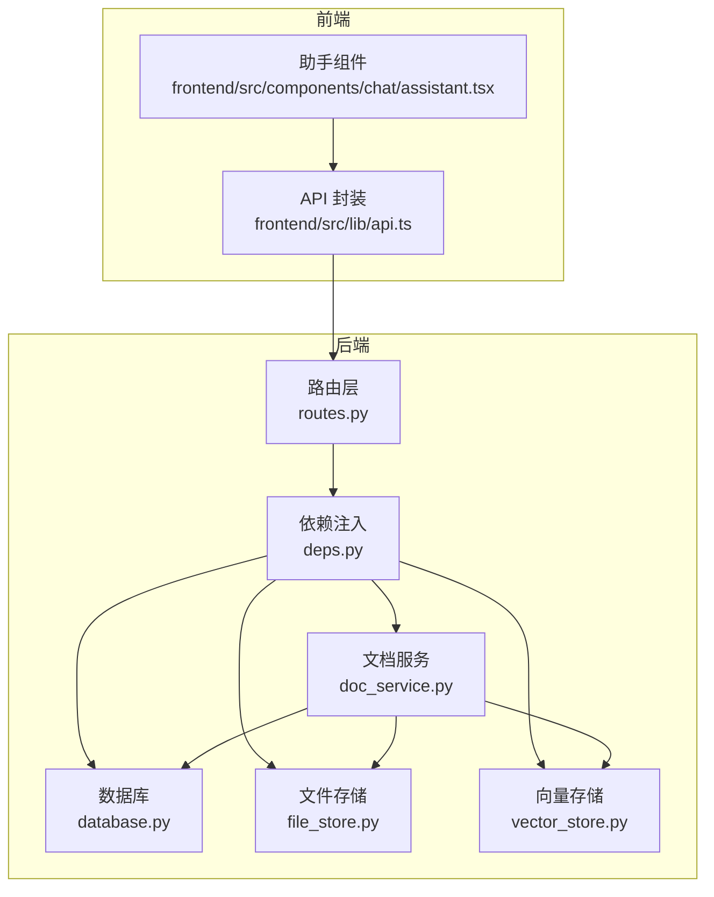
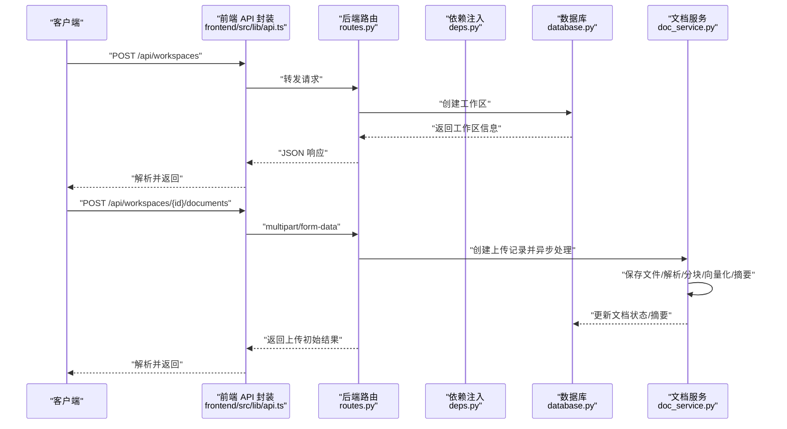
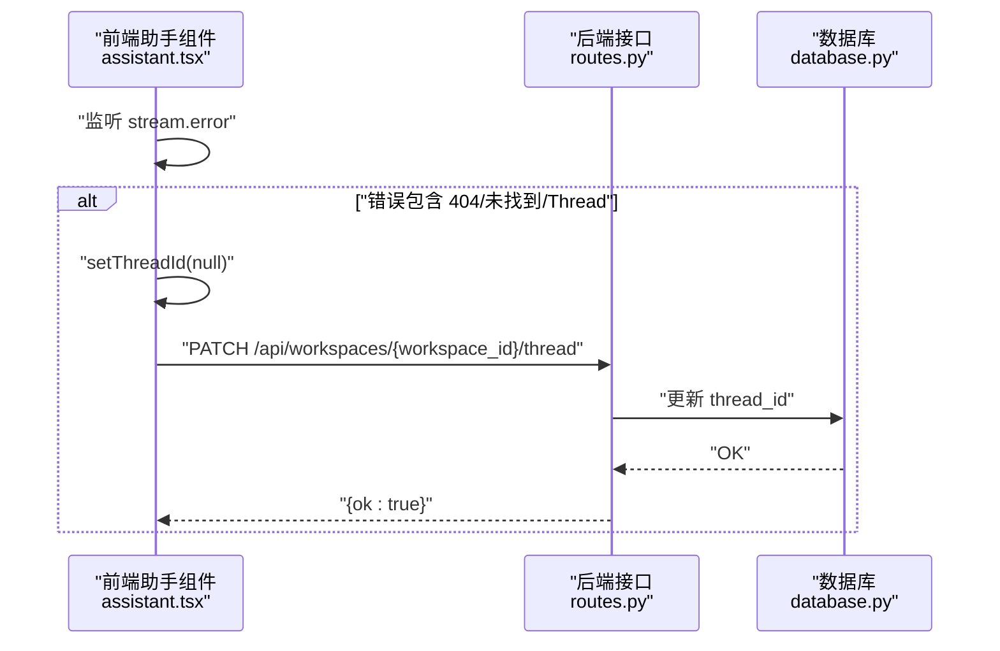
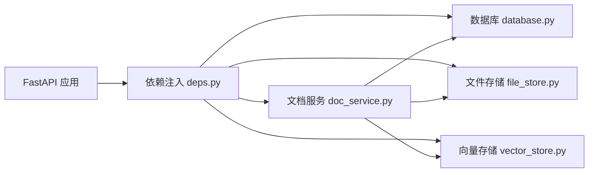
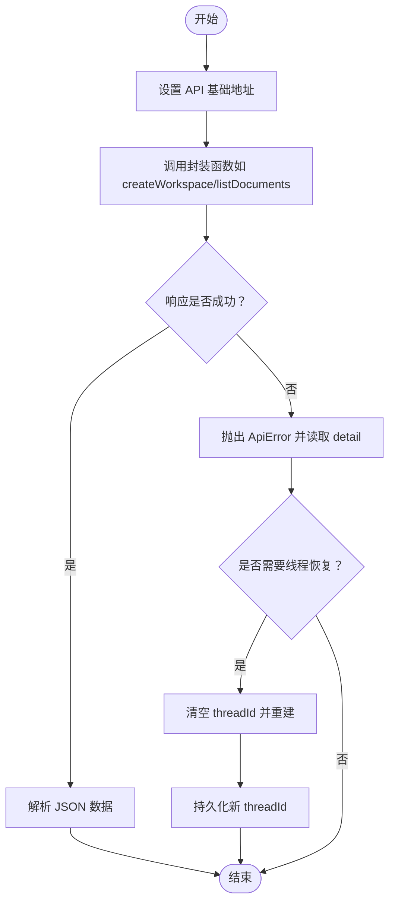

# API 参考文档

<cite>
**本文引用的文件**
- [backend/src/api/routes.py](file://backend/src/api/routes.py)
- [backend/src/api/deps.py](file://backend/src/api/deps.py)
- [backend/src/storage/database.py](file://backend/src/storage/database.py)
- [backend/src/services/doc_service.py](file://backend/src/services/doc_service.py)
- [backend/src/storage/file_store.py](file://backend/src/storage/file_store.py)
- [backend/src/storage/vector_store.py](file://backend/src/storage/vector_store.py)
- [backend/pyproject.toml](file://backend/pyproject.toml)
- [frontend/src/lib/api.ts](file://frontend/src/lib/api.ts)
- [frontend/src/components/chat/assistant.tsx](file://frontend/src/components/chat/assistant.tsx)
- [user-story/10-thread-recovery.md](file://user-story/10-thread-recovery.md)
</cite>

## 目录
1. [简介](#简介)
2. [项目结构](#项目结构)
3. [核心组件](#核心组件)
4. [架构总览](#架构总览)
5. [详细接口说明](#详细接口说明)
6. [依赖与关系分析](#依赖与关系分析)
7. [性能与并发特性](#性能与并发特性)
8. [故障排查与错误处理](#故障排查与错误处理)
9. [客户端集成指南](#客户端集成指南)
10. [结论](#结论)

## 简介
本文件为 Train Agent 的完整 API 参考文档，覆盖后端 FastAPI 提供的 REST 接口与前端 JavaScript/TypeScript 客户端集成方式。内容包括：
- 工作区管理：创建、列出、获取、更新关联线程、删除
- 文档管理：上传、列举、删除；后台异步解析流程与状态
- 任务管理：列举、删除
- 文件下载：按存储路径下载输出文件与文档
- WebSocket/Stream 接口：基于 LangGraph API 的流式交互与自动线程恢复机制
- 认证与授权：当前实现未内置鉴权，建议结合网关或外部鉴权层
- 错误处理、重试与速率限制：现状与建议
- 客户端集成：JavaScript/TypeScript 使用示例与最佳实践

## 项目结构
后端采用 FastAPI + SQLite/ChromaDB 架构，核心模块职责如下：
- 路由层：定义 REST 接口与静态资源挂载
- 依赖注入：统一注入数据库、向量库、文件存储、文档服务与 LLM
- 数据层：SQLite 存储工作区、文档、任务、消息表
- 文档服务：负责文件保存、结构化解析、分块、向量化、摘要生成
- 前端：封装 API 请求、错误处理，并与流式交互配合

图表来源
- [backend/src/api/routes.py:1-189](file://backend/src/api/routes.py#L1-L189)
- [backend/src/api/deps.py:1-30](file://backend/src/api/deps.py#L1-L30)
- [backend/src/storage/database.py:1-379](file://backend/src/storage/database.py#L1-L379)
- [backend/src/storage/file_store.py:1-39](file://backend/src/storage/file_store.py#L1-L39)
- [backend/src/storage/vector_store.py:1-177](file://backend/src/storage/vector_store.py#L1-L177)
- [backend/src/services/doc_service.py:1-218](file://backend/src/services/doc_service.py#L1-L218)
- [frontend/src/lib/api.ts:1-196](file://frontend/src/lib/api.ts#L1-L196)
- [frontend/src/components/chat/assistant.tsx:148-254](file://frontend/src/components/chat/assistant.tsx#L148-L254)

章节来源
- [backend/src/api/routes.py:1-189](file://backend/src/api/routes.py#L1-L189)
- [backend/src/api/deps.py:1-30](file://backend/src/api/deps.py#L1-L30)
- [backend/src/storage/database.py:1-379](file://backend/src/storage/database.py#L1-L379)
- [backend/src/storage/file_store.py:1-39](file://backend/src/storage/file_store.py#L1-L39)
- [backend/src/storage/vector_store.py:1-177](file://backend/src/storage/vector_store.py#L1-L177)
- [backend/src/services/doc_service.py:1-218](file://backend/src/services/doc_service.py#L1-L218)
- [frontend/src/lib/api.ts:1-196](file://frontend/src/lib/api.ts#L1-L196)
- [frontend/src/components/chat/assistant.tsx:148-254](file://frontend/src/components/chat/assistant.tsx#L148-L254)

## 核心组件
- 路由与中间件：定义 REST 接口、CORS 放通、启动初始化数据库
- 依赖注入：从环境变量加载模型与 API Key，构造 AppContext 并注入各服务
- 数据库：SQLite + aiosqlite，维护工作区、文档、任务、消息四张表
- 文档服务：保存文件、结构化解析、分块、向量化、摘要生成
- 文件存储：本地目录按工作区隔离存储
- 向量存储：ChromaDB + Dashscope 嵌入，按工作区命名集合
- 前端 API 封装：统一错误处理、JSON 序列化、FormData 上传

章节来源
- [backend/src/api/routes.py:1-189](file://backend/src/api/routes.py#L1-L189)
- [backend/src/api/deps.py:1-30](file://backend/src/api/deps.py#L1-L30)
- [backend/src/storage/database.py:1-379](file://backend/src/storage/database.py#L1-L379)
- [backend/src/services/doc_service.py:1-218](file://backend/src/services/doc_service.py#L1-L218)
- [backend/src/storage/file_store.py:1-39](file://backend/src/storage/file_store.py#L1-L39)
- [backend/src/storage/vector_store.py:1-177](file://backend/src/storage/vector_store.py#L1-L177)
- [frontend/src/lib/api.ts:1-196](file://frontend/src/lib/api.ts#L1-L196)

## 架构总览
后端通过 FastAPI 暴露 REST 接口，文档服务在后台任务中完成解析与向量化，前端通过 fetch 与 LangGraph 流式接口进行实时交互。

图表来源
- [backend/src/api/routes.py:112-128](file://backend/src/api/routes.py#L112-L128)
- [backend/src/services/doc_service.py:35-55](file://backend/src/services/doc_service.py#L35-L55)
- [backend/src/storage/database.py:285-321](file://backend/src/storage/database.py#L285-L321)
- [frontend/src/lib/api.ts:146-164](file://frontend/src/lib/api.ts#L146-L164)

## 详细接口说明

### 工作区管理
- 创建工作区
  - 方法与路径：POST /api/workspaces
  - 请求体字段：user_id, name
  - 成功响应：工作区对象（包含 id、user_id、name、thread_id、created_at）
  - 失败场景：名称冲突返回 409
- 列出工作区
  - 方法与路径：GET /api/workspaces?user_id=...
  - 查询参数：user_id（必填）
  - 成功响应：工作区数组
- 获取工作区
  - 方法与路径：GET /api/workspaces/{workspace_id}
  - 成功响应：工作区对象
  - 失败场景：不存在返回 404
- 更新工作区关联线程
  - 方法与路径：PATCH /api/workspaces/{workspace_id}/thread
  - 请求体字段：thread_id
  - 成功响应：{"ok": true}
- 删除工作区
  - 方法与路径：DELETE /api/workspaces/{workspace_id}
  - 行为：清理文档、向量库、文件与数据库记录
  - 成功响应：{"ok": true}

章节来源
- [backend/src/api/routes.py:45-106](file://backend/src/api/routes.py#L45-L106)
- [backend/src/storage/database.py:111-156](file://backend/src/storage/database.py#L111-L156)

### 文档管理
- 上传文档
  - 方法与路径：POST /api/workspaces/{workspace_id}/documents
  - 内容类型：multipart/form-data，字段 file
  - 成功响应：文档对象（包含 id、workspace_id、filename、file_type、status、error_message、created_at、updated_at）
  - 后台处理：解析、分块、向量化、摘要生成，状态按顺序流转
- 列举文档
  - 方法与路径：GET /api/workspaces/{workspace_id}/documents
  - 成功响应：文档数组
- 删除文档
  - 方法与路径：DELETE /api/workspaces/{workspace_id}/documents/{doc_id}
  - 行为：删除文件、向量库条目与数据库记录
  - 成功响应：{"ok": true}
- 下载文件
  - 方法与路径：GET /api/files/{file_path:path}
  - 行为：按存储路径下载输出文件或文档
  - 成功响应：二进制文件流
  - 失败场景：路径不存在返回 404

章节来源
- [backend/src/api/routes.py:112-174](file://backend/src/api/routes.py#L112-L174)
- [backend/src/services/doc_service.py:35-131](file://backend/src/services/doc_service.py#L35-L131)
- [backend/src/storage/file_store.py:11-39](file://backend/src/storage/file_store.py#L11-L39)
- [backend/src/storage/vector_store.py:165-177](file://backend/src/storage/vector_store.py#L165-L177)
- [backend/src/storage/database.py:313-339](file://backend/src/storage/database.py#L313-L339)

### 任务管理
- 列举任务
  - 方法与路径：GET /api/workspaces/{workspace_id}/tasks
  - 成功响应：任务数组
- 删除任务
  - 方法与路径：DELETE /api/workspaces/{workspace_id}/tasks/{task_id}
  - 成功响应：{"ok": true}

章节来源
- [backend/src/api/routes.py:147-157](file://backend/src/api/routes.py#L147-L157)
- [backend/src/storage/database.py:359-378](file://backend/src/storage/database.py#L359-L378)

### 消息与线程
- 列举线程消息
  - 方法与路径：GET /api/threads/{thread_id}/messages
  - 查询参数：limit（默认 10，范围 1..100）、before（游标）
  - 成功响应：包含 messages 数组与 next_cursor 的对象

章节来源
- [backend/src/api/routes.py:84-96](file://backend/src/api/routes.py#L84-L96)
- [backend/src/storage/database.py:230-262](file://backend/src/storage/database.py#L230-L262)

### WebSocket/Stream 接口
- 交互模式
  - 基于 LangGraph API 的流式交互，前端通过 useStream hook 发送消息、接收增量输出、处理中断表单与错误
  - 当收到“404/未找到/Thread”类错误时，前端自动清空 threadId 并重建线程，随后将新 threadId 持久化回后端
- 关键行为
  - 自动线程恢复：在 assistant 组件中监听 stream.error，匹配错误关键字后置空 threadId
  - 新线程持久化：检测到新 threadId 后调用 updateWorkspaceThreadId 写回后端
  - 历史消息加载：恢复完成后拉取历史消息并合并到界面

图表来源
- [frontend/src/components/chat/assistant.tsx:148-172](file://frontend/src/components/chat/assistant.tsx#L148-L172)
- [backend/src/api/routes.py:77-81](file://backend/src/api/routes.py#L77-L81)
- [backend/src/storage/database.py:150-155](file://backend/src/storage/database.py#L150-L155)

章节来源
- [frontend/src/components/chat/assistant.tsx:148-172](file://frontend/src/components/chat/assistant.tsx#L148-L172)
- [user-story/10-thread-recovery.md:1-37](file://user-story/10-thread-recovery.md#L1-L37)
- [backend/src/api/routes.py:77-81](file://backend/src/api/routes.py#L77-L81)
- [backend/src/storage/database.py:150-155](file://backend/src/storage/database.py#L150-L155)

## 依赖与关系分析
- 后端依赖
  - FastAPI、Uvicorn、aiosqlite、ChromaDB、DashScope、LangChain、PyMuPDF、python-docx 等
- 环境变量
  - SUMMARIZATION_MODEL/SUMMARIZATION_API_KEY/SUMMARIZATION_API_BASE：摘要 LLM
  - MAIN_MODEL/DEEPSEEK_API_KEY/DEEPSEEK_API_BASE：主模型
  - EMBEDDING_MODEL/EMBEDDING_API_KEY/EMBEDDING_API_BASE：嵌入模型
- 组件耦合
  - 路由层仅做参数校验与转发，业务逻辑集中在数据库与文档服务
  - 文档服务串联文件存储、向量存储与数据库，形成清晰的数据流

图表来源
- [backend/src/api/deps.py:13-29](file://backend/src/api/deps.py#L13-L29)
- [backend/src/storage/database.py:1-379](file://backend/src/storage/database.py#L1-L379)
- [backend/src/storage/file_store.py:1-39](file://backend/src/storage/file_store.py#L1-L39)
- [backend/src/storage/vector_store.py:1-177](file://backend/src/storage/vector_store.py#L1-L177)
- [backend/src/services/doc_service.py:1-218](file://backend/src/services/doc_service.py#L1-L218)

章节来源
- [backend/pyproject.toml:1-41](file://backend/pyproject.toml#L1-L41)
- [backend/src/api/deps.py:1-30](file://backend/src/api/deps.py#L1-L30)

## 性能与并发特性
- 异步数据库：使用 aiosqlite，避免阻塞
- 后台任务：文档上传后立即返回，解析在后台任务中执行，避免阻塞请求
- 向量检索：ChromaDB 批量添加与查询，支持按文档过滤
- 建议
  - 对高频查询增加索引（已存在部分索引）
  - 控制分页大小与批量提交大小，避免单次内存压力过大
  - 对大文件上传增加进度上报与断点续传（当前未实现）

[本节为通用性能讨论，不直接分析具体文件]

## 故障排查与错误处理
- HTTP 状态码
  - 200：成功
  - 404：资源不存在（工作区、文件等）
  - 409：命名冲突（工作区名称重复）
  - 其他：根据异常抛出与前端错误封装
- 前端错误封装
  - 统一捕获非 OK 响应，解析 detail 或回退为状态文本
- 线程恢复
  - 前端在检测到特定错误关键字时自动重建线程并持久化新 ID
- 建议
  - 增加重试与指数退避策略（针对网络抖动）
  - 增加限流与配额控制（当前未实现）
  - 增加统一的错误日志与追踪 ID

章节来源
- [backend/src/api/routes.py:48-51](file://backend/src/api/routes.py#L48-L51)
- [frontend/src/lib/api.ts:25-42](file://frontend/src/lib/api.ts#L25-L42)
- [frontend/src/components/chat/assistant.tsx:148-172](file://frontend/src/components/chat/assistant.tsx#L148-L172)
- [user-story/10-thread-recovery.md:1-37](file://user-story/10-thread-recovery.md#L1-L37)

## 客户端集成指南

### JavaScript/TypeScript 使用示例
- 初始化
  - 设置 NEXT_PUBLIC_API_BASE 指向后端地址
  - 使用封装好的函数进行 CRUD 操作
- 常用操作
  - 创建工作区、列出工作区、获取工作区详情、删除工作区
  - 上传文档（FormData）、列举与删除文档
  - 列举与删除任务
  - 列举线程消息（带分页参数）
- 错误处理
  - 捕获 ApiError，读取 status 与 detail 字段
  - 对 404/未找到/Thread 类错误触发线程重建逻辑（参考前端实现）

图表来源
- [frontend/src/lib/api.ts:1-42](file://frontend/src/lib/api.ts#L1-L42)
- [frontend/src/lib/api.ts:54-81](file://frontend/src/lib/api.ts#L54-L81)
- [frontend/src/lib/api.ts:146-174](file://frontend/src/lib/api.ts#L146-L174)
- [frontend/src/lib/api.ts:177-195](file://frontend/src/lib/api.ts#L177-L195)

章节来源
- [frontend/src/lib/api.ts:1-196](file://frontend/src/lib/api.ts#L1-L196)

## 结论
本 API 文档覆盖了 Train Agent 的核心 REST 接口与前端集成要点。当前实现以简洁为主，未内置鉴权与限流，建议在生产环境中：
- 引入统一鉴权（如 API Key/Token）与权限控制
- 增加速率限制与熔断策略
- 完善可观测性与错误追踪
- 在前端补充断点续传与进度反馈（针对大文件上传）