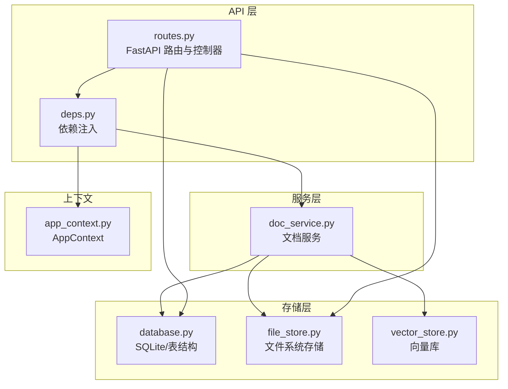
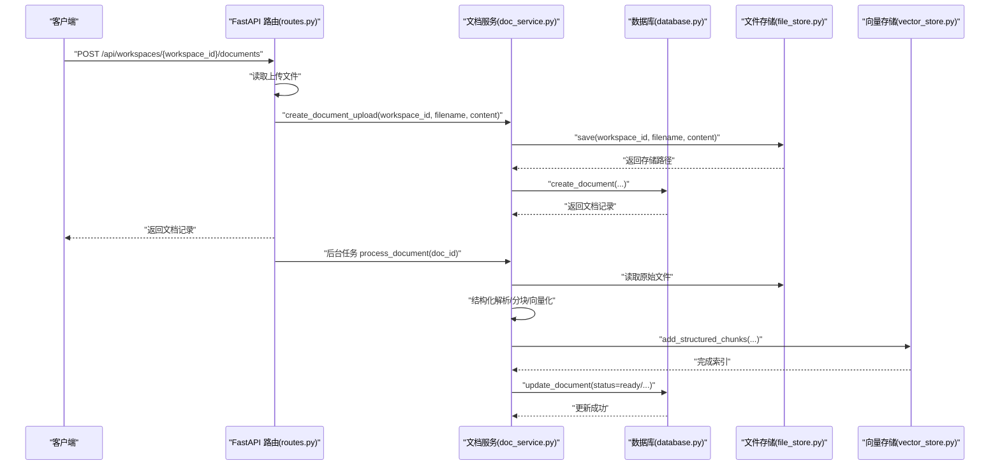
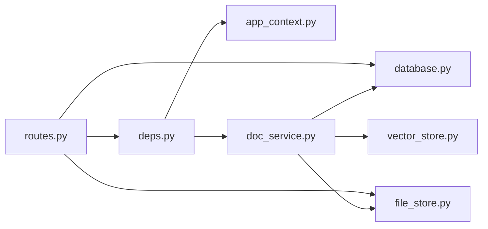

# REST API 文档

<cite>
**本文引用的文件**
- [backend/src/api/routes.py](file://backend/src/api/routes.py)
- [backend/src/api/deps.py](file://backend/src/api/deps.py)
- [backend/src/storage/database.py](file://backend/src/storage/database.py)
- [backend/src/storage/file_store.py](file://backend/src/storage/file_store.py)
- [backend/src/storage/vector_store.py](file://backend/src/storage/vector_store.py)
- [backend/src/services/doc_service.py](file://backend/src/services/doc_service.py)
- [backend/src/app_context.py](file://backend/src/app_context.py)
- [backend/pyproject.toml](file://backend/pyproject.toml)
</cite>

## 目录
1. [简介](#简介)
2. [项目结构](#项目结构)
3. [核心组件](#核心组件)
4. [架构总览](#架构总览)
5. [详细接口规范](#详细接口规范)
6. [依赖关系分析](#依赖关系分析)
7. [性能与可扩展性](#性能与可扩展性)
8. [故障排查指南](#故障排查指南)
9. [结论](#结论)
10. [附录](#附录)

## 简介
本文件为 Train Agent 后端 REST API 的权威参考文档，覆盖工作区、文档、任务、消息与文件下载等接口。文档包含每个接口的 HTTP 方法、URL 模式、请求参数（路径参数、查询参数、请求体）、响应格式、状态码语义，并给出成功与错误场景的 JSON 示例。同时对关键数据模型进行定义说明，解释错误处理机制与常见异常。

## 项目结构
后端采用 FastAPI 应用，路由集中在 routes.py，通过依赖注入模块 deps.py 获取数据库、向量库、文件存储与文档服务实例；数据持久化由 storage/database.py 提供，文件与向量索引分别由 storage/file_store.py 与 storage/vector_store.py 管理；文档处理流程由 services/doc_service.py 实现；应用上下文由 app_context.py 统一装配。

图表来源
- [backend/src/api/routes.py:1-189](file://backend/src/api/routes.py#L1-L189)
- [backend/src/api/deps.py:1-30](file://backend/src/api/deps.py#L1-L30)
- [backend/src/app_context.py:1-31](file://backend/src/app_context.py#L1-L31)
- [backend/src/services/doc_service.py:1-218](file://backend/src/services/doc_service.py#L1-L218)
- [backend/src/storage/database.py:1-379](file://backend/src/storage/database.py#L1-L379)
- [backend/src/storage/file_store.py:1-39](file://backend/src/storage/file_store.py#L1-L39)
- [backend/src/storage/vector_store.py:1-177](file://backend/src/storage/vector_store.py#L1-L177)

章节来源
- [backend/src/api/routes.py:1-189](file://backend/src/api/routes.py#L1-L189)
- [backend/src/api/deps.py:1-30](file://backend/src/api/deps.py#L1-L30)
- [backend/src/app_context.py:1-31](file://backend/src/app_context.py#L1-L31)

## 核心组件
- FastAPI 应用与中间件：CORS 允许跨域，启动事件初始化数据库。
- 数据库（Database）：维护 workspace/document/task/message 表，提供 CRUD 与查询方法。
- 文件存储（FileStore）：按工作区隔离保存上传文件与解析导出的 Markdown。
- 向量存储（VectorStore）：基于 ChromaDB，使用 Dashscope 嵌入模型，支持按文档或工作区检索。
- 文档服务（DocService）：负责文件类型识别、结构化解析、分块、向量化、摘要生成与状态更新。
- 依赖注入（deps.py）：从环境变量加载配置，构建 AppContext 并提供 db/vector_store/file_store/skill_manager 及 DocService 实例。

章节来源
- [backend/src/api/routes.py:1-189](file://backend/src/api/routes.py#L1-L189)
- [backend/src/storage/database.py:1-379](file://backend/src/storage/database.py#L1-L379)
- [backend/src/storage/file_store.py:1-39](file://backend/src/storage/file_store.py#L1-L39)
- [backend/src/storage/vector_store.py:1-177](file://backend/src/storage/vector_store.py#L1-L177)
- [backend/src/services/doc_service.py:1-218](file://backend/src/services/doc_service.py#L1-L218)
- [backend/src/api/deps.py:1-30](file://backend/src/api/deps.py#L1-L30)
- [backend/src/app_context.py:1-31](file://backend/src/app_context.py#L1-L31)

## 架构总览
下图展示请求在各组件间的流转，以“创建/上传文档”为例：

图表来源
- [backend/src/api/routes.py:112-128](file://backend/src/api/routes.py#L112-L128)
- [backend/src/services/doc_service.py:35-130](file://backend/src/services/doc_service.py#L35-L130)
- [backend/src/storage/file_store.py:11-16](file://backend/src/storage/file_store.py#L11-L16)
- [backend/src/storage/database.py:285-311](file://backend/src/storage/database.py#L285-L311)
- [backend/src/storage/vector_store.py:91-122](file://backend/src/storage/vector_store.py#L91-L122)

## 详细接口规范

### 工作区管理

- POST /api/workspaces
  - 请求体：CreateWorkspaceRequest
    - 字段
      - user_id: 字符串，必填
      - name: 字符串，必填
  - 成功响应：JSON 对象
    - 字段
      - id: 字符串
      - user_id: 字符串
      - name: 字符串
  - 错误响应：409 冲突，detail 为冲突原因
  - 示例
    - 成功
      - 请求体：{"user_id":"u1","name":"项目A"}
      - 响应：{"id":"w_xxx","user_id":"u1","name":"项目A"}
    - 冲突
      - 响应：{"detail":"Workspace name already exists"}

- GET /api/workspaces
  - 查询参数
    - user_id: 字符串，必填
  - 成功响应：数组，元素为工作区对象
    - 字段
      - id: 字符串
      - user_id: 字符串
      - name: 字符串
      - thread_id: 字符串（可选）
      - created_at: 字符串（ISO 时间）
  - 示例
    - 响应：[{"id":"w1","user_id":"u1","name":"项目A","thread_id":null,"created_at":"2026-01-01T00:00:00+00:00"}]

- GET /api/workspaces/{workspace_id}
  - 路径参数
    - workspace_id: 字符串，必填
  - 成功响应：工作区对象
  - 错误响应：404 未找到
  - 示例
    - 成功：{"id":"w1","user_id":"u1","name":"项目A","thread_id":null,"created_at":"2026-01-01T00:00:00+00:00"}
    - 未找到：{"detail":"Workspace not found"}

- DELETE /api/workspaces/{workspace_id}
  - 路径参数
    - workspace_id: 字符串，必填
  - 成功响应：{"ok": true}
  - 行为：删除该工作区下的所有文档、向量索引与文件目录，再删除数据库记录
  - 示例
    - 成功：{"ok": true}

章节来源
- [backend/src/api/routes.py:45-106](file://backend/src/api/routes.py#L45-L106)
- [backend/src/storage/database.py:111-155](file://backend/src/storage/database.py#L111-L155)

### 文档管理

- POST /api/workspaces/{workspace_id}/documents
  - 路径参数
    - workspace_id: 字符串，必填
  - 请求体：multipart/form-data
    - file: 文件（必填）
  - 成功响应：文档对象
    - 字段
      - id: 字符串
      - workspace_id: 字符串
      - filename: 字符串
      - file_type: 字符串（pdf/docx/markdown/text/unknown）
      - storage_path: 字符串（绝对路径）
      - summary: 字符串（可选）
      - status: 字符串（uploaded/parsing/parsed/chunking/indexing/summarizing/ready/error）
      - error_message: 字符串（可选）
      - created_at/updated_at: 字符串（ISO 时间）
  - 行为：立即入库并异步处理；后台任务会进行解析、分块、向量化与摘要生成
  - 示例
    - 成功：{"id":"d1","workspace_id":"w1","filename":"a.pdf","file_type":"pdf","storage_path":"/data/files/w1/a.pdf","status":"uploaded","error_message":null,"created_at":"2026-01-01T00:00:00+00:00","updated_at":"2026-01-01T00:00:00+00:00"}

- GET /api/workspaces/{workspace_id}/documents
  - 路径参数
    - workspace_id: 字符串，必填
  - 成功响应：数组，元素为文档对象（同上）
  - 示例
    - 响应：[{"id":"d1","workspace_id":"w1","filename":"a.pdf","file_type":"pdf","status":"ready", ...}]

- DELETE /api/workspaces/{workspace_id}/documents/{doc_id}
  - 路径参数
    - workspace_id: 字符串，必填
    - doc_id: 字符串，必填
  - 成功响应：{"ok": true}
  - 行为：删除文件存储中的原始文件与解析导出的 Markdown，删除向量库中对应 doc_id 的片段，最后删除数据库记录
  - 示例
    - 成功：{"ok": true}

章节来源
- [backend/src/api/routes.py:112-141](file://backend/src/api/routes.py#L112-L141)
- [backend/src/services/doc_service.py:35-166](file://backend/src/services/doc_service.py#L35-L166)
- [backend/src/storage/file_store.py:30-38](file://backend/src/storage/file_store.py#L30-L38)
- [backend/src/storage/vector_store.py:165-170](file://backend/src/storage/vector_store.py#L165-L170)
- [backend/src/storage/database.py:285-338](file://backend/src/storage/database.py#L285-L338)

### 任务管理

- GET /api/workspaces/{workspace_id}/tasks
  - 路径参数
    - workspace_id: 字符串，必填
  - 成功响应：数组，元素为任务对象
    - 字段
      - id: 字符串
      - workspace_id: 字符串
      - type: 字符串
      - title: 字符串（可选）
      - status: 字符串（generating/...）
      - result_data: 字符串（可选）
      - created_at/updated_at: 字符串（ISO 时间）
  - 示例
    - 响应：[{"id":"t1","workspace_id":"w1","type":"rag","title":"检索","status":"generating", ...}]

- DELETE /api/workspaces/{workspace_id}/tasks/{task_id}
  - 路径参数
    - workspace_id: 字符串，必填
    - task_id: 字符串，必填
  - 成功响应：{"ok": true}
  - 示例
    - 成功：{"ok": true}

章节来源
- [backend/src/api/routes.py:147-157](file://backend/src/api/routes.py#L147-L157)
- [backend/src/storage/database.py:342-378](file://backend/src/storage/database.py#L342-L378)

### 消息查询

- GET /api/threads/{thread_id}/messages
  - 路径参数
    - thread_id: 字符串，必填
  - 查询参数
    - limit: 整数，默认 10，范围 [1, 100]
    - before: 整数（可选），用于分页
  - 成功响应：对象
    - messages: 数组，元素为消息对象
      - 字段
        - id: 整数（自增主键）
        - thread_id: 字符串
        - workspace_id: 字符串（可选）
        - message_id: 字符串
        - role: 字符串（如 user/assistant/tool/system 等）
        - type: 字符串（默认与 role 相同）
        - content: 字符串或 JSON（根据实际消息内容）
        - tool_calls: 数组（可选）
        - tool_call_id: 字符串（可选）
        - name: 字符串（可选）
        - additional_kwargs: JSON 对象（可选）
        - response_metadata: JSON 对象（可选）
        - created_at/updated_at: 字符串（ISO 时间）
    - next_cursor: 整数（可选），用于下一页
  - 示例
    - 响应：{"messages":[{"id":1,"thread_id":"th_a","message_id":"msg_1","role":"user","content":"你好","type":"user","created_at":"2026-01-01T00:00:00+00:00","updated_at":"2026-01-01T00:00:00+00:00"}],"next_cursor":null}

章节来源
- [backend/src/api/routes.py:84-96](file://backend/src/api/routes.py#L84-L96)
- [backend/src/storage/database.py:230-280](file://backend/src/storage/database.py#L230-L280)

### 文件下载

- GET /api/files/{file_path:path}
  - 路径参数
    - file_path: 字符串，必填（相对 DATA_DIR 的路径）
  - 成功响应：二进制流（octet-stream），文件名为路径最后一段
  - 错误响应：404 未找到
  - 示例
    - 成功：返回文件内容
    - 未找到：{"detail":"File not found"}

章节来源
- [backend/src/api/routes.py:163-174](file://backend/src/api/routes.py#L163-L174)

### 数据模型定义

- CreateWorkspaceRequest
  - 字段
    - user_id: 字符串，必填
    - name: 字符串，必填
  - 说明：创建工作区时的请求载荷

- UpdateThreadRequest
  - 字段
    - thread_id: 字符串，必填
  - 说明：更新工作区关联的线程 ID

章节来源
- [backend/src/api/routes.py:40-43](file://backend/src/api/routes.py#L40-L43)
- [backend/src/api/routes.py:73-75](file://backend/src/api/routes.py#L73-L75)

## 依赖关系分析

图表来源
- [backend/src/api/routes.py:1-189](file://backend/src/api/routes.py#L1-L189)
- [backend/src/api/deps.py:1-30](file://backend/src/api/deps.py#L1-L30)
- [backend/src/app_context.py:1-31](file://backend/src/app_context.py#L1-L31)
- [backend/src/services/doc_service.py:1-218](file://backend/src/services/doc_service.py#L1-L218)
- [backend/src/storage/database.py:1-379](file://backend/src/storage/database.py#L1-L379)
- [backend/src/storage/file_store.py:1-39](file://backend/src/storage/file_store.py#L1-L39)
- [backend/src/storage/vector_store.py:1-177](file://backend/src/storage/vector_store.py#L1-L177)

章节来源
- [backend/src/api/routes.py:1-189](file://backend/src/api/routes.py#L1-L189)
- [backend/src/api/deps.py:1-30](file://backend/src/api/deps.py#L1-L30)
- [backend/src/app_context.py:1-31](file://backend/src/app_context.py#L1-L31)

## 性能与可扩展性
- 异步与后台任务
  - 文档上传接口立即返回，解析、分块、向量化与摘要生成在后台任务中执行，避免阻塞请求。
- 分页与限制
  - 列举消息接口支持 limit 与 before 分页，限制最大 100 条，降低单次响应体积。
- 存储与索引
  - 文件按工作区隔离存储，便于清理与迁移；向量库按工作区命名集合，支持独立检索与删除。
- 可扩展点
  - 新增嵌入模型可通过实现 EmbeddingFunction 接口替换；新增解析器可在 DocService 中注册。

章节来源
- [backend/src/api/routes.py:112-128](file://backend/src/api/routes.py#L112-L128)
- [backend/src/storage/database.py:230-262](file://backend/src/storage/database.py#L230-L262)
- [backend/src/storage/vector_store.py:13-37](file://backend/src/storage/vector_store.py#L13-L37)

## 故障排查指南
- 404 未找到
  - 工作区不存在：GET /api/workspaces/{workspace_id}
  - 文件不存在：GET /api/files/{file_path:path}
- 409 冲突
  - 工作区名称重复：POST /api/workspaces
- 文档处理失败
  - 处于 error 状态：检查 error_message 字段；可能原因为无可提取文本、OCR 需求或解析异常
- CORS 问题
  - 默认允许任意源访问，若前端跨域受限，请检查代理或浏览器策略
- 环境变量
  - SUMMARIZATION_MODEL/API_KEY/API_BASE、EMBEDDING_MODEL/API_KEY/API_BASE、DATA_DIR 等需正确配置

章节来源
- [backend/src/api/routes.py:48-51](file://backend/src/api/routes.py#L48-L51)
- [backend/src/api/routes.py:66-69](file://backend/src/api/routes.py#L66-L69)
- [backend/src/api/routes.py:167-169](file://backend/src/api/routes.py#L167-L169)
- [backend/src/storage/database.py:118-119](file://backend/src/storage/database.py#L118-L119)
- [backend/src/services/doc_service.py:121-129](file://backend/src/services/doc_service.py#L121-L129)
- [backend/pyproject.toml:1-41](file://backend/pyproject.toml#L1-L41)

## 结论
本文档提供了 Train Agent 后端 REST API 的完整规范与实现依据，涵盖工作区、文档、任务、消息与文件下载五大类接口。通过清晰的参数定义、响应结构与错误处理说明，开发者可快速集成与排障。建议在生产环境中配合限流、鉴权与日志审计完善安全体系。

## 附录

### 常见状态码汇总
- 200 OK：成功获取资源或操作成功
- 201 Created：创建资源（当前接口未显式返回 201）
- 404 Not Found：资源不存在（工作区、文件）
- 409 Conflict：命名冲突（工作区）

章节来源
- [backend/src/api/routes.py:48-51](file://backend/src/api/routes.py#L48-L51)
- [backend/src/api/routes.py:66-69](file://backend/src/api/routes.py#L66-L69)
- [backend/src/api/routes.py:167-169](file://backend/src/api/routes.py#L167-L169)