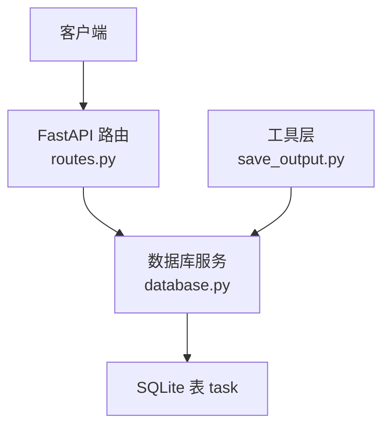
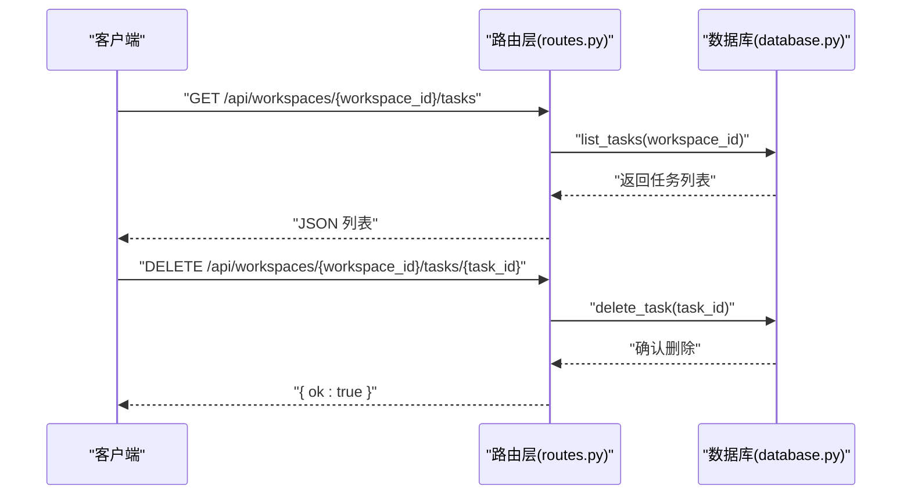
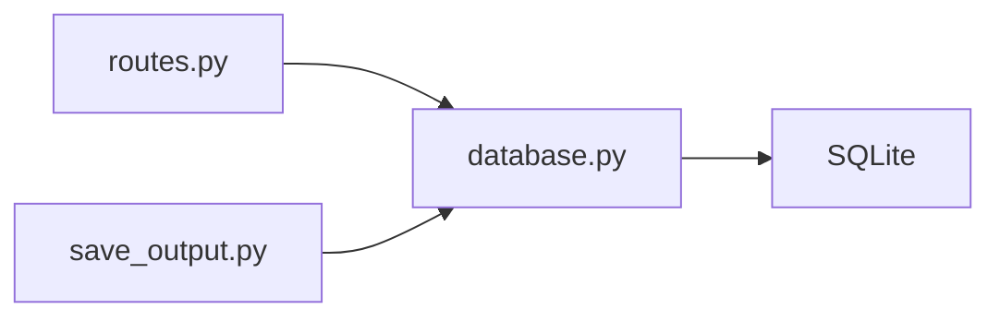

# 任务管理 API

<cite>
**本文引用的文件**
- [backend/src/api/routes.py](file://backend/src/api/routes.py)
- [backend/src/storage/database.py](file://backend/src/storage/database.py)
- [backend/src/tools/save_output.py](file://backend/src/tools/save_output.py)
</cite>

## 目录
1. [简介](#简介)
2. [项目结构](#项目结构)
3. [核心组件](#核心组件)
4. [架构总览](#架构总览)
5. [详细组件分析](#详细组件分析)
6. [依赖分析](#依赖分析)
7. [性能考虑](#性能考虑)
8. [故障排查指南](#故障排查指南)
9. [结论](#结论)

## 简介
本文件为“任务管理 API”的接口文档，聚焦以下两个 REST 接口：
- 获取工作区内任务列表：GET /api/workspaces/{workspace_id}/tasks
- 删除指定任务：DELETE /api/workspaces/{workspace_id}/tasks/{task_id}

同时，文档对任务数据模型字段、任务状态枚举及状态转换规则进行说明，并给出请求/响应示例与使用建议。由于当前仓库未实现基于用户身份的权限校验逻辑，本文亦对权限控制机制提出建议。

## 项目结构
与任务管理相关的核心文件位于后端目录：
- API 路由层：负责接收请求、记录日志、调用数据库服务并返回响应
- 数据存储层：负责 SQLite 表结构、任务 CRUD 操作与迁移
- 工具层：负责产出物保存流程，驱动任务状态变更

图表来源
- [backend/src/api/routes.py:147-157](file://backend/src/api/routes.py#L147-L157)
- [backend/src/storage/database.py:340-379](file://backend/src/storage/database.py#L340-L379)
- [backend/src/tools/save_output.py:13-59](file://backend/src/tools/save_output.py#L13-L59)

章节来源
- [backend/src/api/routes.py:147-157](file://backend/src/api/routes.py#L147-L157)
- [backend/src/storage/database.py:340-379](file://backend/src/storage/database.py#L340-L379)
- [backend/src/tools/save_output.py:13-59](file://backend/src/tools/save_output.py#L13-L59)

## 核心组件
- 路由层（FastAPI）
  - 提供 GET /api/workspaces/{workspace_id}/tasks 与 DELETE /api/workspaces/{workspace_id}/tasks/{task_id} 两个接口
  - 记录请求日志，调用数据库服务执行业务操作
- 存储层（SQLite）
  - 维护 task 表，包含任务主键、所属工作区、类型、标题、状态、结果数据、创建/更新时间等字段
  - 提供 list_tasks、delete_task 等方法
- 工具层（产出物保存）
  - 在生成完成后将任务状态置为 completed 或 failed，并写入结果数据

章节来源
- [backend/src/api/routes.py:147-157](file://backend/src/api/routes.py#L147-L157)
- [backend/src/storage/database.py:46-55](file://backend/src/storage/database.py#L46-L55)
- [backend/src/storage/database.py:359-378](file://backend/src/storage/database.py#L359-L378)
- [backend/src/tools/save_output.py:28-58](file://backend/src/tools/save_output.py#L28-L58)

## 架构总览
下图展示了从客户端到数据库的任务查询与删除流程：

图表来源
- [backend/src/api/routes.py:147-157](file://backend/src/api/routes.py#L147-L157)
- [backend/src/storage/database.py:359-378](file://backend/src/storage/database.py#L359-L378)

## 详细组件分析

### 任务数据模型
任务在数据库中的表结构包含以下字段（以 JSON 字段形式呈现）：
- id：任务唯一标识（字符串）
- workspace_id：所属工作区标识（字符串）
- type：任务类型（字符串）
- title：任务标题（字符串，可空）
- status：任务状态（字符串，默认 generating）
- result_data：任务结果数据（字符串，JSON 文本或空）
- created_at：创建时间（字符串，ISO 时间格式）
- updated_at：更新时间（字符串，ISO 时间格式）

字段来源
- [backend/src/storage/database.py:46-55](file://backend/src/storage/database.py#L46-L55)

#### 字段复杂度与约束
- 主键：id（UUID 字符串）
- 外键：workspace_id 引用 workspace(id)，级联删除
- 默认值：status 默认 generating；created_at/updated_at 默认当前本地时间
- 可空性：title 可空

字段来源
- [backend/src/storage/database.py:25-76](file://backend/src/storage/database.py#L25-L76)

### 任务状态枚举与转换规则
- 状态枚举值
  - pending：待处理（未在当前实现中出现）
  - running：运行中（未在当前实现中出现）
  - completed：已完成
  - failed：失败
- 状态转换
  - 新建任务默认状态为 generating（由工具层创建时设置）
  - 成功保存产出物后，状态更新为 completed，并写入 result_data
  - 保存失败时，状态更新为 failed，并写入错误信息到 result_data
- 注意：当前仓库未暴露状态字段的直接更新接口，状态变化主要由工具层触发

状态来源
- [backend/src/storage/database.py:51](file://backend/src/storage/database.py#L51)
- [backend/src/storage/database.py:356](file://backend/src/storage/database.py#L356)
- [backend/src/tools/save_output.py:46-58](file://backend/src/tools/save_output.py#L46-L58)

### 接口定义与示例

#### 获取任务列表
- 方法与路径
  - GET /api/workspaces/{workspace_id}/tasks
- 请求参数
  - 路径参数：workspace_id（字符串）
- 响应
  - 200 OK：返回任务数组，元素为任务对象（见“任务数据模型”）
- 示例
  - 请求
    - GET /api/workspaces/ws-123/tasks
  - 响应（示例）
    - [
        {
          "id": "task-uuid-1",
          "workspace_id": "ws-123",
          "type": "ppt",
          "title": "新员工消防培训",
          "status": "completed",
          "result_data": "{\"file_path\":\"outputs/xin_yuan_gong_xiao_fang_xun_lian.html\",\"filename\":\"xin_yuan_gong_xiao_fang_xun_lian.html\"}",
          "created_at": "2026-01-01T12:00:00+08:00",
          "updated_at": "2026-01-01T12:05:00+08:00"
        },
        {
          "id": "task-uuid-2",
          "workspace_id": "ws-123",
          "type": "report",
          "title": "Q4 总结报告",
          "status": "failed",
          "result_data": "{\"error\":\"文件写入失败\",\"filename\":\"Q4_zong_jie_bao_gao.md\"}",
          "created_at": "2026-01-01T11:00:00+08:00",
          "updated_at": "2026-01-01T11:02:00+08:00"
        }
      ]

章节来源
- [backend/src/api/routes.py:147-150](file://backend/src/api/routes.py#L147-L150)
- [backend/src/storage/database.py:359-365](file://backend/src/storage/database.py#L359-L365)
- [backend/src/tools/save_output.py:46-58](file://backend/src/tools/save_output.py#L46-L58)

#### 删除任务
- 方法与路径
  - DELETE /api/workspaces/{workspace_id}/tasks/{task_id}
- 请求参数
  - 路径参数：workspace_id（字符串）、task_id（字符串）
- 响应
  - 200 OK：返回 {"ok": true}
- 示例
  - 请求
    - DELETE /api/workspaces/ws-123/tasks/task-uuid-1
  - 响应
    - {"ok": true}

章节来源
- [backend/src/api/routes.py:153-157](file://backend/src/api/routes.py#L153-L157)
- [backend/src/storage/database.py:376-378](file://backend/src/storage/database.py#L376-L378)

### 权限控制与工作区关联
- 工作区关联
  - 任务通过 workspace_id 关联到工作区，且数据库层设置外键约束，支持级联删除
- 权限控制现状
  - 当前路由层未实现基于用户身份的访问控制（例如校验当前用户是否属于目标工作区）
  - 建议在路由层增加鉴权中间件或在数据库查询中加入用户维度过滤
- 实施建议
  - 在路由层对 workspace_id 进行用户归属校验
  - 对 DELETE 接口同样进行权限校验，避免越权删除他人工作区任务

章节来源
- [backend/src/storage/database.py:48](file://backend/src/storage/database.py#L48)
- [backend/src/api/routes.py:147-157](file://backend/src/api/routes.py#L147-L157)

## 依赖分析
- 路由层依赖存储层提供的数据库服务
- 工具层通过数据库服务创建/更新任务状态
- 存储层依赖 SQLite 提供的数据持久化能力

图表来源
- [backend/src/api/routes.py:147-157](file://backend/src/api/routes.py#L147-L157)
- [backend/src/storage/database.py:340-379](file://backend/src/storage/database.py#L340-L379)
- [backend/src/tools/save_output.py:13-59](file://backend/src/tools/save_output.py#L13-L59)

## 性能考虑
- 查询性能
  - 任务列表按创建时间倒序，适合大列表场景；建议在数据库层面建立合适索引（如 workspace_id、created_at）
- 写入性能
  - 任务状态更新为 completed/failed 的写入为单条 UPDATE，开销较小
- 并发与一致性
  - 使用事务与连接池可提升并发稳定性；当前实现为单条 SQL 执行，具备原子性

## 故障排查指南
- 404 未找到
  - 删除任务时若 task_id 不存在，数据库层不会抛异常，但响应仍为成功；如需严格语义，可在路由层先查询是否存在再删除
- 状态不一致
  - 若保存产出物失败，状态会置为 failed，并写入错误信息；检查 result_data 中的 error 字段定位问题
- 日志定位
  - 路由层对任务接口调用有日志记录，便于追踪请求来源与参数

章节来源
- [backend/src/api/routes.py:147-157](file://backend/src/api/routes.py#L147-L157)
- [backend/src/tools/save_output.py:51-58](file://backend/src/tools/save_output.py#L51-L58)

## 结论
- 任务管理 API 已提供基础的查询与删除能力，数据模型清晰，状态流转由工具层驱动
- 当前未实现用户维度的权限校验，建议在路由层补充鉴权逻辑
- 可进一步优化查询性能与错误处理策略，确保接口稳定可靠