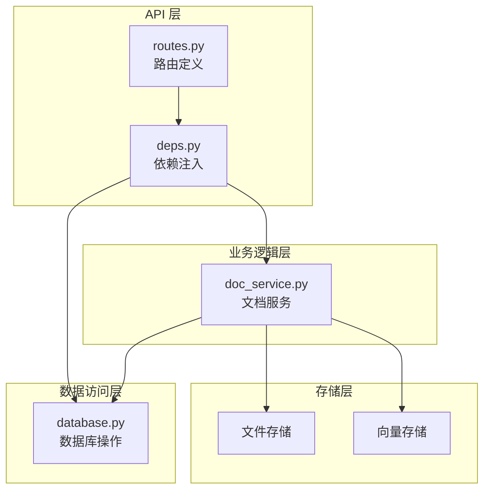
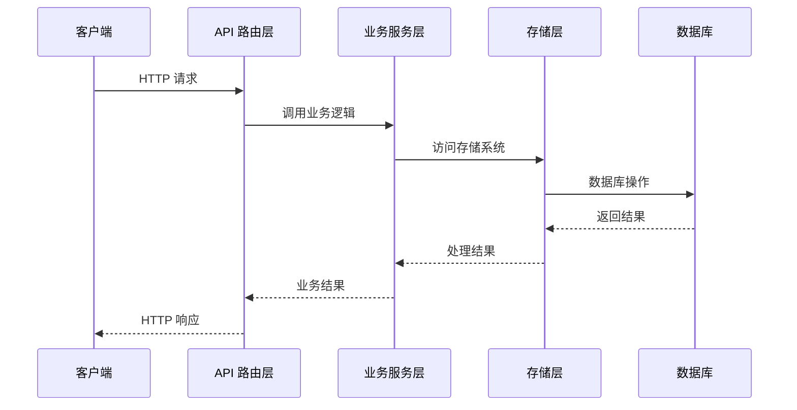
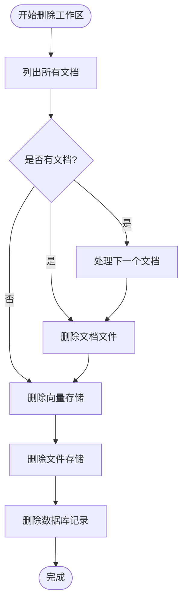

# 工作区管理 API

<cite>
**本文档引用的文件**
- [routes.py](file://backend/src/api/routes.py)
- [database.py](file://backend/src/storage/database.py)
- [doc_service.py](file://backend/src/services/doc_service.py)
- [deps.py](file://backend/src/api/deps.py)
- [api.ts](file://frontend/src/lib/api.ts)
</cite>

## 目录
1. [简介](#简介)
2. [项目结构](#项目结构)
3. [核心组件](#核心组件)
4. [架构概览](#架构概览)
5. [详细接口文档](#详细接口文档)
6. [数据模型定义](#数据模型定义)
7. [错误处理](#错误处理)
8. [使用示例](#使用示例)
9. [性能考虑](#性能考虑)
10. [故障排除指南](#故障排除指南)
11. [结论](#结论)

## 简介

工作区管理 API 提供了对用户工作区的完整 CRUD 操作支持，包括创建工作区、查询工作区列表、获取工作区详情、更新工作区关联的线程以及删除工作区及其关联的所有文档和数据。该 API 基于 FastAPI 构建，采用异步编程模式，确保高性能和良好的用户体验。

## 项目结构

工作区管理功能分布在以下关键模块中：



**图表来源**
- [routes.py:1-189](file://backend/src/api/routes.py#L1-L189)
- [deps.py:1-30](file://backend/src/api/deps.py#L1-L30)

**章节来源**
- [routes.py:1-189](file://backend/src/api/routes.py#L1-L189)
- [deps.py:1-30](file://backend/src/api/deps.py#L1-L30)

## 核心组件

### API 路由组件
- **工作区路由**: 处理所有工作区相关的 HTTP 请求
- **文档路由**: 处理与工作区关联的文档操作
- **任务路由**: 处理工作区内的任务管理

### 服务组件
- **文档服务**: 管理文档上传、解析、索引和清理
- **数据库服务**: 提供工作区数据的持久化存储
- **存储服务**: 管理文件和向量数据的物理存储

**章节来源**
- [routes.py:37-106](file://backend/src/api/routes.py#L37-L106)
- [doc_service.py:13-28](file://backend/src/services/doc_service.py#L13-L28)

## 架构概览

工作区管理 API 采用分层架构设计，确保关注点分离和代码可维护性：



**图表来源**
- [routes.py:45-106](file://backend/src/api/routes.py#L45-L106)
- [doc_service.py:141-152](file://backend/src/services/doc_service.py#L141-L152)

## 详细接口文档

### 创建工作区

**请求方法**: `POST /api/workspaces`

**请求头**:
- Content-Type: application/json

**请求体参数**:
- user_id (string, 必填): 用户标识符
- name (string, 必填): 工作区名称

**响应状态码**:
- 201: 工作区创建成功
- 400: 请求参数无效
- 409: 工作区名称已存在

**响应体**:
```json
{
  "id": "string",
  "user_id": "string",
  "name": "string"
}
```

**章节来源**
- [routes.py:45-53](file://backend/src/api/routes.py#L45-L53)
- [database.py:111-127](file://backend/src/storage/database.py#L111-L127)

### 获取工作区列表

**请求方法**: `GET /api/workspaces`

**查询参数**:
- user_id (string, 必填): 用户标识符

**响应状态码**:
- 200: 查询成功
- 400: 请求参数无效

**响应体**:
```json
[
  {
    "id": "string",
    "user_id": "string",
    "name": "string",
    "thread_id": "string|null",
    "created_at": "string"
  }
]
```

**章节来源**
- [routes.py:56-59](file://backend/src/api/routes.py#L56-L59)
- [database.py:136-142](file://backend/src/storage/database.py#L136-L142)

### 获取工作区详情

**请求方法**: `GET /api/workspaces/{workspace_id}`

**路径参数**:
- workspace_id (string, 必填): 工作区标识符

**响应状态码**:
- 200: 查询成功
- 404: 工作区不存在

**响应体**:
```json
{
  "id": "string",
  "user_id": "string",
  "name": "string",
  "thread_id": "string|null",
  "created_at": "string"
}
```

**章节来源**
- [routes.py:62-70](file://backend/src/api/routes.py#L62-L70)
- [database.py:129-134](file://backend/src/storage/database.py#L129-L134)

### 更新工作区线程

**请求方法**: `PATCH /api/workspaces/{workspace_id}/thread`

**路径参数**:
- workspace_id (string, 必填): 工作区标识符

**请求体参数**:
- thread_id (string, 必填): 线程标识符

**响应状态码**:
- 200: 更新成功
- 400: 请求参数无效

**响应体**:
```json
{
  "ok": true
}
```

**章节来源**
- [routes.py:77-81](file://backend/src/api/routes.py#L77-L81)
- [database.py:150-155](file://backend/src/storage/database.py#L150-L155)

### 删除工作区

**请求方法**: `DELETE /api/workspaces/{workspace_id}`

**路径参数**:
- workspace_id (string, 必填): 工作区标识符

**响应状态码**:
- 200: 删除成功
- 404: 工作区不存在

**响应体**:
```json
{
  "ok": true
}
```

**删除流程**:


**图表来源**
- [routes.py:99-106](file://backend/src/api/routes.py#L99-L106)
- [doc_service.py:141-152](file://backend/src/services/doc_service.py#L141-L152)

**章节来源**
- [routes.py:99-106](file://backend/src/api/routes.py#L99-L106)
- [doc_service.py:141-152](file://backend/src/services/doc_service.py#L141-L152)

## 数据模型定义

### CreateWorkspaceRequest

**字段定义**:
- user_id: string
  - 验证规则: 必填，非空字符串
  - 描述: 用户唯一标识符
- name: string  
  - 验证规则: 必填，去除首尾空白字符
  - 描述: 工作区名称，同一用户下必须唯一

**验证逻辑**:
- 自动去除名称首尾空白字符
- 同一用户下名称大小写不敏感的唯一性检查

**章节来源**
- [routes.py:40-42](file://backend/src/api/routes.py#L40-L42)
- [database.py:111-127](file://backend/src/storage/database.py#L111-L127)

### UpdateThreadRequest

**字段定义**:
- thread_id: string
  - 验证规则: 必填，非空字符串
  - 描述: 线程唯一标识符

**章节来源**
- [routes.py:73-74](file://backend/src/api/routes.py#L73-L74)

### Workspace 数据模型

**字段定义**:
- id: string
  - 类型: UUID 字符串
  - 描述: 工作区唯一标识符
- user_id: string
  - 类型: 字符串
  - 描述: 关联的用户标识符
- name: string
  - 类型: 字符串
  - 描述: 工作区名称
- thread_id: string | null
  - 类型: 字符串或 null
  - 描述: 关联的线程标识符
- created_at: string
  - 类型: ISO 8601 时间戳
  - 描述: 创建时间

**章节来源**
- [api.ts:46-52](file://frontend/src/lib/api.ts#L46-L52)
- [database.py:27-33](file://backend/src/storage/database.py#L27-L33)

## 错误处理

### HTTP 状态码映射

| 状态码 | 错误类型 | 触发条件 |
|--------|----------|----------|
| 200 | 成功 | 操作正常完成 |
| 201 | 创建成功 | 新资源创建成功 |
| 400 | 请求错误 | 参数验证失败 |
| 404 | 资源不存在 | 指定的资源不存在 |
| 409 | 冲突 | 资源名称已存在 |
| 500 | 服务器错误 | 服务器内部错误 |

### 错误响应格式

```json
{
  "detail": "错误描述信息",
  "status_code": 404
}
```

**章节来源**
- [routes.py:50-51](file://backend/src/api/routes.py#L50-L51)
- [routes.py:67-69](file://backend/src/api/routes.py#L67-L69)

## 使用示例

### 创建工作区

**请求**:
```bash
curl -X POST "http://localhost:8000/api/workspaces" \
  -H "Content-Type: application/json" \
  -d '{
    "user_id": "user_123",
    "name": "项目开发"
  }'
```

**响应**:
```json
{
  "id": "ws_789",
  "user_id": "user_123", 
  "name": "项目开发"
}
```

### 获取工作区列表

**请求**:
```bash
curl "http://localhost:8000/api/workspaces?user_id=user_123"
```

**响应**:
```json
[
  {
    "id": "ws_789",
    "user_id": "user_123",
    "name": "项目开发",
    "thread_id": null,
    "created_at": "2024-01-15T10:30:00Z"
  }
]
```

### 更新工作区线程

**请求**:
```bash
curl -X PATCH "http://localhost:8000/api/workspaces/ws_789/thread" \
  -H "Content-Type: application/json" \
  -d '{"thread_id": "thread_xyz"}'
```

**响应**:
```json
{"ok": true}
```

### 删除工作区

**请求**:
```bash
curl -X DELETE "http://localhost:8000/api/workspaces/ws_789"
```

**响应**:
```json
{"ok": true}
```

**章节来源**
- [api.ts:54-81](file://frontend/src/lib/api.ts#L54-L81)

## 性能考虑

### 数据库优化
- 工作区查询使用按创建时间倒序排序，确保最新工作区优先显示
- 文档表使用外键约束和级联删除，自动清理关联数据
- 消息表建立复合索引，优化线程消息查询性能

### 异步处理
- 文档处理采用后台任务异步执行，避免阻塞主请求
- 文件存储和向量索引操作异步进行，提升整体响应速度

### 缓存策略
- 工作区列表按用户维度缓存，减少重复查询
- 最近使用的线程消息进行内存缓存

## 故障排除指南

### 常见问题及解决方案

**问题**: 创建工作区返回 409 状态码
**原因**: 工作区名称已存在
**解决**: 修改工作区名称或使用唯一名称

**问题**: 获取工作区返回 404 状态码  
**原因**: 工作区 ID 不存在或已被删除
**解决**: 验证工作区 ID 或重新创建工作区

**问题**: 删除工作区后仍有数据残留
**原因**: 文档处理任务未完成
**解决**: 等待后台任务完成或重启服务

### 调试建议

1. **启用详细日志**: 在开发环境中启用详细日志输出
2. **检查依赖服务**: 确保数据库、文件存储和向量存储服务正常运行
3. **监控资源使用**: 关注内存和磁盘空间使用情况

**章节来源**
- [routes.py:30-34](file://backend/src/api/routes.py#L30-L34)
- [doc_service.py:141-152](file://backend/src/services/doc_service.py#L141-L152)

## 结论

工作区管理 API 提供了完整的工作区生命周期管理功能，包括创建、查询、更新和删除操作。通过清晰的分层架构设计和完善的错误处理机制，确保了系统的稳定性和可维护性。API 设计遵循 RESTful 原则，参数验证严格，响应格式统一，为前端应用提供了可靠的数据接口支持。