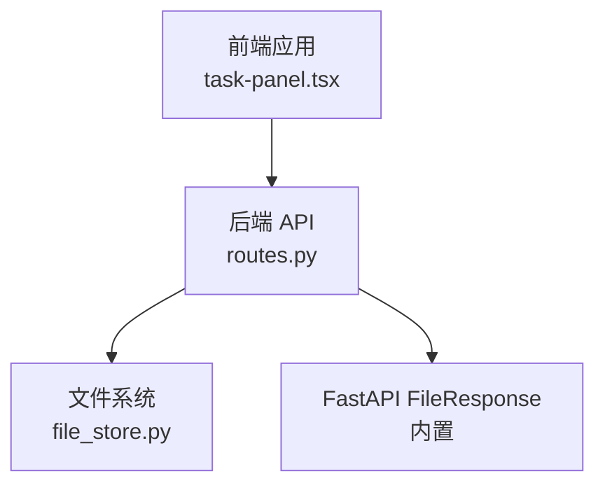
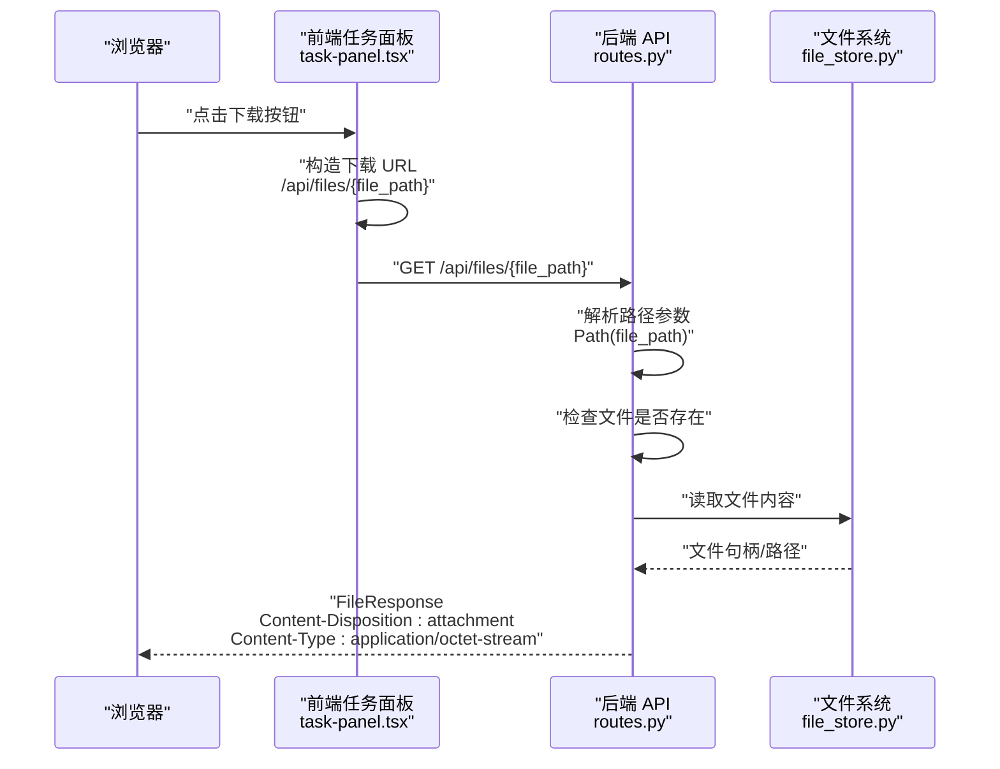
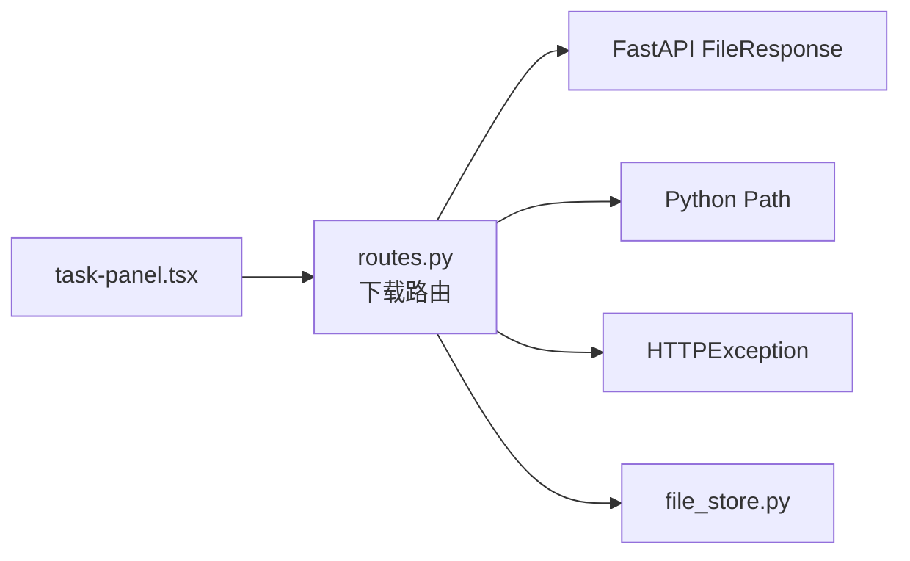

# 文件下载 API

<cite>
**本文引用的文件**
- [routes.py](file://backend/src/api/routes.py)
- [file_store.py](file://backend/src/storage/file_store.py)
- [07-download-output.md](file://user-story/07-download-output.md)
- [task-panel.tsx](file://frontend/src/components/task/task-panel.tsx)
</cite>

## 目录
1. [简介](#简介)
2. [项目结构](#项目结构)
3. [核心组件](#核心组件)
4. [架构总览](#架构总览)
5. [详细组件分析](#详细组件分析)
6. [依赖分析](#依赖分析)
7. [性能考虑](#性能考虑)
8. [故障排除指南](#故障排除指南)
9. [结论](#结论)

## 简介
本文件为后端文件下载 API 的完整接口文档，覆盖 GET /api/files/{file_path:path} 的设计与实现细节。该接口用于根据文件存储路径下载文件，支持输出文件与文档文件的下载；接口会将响应头 Content-Disposition 设为附件下载，并将 Content-Type 设为二进制流类型。文档还包含 URL 路径参数 file_path 的格式要求与安全限制、错误处理流程、以及前端调用方式与示例。

## 项目结构
文件下载功能位于后端 FastAPI 应用中，路由定义在 API 路由模块，文件系统操作由文件存储模块负责。前端通过任务面板构造下载链接并触发浏览器下载。

图表来源
- [routes.py:163-174](file://backend/src/api/routes.py#L163-L174)
- [file_store.py:11-16](file://backend/src/storage/file_store.py#L11-L16)

章节来源
- [routes.py:163-174](file://backend/src/api/routes.py#L163-L174)
- [file_store.py:11-16](file://backend/src/storage/file_store.py#L11-L16)

## 核心组件
- 路由处理器：GET /api/files/{file_path:path}，负责接收文件路径参数并返回文件内容。
- 文件系统封装：FileStore 提供文件写入、异步写入、删除等能力，确保文件落盘与清理。
- 响应对象：使用 FastAPI 内置的 FileResponse，自动设置 Content-Disposition 为附件下载与 Content-Type 为二进制流。

章节来源
- [routes.py:163-174](file://backend/src/api/routes.py#L163-L174)
- [file_store.py:11-16](file://backend/src/storage/file_store.py#L11-L16)

## 架构总览
下图展示了从浏览器到后端 API，再到文件系统的调用链路与数据流向。

图表来源
- [routes.py:163-174](file://backend/src/api/routes.py#L163-L174)
- [task-panel.tsx:142](file://frontend/src/components/task/task-panel.tsx#L142)

章节来源
- [routes.py:163-174](file://backend/src/api/routes.py#L163-L174)
- [task-panel.tsx:142](file://frontend/src/components/task/task-panel.tsx#L142)

## 详细组件分析

### 路由与处理器
- 路径：GET /api/files/{file_path:path}
- 参数：
  - file_path：字符串，表示服务器上文件的绝对或相对路径。当前实现对传入路径进行解析并检查其是否存在。
- 处理逻辑：
  - 解析传入路径为 Path 对象；
  - 若文件不存在，抛出 404 错误；
  - 若文件存在，返回 FileResponse，设置下载文件名为文件实际名称，媒体类型为 application/octet-stream。
- 安全性：
  - 当前实现仅执行“文件存在性”检查，未对路径进行规范化或白名单校验，存在路径遍历风险。

章节来源
- [routes.py:163-174](file://backend/src/api/routes.py#L163-L174)

### 文件系统封装
- FileStore.save：同步写入文件，确保工作区目录存在并写入字节内容，返回存储路径字符串。
- FileStore.save_async：异步安全版本，通过线程池包装阻塞 I/O，避免阻塞事件循环。
- 删除相关：delete/delete_workspace 支持按文件或工作区删除，保障资源清理。

章节来源
- [file_store.py:11-16](file://backend/src/storage/file_store.py#L11-L16)
- [file_store.py:18-28](file://backend/src/storage/file_store.py#L18-L28)
- [file_store.py:30-39](file://backend/src/storage/file_store.py#L30-L39)

### 前端集成
- 前端在任务面板中根据后端返回的 resultData.file_path 组装下载链接，采用隐藏的 <a> 标签触发浏览器下载。
- 下载 URL 格式为：{API_BASE}/api/files/{file_path}，其中 file_path 已进行 URL 编码。

章节来源
- [task-panel.tsx:142](file://frontend/src/components/task/task-panel.tsx#L142)

### 请求/响应示例

- 成功下载
  - 请求：GET /api/files/{file_path}
  - 响应头：
    - Content-Disposition: attachment; filename*=UTF-8''{文件名}
    - Content-Type: application/octet-stream
  - 响应体：文件二进制内容
  - 状态码：200 OK

- 文件不存在
  - 请求：GET /api/files/{file_path}
  - 响应头：无（或由框架默认）
  - 响应体：错误信息（JSON，具体取决于框架默认行为）
  - 状态码：404 Not Found

章节来源
- [routes.py:163-174](file://backend/src/api/routes.py#L163-L174)

### URL 路径参数与安全限制
- 参数格式：file_path 为字符串路径，建议使用服务器上文件的真实存储路径。
- 安全限制：
  - 当前实现未对路径进行规范化（例如去除 ..），也未进行白名单校验，存在路径遍历风险。
  - 建议在生产环境中增加以下安全措施：
    - 将 file_path 规范化为 Path 并检查是否位于允许的基础目录内；
    - 对路径进行白名单校验，仅允许特定工作区或特定类型文件；
    - 对外部输入进行严格编码与校验，避免特殊字符与路径分隔符滥用。

章节来源
- [routes.py:167-169](file://backend/src/api/routes.py#L167-L169)

### 响应头设置
- Content-Disposition：设置为附件下载，强制浏览器弹出保存对话框，文件名为文件实际名称。
- Content-Type：设置为 application/octet-stream，表示通用二进制流，避免浏览器尝试渲染文件。

章节来源
- [routes.py:170-174](file://backend/src/api/routes.py#L170-L174)

### 支持的文件类型与大小限制
- 支持的文件类型：当前实现未对文件类型进行限制，理论上可下载任意类型的文件。
- 文件大小限制：当前实现未对文件大小进行限制，可能受服务器文件系统与 Web 服务器配置影响。
- 建议：
  - 在上传侧设置合理的文件大小上限与类型白名单；
  - 在下载侧可根据业务需求增加大小限制与类型过滤。

章节来源
- [routes.py:163-174](file://backend/src/api/routes.py#L163-L174)

## 依赖分析
- 路由层依赖 FastAPI 的 FileResponse 与 HTTPException；
- 文件系统层依赖 Python 标准库的 Path 与文件 I/O；
- 前端依赖任务面板组件拼接下载 URL 并触发下载。

图表来源
- [routes.py:163-174](file://backend/src/api/routes.py#L163-L174)
- [file_store.py:11-16](file://backend/src/storage/file_store.py#L11-L16)
- [task-panel.tsx:142](file://frontend/src/components/task/task-panel.tsx#L142)

章节来源
- [routes.py:163-174](file://backend/src/api/routes.py#L163-L174)
- [file_store.py:11-16](file://backend/src/storage/file_store.py#L11-L16)
- [task-panel.tsx:142](file://frontend/src/components/task/task-panel.tsx#L142)

## 性能考虑
- 文件下载为 IO 密集型操作，建议：
  - 使用异步 I/O 或线程池避免阻塞；
  - 对大文件采用分块传输或范围请求（Range Requests）以提升体验；
  - 在网关或反向代理层启用压缩与缓存策略（视业务需求）。

## 故障排除指南
- 404 文件未找到
  - 检查 file_path 是否正确且文件确实存在于服务器上；
  - 确认文件权限与路径解析是否符合预期。
- 下载文件名异常
  - 确保 file_path 对应文件的实际名称符合预期；
  - 检查浏览器对 Content-Disposition 的处理。
- 安全问题（路径遍历）
  - 当前实现未做路径规范化与白名单校验，存在风险；
  - 建议在网关或 API 层添加路径规范化与访问控制。

章节来源
- [routes.py:167-169](file://backend/src/api/routes.py#L167-L169)
- [routes.py:170-174](file://backend/src/api/routes.py#L170-L174)

## 结论
GET /api/files/{file_path:path} 提供了基础的文件下载能力，默认以附件形式返回文件内容。当前实现简洁但缺乏安全与类型/大小限制，建议在生产环境中补充路径规范化、白名单校验、类型与大小限制以及更完善的错误处理与日志记录。