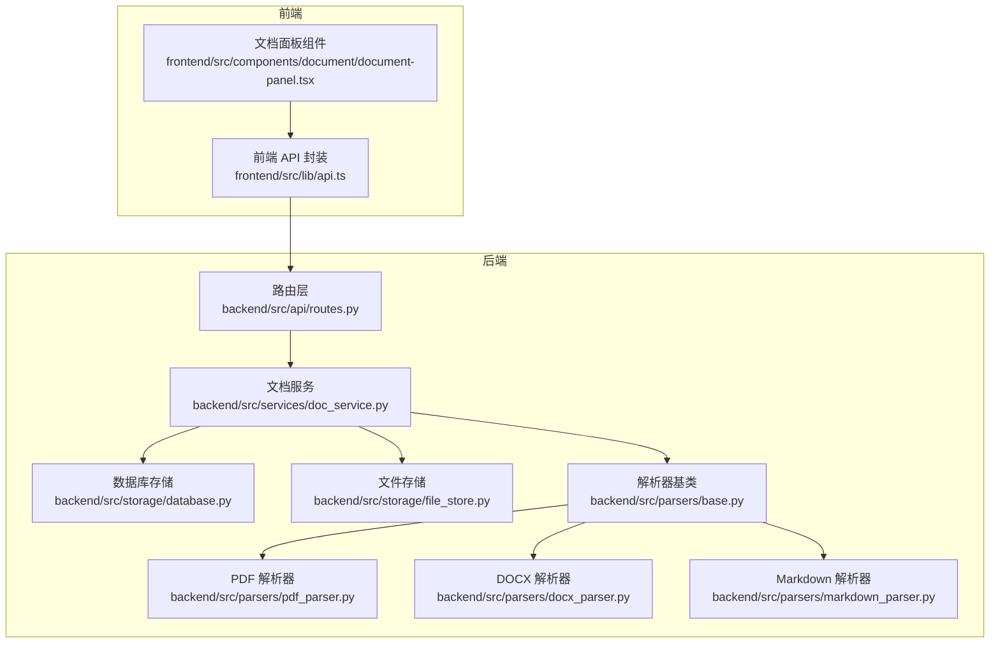
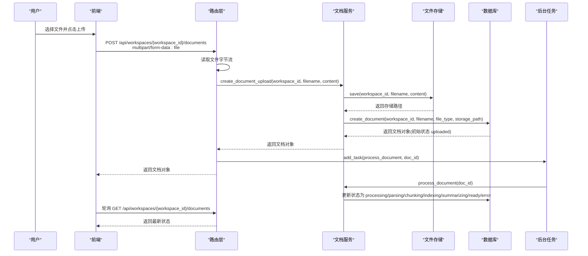
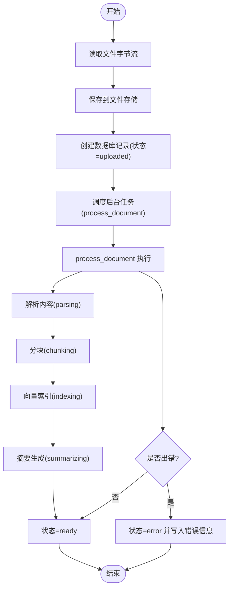

# 文档管理 API

<cite>
**本文引用的文件**
- [backend/src/api/routes.py](file://backend/src/api/routes.py)
- [backend/src/services/doc_service.py](file://backend/src/services/doc_service.py)
- [backend/src/storage/database.py](file://backend/src/storage/database.py)
- [backend/src/storage/file_store.py](file://backend/src/storage/file_store.py)
- [backend/src/parsers/base.py](file://backend/src/parsers/base.py)
- [backend/src/parsers/pdf_parser.py](file://backend/src/parsers/pdf_parser.py)
- [backend/src/parsers/docx_parser.py](file://backend/src/parsers/docx_parser.py)
- [backend/src/parsers/markdown_parser.py](file://backend/src/parsers/markdown_parser.py)
- [frontend/src/lib/api.ts](file://frontend/src/lib/api.ts)
- [frontend/src/components/document/document-panel.tsx](file://frontend/src/components/document/document-panel.tsx)
</cite>

## 目录
1. [简介](#简介)
2. [项目结构](#项目结构)
3. [核心组件](#核心组件)
4. [架构总览](#架构总览)
5. [详细组件分析](#详细组件分析)
6. [依赖关系分析](#依赖关系分析)
7. [性能考虑](#性能考虑)
8. [故障排除指南](#故障排除指南)
9. [结论](#结论)

## 简介
本文件为“文档管理 API”的完整接口文档，覆盖以下三个核心 REST 接口：
- POST /api/workspaces/{workspace_id}/documents：上传文档（支持 PDF、DOCX、Markdown 等），使用 multipart/form-data 格式
- GET /api/workspaces/{workspace_id}/documents：获取工作区内所有文档列表
- DELETE /api/workspaces/{workspace_id}/documents/{doc_id}：删除指定文档

文档还详细说明了文件上传的 Content-Type 要求、文件大小限制、支持的文件格式；解释上传接口的异步处理机制与后台任务触发流程；提供完整的请求/响应示例与文档对象结构；说明文档状态流转（uploading → processing → ready/error）及错误处理机制。

## 项目结构
后端采用 FastAPI 应用，路由层负责接收请求并调度服务层；服务层协调存储层与解析器完成文件保存与内容解析；前端通过 fetch 发起 multipart/form-data 请求，并轮询状态更新。



图表来源
- [backend/src/api/routes.py:112-141](file://backend/src/api/routes.py#L112-L141)
- [backend/src/services/doc_service.py:35-65](file://backend/src/services/doc_service.py#L35-L65)
- [backend/src/storage/database.py:285-338](file://backend/src/storage/database.py#L285-L338)
- [backend/src/storage/file_store.py](file://backend/src/storage/file_store.py)
- [backend/src/parsers/base.py](file://backend/src/parsers/base.py)
- [backend/src/parsers/pdf_parser.py](file://backend/src/parsers/pdf_parser.py)
- [backend/src/parsers/docx_parser.py](file://backend/src/parsers/docx_parser.py)
- [backend/src/parsers/markdown_parser.py](file://backend/src/parsers/markdown_parser.py)
- [frontend/src/lib/api.ts:142-173](file://frontend/src/lib/api.ts#L142-L173)
- [frontend/src/components/document/document-panel.tsx:53-111](file://frontend/src/components/document/document-panel.tsx#L53-L111)

章节来源
- [backend/src/api/routes.py:112-141](file://backend/src/api/routes.py#L112-L141)
- [frontend/src/lib/api.ts:142-173](file://frontend/src/lib/api.ts#L142-L173)

## 核心组件
- 路由层：定义三个文档相关接口，负责参数校验、读取上传文件、触发后台任务、返回标准响应。
- 服务层：封装文档创建与处理逻辑，检测文件类型、保存文件、写入数据库、调度解析与向量化。
- 存储层：数据库持久化文档元数据；文件系统持久化原始文件。
- 解析器：按文件类型进行内容解析，生成可检索的文本片段。
- 前端：封装 fetch 请求，构造 multipart/form-data，提交文件并轮询状态。

章节来源
- [backend/src/api/routes.py:112-141](file://backend/src/api/routes.py#L112-L141)
- [backend/src/services/doc_service.py:35-65](file://backend/src/services/doc_service.py#L35-L65)
- [backend/src/storage/database.py:285-338](file://backend/src/storage/database.py#L285-L338)
- [backend/src/storage/file_store.py](file://backend/src/storage/file_store.py)
- [backend/src/parsers/base.py](file://backend/src/parsers/base.py)
- [frontend/src/lib/api.ts:142-173](file://frontend/src/lib/api.ts#L142-L173)

## 架构总览
下图展示了从用户上传到后台处理的整体流程，包括状态流转与错误处理路径。



图表来源
- [backend/src/api/routes.py:112-128](file://backend/src/api/routes.py#L112-L128)
- [backend/src/services/doc_service.py:35-65](file://backend/src/services/doc_service.py#L35-L65)
- [backend/src/storage/database.py:285-338](file://backend/src/storage/database.py#L285-L338)
- [frontend/src/lib/api.ts:142-173](file://frontend/src/lib/api.ts#L142-L173)

## 详细组件分析

### 接口定义与行为

- POST /api/workspaces/{workspace_id}/documents
  - 功能：上传文档文件，支持 PDF、DOCX、Markdown 等常见格式
  - 请求体：multipart/form-data，字段名为 file
  - Content-Type：multipart/form-data（由浏览器自动设置）
  - 成功响应：返回文档对象（见下方“文档对象结构”）
  - 异步处理：接口立即返回“已上传”状态，后台任务会继续执行解析与索引
  - 错误处理：读取文件失败或保存失败时返回错误（由框架默认异常处理）

- GET /api/workspaces/{workspace_id}/documents
  - 功能：获取工作区内所有文档列表（按创建时间倒序）
  - 成功响应：数组，元素为文档对象

- DELETE /api/workspaces/{workspace_id}/documents/{doc_id}
  - 功能：删除指定文档
  - 成功响应：{"ok": true}

章节来源
- [backend/src/api/routes.py:112-141](file://backend/src/api/routes.py#L112-L141)
- [frontend/src/lib/api.ts:142-173](file://frontend/src/lib/api.ts#L142-L173)

### 文件上传要求与限制

- Content-Type
  - 后端使用 UploadFile 接收 multipart/form-data，字段名固定为 file
  - 前端通过 FormData.append("file", file) 构造请求体

- 文件大小限制
  - 当前代码未在路由层显式设置最大文件大小限制
  - 若需限制，请在路由装饰器中添加 max_content_length 参数（建议在应用配置中统一设置）

- 支持的文件格式
  - 代码中明确支持 PDF、DOCX、Markdown
  - 其他类型将被识别为未知类型，解析器可能无法处理
  - 建议在前端对文件类型进行预校验，避免无效上传

章节来源
- [backend/src/api/routes.py:112-128](file://backend/src/api/routes.py#L112-L128)
- [frontend/src/lib/api.ts:146-164](file://frontend/src/lib/api.ts#L146-L164)
- [frontend/src/components/document/document-panel.tsx:46-51](file://frontend/src/components/document/document-panel.tsx#L46-L51)

### 文档对象结构
上传成功后返回的文档对象包含以下字段：
- id：文档唯一标识
- workspace_id：所属工作区 ID
- filename：原始文件名
- file_type：文件类型（如 pdf、docx、markdown）
- storage_path：文件在存储系统中的路径
- summary：摘要（尚未生成时为 null）
- status：文档状态（初始为 uploaded）
- error_message：错误信息（处理失败时存在）
- created_at：创建时间
- updated_at：最后更新时间

章节来源
- [backend/src/storage/database.py:292-311](file://backend/src/storage/database.py#L292-L311)

### 异步处理与后台任务
- 触发机制：上传接口在返回文档对象后，通过 BackgroundTasks.add_task 调度 process_document
- 处理流程：服务层根据文件类型调用对应解析器，生成可检索文本并写入数据库
- 状态更新：处理过程中会逐步更新状态（processing → parsing → parsed → chunking → indexing → summarizing → ready/error）



图表来源
- [backend/src/api/routes.py:112-128](file://backend/src/api/routes.py#L112-L128)
- [backend/src/services/doc_service.py:57-65](file://backend/src/services/doc_service.py#L57-L65)
- [backend/src/storage/database.py:321-328](file://backend/src/storage/database.py#L321-L328)

### 文档状态流转
- uploaded：文件已上传至存储，等待处理
- processing：进入整体处理流程
- parsing：解析文件内容
- parsed：解析完成，等待后续步骤
- chunking：将解析结果切分为可索引片段
- indexing：构建向量索引
- summarizing：生成摘要
- ready：文档完全可用
- error：处理失败，附带错误信息

前端会周期性轮询文档列表以刷新状态，直到状态变为 ready 或 error。

章节来源
- [frontend/src/components/document/document-panel.tsx:24-44](file://frontend/src/components/document/document-panel.tsx#L24-L44)
- [frontend/src/components/document/document-panel.tsx:71-75](file://frontend/src/components/document/document-panel.tsx#L71-L75)
- [backend/src/storage/database.py:321-328](file://backend/src/storage/database.py#L321-L328)

### 错误处理机制
- 上传阶段：若读取文件或保存失败，将抛出异常（由框架默认处理）
- 处理阶段：process_document 中捕获异常并更新状态为 error，同时写入 error_message
- 前端：上传失败会记录日志并抛出错误；删除失败同样会记录错误

章节来源
- [backend/src/api/routes.py:112-128](file://backend/src/api/routes.py#L112-L128)
- [backend/src/services/doc_service.py:57-65](file://backend/src/services/doc_service.py#L57-L65)
- [backend/src/storage/database.py:321-328](file://backend/src/storage/database.py#L321-L328)
- [frontend/src/lib/api.ts:157-160](file://frontend/src/lib/api.ts#L157-L160)

### 请求/响应示例

- 上传文档（POST /api/workspaces/{workspace_id}/documents）
  - 请求
    - 方法：POST
    - 路径：/api/workspaces/{workspace_id}/documents
    - 头部：Content-Type: multipart/form-data
    - 表单字段：file（二进制文件）
  - 响应（成功）
    - 状态码：200
    - 示例 JSON 字段：id、workspace_id、filename、file_type、storage_path、summary、status、error_message、created_at、updated_at

- 获取文档列表（GET /api/workspaces/{workspace_id}/documents）
  - 请求
    - 方法：GET
    - 路径：/api/workspaces/{workspace_id}/documents
  - 响应（成功）
    - 状态码：200
    - 示例 JSON：数组，每个元素为上述文档对象

- 删除文档（DELETE /api/workspaces/{workspace_id}/documents/{doc_id}）
  - 请求
    - 方法：DELETE
    - 路径：/api/workspaces/{workspace_id}/documents/{doc_id}
  - 响应（成功）
    - 状态码：200
    - 示例 JSON：{"ok": true}

章节来源
- [backend/src/api/routes.py:112-141](file://backend/src/api/routes.py#L112-L141)
- [backend/src/storage/database.py:285-319](file://backend/src/storage/database.py#L285-L319)
- [frontend/src/lib/api.ts:142-173](file://frontend/src/lib/api.ts#L142-L173)

## 依赖关系分析

```mermaid
classDiagram
class Routes {
+POST "/api/workspaces/{workspace_id}/documents"
+GET "/api/workspaces/{workspace_id}/documents"
+DELETE "/api/workspaces/{workspace_id}/documents/{doc_id}"
}
class DocService {
+create_document_upload()
+process_document()
-_detect_type()
}
class Database {
+create_document()
+list_documents()
+update_document()
+delete_document()
}
class FileStore {
+save()
}
class ParserBase {
<<abstract>>
+parse()
}
class PdfParser
class DocxParser
class MarkdownParser
Routes --> DocService : "调用"
DocService --> FileStore : "保存文件"
DocService --> Database : "持久化元数据"
DocService --> ParserBase : "解析内容"
ParserBase <|-- PdfParser
ParserBase <|-- DocxParser
ParserBase <|-- MarkdownParser
```

图表来源
- [backend/src/api/routes.py:112-141](file://backend/src/api/routes.py#L112-L141)
- [backend/src/services/doc_service.py:35-65](file://backend/src/services/doc_service.py#L35-L65)
- [backend/src/storage/database.py:285-338](file://backend/src/storage/database.py#L285-L338)
- [backend/src/storage/file_store.py](file://backend/src/storage/file_store.py)
- [backend/src/parsers/base.py](file://backend/src/parsers/base.py)
- [backend/src/parsers/pdf_parser.py](file://backend/src/parsers/pdf_parser.py)
- [backend/src/parsers/docx_parser.py](file://backend/src/parsers/docx_parser.py)
- [backend/src/parsers/markdown_parser.py](file://backend/src/parsers/markdown_parser.py)

## 性能考虑
- 文件大小限制：建议在路由层或应用中间件设置合理的最大上传大小，避免内存压力
- 并发处理：后台任务串行执行，若文档数量较多，建议引入队列与并发控制
- 存储策略：大文件建议压缩或分块存储，减少磁盘占用与 IO 压力
- 前端轮询：当前前端每 1.5 秒轮询一次，可根据文档数量调整频率，降低服务器压力

## 故障排除指南
- 上传失败
  - 检查文件类型是否受支持（pdf、docx、markdown）
  - 确认 Content-Type 是否为 multipart/form-data
  - 查看后端日志，定位读取/保存阶段的异常
- 处理失败
  - 查看文档对象的 error_message 字段
  - 检查解析器是否正确安装与配置
- 列表不刷新
  - 确认前端轮询逻辑正常运行
  - 检查网络与跨域配置

章节来源
- [frontend/src/components/document/document-panel.tsx:71-75](file://frontend/src/components/document/document-panel.tsx#L71-L75)
- [backend/src/storage/database.py:321-328](file://backend/src/storage/database.py#L321-L328)

## 结论
本文档提供了文档管理 API 的完整接口规范与实现细节，涵盖上传、查询、删除三大操作，明确了文件格式、Content-Type、异步处理与状态流转机制。建议在生产环境中补充文件大小限制、并发控制与更完善的错误提示，以提升稳定性与用户体验。