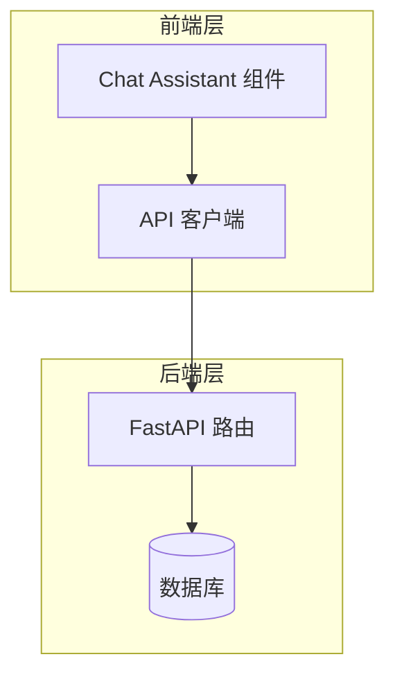
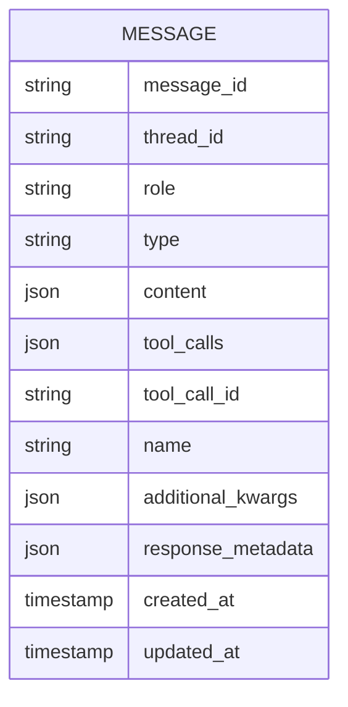
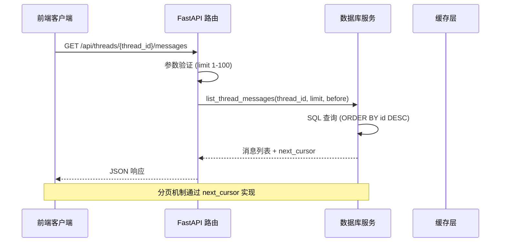
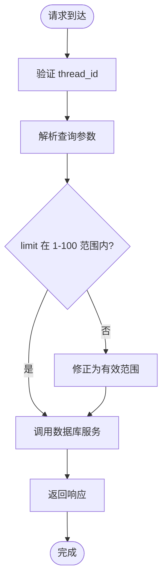
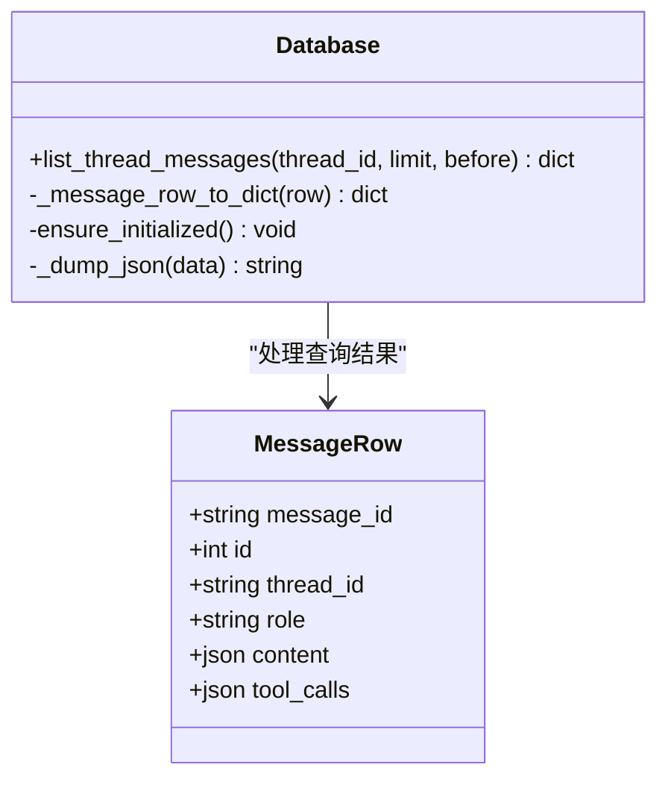
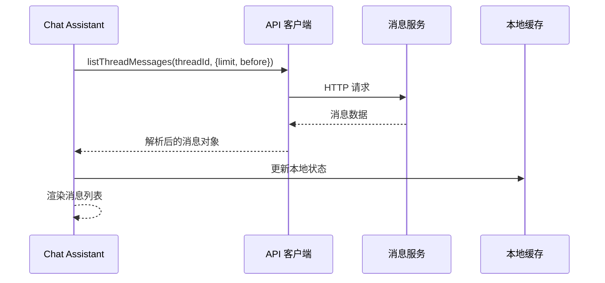
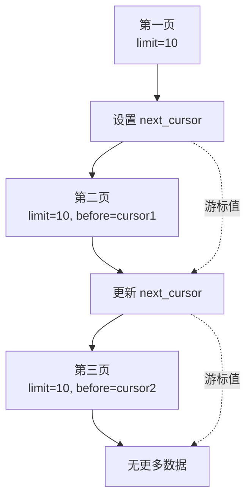
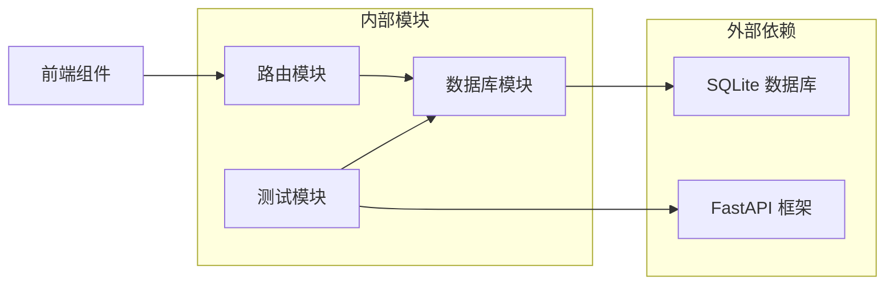

# 消息查询 API

<cite>
**本文档引用的文件**
- [routes.py](file://backend/src/api/routes.py)
- [database.py](file://backend/src/storage/database.py)
- [test_message_history.py](file://backend/tests/test_message_history.py)
- [assistant.tsx](file://frontend/src/components/chat/assistant.tsx)
- [api.ts](file://frontend/src/lib/api.ts)
</cite>

## 目录
1. [简介](#简介)
2. [项目结构](#项目结构)
3. [核心组件](#核心组件)
4. [架构概览](#架构概览)
5. [详细组件分析](#详细组件分析)
6. [依赖关系分析](#依赖关系分析)
7. [性能考虑](#性能考虑)
8. [故障排除指南](#故障排除指南)
9. [结论](#结论)

## 简介

本文档详细描述了消息查询 API 的完整规范，该接口允许根据线程 ID 查询消息历史记录，并支持分页查询和时间过滤功能。该 API 是训练代理系统中消息管理的核心组件，为前端聊天界面提供了消息历史的获取能力。

## 项目结构

消息查询 API 在整个系统中的位置如下：

**图表来源**
- [routes.py:84-96](file://backend/src/api/routes.py#L84-L96)
- [database.py:230-262](file://backend/src/storage/database.py#L230-L262)

**章节来源**
- [routes.py:84-96](file://backend/src/api/routes.py#L84-L96)
- [database.py:230-262](file://backend/src/storage/database.py#L230-L262)

## 核心组件

### API 接口规范

GET /api/threads/{thread_id}/messages 接口提供以下功能：

- **路径参数**:
  - thread_id: 线程标识符 (必需)

- **查询参数**:
  - limit: 返回消息数量限制，默认值为 10，范围 1-100
  - before: 时间戳过滤器，获取指定时间戳之前的消息

- **响应格式**:
  - messages: 消息数组，按时间倒序排列
  - next_cursor: 下一页游标，用于分页导航

**章节来源**
- [routes.py:84-96](file://backend/src/api/routes.py#L84-L96)
- [database.py:230-262](file://backend/src/storage/database.py#L230-L262)

### 数据模型

消息对象包含以下字段结构：

**图表来源**
- [database.py:230-262](file://backend/src/storage/database.py#L230-L262)

**章节来源**
- [database.py:230-262](file://backend/src/storage/database.py#L230-L262)

## 架构概览

消息查询 API 的整体架构流程：

**图表来源**
- [routes.py:84-96](file://backend/src/api/routes.py#L84-L96)
- [database.py:230-262](file://backend/src/storage/database.py#L230-L262)

## 详细组件分析

### 后端实现分析

#### 路由层实现

路由层负责参数验证和请求处理：

**图表来源**
- [routes.py:84-96](file://backend/src/api/routes.py#L84-L96)

#### 数据库层实现

数据库层提供核心查询功能：

**图表来源**
- [database.py:230-262](file://backend/src/storage/database.py#L230-L262)

**章节来源**
- [routes.py:84-96](file://backend/src/api/routes.py#L84-L96)
- [database.py:230-262](file://backend/src/storage/database.py#L230-L262)

### 前端集成分析

#### API 客户端实现

前端通过 API 客户端与后端交互：

**图表来源**
- [assistant.tsx:70-93](file://frontend/src/components/chat/assistant.tsx#L70-L93)
- [api.ts:106-120](file://frontend/src/lib/api.ts#L106-L120)

**章节来源**
- [assistant.tsx:70-93](file://frontend/src/components/chat/assistant.tsx#L70-L93)
- [api.ts:106-120](file://frontend/src/lib/api.ts#L106-L120)

### 分页机制分析

系统采用基于游标的分页机制：

**图表来源**
- [test_message_history.py:37-53](file://backend/tests/test_message_history.py#L37-L53)

**章节来源**
- [test_message_history.py:37-53](file://backend/tests/test_message_history.py#L37-L53)

## 依赖关系分析

### 组件间依赖关系

**图表来源**
- [routes.py:84-96](file://backend/src/api/routes.py#L84-L96)
- [database.py:230-262](file://backend/src/storage/database.py#L230-L262)

### 外部依赖分析

- **FastAPI**: 提供 Web 框架和路由处理能力
- **SQLite**: 存储消息历史数据
- **前端 React**: 提供用户界面和状态管理

**章节来源**
- [routes.py:84-96](file://backend/src/api/routes.py#L84-L96)
- [database.py:230-262](file://backend/src/storage/database.py#L230-L262)

## 性能考虑

### 查询优化策略

1. **索引优化**: 建议在 `message` 表的 `thread_id` 和 `id` 字段上建立索引以提高查询性能

2. **分页优化**: 使用游标分页避免 OFFSET 查询的性能问题

3. **内存管理**: 限制单次查询的最大返回条数 (1-100)

4. **缓存策略**: 建议在应用层实现 LRU 缓存机制存储最近查询的结果

### 性能特征

- **时间复杂度**: O(log n + k)，其中 n 是匹配记录数，k 是返回记录数
- **空间复杂度**: O(k)，返回记录的数量
- **响应时间**: 取决于数据库连接和网络延迟

## 故障排除指南

### 常见问题及解决方案

#### 1. 参数验证错误
- **症状**: HTTP 422 错误
- **原因**: limit 超出范围或 before 参数无效
- **解决**: 确保 limit 在 1-100 范围内，before 必须为正整数

#### 2. 线程不存在
- **症状**: HTTP 404 错误
- **原因**: 指定的 thread_id 不存在
- **解决**: 验证线程 ID 的有效性

#### 3. 分页问题
- **症状**: 重复消息或遗漏消息
- **原因**: 游标使用错误
- **解决**: 正确使用 next_cursor 进行分页

**章节来源**
- [routes.py:84-96](file://backend/src/api/routes.py#L84-L96)
- [test_message_history.py:37-53](file://backend/tests/test_message_history.py#L37-L53)

## 结论

消息查询 API 提供了一个高效、可靠的接口来获取线程消息历史。其设计特点包括：

1. **简洁的接口设计**: 明确的参数规范和响应格式
2. **高效的分页机制**: 基于游标的分页避免了传统 OFFSET 查询的问题
3. **灵活的时间过滤**: 支持基于时间戳的消息过滤
4. **完善的前端集成**: 与聊天界面无缝集成，支持无限滚动

该接口为训练代理系统的消息管理提供了坚实的基础，支持大规模消息历史的高效查询和展示。