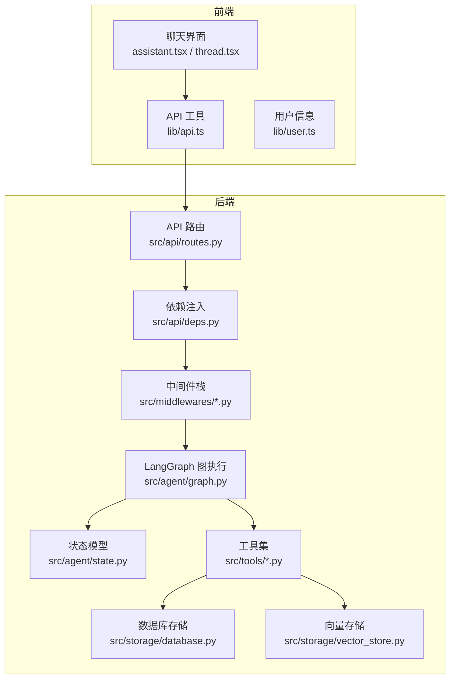
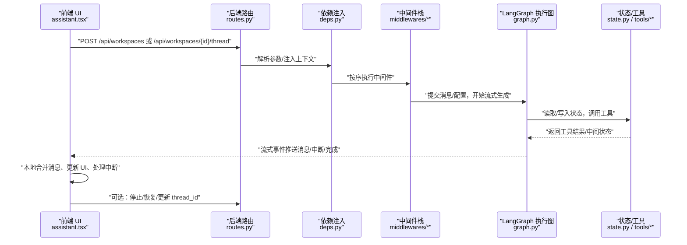
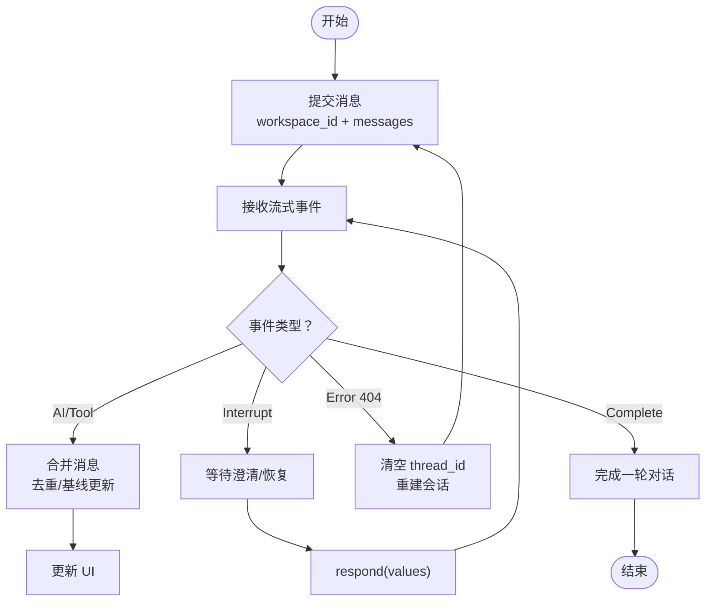
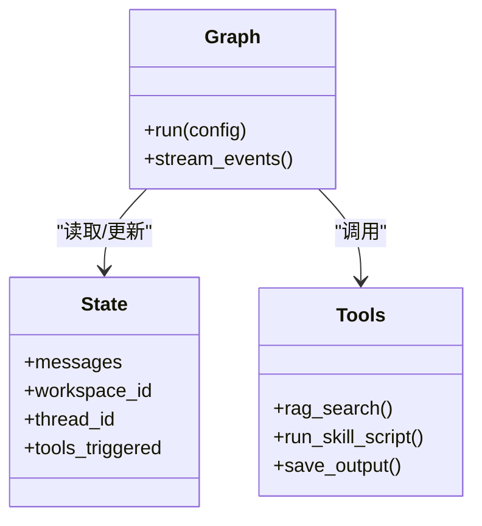
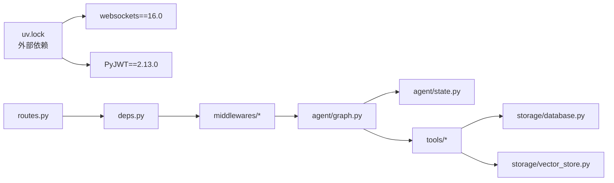

# WebSocket API 文档

<cite>
**本文引用的文件**
- [backend/src/api/routes.py](file://backend/src/api/routes.py)
- [backend/src/api/deps.py](file://backend/src/api/deps.py)
- [backend/src/agent/graph.py](file://backend/src/agent/graph.py)
- [backend/src/agent/state.py](file://backend/src/agent/state.py)
- [backend/src/middlewares/__init__.py](file://backend/src/middlewares/__init__.py)
- [backend/src/middlewares/inject_doc_context.py](file://backend/src/middlewares/inject_doc_context.py)
- [backend/src/middlewares/logging_middlewares.py](file://backend/src/middlewares/logging_middlewares.py)
- [backend/src/middlewares/model_message_sanitizer.py](file://backend/src/middlewares/model_message_sanitizer.py)
- [backend/src/middlewares/summarization.py](file://backend/src/middlewares/summarization.py)
- [backend/src/storage/database.py](file://backend/src/storage/database.py)
- [backend/src/storage/vector_store.py](file://backend/src/storage/vector_store.py)
- [backend/src/tools/rag_search.py](file://backend/src/tools/rag_search.py)
- [backend/src/tools/run_skill_script.py](file://backend/src/tools/run_skill_script.py)
- [backend/src/tools/save_output.py](file://backend/src/tools/save_output.py)
- [backend/uv.lock](file://backend/uv.lock)
- [frontend/src/lib/api.ts](file://frontend/src/lib/api.ts)
- [frontend/src/lib/user.ts](file://frontend/src/lib/user.ts)
- [frontend/src/components/chat/assistant.tsx](file://frontend/src/components/chat/assistant.tsx)
- [frontend/src/components/chat/thread.tsx](file://frontend/src/components/chat/thread.tsx)
- [docs/frontend-architecture.md](file://docs/frontend-architecture.md)
</cite>

## 目录
1. [简介](#简介)
2. [项目结构](#项目结构)
3. [核心组件](#核心组件)
4. [架构总览](#架构总览)
5. [详细组件分析](#详细组件分析)
6. [依赖关系分析](#依赖关系分析)
7. [性能考虑](#性能考虑)
8. [故障排查指南](#故障排查指南)
9. [结论](#结论)
10. [附录](#附录)

## 简介
本文件面向 Train Agent 的 WebSocket/Stream API，聚焦 LangGraph Agent 的实时对话连接机制，覆盖连接建立、握手协议、认证方式、消息格式规范、事件类型与处理流程、流式响应实现、长连接与断线重连策略、性能优化与最佳实践，以及调试与监控方法。本文所有技术细节均基于仓库中实际实现进行归纳总结。

## 项目结构
后端采用 Python（FastAPI）+ LangGraph 的服务端架构；前端采用 Next.js + React，通过 @langchain/react 的 useStream Hook 与后端进行流式通信。整体交互链路如下：

图表来源
- [backend/src/api/routes.py](file://backend/src/api/routes.py)
- [backend/src/api/deps.py](file://backend/src/api/deps.py)
- [backend/src/middlewares/__init__.py](file://backend/src/middlewares/__init__.py)
- [backend/src/agent/graph.py](file://backend/src/agent/graph.py)
- [backend/src/agent/state.py](file://backend/src/agent/state.py)
- [backend/src/storage/database.py](file://backend/src/storage/database.py)
- [backend/src/storage/vector_store.py](file://backend/src/storage/vector_store.py)
- [backend/src/tools/rag_search.py](file://backend/src/tools/rag_search.py)
- [frontend/src/lib/api.ts](file://frontend/src/lib/api.ts)
- [frontend/src/lib/user.ts](file://frontend/src/lib/user.ts)

章节来源
- [backend/src/api/routes.py](file://backend/src/api/routes.py)
- [backend/src/api/deps.py](file://backend/src/api/deps.py)
- [backend/src/middlewares/__init__.py](file://backend/src/middlewares/__init__.py)
- [backend/src/agent/graph.py](file://backend/src/agent/graph.py)
- [backend/src/agent/state.py](file://backend/src/agent/state.py)
- [backend/src/storage/database.py](file://backend/src/storage/database.py)
- [backend/src/storage/vector_store.py](file://backend/src/storage/vector_store.py)
- [frontend/src/lib/api.ts](file://frontend/src/lib/api.ts)
- [frontend/src/lib/user.ts](file://frontend/src/lib/user.ts)

## 核心组件
- 后端 API 路由与依赖注入：负责请求入口、参数解析、上下文注入与中间件编排。
- 中间件栈：日志、消息历史、请求净化、文档上下文注入、摘要中间件等。
- LangGraph 执行图：根据状态驱动节点执行，支持工具调用与流式输出。
- 存储层：数据库与向量存储，支撑 RAG 与持久化。
- 前端 useStream 集成：通过 @langchain/react 与后端建立流式连接，管理消息、中断、停止等。

章节来源
- [backend/src/api/routes.py](file://backend/src/api/routes.py)
- [backend/src/api/deps.py](file://backend/src/api/deps.py)
- [backend/src/middlewares/__init__.py](file://backend/src/middlewares/__init__.py)
- [backend/src/agent/graph.py](file://backend/src/agent/graph.py)
- [frontend/src/components/chat/assistant.tsx](file://frontend/src/components/chat/assistant.tsx)

## 架构总览
下图展示从前端到后端的端到端交互流程，包括连接建立、握手、消息发送/接收、状态更新与错误通知。

图表来源
- [backend/src/api/routes.py](file://backend/src/api/routes.py)
- [backend/src/api/deps.py](file://backend/src/api/deps.py)
- [backend/src/middlewares/__init__.py](file://backend/src/middlewares/__init__.py)
- [backend/src/agent/graph.py](file://backend/src/agent/graph.py)
- [backend/src/agent/state.py](file://backend/src/agent/state.py)
- [frontend/src/components/chat/assistant.tsx](file://frontend/src/components/chat/assistant.tsx)

## 详细组件分析

### 1) 连接建立与握手协议
- 前端通过 @langchain/react 的 useStream 与后端建立长连接，底层依赖 WebSocket/Server-Sent Events（SSE）或兼容的流式传输协议。
- 后端路由提供统一入口，依赖注入模块负责解析请求参数、注入应用上下文与中间件栈。
- 握手阶段包含：
  - 认证：前端携带用户标识（本地生成的用户 ID），后端在中间件中进行访问控制与审计。
  - 会话：通过 workspace_id 与 thread_id 维持对话上下文，若 thread_id 缺失则创建新会话并回写至后端。
  - 配置：recursion_limit 等执行限制在请求中透传给 LangGraph 执行器。

章节来源
- [frontend/src/lib/user.ts](file://frontend/src/lib/user.ts)
- [frontend/src/lib/api.ts](file://frontend/src/lib/api.ts)
- [frontend/src/components/chat/assistant.tsx](file://frontend/src/components/chat/assistant.tsx)
- [backend/src/api/routes.py](file://backend/src/api/routes.py)
- [backend/src/api/deps.py](file://backend/src/api/deps.py)

### 2) 认证与安全
- 用户身份：前端本地生成不可追踪的用户 ID 并缓存于本地存储，避免跨会话泄露。
- 访问控制：中间件栈在进入 Agent 执行前进行日志与安全检查，确保请求合法与可审计。
- JWT 依赖：项目依赖 PyJWT，可用于后续扩展令牌签发与校验（当前实现以本地用户 ID 为主）。

章节来源
- [frontend/src/lib/user.ts](file://frontend/src/lib/user.ts)
- [backend/src/middlewares/__init__.py](file://backend/src/middlewares/__init__.py)
- [backend/uv.lock:2477-2484](file://backend/uv.lock#L2477-L2484)

### 3) 消息格式规范
- 前端消息结构（提交给后端）：
  - 必填字段：messages（数组，元素含 type/content）、workspace_id
  - 可选字段：config（如 recursion_limit）
- LangGraph 消息结构（内部/对外）：
  - 类型：human、ai、tool 等
  - 字段：id、type、content、tool_calls、tool_call_id、name、additional_kwargs、response_metadata 等
- 工具调用提取：
  - 优先从 dedicated tool_calls 属性提取
  - 其次从 content 数组中的 tool_call/tool_use 部分提取
- 合并与去重：
  - 基于消息键（type:id 或 content 哈希）进行去重，避免重复渲染

章节来源
- [frontend/src/components/chat/assistant.tsx](file://frontend/src/components/chat/assistant.tsx)
- [frontend/src/components/chat/thread.tsx](file://frontend/src/components/chat/thread.tsx)

### 4) 事件类型与处理流程
- 事件类型：
  - 消息事件：AI 输出、工具调用、工具返回
  - 中断事件：等待用户澄清（如 ClarifyForm）
  - 完成事件：一轮或多轮对话结束
  - 错误事件：404/Thread 缺失、工具未找到、执行异常等
- 处理流程：
  - 前端监听流式事件，合并历史与实时消息，维护 baseline 集合防止重复
  - 当收到中断时，触发澄清表单，用户确认后通过 respond 继续
  - 当收到 404/Thread 缺失时，自动清空 thread_id 并重建会话
  - 支持主动停止（stop）与恢复（respond）

图表来源
- [frontend/src/components/chat/assistant.tsx](file://frontend/src/components/chat/assistant.tsx)
- [frontend/src/components/chat/thread.tsx](file://frontend/src/components/chat/thread.tsx)

章节来源
- [frontend/src/components/chat/assistant.tsx](file://frontend/src/components/chat/assistant.tsx)
- [frontend/src/components/chat/thread.tsx](file://frontend/src/components/chat/thread.tsx)

### 5) 流式响应与长连接
- 前端 useStream：负责与后端建立长连接，持续接收事件并维护状态（messages/isLoading/interrupt/error/pendingMessage）。
- 后端中间件：在 Agent 执行前后插入日志、消息历史、请求净化、文档上下文注入与摘要中间件，保证稳定性与可观测性。
- 断线重连：当出现 404/Thread 缺失或网络异常时，前端自动清空 thread_id 并重新发起会话；同时保持 pendingMessage，避免丢失用户输入。

章节来源
- [frontend/src/components/chat/assistant.tsx](file://frontend/src/components/chat/assistant.tsx)
- [backend/src/middlewares/__init__.py](file://backend/src/middlewares/__init__.py)
- [backend/src/middlewares/logging_middlewares.py](file://backend/src/middlewares/logging_middlewares.py)
- [backend/src/middlewares/model_message_sanitizer.py](file://backend/src/middlewares/model_message_sanitizer.py)
- [backend/src/middlewares/summarization.py](file://backend/src/middlewares/summarization.py)

### 6) LangGraph 执行图与工具集成
- 执行图：根据状态驱动节点执行，支持多轮对话、工具调用与流式输出。
- 工具集：RAG 搜索、脚本运行、输出保存等，均通过 LangGraph 工具接口注册与调用。
- 状态模型：统一管理对话历史、工作区上下文、工具调用结果等。

图表来源
- [backend/src/agent/graph.py](file://backend/src/agent/graph.py)
- [backend/src/agent/state.py](file://backend/src/agent/state.py)
- [backend/src/tools/rag_search.py](file://backend/src/tools/rag_search.py)
- [backend/src/tools/run_skill_script.py](file://backend/src/tools/run_skill_script.py)
- [backend/src/tools/save_output.py](file://backend/src/tools/save_output.py)

章节来源
- [backend/src/agent/graph.py](file://backend/src/agent/graph.py)
- [backend/src/agent/state.py](file://backend/src/agent/state.py)
- [backend/src/tools/rag_search.py](file://backend/src/tools/rag_search.py)
- [backend/src/tools/run_skill_script.py](file://backend/src/tools/run_skill_script.py)
- [backend/src/tools/save_output.py](file://backend/src/tools/save_output.py)

### 7) 存储与检索增强
- 数据库存储：用于持久化工作区、线程、消息历史等元数据。
- 向量存储：用于 RAG 检索增强，提升回答质量与相关性。
- 中间件注入：在执行前将文档上下文注入到提示词中，提高上下文一致性。

章节来源
- [backend/src/storage/database.py](file://backend/src/storage/database.py)
- [backend/src/storage/vector_store.py](file://backend/src/storage/vector_store.py)
- [backend/src/middlewares/inject_doc_context.py](file://backend/src/middlewares/inject_doc_context.py)

### 8) 前端集成与示例
- Assistant Provider：封装 useStream，管理 threadId、消息合并、中断处理、错误恢复。
- ChatPanel/Thread：负责消息渲染与输入界面，支持按轮次（turn）聚合 AI 与工具消息。
- 完整交互示例（步骤说明）：
  1) 获取/设置 thread_id（workspace_id 与 thread_id 通过后端 API 管理）
  2) 调用 stream.submit 提交 human 消息
  3) 监听流式事件，合并消息并渲染
  4) 若收到中断，弹出澄清表单并调用 stream.respond
  5) 若收到 404，清空 thread_id 并重新发起会话
  6) 可随时调用 stream.stop 停止当前生成

章节来源
- [frontend/src/lib/api.ts](file://frontend/src/lib/api.ts)
- [frontend/src/components/chat/assistant.tsx](file://frontend/src/components/chat/assistant.tsx)
- [frontend/src/components/chat/thread.tsx](file://frontend/src/components/chat/thread.tsx)
- [docs/frontend-architecture.md:207-252](file://docs/frontend-architecture.md#L207-L252)

## 依赖关系分析
- 外部依赖：websockets（16.0）用于 WebSocket 支持，PyJWT（2.13.0）用于令牌处理。
- 内部耦合：API 路由依赖依赖注入模块；依赖注入模块再串联中间件栈；中间件栈影响 LangGraph 执行；执行图依赖状态与工具；工具依赖存储层。

图表来源
- [backend/uv.lock:3421-3464](file://backend/uv.lock#L3421-L3464)
- [backend/uv.lock:2477-2484](file://backend/uv.lock#L2477-L2484)
- [backend/src/api/routes.py](file://backend/src/api/routes.py)
- [backend/src/api/deps.py](file://backend/src/api/deps.py)
- [backend/src/middlewares/__init__.py](file://backend/src/middlewares/__init__.py)
- [backend/src/agent/graph.py](file://backend/src/agent/graph.py)
- [backend/src/agent/state.py](file://backend/src/agent/state.py)
- [backend/src/tools/rag_search.py](file://backend/src/tools/rag_search.py)
- [backend/src/storage/database.py](file://backend/src/storage/database.py)
- [backend/src/storage/vector_store.py](file://backend/src/storage/vector_store.py)

章节来源
- [backend/uv.lock:3421-3464](file://backend/uv.lock#L3421-L3464)
- [backend/uv.lock:2477-2484](file://backend/uv.lock#L2477-L2484)
- [backend/src/api/routes.py](file://backend/src/api/routes.py)
- [backend/src/api/deps.py](file://backend/src/api/deps.py)
- [backend/src/middlewares/__init__.py](file://backend/src/middlewares/__init__.py)
- [backend/src/agent/graph.py](file://backend/src/agent/graph.py)
- [backend/src/agent/state.py](file://backend/src/agent/state.py)
- [backend/src/tools/rag_search.py](file://backend/src/tools/rag_search.py)
- [backend/src/storage/database.py](file://backend/src/storage/database.py)
- [backend/src/storage/vector_store.py](file://backend/src/storage/vector_store.py)

## 性能考虑
- 连接池与并发：后端应限制并发会话数量，结合限流与超时策略，避免资源耗尽。
- 消息队列与背压：前端对高频流事件进行节流与批量合并，减少 UI 重绘压力。
- 内存优化：维护 baseline 集合去重，及时清理历史消息；对长对话启用摘要中间件降低上下文长度。
- 网络抖动：启用指数退避与最大重试次数，避免雪崩效应；对 404/Thread 缺失场景快速自愈。
- 日志与采样：仅对关键路径打点，避免高频日志影响吞吐。

## 故障排查指南
- 常见错误与定位
  - 404/Thread 缺失：前端自动清空 thread_id 并重建会话；检查后端是否正确持久化 thread_id。
  - 工具未找到：检查工具注册与名称一致；确认 LangGraph 工具映射。
  - 执行超时/过深：调整 recursion_limit；必要时拆分任务或增加工具前置过滤。
- 调试工具与监控
  - 前端：打印 stream 状态（threadId/messages/isLoading/error/interrupt），观察消息键去重逻辑。
  - 后端：开启中间件日志（before/after agent/model），定位阻塞点；对 RAG 检索与工具调用分别打点。
  - 存储：核对数据库与向量存储的可用性与索引完整性。

章节来源
- [frontend/src/components/chat/assistant.tsx](file://frontend/src/components/chat/assistant.tsx)
- [backend/src/middlewares/logging_middlewares.py](file://backend/src/middlewares/logging_middlewares.py)
- [backend/src/middlewares/summarization.py](file://backend/src/middlewares/summarization.py)

## 结论
本文件系统梳理了 Train Agent 的 WebSocket/Stream API 与 LangGraph 实时对话机制，明确了连接建立、握手、认证、消息格式、事件处理、流式响应与断线重连策略，并提供了性能优化与故障排查建议。建议在生产环境中结合限流、背压与可观测性方案，确保高并发下的稳定性与用户体验。

## 附录
- 关键实现参考路径
  - 后端 API 路由与依赖：[backend/src/api/routes.py](file://backend/src/api/routes.py)，[backend/src/api/deps.py](file://backend/src/api/deps.py)
  - 中间件栈：[backend/src/middlewares/__init__.py](file://backend/src/middlewares/__init__.py)
  - LangGraph 执行图与状态：[backend/src/agent/graph.py](file://backend/src/agent/graph.py)，[backend/src/agent/state.py](file://backend/src/agent/state.py)
  - 工具与存储：[backend/src/tools/rag_search.py](file://backend/src/tools/rag_search.py)，[backend/src/tools/run_skill_script.py](file://backend/src/tools/run_skill_script.py)，[backend/src/tools/save_output.py](file://backend/src/tools/save_output.py)，[backend/src/storage/database.py](file://backend/src/storage/database.py)，[backend/src/storage/vector_store.py](file://backend/src/storage/vector_store.py)
  - 前端集成：[frontend/src/components/chat/assistant.tsx](file://frontend/src/components/chat/assistant.tsx)，[frontend/src/components/chat/thread.tsx](file://frontend/src/components/chat/thread.tsx)，[frontend/src/lib/api.ts](file://frontend/src/lib/api.ts)，[frontend/src/lib/user.ts](file://frontend/src/lib/user.ts)
  - 架构说明：[docs/frontend-architecture.md:207-252](file://docs/frontend-architecture.md#L207-L252)