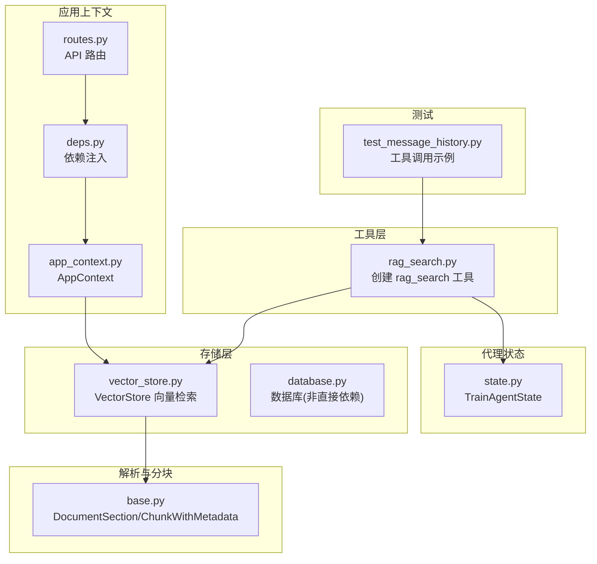
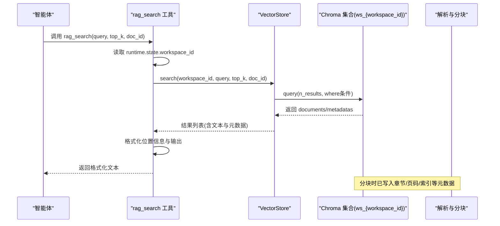
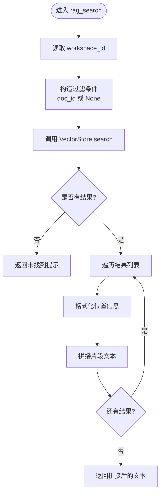
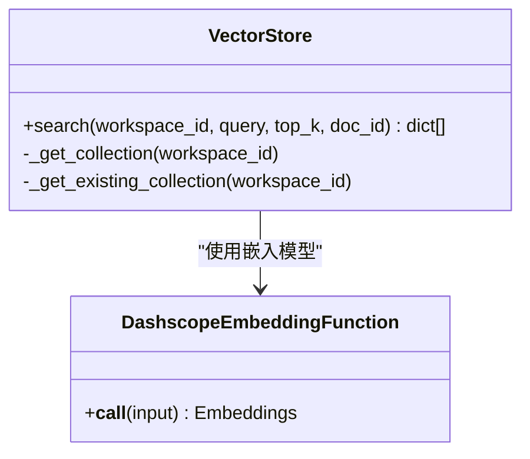
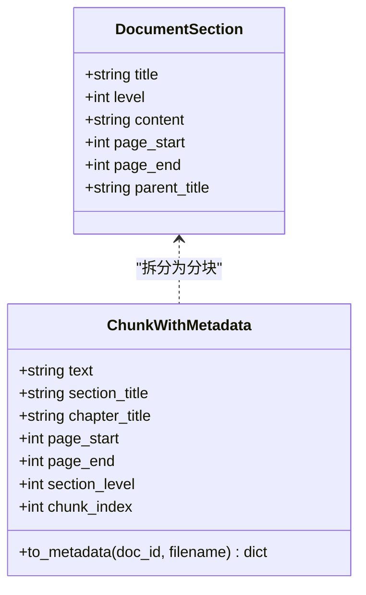
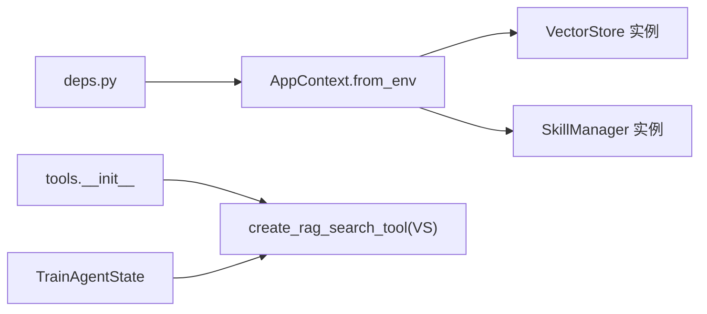
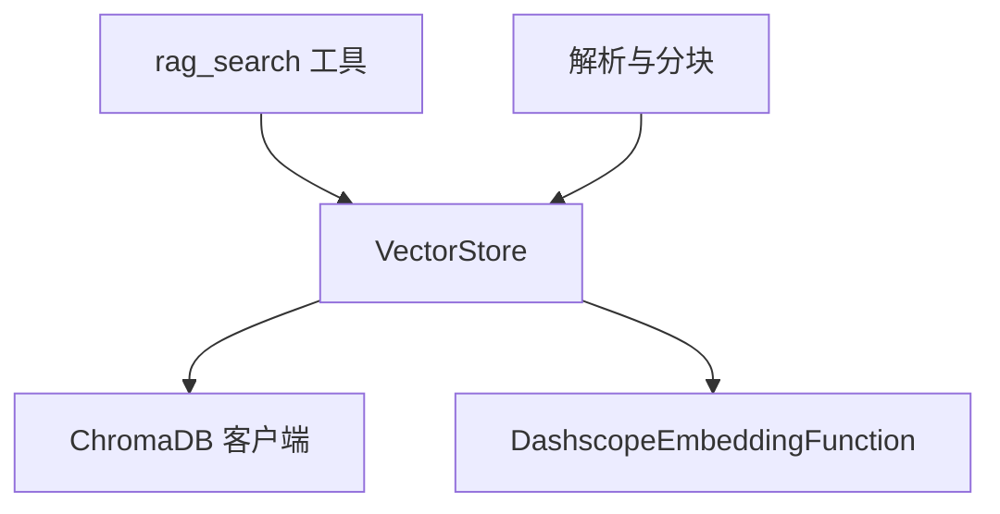

# RAG 搜索工具

<cite>
**本文引用的文件**
- [rag_search.py](file://backend/src/tools/rag_search.py)
- [vector_store.py](file://backend/src/storage/vector_store.py)
- [base.py](file://backend/src/parsers/base.py)
- [state.py](file://backend/src/agent/state.py)
- [__init__.py](file://backend/src/tools/__init__.py)
- [app_context.py](file://backend/src/app_context.py)
- [deps.py](file://backend/src/api/deps.py)
- [routes.py](file://backend/src/api/routes.py)
- [test_message_history.py](file://backend/tests/test_message_history.py)
</cite>

## 目录
1. [简介](#简介)
2. [项目结构](#项目结构)
3. [核心组件](#核心组件)
4. [架构总览](#架构总览)
5. [详细组件分析](#详细组件分析)
6. [依赖分析](#依赖分析)
7. [性能考虑](#性能考虑)
8. [故障排除指南](#故障排除指南)
9. [结论](#结论)
10. [附录](#附录)

## 简介
本文件为 RAG 搜索工具的详细 API 文档，面向需要在智能体工作流中集成“从当前工作区知识库检索相关文档片段”能力的开发者与使用者。该工具通过向量相似度搜索，快速定位与查询最相关的文档片段，并以可读性强的格式返回，便于在对话或任务执行中直接引用。

## 项目结构
RAG 搜索工具位于后端工具层，围绕向量存储与解析元数据协同工作，整体模块关系如下：

图表来源
- [rag_search.py:40-76](file://backend/src/tools/rag_search.py#L40-L76)
- [vector_store.py:39-177](file://backend/src/storage/vector_store.py#L39-L177)
- [base.py:6-97](file://backend/src/parsers/base.py#L6-L97)
- [state.py:4-7](file://backend/src/agent/state.py#L4-L7)
- [app_context.py:12-31](file://backend/src/app_context.py#L12-L31)
- [deps.py:13-30](file://backend/src/api/deps.py#L13-L30)
- [routes.py:10-35](file://backend/src/api/routes.py#L10-L35)
- [test_message_history.py:20-65](file://backend/tests/test_message_history.py#L20-L65)

章节来源
- [rag_search.py:40-76](file://backend/src/tools/rag_search.py#L40-L76)
- [vector_store.py:39-177](file://backend/src/storage/vector_store.py#L39-L177)
- [base.py:6-97](file://backend/src/parsers/base.py#L6-L97)
- [state.py:4-7](file://backend/src/agent/state.py#L4-L7)
- [app_context.py:12-31](file://backend/src/app_context.py#L12-L31)
- [deps.py:13-30](file://backend/src/api/deps.py#L13-L30)
- [routes.py:10-35](file://backend/src/api/routes.py#L10-L35)
- [test_message_history.py:20-65](file://backend/tests/test_message_history.py#L20-L65)

## 核心组件
- 工具函数：rag_search
  - 功能：在当前工作区知识库中检索与 query 最相关的文档片段，支持限定文档范围与控制返回数量。
  - 输入参数：
    - query: 查询字符串
    - top_k: 返回片段数量，默认 5
    - doc_id: 可选，限定仅在指定文档内检索
  - 输出：格式化的文本，包含每个片段的来源文件名、位置信息与正文内容。
- 向量存储：VectorStore.search
  - 功能：基于向量相似度检索，支持按 workspace_id 过滤，并可按 doc_id 二次过滤。
  - 返回：包含文本与元数据（如文档 ID、文件名、章节标题、页码范围、分块索引等）的结果列表。
- 解析与分块：DocumentSection、ChunkWithMetadata
  - 功能：结构化解析文档并生成带元数据的分块，用于向量化与检索。
- 代理状态：TrainAgentState
  - 功能：扩展代理状态，携带 workspace_id 上下文，供工具确定检索作用域。
- 工具装配：tools.__init__
  - 功能：将 rag_search 工具注册到智能体工具集中，依赖 AppContext 提供的向量存储实例。

章节来源
- [rag_search.py:40-76](file://backend/src/tools/rag_search.py#L40-L76)
- [vector_store.py:124-163](file://backend/src/storage/vector_store.py#L124-L163)
- [base.py:6-97](file://backend/src/parsers/base.py#L6-L97)
- [state.py:4-7](file://backend/src/agent/state.py#L4-L7)
- [__init__.py:11-19](file://backend/src/tools/__init__.py#L11-L19)

## 架构总览
RAG 搜索工具在 Agent 工作流中的调用路径如下：

图表来源
- [rag_search.py:40-76](file://backend/src/tools/rag_search.py#L40-L76)
- [vector_store.py:124-163](file://backend/src/storage/vector_store.py#L124-L163)
- [base.py:18-42](file://backend/src/parsers/base.py#L18-L42)

## 详细组件分析

### 组件一：rag_search 工具
- 角色与职责
  - 作为 LangChain 工具，封装向量检索与结果格式化流程。
  - 从代理运行时状态提取工作区上下文，决定检索作用域。
  - 将检索到的片段转换为人类可读的位置信息与结构化输出。
- 关键实现要点
  - 位置信息构建：根据章节标题、段落标题与页码范围生成“层级 > 标题 | 页码”的描述串。
  - 结果格式化：每个片段包含文件名、位置与正文，多片段之间以空行分隔。
  - 错误处理：捕获向量检索异常并返回友好提示；无结果时返回提示信息。
- 使用场景
  - 用户提问与知识库内容相关时触发。
  - 用户明确指定某篇文档时，通过 doc_id 限定检索范围，提升相关性与准确性。

图表来源
- [rag_search.py:40-76](file://backend/src/tools/rag_search.py#L40-L76)
- [rag_search.py:11-37](file://backend/src/tools/rag_search.py#L11-L37)

章节来源
- [rag_search.py:40-76](file://backend/src/tools/rag_search.py#L40-L76)

### 组件二：VectorStore 检索
- 角色与职责
  - 基于 ChromaDB 的持久化客户端，按 workspace_id 获取集合，执行向量查询。
  - 支持按 doc_id 过滤，实现“限定文档内检索”。
- 关键实现要点
  - 集合命名：ws_{workspace_id}，空间为余弦距离。
  - 查询接口：query_texts、n_results、where 条件。
  - 元数据映射：将返回的 metadatas 转换为统一字典结构，包含文本、文档 ID、文件名、分块索引、章节/章节标题、页码范围、层级等。
- 性能与限制
  - top_k 控制返回数量，过大可能影响响应时间。
  - 无匹配集合时返回空列表，避免异常传播。

图表来源
- [vector_store.py:39-177](file://backend/src/storage/vector_store.py#L39-L177)
- [vector_store.py:13-37](file://backend/src/storage/vector_store.py#L13-L37)

章节来源
- [vector_store.py:124-163](file://backend/src/storage/vector_store.py#L124-L163)
- [vector_store.py:39-55](file://backend/src/storage/vector_store.py#L39-L55)

### 组件三：解析与分块（元数据来源）
- 角色与职责
  - 将解析出的结构化章节转换为带元数据的分块，写入向量库以便后续检索。
- 关键实现要点
  - ChunkWithMetadata：包含文本、章节/章节标题、页码范围、层级、分块索引等字段。
  - split_sections_into_chunks：按最大长度与分隔符递归切分，保证语义完整性。
  - to_metadata：将分块转为 ChromaDB 元数据字典，供检索时回填位置信息。

图表来源
- [base.py:6-97](file://backend/src/parsers/base.py#L6-L97)
- [base.py:18-42](file://backend/src/parsers/base.py#L18-L42)

章节来源
- [base.py:47-97](file://backend/src/parsers/base.py#L47-L97)

### 组件四：代理状态与工具装配
- 角色与职责
  - TrainAgentState 扩展了代理状态，携带 workspace_id，使工具可在运行时获取当前工作区上下文。
  - tools.__init__ 将 rag_search 工具注册到智能体工具集，依赖 AppContext 注入的向量存储实例。
  - app_context 与 deps 提供环境变量驱动的依赖注入，确保工具可用。

图表来源
- [state.py:4-7](file://backend/src/agent/state.py#L4-L7)
- [__init__.py:11-19](file://backend/src/tools/__init__.py#L11-L19)
- [app_context.py:19-31](file://backend/src/app_context.py#L19-L31)
- [deps.py:13-30](file://backend/src/api/deps.py#L13-L30)

章节来源
- [state.py:4-7](file://backend/src/agent/state.py#L4-L7)
- [__init__.py:11-19](file://backend/src/tools/__init__.py#L11-L19)
- [app_context.py:19-31](file://backend/src/app_context.py#L19-L31)
- [deps.py:13-30](file://backend/src/api/deps.py#L13-L30)

## 依赖分析
- 工具到存储的依赖
  - rag_search 依赖 VectorStore.search 完成检索。
  - VectorStore.search 依赖 ChromaDB 客户端与 Dashscope 嵌入函数。
- 数据流向
  - 解析阶段：DocumentSection → ChunkWithMetadata → 向量库写入。
  - 检索阶段：rag_search → VectorStore.search → 返回元数据与文本。
- 外部依赖
  - ChromaDB：本地持久化向量数据库。
  - Dashscope：文本嵌入服务（通过环境变量配置）。

图表来源
- [rag_search.py:40-76](file://backend/src/tools/rag_search.py#L40-L76)
- [vector_store.py:39-177](file://backend/src/storage/vector_store.py#L39-L177)
- [base.py:47-97](file://backend/src/parsers/base.py#L47-L97)

章节来源
- [rag_search.py:40-76](file://backend/src/tools/rag_search.py#L40-L76)
- [vector_store.py:39-177](file://backend/src/storage/vector_store.py#L39-L177)
- [base.py:47-97](file://backend/src/parsers/base.py#L47-L97)

## 性能考虑
- top_k 与响应时间
  - top_k 越大，向量库查询与结果拼接耗时越长。建议根据实际对话上下文合理设置（默认 5）。
- 集合存在性
  - 若当前工作区不存在集合，VectorStore.search 直接返回空列表，避免异常开销。
- 嵌入服务稳定性
  - 嵌入服务异常会触发错误日志并抛出运行时错误，工具层捕获后返回友好提示。建议监控 EMBEDDING_* 环境变量配置。
- 文档粒度
  - 分块大小与重叠策略影响检索精度与性能。过小导致碎片过多，过大可能降低相关性。当前采用递归字符分割与固定重叠，平衡效果与性能。

## 故障排除指南
- 搜索无结果
  - 可能原因：当前工作区尚未建立集合；查询过于宽泛或无匹配文本。
  - 处理建议：确认文档已成功处理并完成向量化；缩小查询范围；检查文档是否包含可抽取文本。
- 搜索失败
  - 可能原因：嵌入服务不可用或鉴权失败；ChromaDB 访问异常。
  - 处理建议：检查 EMBEDDING_* 与数据库连接配置；查看日志中的错误堆栈；重试或切换嵌入服务。
- 限定文档检索无效
  - 可能原因：传入 doc_id 为空字符串或未正确传递。
  - 处理建议：确保 doc_id 有效且来自系统提示的“当前知识库文档摘要”；在工具调用前验证 doc_id。
- 输出格式异常
  - 可能原因：元数据缺失（如章节标题、页码）。
  - 处理建议：确认解析与分块流程正常执行；检查分块元数据是否完整写入向量库。

章节来源
- [rag_search.py:55-64](file://backend/src/tools/rag_search.py#L55-L64)
- [vector_store.py:13-37](file://backend/src/storage/vector_store.py#L13-L37)
- [vector_store.py:140-142](file://backend/src/storage/vector_store.py#L140-L142)

## 结论
RAG 搜索工具通过简洁的 API 将向量检索与结果格式化整合，既满足 Agent 工作流中的即时知识检索需求，又保持良好的可维护性与可扩展性。结合合理的参数配置与完善的错误处理，能够在多数场景下稳定地提供高质量的检索结果。

## 附录

### API 定义
- 工具名称：rag_search
- 函数签名：rag_search(runtime, query, top_k=5, doc_id="")
- 输入参数
  - runtime: ToolRuntime[TrainAgentState]，包含代理运行时上下文
  - query: 查询字符串
  - top_k: 返回片段数量（整数，默认 5）
  - doc_id: 文档 ID（字符串，默认空，表示不限定）
- 返回值
  - 字符串：格式化后的检索结果，包含文件名、位置信息与正文；若无结果则返回提示信息；若检索异常则返回错误提示

章节来源
- [rag_search.py:40-76](file://backend/src/tools/rag_search.py#L40-L76)

### 使用示例（Agent 工作流）
- 在消息记录中包含工具调用
  - 示例字段：tool_calls 中包含 name 为 "rag_search"，args 包含 query 等参数
- 测试用例参考
  - 工具调用记录与 JSON 序列化校验

章节来源
- [test_message_history.py:20-65](file://backend/tests/test_message_history.py#L20-L65)