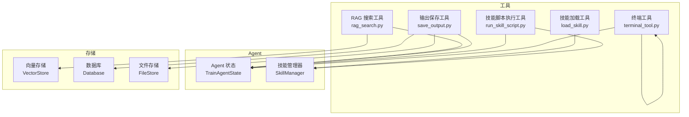
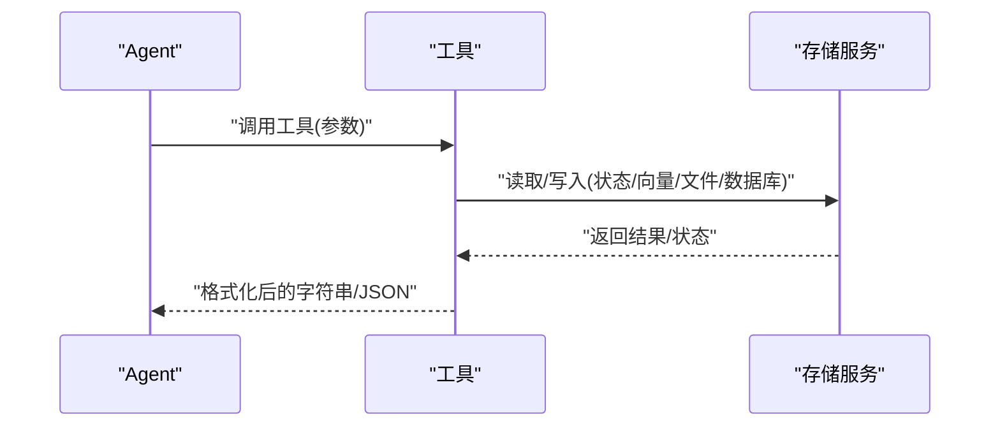
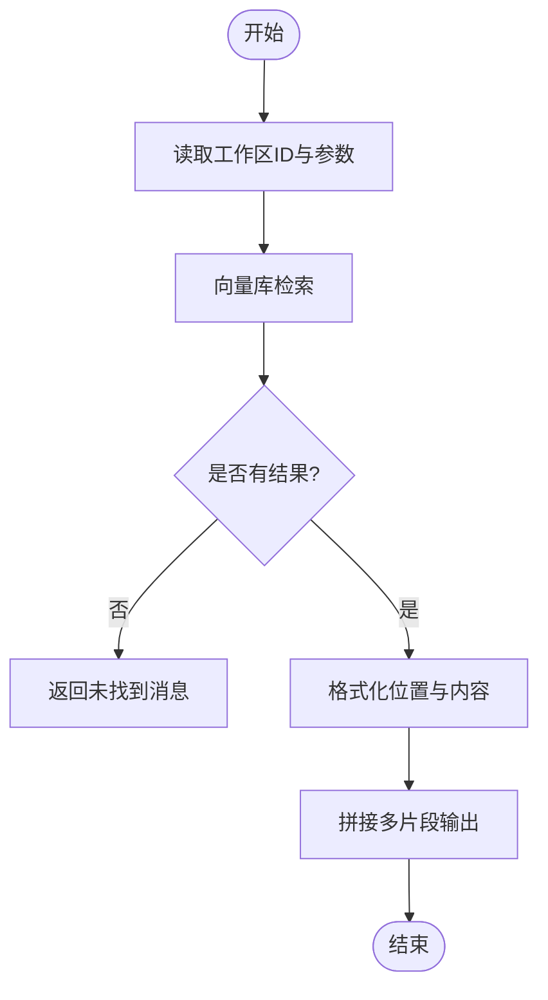
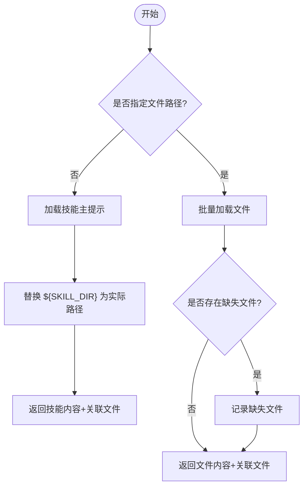
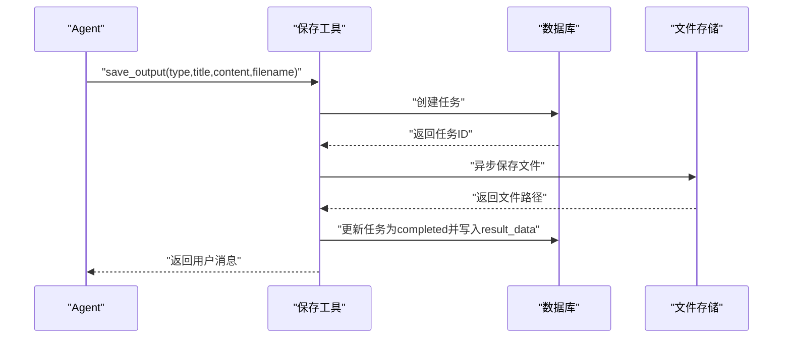
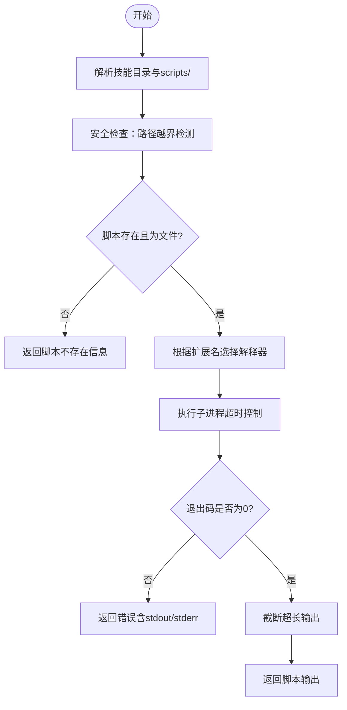
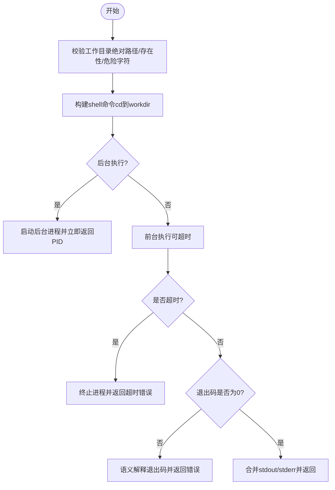
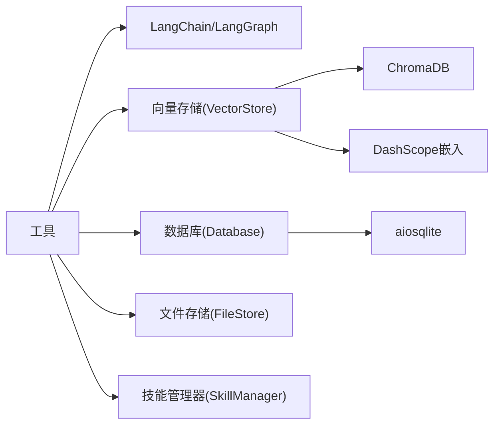

# 工具 API 文档

<cite>
**本文引用的文件**
- [rag_search.py](file://backend/src/tools/rag_search.py)
- [load_skill.py](file://backend/src/tools/load_skill.py)
- [save_output.py](file://backend/src/tools/save_output.py)
- [run_skill_script.py](file://backend/src/tools/run_skill_script.py)
- [terminal_tool.py](file://backend/src/tools/terminal_tool.py)
- [skill_manager.py](file://backend/src/agent/skill_manager.py)
- [vector_store.py](file://backend/src/storage/vector_store.py)
- [database.py](file://backend/src/storage/database.py)
- [file_store.py](file://backend/src/storage/file_store.py)
- [pyproject.toml](file://backend/pyproject.toml)
- [langgraph.json](file://backend/langgraph.json)
</cite>

## 目录
1. [简介](#简介)
2. [项目结构](#项目结构)
3. [核心组件](#核心组件)
4. [架构总览](#架构总览)
5. [详细组件分析](#详细组件分析)
6. [依赖分析](#依赖分析)
7. [性能考虑](#性能考虑)
8. [故障排除指南](#故障排除指南)
9. [结论](#结论)
10. [附录](#附录)

## 简介
本文件为 Train Agent 的工具 API 提供全面技术文档，覆盖以下工具：
- RAG 搜索工具：从当前工作区知识库检索相关文档片段
- 技能加载工具：动态加载技能提示与技能内文件
- 输出保存工具：将产出物持久化到文件存储并登记任务
- 技能脚本执行工具：在受控环境下执行技能目录下的脚本
- 终端工具：安全地执行 shell 命令

文档说明每个工具的输入参数、输出结果、使用场景、调用方式、配置项、性能特征、限制条件、扩展机制、故障排除与安全考虑。

## 项目结构
工具位于后端源码的 tools 目录，围绕 Agent 的状态与存储层协作：
- 工具通过 LangChain 工具装饰器声明，被 Agent 在图编排中调用
- 工具依赖 Agent 状态（如工作区 ID）与存储服务（向量库、数据库、文件存储）
- 技能管理器负责扫描与加载技能及其关联文件

图表来源
- [rag_search.py:40-76](file://backend/src/tools/rag_search.py#L40-L76)
- [load_skill.py:13-116](file://backend/src/tools/load_skill.py#L13-L116)
- [save_output.py:61-99](file://backend/src/tools/save_output.py#L61-L99)
- [run_skill_script.py:31-143](file://backend/src/tools/run_skill_script.py#L31-L143)
- [terminal_tool.py:56-160](file://backend/src/tools/terminal_tool.py#L56-L160)
- [skill_manager.py:14-117](file://backend/src/agent/skill_manager.py#L14-L117)
- [vector_store.py:39-177](file://backend/src/storage/vector_store.py#L39-L177)
- [database.py:9-379](file://backend/src/storage/database.py#L9-L379)
- [file_store.py:6-39](file://backend/src/storage/file_store.py#L6-L39)

章节来源
- [pyproject.toml:1-41](file://backend/pyproject.toml#L1-L41)
- [langgraph.json:1-9](file://backend/langgraph.json#L1-L9)

## 核心组件
- RAG 搜索工具：基于向量存储检索，支持按工作区与可选文档 ID 过滤，返回结构化的片段与位置信息
- 技能加载工具：遵循 LangChain Skills 模式，动态列出可用技能；支持加载技能主提示与关联文件
- 输出保存工具：异步写入文件存储，创建任务记录，更新状态与结果数据
- 技能脚本执行工具：在受控工作目录与解释器映射下执行脚本，限制路径越权与超时
- 终端工具：安全校验工作目录与命令，支持前台/后台执行与超时控制

章节来源
- [rag_search.py:40-76](file://backend/src/tools/rag_search.py#L40-L76)
- [load_skill.py:13-116](file://backend/src/tools/load_skill.py#L13-L116)
- [save_output.py:61-99](file://backend/src/tools/save_output.py#L61-L99)
- [run_skill_script.py:31-143](file://backend/src/tools/run_skill_script.py#L31-L143)
- [terminal_tool.py:56-160](file://backend/src/tools/terminal_tool.py#L56-L160)

## 架构总览
工具在 Agent 图中以 LangChain 工具的形式被调用，工具内部通过状态与存储服务完成业务逻辑。

图表来源
- [rag_search.py:40-76](file://backend/src/tools/rag_search.py#L40-L76)
- [save_output.py:61-99](file://backend/src/tools/save_output.py#L61-L99)
- [run_skill_script.py:31-143](file://backend/src/tools/run_skill_script.py#L31-L143)
- [terminal_tool.py:56-160](file://backend/src/tools/terminal_tool.py#L56-L160)

## 详细组件分析

### RAG 搜索工具（rag_search.py）
- 功能概述
  - 从当前工作区的知识库检索与查询最相关的文档片段
  - 支持限定在特定文档内检索
  - 返回人类可读的位置信息与片段文本
- 输入参数
  - query: 查询字符串
  - top_k: 返回片段数量上限，默认 5
  - doc_id: 可选，限定检索的文档 ID
- 输出结果
  - 成功：拼接的多片段文本，包含文件名、位置与内容
  - 失败：错误信息字符串
- 使用场景
  - 用户提问与知识库内容相关时，先检索再生成回答
  - 需要定位具体出处时，结合 doc_id 缩小范围
- 调用方式
  - 通过 LangChain 工具装饰器创建，作为 Agent 的工具被调用
- 性能特征
  - 检索基于向量相似度，复杂度与 top_k、向量维度相关
  - 向量库按工作区隔离，避免跨域检索开销
- 限制条件
  - 需要已有向量集合；若集合不存在则返回“未找到”
  - 位置信息来源于元数据，可能缺失页码时回退到块索引
- 配置选项
  - 向量存储集合命名规则：ws_{workspace_id}
  - 嵌入模型与 API 来源于环境变量（Dashscope）
- 错误处理
  - 捕获检索异常并返回错误提示
  - 无结果时返回“未找到相关文档内容”

图表来源
- [rag_search.py:40-76](file://backend/src/tools/rag_search.py#L40-L76)
- [vector_store.py:124-163](file://backend/src/storage/vector_store.py#L124-L163)

章节来源
- [rag_search.py:40-76](file://backend/src/tools/rag_search.py#L40-L76)
- [vector_store.py:39-177](file://backend/src/storage/vector_store.py#L39-L177)

### 技能加载工具（load_skill.py）
- 功能概述
  - 动态列出可用技能，并在调用时加载技能主提示或指定文件
  - 支持批量加载最多 5 个文件，返回缺失文件清单
  - 将 ${SKILL_DIR} 占位符替换为实际技能目录路径
- 输入参数
  - skill_name: 技能名称
  - file_paths: 文件路径列表（最多 5 个），如 ["references/themes.md","scripts/save_and_output.py"]
- 输出结果
  - JSON 字符串，包含：
    - success: 布尔值
    - name: 技能名
    - content: 技能主提示（未指定文件时）
    - linked_files: 技能关联文件清单（references/templates/scripts/assets 等）
    - files: 指定文件内容字典（指定文件时）
    - missing_files: 缺失文件列表（指定文件时）
- 使用场景
  - Agent 需要获取技能提示或引用文件时
  - 批量加载多个技能资源进行后续处理
- 调用方式
  - 通过 LangChain 工具装饰器创建，描述动态生成可用技能列表
- 性能特征
  - 文件读取为本地 I/O，受磁盘与文件数量影响
- 限制条件
  - file_paths 最大长度为 5
  - 路径必须位于技能目录内，防止越权访问
- 配置选项
  - 技能目录扫描：遍历 skills/* 下的 SKILL.md
- 错误处理
  - 技能不存在时返回可用技能列表
  - 指定文件缺失时记录并返回缺失清单

图表来源
- [load_skill.py:13-116](file://backend/src/tools/load_skill.py#L13-L116)
- [skill_manager.py:57-116](file://backend/src/agent/skill_manager.py#L57-L116)

章节来源
- [load_skill.py:13-116](file://backend/src/tools/load_skill.py#L13-L116)
- [skill_manager.py:14-117](file://backend/src/agent/skill_manager.py#L14-L117)

### 输出保存工具（save_output.py）
- 功能概述
  - 将产出物（PPT/报告等）保存至文件存储，并在数据库中创建任务记录
  - 产出完成后通过消息告知用户可在右侧面板查看与下载
- 输入参数
  - type: 产出类型，'ppt' | 'report'
  - title: 产出标题
  - content: 完整内容（PPT 为自包含 HTML，报告为 Markdown）
  - filename: 可选，文件名（默认根据类型与标题生成）
- 输出结果
  - 成功：返回用户可见的消息字符串
  - 失败：返回错误消息字符串
- 使用场景
  - Agent 完成内容生成后，必须调用此工具交付用户
- 调用方式
  - 异步工具，内部封装保存与任务更新
- 性能特征
  - 异步写入文件存储，避免阻塞
- 限制条件
  - 默认文件名映射：ppt->.html，report->.md
- 配置选项
  - 数据库存储任务表字段：id、workspace_id、type、title、status、result_data
  - 文件存储基础目录：outputs/ 目录下按工作区划分
- 错误处理
  - 写入失败时更新任务状态为 failed，并记录错误信息

图表来源
- [save_output.py:61-99](file://backend/src/tools/save_output.py#L61-L99)
- [database.py:342-379](file://backend/src/storage/database.py#L342-L379)
- [file_store.py:18-28](file://backend/src/storage/file_store.py#L18-L28)

章节来源
- [save_output.py:61-99](file://backend/src/tools/save_output.py#L61-L99)
- [database.py:9-379](file://backend/src/storage/database.py#L9-L379)
- [file_store.py:6-39](file://backend/src/storage/file_store.py#L6-L39)

### 技能脚本执行工具（run_skill_script.py）
- 功能概述
  - 在受控工作目录下执行技能目录 scripts/ 中的脚本
  - 仅允许执行已注册技能的脚本，防止路径穿越
  - 支持多种脚本类型与解释器映射
- 输入参数
  - skill_name: 技能名称
  - script: 脚本文件名（无需路径）
  - args: 传递给脚本的参数列表
  - timeout: 超时秒数，默认 120
- 输出结果
  - 成功：脚本标准输出（截断上限字符）
  - 失败：错误信息（含退出码、命令、stderr/stdout）
- 使用场景
  - 生成 PDF、导出 HTML、数据处理等自动化流程
- 调用方式
  - 异步工具，使用子进程执行
- 性能特征
  - 子进程并发执行，受脚本自身性能与超时限制
- 限制条件
  - 仅限 scripts/ 目录内脚本，防止越权
  - 支持类型：.sh、.py、.js、.ts
  - 输出截断上限字符，避免上下文溢出
- 配置选项
  - 解释器映射：.sh->bash、.py->python、.js->node、.ts->npx tsx
- 错误处理
  - 路径越界、类型不支持、超时、非零退出码均返回错误信息

图表来源
- [run_skill_script.py:31-143](file://backend/src/tools/run_skill_script.py#L31-L143)
- [skill_manager.py:57-82](file://backend/src/agent/skill_manager.py#L57-L82)

章节来源
- [run_skill_script.py:31-143](file://backend/src/tools/run_skill_script.py#L31-L143)
- [skill_manager.py:14-117](file://backend/src/agent/skill_manager.py#L14-L117)

### 终端工具（terminal_tool.py）
- 功能概述
  - 安全执行 shell 命令，支持前台/后台执行与超时控制
  - 对工作目录进行严格校验，防止注入与越权
- 输入参数
  - command: 必需，待执行的 shell 命令
  - workdir: 可选，绝对路径的工作目录
  - timeout: 可选，超时秒数（None 表示无超时）
  - background: 是否后台执行
- 输出结果
  - 成功：合并后的 stdout（必要时包含 stderr）
  - 失败：包含退出码与解释的错误信息
- 使用场景
  - 文件检查、系统诊断、外部工具调用
- 调用方式
  - 异步工具，使用子进程执行
- 性能特征
  - 受命令执行时间与 I/O 影响
- 限制条件
  - workdir 必须为绝对路径且存在，不允许危险字符
  - 特殊退出码被视为语义成功（如 grep/rg/find 的 1）
- 配置选项
  - 语义成功码：{0, 1}
  - 危险字符正则：禁止在路径中出现的 shell 元字符
- 错误处理
  - 超时强制终止并返回错误
  - 非零退出码按语义解释并记录

图表来源
- [terminal_tool.py:56-160](file://backend/src/tools/terminal_tool.py#L56-L160)

章节来源
- [terminal_tool.py:56-160](file://backend/src/tools/terminal_tool.py#L56-L160)

## 依赖分析
- 工具与存储层耦合
  - RAG 搜索依赖向量存储；输出保存依赖数据库与文件存储
  - 技能加载与脚本执行依赖技能管理器
- 外部依赖
  - LangChain/LangGraph 工具装饰器与运行时
  - ChromaDB 向量库、DashScope 嵌入 API
  - aiosqlite 异步数据库、Python 标准库 subprocess

图表来源
- [pyproject.toml:6-26](file://backend/pyproject.toml#L6-L26)
- [vector_store.py:13-37](file://backend/src/storage/vector_store.py#L13-L37)
- [database.py:9-12](file://backend/src/storage/database.py#L9-L12)
- [file_store.py:6-9](file://backend/src/storage/file_store.py#L6-L9)
- [skill_manager.py:14-24](file://backend/src/agent/skill_manager.py#L14-L24)

章节来源
- [pyproject.toml:1-41](file://backend/pyproject.toml#L1-L41)
- [langgraph.json:1-9](file://backend/langgraph.json#L1-L9)

## 性能考虑
- 向量检索
  - top_k 增大会增加计算与网络传输开销；建议按需调整
  - 集合按工作区隔离，避免跨域查询
- 文件 I/O
  - 输出保存采用异步写入，减少阻塞
  - 脚本输出截断避免上下文膨胀
- 进程执行
  - 脚本与终端命令设置超时，防止长时间阻塞
  - 后台执行适合耗时任务，前台执行适合即时反馈

## 故障排除指南
- RAG 搜索
  - 现象：返回“未找到相关文档内容”
    - 排查：确认知识库是否已建立；检查 doc_id 是否正确
  - 现象：返回“知识库检索失败”
    - 排查：检查嵌入 API 配置与网络连通性
- 技能加载
  - 现象：返回“技能不存在”
    - 排查：确认技能目录与 SKILL.md 是否存在
  - 现象：部分文件缺失
    - 排查：核对相对路径是否在技能目录内
- 输出保存
  - 现象：返回“产出保存失败”
    - 排查：检查文件存储权限与磁盘空间；查看任务失败记录
- 技能脚本执行
  - 现象：返回“脚本路径越界”
    - 排查：确保脚本位于技能的 scripts/ 目录内
  - 现象：返回“不支持的脚本类型”
    - 排查：确认扩展名为 .sh/.py/.js/.ts
  - 现象：返回“脚本执行超时”
    - 排查：适当提高 timeout 或优化脚本性能
- 终端工具
  - 现象：返回“workdir 必须为绝对路径”
    - 排查：提供绝对路径并确保目录存在
  - 现象：返回“命令执行超时”
    - 排查：检查命令是否卡死或外部依赖问题

章节来源
- [rag_search.py:59-61](file://backend/src/tools/rag_search.py#L59-L61)
- [load_skill.py:66-74](file://backend/src/tools/load_skill.py#L66-L74)
- [save_output.py:51-58](file://backend/src/tools/save_output.py#L51-L58)
- [run_skill_script.py:72-82](file://backend/src/tools/run_skill_script.py#L72-L82)
- [terminal_tool.py:20-33](file://backend/src/tools/terminal_tool.py#L20-L33)

## 结论
上述工具围绕 Agent 的状态与存储体系构建，提供从知识检索、技能加载、脚本执行到产物交付的完整链路。通过严格的路径与超时控制、语义成功码解释与异步 I/O，兼顾了安全性与性能。建议在生产环境中合理设置超时与输出截断阈值，并完善监控与日志以便快速定位问题。

## 附录

### 工具扩展机制
- 新增工具步骤
  - 在 tools 目录新增工具文件，使用 LangChain 工具装饰器声明
  - 如需访问存储，注入对应服务实例（如 VectorStore、Database、FileStore）
  - 如需访问技能，注入 SkillManager 并遵循路径与权限约束
  - 在 Agent 图中注册工具，确保状态字段（如 workspace_id）可用
- 示例参考
  - 技能加载工具展示了动态描述与批量文件加载模式
  - 输出保存工具展示了异步写入与任务状态管理模式
  - 技能脚本执行工具展示了安全路径校验与解释器映射模式
  - 终端工具展示了工作目录校验与语义退出码解释模式

章节来源
- [load_skill.py:13-116](file://backend/src/tools/load_skill.py#L13-L116)
- [save_output.py:61-99](file://backend/src/tools/save_output.py#L61-L99)
- [run_skill_script.py:31-143](file://backend/src/tools/run_skill_script.py#L31-L143)
- [terminal_tool.py:56-160](file://backend/src/tools/terminal_tool.py#L56-L160)

### 安全考虑与权限控制
- 路径与越权
  - 技能脚本执行与技能文件加载均进行路径解析与父目录校验
  - 终端工具要求 workdir 为绝对路径且不存在危险字符
- 超时与资源
  - 脚本与终端命令统一设置超时，防止长时间占用
  - 输出截断避免上下文污染
- 权限与隔离
  - 向量存储按工作区隔离集合
  - 文件存储按工作区目录隔离

章节来源
- [run_skill_script.py:72-82](file://backend/src/tools/run_skill_script.py#L72-L82)
- [terminal_tool.py:20-33](file://backend/src/tools/terminal_tool.py#L20-L33)
- [vector_store.py:44-49](file://backend/src/storage/vector_store.py#L44-L49)
- [file_store.py:11-16](file://backend/src/storage/file_store.py#L11-L16)