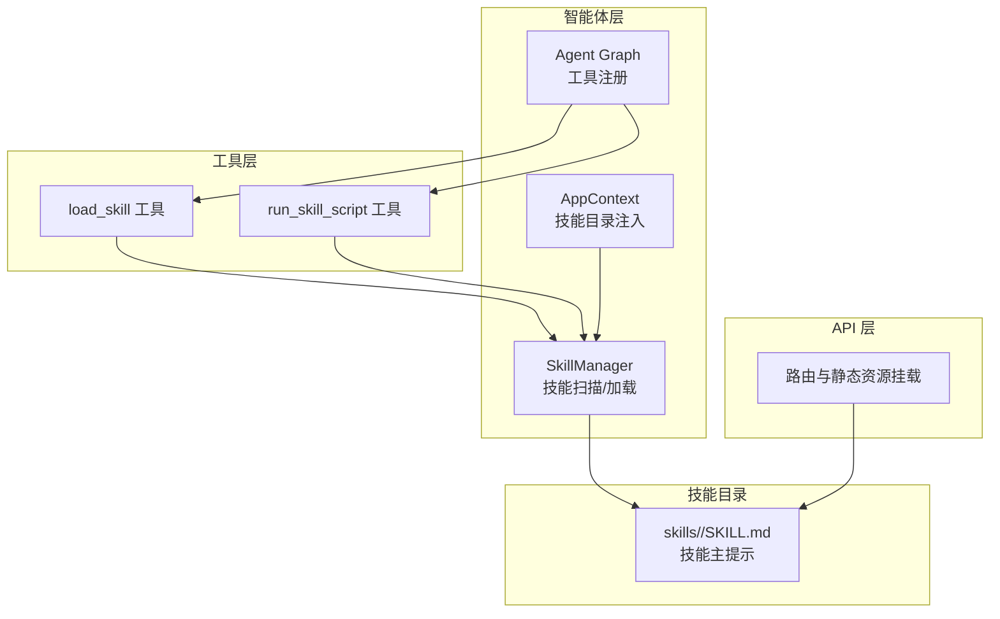
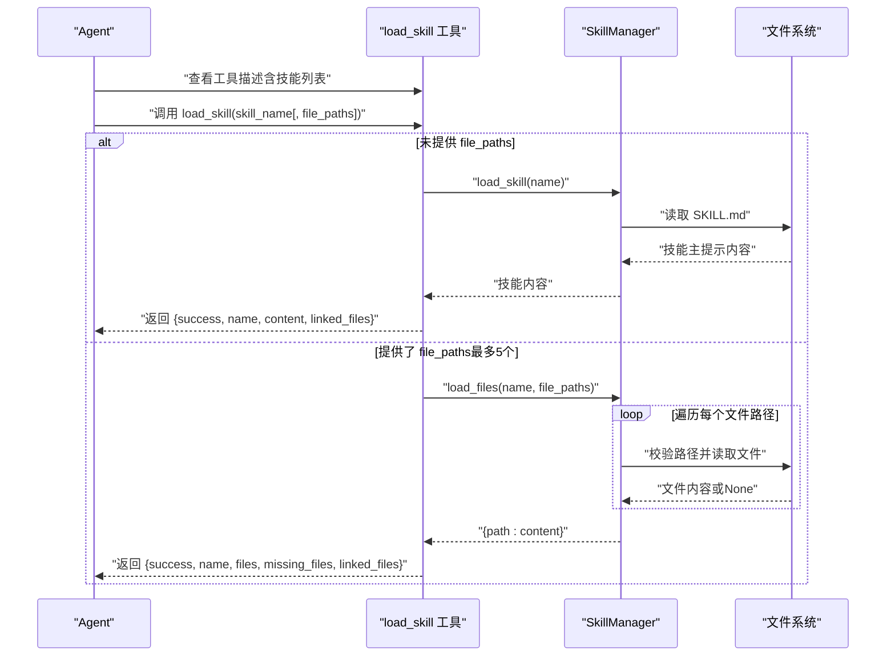
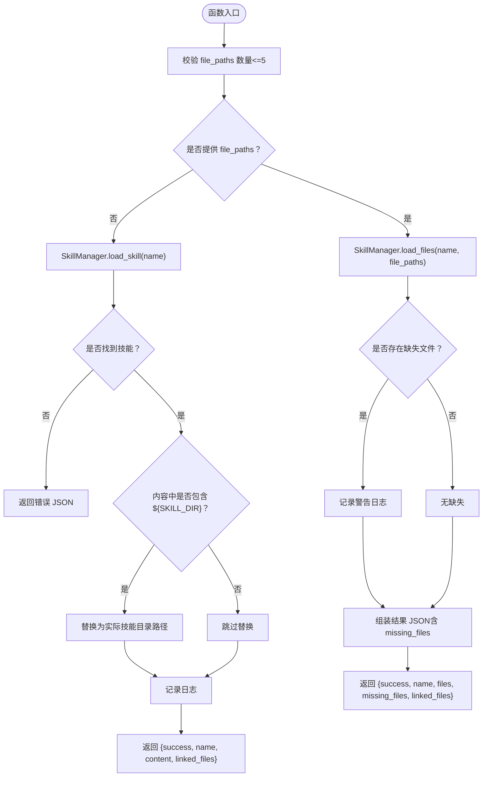
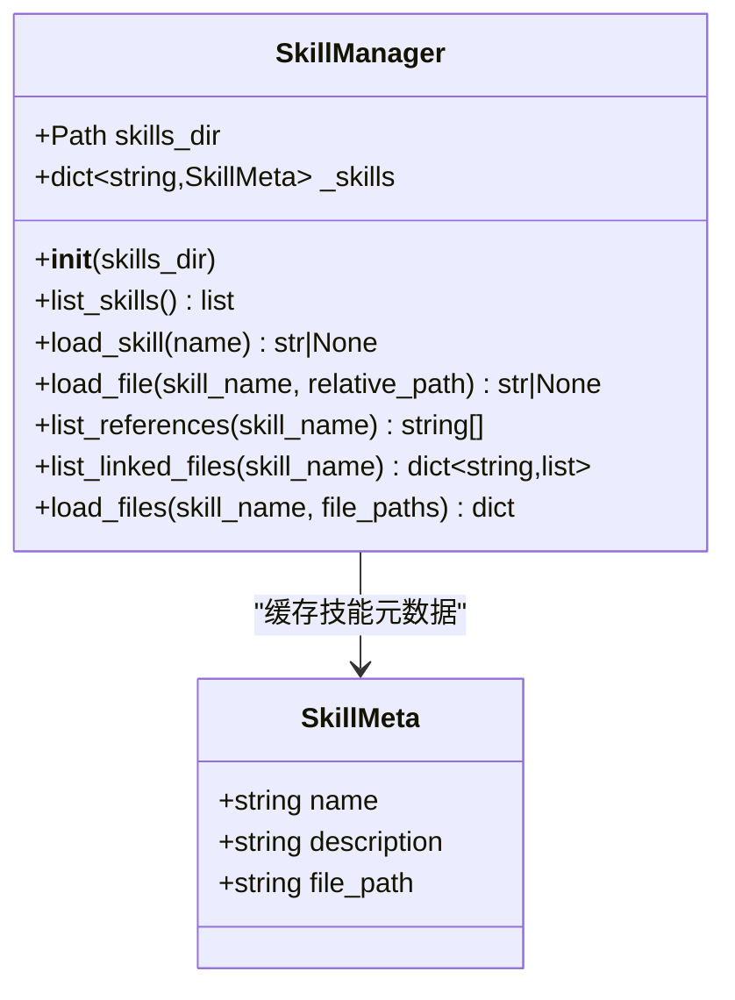
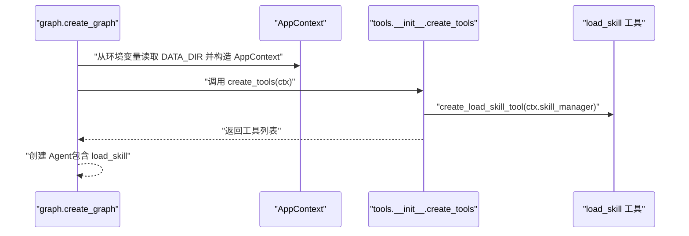
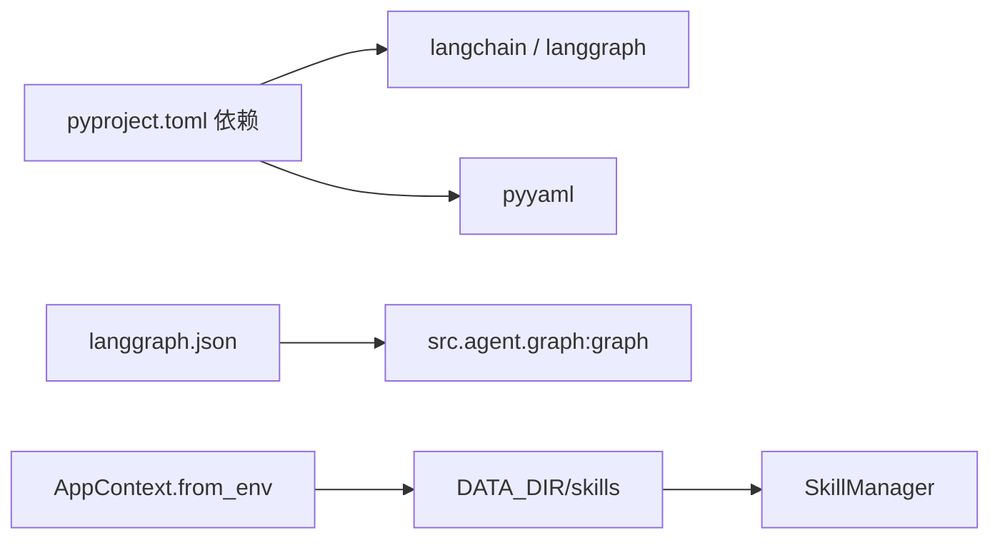

# 技能加载工具

<cite>
**本文档引用的文件**
- [load_skill.py](file://backend/src/tools/load_skill.py)
- [skill_manager.py](file://backend/src/agent/skill_manager.py)
- [run_skill_script.py](file://backend/src/tools/run_skill_script.py)
- [graph.py](file://backend/src/agent/graph.py)
- [__init__.py（工具工厂）](file://backend/src/tools/__init__.py)
- [app_context.py](file://backend/src/app_context.py)
- [SKILL.md（PPT 技能示例）](file://backend/skills/ppt/SKILL.md)
- [routes.py（API 路由）](file://backend/src/api/routes.py)
- [pyproject.toml（项目依赖）](file://backend/pyproject.toml)
- [langgraph.json（LangGraph 配置）](file://backend/langgraph.json)
- [AGENTS.md（技能模式与最佳实践）](file://AGENTS.md)
</cite>

## 目录
1. [简介](#简介)
2. [项目结构](#项目结构)
3. [核心组件](#核心组件)
4. [架构总览](#架构总览)
5. [组件详解](#组件详解)
6. [依赖关系分析](#依赖关系分析)
7. [性能考量](#性能考量)
8. [故障排除指南](#故障排除指南)
9. [结论](#结论)
10. [附录](#附录)

## 简介
本文件为“技能加载工具”的技术文档，聚焦于 load_skill 工具的动态加载与注册能力，系统性说明其输入参数、输出结果、使用场景、技能文件格式、注册机制、生命周期管理、配置选项、安全与权限控制，并提供在 Agent 工作流中的集成方式、最佳实践与扩展指南，以及常见问题排查方法。

## 项目结构
与技能加载工具直接相关的核心位置如下：
- 工具定义与封装：backend/src/tools/load_skill.py
- 技能元数据与扫描加载：backend/src/agent/skill_manager.py
- Agent 图构建与工具注入：backend/src/agent/graph.py、backend/src/tools/__init__.py
- 应用上下文与技能目录：backend/src/app_context.py
- 示例技能：backend/skills/ppt/SKILL.md
- API 层静态资源挂载：backend/src/api/routes.py
- 项目依赖与 LangGraph 配置：backend/pyproject.toml、backend/langgraph.json
- 技能模式与开发规范：AGENTS.md

图表来源
- [load_skill.py:13-116](file://backend/src/tools/load_skill.py#L13-L116)
- [skill_manager.py:14-117](file://backend/src/agent/skill_manager.py#L14-L117)
- [graph.py:16-49](file://backend/src/agent/graph.py#L16-L49)
- [__init__.py（工具工厂）:11-19](file://backend/src/tools/__init__.py#L11-L19)
- [app_context.py:12-30](file://backend/src/app_context.py#L12-L30)
- [SKILL.md（PPT 技能示例）:1-269](file://backend/skills/ppt/SKILL.md#L1-L269)
- [routes.py:177-189](file://backend/src/api/routes.py#L177-L189)

章节来源
- [load_skill.py:13-116](file://backend/src/tools/load_skill.py#L13-L116)
- [skill_manager.py:14-117](file://backend/src/agent/skill_manager.py#L14-L117)
- [graph.py:16-49](file://backend/src/agent/graph.py#L16-L49)
- [__init__.py（工具工厂）:11-19](file://backend/src/tools/__init__.py#L11-L19)
- [app_context.py:12-30](file://backend/src/app_context.py#L12-L30)
- [SKILL.md（PPT 技能示例）:1-269](file://backend/skills/ppt/SKILL.md#L1-L269)
- [routes.py:177-189](file://backend/src/api/routes.py#L177-L189)

## 核心组件
- load_skill 工具：动态生成工具描述，列出所有已注册技能；支持两种调用模式：
  - 不带 file_paths：返回技能主提示内容与该技能的“关联文件清单”
  - 带 file_paths（最多5个）：批量加载指定文件，返回每个文件的内容与缺失文件列表
- SkillManager：扫描 skills 目录，解析 SKILL.md YAML frontmatter，维护技能元数据；提供加载技能主提示、加载文件、列出参考/脚本/资源等能力；内置路径越权保护
- Agent 图与工具工厂：在图构建阶段注入 load_skill 与其他工具，使 Agent 可用
- 应用上下文：从环境变量读取 DATA_DIR，构造 SkillManager 并注入到工具工厂
- 示例技能：PPT 技能展示了技能目录结构、主提示与引用/资源组织方式

章节来源
- [load_skill.py:13-116](file://backend/src/tools/load_skill.py#L13-L116)
- [skill_manager.py:14-117](file://backend/src/agent/skill_manager.py#L14-L117)
- [graph.py:16-49](file://backend/src/agent/graph.py#L16-L49)
- [__init__.py（工具工厂）:11-19](file://backend/src/tools/__init__.py#L11-L19)
- [app_context.py:12-30](file://backend/src/app_context.py#L12-L30)
- [SKILL.md（PPT 技能示例）:1-269](file://backend/skills/ppt/SKILL.md#L1-L269)

## 架构总览
下面的序列图展示了 Agent 使用 load_skill 的典型流程：Agent 通过工具描述发现技能列表，选择技能后调用工具加载主提示或批量加载文件，SkillManager 安全地解析技能目录并返回内容。

图表来源
- [load_skill.py:35-116](file://backend/src/tools/load_skill.py#L35-L116)
- [skill_manager.py:57-117](file://backend/src/agent/skill_manager.py#L57-L117)

## 组件详解

### load_skill 工具
- 动态描述生成：根据 SkillManager 列出的技能，动态拼接工具描述，便于 Agent 在运行时看到可用技能
- 输入参数
  - skill_name: 必填，技能名称
  - file_paths: 可选，最多5个文件路径数组，如 ["references/themes.md", "scripts/save_and_output.py", "assets/theme.css"]
- 输出结果
  - 成功时返回 JSON，包含 success、name、content（若未提供 file_paths）或 files（若提供 file_paths）、linked_files、以及缺失文件列表 missing_files
  - 失败时返回 JSON，包含 success=False 与错误信息
- 特殊行为
  - 当技能主提示中包含 ${SKILL_DIR} 占位符时，会在返回前替换为实际技能目录路径
  - 若未提供 file_paths，返回技能主提示与该技能的“关联文件清单”（references、scripts、assets 等子目录下的文件）

图表来源
- [load_skill.py:35-116](file://backend/src/tools/load_skill.py#L35-L116)

章节来源
- [load_skill.py:13-116](file://backend/src/tools/load_skill.py#L13-L116)

### SkillManager
- 职责
  - 扫描 skills 目录，识别每个技能目录下的 SKILL.md，解析 YAML frontmatter 获取 name/description，并缓存为 SkillMeta
  - 提供 list_skills、load_skill、load_file、list_references、list_linked_files、load_files 等能力
- 安全与限制
  - load_file 内部对路径进行安全校验，确保最终文件路径位于技能目录内，防止路径穿越
- 生命周期
  - 初始化时扫描一次；后续通过工具调用按需加载

图表来源
- [skill_manager.py:7-117](file://backend/src/agent/skill_manager.py#L7-L117)

章节来源
- [skill_manager.py:14-117](file://backend/src/agent/skill_manager.py#L14-L117)

### Agent 图与工具注入
- Agent 图在创建时，通过工具工厂注入 load_skill 与其他工具
- 工具工厂从 AppContext 获取 SkillManager 实例，用于动态生成 load_skill 的工具描述

图表来源
- [graph.py:16-49](file://backend/src/agent/graph.py#L16-L49)
- [__init__.py（工具工厂）:11-19](file://backend/src/tools/__init__.py#L11-L19)
- [app_context.py:19-30](file://backend/src/app_context.py#L19-L30)

章节来源
- [graph.py:16-49](file://backend/src/agent/graph.py#L16-L49)
- [__init__.py（工具工厂）:11-19](file://backend/src/tools/__init__.py#L11-L19)
- [app_context.py:12-30](file://backend/src/app_context.py#L12-L30)

### 示例技能：PPT 技能
- 目录结构与文件
  - SKILL.md：技能主提示，包含 YAML frontmatter 与正文
  - references/：参考文件（如 html-template.md、style-presets.md、animation-patterns.md）
  - assets/：静态资源（如 viewport-base.css）
  - scripts/：可选脚本（run_skill_script 工具用于执行）
- 关键点
  - 主提示中可使用 ${SKILL_DIR} 占位符，load_skill 会在返回前替换为实际技能目录
  - 支持通过 load_skill 加载 references 与 assets 下的文件，实现渐进披露

章节来源
- [SKILL.md（PPT 技能示例）:1-269](file://backend/skills/ppt/SKILL.md#L1-L269)
- [load_skill.py:76-78](file://backend/src/tools/load_skill.py#L76-L78)

## 依赖关系分析
- 语言与框架
  - 基于 LangChain/LangGraph 工具体系，使用 @tool 装饰器声明工具
  - Python >= 3.12，依赖 langchain、langgraph、pyyaml 等
- 运行时依赖
  - DATA_DIR 环境变量决定数据库、向量库、文件存储与技能目录的根路径
  - LangGraph 配置指向 backend/src.agent.graph:graph

图表来源
- [pyproject.toml:6-26](file://backend/pyproject.toml#L6-L26)
- [langgraph.json:1-9](file://backend/langgraph.json#L1-L9)
- [app_context.py:19-30](file://backend/src/app_context.py#L19-L30)

章节来源
- [pyproject.toml:1-41](file://backend/pyproject.toml#L1-L41)
- [langgraph.json:1-9](file://backend/langgraph.json#L1-L9)
- [app_context.py:12-30](file://backend/src/app_context.py#L12-L30)

## 性能考量
- 文件批量加载限制：单次最多5个文件，避免一次性读取过多文件导致内存与响应延迟上升
- 路径解析与安全：load_file 内部进行路径解析与越权校验，减少异常 IO 开销
- 日志与可观测性：工具与 SkillManager 记录关键事件，便于定位性能瓶颈与错误
- 输出截断：与 run_skill_script 类似的思路可用于避免超长输出影响上下文窗口（当前 load_skill 返回 JSON，不涉及超长输出）

## 故障排除指南
- 报错：技能不存在
  - 现象：返回 JSON 中 success=False，包含可用技能列表
  - 排查：确认技能名称大小写与拼写；检查 skills 目录结构与 SKILL.md 是否存在
  - 参考
    - [load_skill.py:65-74](file://backend/src/tools/load_skill.py#L65-L74)
    - [skill_manager.py:57-61](file://backend/src/agent/skill_manager.py#L57-L61)
- 报错：文件数量超过上限
  - 现象：返回 JSON 包含“最多只能一次加载 5 个文件”
  - 排查：减少 file_paths 数量至5个以内
  - 参考
    - [load_skill.py:49-53](file://backend/src/tools/load_skill.py#L49-L53)
- 报错：部分文件未找到
  - 现象：返回 JSON 包含 missing_files 列表
  - 排查：核对相对路径是否正确；确认文件确实在技能目录下
  - 参考
    - [load_skill.py:98-112](file://backend/src/tools/load_skill.py#L98-L112)
    - [skill_manager.py:67-82](file://backend/src/agent/skill_manager.py#L67-L82)
- 报错：路径越权（间接）
  - 现象：load_file 返回 None 或未命中预期文件
  - 排查：确认 file_paths 未尝试逃逸技能目录；避免 ../ 等相对路径
  - 参考
    - [skill_manager.py:76-79](file://backend/src/agent/skill_manager.py#L76-L79)
- 报错：${SKILL_DIR} 未被替换
  - 现象：返回内容仍包含占位符
  - 排查：确认 SKILL.md 中确实包含 ${SKILL_DIR}；确认未提供 file_paths（否则不会替换）
  - 参考
    - [load_skill.py:76-78](file://backend/src/tools/load_skill.py#L76-L78)

章节来源
- [load_skill.py:49-112](file://backend/src/tools/load_skill.py#L49-L112)
- [skill_manager.py:57-82](file://backend/src/agent/skill_manager.py#L57-L82)

## 结论
load_skill 工具通过 SkillManager 实现对技能目录的动态扫描与安全加载，结合 Agent 的工具描述机制，实现了“渐进披露”的技能使用体验。其简洁的输入输出、严格的路径安全与可配置的批量加载策略，使其易于在复杂 Agent 工作流中集成与扩展。

## 附录

### 使用场景与集成方式
- 场景一：Agent 启动后，先通过 load_skill 查看可用技能列表，再按需加载技能主提示与相关文件
- 场景二：Agent 在生成过程中，根据技能指引动态加载 references/assets 中的辅助材料
- 场景三：与 run_skill_script 配合，先加载技能主提示与脚本说明，再执行脚本完成后续处理

章节来源
- [run_skill_script.py:31-143](file://backend/src/tools/run_skill_script.py#L31-L143)
- [load_skill.py:35-116](file://backend/src/tools/load_skill.py#L35-L116)

### 技能文件格式与注册机制
- 目录结构
  - backend/skills/<name>/SKILL.md：技能主提示（必须包含 YAML frontmatter：name、description）
  - references/：可选，通过 load_skill(file_paths=[...]) 按需加载
  - scripts/：可选，通过 run_skill_script 工具执行
  - assets/：可选，静态资源
- 注册机制
  - SkillManager 在初始化时扫描 skills 目录，查找每个子目录下的 SKILL.md 并解析 frontmatter
  - 工具描述动态包含所有已注册技能的名称与描述
- 生命周期
  - 初始化阶段扫描并缓存；运行时按需加载

章节来源
- [AGENTS.md:105-123](file://AGENTS.md#L105-L123)
- [skill_manager.py:26-49](file://backend/src/agent/skill_manager.py#L26-L49)
- [load_skill.py:20-33](file://backend/src/tools/load_skill.py#L20-L33)

### 配置选项与环境变量
- DATA_DIR：决定数据库、向量库、文件存储与技能目录的根路径
- MAIN_MODEL、DEEPSEEK_API_KEY、DEEPSEEK_API_BASE：模型与推理服务配置（与 load_skill 无直接关系，但影响 Agent 能力）
- LangGraph 配置：指向 backend/src.agent.graph:graph

章节来源
- [app_context.py:22-30](file://backend/src/app_context.py#L22-L30)
- [graph.py:18-24](file://backend/src/agent/graph.py#L18-L24)
- [langgraph.json:1-9](file://backend/langgraph.json#L1-L9)

### 安全与权限控制
- 路径越权防护：SkillManager.load_file 对最终文件路径进行解析与校验，确保位于技能目录内
- 脚本执行隔离：run_skill_script 仅允许执行 scripts/ 目录内的脚本，且限制解释器类型
- 输出长度控制：run_skill_script 对输出进行截断，避免污染上下文（与 load_skill 互补）

章节来源
- [skill_manager.py:76-79](file://backend/src/agent/skill_manager.py#L76-L79)
- [run_skill_script.py:72-75](file://backend/src/tools/run_skill_script.py#L72-L75)
- [run_skill_script.py:120-123](file://backend/src/tools/run_skill_script.py#L120-L123)

### 最佳实践与扩展指南
- 渐进披露：在 SKILL.md 中保持初始描述简洁，将详细参考资料放在 references/，通过 load_skill 按需加载
- 占位符使用：在 SKILL.md 中使用 ${SKILL_DIR}，以便动态替换为实际技能目录
- 目录结构：遵循 AGENTS.md 中的推荐结构，便于工具自动发现与安全加载
- 错误处理：在 Agent 侧对 load_skill 返回的 JSON 进行判错与重试策略
- 扩展新技能：新增 backend/skills/<new>/SKILL.md，确保 frontmatter 正确；必要时补充 references/assets/scripts 子目录

章节来源
- [AGENTS.md:105-123](file://AGENTS.md#L105-L123)
- [load_skill.py:76-78](file://backend/src/tools/load_skill.py#L76-L78)