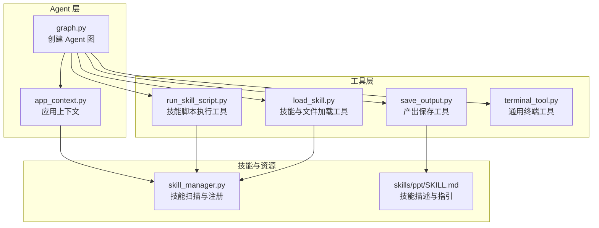
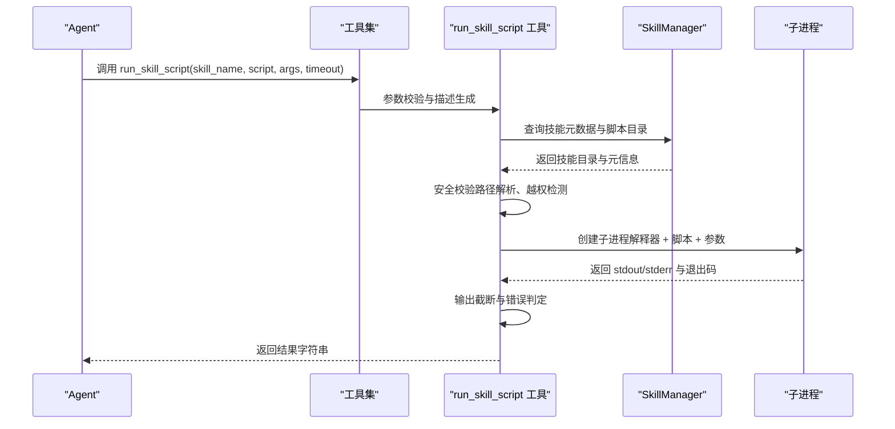
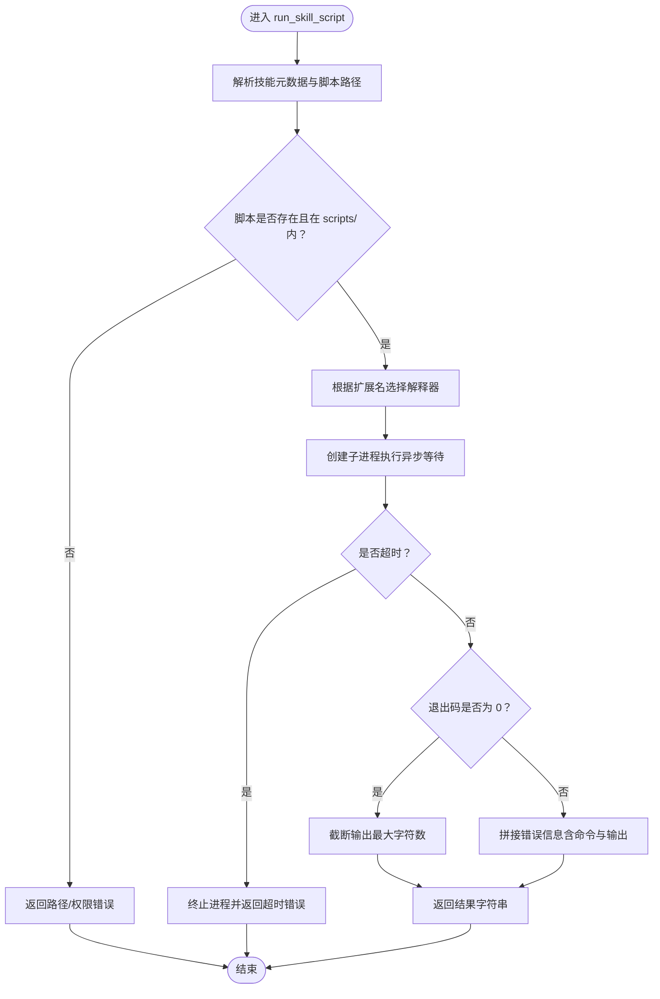
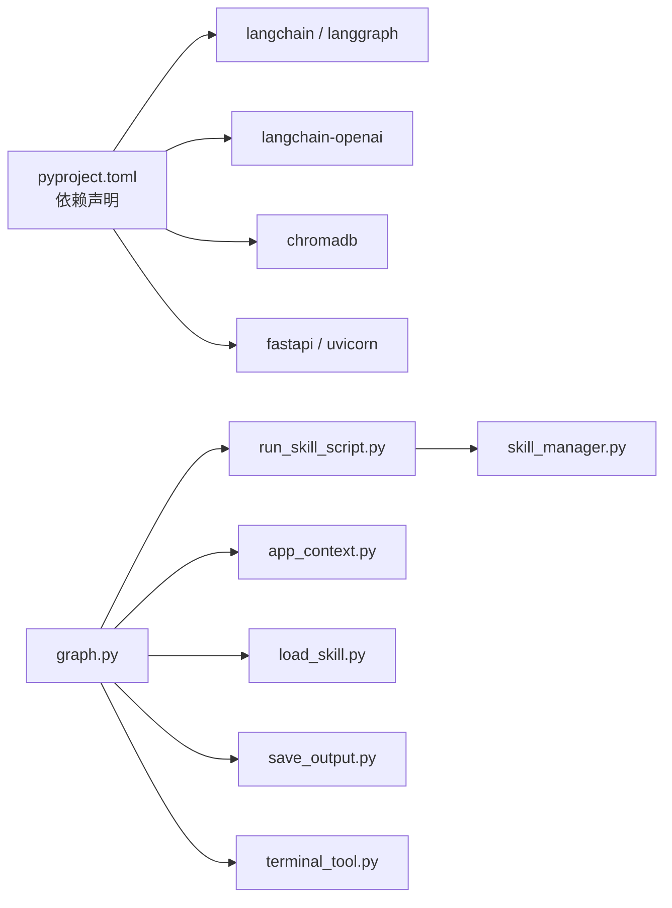

# 技能执行工具

<cite>
**本文档引用的文件**
- [run_skill_script.py](file://backend/src/tools/run_skill_script.py)
- [skill_manager.py](file://backend/src/agent/skill_manager.py)
- [graph.py](file://backend/src/agent/graph.py)
- [app_context.py](file://backend/src/app_context.py)
- [load_skill.py](file://backend/src/tools/load_skill.py)
- [save_output.py](file://backend/src/tools/save_output.py)
- [terminal_tool.py](file://backend/src/tools/terminal_tool.py)
- [__init__.py](file://backend/src/tools/__init__.py)
- [SKILL.md](file://backend/skills/ppt/SKILL.md)
- [langgraph.json](file://backend/langgraph.json)
- [pyproject.toml](file://backend/pyproject.toml)
</cite>

## 目录
1. [简介](#简介)
2. [项目结构](#项目结构)
3. [核心组件](#核心组件)
4. [架构总览](#架构总览)
5. [详细组件分析](#详细组件分析)
6. [依赖分析](#依赖分析)
7. [性能考虑](#性能考虑)
8. [故障排查指南](#故障排查指南)
9. [结论](#结论)
10. [附录](#附录)

## 简介
本文件为“技能执行工具”的技术文档，聚焦 run_skill_script 工具的设计与实现，涵盖以下方面：
- 工具能力：在受控环境中执行技能目录下的脚本，支持多种脚本类型（Bash、Python、Node、TSX），并自动注入工作目录与安全边界。
- 输入参数与脚本格式：参数模型、脚本命名规范、解释器映射与工作目录行为。
- 执行环境与安全：基于技能管理器的技能扫描与注册、脚本目录隔离、路径穿越防护、超时与输出截断。
- 使用示例：在 Agent 工作流中调用技能执行工具的典型流程。
- 生命周期与状态：脚本执行的阶段划分、日志记录、错误处理与结果返回。
- 性能与并发：异步子进程执行、超时控制、输出长度限制。
- 开发模板与最佳实践：脚本组织、解释器选择、参数传递与错误处理。
- 故障诊断：常见错误场景、定位方法与修复建议。

## 项目结构
该工具位于后端 Python 包中，围绕 LangGraph Agent 构建，通过工具工厂函数注入到 Agent 的工具集中。技能元数据由 SkillManager 扫描并注册，脚本执行在受限的技能目录内进行。

图表来源
- [graph.py:16-49](file://backend/src/agent/graph.py#L16-L49)
- [app_context.py:12-30](file://backend/src/app_context.py#L12-L30)
- [run_skill_script.py:31-143](file://backend/src/tools/run_skill_script.py#L31-L143)
- [load_skill.py:13-116](file://backend/src/tools/load_skill.py#L13-L116)
- [save_output.py:61-99](file://backend/src/tools/save_output.py#L61-L99)
- [terminal_tool.py:56-160](file://backend/src/tools/terminal_tool.py#L56-L160)
- [skill_manager.py:14-117](file://backend/src/agent/skill_manager.py#L14-L117)
- [SKILL.md:1-269](file://backend/skills/ppt/SKILL.md#L1-L269)

章节来源
- [graph.py:16-49](file://backend/src/agent/graph.py#L16-L49)
- [app_context.py:12-30](file://backend/src/app_context.py#L12-L30)
- [run_skill_script.py:31-143](file://backend/src/tools/run_skill_script.py#L31-L143)
- [load_skill.py:13-116](file://backend/src/tools/load_skill.py#L13-L116)
- [save_output.py:61-99](file://backend/src/tools/save_output.py#L61-L99)
- [terminal_tool.py:56-160](file://backend/src/tools/terminal_tool.py#L56-L160)
- [skill_manager.py:14-117](file://backend/src/agent/skill_manager.py#L14-L117)
- [SKILL.md:1-269](file://backend/skills/ppt/SKILL.md#L1-L269)

## 核心组件
- run_skill_script 工具：封装脚本执行逻辑，负责路径解析、安全校验、解释器选择、超时控制与输出截断。
- SkillManager：扫描 skills 目录，解析 SKILL.md 获取技能元数据，提供技能列表与文件加载能力。
- Agent 图与上下文：从环境变量初始化 AppContext，注入 SkillManager，并将工具注册到 Agent。
- 其他配套工具：load_skill（加载技能与文件）、save_output（产出保存）、terminal（通用终端执行）。

章节来源
- [run_skill_script.py:31-143](file://backend/src/tools/run_skill_script.py#L31-L143)
- [skill_manager.py:14-117](file://backend/src/agent/skill_manager.py#L14-L117)
- [graph.py:16-49](file://backend/src/agent/graph.py#L16-L49)
- [app_context.py:12-30](file://backend/src/app_context.py#L12-L30)
- [load_skill.py:13-116](file://backend/src/tools/load_skill.py#L13-L116)
- [save_output.py:61-99](file://backend/src/tools/save_output.py#L61-L99)
- [terminal_tool.py:56-160](file://backend/src/tools/terminal_tool.py#L56-L160)

## 架构总览
Agent 在启动时通过 AppContext 初始化 SkillManager，并将 run_skill_script 注入为可用工具之一。当 Agent 需要执行某技能的脚本时，调用 run_skill_script，工具在受控范围内解析脚本路径、选择解释器并执行，最终返回标准格式的结果字符串。

图表来源
- [run_skill_script.py:43-141](file://backend/src/tools/run_skill_script.py#L43-L141)
- [skill_manager.py:51-61](file://backend/src/agent/skill_manager.py#L51-L61)
- [graph.py:28-37](file://backend/src/agent/graph.py#L28-L37)
- [app_context.py:27-29](file://backend/src/app_context.py#L27-L29)

## 详细组件分析

### run_skill_script 工具
- 功能概述
  - 接收技能名、脚本文件名、参数列表与超时时间。
  - 在技能目录下解析脚本路径，确保仅在 scripts/ 子目录内执行。
  - 根据脚本扩展名选择解释器（bash、python、node、npx tsx）。
  - 异步执行并等待结果，支持超时控制与输出截断。
  - 将执行结果以统一字符串格式返回，便于 Agent 与前端展示。

- 输入参数
  - skill_name：技能名称（需已在技能注册表中存在）。
  - script：脚本文件名（仅文件名，无需路径）。
  - args：传给脚本的参数列表（字符串数组）。
  - timeout：执行超时秒数（默认 120）。

- 脚本格式与解释器映射
  - .sh → bash
  - .py → python
  - .js → node
  - .ts → npx tsx

- 安全与隔离
  - 通过 Path.resolve 与 parents 判断，禁止脚本路径越出 scripts/ 目录。
  - 工作目录设置为技能根目录，保证脚本内相对路径解析一致。

- 错误处理与输出
  - 超时：终止进程并返回错误信息。
  - 非零退出码：记录错误日志并组合 stdout/stderr 返回。
  - 输出截断：超过最大字符数时截断并标注总长度。

- 结果格式
  - 成功：返回脚本输出（若为空则返回 stderr 或占位文本）。
  - 失败：返回包含错误原因、命令与输出的字符串。

图表来源
- [run_skill_script.py:60-141](file://backend/src/tools/run_skill_script.py#L60-L141)

章节来源
- [run_skill_script.py:31-143](file://backend/src/tools/run_skill_script.py#L31-L143)

### SkillManager（技能管理）
- 职责
  - 扫描 skills 目录，解析每个技能的 SKILL.md 获取元数据。
  - 提供技能列表、加载技能主文件、加载指定文件、列出关联文件等能力。
  - 通过相对路径加载文件时进行越权保护。

- 关键接口
  - list_skills：返回技能名称与描述列表。
  - load_skill：读取技能主文件内容。
  - load_file / load_files：加载技能内的任意文件。
  - list_linked_files：列出 references/templates/scripts/assets 等子目录中的文件清单。

章节来源
- [skill_manager.py:14-117](file://backend/src/agent/skill_manager.py#L14-L117)

### Agent 图与工具装配
- Agent 通过 create_graph 创建，注入工具集与中间件。
- 工具集由 create_tools 统一创建，其中包含 run_skill_script 工具。
- AppContext 从环境变量初始化数据库、向量库、文件存储与 SkillManager。

章节来源
- [graph.py:16-49](file://backend/src/agent/graph.py#L16-L49)
- [__init__.py:11-19](file://backend/src/tools/__init__.py#L11-L19)
- [app_context.py:12-30](file://backend/src/app_context.py#L12-L30)

### 其他相关工具
- load_skill：动态生成工具描述，列出可用技能；支持一次性最多加载 5 个文件；可返回技能主内容与关联文件清单。
- save_output：将产出物保存至文件存储并在数据库中创建任务记录，作为 Agent 交付结果的唯一入口。
- terminal：通用终端执行工具，支持工作目录、超时与后台执行，具备语义化退出码解释。

章节来源
- [load_skill.py:13-116](file://backend/src/tools/load_skill.py#L13-L116)
- [save_output.py:61-99](file://backend/src/tools/save_output.py#L61-L99)
- [terminal_tool.py:56-160](file://backend/src/tools/terminal_tool.py#L56-L160)

## 依赖分析
- 运行时依赖
  - Python 版本与包管理：langchain、langgraph、langchain-openai、chromadb、fastapi、uvicorn 等。
  - 语言解释器：bash、python、node、npx（tsx）。
- 组件耦合
  - run_skill_script 依赖 SkillManager 提供技能元数据与目录信息。
  - Agent 图依赖 AppContext 注入工具与服务。
  - 前端通过工具结果文本渲染显示工具输出。

图表来源
- [pyproject.toml:1-41](file://backend/pyproject.toml#L1-L41)
- [run_skill_script.py:14-16](file://backend/src/tools/run_skill_script.py#L14-L16)
- [graph.py:16-37](file://backend/src/agent/graph.py#L16-L37)
- [app_context.py:12-30](file://backend/src/app_context.py#L12-L30)

章节来源
- [pyproject.toml:1-41](file://backend/pyproject.toml#L1-L41)
- [run_skill_script.py:14-16](file://backend/src/tools/run_skill_script.py#L14-L16)
- [graph.py:16-37](file://backend/src/agent/graph.py#L16-L37)
- [app_context.py:12-30](file://backend/src/app_context.py#L12-L30)

## 性能考虑
- 异步执行：使用 asyncio.create_subprocess_exec 实现非阻塞执行，避免阻塞 Agent 主循环。
- 超时控制：默认超时 120 秒，防止长时间阻塞；超时后主动终止子进程并清理。
- 输出截断：最大输出字符数限制，防止过长输出影响上下文窗口与传输效率。
- 并发与资源：单次执行为独立子进程，未内置全局并发池；建议在上层工作流中协调调用频率与资源分配。
- I/O 与磁盘：脚本工作目录为技能根目录，注意磁盘空间与临时文件清理。

章节来源
- [run_skill_script.py:28-28](file://backend/src/tools/run_skill_script.py#L28-L28)
- [run_skill_script.py:101-116](file://backend/src/tools/run_skill_script.py#L101-L116)

## 故障排查指南
- 常见错误与定位
  - 技能不存在：检查技能名称是否在技能注册表中，可通过 load_skill 工具查看可用技能列表。
  - 脚本不存在或不在 scripts/ 目录：确认脚本文件名与路径，工具仅允许在 scripts/ 子目录内执行。
  - 不支持的脚本类型：当前支持 .sh/.py/.js/.ts，扩展名需匹配解释器映射。
  - 路径越权：脚本路径必须位于 scripts/ 目录内，工具会拒绝越权访问。
  - 超时：适当提高 timeout，或优化脚本执行逻辑；必要时拆分为多个短任务。
  - 非零退出码：查看返回的 stderr 与命令信息，结合脚本内部日志定位问题。
- 诊断步骤
  - 使用 load_skill 工具确认技能与脚本目录结构。
  - 在本地验证脚本在技能根目录下的可执行性与依赖。
  - 查看 Agent 日志中的执行命令与返回码。
  - 对长输出进行分段测试，确认是否触发输出截断。
- 相关工具辅助
  - terminal 工具可用于调试命令与环境配置。
  - save_output 工具用于验证最终产物的保存流程。

章节来源
- [run_skill_script.py:60-141](file://backend/src/tools/run_skill_script.py#L60-L141)
- [load_skill.py:35-116](file://backend/src/tools/load_skill.py#L35-L116)
- [terminal_tool.py:56-160](file://backend/src/tools/terminal_tool.py#L56-L160)

## 结论
run_skill_script 工具通过严格的路径安全控制与解释器映射，为 Agent 提供了可控、可扩展的脚本执行能力。配合 SkillManager 的技能注册与文件加载、以及 save_output 的产物交付机制，形成了完整的技能执行闭环。在实际使用中，应关注脚本类型支持、超时与输出长度限制，并通过日志与工具链进行系统化排障。

## 附录

### 使用示例（在 Agent 工作流中调用）
- 步骤概览
  - Agent 通过工具描述了解可用技能与脚本类型。
  - 调用 run_skill_script，传入技能名、脚本文件名、参数与超时。
  - 工具在技能根目录下执行脚本，返回统一格式的结果字符串。
  - 若为最终产物，调用 save_output 将结果交付给用户。
- 示例流程（概念性）
  - Agent 识别需要导出 PDF 的场景，调用 run_skill_script 执行对应脚本。
  - 脚本执行完成后，Agent 决策是否调用 save_output 保存产物。
  - 前端接收工具结果文本并进行渲染展示。

章节来源
- [run_skill_script.py:43-59](file://backend/src/tools/run_skill_script.py#L43-L59)
- [save_output.py:61-99](file://backend/src/tools/save_output.py#L61-L99)
- [SKILL.md:240-247](file://backend/skills/ppt/SKILL.md#L240-L247)

### 脚本开发模板与最佳实践
- 目录组织
  - 在技能根目录下创建 scripts/ 子目录存放脚本。
  - 脚本文件名使用明确的扩展名（.sh/.py/.js/.ts）。
- 解释器选择
  - Bash：适合系统操作与打包任务。
  - Python：适合数据处理与文件操作。
  - Node/TSX：适合前端构建与快速原型。
- 参数传递
  - 使用 args 列表传递路径与选项，避免硬编码。
  - 注意路径在技能根目录下的相对性。
- 错误处理
  - 明确返回码语义，区分业务失败与环境异常。
  - 在脚本内输出关键日志，便于工具侧聚合与定位。
- 安全与隔离
  - 避免访问 scripts/ 外部路径，遵循工具的安全边界。
  - 脚本不应依赖外部网络或不可复现的环境。

章节来源
- [run_skill_script.py:20-26](file://backend/src/tools/run_skill_script.py#L20-L26)
- [run_skill_script.py:72-75](file://backend/src/tools/run_skill_script.py#L72-L75)
- [SKILL.md:215-229](file://backend/skills/ppt/SKILL.md#L215-L229)