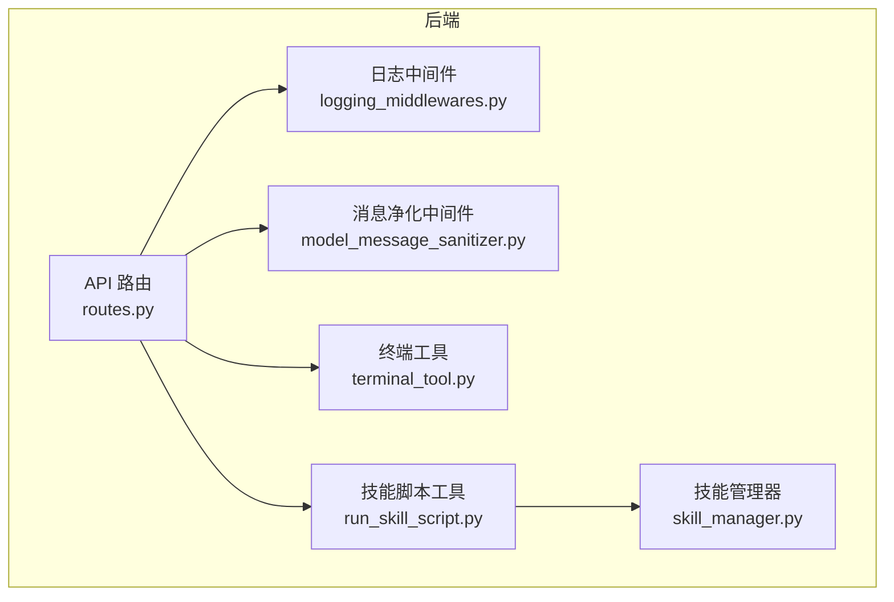
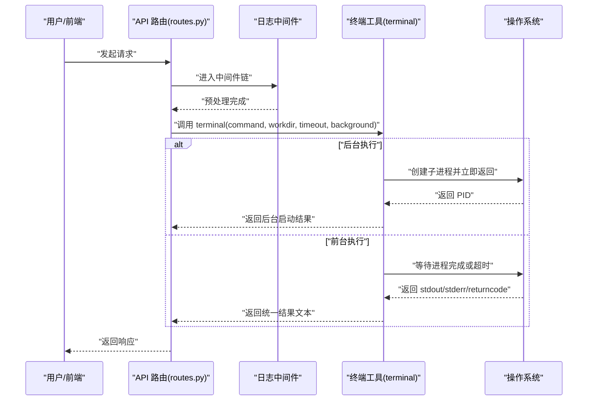
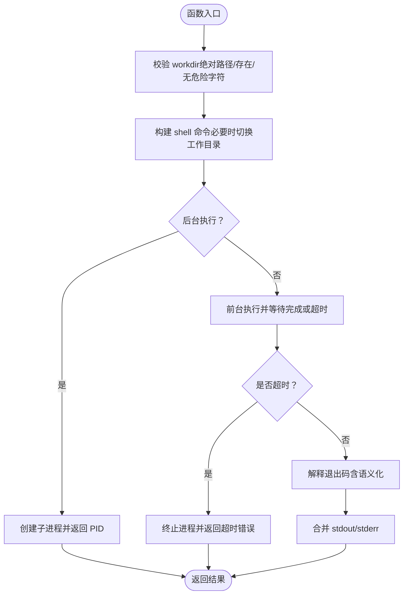
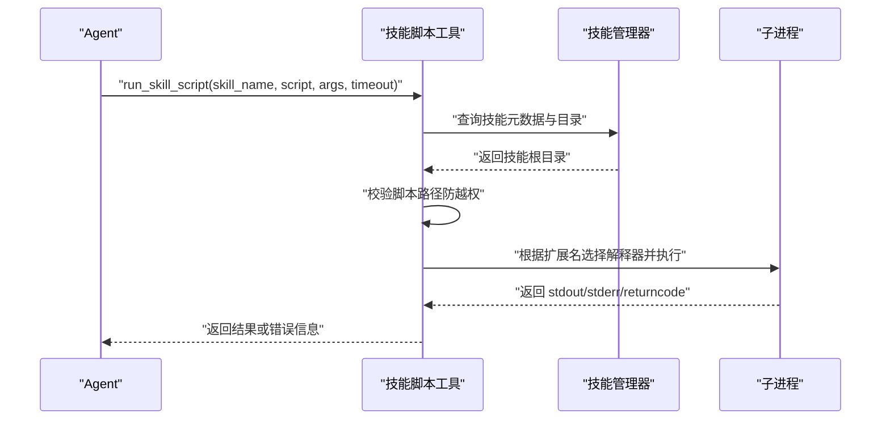
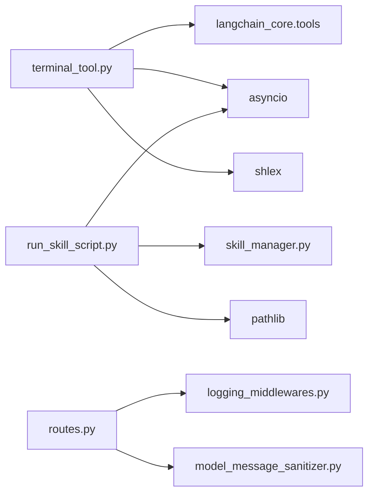

# 终端工具

<cite>
**本文引用的文件**
- [terminal_tool.py](file://backend/src/tools/terminal_tool.py)
- [run_skill_script.py](file://backend/src/tools/run_skill_script.py)
- [skill_manager.py](file://backend/src/agent/skill_manager.py)
- [routes.py](file://backend/src/api/routes.py)
- [logging_middlewares.py](file://backend/src/middlewares/logging_middlewares.py)
- [model_message_sanitizer.py](file://backend/src/middlewares/model_message_sanitizer.py)
- [backend-architecture.md](file://docs/backend-architecture.md)
- [pyproject.toml](file://backend/pyproject.toml)
- [start.sh](file://scripts/start.sh)
- [doctor.sh](file://scripts/doctor.sh)
</cite>

## 目录
1. [简介](#简介)
2. [项目结构](#项目结构)
3. [核心组件](#核心组件)
4. [架构总览](#架构总览)
5. [详细组件分析](#详细组件分析)
6. [依赖关系分析](#依赖关系分析)
7. [性能与资源限制](#性能与资源限制)
8. [故障排除指南](#故障排除指南)
9. [结论](#结论)
10. [附录](#附录)

## 简介
终端工具为智能体（Agent）提供在受控环境中的系统命令执行能力，支持前台同步执行与后台异步执行、超时控制、工作目录约束以及语义化退出码解释。该工具通过严格的输入校验与日志记录保障安全性与可观测性，并可与技能脚本工具配合，在 Agent 工作流中安全地完成文件系统检查、数据导出、格式转换等任务。

## 项目结构
终端工具位于后端工具模块中，与技能脚本工具、中间件、API 路由共同构成 Agent 的执行与编排层。其主要职责是提供安全可控的 shell 命令执行接口，供 Agent 在受限上下文中完成系统级操作。

图表来源
- [routes.py:1-189](file://backend/src/api/routes.py#L1-L189)
- [logging_middlewares.py:1-59](file://backend/src/middlewares/logging_middlewares.py#L1-L59)
- [model_message_sanitizer.py:1-122](file://backend/src/middlewares/model_message_sanitizer.py#L1-L122)
- [terminal_tool.py:1-160](file://backend/src/tools/terminal_tool.py#L1-L160)
- [run_skill_script.py:1-143](file://backend/src/tools/run_skill_script.py#L1-L143)
- [skill_manager.py:1-117](file://backend/src/agent/skill_manager.py#L1-L117)

章节来源
- [routes.py:1-189](file://backend/src/api/routes.py#L1-L189)
- [terminal_tool.py:1-160](file://backend/src/tools/terminal_tool.py#L1-L160)
- [run_skill_script.py:1-143](file://backend/src/tools/run_skill_script.py#L1-L143)
- [skill_manager.py:1-117](file://backend/src/agent/skill_manager.py#L1-L117)

## 核心组件
- 终端工具（terminal）：提供 shell 命令执行、工作目录约束、超时控制、后台执行与语义化退出码解释。
- 技能脚本工具（run_skill_script）：在技能限定目录内安全执行脚本，支持多种脚本类型与超时控制。
- 技能管理器（SkillManager）：扫描技能目录，解析技能元数据，提供文件加载与引用列表能力。
- 中间件：日志中间件与模型消息净化中间件，增强可观测性与消息兼容性。
- API 路由：统一入口，负责请求处理与响应返回。

章节来源
- [terminal_tool.py:56-160](file://backend/src/tools/terminal_tool.py#L56-L160)
- [run_skill_script.py:31-143](file://backend/src/tools/run_skill_script.py#L31-L143)
- [skill_manager.py:14-117](file://backend/src/agent/skill_manager.py#L14-L117)
- [logging_middlewares.py:15-59](file://backend/src/middlewares/logging_middlewares.py#L15-L59)
- [model_message_sanitizer.py:105-122](file://backend/src/middlewares/model_message_sanitizer.py#L105-L122)
- [routes.py:30-189](file://backend/src/api/routes.py#L30-L189)

## 架构总览
终端工具在 Agent 工作流中的典型交互如下：

图表来源
- [routes.py:30-189](file://backend/src/api/routes.py#L30-L189)
- [logging_middlewares.py:15-59](file://backend/src/middlewares/logging_middlewares.py#L15-L59)
- [terminal_tool.py:75-160](file://backend/src/tools/terminal_tool.py#L75-L160)

## 详细组件分析

### 终端工具（terminal）
- 功能概述
  - 在受控环境中执行 shell 命令，支持前台同步与后台异步两种模式。
  - 通过工作目录参数限制命令执行范围，确保路径安全。
  - 支持超时控制，避免长时间阻塞。
  - 对常见命令的非零退出码进行语义化解释，提升可观测性。
- 关键参数
  - command：必填，待执行的 shell 命令字符串。
  - workdir：可选，必须为绝对路径且存在，否则抛出异常。
  - timeout：可选，单位秒，默认 60；None 表示无超时。
  - background：可选，是否后台执行，默认 False。
- 安全机制
  - 工作目录校验：强制绝对路径、禁止危险元字符、验证目录存在性。
  - 命令拼接：对工作目录使用安全转义，避免注入。
  - 语义化退出码：对 grep/find 等命令的“无匹配”视为语义成功。
- 输出格式
  - 成功：合并 stdout 与 stderr（若有），无输出时返回占位提示。
  - 失败：包含 exit code、语义解释与原始输出，便于诊断。
- 使用建议
  - 优先使用 workdir 限定执行范围，避免误操作。
  - 对潜在耗时命令设置合理 timeout。
  - 后台执行适合长时间任务，前台执行适合需要即时反馈的任务。

图表来源
- [terminal_tool.py:20-160](file://backend/src/tools/terminal_tool.py#L20-L160)

章节来源
- [terminal_tool.py:20-160](file://backend/src/tools/terminal_tool.py#L20-L160)

### 技能脚本工具（run_skill_script）
- 设计原则
  - Agent 仅需提供 skill_name 与脚本文件名，工具内部解析绝对路径。
  - 严格限制脚本执行范围：仅允许执行技能目录下 scripts/ 内的脚本，防止路径穿越。
  - 支持脚本类型：.sh（bash）、.py（python）、.js（node）、.ts（npx tsx）。
- 关键流程
  - 解析技能目录与 scripts 子目录。
  - 安全校验脚本路径，防止越权访问。
  - 根据扩展名选择解释器并组装命令。
  - 执行并等待结果，支持超时控制与输出截断。
- 输出与错误
  - 成功：返回脚本标准输出或标准错误。
  - 失败：返回 exit code、命令与错误摘要。
  - 超长输出：截断并提示总长度，避免上下文溢出。

图表来源
- [run_skill_script.py:31-143](file://backend/src/tools/run_skill_script.py#L31-L143)
- [skill_manager.py:14-117](file://backend/src/agent/skill_manager.py#L14-L117)

章节来源
- [run_skill_script.py:31-143](file://backend/src/tools/run_skill_script.py#L31-L143)
- [skill_manager.py:14-117](file://backend/src/agent/skill_manager.py#L14-L117)

### 日志与可观测性
- 日志中间件
  - 在 Agent 每次推理前后记录上下文信息，便于追踪工具调用与消息流转。
- 模型消息净化中间件
  - 清理不被兼容的工具调用片段，保持历史消息与模型接口的兼容性。
- 终端工具日志
  - 记录执行命令、工作目录、超时与后台启动等关键信息，失败时记录语义化解释与错误摘要。

章节来源
- [logging_middlewares.py:15-59](file://backend/src/middlewares/logging_middlewares.py#L15-L59)
- [model_message_sanitizer.py:105-122](file://backend/src/middlewares/model_message_sanitizer.py#L105-L122)
- [terminal_tool.py:75-160](file://backend/src/tools/terminal_tool.py#L75-L160)

## 依赖关系分析
- 终端工具依赖
  - asyncio：异步进程管理与超时控制。
  - shlex：安全转义工作目录，防止注入。
  - langchain_core.tools：声明为工具，供 Agent 调用。
- 技能脚本工具依赖
  - pathlib：路径解析与安全校验。
  - SkillManager：读取技能元数据与脚本目录。
  - asyncio：异步执行与超时控制。
- API 与中间件
  - FastAPI：路由与请求处理。
  - 中间件：日志与消息净化，增强可观测性与兼容性。

图表来源
- [terminal_tool.py:3-10](file://backend/src/tools/terminal_tool.py#L3-L10)
- [run_skill_script.py:9-16](file://backend/src/tools/run_skill_script.py#L9-L16)
- [routes.py:1-11](file://backend/src/api/routes.py#L1-L11)
- [logging_middlewares.py:1-12](file://backend/src/middlewares/logging_middlewares.py#L1-L12)
- [model_message_sanitizer.py:1-7](file://backend/src/middlewares/model_message_sanitizer.py#L1-L7)

章节来源
- [terminal_tool.py:3-10](file://backend/src/tools/terminal_tool.py#L3-L10)
- [run_skill_script.py:9-16](file://backend/src/tools/run_skill_script.py#L9-L16)
- [routes.py:1-11](file://backend/src/api/routes.py#L1-L11)
- [logging_middlewares.py:1-12](file://backend/src/middlewares/logging_middlewares.py#L1-L12)
- [model_message_sanitizer.py:1-7](file://backend/src/middlewares/model_message_sanitizer.py#L1-L7)

## 性能与资源限制
- 超时控制
  - 终端工具：前台执行支持超时，超时后终止进程并返回错误提示。
  - 技能脚本工具：支持超时，超时后终止进程并返回错误提示。
- 输出截断
  - 技能脚本工具对超长输出进行截断，避免上下文过载。
- 并发与后台执行
  - 终端工具支持后台执行，适合长时间任务，避免阻塞主线程。
- 资源建议
  - 为高风险命令设置更短的 timeout，降低资源占用。
  - 合理使用 workdir 限制磁盘访问范围，减少不必要的 IO。

章节来源
- [terminal_tool.py:108-120](file://backend/src/tools/terminal_tool.py#L108-L120)
- [run_skill_script.py:108-115](file://backend/src/tools/run_skill_script.py#L108-L115)
- [run_skill_script.py:120-123](file://backend/src/tools/run_skill_script.py#L120-L123)

## 故障排除指南
- 常见问题与定位
  - 工作目录无效：检查是否为绝对路径、是否存在、是否包含危险字符。
  - 命令超时：适当提高 timeout，或改为后台执行；检查命令本身是否卡死。
  - 语义失败：某些命令（如 grep/find）返回非零退出码但属于正常行为，查看语义解释。
  - 权限不足：确认执行用户对目标路径与文件具有读写权限。
- 日志与审计
  - 查看 API 与工具日志，定位命令执行、超时与失败原因。
  - 结合中间件日志，追踪 Agent 推理与工具调用链路。
- 快速修复
  - 缩小 workdir 范围，确保路径安全。
  - 为命令添加必要的参数与重定向，避免交互式阻塞。
  - 对长时间任务使用后台执行，前台仅做轻量查询。

章节来源
- [terminal_tool.py:20-33](file://backend/src/tools/terminal_tool.py#L20-L33)
- [terminal_tool.py:108-120](file://backend/src/tools/terminal_tool.py#L108-L120)
- [logging_middlewares.py:15-59](file://backend/src/middlewares/logging_middlewares.py#L15-L59)

## 结论
终端工具通过严格的输入校验、工作目录约束与超时控制，为 Agent 在受控环境中执行系统命令提供了安全可靠的基础设施。结合技能脚本工具与中间件体系，可在保证安全性的前提下，灵活完成文件系统检查、数据导出与格式转换等任务。建议在实际部署中合理设置超时与后台执行策略，并充分利用日志与中间件能力进行监控与审计。

## 附录

### 使用示例（Agent 工作流）
- 在技能脚本工具中执行导出脚本
  - 步骤：Agent 调用 run_skill_script，指定 skill_name、脚本文件名与参数。
  - 安全性：工具在校验 scripts/ 目录后执行，防止路径穿越。
  - 超时：默认超时时间可按需调整。
- 在终端工具中执行系统检查
  - 步骤：Agent 调用 terminal，指定命令、工作目录与超时。
  - 安全性：workdir 必须为绝对路径且无危险字符。
  - 后台：对耗时任务可启用后台执行，避免阻塞。

章节来源
- [run_skill_script.py:43-143](file://backend/src/tools/run_skill_script.py#L43-L143)
- [terminal_tool.py:56-160](file://backend/src/tools/terminal_tool.py#L56-L160)

### 安全风险评估与防护
- 风险点
  - 注入攻击：命令拼接不当可能导致任意命令执行。
  - 路径穿越：脚本路径越权访问导致敏感文件泄露。
  - 资源滥用：长时间阻塞或无限循环占用 CPU/IO。
- 防护措施
  - 终端工具：强制绝对路径、危险字符过滤、安全转义、语义化退出码。
  - 技能脚本工具：路径解析与校验、解释器选择、超时与输出截断。
  - 中间件：日志记录与消息净化，提升可观测性与兼容性。
  - 运维：使用脚本进行环境检查与服务启动，确保运行环境稳定。

章节来源
- [terminal_tool.py:20-33](file://backend/src/tools/terminal_tool.py#L20-L33)
- [run_skill_script.py:72-82](file://backend/src/tools/run_skill_script.py#L72-L82)
- [logging_middlewares.py:15-59](file://backend/src/middlewares/logging_middlewares.py#L15-L59)
- [model_message_sanitizer.py:105-122](file://backend/src/middlewares/model_message_sanitizer.py#L105-L122)
- [doctor.sh:18-99](file://scripts/doctor.sh#L18-L99)
- [start.sh:56-129](file://scripts/start.sh#L56-L129)