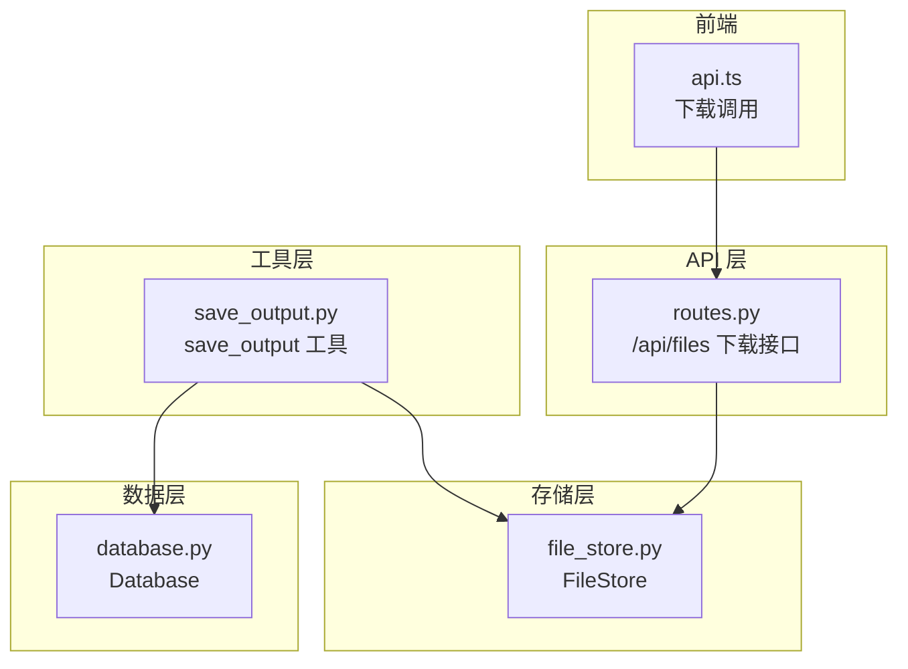
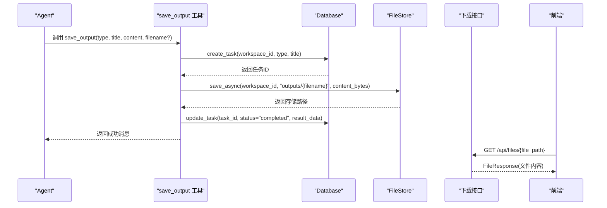
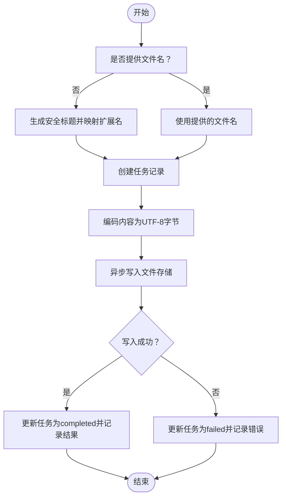
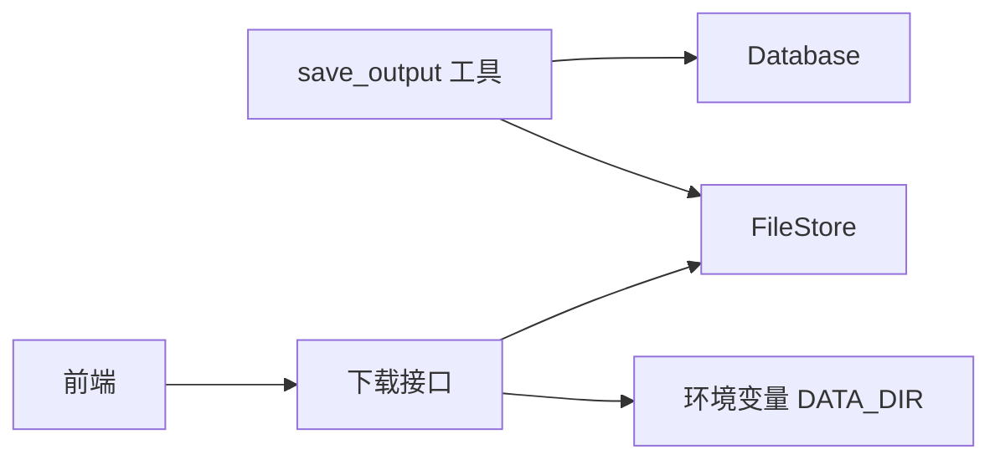

# 输出保存工具

<cite>
**本文引用的文件**
- [save_output.py](file://backend/src/tools/save_output.py)
- [file_store.py](file://backend/src/storage/file_store.py)
- [database.py](file://backend/src/storage/database.py)
- [routes.py](file://backend/src/api/routes.py)
- [deps.py](file://backend/src/api/deps.py)
- [app_context.py](file://backend/src/app_context.py)
- [__init__.py](file://backend/src/tools/__init__.py)
- [api.ts](file://frontend/src/lib/api.ts)
- [07-download-output.md](file://user-story/07-download-output.md)
- [04-ppt-command.md](file://user-story/04-ppt-command.md)
</cite>

## 目录
1. [简介](#简介)
2. [项目结构](#项目结构)
3. [核心组件](#核心组件)
4. [架构总览](#架构总览)
5. [详细组件分析](#详细组件分析)
6. [依赖关系分析](#依赖关系分析)
7. [性能考虑](#性能考虑)
8. [故障排查指南](#故障排查指南)
9. [结论](#结论)
10. [附录](#附录)

## 简介
输出保存工具用于将 Agent 生成的产出物（如 PPT、报告等）持久化到文件存储系统，并在数据库中创建任务记录，供前端在“产出面板”中查看和下载。该工具是向用户交付最终结果的唯一途径，确保用户能够在技能执行完成后获取并下载生成的文件。

## 项目结构
输出保存工具位于后端工具模块中，与文件存储、数据库以及 API 路由紧密协作：
- 工具层：负责接收 Agent 的调用请求，封装保存逻辑
- 存储层：提供异步文件写入能力，按工作区隔离存储
- 数据层：维护任务表，记录产出物的元信息与状态
- API 层：提供文件下载接口，供前端访问

图表来源
- [save_output.py:1-99](file://backend/src/tools/save_output.py#L1-L99)
- [file_store.py:1-39](file://backend/src/storage/file_store.py#L1-L39)
- [database.py:1-379](file://backend/src/storage/database.py#L1-L379)
- [routes.py:160-175](file://backend/src/api/routes.py#L160-L175)
- [api.ts:187-195](file://frontend/src/lib/api.ts#L187-L195)

章节来源
- [save_output.py:1-99](file://backend/src/tools/save_output.py#L1-L99)
- [file_store.py:1-39](file://backend/src/storage/file_store.py#L1-L39)
- [database.py:1-379](file://backend/src/storage/database.py#L1-L379)
- [routes.py:160-175](file://backend/src/api/routes.py#L160-L175)
- [api.ts:187-195](file://frontend/src/lib/api.ts#L187-L195)

## 核心组件
- 工具函数：对外暴露的 save_output 工具，接收类型、标题、内容等参数，内部调用保存流程
- 保存流程：创建任务记录，将内容编码为字节后写入文件存储，更新任务状态与结果数据
- 文件存储：基于工作区 ID 创建隔离目录，异步安全地写入文件
- 数据库：维护任务表，记录任务状态、类型、标题及结果数据（包含文件路径与文件名）
- 下载接口：提供按存储路径下载文件的能力，支持输出文件与文档文件

章节来源
- [save_output.py:61-99](file://backend/src/tools/save_output.py#L61-L99)
- [file_store.py:18-28](file://backend/src/storage/file_store.py#L18-L28)
- [database.py:342-379](file://backend/src/storage/database.py#L342-L379)
- [routes.py:163-174](file://backend/src/api/routes.py#L163-L174)

## 架构总览
输出保存工具的调用链路如下：
- Agent 在技能执行完成后调用 save_output 工具
- 工具创建任务记录并调用文件存储写入
- 写入成功后更新任务状态为完成，并记录文件路径与文件名
- 前端通过任务列表获取已完成任务，点击下载按钮触发文件下载接口

图表来源
- [save_output.py:13-58](file://backend/src/tools/save_output.py#L13-L58)
- [database.py:342-379](file://backend/src/storage/database.py#L342-L379)
- [file_store.py:18-28](file://backend/src/storage/file_store.py#L18-L28)
- [routes.py:163-174](file://backend/src/api/routes.py#L163-L174)

## 详细组件分析

### 工具定义与参数
- 工具名称：save_output
- 功能：保存产出物（PPT、报告等），并在完成后向用户展示与下载
- 参数
  - type：产出文件类型，取值为 'ppt' | 'report'
  - title：产出标题，如“新员工消防培训”
  - content：完整的产出内容；PPT 为自包含 HTML，报告为 Markdown
  - filename：文件名（可选），默认根据 title + type 自动生成
- 返回：字符串消息，告知保存结果与后续操作指引

章节来源
- [save_output.py:61-99](file://backend/src/tools/save_output.py#L61-L99)

### 文件命名规则与存储策略
- 默认文件名生成
  - 将标题中的空格替换为下划线，斜杠替换为下划线，得到安全标题
  - 类型映射：'ppt' -> '.html'，'report' -> '.md'，其他类型 -> '.txt'
  - 最终文件名为：安全标题 + 扩展名
- 存储路径
  - 文件统一保存在工作区目录下的 outputs 子目录中
  - 路径格式：{workspace_id}/outputs/{filename}
- 工作区隔离
  - 每个工作区拥有独立的存储根目录，避免文件冲突

章节来源
- [save_output.py:23-26](file://backend/src/tools/save_output.py#L23-L26)
- [file_store.py:11-16](file://backend/src/storage/file_store.py#L11-L16)

### 保存流程与状态管理
- 步骤
  1) 创建任务记录（初始状态为 generating）
  2) 将内容编码为 UTF-8 字节后写入文件存储
  3) 更新任务状态为 completed，并将 result_data 设置为包含 file_path 与 filename 的 JSON
- 错误处理
  - 写入异常时，任务状态更新为 failed，并记录错误信息与文件名
  - 工具返回失败消息，便于 Agent 重试或回退

图表来源
- [save_output.py:13-58](file://backend/src/tools/save_output.py#L13-L58)

章节来源
- [save_output.py:13-58](file://backend/src/tools/save_output.py#L13-L58)

### 文件存储实现
- FileStore
  - 同步写入：save(workspace_id, filename, content_bytes) -> 返回存储路径
  - 异步写入：save_async(workspace_id, filename, content_bytes) -> 返回存储路径（内部通过线程池包装阻塞 I/O）
  - 删除：delete(file_path)、delete_workspace(workspace_id)
- 路径组织
  - 基于 base_dir 与 workspace_id 组合形成工作区目录
  - 自动创建父级目录，确保可写

章节来源
- [file_store.py:6-39](file://backend/src/storage/file_store.py#L6-L39)

### 数据库模型与任务管理
- 任务表（task）
  - 字段：id、workspace_id、type、title、status、result_data、created_at、updated_at
  - 状态：generating（生成中）、completed（完成）、failed（失败）
  - 结果数据：JSON 字符串，包含 file_path 与 filename
- 工具对数据库的调用
  - create_task：创建任务记录
  - update_task：更新任务状态与结果数据

章节来源
- [database.py:46-55](file://backend/src/storage/database.py#L46-L55)
- [database.py:342-379](file://backend/src/storage/database.py#L342-L379)

### API 下载接口
- 路由：GET /api/files/{file_path:path}
- 行为：根据存储路径返回文件内容，支持输出文件与文档文件
- 访问控制：若文件不存在，返回 404
- 前端调用：前端通过构造 {API_BASE}/api/files/{file_path} 触发下载

章节来源
- [routes.py:163-174](file://backend/src/api/routes.py#L163-L174)
- [api.ts:187-195](file://frontend/src/lib/api.ts#L187-L195)

### 工具注册与依赖注入
- 工具工厂：create_save_output_tool(db, file_store)
- 注册位置：工具集合创建时注入
- 依赖来源：应用上下文从环境变量读取 DATA_DIR，初始化数据库与文件存储

章节来源
- [__init__.py:11-19](file://backend/src/tools/__init__.py#L11-L19)
- [deps.py:13-29](file://backend/src/api/deps.py#L13-L29)
- [app_context.py:19-30](file://backend/src/app_context.py#L19-L30)

## 依赖关系分析
- 工具依赖
  - 依赖 Database 进行任务记录与状态更新
  - 依赖 FileStore 进行文件写入
- API 依赖
  - 依赖 FileStore 读取文件内容
  - 依赖环境变量 DATA_DIR 确定存储根目录
- 前端依赖
  - 依赖任务列表获取已完成任务
  - 依赖下载接口获取文件

图表来源
- [save_output.py:61-99](file://backend/src/tools/save_output.py#L61-L99)
- [database.py:342-379](file://backend/src/storage/database.py#L342-L379)
- [file_store.py:6-39](file://backend/src/storage/file_store.py#L6-L39)
- [routes.py:163-174](file://backend/src/api/routes.py#L163-L174)
- [app_context.py:22](file://backend/src/app_context.py#L22)

章节来源
- [save_output.py:61-99](file://backend/src/tools/save_output.py#L61-L99)
- [database.py:342-379](file://backend/src/storage/database.py#L342-L379)
- [file_store.py:6-39](file://backend/src/storage/file_store.py#L6-L39)
- [routes.py:163-174](file://backend/src/api/routes.py#L163-L174)
- [app_context.py:22](file://backend/src/app_context.py#L22)

## 性能考虑
- 异步写入
  - 使用 save_async 包装阻塞 I/O，避免阻塞事件循环
- 存储路径
  - 采用工作区隔离，减少并发写入冲突
- 文件大小
  - 工具以字节形式写入，适合大体积 HTML/PPT 内容
- 建议
  - 对于超大文件，建议在技能执行阶段进行分块处理或压缩
  - 控制同时生成的文件数量，避免磁盘写入峰值过高

章节来源
- [file_store.py:18-28](file://backend/src/storage/file_store.py#L18-L28)

## 故障排查指南
- 保存失败
  - 现象：任务状态为 failed，返回失败消息
  - 排查：检查文件存储权限、磁盘空间、路径合法性
  - 日志：工具记录异常详情，便于定位问题
- 下载 404
  - 现象：前端下载返回 404
  - 排查：确认 file_path 是否正确、文件是否存在
- 文件名异常
  - 现象：文件名包含非法字符或扩展名不匹配
  - 处理：提供 filename 参数覆盖默认生成规则
- 数据恢复
  - 任务记录：可通过数据库查询任务状态与结果数据
  - 文件恢复：检查存储根目录下对应工作区目录是否存在

章节来源
- [save_output.py:51-58](file://backend/src/tools/save_output.py#L51-L58)
- [routes.py:167-169](file://backend/src/api/routes.py#L167-L169)

## 结论
输出保存工具通过“任务记录 + 文件存储”的双轨机制，确保 Agent 生成的产出物能够可靠落地并被用户下载。其设计遵循工作区隔离、异步写入与状态管理的最佳实践，配合 API 下载接口，为用户提供了完整的产出交付闭环。

## 附录

### 使用示例
- 技能执行完成后调用工具保存 PPT
  - 参数：type='ppt'，title='新员工入职培训'，content='自包含HTML内容'
  - 若未提供 filename，则默认生成为“新员工入职培训.html”
- 保存报告
  - 参数：type='report'，title='培训总结'，content='Markdown内容'
  - 默认生成为“培训总结.md”

章节来源
- [save_output.py:61-99](file://backend/src/tools/save_output.py#L61-L99)

### 文件格式支持
- PPT：HTML 格式（自包含）
- 报告：Markdown 格式
- 其他类型：文本格式（.txt）

章节来源
- [save_output.py:25](file://backend/src/tools/save_output.py#L25)

### 存储路径配置
- 存储根目录：由环境变量 DATA_DIR 指定，默认 ./data
- 文件存储目录：{DATA_DIR}/files
- 任务数据库：{DATA_DIR}/train_agent.db

章节来源
- [app_context.py:22](file://backend/src/app_context.py#L22)

### 文件访问与下载接口
- 下载地址：GET /api/files/{file_path}
- 前端调用：构造 {API_BASE}/api/files/{file_path} 触发下载
- 文件名：使用 result_data 中的 filename 字段

章节来源
- [routes.py:163-174](file://backend/src/api/routes.py#L163-L174)
- [api.ts:187-195](file://frontend/src/lib/api.ts#L187-L195)
- [07-download-output.md:21](file://user-story/07-download-output.md#L21)

### 技能执行中的使用流程
- 用户在聊天面板输入斜杠命令触发 PPT 生成
- Agent 加载 PPT skill 并生成 HTML 内容
- Agent 调用 save_output 工具保存 HTML
- 前端在产出面板看到已完成任务并下载

章节来源
- [04-ppt-command.md:18-30](file://user-story/04-ppt-command.md#L18-L30)
- [07-download-output.md:18-23](file://user-story/07-download-output.md#L18-L23)