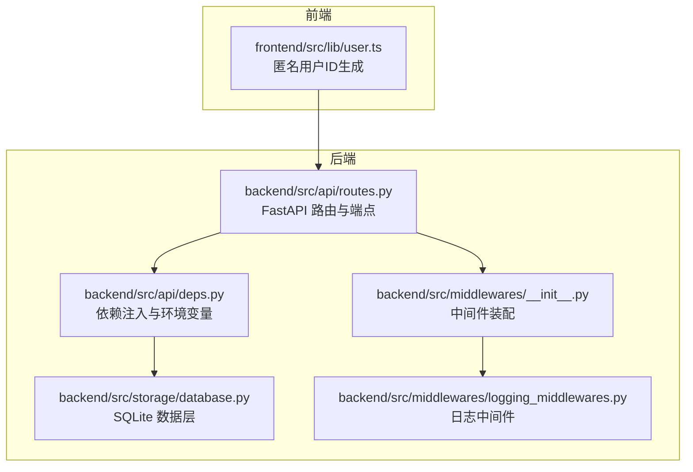
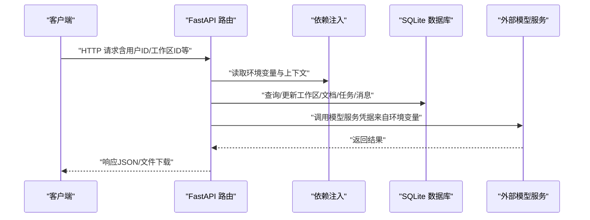
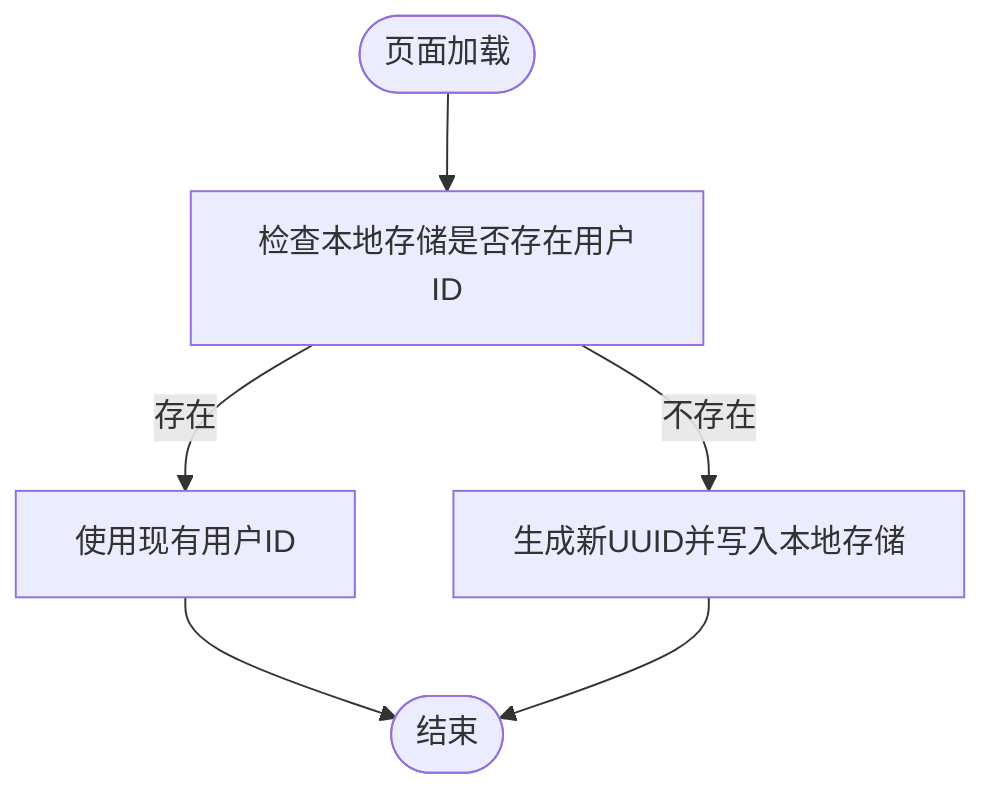
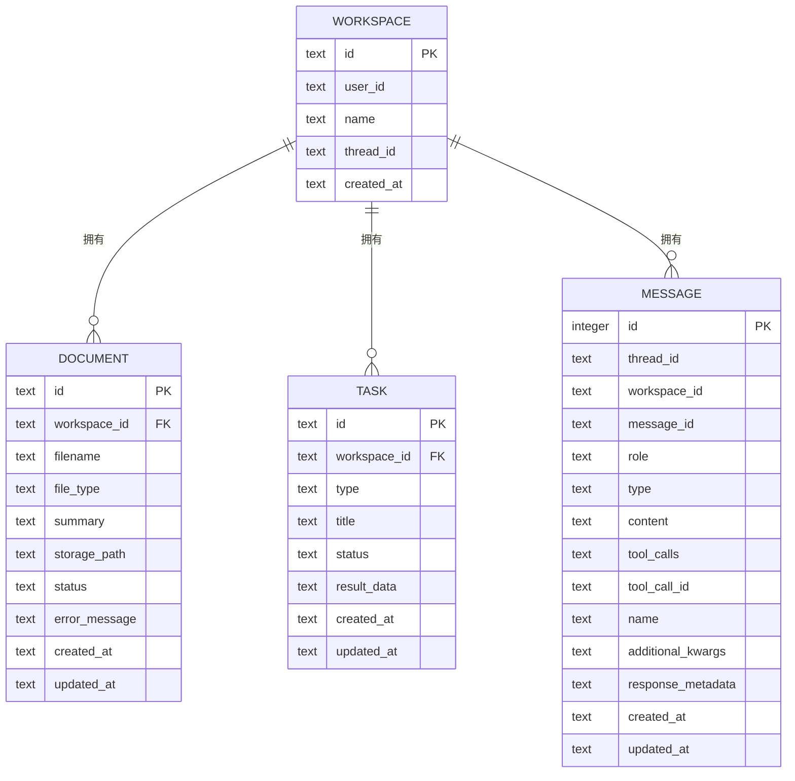
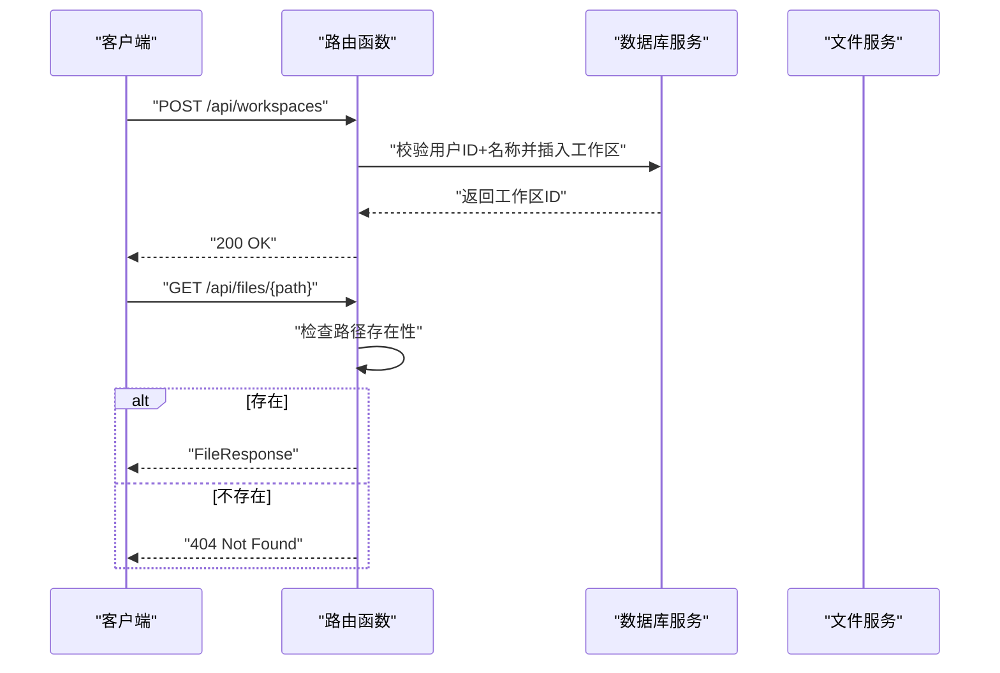
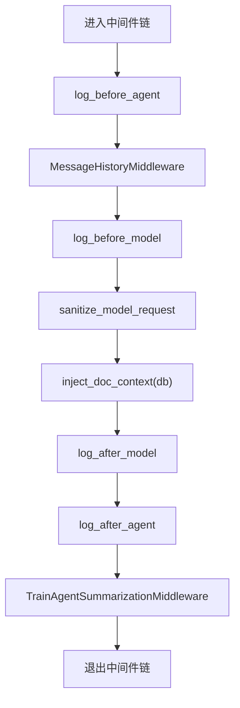
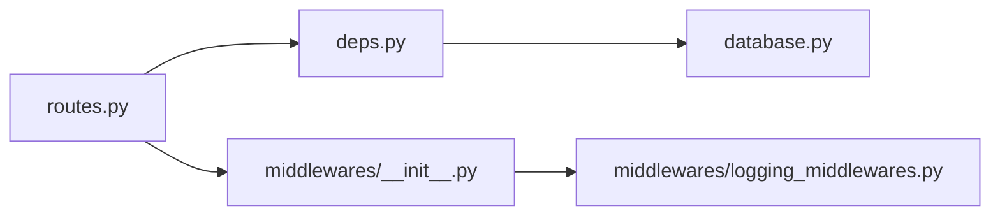

# 认证与授权

<cite>
**本文引用的文件**
- [backend/src/api/routes.py](file://backend/src/api/routes.py)
- [backend/src/api/deps.py](file://backend/src/api/deps.py)
- [backend/src/storage/database.py](file://backend/src/storage/database.py)
- [backend/src/middlewares/__init__.py](file://backend/src/middlewares/__init__.py)
- [backend/src/middlewares/logging_middlewares.py](file://backend/src/middlewares/logging_middlewares.py)
- [frontend/src/lib/user.ts](file://frontend/src/lib/user.ts)
</cite>

## 目录
1. [简介](#简介)
2. [项目结构](#项目结构)
3. [核心组件](#核心组件)
4. [架构总览](#架构总览)
5. [详细组件分析](#详细组件分析)
6. [依赖分析](#依赖分析)
7. [性能考量](#性能考量)
8. [故障排查指南](#故障排查指南)
9. [结论](#结论)
10. [附录](#附录)

## 简介
本文件系统性梳理 Train Agent 后端的认证与授权机制，重点覆盖以下方面：
- 用户标识与会话管理：前端匿名用户标识生成与后端工作区归属模型。
- 权限控制与资源访问：基于工作区 ID 的数据隔离与资源访问控制点。
- API 访问控制：请求参数校验、错误处理与资源删除级联行为。
- 安全最佳实践：日志记录、CORS 配置、静态资源挂载与敏感信息管理。
- 第三方集成安全：外部模型服务调用的凭据注入与环境变量管理。

当前仓库未发现显式的登录态（如 Cookie/JWT）或 RBAC 角色定义，系统通过“用户 ID + 工作区”进行数据隔离与访问边界控制。

## 项目结构
后端采用 FastAPI 应用，路由集中于 API 层，依赖注入在独立模块中完成；数据库持久化由 SQLite 实现；中间件负责日志与消息上下文处理；前端通过本地存储生成匿名用户 ID。

图表来源
- [backend/src/api/routes.py:1-189](file://backend/src/api/routes.py#L1-L189)
- [backend/src/api/deps.py:1-30](file://backend/src/api/deps.py#L1-L30)
- [backend/src/storage/database.py:1-379](file://backend/src/storage/database.py#L1-L379)
- [backend/src/middlewares/__init__.py:1-41](file://backend/src/middlewares/__init__.py#L1-L41)
- [backend/src/middlewares/logging_middlewares.py:1-59](file://backend/src/middlewares/logging_middlewares.py#L1-L59)
- [frontend/src/lib/user.ts:1-12](file://frontend/src/lib/user.ts#L1-L12)

章节来源
- [backend/src/api/routes.py:1-189](file://backend/src/api/routes.py#L1-L189)
- [backend/src/api/deps.py:1-30](file://backend/src/api/deps.py#L1-L30)
- [backend/src/storage/database.py:1-379](file://backend/src/storage/database.py#L1-L379)
- [backend/src/middlewares/__init__.py:1-41](file://backend/src/middlewares/__init__.py#L1-L41)
- [backend/src/middlewares/logging_middlewares.py:1-59](file://backend/src/middlewares/logging_middlewares.py#L1-L59)
- [frontend/src/lib/user.ts:1-12](file://frontend/src/lib/user.ts#L1-L12)

## 核心组件
- 匿名用户标识：前端使用本地存储保存随机 UUID 作为用户标识，若不存在则生成并缓存。
- 工作区与资源归属：后端数据库表包含工作区、文档、任务与消息表，并以 user_id 与 workspace_id 建立逻辑隔离。
- API 路由与访问控制：路由层通过路径参数与查询参数限定资源范围；部分端点直接读取或写入数据库，未见显式鉴权装饰器。
- 中间件与日志：统一记录 Agent 与模型调用前后状态，便于审计与问题定位。
- 依赖注入与外部服务：通过环境变量注入模型服务凭据，避免硬编码。

章节来源
- [frontend/src/lib/user.ts:1-12](file://frontend/src/lib/user.ts#L1-L12)
- [backend/src/storage/database.py:25-78](file://backend/src/storage/database.py#L25-L78)
- [backend/src/api/routes.py:40-106](file://backend/src/api/routes.py#L40-L106)
- [backend/src/middlewares/logging_middlewares.py:15-58](file://backend/src/middlewares/logging_middlewares.py#L15-L58)
- [backend/src/api/deps.py:21-29](file://backend/src/api/deps.py#L21-L29)

## 架构总览
下图展示从客户端到数据库与外部模型服务的整体交互路径，以及关键的安全控制点。

图表来源
- [backend/src/api/routes.py:1-189](file://backend/src/api/routes.py#L1-L189)
- [backend/src/api/deps.py:1-30](file://backend/src/api/deps.py#L1-L30)
- [backend/src/storage/database.py:1-379](file://backend/src/storage/database.py#L1-L379)

## 详细组件分析

### 组件一：用户标识与会话管理
- 前端匿名用户标识：首次访问时生成 UUID 并写入本地存储，后续复用，确保同一设备上的连续会话可识别。
- 后端工作区归属：所有工作区与资源均绑定 user_id，形成天然的用户级隔离边界。
- 会话状态：未检测到 Cookie 或 JWT 等服务端会话状态，系统默认为无状态设计。

图表来源
- [frontend/src/lib/user.ts:1-12](file://frontend/src/lib/user.ts#L1-L12)

章节来源
- [frontend/src/lib/user.ts:1-12](file://frontend/src/lib/user.ts#L1-L12)

### 组件二：工作区与资源访问控制
- 工作区隔离：数据库表结构明确包含 user_id 字段与外键约束，确保资源仅属于指定用户。
- 资源访问端点：路由层通过路径参数与查询参数限定作用域，例如列出某用户的工作区、某工作区下的文档与任务。
- 删除级联：删除工作区会触发文档、向量索引与文件的清理（由业务服务执行），同时删除数据库记录。

图表来源
- [backend/src/storage/database.py:25-78](file://backend/src/storage/database.py#L25-L78)

章节来源
- [backend/src/storage/database.py:25-78](file://backend/src/storage/database.py#L25-L78)
- [backend/src/api/routes.py:40-106](file://backend/src/api/routes.py#L40-L106)

### 组件三：API 访问控制机制
- CORS 配置：开发环境下允许任意来源、方法与头，生产部署需审慎调整。
- 参数校验：Pydantic 模型用于请求体与查询参数校验；异常转换为 HTTP 4xx。
- 错误处理：针对重复命名、资源不存在等场景返回明确错误码与消息。
- 文件下载：静态文件下载端点对路径进行存在性检查，防止越权访问。

图表来源
- [backend/src/api/routes.py:40-106](file://backend/src/api/routes.py#L40-L106)
- [backend/src/api/routes.py:163-174](file://backend/src/api/routes.py#L163-L174)

章节来源
- [backend/src/api/routes.py:1-189](file://backend/src/api/routes.py#L1-L189)

### 组件四：中间件与日志审计
- 执行顺序：按 before_agent → MessageHistory → before_model → sanitize → 注入上下文 → after_model → after_agent 的顺序执行。
- 日志内容：记录 Agent 循环前后消息数量、模型调用前后的上下文长度与工具调用名称，便于审计与性能分析。
- 总结中间件：根据令牌数阈值自动压缩历史消息，降低上下文开销。

图表来源
- [backend/src/middlewares/__init__.py:18-40](file://backend/src/middlewares/__init__.py#L18-L40)
- [backend/src/middlewares/logging_middlewares.py:15-58](file://backend/src/middlewares/logging_middlewares.py#L15-L58)

章节来源
- [backend/src/middlewares/__init__.py:1-41](file://backend/src/middlewares/__init__.py#L1-L41)
- [backend/src/middlewares/logging_middlewares.py:1-59](file://backend/src/middlewares/logging_middlewares.py#L1-L59)

### 组件五：依赖注入与外部服务
- 环境变量：模型服务的模型名、API Key、Base URL 通过环境变量注入，避免代码泄露。
- 上下文初始化：应用启动时加载环境变量并构建全局上下文，供各模块共享。

章节来源
- [backend/src/api/deps.py:1-30](file://backend/src/api/deps.py#L1-L30)

## 依赖分析
- 路由依赖：API 路由依赖依赖注入模块提供的数据库、文件存储与文档服务实例。
- 中间件依赖：中间件装配依赖应用上下文与消息历史回调，日志中间件依赖 LangChain/LangGraph 的回调钩子。
- 数据库依赖：数据库层提供工作区、文档、任务与消息的 CRUD 能力，并维护外键与索引。

图表来源
- [backend/src/api/routes.py:10](file://backend/src/api/routes.py#L10)
- [backend/src/api/deps.py:13-29](file://backend/src/api/deps.py#L13-L29)
- [backend/src/middlewares/__init__.py:18-40](file://backend/src/middlewares/__init__.py#L18-L40)
- [backend/src/middlewares/logging_middlewares.py:15-58](file://backend/src/middlewares/logging_middlewares.py#L15-L58)

章节来源
- [backend/src/api/routes.py:1-189](file://backend/src/api/routes.py#L1-L189)
- [backend/src/api/deps.py:1-30](file://backend/src/api/deps.py#L1-L30)
- [backend/src/middlewares/__init__.py:1-41](file://backend/src/middlewares/__init__.py#L1-L41)
- [backend/src/middlewares/logging_middlewares.py:1-59](file://backend/src/middlewares/logging_middlewares.py#L1-L59)

## 性能考量
- 日志频率：中间件在 Agent 与模型调用前后频繁输出日志，建议在高并发场景下调低日志级别或采样输出。
- 上下文压缩：总结中间件按令牌数阈值压缩历史消息，有助于控制上下文长度，提升响应速度。
- 数据库索引：消息表已建立复合索引以支持分页查询，建议结合实际查询模式评估是否需要额外索引。

[本节为通用指导，不直接分析具体文件]

## 故障排查指南
- 404 文件下载：检查文件存储路径是否正确且文件存在。
- 409 工作区重名：确认用户 ID 与工作区名称组合唯一性。
- CORS 问题：开发环境允许任意来源，生产需限制来源、方法与头。
- 外部模型调用失败：核对环境变量中的模型名、API Key 与 Base URL 是否正确。

章节来源
- [backend/src/api/routes.py:48-51](file://backend/src/api/routes.py#L48-L51)
- [backend/src/api/routes.py:168-169](file://backend/src/api/routes.py#L168-L169)
- [backend/src/api/deps.py:21-25](file://backend/src/api/deps.py#L21-L25)

## 结论
- 当前系统采用“匿名用户 + 工作区”的轻量级隔离模型，未内置登录态与细粒度权限控制。
- 安全控制主要体现在：用户 ID 与工作区 ID 的强制使用、CORS 的可控配置、日志审计与外部服务凭据的环境变量注入。
- 建议在生产环境中补充：严格的 CORS 策略、最小权限原则的资源访问控制、会话与令牌管理、传输加密与访问日志留存。

[本节为总结性内容，不直接分析具体文件]

## 附录

### 认证与授权配置清单
- 用户标识
  - 前端：本地存储匿名用户 ID，不存在时自动生成。
  - 后端：工作区与资源均绑定 user_id，形成用户级隔离。
- 会话管理
  - 无服务端会话状态；客户端通过本地存储维持匿名会话。
- 权限与资源访问
  - 路由层通过路径参数与查询参数限定作用域；删除工作区触发级联清理。
- 外部服务凭据
  - 通过环境变量注入模型服务凭据，避免硬编码。
- CORS 与静态资源
  - 开发环境允许任意来源；静态资源目录按需挂载。

章节来源
- [frontend/src/lib/user.ts:1-12](file://frontend/src/lib/user.ts#L1-L12)
- [backend/src/api/routes.py:40-106](file://backend/src/api/routes.py#L40-L106)
- [backend/src/api/deps.py:21-25](file://backend/src/api/deps.py#L21-L25)