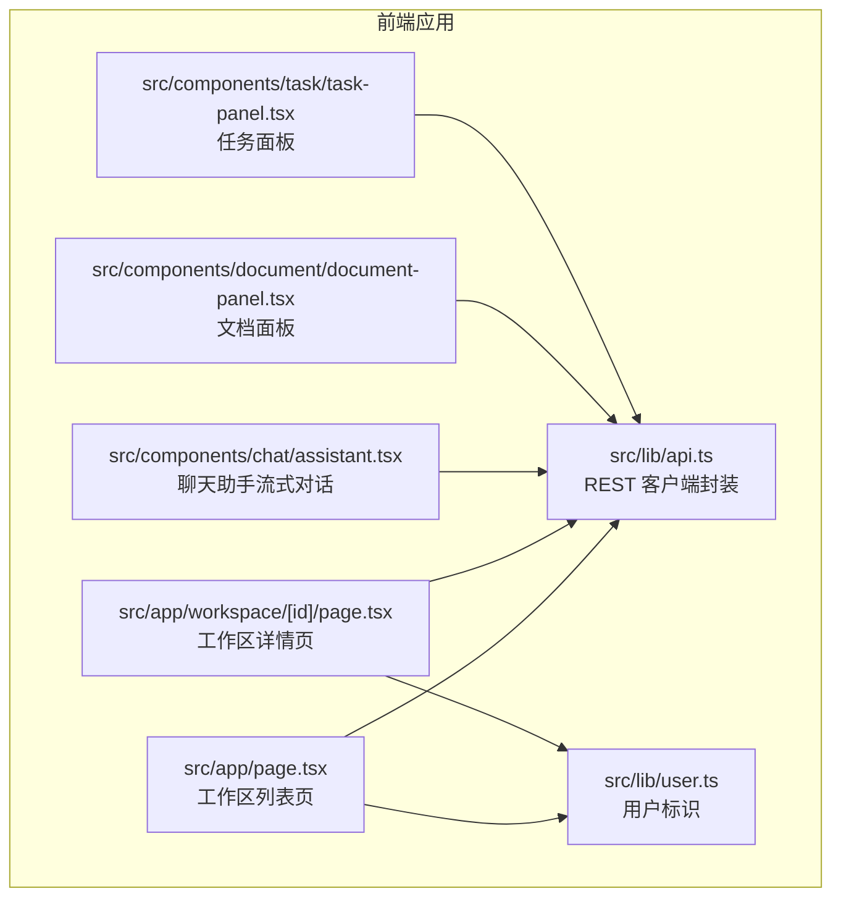
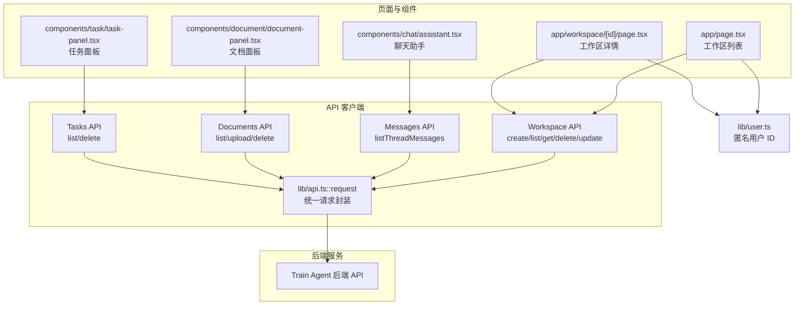
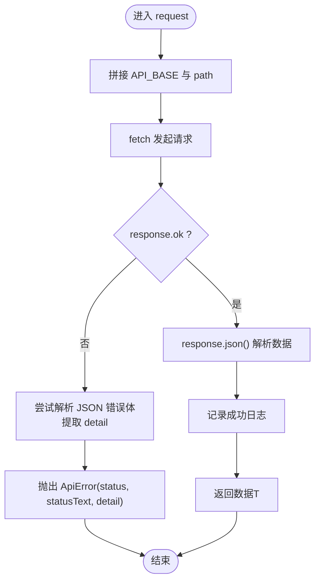
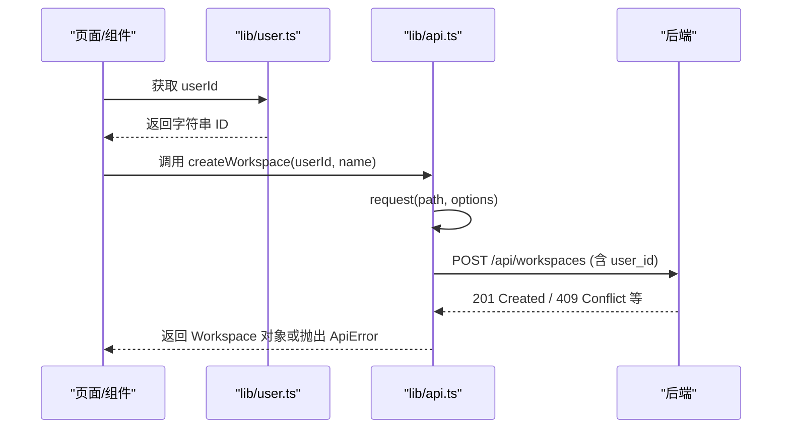
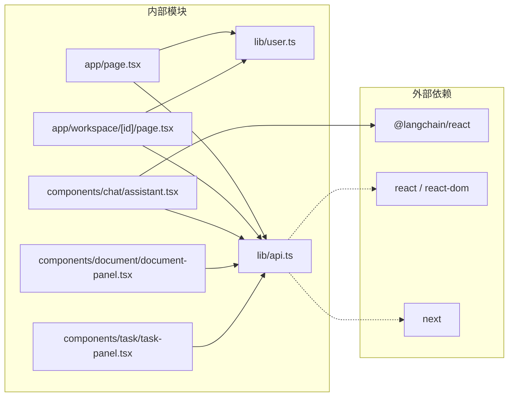

# API 客户端

<cite>
**本文引用的文件**
- [api.ts](file://frontend/src/lib/api.ts)
- [user.ts](file://frontend/src/lib/user.ts)
- [page.tsx](file://frontend/src/app/page.tsx)
- [assistant.tsx](file://frontend/src/components/chat/assistant.tsx)
- [document-panel.tsx](file://frontend/src/components/document/document-panel.tsx)
- [task-panel.tsx](file://frontend/src/components/task/task-panel.tsx)
- [workspace/[id]/page.tsx](file://frontend/src/app/workspace/[id]/page.tsx)
- [package.json](file://frontend/package.json)
</cite>

## 目录
1. [简介](#简介)
2. [项目结构](#项目结构)
3. [核心组件](#核心组件)
4. [架构总览](#架构总览)
5. [详细组件分析](#详细组件分析)
6. [依赖分析](#依赖分析)
7. [性能考虑](#性能考虑)
8. [故障排查指南](#故障排查指南)
9. [结论](#结论)
10. [附录](#附录)

## 简介
本文件面向 Train Agent 前端 API 客户端的开发者与维护者，系统性梳理并解读前端 src/lib/api.ts 中的 RESTful API 封装设计，涵盖以下主题：
- HTTP 请求的统一配置与封装
- 错误处理的统一模式与用户友好提示
- 认证与用户标识（当前实现为本地匿名用户标识）
- 请求缓存策略、重复请求防抖与请求取消机制的现状与改进建议
- 类型安全与最佳实践
- 性能优化建议与调试技巧
- 典型 API 调用场景与错误处理案例

## 项目结构
前端采用 Next.js 应用结构，API 客户端位于 src/lib/api.ts，配套的用户标识逻辑在 src/lib/user.ts。多个页面与组件通过导入 API 方法进行数据交互。

图表来源
- [api.ts:1-196](file://frontend/src/lib/api.ts#L1-L196)
- [user.ts:1-13](file://frontend/src/lib/user.ts#L1-L13)
- [page.tsx:1-121](file://frontend/src/app/page.tsx#L1-L121)
- [workspace/[id]/page.tsx](file://frontend/src/app/workspace/[id]/page.tsx#L1-L65)
- [assistant.tsx:1-292](file://frontend/src/components/chat/assistant.tsx#L1-L292)
- [document-panel.tsx:1-214](file://frontend/src/components/document/document-panel.tsx#L1-L214)
- [task-panel.tsx:1-230](file://frontend/src/components/task/task-panel.tsx#L1-L230)

章节来源
- [api.ts:1-196](file://frontend/src/lib/api.ts#L1-L196)
- [user.ts:1-13](file://frontend/src/lib/user.ts#L1-L13)
- [page.tsx:1-121](file://frontend/src/app/page.tsx#L1-L121)
- [workspace/[id]/page.tsx](file://frontend/src/app/workspace/[id]/page.tsx#L1-L65)
- [assistant.tsx:1-292](file://frontend/src/components/chat/assistant.tsx#L1-L292)
- [document-panel.tsx:1-214](file://frontend/src/components/document/document-panel.tsx#L1-L214)
- [task-panel.tsx:1-230](file://frontend/src/components/task/task-panel.tsx#L1-L230)

## 核心组件
- 统一请求函数 request<T>：负责拼接基础地址、设置默认 JSON 头、执行 fetch、解析响应、抛出统一错误对象。
- 自定义错误类 ApiError：承载状态码、状态文本与后端返回的 detail 字段，便于上层进行分支处理。
- 领域 API 方法族：
  - 工作区：createWorkspace、listWorkspaces、getWorkspace、deleteWorkspace、updateWorkspaceThreadId
  - 消息：listThreadMessages（分页）
  - 文档：listDocuments、uploadDocument（multipart/form-data）、deleteDocument
  - 任务：listTasks、deleteTask
- 用户标识：getUserId（匿名用户 ID，首次访问生成并持久化到 localStorage）

章节来源
- [api.ts:1-196](file://frontend/src/lib/api.ts#L1-L196)
- [user.ts:1-13](file://frontend/src/lib/user.ts#L1-L13)

## 架构总览
下图展示前端各页面与组件如何通过 API 客户端调用后端服务，并体现错误处理与用户标识的参与点。

图表来源
- [page.tsx:1-121](file://frontend/src/app/page.tsx#L1-L121)
- [workspace/[id]/page.tsx](file://frontend/src/app/workspace/[id]/page.tsx#L1-L65)
- [assistant.tsx:1-292](file://frontend/src/components/chat/assistant.tsx#L1-L292)
- [document-panel.tsx:1-214](file://frontend/src/components/document/document-panel.tsx#L1-L214)
- [task-panel.tsx:1-230](file://frontend/src/components/task/task-panel.tsx#L1-L230)
- [api.ts:1-196](file://frontend/src/lib/api.ts#L1-L196)
- [user.ts:1-13](file://frontend/src/lib/user.ts#L1-L13)

## 详细组件分析

### 统一请求与错误处理
- 统一配置
  - 基础地址：从环境变量读取 NEXT_PUBLIC_API_BASE，默认回退到 http://localhost:8000。
  - 默认头：统一设置 Content-Type 为 application/json；允许上层覆盖或追加自定义头。
  - 日志：在请求前后打印方法、路径与响应摘要，便于调试。
- 错误处理
  - 当 response.ok 为假时，尝试解析 JSON 错误体，提取 detail 字段作为错误详情；若解析失败则回退为状态文本。
  - 抛出自定义 ApiError，包含 status、statusText、detail，便于上层按状态码做分支处理。
- 返回值
  - 成功时解析 JSON 并按泛型 T 返回，同时输出日志。

图表来源
- [api.ts:15-42](file://frontend/src/lib/api.ts#L15-L42)

章节来源
- [api.ts:1-42](file://frontend/src/lib/api.ts#L1-L42)

### 认证与用户标识
- 当前实现
  - 通过 localStorage 存储匿名用户 ID，键名固定；若不存在则随机生成并写入。
  - 在工作区相关接口中，将 userId 作为参数传入后端（如创建工作区时携带 user_id）。
- 认证机制
  - 未发现基于 token 的认证流程（无 Authorization 头注入、无登录/登出、无 token 刷新）。
  - 若后续接入 JWT 或会话认证，建议在 request 内统一注入 Authorization 头，并在 401 时触发刷新与重试。

图表来源
- [page.tsx:39-50](file://frontend/src/app/page.tsx#L39-L50)
- [api.ts:54-62](file://frontend/src/lib/api.ts#L54-L62)
- [user.ts:1-13](file://frontend/src/lib/user.ts#L1-L13)

章节来源
- [page.tsx:1-121](file://frontend/src/app/page.tsx#L1-L121)
- [user.ts:1-13](file://frontend/src/lib/user.ts#L1-L13)
- [api.ts:54-62](file://frontend/src/lib/api.ts#L54-L62)

### 请求缓存策略、重复请求防抖与请求取消
- 缓存策略
  - 当前未实现客户端侧缓存（如内存缓存、IndexedDB 缓存）。
- 重复请求防抖
  - 未实现通用防抖；部分组件通过轮询与条件判断避免重复请求（如文档面板在存在活跃状态时定时拉取）。
- 请求取消
  - 未使用 AbortController 进行请求取消；在长耗时或频繁交互场景中可引入取消能力以提升体验与资源利用率。
- 改进建议
  - 为高频查询添加内存缓存与失效策略（如基于 key 的 TTL）。
  - 为列表加载添加防抖（如 200ms），减少抖动带来的重复请求。
  - 为可中断操作（如上传、流式对话）引入 AbortController，在组件卸载或切换时主动取消。

章节来源
- [document-panel.tsx:71-75](file://frontend/src/components/document/document-panel.tsx#L71-L75)
- [assistant.tsx:112-129](file://frontend/src/components/chat/assistant.tsx#L112-L129)

### 错误处理统一模式与用户提示
- 统一错误对象
  - 所有非 2xx 响应均抛出 ApiError，包含状态码与后端 detail，便于上层精准处理。
- 上层使用示例
  - 页面在创建工作区时捕获 ApiError 并根据状态码（如 409）给出用户可理解的提示。
  - 组件在加载失败时记录日志并保持 UI 友好反馈。
- 建议
  - 对常见错误（401、403、404、429、5xx）定义统一映射，结合 i18n 提供本地化提示。
  - 对网络异常（如超时、离线）进行特殊处理，引导用户检查网络或重试。

章节来源
- [page.tsx:39-50](file://frontend/src/app/page.tsx#L39-L50)
- [assistant.tsx:148-164](file://frontend/src/components/chat/assistant.tsx#L148-L164)
- [document-panel.tsx:58-65](file://frontend/src/components/document/document-panel.tsx#L58-L65)

### 类型安全与最佳实践
- 类型安全
  - request<T> 使用泛型确保返回值类型推断；领域接口导出对应 TypeScript 接口（如 Workspace、Document、Task、ThreadMessage）。
  - 参数与返回值均具备明确类型，降低运行期风险。
- 最佳实践
  - 优先使用 request 的泛型能力，避免显式断言。
  - 对外暴露的 API 方法统一遵循“方法名+名词”的命名，参数顺序清晰。
  - 对于复杂请求（如分页、过滤），建议集中在一个选项对象中管理，便于扩展与测试。
  - 对上传等大体积请求，建议增加进度回调与取消支持。

章节来源
- [api.ts:46-196](file://frontend/src/lib/api.ts#L46-L196)

### 性能优化建议
- 减少不必要的渲染与请求
  - 使用 useCallback 包裹回调，避免子组件重复渲染导致的重复请求。
  - 对高频轮询（如任务状态、文档状态）设置合理的间隔与节流。
- 请求合并与批处理
  - 对短时间内多次同类请求，考虑合并为一次批量请求（需后端支持）。
- 缓存与预取
  - 对历史消息、任务列表等静态或低频变化数据进行缓存，命中时直接返回，未命中再发起请求。
- 资源释放
  - 在组件卸载时清理定时器、事件监听与未完成的请求（AbortController）。

章节来源
- [assistant.tsx:76-93](file://frontend/src/components/chat/assistant.tsx#L76-L93)
- [task-panel.tsx:65-69](file://frontend/src/components/task/task-panel.tsx#L65-L69)

### API 调用示例与错误处理案例
- 创建工作区
  - 步骤：获取 userId → 调用 createWorkspace → 刷新列表 → 异常处理（如 409 冲突）。
  - 参考路径：[page.tsx:39-50](file://frontend/src/app/page.tsx#L39-L50)，[api.ts:54-62](file://frontend/src/lib/api.ts#L54-L62)
- 获取工作区详情
  - 步骤：调用 getWorkspace → 渲染页面 → 失败跳转首页。
  - 参考路径：[workspace/[id]/page.tsx](file://frontend/src/app/workspace/[id]/page.tsx#L19-L23)，[api.ts:68-70](file://frontend/src/lib/api.ts#L68-L70)
- 列出消息（带分页）
  - 步骤：构造查询参数 → 调用 listThreadMessages → 合并历史与实时消息。
  - 参考路径：[assistant.tsx:70-93](file://frontend/src/components/chat/assistant.tsx#L70-L93)，[api.ts:107-115](file://frontend/src/lib/api.ts#L107-L115)
- 上传文档
  - 步骤：构建 FormData → 调用 uploadDocument → 更新列表 → 失败记录日志。
  - 参考路径：[document-panel.tsx:77-102](file://frontend/src/components/document/document-panel.tsx#L77-L102)，[api.ts:146-164](file://frontend/src/lib/api.ts#L146-L164)
- 删除任务
  - 步骤：调用 deleteTask → 刷新列表 → 失败记录日志。
  - 参考路径：[task-panel.tsx:153-161](file://frontend/src/components/task/task-panel.tsx#L153-L161)，[api.ts:191-195](file://frontend/src/lib/api.ts#L191-L195)

章节来源
- [page.tsx:1-121](file://frontend/src/app/page.tsx#L1-L121)
- [workspace/[id]/page.tsx](file://frontend/src/app/workspace/[id]/page.tsx#L1-L65)
- [assistant.tsx:1-292](file://frontend/src/components/chat/assistant.tsx#L1-L292)
- [document-panel.tsx:1-214](file://frontend/src/components/document/document-panel.tsx#L1-L214)
- [task-panel.tsx:1-230](file://frontend/src/components/task/task-panel.tsx#L1-L230)
- [api.ts:1-196](file://frontend/src/lib/api.ts#L1-L196)

## 依赖分析
- 外部依赖
  - @langchain/react：用于流式对话的 useStream Hook，与 LangGraph API 交互。
  - react、react-dom、next：框架与运行时。
- 内部依赖关系
  - 页面与组件通过导入 API 方法与用户标识模块，形成单向依赖。
  - API 客户端仅依赖浏览器 fetch 与环境变量，无第三方 HTTP 库依赖。

图表来源
- [package.json:11-26](file://frontend/package.json#L11-L26)
- [assistant.tsx:1-292](file://frontend/src/components/chat/assistant.tsx#L1-L292)
- [api.ts:1-196](file://frontend/src/lib/api.ts#L1-L196)
- [user.ts:1-13](file://frontend/src/lib/user.ts#L1-L13)
- [page.tsx:1-121](file://frontend/src/app/page.tsx#L1-L121)
- [workspace/[id]/page.tsx](file://frontend/src/app/workspace/[id]/page.tsx#L1-L65)
- [document-panel.tsx:1-214](file://frontend/src/components/document/document-panel.tsx#L1-L214)
- [task-panel.tsx:1-230](file://frontend/src/components/task/task-panel.tsx#L1-L230)

章节来源
- [package.json:1-39](file://frontend/package.json#L1-L39)

## 性能考虑
- 网络层
  - 合理设置超时与重试次数，避免长时间阻塞 UI。
  - 对上传与下载大文件场景，建议分片与断点续传（需后端配合）。
- UI 层
  - 列表渲染使用虚拟滚动（如需）与稳定 key，减少重排。
  - 图标与富文本渲染尽量懒加载，避免首屏阻塞。
- 缓存与并发
  - 对相同查询结果进行去重与缓存，避免重复请求。
  - 控制并发请求数量，防止雪崩效应。

## 故障排查指南
- 常见问题定位
  - 404/未找到：检查路径拼接与 workspaceId/threadId 是否正确。
  - 409 冲突：检查唯一约束（如工作区名称），提示用户修改名称后重试。
  - 5xx 服务器错误：查看后端日志与请求体，确认业务逻辑与数据一致性。
  - CORS/跨域：确认后端是否允许前端域名与端口。
- 调试技巧
  - 开启浏览器网络面板，观察请求头、响应体与状态码。
  - 在 request 内设置更详细的日志（如请求体、时间戳），便于复现问题。
  - 对上传失败场景，打印文件大小与类型，辅助定位后端限制。
- 错误处理建议
  - 对 ApiError 的 status 进行分类处理，区分业务错误与系统错误。
  - 对网络异常（如 fetch 抛错）进行兜底，提示用户重试或检查网络。

章节来源
- [page.tsx:39-50](file://frontend/src/app/page.tsx#L39-L50)
- [assistant.tsx:148-164](file://frontend/src/components/chat/assistant.tsx#L148-L164)
- [document-panel.tsx:77-102](file://frontend/src/components/document/document-panel.tsx#L77-L102)
- [task-panel.tsx:153-161](file://frontend/src/components/task/task-panel.tsx#L153-L161)
- [api.ts:25-41](file://frontend/src/lib/api.ts#L25-L41)

## 结论
当前 API 客户端以简洁的 request<T> 封装为核心，提供了统一的错误处理、类型安全与清晰的领域 API 方法。认证方面采用匿名用户标识，尚未集成 token 与刷新机制。在性能与可用性方面，可通过引入缓存、防抖、请求取消与更完善的错误提示进一步增强。建议在后续迭代中逐步补齐认证、缓存与取消能力，并完善网络异常与国际化提示体系。

## 附录
- 环境变量
  - NEXT_PUBLIC_API_BASE：后端 API 基础地址（默认 http://localhost:8000）
  - NEXT_PUBLIC_LANGGRAPH_API_URL：LangGraph 流式对话服务地址（默认 http://localhost:2024）
- 关键实现参考
  - 统一请求与错误处理：[api.ts:15-42](file://frontend/src/lib/api.ts#L15-L42)
  - 工作区 API：[api.ts:54-81](file://frontend/src/lib/api.ts#L54-L81)
  - 消息 API：[api.ts:107-115](file://frontend/src/lib/api.ts#L107-L115)
  - 文档 API：[api.ts:146-173](file://frontend/src/lib/api.ts#L146-L173)
  - 任务 API：[api.ts:187-195](file://frontend/src/lib/api.ts#L187-L195)
  - 用户标识：[user.ts:1-13](file://frontend/src/lib/user.ts#L1-L13)
  - 页面与组件使用示例：
    - 工作区列表页：[page.tsx:1-121](file://frontend/src/app/page.tsx#L1-L121)
    - 工作区详情页：[workspace/[id]/page.tsx](file://frontend/src/app/workspace/[id]/page.tsx#L1-L65)
    - 聊天助手：[assistant.tsx:1-292](file://frontend/src/components/chat/assistant.tsx#L1-L292)
    - 文档面板：[document-panel.tsx:1-214](file://frontend/src/components/document/document-panel.tsx#L1-L214)
    - 任务面板：[task-panel.tsx:1-230](file://frontend/src/components/task/task-panel.tsx#L1-L230)