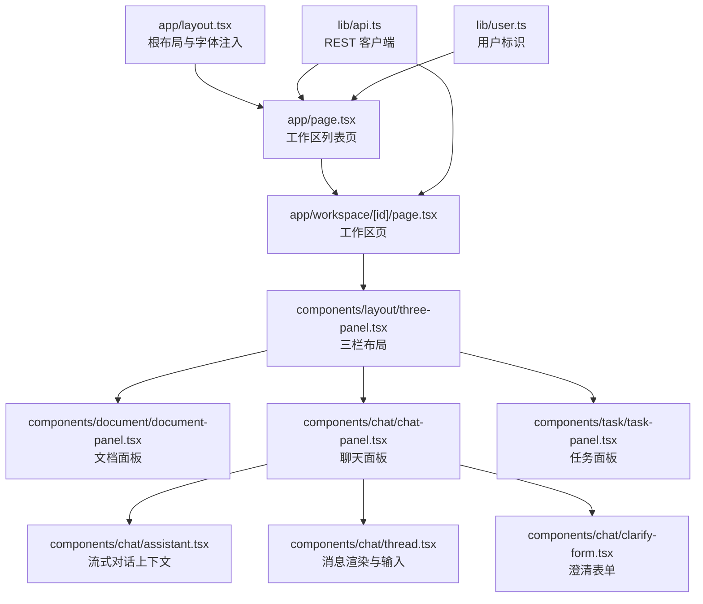
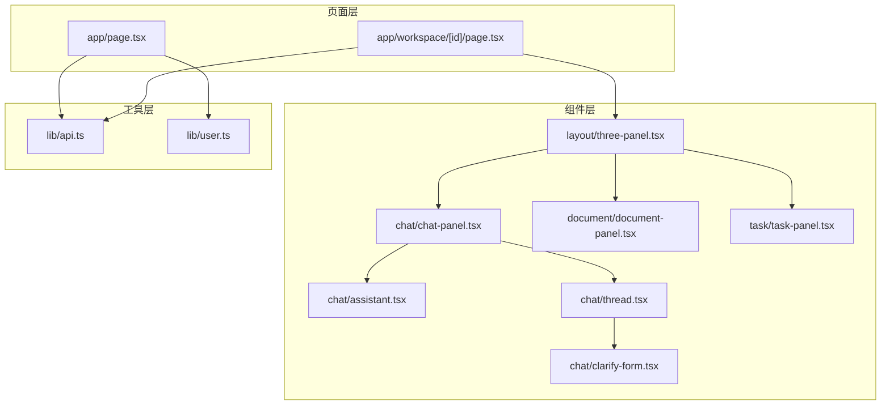
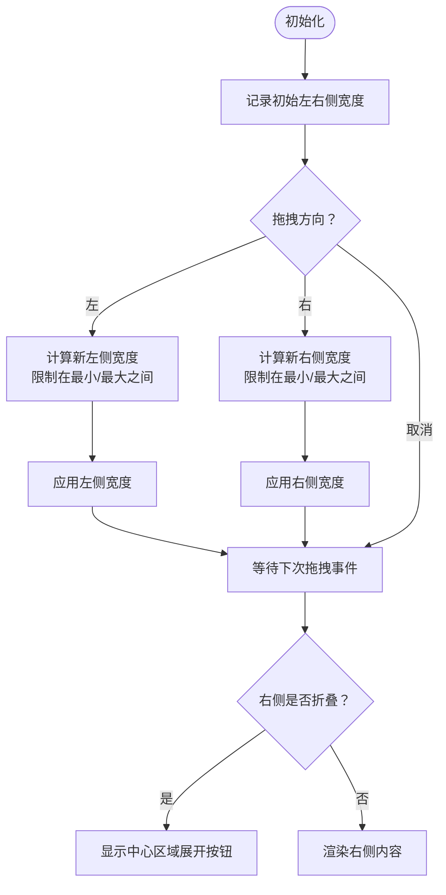
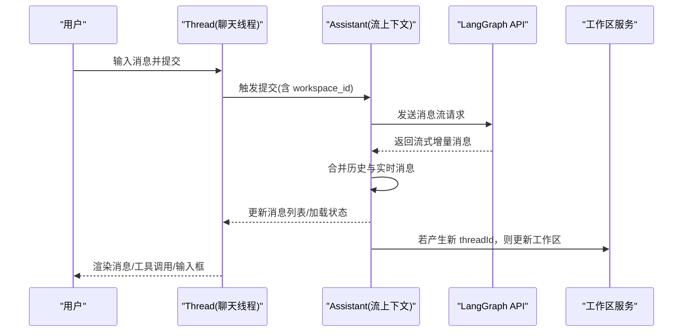
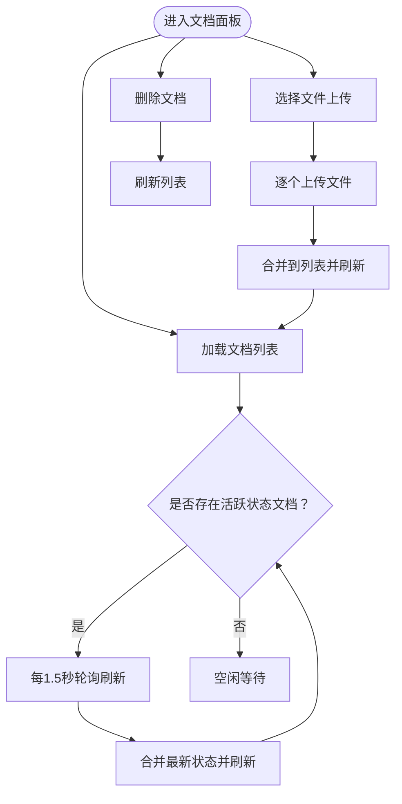
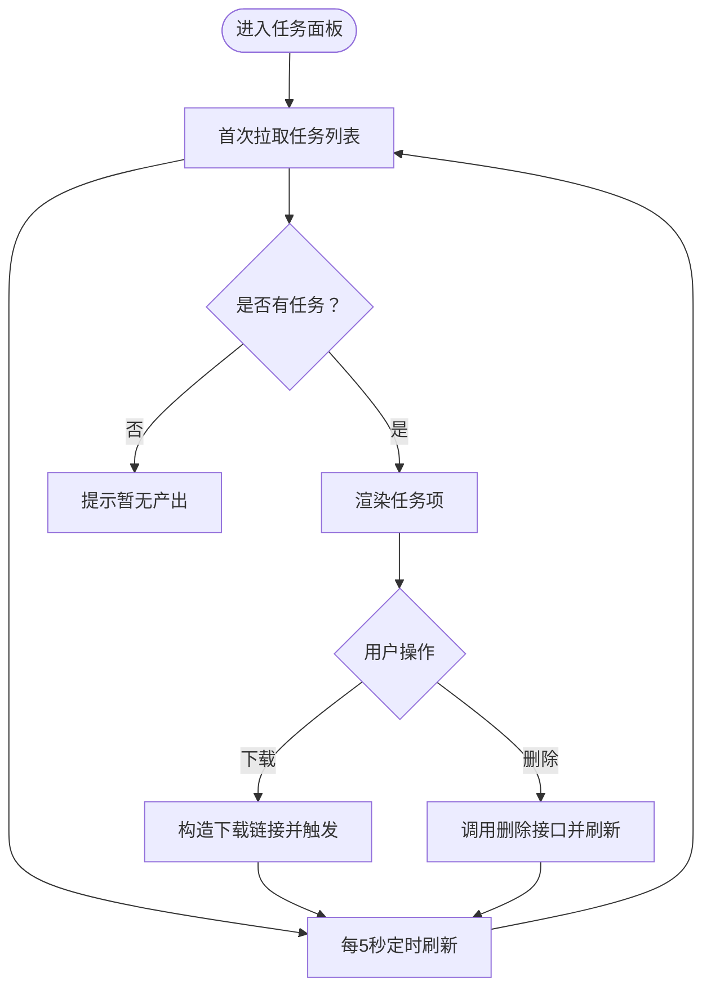
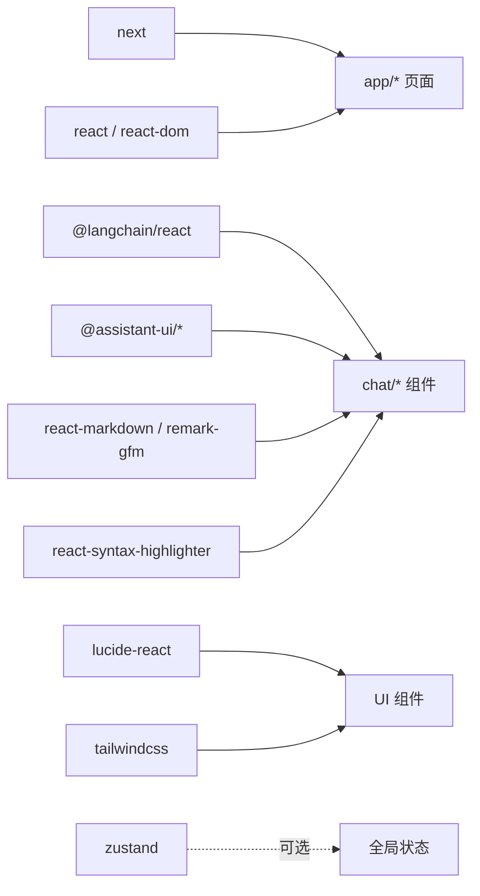

# 前端开发指南

<cite>
**本文引用的文件**
- [frontend/src/app/layout.tsx](file://frontend/src/app/layout.tsx)
- [frontend/src/app/page.tsx](file://frontend/src/app/page.tsx)
- [frontend/src/app/workspace/[id]/page.tsx](file://frontend/src/app/workspace/[id]/page.tsx)
- [frontend/src/components/layout/three-panel.tsx](file://frontend/src/components/layout/three-panel.tsx)
- [frontend/src/components/chat/chat-panel.tsx](file://frontend/src/components/chat/chat-panel.tsx)
- [frontend/src/components/chat/assistant.tsx](file://frontend/src/components/chat/assistant.tsx)
- [frontend/src/components/chat/thread.tsx](file://frontend/src/components/chat/thread.tsx)
- [frontend/src/components/chat/clarify-form.tsx](file://frontend/src/components/chat/clarify-form.tsx)
- [frontend/src/components/document/document-panel.tsx](file://frontend/src/components/document/document-panel.tsx)
- [frontend/src/components/task/task-panel.tsx](file://frontend/src/components/task/task-panel.tsx)
- [frontend/src/lib/api.ts](file://frontend/src/lib/api.ts)
- [frontend/src/lib/user.ts](file://frontend/src/lib/user.ts)
- [frontend/package.json](file://frontend/package.json)
- [frontend/tsconfig.json](file://frontend/tsconfig.json)
- [frontend/next.config.ts](file://frontend/next.config.ts)
</cite>

## 目录
1. [简介](#简介)
2. [项目结构](#项目结构)
3. [核心组件](#核心组件)
4. [架构总览](#架构总览)
5. [组件详解](#组件详解)
6. [依赖关系分析](#依赖关系分析)
7. [性能与可维护性](#性能与可维护性)
8. [故障排查](#故障排查)
9. [结论](#结论)
10. [附录](#附录)

## 简介
本指南面向 Train Agent 前端开发者，围绕基于 Next.js App Router 的前端架构进行系统化说明，涵盖页面路由、组件组织、状态管理、API 客户端、路由与导航、类型定义、样式组织与性能优化，并提供可直接落地的开发流程与最佳实践。

## 项目结构
- 页面层采用 Next.js App Router，入口布局与根页面位于 app 目录；工作区页面通过动态路由 workspace/[id] 实现按工作区隔离。
- 组件层以功能域划分：chat、document、task、layout 等目录清晰分离职责。
- 工具与类型集中在 lib 目录：API 客户端与用户工具。
- 样式与主题通过全局 CSS 与字体变量注入，Tailwind v4 配置在构建系统中生效。



图表来源
- [frontend/src/app/layout.tsx:1-34](file://frontend/src/app/layout.tsx#L1-L34)
- [frontend/src/app/page.tsx:1-121](file://frontend/src/app/page.tsx#L1-L121)
- [frontend/src/app/workspace/[id]/page.tsx](file://frontend/src/app/workspace/[id]/page.tsx#L1-L65)
- [frontend/src/components/layout/three-panel.tsx:1-132](file://frontend/src/components/layout/three-panel.tsx#L1-L132)
- [frontend/src/components/chat/chat-panel.tsx:1-17](file://frontend/src/components/chat/chat-panel.tsx#L1-L17)
- [frontend/src/components/chat/assistant.tsx:1-292](file://frontend/src/components/chat/assistant.tsx#L1-L292)
- [frontend/src/components/chat/thread.tsx:1-800](file://frontend/src/components/chat/thread.tsx#L1-L800)
- [frontend/src/components/chat/clarify-form.tsx:1-230](file://frontend/src/components/chat/clarify-form.tsx#L1-L230)
- [frontend/src/components/document/document-panel.tsx:1-214](file://frontend/src/components/document/document-panel.tsx#L1-L214)
- [frontend/src/components/task/task-panel.tsx:1-230](file://frontend/src/components/task/task-panel.tsx#L1-L230)
- [frontend/src/lib/api.ts:1-196](file://frontend/src/lib/api.ts#L1-L196)
- [frontend/src/lib/user.ts:1-13](file://frontend/src/lib/user.ts#L1-L13)

章节来源
- [frontend/src/app/layout.tsx:1-34](file://frontend/src/app/layout.tsx#L1-L34)
- [frontend/src/app/page.tsx:1-121](file://frontend/src/app/page.tsx#L1-L121)
- [frontend/src/app/workspace/[id]/page.tsx](file://frontend/src/app/workspace/[id]/page.tsx#L1-L65)

## 核心组件
- 根布局与字体：在根布局中注入 Geist 字体变量与全局样式，确保全站一致的排版与抗锯齿。
- 工作区列表页：负责加载用户工作区、创建/删除工作区、打开工作区详情页。
- 工作区页：三栏布局承载文档、聊天与任务三大视图，支持右侧产出面板折叠与拖拽调整宽度。
- 聊天面板：封装 LangChain 流式对话上下文，聚合历史消息与实时流消息，处理中断与恢复。
- 文档面板：展示并管理知识库文档，自动轮询处理状态，支持上传与删除。
- 任务面板：展示任务列表，定时刷新任务状态，支持下载与删除。
- API 客户端：统一请求封装、错误处理与类型定义，支持工作区、消息、文档、任务等资源。
- 用户工具：本地持久化用户标识，保证匿名场景下的稳定身份。

章节来源
- [frontend/src/app/layout.tsx:1-34](file://frontend/src/app/layout.tsx#L1-L34)
- [frontend/src/app/page.tsx:1-121](file://frontend/src/app/page.tsx#L1-L121)
- [frontend/src/app/workspace/[id]/page.tsx](file://frontend/src/app/workspace/[id]/page.tsx#L1-L65)
- [frontend/src/components/layout/three-panel.tsx:1-132](file://frontend/src/components/layout/three-panel.tsx#L1-L132)
- [frontend/src/components/chat/chat-panel.tsx:1-17](file://frontend/src/components/chat/chat-panel.tsx#L1-L17)
- [frontend/src/components/chat/assistant.tsx:1-292](file://frontend/src/components/chat/assistant.tsx#L1-L292)
- [frontend/src/components/chat/thread.tsx:1-800](file://frontend/src/components/chat/thread.tsx#L1-L800)
- [frontend/src/components/chat/clarify-form.tsx:1-230](file://frontend/src/components/chat/clarify-form.tsx#L1-L230)
- [frontend/src/components/document/document-panel.tsx:1-214](file://frontend/src/components/document/document-panel.tsx#L1-L214)
- [frontend/src/components/task/task-panel.tsx:1-230](file://frontend/src/components/task/task-panel.tsx#L1-L230)
- [frontend/src/lib/api.ts:1-196](file://frontend/src/lib/api.ts#L1-L196)
- [frontend/src/lib/user.ts:1-13](file://frontend/src/lib/user.ts#L1-L13)

## 架构总览
前端采用“页面 + 组件 + 工具库”的分层架构：
- 页面层：App Router 动态路由与客户端组件，负责数据拉取与导航。
- 组件层：高内聚低耦合的功能组件，通过 Props 与 Context 解耦。
- 工具层：API 客户端与用户工具，提供类型安全与错误处理。
- 数据流：页面组件通过 API 客户端获取数据，组件内部通过 React Hooks 与 Context 管理状态，必要时通过回调触发重新拉取。



图表来源
- [frontend/src/app/page.tsx:1-121](file://frontend/src/app/page.tsx#L1-L121)
- [frontend/src/app/workspace/[id]/page.tsx](file://frontend/src/app/workspace/[id]/page.tsx#L1-L65)
- [frontend/src/components/layout/three-panel.tsx:1-132](file://frontend/src/components/layout/three-panel.tsx#L1-L132)
- [frontend/src/components/chat/chat-panel.tsx:1-17](file://frontend/src/components/chat/chat-panel.tsx#L1-L17)
- [frontend/src/components/chat/assistant.tsx:1-292](file://frontend/src/components/chat/assistant.tsx#L1-L292)
- [frontend/src/components/chat/thread.tsx:1-800](file://frontend/src/components/chat/thread.tsx#L1-L800)
- [frontend/src/components/chat/clarify-form.tsx:1-230](file://frontend/src/components/chat/clarify-form.tsx#L1-L230)
- [frontend/src/components/document/document-panel.tsx:1-214](file://frontend/src/components/document/document-panel.tsx#L1-L214)
- [frontend/src/components/task/task-panel.tsx:1-230](file://frontend/src/components/task/task-panel.tsx#L1-L230)
- [frontend/src/lib/api.ts:1-196](file://frontend/src/lib/api.ts#L1-L196)
- [frontend/src/lib/user.ts:1-13](file://frontend/src/lib/user.ts#L1-L13)

## 组件详解

### 页面与导航
- 根布局：注入字体变量与全局样式，设置 html/body 结构。
- 工作区列表页：使用客户端组件，通过用户 ID 获取工作区列表，支持新建、删除与跳转到工作区详情。
- 工作区详情页：三栏布局承载文档、聊天与任务；顶部回退按钮与工作区标题；右侧任务面板支持折叠与拖拽宽度。

章节来源
- [frontend/src/app/layout.tsx:1-34](file://frontend/src/app/layout.tsx#L1-L34)
- [frontend/src/app/page.tsx:1-121](file://frontend/src/app/page.tsx#L1-L121)
- [frontend/src/app/workspace/[id]/page.tsx](file://frontend/src/app/workspace/[id]/page.tsx#L1-L65)

### 三栏布局（ThreePanel）
- 支持左右两侧行宽自适应，最小/最大宽度约束。
- 拖拽调整左右侧宽度，中心区域自适应。
- 右侧折叠时在中心区域显示展开按钮，点击后恢复右侧视图。



图表来源
- [frontend/src/components/layout/three-panel.tsx:1-132](file://frontend/src/components/layout/three-panel.tsx#L1-L132)

章节来源
- [frontend/src/components/layout/three-panel.tsx:1-132](file://frontend/src/components/layout/three-panel.tsx#L1-L132)

### 聊天面板与消息流
- ChatPanel：将 Assistant 作为容器，内部嵌入 Thread。
- Assistant：通过 LangChain SDK 连接后端流式接口，维护 threadId、历史消息游标、实时消息集合，提供提交、停止、恢复与历史加载能力。
- Thread：负责消息分组（人类消息与 AI Turn）、渲染 Markdown、工具调用卡片、输入框与中断表单。
- ClarifyForm：用于处理模型发起的信息收集中断，支持多字段、必填校验与提交/取消。



图表来源
- [frontend/src/components/chat/chat-panel.tsx:1-17](file://frontend/src/components/chat/chat-panel.tsx#L1-L17)
- [frontend/src/components/chat/assistant.tsx:1-292](file://frontend/src/components/chat/assistant.tsx#L1-L292)
- [frontend/src/components/chat/thread.tsx:1-800](file://frontend/src/components/chat/thread.tsx#L1-L800)
- [frontend/src/lib/api.ts:1-196](file://frontend/src/lib/api.ts#L1-L196)

章节来源
- [frontend/src/components/chat/chat-panel.tsx:1-17](file://frontend/src/components/chat/chat-panel.tsx#L1-L17)
- [frontend/src/components/chat/assistant.tsx:1-292](file://frontend/src/components/chat/assistant.tsx#L1-L292)
- [frontend/src/components/chat/thread.tsx:1-800](file://frontend/src/components/chat/thread.tsx#L1-L800)
- [frontend/src/components/chat/clarify-form.tsx:1-230](file://frontend/src/components/chat/clarify-form.tsx#L1-L230)

### 文档面板
- 列表：首次加载后若存在活跃状态文档，每 1.5 秒轮询刷新一次。
- 上传：选择文件后逐个上传，上传完成后合并到列表顶部并重新拉取。
- 删除：调用删除接口后刷新列表。
- 状态可视化：根据状态映射图标、颜色与标签，错误状态显示错误信息摘要。



图表来源
- [frontend/src/components/document/document-panel.tsx:1-214](file://frontend/src/components/document/document-panel.tsx#L1-L214)

章节来源
- [frontend/src/components/document/document-panel.tsx:1-214](file://frontend/src/components/document/document-panel.tsx#L1-L214)

### 任务面板
- 列表：每 5 秒轮询刷新任务状态。
- 下载：当任务完成且存在结果路径时，拼接文件下载链接并触发下载。
- 删除：调用删除接口后回调刷新列表。
- 折叠：支持折叠右侧产出面板，通过按钮切换。



图表来源
- [frontend/src/components/task/task-panel.tsx:1-230](file://frontend/src/components/task/task-panel.tsx#L1-L230)

章节来源
- [frontend/src/components/task/task-panel.tsx:1-230](file://frontend/src/components/task/task-panel.tsx#L1-L230)

### API 客户端与错误处理
- 统一请求封装：内置日志输出、响应体解析与非 OK 状态抛出自定义 ApiError。
- 资源接口：工作区、消息、文档、任务均有对应类型与方法。
- 上传文档：使用 FormData，避免 JSON 序列化二进制问题。
- 环境变量：通过 NEXT_PUBLIC_API_BASE 控制后端地址。

```mermaid
classDiagram
class ApiError {
+number status
+string detail
+constructor(status, statusText, detail)
}
class Api {
+request(path, options) Promise~T~
+createWorkspace(userId, name) Promise~Workspace~
+listWorkspaces(userId) Promise~Workspace[]~
+getWorkspace(id) Promise~Workspace~
+deleteWorkspace(id) Promise~void~
+updateWorkspaceThreadId(id, threadId) Promise~{ok}~
+listThreadMessages(threadId, options) Promise~ThreadMessagesPage~
+listDocuments(workspaceId) Promise~Document[]~
+uploadDocument(workspaceId, file) Promise~Document~
+deleteDocument(workspaceId, docId) Promise~void~
+listTasks(workspaceId) Promise~Task[]~
+deleteTask(workspaceId, taskId) Promise~{ok}~
}
Api ..> ApiError : "抛出"
```

图表来源
- [frontend/src/lib/api.ts:1-196](file://frontend/src/lib/api.ts#L1-L196)

章节来源
- [frontend/src/lib/api.ts:1-196](file://frontend/src/lib/api.ts#L1-L196)

### 用户标识与本地存储
- 用户 ID：通过 localStorage 存储，不存在则随机生成，保证匿名场景下的一致性。
- 在工作区列表页通过 getUserId 获取当前用户标识，用于筛选工作区。

章节来源
- [frontend/src/lib/user.ts:1-13](file://frontend/src/lib/user.ts#L1-L13)
- [frontend/src/app/page.tsx:1-121](file://frontend/src/app/page.tsx#L1-L121)

## 依赖关系分析
- Next.js 16：App Router、客户端组件、字体注入与全局样式。
- @langchain/react 与 @assistant-ui：提供流式对话能力与 UI 组件生态。
- lucide-react：图标库。
- Tailwind v4：原子化样式框架。
- react-markdown / remark-gfm / react-syntax-highlighter：Markdown 渲染与代码高亮。
- zustand：可选全局状态管理（当前项目未直接使用，但可作为扩展）。



图表来源
- [frontend/package.json:1-39](file://frontend/package.json#L1-L39)

章节来源
- [frontend/package.json:1-39](file://frontend/package.json#L1-L39)
- [frontend/tsconfig.json:1-35](file://frontend/tsconfig.json#L1-L35)
- [frontend/next.config.ts:1-8](file://frontend/next.config.ts#L1-L8)

## 性能与可维护性
- 懒加载与按需渲染：三栏布局仅在需要时渲染右侧任务面板；聊天面板按需加载历史消息。
- 轮询策略：文档与任务面板分别采用不同周期轮询，避免过度请求。
- 滚动与分页：聊天线程在接近顶部时才加载更早的历史消息，减少一次性渲染压力。
- 错误收敛：统一的 ApiError 便于集中处理与降级。
- 类型安全：所有 API 方法均带有明确的返回类型，降低运行期风险。
- 样式组织：全局样式与组件局部样式分离，Tailwind 原子类提升复用效率。

## 故障排查
- API 失败：检查 NEXT_PUBLIC_API_BASE 是否正确，确认后端接口可用；查看控制台日志定位具体请求与状态码。
- 流式对话异常：关注 Assistant 中的错误恢复逻辑（如 threadId 丢失时清空），确认 LangGraph 服务可达。
- 文件上传失败：确认上传接口与跨域配置，检查文件大小与类型限制。
- 任务下载失败：确认 result_data 中的文件路径与后端静态文件服务配置一致。

章节来源
- [frontend/src/lib/api.ts:1-196](file://frontend/src/lib/api.ts#L1-L196)
- [frontend/src/components/chat/assistant.tsx:1-292](file://frontend/src/components/chat/assistant.tsx#L1-L292)
- [frontend/src/components/task/task-panel.tsx:1-230](file://frontend/src/components/task/task-panel.tsx#L1-L230)

## 结论
本项目以 Next.js App Router 为基础，结合 LangChain 生态与 Tailwind 原子化样式，构建了清晰的页面与组件层次。通过统一的 API 客户端与类型定义，保障了前后端协作的稳定性；通过三栏布局与流式对话，提供了良好的用户体验。建议后续在全局状态管理上引入 Zustand 或 Context，进一步解耦跨组件共享状态。

## 附录

### 开发流程建议
- 新增页面：在 app 下新增路由文件，使用客户端组件与必要的数据拉取。
- 新增组件：优先拆分为纯展示组件与容器组件，通过 Props 明确依赖。
- 新增 API：先在 lib/api.ts 中声明类型与方法，再在组件中调用并处理错误。
- 样式规范：优先使用 Tailwind 原子类，必要时在全局 CSS 中补充基础样式。
- 调试技巧：利用控制台日志与 ApiError 的 detail 字段快速定位问题。

### TypeScript 最佳实践
- 为每个 API 方法提供明确的返回类型，避免 any。
- 对外暴露的组件 Props 使用接口定义，保持一致性。
- 对于可能为空的数据，使用可选链或守卫判断，避免运行时错误。
- 在 tsconfig.json 中启用严格模式，提升类型检查覆盖率。