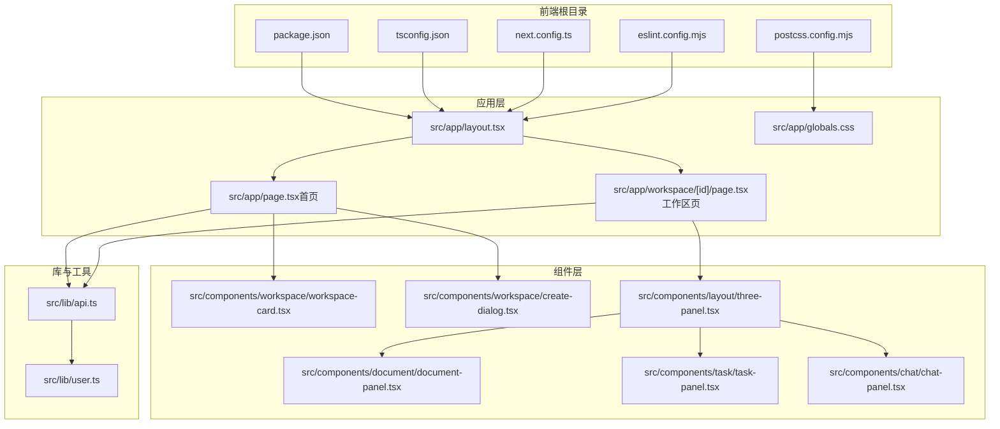
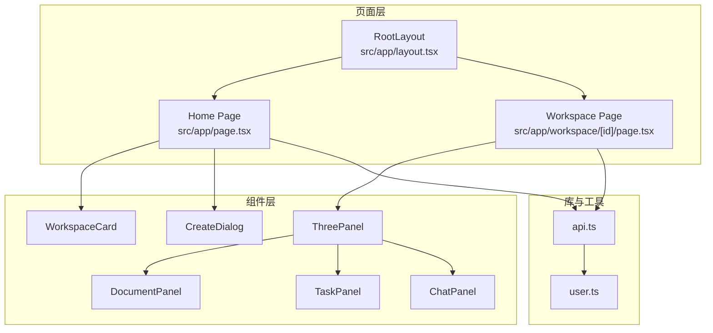
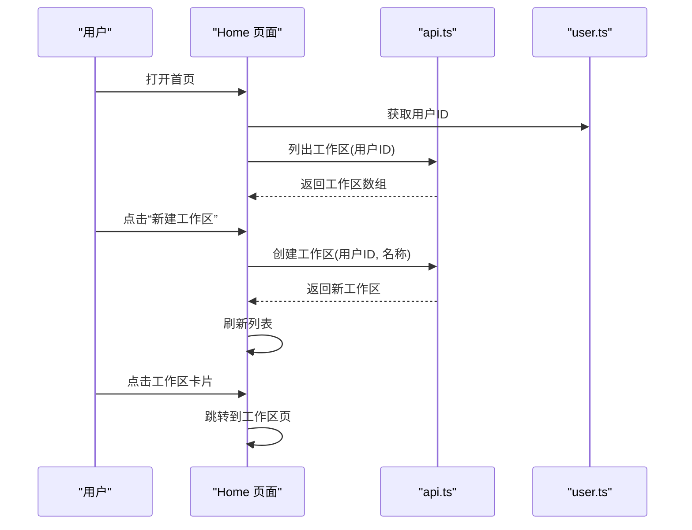
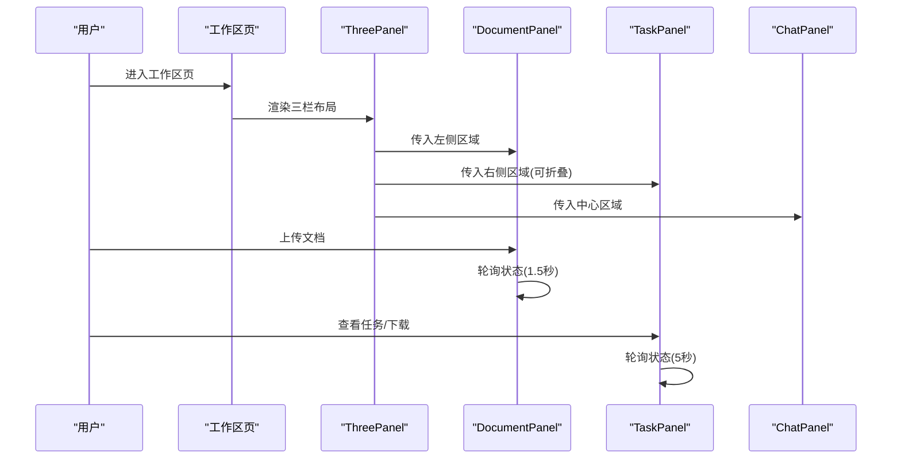
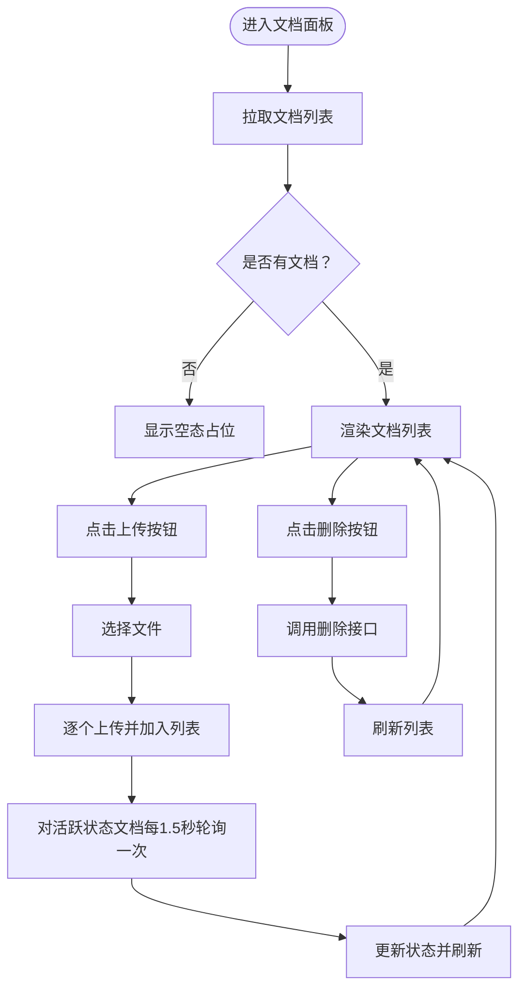
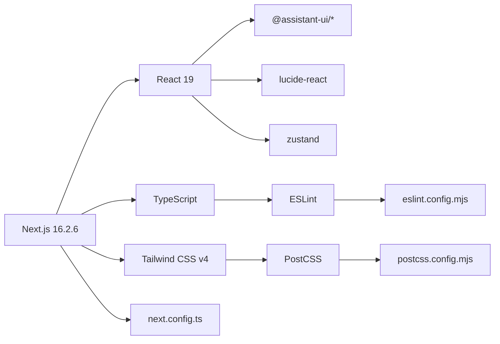

# 前端架构总览

<cite>
**本文引用的文件**
- [package.json](file://frontend/package.json)
- [tsconfig.json](file://frontend/tsconfig.json)
- [next.config.ts](file://frontend/next.config.ts)
- [postcss.config.mjs](file://frontend/postcss.config.mjs)
- [eslint.config.mjs](file://frontend/eslint.config.mjs)
- [layout.tsx](file://frontend/src/app/layout.tsx)
- [page.tsx（首页）](file://frontend/src/app/page.tsx)
- [globals.css](file://frontend/src/app/globals.css)
- [api.ts](file://frontend/src/lib/api.ts)
- [user.ts](file://frontend/src/lib/user.ts)
- [workspace-card.tsx](file://frontend/src/components/workspace/workspace-card.tsx)
- [create-dialog.tsx](file://frontend/src/components/workspace/create-dialog.tsx)
- [three-panel.tsx](file://frontend/src/components/layout/three-panel.tsx)
- [page.tsx（工作区）](file://frontend/src/app/workspace/[id]/page.tsx)
- [chat-panel.tsx](file://frontend/src/components/chat/chat-panel.tsx)
- [document-panel.tsx](file://frontend/src/components/document/document-panel.tsx)
- [task-panel.tsx](file://frontend/src/components/task/task-panel.tsx)
</cite>

## 目录
1. [引言](#引言)
2. [项目结构](#项目结构)
3. [核心组件](#核心组件)
4. [架构总览](#架构总览)
5. [详细组件分析](#详细组件分析)
6. [依赖关系分析](#依赖关系分析)
7. [性能考虑](#性能考虑)
8. [故障排查指南](#故障排查指南)
9. [结论](#结论)
10. [附录](#附录)

## 引言
本文件面向 Train Agent 前端子项目，系统性梳理基于 Next.js 16.2.6 的现代前端架构设计与实现要点。内容覆盖 App Router 路由与布局体系、页面与动态路由配置、TypeScript 编译与类型安全、Tailwind CSS 实用优先的样式策略、组件化与状态管理思路、构建与开发流程，以及生产优化与最佳实践建议。目标是帮助开发者快速理解并高效迭代前端能力。

## 项目结构
前端采用 Next.js App Router 的“约定优于配置”组织方式，根目录下包含应用入口、公共资源、源码与工具链配置。核心目录与职责如下：
- frontend/src/app：App Router 页面与布局，按路径组织页面与嵌套路由
- frontend/src/components：可复用 UI 组件与业务组件
- frontend/src/lib：API 封装与用户上下文逻辑
- frontend/public：静态资源（图标、媒体等）
- 工具链配置：package.json、tsconfig.json、next.config.ts、postcss.config.mjs、eslint.config.mjs

图表来源
- [layout.tsx:1-34](file://frontend/src/app/layout.tsx#L1-L34)
- [page.tsx（首页）:1-121](file://frontend/src/app/page.tsx#L1-L121)
- [page.tsx（工作区）:1-65](file://frontend/src/app/workspace/[id]/page.tsx#L1-L65)
- [globals.css:1-201](file://frontend/src/app/globals.css#L1-L201)
- [workspace-card.tsx:1-51](file://frontend/src/components/workspace/workspace-card.tsx#L1-L51)
- [create-dialog.tsx:1-90](file://frontend/src/components/workspace/create-dialog.tsx#L1-L90)
- [three-panel.tsx:1-132](file://frontend/src/components/layout/three-panel.tsx#L1-L132)
- [document-panel.tsx:1-214](file://frontend/src/components/document/document-panel.tsx#L1-L214)
- [task-panel.tsx:1-230](file://frontend/src/components/task/task-panel.tsx#L1-L230)
- [chat-panel.tsx:1-17](file://frontend/src/components/chat/chat-panel.tsx#L1-L17)
- [api.ts:1-196](file://frontend/src/lib/api.ts#L1-L196)
- [user.ts:1-13](file://frontend/src/lib/user.ts#L1-L13)

章节来源
- [package.json:1-39](file://frontend/package.json#L1-L39)
- [tsconfig.json:1-35](file://frontend/tsconfig.json#L1-L35)
- [next.config.ts:1-8](file://frontend/next.config.ts#L1-L8)
- [postcss.config.mjs:1-8](file://frontend/postcss.config.mjs#L1-L8)
- [eslint.config.mjs:1-19](file://frontend/eslint.config.mjs#L1-L19)

## 核心组件
- 应用根布局与元数据：定义全局字体变量、主题色与基础样式注入，统一页面容器与语言属性。
- 首页：工作区列表展示、新建对话框、加载与空态处理、错误分支与导航跳转。
- 工作区页：三栏布局容器、左侧知识库、中间对话面板、右侧任务产出面板。
- 通用组件：工作区卡片、创建对话框、三栏布局、文档面板、任务面板、聊天面板。
- 库函数：API 请求封装、错误类型、用户标识生成与持久化。

章节来源
- [layout.tsx:1-34](file://frontend/src/app/layout.tsx#L1-L34)
- [page.tsx（首页）:1-121](file://frontend/src/app/page.tsx#L1-L121)
- [page.tsx（工作区）:1-65](file://frontend/src/app/workspace/[id]/page.tsx#L1-L65)
- [workspace-card.tsx:1-51](file://frontend/src/components/workspace/workspace-card.tsx#L1-L51)
- [create-dialog.tsx:1-90](file://frontend/src/components/workspace/create-dialog.tsx#L1-L90)
- [three-panel.tsx:1-132](file://frontend/src/components/layout/three-panel.tsx#L1-L132)
- [document-panel.tsx:1-214](file://frontend/src/components/document/document-panel.tsx#L1-L214)
- [task-panel.tsx:1-230](file://frontend/src/components/task/task-panel.tsx#L1-L230)
- [chat-panel.tsx:1-17](file://frontend/src/components/chat/chat-panel.tsx#L1-L17)
- [api.ts:1-196](file://frontend/src/lib/api.ts#L1-L196)
- [user.ts:1-13](file://frontend/src/lib/user.ts#L1-L13)

## 架构总览
整体采用“页面驱动 + 组件组合”的架构模式：
- 页面层：通过 App Router 的文件系统路由组织页面与嵌套路由，根布局统一注入全局样式与字体。
- 组件层：以功能域划分组件（workspace/document/task/chat），通过 props 传递数据与回调，实现高内聚低耦合。
- 数据层：通过 lib/api.ts 封装请求与错误处理，统一与后端交互；用户标识通过 lib/user.ts 生成并缓存。
- 样式层：Tailwind CSS 作为原子化样式工具，结合 CSS 变量与 @theme 定义主题，实现深色主题与一致性配色。

图表来源
- [layout.tsx:1-34](file://frontend/src/app/layout.tsx#L1-L34)
- [page.tsx（首页）:1-121](file://frontend/src/app/page.tsx#L1-L121)
- [page.tsx（工作区）:1-65](file://frontend/src/app/workspace/[id]/page.tsx#L1-L65)
- [workspace-card.tsx:1-51](file://frontend/src/components/workspace/workspace-card.tsx#L1-L51)
- [create-dialog.tsx:1-90](file://frontend/src/components/workspace/create-dialog.tsx#L1-L90)
- [three-panel.tsx:1-132](file://frontend/src/components/layout/three-panel.tsx#L1-L132)
- [document-panel.tsx:1-214](file://frontend/src/components/document/document-panel.tsx#L1-L214)
- [task-panel.tsx:1-230](file://frontend/src/components/task/task-panel.tsx#L1-L230)
- [chat-panel.tsx:1-17](file://frontend/src/components/chat/chat-panel.tsx#L1-L17)
- [api.ts:1-196](file://frontend/src/lib/api.ts#L1-L196)
- [user.ts:1-13](file://frontend/src/lib/user.ts#L1-L13)

## 详细组件分析

### 根布局与全局样式
- 字体与变量：通过 next/font/google 注入 Geist Sans/Mono，并在 html 上挂载 CSS 变量，供全局与组件使用。
- 全局样式：通过 globals.css 定义 CSS 变量主题、@theme inline 注入颜色与字体映射、基础排版与暗色滚动条。
- 元数据：定义站点标题与描述，便于 SEO 与分享预览。

章节来源
- [layout.tsx:1-34](file://frontend/src/app/layout.tsx#L1-L34)
- [globals.css:1-201](file://frontend/src/app/globals.css#L1-L201)

### 首页：工作区列表与交互
- 功能点：加载用户工作区、新建工作区、删除工作区、打开工作区详情页。
- 错误处理：捕获 API 失败并提示，区分重复名称等语义错误。
- 用户标识：通过 user.ts 生成或读取本地用户 ID，确保每个访客有唯一标识。
- 导航：点击卡片跳转至工作区页，按钮触发对话框创建。

图表来源
- [page.tsx（首页）:1-121](file://frontend/src/app/page.tsx#L1-L121)
- [api.ts:1-196](file://frontend/src/lib/api.ts#L1-L196)
- [user.ts:1-13](file://frontend/src/lib/user.ts#L1-L13)

章节来源
- [page.tsx（首页）:1-121](file://frontend/src/app/page.tsx#L1-L121)
- [workspace-card.tsx:1-51](file://frontend/src/components/workspace/workspace-card.tsx#L1-L51)
- [create-dialog.tsx:1-90](file://frontend/src/components/workspace/create-dialog.tsx#L1-L90)
- [api.ts:1-196](file://frontend/src/lib/api.ts#L1-L196)
- [user.ts:1-13](file://frontend/src/lib/user.ts#L1-L13)

### 工作区页：三栏布局与面板编排
- 结构：顶部工作区标题栏 + 主内容区三栏布局。
- 三栏容器：支持左右侧栏拖拽调整宽度、折叠/展开右侧产出栏。
- 左侧：文档面板，负责文档上传、状态轮询与删除。
- 中间：聊天面板，承载助手与消息线程。
- 右侧：任务面板，展示生成任务状态、结果与下载。

图表来源
- [page.tsx（工作区）:1-65](file://frontend/src/app/workspace/[id]/page.tsx#L1-L65)
- [three-panel.tsx:1-132](file://frontend/src/components/layout/three-panel.tsx#L1-L132)
- [document-panel.tsx:1-214](file://frontend/src/components/document/document-panel.tsx#L1-L214)
- [task-panel.tsx:1-230](file://frontend/src/components/task/task-panel.tsx#L1-L230)
- [chat-panel.tsx:1-17](file://frontend/src/components/chat/chat-panel.tsx#L1-L17)

章节来源
- [page.tsx（工作区）:1-65](file://frontend/src/app/workspace/[id]/page.tsx#L1-L65)
- [three-panel.tsx:1-132](file://frontend/src/components/layout/three-panel.tsx#L1-L132)
- [document-panel.tsx:1-214](file://frontend/src/components/document/document-panel.tsx#L1-L214)
- [task-panel.tsx:1-230](file://frontend/src/components/task/task-panel.tsx#L1-L230)
- [chat-panel.tsx:1-17](file://frontend/src/components/chat/chat-panel.tsx#L1-L17)

### 文档面板：上传、状态与轮询
- 上传：选择文件后逐个上传，更新列表并刷新状态。
- 轮询：对处于活跃状态的文档定时轮询，直到完成或失败。
- 状态可视化：根据状态映射不同图标与颜色，提供清晰反馈。
- 删除：支持删除单个文档并刷新列表。

图表来源
- [document-panel.tsx:1-214](file://frontend/src/components/document/document-panel.tsx#L1-L214)
- [api.ts:1-196](file://frontend/src/lib/api.ts#L1-L196)

章节来源
- [document-panel.tsx:1-214](file://frontend/src/components/document/document-panel.tsx#L1-L214)
- [api.ts:1-196](file://frontend/src/lib/api.ts#L1-L196)

### 任务面板：状态、下载与菜单
- 轮询：每 5 秒刷新任务列表，实时反映生成进度。
- 类型与状态：根据任务类型与状态映射图标与文案，失败时显示错误信息摘要。
- 下载：当任务完成且具备文件路径时，构造后端文件下载链接并触发下载。
- 菜单：右键更多操作，支持删除任务。

章节来源
- [task-panel.tsx:1-230](file://frontend/src/components/task/task-panel.tsx#L1-L230)
- [api.ts:1-196](file://frontend/src/lib/api.ts#L1-L196)

### 聊天面板：助手与线程
- 组合模式：ChatPanel 作为容器，内部组合 Assistant 与 Thread，形成聊天主流程。
- 工作区绑定：通过 workspaceId 与后端交互，实现上下文隔离。

章节来源
- [chat-panel.tsx:1-17](file://frontend/src/components/chat/chat-panel.tsx#L1-L17)

## 依赖关系分析
- 技术栈选择：
  - Next.js 16.2.6：提供 App Router、服务端渲染与静态生成能力。
  - React 19（通过 next 依赖）：配合并发特性与严格模式。
  - Tailwind CSS v4：实用优先、原子类与主题变量结合，提升样式一致性与开发效率。
  - TypeScript：严格的类型检查与增量编译，保障代码质量。
  - 辅助库：assistant-ui 生态、lucide-react 图标、zustand 状态管理等。
- 工具链：
  - ESLint：基于 eslint-config-next 提供 Core Web Vitals 与 TypeScript 规则。
  - PostCSS：集成 Tailwind 插件，启用 CSS 层级与原子化输出。
  - Next 配置：当前为空配置，保留扩展空间。

图表来源
- [package.json:1-39](file://frontend/package.json#L1-L39)
- [tsconfig.json:1-35](file://frontend/tsconfig.json#L1-L35)
- [eslint.config.mjs:1-19](file://frontend/eslint.config.mjs#L1-L19)
- [postcss.config.mjs:1-8](file://frontend/postcss.config.mjs#L1-L8)
- [next.config.ts:1-8](file://frontend/next.config.ts#L1-L8)

章节来源
- [package.json:1-39](file://frontend/package.json#L1-L39)
- [tsconfig.json:1-35](file://frontend/tsconfig.json#L1-L35)
- [eslint.config.mjs:1-19](file://frontend/eslint.config.mjs#L1-L19)
- [postcss.config.mjs:1-8](file://frontend/postcss.config.mjs#L1-L8)
- [next.config.ts:1-8](file://frontend/next.config.ts#L1-L8)

## 性能考虑
- 并发与 Suspense：利用 React 18/19 的并发特性与 Next.js 的流式渲染，优化首屏与交互体验。
- 路由与懒加载：App Router 自动按需加载页面模块，减少初始包体积。
- 样式体积控制：Tailwind 原子类按需使用，避免未使用类导致的体积膨胀；通过 @layer 与 @apply 控制产物大小。
- 状态与轮询：文档与任务面板采用定时轮询，建议在后台标签页或网络不佳场景降低频率或暂停轮询。
- 构建优化：开启增量编译与严格模式，减少类型检查成本；生产构建自动 Tree Shaking 与压缩。
- 缓存策略：合理利用浏览器缓存与 CDN，静态资源与字体可配置长缓存。

## 故障排查指南
- API 错误处理：
  - 统一的 ApiError 类型用于捕获后端错误，包含状态码与详情字段，便于前端展示与日志记录。
  - 请求封装中对非 OK 响应抛出异常，调用方需进行 try/catch 并给出用户提示。
- 用户标识问题：
  - 若用户标识缺失，user.ts 会自动生成并写入本地存储；若 localStorage 不可用，返回匿名标识。
- 文档上传失败：
  - 检查文件类型与大小限制，确认上传接口可达；观察控制台日志定位具体错误。
- 任务下载失败：
  - 确认任务状态为完成且 result_data 包含文件路径；检查后端文件服务是否可用。
- 样式异常：
  - 确认 Tailwind 插件已正确配置；检查 CSS 变量与 @theme 是否生效；避免覆盖关键变量。

章节来源
- [api.ts:1-196](file://frontend/src/lib/api.ts#L1-L196)
- [user.ts:1-13](file://frontend/src/lib/user.ts#L1-L13)
- [document-panel.tsx:1-214](file://frontend/src/components/document/document-panel.tsx#L1-L214)
- [task-panel.tsx:1-230](file://frontend/src/components/task/task-panel.tsx#L1-L230)
- [globals.css:1-201](file://frontend/src/app/globals.css#L1-L201)

## 结论
本前端架构以 Next.js App Router 为核心，结合 Tailwind CSS 原子化样式与 TypeScript 类型安全，实现了页面驱动、组件解耦、数据与样式的清晰边界。通过合理的轮询策略、错误处理与工具链配置，兼顾了开发效率与运行性能。后续可在路由懒加载、缓存策略、国际化与无障碍方面进一步完善。

## 附录
- 开发与构建脚本：dev/build/start/lint，分别对应开发服务器、生产构建、启动服务与代码检查。
- 路由约定：首页与工作区页均采用客户端组件，通过 next/navigation 提供路由能力。
- 样式约定：通过 CSS 变量与 @theme 定义主题，Tailwind 原子类作为主要样式手段，保持一致的视觉与交互体验。

章节来源
- [package.json:1-39](file://frontend/package.json#L1-L39)
- [page.tsx（首页）:1-121](file://frontend/src/app/page.tsx#L1-L121)
- [page.tsx（工作区）:1-65](file://frontend/src/app/workspace/[id]/page.tsx#L1-L65)
- [globals.css:1-201](file://frontend/src/app/globals.css#L1-L201)