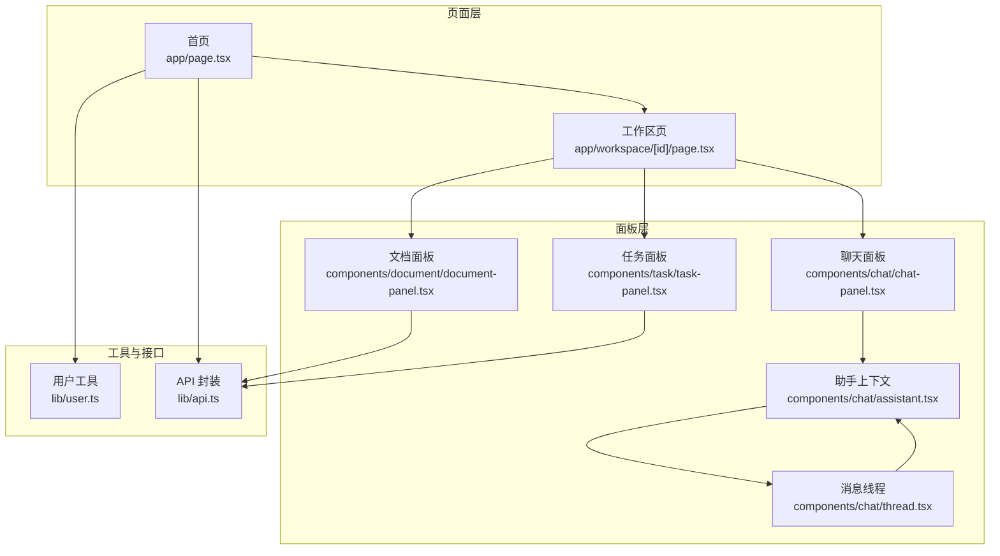
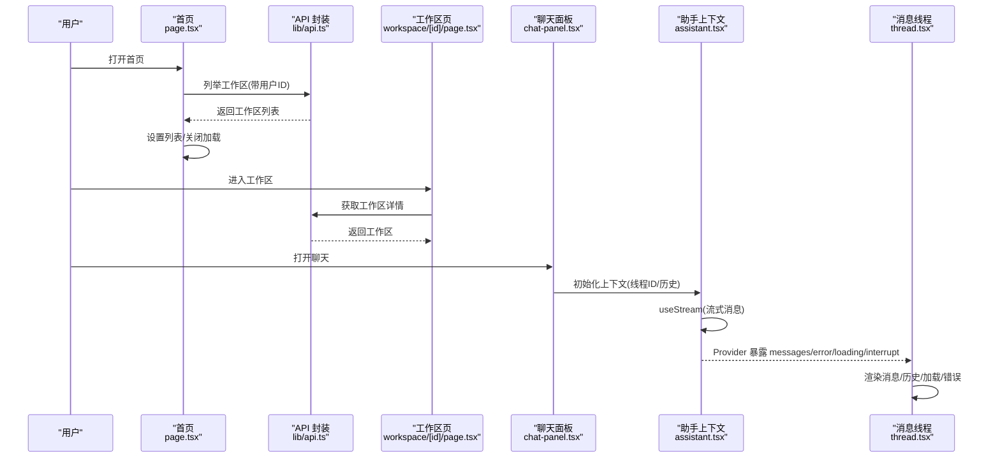
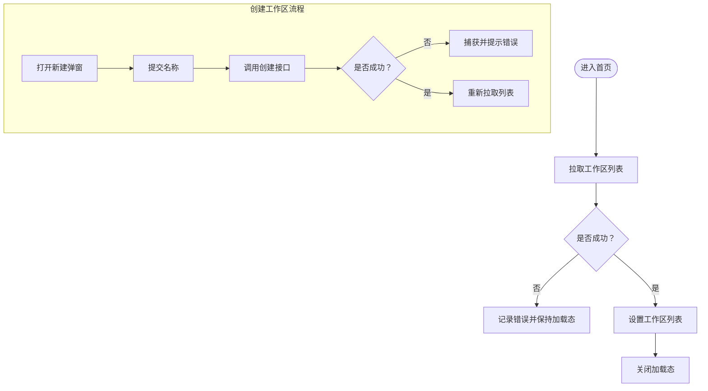
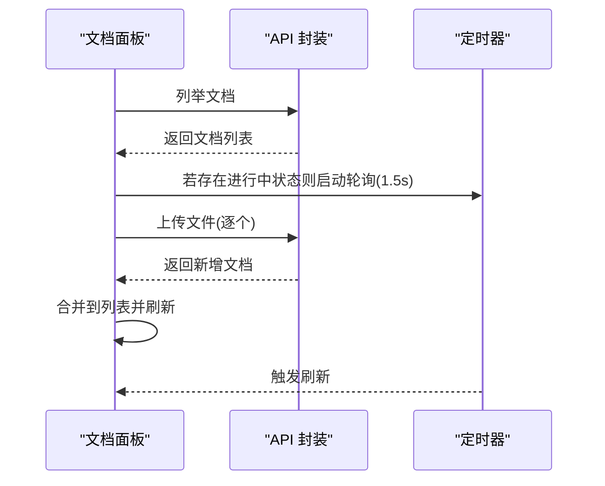
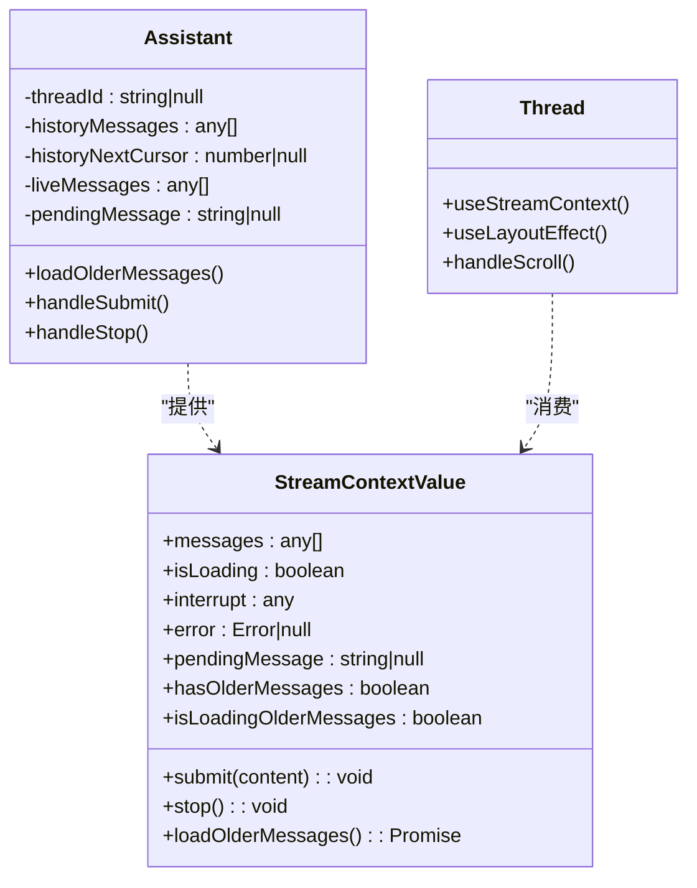
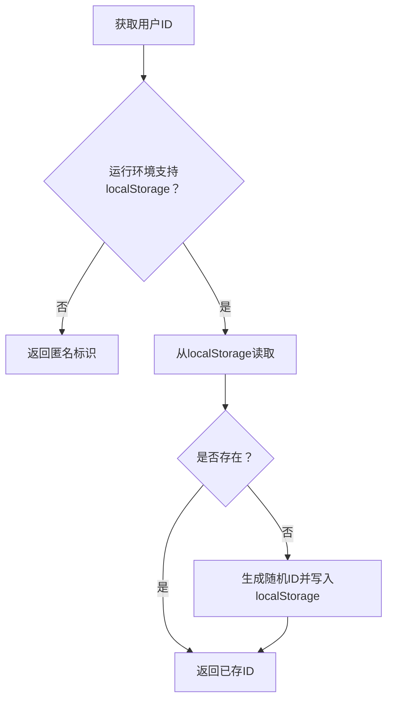
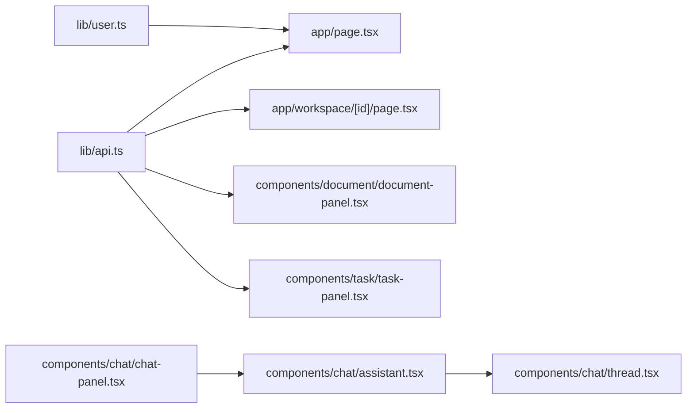

# 状态管理

<cite>
**本文引用的文件**
- [frontend/src/lib/user.ts](file://frontend/src/lib/user.ts)
- [frontend/src/lib/api.ts](file://frontend/src/lib/api.ts)
- [frontend/src/app/page.tsx](file://frontend/src/app/page.tsx)
- [frontend/src/app/workspace/[id]/page.tsx](file://frontend/src/app/workspace/[id]/page.tsx)
- [frontend/src/components/chat/assistant.tsx](file://frontend/src/components/chat/assistant.tsx)
- [frontend/src/components/chat/thread.tsx](file://frontend/src/components/chat/thread.tsx)
- [frontend/src/components/chat/chat-panel.tsx](file://frontend/src/components/chat/chat-panel.tsx)
- [frontend/src/components/document/document-panel.tsx](file://frontend/src/components/document/document-panel.tsx)
- [frontend/src/components/task/task-panel.tsx](file://frontend/src/components/task/task-panel.tsx)
- [frontend/src/components/workspace/workspace-card.tsx](file://frontend/src/components/workspace/workspace-card.tsx)
- [frontend/src/components/workspace/create-dialog.tsx](file://frontend/src/components/workspace/create-dialog.tsx)
</cite>

## 目录
1. [引言](#引言)
2. [项目结构与状态管理范围](#项目结构与状态管理范围)
3. [核心组件与状态模式](#核心组件与状态模式)
4. [架构总览](#架构总览)
5. [详细组件分析](#详细组件分析)
6. [依赖关系分析](#依赖关系分析)
7. [性能考量与优化建议](#性能考量与优化建议)
8. [故障排查指南](#故障排查指南)
9. [结论](#结论)
10. [附录：最佳实践与调试技巧](#附录最佳实践与调试技巧)

## 引言
本文件聚焦 Train Agent 前端的状态管理，系统性梳理 React Hooks 的使用模式与全局状态策略，覆盖以下主题：
- 核心 Hook 应用场景：useState、useEffect、useContext、useCallback、useRef 等
- 全局状态管理策略：上下文（Context）与局部状态的边界划分
- 用户状态管理：用户标识的生成与持久化
- 组件间状态同步：通过 Context 与回调传递实现跨层级通信
- 异步状态更新：加载态、错误态、中断态的处理
- 状态持久化：本地存储与服务端同步
- 性能优化：去抖、合并消息、滚动与列表渲染优化
- 调试技巧：日志与断点定位

## 项目结构与状态管理范围
前端采用 Next.js App Router，页面级组件负责顶层数据拉取与路由控制；聊天、文档、任务三大面板各自维护独立的局部状态，并通过 Context 向子树共享流式对话状态。

图表来源
- [frontend/src/app/page.tsx:17-121](file://frontend/src/app/page.tsx#L17-L121)
- [frontend/src/app/workspace/[id]/page.tsx:12-65](file://frontend/src/app/workspace/[id]/page.tsx#L12-L65)
- [frontend/src/components/chat/chat-panel.tsx:10-16](file://frontend/src/components/chat/chat-panel.tsx#L10-L16)
- [frontend/src/components/chat/assistant.tsx:59-254](file://frontend/src/components/chat/assistant.tsx#L59-L254)
- [frontend/src/components/chat/thread.tsx:150-236](file://frontend/src/components/chat/thread.tsx#L150-L236)
- [frontend/src/components/document/document-panel.tsx:53-163](file://frontend/src/components/document/document-panel.tsx#L53-L163)
- [frontend/src/components/task/task-panel.tsx:53-113](file://frontend/src/components/task/task-panel.tsx#L53-L113)
- [frontend/src/lib/user.ts:1-13](file://frontend/src/lib/user.ts#L1-L13)
- [frontend/src/lib/api.ts:1-196](file://frontend/src/lib/api.ts#L1-L196)

章节来源
- [frontend/src/app/page.tsx:17-121](file://frontend/src/app/page.tsx#L17-L121)
- [frontend/src/app/workspace/[id]/page.tsx:12-65](file://frontend/src/app/workspace/[id]/page.tsx#L12-L65)
- [frontend/src/components/chat/chat-panel.tsx:10-16](file://frontend/src/components/chat/chat-panel.tsx#L10-L16)
- [frontend/src/components/chat/assistant.tsx:59-254](file://frontend/src/components/chat/assistant.tsx#L59-L254)
- [frontend/src/components/chat/thread.tsx:150-236](file://frontend/src/components/chat/thread.tsx#L150-L236)
- [frontend/src/components/document/document-panel.tsx:53-163](file://frontend/src/components/document/document-panel.tsx#L53-L163)
- [frontend/src/components/task/task-panel.tsx:53-113](file://frontend/src/components/task/task-panel.tsx#L53-L113)
- [frontend/src/lib/user.ts:1-13](file://frontend/src/lib/user.ts#L1-L13)
- [frontend/src/lib/api.ts:1-196](file://frontend/src/lib/api.ts#L1-L196)

## 核心组件与状态模式
- 页面级状态
  - 首页：工作区列表、新建弹窗开关、加载态
  - 工作区页：工作区详情、右侧栏折叠状态
- 面板级状态
  - 文档面板：文档列表、上传中状态、轮询刷新
  - 任务面板：任务列表、定时刷新、菜单状态
  - 聊天面板：通过 Context 提供的消息流、加载态、错误态、中断态、历史翻页
- 用户状态
  - 用户 ID：localStorage 持久化，匿名回退
- 异步状态
  - 加载态：请求开始/结束时切换 loading
  - 错误态：统一 ApiError 抛错与捕获
  - 中断态：澄清表单等交互式中断

章节来源
- [frontend/src/app/page.tsx:17-121](file://frontend/src/app/page.tsx#L17-L121)
- [frontend/src/app/workspace/[id]/page.tsx:12-65](file://frontend/src/app/workspace/[id]/page.tsx#L12-L65)
- [frontend/src/components/document/document-panel.tsx:53-163](file://frontend/src/components/document/document-panel.tsx#L53-L163)
- [frontend/src/components/task/task-panel.tsx:53-113](file://frontend/src/components/task/task-panel.tsx#L53-L113)
- [frontend/src/components/chat/assistant.tsx:59-254](file://frontend/src/components/chat/assistant.tsx#L59-L254)
- [frontend/src/lib/user.ts:1-13](file://frontend/src/lib/user.ts#L1-L13)
- [frontend/src/lib/api.ts:3-42](file://frontend/src/lib/api.ts#L3-L42)

## 架构总览
下图展示从页面到面板、再到上下文与流式状态的整体流转：

图表来源
- [frontend/src/app/page.tsx:17-121](file://frontend/src/app/page.tsx#L17-L121)
- [frontend/src/lib/api.ts:64-81](file://frontend/src/lib/api.ts#L64-L81)
- [frontend/src/app/workspace/[id]/page.tsx:12-65](file://frontend/src/app/workspace/[id]/page.tsx#L12-L65)
- [frontend/src/components/chat/chat-panel.tsx:10-16](file://frontend/src/components/chat/chat-panel.tsx#L10-L16)
- [frontend/src/components/chat/assistant.tsx:59-254](file://frontend/src/components/chat/assistant.tsx#L59-L254)
- [frontend/src/components/chat/thread.tsx:150-236](file://frontend/src/components/chat/thread.tsx#L150-L236)

## 详细组件分析

### 页面级状态：首页与工作区页
- 首页
  - 状态：工作区数组、新建弹窗开关、加载态
  - 生命周期：首次挂载触发拉取；创建成功后重新拉取
  - 错误处理：捕获异常并记录日志；区分业务错误（如 409）
- 工作区页
  - 状态：当前工作区对象、右侧栏折叠状态
  - 生命周期：根据路由参数拉取工作区详情，失败则回退首页

图表来源
- [frontend/src/app/page.tsx:17-121](file://frontend/src/app/page.tsx#L17-L121)
- [frontend/src/lib/api.ts:54-81](file://frontend/src/lib/api.ts#L54-L81)

章节来源
- [frontend/src/app/page.tsx:17-121](file://frontend/src/app/page.tsx#L17-L121)
- [frontend/src/app/workspace/[id]/page.tsx:12-65](file://frontend/src/app/workspace/[id]/page.tsx#L12-L65)
- [frontend/src/lib/api.ts:54-81](file://frontend/src/lib/api.ts#L54-L81)

### 面板级状态：文档面板与任务面板
- 文档面板
  - 状态：文档列表、上传中标志
  - 轮询：当存在进行中的状态时，定时刷新以跟踪进度
  - 上传：逐个文件上传并合并到列表
- 任务面板
  - 状态：任务列表
  - 定时刷新：每 5 秒轮询一次
  - 下载：根据返回的文件路径拼接下载链接

图表来源
- [frontend/src/components/document/document-panel.tsx:53-163](file://frontend/src/components/document/document-panel.tsx#L53-L163)
- [frontend/src/lib/api.ts:142-173](file://frontend/src/lib/api.ts#L142-L173)

章节来源
- [frontend/src/components/document/document-panel.tsx:53-163](file://frontend/src/components/document/document-panel.tsx#L53-L163)
- [frontend/src/components/task/task-panel.tsx:53-113](file://frontend/src/components/task/task-panel.tsx#L53-L113)
- [frontend/src/lib/api.ts:142-173](file://frontend/src/lib/api.ts#L142-L173)

### 全局状态：聊天上下文与消息流
- 上下文设计
  - StreamContext：暴露 messages、isLoading、interrupt、submit、stop、error、pendingMessage、loadOlderMessages、hasOlderMessages、isLoadingOlderMessages
  - ResumeContext：用于中断表单恢复
- 状态来源
  - 历史消息：按游标分页拉取，限制每次数量
  - 实时消息：useStream 推送，基于键集合去重合并
  - 线程恢复：当流错误出现“线程不存在”时清空线程 ID 并重建
  - 线程持久化：首次获得新线程 ID 后立即写回工作区
- 子组件消费
  - Thread 从上下文读取状态并渲染消息、历史加载、错误提示、打字指示等

图表来源
- [frontend/src/components/chat/assistant.tsx:13-41](file://frontend/src/components/chat/assistant.tsx#L13-L41)
- [frontend/src/components/chat/assistant.tsx:59-254](file://frontend/src/components/chat/assistant.tsx#L59-L254)
- [frontend/src/components/chat/thread.tsx:150-236](file://frontend/src/components/chat/thread.tsx#L150-L236)

章节来源
- [frontend/src/components/chat/assistant.tsx:59-254](file://frontend/src/components/chat/assistant.tsx#L59-L254)
- [frontend/src/components/chat/thread.tsx:150-236](file://frontend/src/components/chat/thread.tsx#L150-L236)

### 用户状态管理：用户 ID 生成与持久化
- 生成逻辑：若浏览器可用，优先从 localStorage 读取；不存在则随机生成并写入
- 回退策略：SSR 环境或不可用时返回匿名标识
- 使用场景：所有需要用户维度的数据访问均携带该 ID

图表来源
- [frontend/src/lib/user.ts:1-13](file://frontend/src/lib/user.ts#L1-L13)

章节来源
- [frontend/src/lib/user.ts:1-13](file://frontend/src/lib/user.ts#L1-L13)

### 组件间状态同步机制
- 首页与工作区页：通过路由参数与 API 调用同步工作区元数据
- 面板与上下文：通过 Context 将流式消息、加载与错误状态向下传递
- 对话输入与上下文：ChatPanel 作为容器，Thread 消费状态并渲染
- 文档/任务面板：各自维护列表状态并通过定时器与 API 同步远端状态

章节来源
- [frontend/src/app/page.tsx:17-121](file://frontend/src/app/page.tsx#L17-L121)
- [frontend/src/app/workspace/[id]/page.tsx:12-65](file://frontend/src/app/workspace/[id]/page.tsx#L12-L65)
- [frontend/src/components/chat/chat-panel.tsx:10-16](file://frontend/src/components/chat/chat-panel.tsx#L10-L16)
- [frontend/src/components/chat/assistant.tsx:59-254](file://frontend/src/components/chat/assistant.tsx#L59-L254)
- [frontend/src/components/document/document-panel.tsx:53-163](file://frontend/src/components/document/document-panel.tsx#L53-L163)
- [frontend/src/components/task/task-panel.tsx:53-113](file://frontend/src/components/task/task-panel.tsx#L53-L113)

### 异步状态更新、加载与错误处理
- 加载态：请求开始设置 loading，结束统一清理
- 错误态：统一抛出 ApiError，捕获后渲染错误提示
- 流式状态：useStream 提供 isLoading、error、interrupt 等，Thread 根据状态渲染不同 UI
- 历史翻页：hasOlderMessages 与 isLoadingOlderMessages 控制加载占位与交互

章节来源
- [frontend/src/app/page.tsx:17-121](file://frontend/src/app/page.tsx#L17-L121)
- [frontend/src/lib/api.ts:3-42](file://frontend/src/lib/api.ts#L3-L42)
- [frontend/src/components/chat/thread.tsx:150-236](file://frontend/src/components/chat/thread.tsx#L150-L236)
- [frontend/src/components/chat/assistant.tsx:59-254](file://frontend/src/components/chat/assistant.tsx#L59-L254)

### 状态持久化策略
- 用户 ID：localStorage 持久化，避免重复生成
- 线程 ID：首次获得后通过 API 写回工作区，后续复用
- 本地 UI 状态：弹窗开关、折叠状态等仅在内存中维持，不持久化

章节来源
- [frontend/src/lib/user.ts:1-13](file://frontend/src/lib/user.ts#L1-L13)
- [frontend/src/components/chat/assistant.tsx:166-172](file://frontend/src/components/chat/assistant.tsx#L166-L172)
- [frontend/src/lib/api.ts:76-81](file://frontend/src/lib/api.ts#L76-L81)

### 状态重置与清理机制
- 首次挂载：根据线程 ID 初始化历史消息与 live 消息集合
- 流结束：重新拉取历史并清空 live 集合，重建基线键集合
- 错误恢复：检测到线程不存在错误时，清空线程 ID 并允许重新创建
- 资源清理：面板组件在卸载时清理定时器与事件监听

章节来源
- [frontend/src/components/chat/assistant.tsx:95-129](file://frontend/src/components/chat/assistant.tsx#L95-L129)
- [frontend/src/components/chat/assistant.tsx:148-164](file://frontend/src/components/chat/assistant.tsx#L148-L164)
- [frontend/src/components/chat/assistant.tsx:196-207](file://frontend/src/components/chat/assistant.tsx#L196-L207)
- [frontend/src/components/task/task-panel.tsx:164-173](file://frontend/src/components/task/task-panel.tsx#L164-L173)

## 依赖关系分析
- 组件耦合
  - 高内聚：各面板独立维护自身状态，降低耦合
  - 低耦合：通过 Context 与回调向下传递，避免深层 props drilling
- 外部依赖
  - useStream：来自 @langchain/react，提供流式消息与中断能力
  - fetch：API 封装统一处理响应与错误
- 循环依赖
  - 未发现循环导入；ChatPanel 仅作为容器，不反向依赖子组件

图表来源
- [frontend/src/lib/api.ts:1-196](file://frontend/src/lib/api.ts#L1-L196)
- [frontend/src/app/page.tsx:17-121](file://frontend/src/app/page.tsx#L17-L121)
- [frontend/src/app/workspace/[id]/page.tsx:12-65](file://frontend/src/app/workspace/[id]/page.tsx#L12-L65)
- [frontend/src/components/document/document-panel.tsx:53-163](file://frontend/src/components/document/document-panel.tsx#L53-L163)
- [frontend/src/components/task/task-panel.tsx:53-113](file://frontend/src/components/task/task-panel.tsx#L53-L113)
- [frontend/src/lib/user.ts:1-13](file://frontend/src/lib/user.ts#L1-L13)
- [frontend/src/components/chat/chat-panel.tsx:10-16](file://frontend/src/components/chat/chat-panel.tsx#L10-L16)
- [frontend/src/components/chat/assistant.tsx:59-254](file://frontend/src/components/chat/assistant.tsx#L59-L254)
- [frontend/src/components/chat/thread.tsx:150-236](file://frontend/src/components/chat/thread.tsx#L150-L236)

章节来源
- [frontend/src/lib/api.ts:1-196](file://frontend/src/lib/api.ts#L1-L196)
- [frontend/src/lib/user.ts:1-13](file://frontend/src/lib/user.ts#L1-L13)
- [frontend/src/components/chat/assistant.tsx:59-254](file://frontend/src/components/chat/assistant.tsx#L59-L254)
- [frontend/src/components/chat/thread.tsx:150-236](file://frontend/src/components/chat/thread.tsx#L150-L236)

## 性能考量与优化建议
- 去抖与合并
  - 合并历史与实时消息时使用键集合去重，避免重复渲染
  - 基线键集合在流结束时重建，保证后续增量正确
- 列表渲染
  - 仅渲染可见消息与待发送占位，减少 DOM 节点
  - 历史加载时使用占位与预取快照，提升滚动体验
- 轮询与定时
  - 文档面板仅在存在进行中状态时开启轮询，避免无效请求
  - 任务面板固定周期轮询，兼顾实时性与性能
- 状态粒度
  - 将 UI 状态（弹窗、折叠）与业务状态（列表、流）分离，降低无关重渲染

章节来源
- [frontend/src/components/chat/assistant.tsx:281-291](file://frontend/src/components/chat/assistant.tsx#L281-L291)
- [frontend/src/components/chat/thread.tsx:166-206](file://frontend/src/components/chat/thread.tsx#L166-L206)
- [frontend/src/components/document/document-panel.tsx:71-75](file://frontend/src/components/document/document-panel.tsx#L71-L75)
- [frontend/src/components/task/task-panel.tsx:65-69](file://frontend/src/components/task/task-panel.tsx#L65-L69)

## 故障排查指南
- API 错误
  - 统一捕获 ApiError，检查 status 与 detail 字段
  - 首页创建工作区时对 409 进行特殊提示
- 流式错误
  - 当检测到线程不存在类错误时，清空线程 ID 并允许重新创建
  - 日志输出流状态变化，便于定位问题
- 上传与任务
  - 文档上传失败时保留文件输入值以便重试
  - 任务面板删除失败时记录错误并保持列表不变

章节来源
- [frontend/src/lib/api.ts:3-42](file://frontend/src/lib/api.ts#L3-L42)
- [frontend/src/app/page.tsx:39-50](file://frontend/src/app/page.tsx#L39-L50)
- [frontend/src/components/chat/assistant.tsx:148-164](file://frontend/src/components/chat/assistant.tsx#L148-L164)
- [frontend/src/components/chat/assistant.tsx:137-146](file://frontend/src/components/chat/assistant.tsx#L137-L146)
- [frontend/src/components/document/document-panel.tsx:94-102](file://frontend/src/components/document/document-panel.tsx#L94-L102)
- [frontend/src/components/task/task-panel.tsx:153-161](file://frontend/src/components/task/task-panel.tsx#L153-L161)

## 结论
本项目采用“页面级局部状态 + 面板级局部状态 + 全局上下文”的混合策略，结合统一的 API 封装与用户 ID 持久化，实现了清晰的状态边界与良好的可维护性。通过 Context 解耦组件间通信，配合去重与合并策略优化渲染性能，满足聊天、文档、任务等多场景需求。

## 附录：最佳实践与调试技巧
- 最佳实践
  - 明确状态作用域：UI 状态放组件内，业务状态放 Context 或页面
  - 统一错误处理：集中抛出与捕获 ApiError，避免分散 try/catch
  - 合理使用缓存：对历史消息使用游标分页，避免全量刷新
  - 清理资源：组件卸载时清理定时器与事件监听
- 调试技巧
  - 在上下文中打印流状态变化，快速定位加载/错误/中断问题
  - 使用浏览器开发者工具 Network 面板观察轮询与上传请求
  - 在 SSR 环境下验证用户 ID 回退逻辑