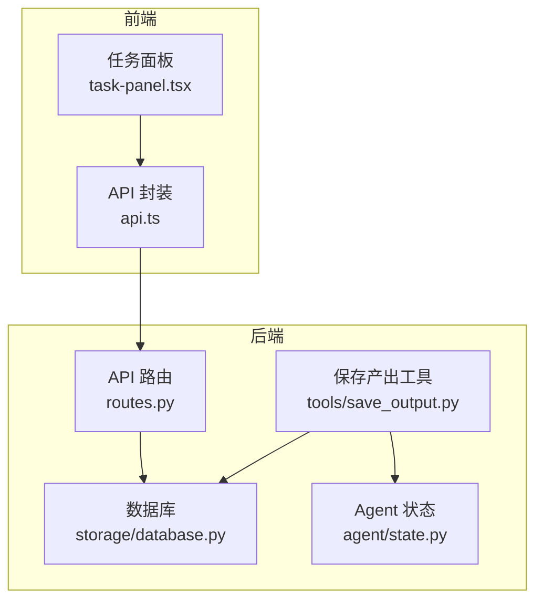
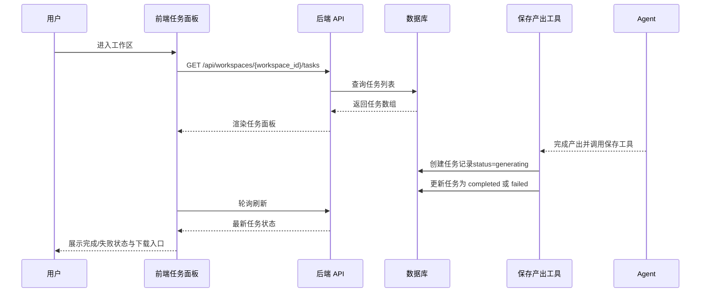
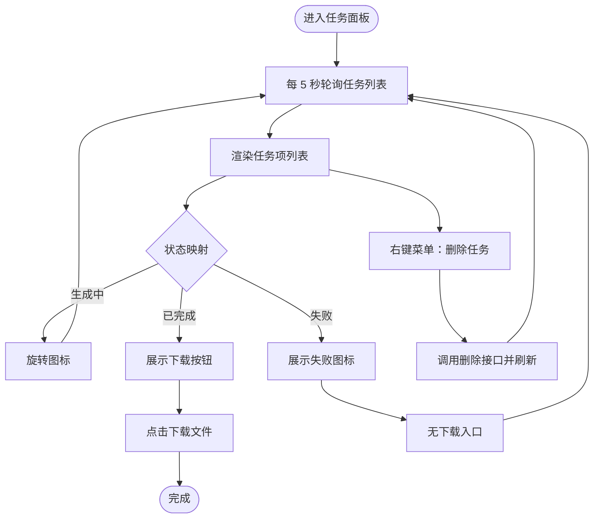
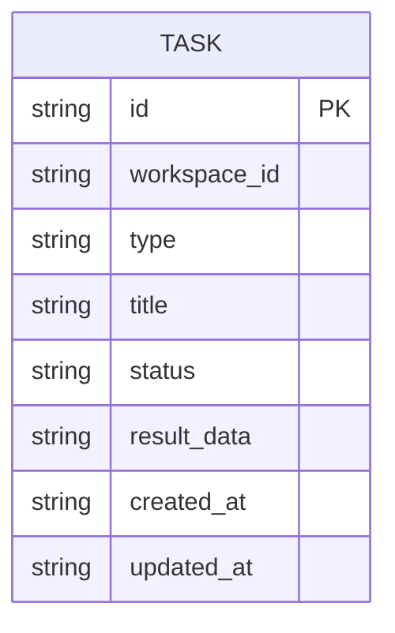
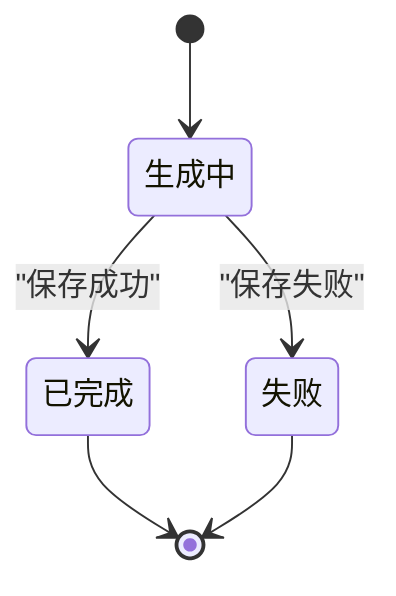
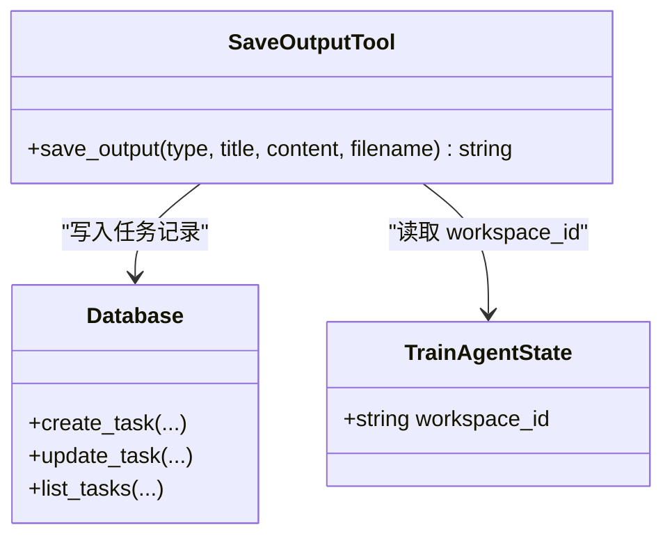
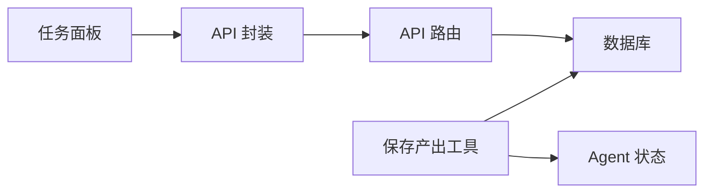

# 任务组件

<cite>
**本文档引用的文件**
- [frontend/src/components/task/task-panel.tsx](file://frontend/src/components/task/task-panel.tsx)
- [frontend/src/lib/api.ts](file://frontend/src/lib/api.ts)
- [backend/src/api/routes.py](file://backend/src/api/routes.py)
- [backend/src/storage/database.py](file://backend/src/storage/database.py)
- [backend/src/tools/save_output.py](file://backend/src/tools/save_output.py)
- [backend/src/agent/state.py](file://backend/src/agent/state.py)
- [plans/2026-05-27-train-agent-implementation.md](file://plans/2026-05-27-train-agent-implementation.md)
- [plans/2026-05-27-train-agent-user-stories.md](file://plans/2026-05-27-train-agent-user-stories.md)
</cite>

## 目录
1. [简介](#简介)
2. [项目结构](#项目结构)
3. [核心组件](#核心组件)
4. [架构总览](#架构总览)
5. [详细组件分析](#详细组件分析)
6. [依赖关系分析](#依赖关系分析)
7. [性能考量](#性能考量)
8. [故障排查指南](#故障排查指南)
9. [结论](#结论)
10. [附录](#附录)

## 简介
本指南聚焦 Train Agent 的任务组件模块，围绕任务面板（task-panel）的任务列表展示、状态跟踪、执行进度监控与完成通知展开；同时覆盖任务队列管理策略、优先级排序、并发执行控制、生命周期管理、重试与超时处理、异常捕获，以及与 Agent 系统的集成方式。目标是帮助开发者快速理解并扩展任务系统的功能。

## 项目结构
任务组件由前端任务面板与后端 API/存储共同构成，前端负责轮询与 UI 展示，后端负责任务创建、状态更新与持久化。

图表来源
- [frontend/src/components/task/task-panel.tsx:53-113](file://frontend/src/components/task/task-panel.tsx#L53-L113)
- [frontend/src/lib/api.ts:175-196](file://frontend/src/lib/api.ts#L175-L196)
- [backend/src/api/routes.py:144-158](file://backend/src/api/routes.py#L144-L158)
- [backend/src/storage/database.py:293-317](file://backend/src/storage/database.py#L293-L317)
- [backend/src/tools/save_output.py:61-99](file://backend/src/tools/save_output.py#L61-L99)
- [backend/src/agent/state.py:4-6](file://backend/src/agent/state.py#L4-L6)

章节来源
- [frontend/src/components/task/task-panel.tsx:53-113](file://frontend/src/components/task/task-panel.tsx#L53-L113)
- [backend/src/api/routes.py:144-158](file://backend/src/api/routes.py#L144-L158)
- [backend/src/storage/database.py:293-317](file://backend/src/storage/database.py#L293-L317)
- [backend/src/tools/save_output.py:61-99](file://backend/src/tools/save_output.py#L61-L99)
- [backend/src/agent/state.py:4-6](file://backend/src/agent/state.py#L4-L6)

## 核心组件
- 任务面板（TaskPanel）
  - 负责定时轮询任务列表、渲染任务项、提供下载与删除操作入口。
  - 使用状态映射将任务状态转换为图标与颜色，支持生成中、已完成、失败三态。
- API 封装（api.ts）
  - 提供 listTasks、deleteTask 等方法，统一错误处理与日志输出。
- 后端路由（routes.py）
  - 提供 /api/workspaces/{workspace_id}/tasks 列表接口与删除接口。
- 数据库（storage/database.py）
  - 提供 create_task、list_tasks、update_task、delete_task 等任务 CRUD。
- 保存产出工具（tools/save_output.py）
  - 在 Agent 完成产出后创建任务记录并更新状态为 completed 或 failed。
- Agent 状态（agent/state.py）
  - 扩展 AgentState，携带 workspace_id 以便工具定位工作区上下文。

章节来源
- [frontend/src/components/task/task-panel.tsx:24-51](file://frontend/src/components/task/task-panel.tsx#L24-L51)
- [frontend/src/lib/api.ts:175-196](file://frontend/src/lib/api.ts#L175-L196)
- [backend/src/api/routes.py:144-158](file://backend/src/api/routes.py#L144-L158)
- [backend/src/storage/database.py:293-317](file://backend/src/storage/database.py#L293-L317)
- [backend/src/tools/save_output.py:61-99](file://backend/src/tools/save_output.py#L61-L99)
- [backend/src/agent/state.py:4-6](file://backend/src/agent/state.py#L4-L6)

## 架构总览
任务组件的端到端流程如下：

图表来源
- [frontend/src/components/task/task-panel.tsx:56-69](file://frontend/src/components/task/task-panel.tsx#L56-L69)
- [backend/src/api/routes.py:147-157](file://backend/src/api/routes.py#L147-L157)
- [backend/src/storage/database.py:359-378](file://backend/src/storage/database.py#L359-L378)
- [backend/src/tools/save_output.py:28-58](file://backend/src/tools/save_output.py#L28-L58)

## 详细组件分析

### 任务面板（TaskPanel）与任务项（TaskItem）
- 轮询策略
  - 组件挂载后每 5 秒拉取一次任务列表，保证 UI 与后端状态一致。
- 状态展示
  - 通过 STATUS_CONFIG 将任务状态映射为图标、颜色与动画，直观反映生成中/已完成/失败。
- 类型展示
  - 通过 TYPE_CONFIG 将任务类型映射为图标与标签（如 PPT、报告）。
- 下载与删除
  - 当任务状态为 completed 且 result_data 包含文件路径时，提供下载按钮。
  - 支持删除任务，删除成功后触发父组件刷新。
- 结果数据解析
  - 将 result_data 作为 JSON 解析，提取文件路径与文件名用于下载。

图表来源
- [frontend/src/components/task/task-panel.tsx:56-69](file://frontend/src/components/task/task-panel.tsx#L56-L69)
- [frontend/src/components/task/task-panel.tsx:121-228](file://frontend/src/components/task/task-panel.tsx#L121-L228)

章节来源
- [frontend/src/components/task/task-panel.tsx:53-113](file://frontend/src/components/task/task-panel.tsx#L53-L113)
- [frontend/src/components/task/task-panel.tsx:121-228](file://frontend/src/components/task/task-panel.tsx#L121-L228)

### API 接口与数据模型
- 列表接口
  - GET /api/workspaces/{workspace_id}/tasks 返回任务数组，按创建时间倒序。
- 删除接口
  - DELETE /api/workspaces/{workspace_id}/tasks/{task_id} 删除指定任务。
- 数据模型
  - Task：包含 id、workspace_id、type、title、status、result_data、created_at 等字段。

图表来源
- [frontend/src/lib/api.ts:177-185](file://frontend/src/lib/api.ts#L177-L185)
- [backend/src/storage/database.py:226-235](file://backend/src/storage/database.py#L226-L235)

章节来源
- [frontend/src/lib/api.ts:175-196](file://frontend/src/lib/api.ts#L175-L196)
- [backend/src/api/routes.py:147-157](file://backend/src/api/routes.py#L147-L157)
- [backend/src/storage/database.py:293-317](file://backend/src/storage/database.py#L293-L317)

### 任务生命周期与状态机
- 生命周期阶段
  - 创建：Agent 通过保存产出工具创建任务记录，初始状态为 generating。
  - 执行：Agent 在执行过程中可能更新任务状态（例如中间态可通过扩展实现）。
  - 完成：产出保存成功后，状态更新为 completed，并写入 result_data。
  - 失败：产出保存失败后，状态更新为 failed，并写入错误信息。
- 状态同步
  - 前端通过轮询与后端数据库保持状态一致，UI 根据状态即时反馈。

图表来源
- [backend/src/tools/save_output.py:28-58](file://backend/src/tools/save_output.py#L28-L58)
- [backend/src/storage/database.py:311-316](file://backend/src/storage/database.py#L311-L316)

章节来源
- [backend/src/tools/save_output.py:28-58](file://backend/src/tools/save_output.py#L28-L58)
- [backend/src/storage/database.py:311-316](file://backend/src/storage/database.py#L311-L316)

### 任务队列管理、优先级与并发控制
- 当前实现
  - 后端未实现显式的任务队列与优先级排序；任务按创建时间倒序展示。
  - 保存产出工具在完成时直接更新任务状态，未引入后台队列调度。
- 建议扩展
  - 引入队列与优先级：新增优先级字段与调度器，按优先级与资源配额调度执行。
  - 并发控制：限制同一工作区并发任务数，避免资源争用。
  - 中间态：在 generating 与 completed 之间增加 processing、queued 等中间状态，便于前端更精细地展示进度。
  - 超时与重试：对长时间未完成的任务设置超时阈值，失败时自动重试至最大次数。

章节来源
- [backend/src/storage/database.py:226-235](file://backend/src/storage/database.py#L226-L235)
- [backend/src/tools/save_output.py:28-58](file://backend/src/tools/save_output.py#L28-L58)

### 与 Agent 系统的集成
- 工作区上下文
  - Agent 状态扩展包含 workspace_id，工具在运行时可据此定位工作区。
- 产出保存
  - 保存产出工具负责创建任务记录、落地文件并更新任务状态，确保任务面板可被用户看到。
- 命令驱动
  - 用户通过命令触发技能生成产出，完成后经保存工具落库，前端轮询即可呈现。

图表来源
- [backend/src/agent/state.py:4-6](file://backend/src/agent/state.py#L4-L6)
- [backend/src/tools/save_output.py:61-99](file://backend/src/tools/save_output.py#L61-L99)
- [backend/src/storage/database.py:293-317](file://backend/src/storage/database.py#L293-L317)

章节来源
- [backend/src/agent/state.py:4-6](file://backend/src/agent/state.py#L4-L6)
- [backend/src/tools/save_output.py:61-99](file://backend/src/tools/save_output.py#L61-L99)

## 依赖关系分析
- 前端依赖后端 API，API 依赖数据库。
- 保存产出工具依赖数据库与文件存储，最终影响任务状态。
- Agent 通过工具链间接影响任务状态，前端通过轮询感知变化。

图表来源
- [frontend/src/components/task/task-panel.tsx:53-113](file://frontend/src/components/task/task-panel.tsx#L53-L113)
- [frontend/src/lib/api.ts:175-196](file://frontend/src/lib/api.ts#L175-L196)
- [backend/src/api/routes.py:144-158](file://backend/src/api/routes.py#L144-L158)
- [backend/src/storage/database.py:293-317](file://backend/src/storage/database.py#L293-L317)
- [backend/src/tools/save_output.py:61-99](file://backend/src/tools/save_output.py#L61-L99)
- [backend/src/agent/state.py:4-6](file://backend/src/agent/state.py#L4-L6)

章节来源
- [frontend/src/components/task/task-panel.tsx:53-113](file://frontend/src/components/task/task-panel.tsx#L53-L113)
- [backend/src/api/routes.py:144-158](file://backend/src/api/routes.py#L144-L158)
- [backend/src/storage/database.py:293-317](file://backend/src/storage/database.py#L293-L317)
- [backend/src/tools/save_output.py:61-99](file://backend/src/tools/save_output.py#L61-L99)
- [backend/src/agent/state.py:4-6](file://backend/src/agent/state.py#L4-L6)

## 性能考量
- 轮询频率
  - 默认 5 秒一次，适合中小规模任务列表；高并发场景建议降低轮询间隔或引入 WebSocket/Server-Sent Events。
- 数据量与排序
  - 按 created_at 倒序查询，索引可优化；若任务量大，建议分页或限制返回条数。
- 前端渲染
  - 仅在任务变更时触发刷新，避免不必要的重渲染；可结合 React.memo 与 key 策略优化。
- 后端 IO
  - 保存产出工具涉及文件写入与数据库更新，建议异步化与限流，避免阻塞主请求。

## 故障排查指南
- 任务状态不更新
  - 检查后端保存产出工具是否正确调用并更新任务状态。
  - 确认前端轮询是否正常执行，网络层是否有拦截。
- 下载失败
  - 检查 result_data 是否包含有效文件路径；确认后端文件下载接口可访问对应路径。
- 删除无效
  - 确认删除接口返回成功；检查前端 onDeleted 回调是否触发刷新。
- 错误处理
  - 前端 API 封装统一抛出 ApiError，可根据状态码与 detail 字段定位问题。
  - 后端路由对 404/异常进行标准化响应，便于前端识别。

章节来源
- [frontend/src/lib/api.ts:3-42](file://frontend/src/lib/api.ts#L3-L42)
- [backend/src/api/routes.py:163-174](file://backend/src/api/routes.py#L163-L174)
- [backend/src/tools/save_output.py:51-58](file://backend/src/tools/save_output.py#L51-L58)

## 结论
任务组件通过“前端轮询 + 后端持久化”的简单可靠模式实现了任务状态的可视化与可操作性。当前实现满足基本需求，后续可在任务队列、优先级、并发控制、中间态与重试机制等方面进一步增强，以支撑更复杂的业务场景。

## 附录
- 实现参考
  - 数据库建表与任务 CRUD：参见数据库实现与计划文档。
  - 任务轮询与 UI：参见任务面板与 API 封装。
  - 产出保存与状态更新：参见保存产出工具与 Agent 状态。

章节来源
- [plans/2026-05-27-train-agent-implementation.md:191-317](file://plans/2026-05-27-train-agent-implementation.md#L191-L317)
- [plans/2026-05-27-train-agent-user-stories.md:342-374](file://plans/2026-05-27-train-agent-user-stories.md#L342-L374)