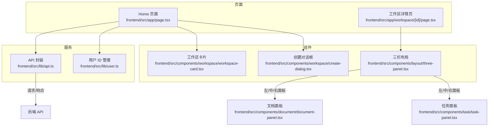
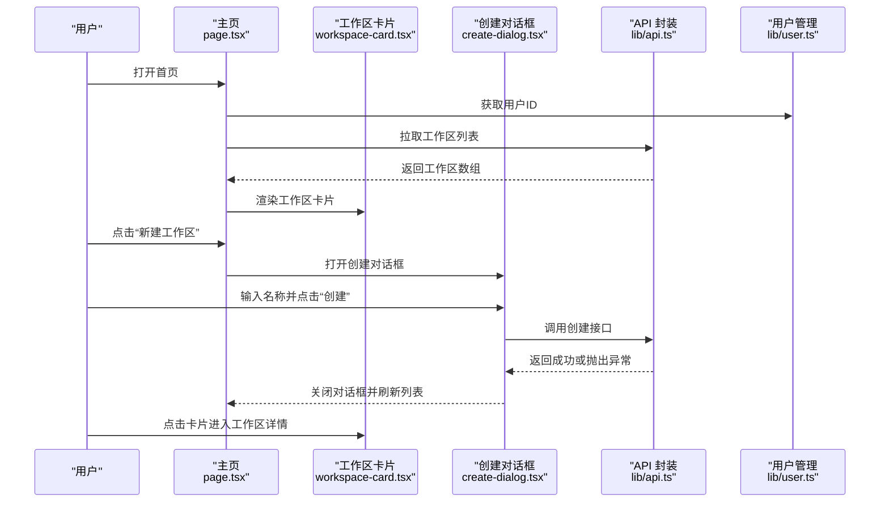
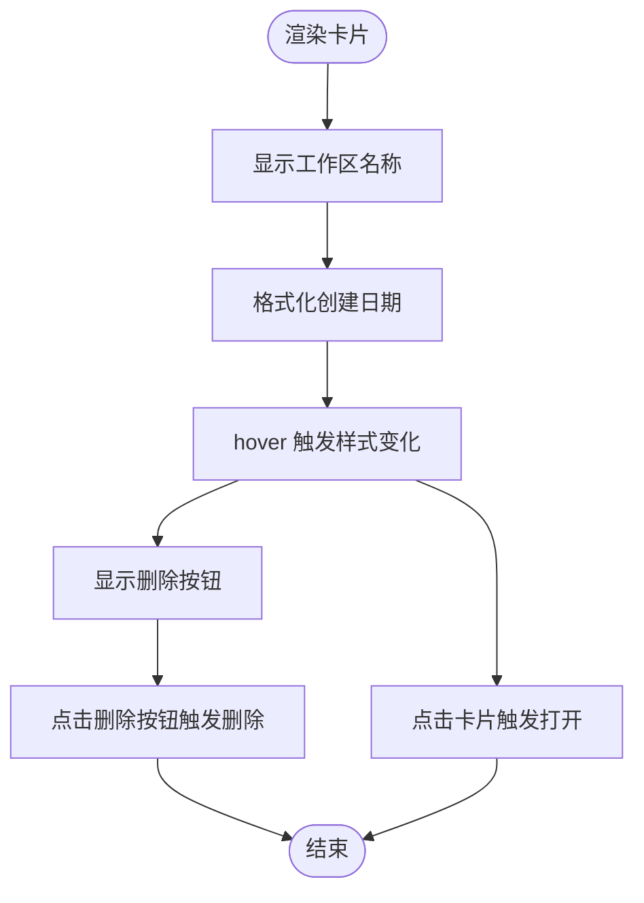
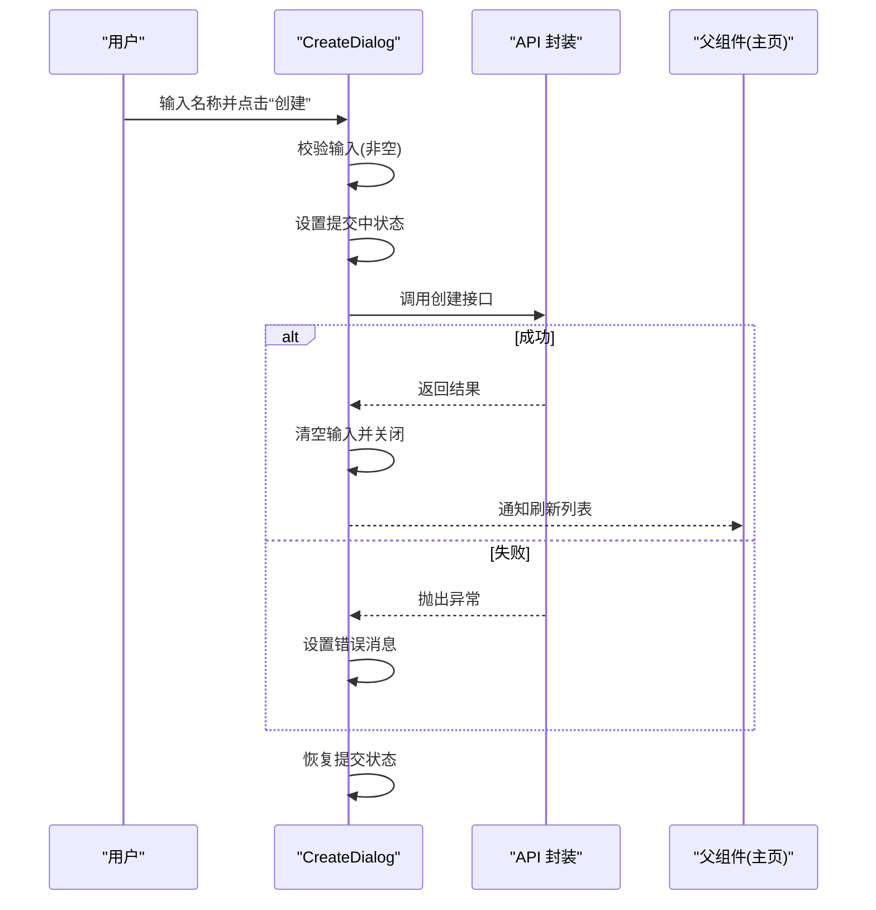
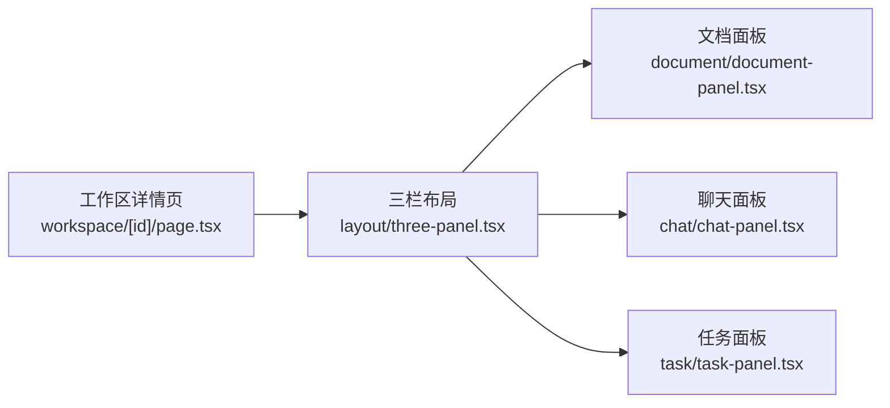
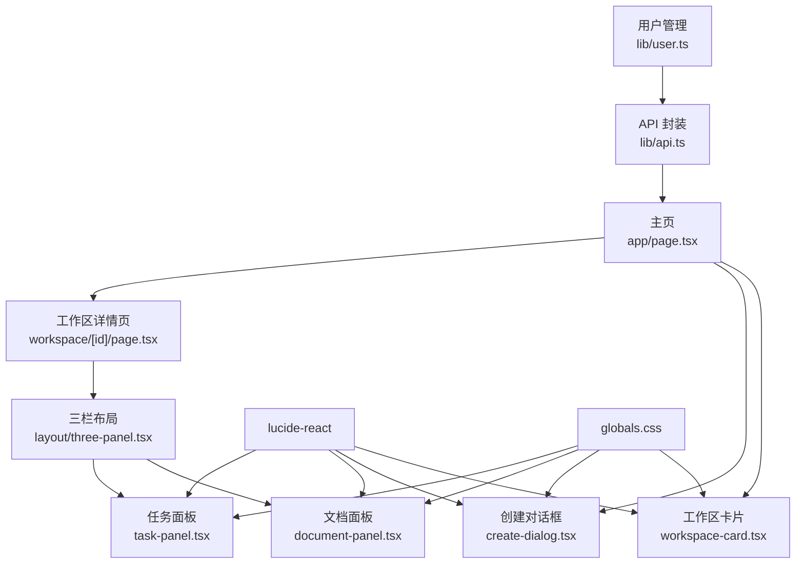

# 工作区组件

<cite>
**本文引用的文件**
- [frontend/src/components/workspace/workspace-card.tsx](file://frontend/src/components/workspace/workspace-card.tsx)
- [frontend/src/components/workspace/create-dialog.tsx](file://frontend/src/components/workspace/create-dialog.tsx)
- [frontend/src/lib/api.ts](file://frontend/src/lib/api.ts)
- [frontend/src/lib/user.ts](file://frontend/src/lib/user.ts)
- [frontend/src/app/page.tsx](file://frontend/src/app/page.tsx)
- [frontend/src/app/workspace/[id]/page.tsx](file://frontend/src/app/workspace/[id]/page.tsx)
- [frontend/src/components/layout/three-panel.tsx](file://frontend/src/components/layout/three-panel.tsx)
- [frontend/src/components/document/document-panel.tsx](file://frontend/src/components/document/document-panel.tsx)
- [frontend/src/components/task/task-panel.tsx](file://frontend/src/components/task/task-panel.tsx)
- [frontend/src/app/globals.css](file://frontend/src/app/globals.css)
- [frontend/package.json](file://frontend/package.json)
</cite>

## 目录
1. [简介](#简介)
2. [项目结构](#项目结构)
3. [核心组件](#核心组件)
4. [架构总览](#架构总览)
5. [详细组件分析](#详细组件分析)
6. [依赖关系分析](#依赖关系分析)
7. [性能考虑](#性能考虑)
8. [故障排查指南](#故障排查指南)
9. [结论](#结论)
10. [附录](#附录)

## 简介
本文件面向 Train Agent 的“工作区组件”模块，聚焦以下目标：
- 工作区卡片（workspace-card）的信息展示逻辑、用户权限标识、状态指示器实现
- 创建工作区对话框（create-dialog）的表单验证机制、输入字段动态生成、提交流程与错误处理
- 工作区列表的筛选与排序能力、批量操作支持、权限控制机制
- 组件实现、事件处理模式、与用户认证系统的集成方式

当前仓库前端代码中，工作区列表页与工作区卡片、创建对话框直接相关；工作区详情页由三栏布局承载文档、任务等子功能。由于仓库未提供后端 API 的具体鉴权与权限策略实现，本文在“权限控制机制”部分仅基于前端现有行为进行说明。

## 项目结构
工作区组件位于前端目录，采用按功能域组织的结构：
- 页面层：主页用于展示工作区列表，工作区详情页承载三栏布局
- 组件层：工作区卡片与创建对话框
- 服务层：API 封装与用户 ID 管理
- 样式层：全局主题与暗色风格

图表来源
- [frontend/src/app/page.tsx:17-120](file://frontend/src/app/page.tsx#L17-L120)
- [frontend/src/app/workspace/[id]/page.tsx](file://frontend/src/app/workspace/[id]/page.tsx#L12-L63)
- [frontend/src/components/workspace/workspace-card.tsx:12-50](file://frontend/src/components/workspace/workspace-card.tsx#L12-L50)
- [frontend/src/components/workspace/create-dialog.tsx:12-89](file://frontend/src/components/workspace/create-dialog.tsx#L12-L89)
- [frontend/src/components/layout/three-panel.tsx:18-131](file://frontend/src/components/layout/three-panel.tsx#L18-L131)
- [frontend/src/components/document/document-panel.tsx:53-214](file://frontend/src/components/document/document-panel.tsx#L53-L214)
- [frontend/src/components/task/task-panel.tsx:53-230](file://frontend/src/components/task/task-panel.tsx#L53-L230)
- [frontend/src/lib/api.ts:44-81](file://frontend/src/lib/api.ts#L44-L81)
- [frontend/src/lib/user.ts:3-12](file://frontend/src/lib/user.ts#L3-L12)

章节来源
- [frontend/src/app/page.tsx:17-120](file://frontend/src/app/page.tsx#L17-L120)
- [frontend/src/app/workspace/[id]/page.tsx](file://frontend/src/app/workspace/[id]/page.tsx#L12-L63)
- [frontend/src/components/workspace/workspace-card.tsx:12-50](file://frontend/src/components/workspace/workspace-card.tsx#L12-L50)
- [frontend/src/components/workspace/create-dialog.tsx:12-89](file://frontend/src/components/workspace/create-dialog.tsx#L12-L89)
- [frontend/src/components/layout/three-panel.tsx:18-131](file://frontend/src/components/layout/three-panel.tsx#L18-L131)
- [frontend/src/components/document/document-panel.tsx:53-214](file://frontend/src/components/document/document-panel.tsx#L53-L214)
- [frontend/src/components/task/task-panel.tsx:53-230](file://frontend/src/components/task/task-panel.tsx#L53-L230)
- [frontend/src/lib/api.ts:44-81](file://frontend/src/lib/api.ts#L44-L81)
- [frontend/src/lib/user.ts:3-12](file://frontend/src/lib/user.ts#L3-L12)

## 核心组件
- 工作区卡片（WorkspaceCard）
  - 展示工作区名称与创建日期
  - 支持打开与删除操作，删除按钮在悬停时可见
- 创建对话框（CreateDialog）
  - 表单输入名称，点击创建触发异步提交
  - 内置基础校验（非空）、加载态与错误提示
- API 封装（lib/api.ts）
  - 定义 Workspace 类型与 CRUD 方法
  - 统一的请求封装与错误类型（ApiError）
- 用户 ID 管理（lib/user.ts）
  - 基于本地存储的匿名用户标识生成与读取

章节来源
- [frontend/src/components/workspace/workspace-card.tsx:12-50](file://frontend/src/components/workspace/workspace-card.tsx#L12-L50)
- [frontend/src/components/workspace/create-dialog.tsx:12-89](file://frontend/src/components/workspace/create-dialog.tsx#L12-L89)
- [frontend/src/lib/api.ts:44-81](file://frontend/src/lib/api.ts#L44-L81)
- [frontend/src/lib/user.ts:3-12](file://frontend/src/lib/user.ts#L3-L12)

## 架构总览
工作区组件的前端交互链路如下：
- 主页负责拉取工作区列表、打开创建对话框、处理删除与跳转
- 工作区卡片承载单条工作区的展示与删除入口
- 创建对话框负责输入校验、提交与错误反馈
- API 封装统一处理请求与错误
- 用户 ID 管理确保每个访客拥有稳定标识

图表来源
- [frontend/src/app/page.tsx:17-120](file://frontend/src/app/page.tsx#L17-L120)
- [frontend/src/components/workspace/workspace-card.tsx:12-50](file://frontend/src/components/workspace/workspace-card.tsx#L12-L50)
- [frontend/src/components/workspace/create-dialog.tsx:12-89](file://frontend/src/components/workspace/create-dialog.tsx#L12-L89)
- [frontend/src/lib/api.ts:44-81](file://frontend/src/lib/api.ts#L44-L81)
- [frontend/src/lib/user.ts:3-12](file://frontend/src/lib/user.ts#L3-L12)

## 详细组件分析

### 工作区卡片（WorkspaceCard）
- 信息展示逻辑
  - 名称：来自传入的 Workspace 对象
  - 创建日期：格式化为“月-日”的本地化日期字符串
- 权限标识
  - 卡片本身不直接展示用户标识；删除按钮仅在卡片悬停时出现，避免误触
- 状态指示器
  - 通过容器的 hover 样式变化体现交互状态
  - 删除按钮在 hover 时显隐，提供明确的操作反馈
- 事件处理
  - 点击卡片区域触发“打开”回调
  - 删除按钮阻止事件冒泡，避免误触发打开

图表来源
- [frontend/src/components/workspace/workspace-card.tsx:12-50](file://frontend/src/components/workspace/workspace-card.tsx#L12-L50)

章节来源
- [frontend/src/components/workspace/workspace-card.tsx:12-50](file://frontend/src/components/workspace/workspace-card.tsx#L12-L50)

### 创建对话框（CreateDialog）
- 表单验证机制
  - 阻止默认提交，对输入进行 trim 后判断是否为空
  - 提交期间禁用按钮与取消按钮，防止重复提交
- 输入字段动态生成
  - 单行文本输入框，自动聚焦
  - 输入变更时清空错误提示
- 提交流程与错误处理
  - 成功：清空输入、关闭对话框、外层回调负责刷新列表
  - 失败：捕获异常并设置错误消息，finally 中恢复提交状态
- UI 交互
  - 提交中显示“创建中…”文案
  - 取消按钮可清除错误并关闭对话框

图表来源
- [frontend/src/components/workspace/create-dialog.tsx:12-89](file://frontend/src/components/workspace/create-dialog.tsx#L12-L89)
- [frontend/src/lib/api.ts:54-62](file://frontend/src/lib/api.ts#L54-L62)

章节来源
- [frontend/src/components/workspace/create-dialog.tsx:12-89](file://frontend/src/components/workspace/create-dialog.tsx#L12-L89)

### 工作区列表与权限控制
- 列表渲染
  - 主页根据用户 ID 拉取对应工作区列表，并以网格形式渲染卡片
- 权限控制机制
  - 当前实现：通过用户 ID 过滤工作区数据，保证不同访客看到各自的工作区
  - 未见后端鉴权拦截逻辑；若需更严格的权限控制，建议在后端增加用户与资源的绑定校验
- 筛选与排序
  - 仓库未提供筛选与排序功能的实现；如需扩展，可在主页层引入过滤器与排序参数，并在 API 层传递到后端

章节来源
- [frontend/src/app/page.tsx:17-120](file://frontend/src/app/page.tsx#L17-L120)
- [frontend/src/lib/user.ts:3-12](file://frontend/src/lib/user.ts#L3-L12)
- [frontend/src/lib/api.ts:64-66](file://frontend/src/lib/api.ts#L64-L66)

### 批量操作支持
- 当前实现
  - 未提供批量选择与批量删除功能
- 建议方案
  - 在卡片上新增多选框，顶部添加批量操作按钮（如“删除所选”），调用批量删除 API 并刷新列表

章节来源
- [frontend/src/app/page.tsx:99-109](file://frontend/src/app/page.tsx#L99-L109)

### 与用户认证系统的集成
- 用户标识
  - 通过本地存储维护匿名用户 ID，首次访问自动生成并持久化
- 集成点
  - 主页与创建对话框均在发起 API 请求前读取用户 ID
  - 工作区列表按用户 ID 过滤，确保数据隔离
- 建议
  - 若引入登录体系，应将用户 ID 替换为后端颁发的会话令牌，并在 API 层统一注入认证头

章节来源
- [frontend/src/lib/user.ts:3-12](file://frontend/src/lib/user.ts#L3-L12)
- [frontend/src/app/page.tsx:23-50](file://frontend/src/app/page.tsx#L23-L50)
- [frontend/src/lib/api.ts:54-62](file://frontend/src/lib/api.ts#L54-L62)

### 工作区详情页与三栏布局
- 三栏布局（ThreePanel）
  - 支持左右侧栏拖拽调整宽度、右侧折叠与展开
  - 右侧折叠时在中心区域显示切换按钮
- 工作区详情页
  - 顶部返回按钮与工作区名称
  - 中心区域为聊天面板，左侧为文档面板，右侧为任务面板
- 状态指示器
  - 文档面板与任务面板分别使用状态图标与颜色区分处理阶段与结果
  - 活跃状态定时轮询刷新，非活跃状态停止轮询

图表来源
- [frontend/src/app/workspace/[id]/page.tsx](file://frontend/src/app/workspace/[id]/page.tsx#L33-L61)
- [frontend/src/components/layout/three-panel.tsx:18-131](file://frontend/src/components/layout/three-panel.tsx#L18-L131)
- [frontend/src/components/document/document-panel.tsx:53-214](file://frontend/src/components/document/document-panel.tsx#L53-L214)
- [frontend/src/components/task/task-panel.tsx:53-230](file://frontend/src/components/task/task-panel.tsx#L53-L230)

章节来源
- [frontend/src/app/workspace/[id]/page.tsx](file://frontend/src/app/workspace/[id]/page.tsx#L12-L63)
- [frontend/src/components/layout/three-panel.tsx:18-131](file://frontend/src/components/layout/three-panel.tsx#L18-L131)
- [frontend/src/components/document/document-panel.tsx:53-214](file://frontend/src/components/document/document-panel.tsx#L53-L214)
- [frontend/src/components/task/task-panel.tsx:53-230](file://frontend/src/components/task/task-panel.tsx#L53-L230)

## 依赖关系分析
- 组件耦合
  - 主页与工作区卡片、创建对话框松耦合，通过回调函数通信
  - 工作区卡片与创建对话框不直接依赖后端，而是依赖 API 封装
- 外部依赖
  - 图标库（lucide-react）用于状态与操作图标
  - 全局样式（TailwindCSS）定义主题与交互样式
- 数据流
  - 用户 ID → API 请求 → 列表渲染 → 卡片交互 → 删除/创建 → 刷新

图表来源
- [frontend/src/lib/user.ts:3-12](file://frontend/src/lib/user.ts#L3-L12)
- [frontend/src/lib/api.ts:44-81](file://frontend/src/lib/api.ts#L44-L81)
- [frontend/src/app/page.tsx:17-120](file://frontend/src/app/page.tsx#L17-L120)
- [frontend/src/app/workspace/[id]/page.tsx](file://frontend/src/app/workspace/[id]/page.tsx#L12-L63)
- [frontend/src/components/workspace/workspace-card.tsx:12-50](file://frontend/src/components/workspace/workspace-card.tsx#L12-L50)
- [frontend/src/components/workspace/create-dialog.tsx:12-89](file://frontend/src/components/workspace/create-dialog.tsx#L12-L89)
- [frontend/src/components/layout/three-panel.tsx:18-131](file://frontend/src/components/layout/three-panel.tsx#L18-L131)
- [frontend/src/components/document/document-panel.tsx:53-214](file://frontend/src/components/document/document-panel.tsx#L53-L214)
- [frontend/src/components/task/task-panel.tsx:53-230](file://frontend/src/components/task/task-panel.tsx#L53-L230)
- [frontend/src/app/globals.css:1-201](file://frontend/src/app/globals.css#L1-L201)

章节来源
- [frontend/src/lib/user.ts:3-12](file://frontend/src/lib/user.ts#L3-L12)
- [frontend/src/lib/api.ts:44-81](file://frontend/src/lib/api.ts#L44-L81)
- [frontend/src/app/page.tsx:17-120](file://frontend/src/app/page.tsx#L17-L120)
- [frontend/src/app/workspace/[id]/page.tsx](file://frontend/src/app/workspace/[id]/page.tsx#L12-L63)
- [frontend/src/components/workspace/workspace-card.tsx:12-50](file://frontend/src/components/workspace/workspace-card.tsx#L12-L50)
- [frontend/src/components/workspace/create-dialog.tsx:12-89](file://frontend/src/components/workspace/create-dialog.tsx#L12-L89)
- [frontend/src/components/layout/three-panel.tsx:18-131](file://frontend/src/components/layout/three-panel.tsx#L18-L131)
- [frontend/src/components/document/document-panel.tsx:53-214](file://frontend/src/components/document/document-panel.tsx#L53-L214)
- [frontend/src/components/task/task-panel.tsx:53-230](file://frontend/src/components/task/task-panel.tsx#L53-L230)
- [frontend/src/app/globals.css:1-201](file://frontend/src/app/globals.css#L1-L201)

## 性能考虑
- 列表渲染
  - 使用固定列数网格布局，适合中小规模工作区列表
- 轮询策略
  - 文档与任务面板对活跃状态进行定时轮询，建议根据实际数据量与后端压力调整轮询间隔
- 交互反馈
  - 提交状态与禁用按钮减少重复请求，提升用户体验
- 样式与图标
  - 使用矢量图标与 Tailwind 动画，避免额外资源加载

## 故障排查指南
- 创建失败
  - 检查网络请求与后端返回的错误信息，确认 ApiError 的 status 与 detail 字段
  - 若后端返回 409，前端已做特殊提示（名称冲突）
- 删除无效
  - 确认删除回调已正确调用并刷新列表
- 列表不更新
  - 确认刷新逻辑在创建与删除后执行
- 用户数据隔离问题
  - 检查用户 ID 是否正确读取与传递给 API

章节来源
- [frontend/src/lib/api.ts:3-13](file://frontend/src/lib/api.ts#L3-L13)
- [frontend/src/app/page.tsx:39-55](file://frontend/src/app/page.tsx#L39-L55)

## 结论
- 工作区组件以简洁的卡片与对话框为核心，结合 API 封装与用户 ID 管理，实现了基本的数据展示、创建与删除能力
- 权限控制目前依赖前端按用户 ID 过滤，建议在后端补充鉴权与资源绑定校验
- 列表暂未实现筛选与排序，可按需扩展；批量操作亦可后续增强
- 三栏布局与状态指示器提升了工作区详情页的可用性

## 附录
- 主题与样式
  - 全局变量定义了暗色主题的颜色体系，组件通过 Tailwind 类名应用
- 依赖清单
  - 前端依赖包括 Next.js、React、lucide-react、TailwindCSS 等

章节来源
- [frontend/src/app/globals.css:1-201](file://frontend/src/app/globals.css#L1-L201)
- [frontend/package.json:11-38](file://frontend/package.json#L11-L38)