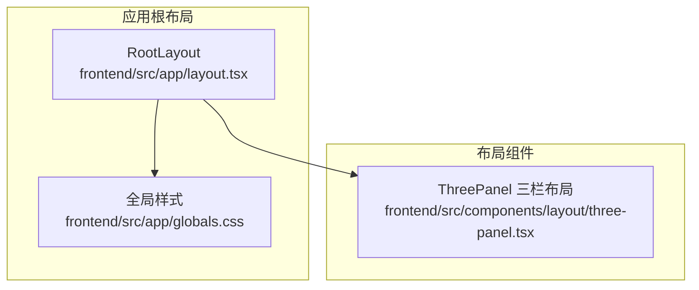
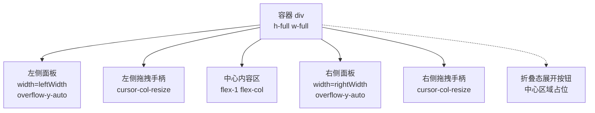
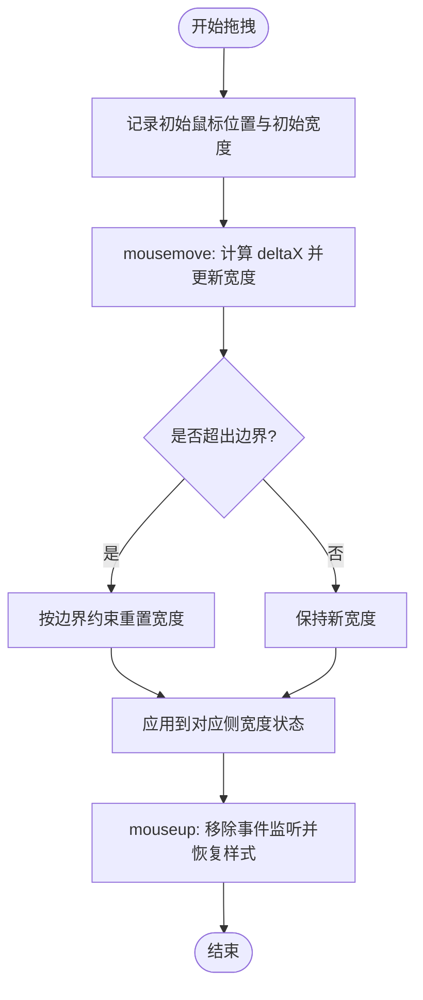
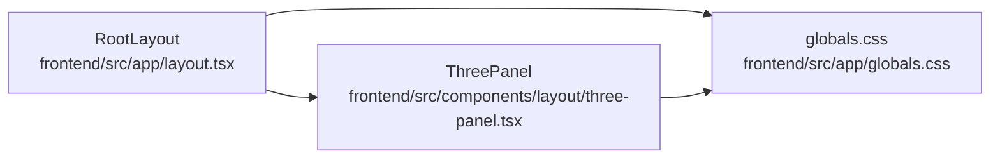

# 布局组件

<cite>
**本文引用的文件**
- [three-panel.tsx](file://frontend/src/components/layout/three-panel.tsx)
- [layout.tsx](file://frontend/src/app/layout.tsx)
- [globals.css](file://frontend/src/app/globals.css)
- [viewport-base.css](file://backend/skills/ppt/assets/viewport-base.css)
</cite>

## 目录
1. [简介](#简介)
2. [项目结构](#项目结构)
3. [核心组件](#核心组件)
4. [架构总览](#架构总览)
5. [详细组件分析](#详细组件分析)
6. [依赖关系分析](#依赖关系分析)
7. [性能考量](#性能考量)
8. [故障排查指南](#故障排查指南)
9. [结论](#结论)
10. [附录](#附录)

## 简介
本设计文档聚焦 Train Agent 前端的三栏式布局（ThreePanel）组件，系统阐述其整体架构、左右侧边栏的宽度调整机制、主内容区域的自适应策略，以及响应式设计与移动端适配方案。文档同时覆盖布局组件的嵌套模式、路由集成方式、主题切换支持、样式实现、动画过渡效果与跨浏览器兼容性处理，帮助开发者在不深入源码的情况下快速理解与扩展该布局系统。

## 项目结构
前端采用 Next.js 应用程序，根布局负责全局字体与基础样式注入；三栏式布局组件位于组件层，作为页面级容器被具体业务页面复用。全局样式通过 CSS 变量统一管理主题色板，并提供 Markdown 排版与滚动条样式等通用规则。

**图表来源**
- [layout.tsx:1-34](file://frontend/src/app/layout.tsx#L1-L34)
- [globals.css:1-201](file://frontend/src/app/globals.css#L1-L201)
- [three-panel.tsx:1-132](file://frontend/src/components/layout/three-panel.tsx#L1-L132)

**章节来源**
- [layout.tsx:15-33](file://frontend/src/app/layout.tsx#L15-L33)
- [globals.css:15-27](file://frontend/src/app/globals.css#L15-L27)

## 核心组件
ThreePanel 是一个可拖拽调整宽度的三栏布局容器，支持右侧面板折叠与展开，并提供可选的右侧面板回调接口以实现联动控制。组件内部通过状态管理左右侧边栏的宽度，限制最小与最大宽度，确保可用性与一致性。

关键特性
- 左右两侧独立拖拽手柄，支持实时调整宽度
- 右侧面板支持折叠模式，折叠时在中心区域显示“展开”按钮
- 支持向右侧子组件注入 collapsed 与 onToggle 属性，便于子组件感知状态变化
- 中心区域采用 Flex 布局，保证在两侧宽度变化时自适应填充剩余空间

**章节来源**
- [three-panel.tsx:5-11](file://frontend/src/components/layout/three-panel.tsx#L5-L11)
- [three-panel.tsx:13-16](file://frontend/src/components/layout/three-panel.tsx#L13-L16)
- [three-panel.tsx:18-73](file://frontend/src/components/layout/three-panel.tsx#L18-L73)

## 架构总览
ThreePanel 的渲染结构由左侧面板、左侧拖拽手柄、中心内容区、右侧面板或折叠态的“展开”按钮、以及右侧拖拽手柄组成。组件通过内联样式动态设置左右面板宽度，配合 Tailwind 类名实现边框、滚动与悬停交互。

**图表来源**
- [three-panel.tsx:75-130](file://frontend/src/components/layout/three-panel.tsx#L75-L130)

## 详细组件分析

### 三栏式布局（ThreePanel）
ThreePanel 的职责是提供一个可配置的三栏布局容器，支持左右侧边栏宽度的拖拽调整与右侧面板的折叠/展开。组件通过鼠标事件监听实现拖拽逻辑，并通过状态更新驱动 UI 重绘。

- 状态与默认值
  - 左侧默认宽度与右侧默认宽度
  - 最小与最大宽度约束，防止布局不可用
- 拖拽机制
  - 记录初始鼠标位置与初始宽度
  - 在 mousemove 中计算 deltaX 并更新对应侧宽度，应用边界约束
  - 在 mouseup 中移除事件监听并恢复光标与选择状态
- 折叠与展开
  - 当右侧面板处于折叠状态时，渲染中心区域的“展开”按钮
  - 提供 onRightToggle 回调，用于父组件控制右侧面板状态
- 子组件注入
  - 对右侧子元素进行类型判断与克隆，向函数组件注入 collapsed 与 onToggle 属性，增强可组合性

**图表来源**
- [three-panel.tsx:23-60](file://frontend/src/components/layout/three-panel.tsx#L23-L60)

**章节来源**
- [three-panel.tsx:18-73](file://frontend/src/components/layout/three-panel.tsx#L18-L73)
- [three-panel.tsx:75-130](file://frontend/src/components/layout/three-panel.tsx#L75-L130)

### 响应式设计与移动端适配
当前三栏式布局组件未直接定义断点与媒体查询，但项目中存在针对视口高度与宽度的媒体查询示例，可用于指导移动端适配策略。建议在业务页面或布局容器上引入断点，以在窄屏设备上隐藏一侧或多侧边栏，或采用单列堆叠布局。

- 视口与断点参考
  - 使用动态视口单位（如 dvh）提升移动端高度适配稳定性
  - 针对不同屏幕尺寸设置断点，优先保障中心内容区的可读性与交互可用性
  - 考虑减少拖拽手柄在移动端的交互复杂度，可通过折叠按钮或手势控制替代

**章节来源**
- [viewport-base.css:21](file://backend/skills/ppt/assets/viewport-base.css#L21)
- [viewport-base.css:128](file://backend/skills/ppt/assets/viewport-base.css#L128)

### 主题切换与样式实现
全局样式通过 CSS 变量定义主题色板，ThreePanel 组件使用 Tailwind 的语义化颜色类（如 border、background、accent 等）与过渡效果，确保在深色/浅色主题下具有一致的视觉表现。

- 主题变量
  - 背景、前景、强调色、边框、环形高亮等变量集中定义
  - 字体族变量通过 Google Fonts 注入
- 组件样式要点
  - 边框与背景使用语义化颜色类，保证与主题一致
  - 悬停态使用过渡效果，提升交互体验
  - 滚动条样式通过伪元素定制，适配暗色主题

**章节来源**
- [globals.css:3-27](file://frontend/src/app/globals.css#L3-L27)
- [globals.css:187-201](file://frontend/src/app/globals.css#L187-L201)
- [three-panel.tsx:79](file://frontend/src/components/layout/three-panel.tsx#L79)
- [three-panel.tsx:110](file://frontend/src/components/layout/three-panel.tsx#L110)

### 动画过渡与交互细节
- 过渡效果
  - 拖拽手柄在 hover 时显示高亮背景，使用过渡类实现平滑变化
  - 光标样式在拖拽过程中切换为列调整样式，避免文本选择干扰
- 无障碍与可访问性
  - 折叠按钮提供 aria-label 与 title，明确交互意图
  - 键盘可达性建议：为按钮添加键盘触发事件与焦点可见性

**章节来源**
- [three-panel.tsx:87](file://frontend/src/components/layout/three-panel.tsx#L87)
- [three-panel.tsx:114](file://frontend/src/components/layout/three-panel.tsx#L114)

### 嵌套模式与路由集成
- 嵌套模式
  - ThreePanel 可作为页面级容器，内部再嵌套更细粒度的布局或组件
  - 右侧面板可承载任务面板、文档面板等子功能组件
- 路由集成
  - 根布局负责注入全局样式与字体，页面组件通过 Next.js 路由加载
  - 页面级路由参数（如工作区 ID）可在 ThreePanel 内部进一步拆分与传递

**章节来源**
- [layout.tsx:20-33](file://frontend/src/app/layout.tsx#L20-L33)

## 依赖关系分析
ThreePanel 与应用根布局及全局样式的耦合关系如下：

**图表来源**
- [three-panel.tsx:1-3](file://frontend/src/components/layout/three-panel.tsx#L1-L3)
- [layout.tsx:1-3](file://frontend/src/app/layout.tsx#L1-L3)
- [globals.css:1-201](file://frontend/src/app/globals.css#L1-L201)

**章节来源**
- [three-panel.tsx:1-3](file://frontend/src/components/layout/three-panel.tsx#L1-L3)
- [layout.tsx:1-3](file://frontend/src/app/layout.tsx#L1-L3)

## 性能考量
- 渲染优化
  - 使用内联样式动态设置宽度，避免频繁重排；仅在拖拽结束时更新状态
  - 左右面板启用垂直滚动，避免长列表影响整体布局
- 事件处理
  - 拖拽事件在文档级别绑定，注意在组件卸载时清理事件监听，防止内存泄漏
- 主题与样式
  - CSS 变量与 Tailwind 类结合使用，减少重复样式定义，提升维护效率

[本节为通用性能建议，无需特定文件来源]

## 故障排查指南
- 拖拽无效或卡顿
  - 检查是否正确阻止了默认的文本选择行为
  - 确认在 mouseup 时已移除事件监听并恢复光标样式
- 宽度异常或越界
  - 核对最小/最大宽度常量与边界约束逻辑
  - 确保在拖拽过程中未误触其他元素导致事件中断
- 折叠按钮无响应
  - 确认 onRightToggle 回调已在父组件正确实现
  - 检查折叠态下的渲染分支是否被意外跳过
- 无障碍问题
  - 确保按钮具备 aria-label 与 title
  - 测试键盘可访问性，补充键盘触发事件

**章节来源**
- [three-panel.tsx:23-60](file://frontend/src/components/layout/three-panel.tsx#L23-L60)
- [three-panel.tsx:62-73](file://frontend/src/components/layout/three-panel.tsx#L62-L73)
- [three-panel.tsx:107-118](file://frontend/src/components/layout/three-panel.tsx#L107-L118)

## 结论
ThreePanel 三栏式布局组件通过简洁的状态管理与事件处理，提供了灵活且可用的多面板布局能力。结合全局主题变量与 Tailwind 类，组件在视觉与交互上保持一致的体验。建议在业务页面层面引入断点与媒体查询，以完善移动端适配；同时在组件生命周期中完善事件清理与无障碍支持，进一步提升稳定性与可访问性。

[本节为总结性内容，无需特定文件来源]

## 附录
- 建议的断点与媒体查询策略
  - 针对窄屏设备隐藏右侧面板，保留中心内容区
  - 在极窄屏下考虑将左右面板折叠为抽屉式布局
- 跨浏览器兼容性
  - 使用 CSS 变量与现代浏览器特性时，为旧版本浏览器提供降级方案
  - 滚动条样式需注意浏览器差异，必要时提供条件样式

[本节为通用建议，无需特定文件来源]