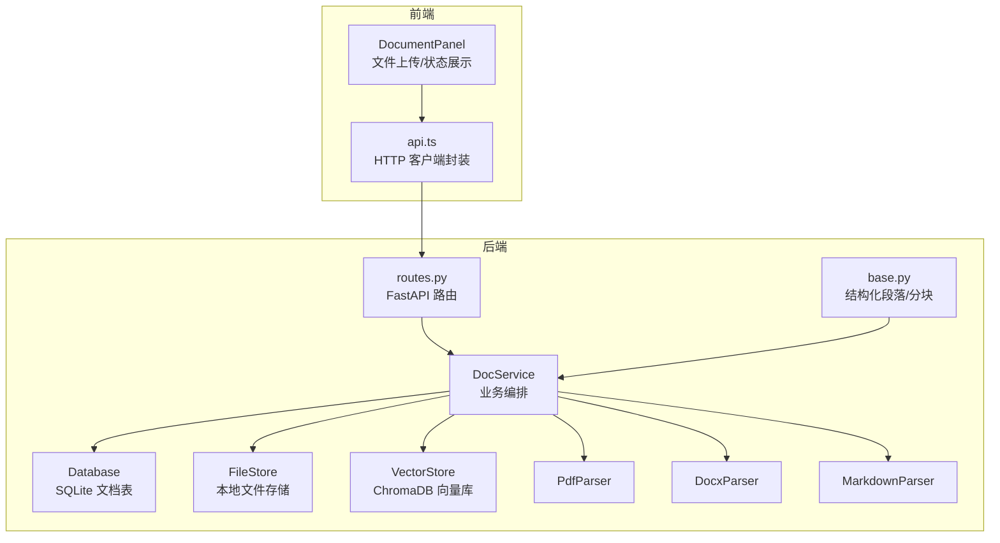
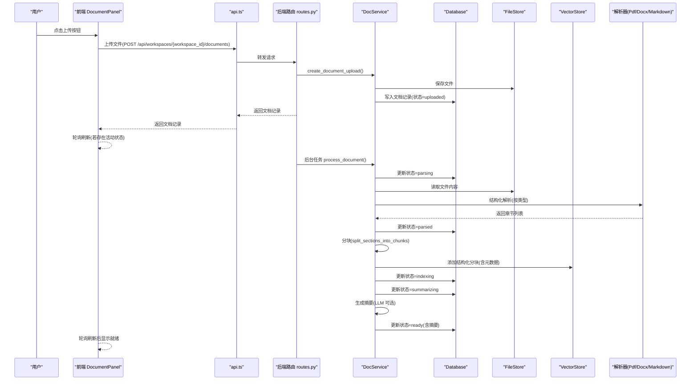
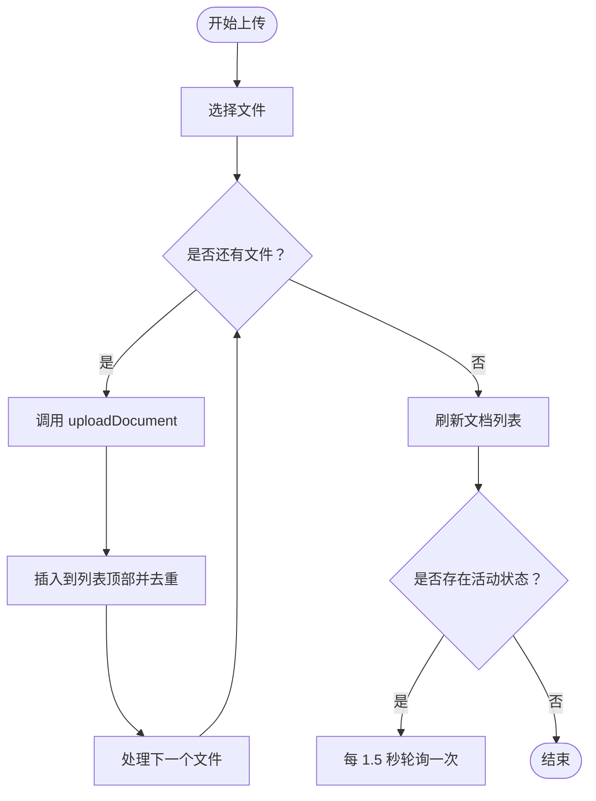
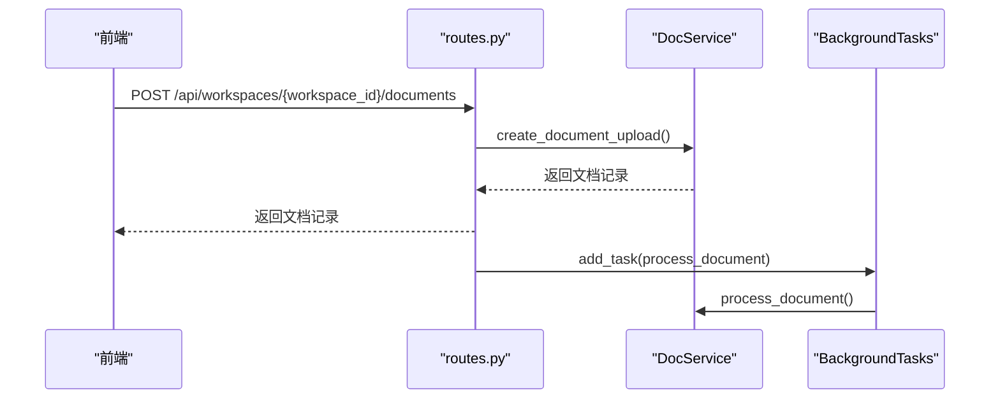
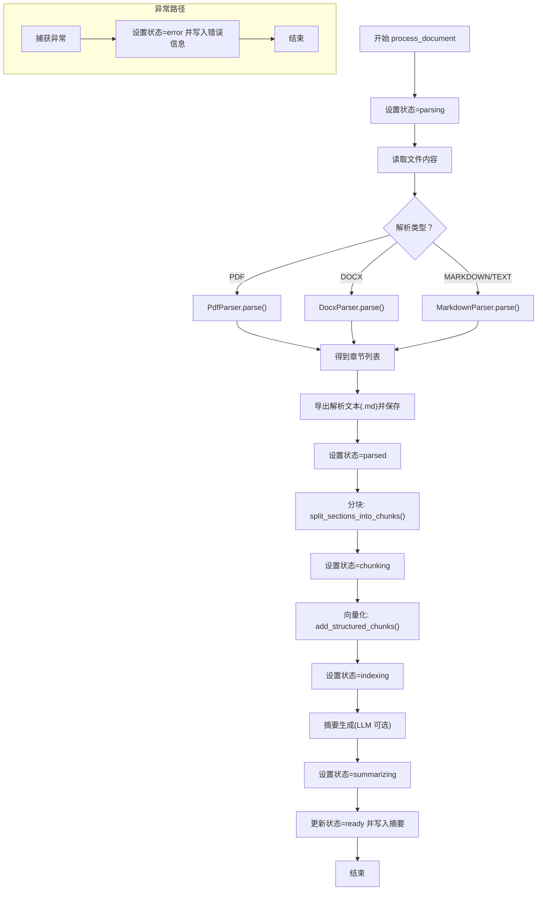
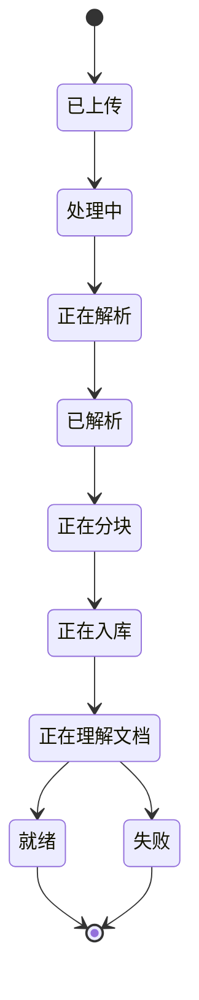
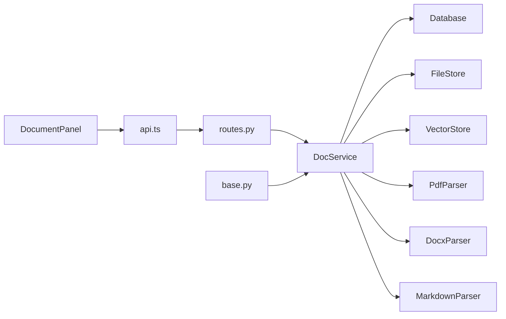

# 文档组件

<cite>
**本文引用的文件**
- [document-panel.tsx](file://frontend/src/components/document/document-panel.tsx)
- [api.ts](file://frontend/src/lib/api.ts)
- [routes.py](file://backend/src/api/routes.py)
- [doc_service.py](file://backend/src/services/doc_service.py)
- [pdf_parser.py](file://backend/src/parsers/pdf_parser.py)
- [docx_parser.py](file://backend/src/parsers/docx_parser.py)
- [markdown_parser.py](file://backend/src/parsers/markdown_parser.py)
- [base.py](file://backend/src/parsers/base.py)
- [vector_store.py](file://backend/src/storage/vector_store.py)
- [database.py](file://backend/src/storage/database.py)
- [file_store.py](file://backend/src/storage/file_store.py)
</cite>

## 目录
1. [简介](#简介)
2. [项目结构](#项目结构)
3. [核心组件](#核心组件)
4. [架构总览](#架构总览)
5. [详细组件分析](#详细组件分析)
6. [依赖分析](#依赖分析)
7. [性能考虑](#性能考虑)
8. [故障排查指南](#故障排查指南)
9. [结论](#结论)
10. [附录](#附录)

## 简介
本文件面向 Train Agent 的“文档组件”模块，聚焦于文档面板（document-panel）的文件上传处理流程、支持的文档格式解析逻辑、文件状态管理与进度展示机制、文档元数据提取与存储、向量化过程的触发时机、异步处理与错误恢复策略、文件验证规则与安全检查，以及前端与后端 API 的交互模式。目标是帮助开发者与使用者全面理解从文件上传到知识库可用的完整链路。

## 项目结构
文档组件由前端 React 组件与后端 Python 服务共同组成：
- 前端负责用户交互、文件选择、上传、轮询状态、删除等；
- 后端负责接收文件、持久化、解析、分块、向量化、摘要生成、状态更新与错误处理；
- 数据层包括 SQLite 文档记录、本地文件存储、向量数据库（ChromaDB）。

图表来源
- [document-panel.tsx:53-163](file://frontend/src/components/document/document-panel.tsx#L53-L163)
- [api.ts:146-173](file://frontend/src/lib/api.ts#L146-L173)
- [routes.py:112-128](file://backend/src/api/routes.py#L112-L128)
- [doc_service.py:29-130](file://backend/src/services/doc_service.py#L29-L130)
- [pdf_parser.py:17-36](file://backend/src/parsers/pdf_parser.py#L17-L36)
- [docx_parser.py:20-31](file://backend/src/parsers/docx_parser.py#L20-L31)
- [markdown_parser.py:13-21](file://backend/src/parsers/markdown_parser.py#L13-L21)
- [base.py:47-96](file://backend/src/parsers/base.py#L47-L96)
- [vector_store.py:39-122](file://backend/src/storage/vector_store.py#L39-L122)
- [database.py:285-311](file://backend/src/storage/database.py#L285-L311)
- [file_store.py:11-16](file://backend/src/storage/file_store.py#L11-L16)

章节来源
- [document-panel.tsx:1-214](file://frontend/src/components/document/document-panel.tsx#L1-L214)
- [api.ts:1-196](file://frontend/src/lib/api.ts#L1-L196)
- [routes.py:1-189](file://backend/src/api/routes.py#L1-L189)
- [doc_service.py:1-218](file://backend/src/services/doc_service.py#L1-L218)
- [pdf_parser.py:1-192](file://backend/src/parsers/pdf_parser.py#L1-L192)
- [docx_parser.py:1-84](file://backend/src/parsers/docx_parser.py#L1-L84)
- [markdown_parser.py:1-62](file://backend/src/parsers/markdown_parser.py#L1-L62)
- [base.py:1-97](file://backend/src/parsers/base.py#L1-L97)
- [vector_store.py:1-177](file://backend/src/storage/vector_store.py#L1-L177)
- [database.py:1-379](file://backend/src/storage/database.py#L1-L379)
- [file_store.py:1-39](file://backend/src/storage/file_store.py#L1-L39)

## 核心组件
- 前端文档面板（DocumentPanel）
  - 支持多文件上传（.pdf/.docx/.doc/.md/.txt），点击按钮触发隐藏 input，逐个上传；
  - 列表展示文档，按状态配置显示图标与标签，错误时展示错误消息或摘要预览；
  - 当存在活动状态（未完成）时，每 1.5 秒轮询刷新一次文档列表；
  - 删除文档调用后端接口清理数据库记录、向量索引与文件。
- 后端文档服务（DocService）
  - 接收文件，保存到本地存储，写入数据库记录，初始状态为“uploaded”；
  - 异步后台任务执行解析、分块、向量化、摘要生成，期间按阶段更新状态；
  - 解析器根据类型选择 PDF、DOCX 或 Markdown 解析器，或回退为 Markdown；
  - 分块采用递归字符分割，保留章节/页码元数据，写入向量库；
  - 摘要生成可选使用 LLM，失败时回退为截断文本。
- 存储与检索
  - 文件存储：按工作区目录组织，支持删除工作区与单个文档；
  - 数据库存储：文档表含状态、错误信息、摘要、时间戳等字段；
  - 向量存储：ChromaDB 持久化，支持按文档 ID 过滤查询，返回带元数据的结果。

章节来源
- [document-panel.tsx:53-163](file://frontend/src/components/document/document-panel.tsx#L53-L163)
- [api.ts:146-173](file://frontend/src/lib/api.ts#L146-L173)
- [routes.py:112-128](file://backend/src/api/routes.py#L112-L128)
- [doc_service.py:29-130](file://backend/src/services/doc_service.py#L29-L130)
- [database.py:285-311](file://backend/src/storage/database.py#L285-L311)
- [file_store.py:11-16](file://backend/src/storage/file_store.py#L11-L16)
- [vector_store.py:39-122](file://backend/src/storage/vector_store.py#L39-L122)

## 架构总览
下图展示了从前端上传到后端处理再到向量检索的整体流程。

图表来源
- [document-panel.tsx:77-102](file://frontend/src/components/document/document-panel.tsx#L77-L102)
- [api.ts:146-164](file://frontend/src/lib/api.ts#L146-L164)
- [routes.py:112-128](file://backend/src/api/routes.py#L112-L128)
- [doc_service.py:29-130](file://backend/src/services/doc_service.py#L29-L130)
- [pdf_parser.py:20-36](file://backend/src/parsers/pdf_parser.py#L20-L36)
- [docx_parser.py:23-31](file://backend/src/parsers/docx_parser.py#L23-L31)
- [markdown_parser.py:16-21](file://backend/src/parsers/markdown_parser.py#L16-L21)
- [base.py:47-96](file://backend/src/parsers/base.py#L47-L96)
- [vector_store.py:91-122](file://backend/src/storage/vector_store.py#L91-L122)
- [database.py:321-328](file://backend/src/storage/database.py#L321-L328)

## 详细组件分析

### 前端组件：DocumentPanel
- 文件上传
  - 使用隐藏的 input[type=file]，多选，限定 accept 类型；
  - 逐个文件调用 uploadDocument，成功后插入到列表顶部并去重；
  - 上传过程中禁用按钮，清空 input 值避免重复提交。
- 状态管理与轮询
  - ACTIVE_STATUSES 集合定义“活动状态”，当存在活动状态时，每 1.5 秒自动刷新；
  - 状态配置映射包含 uploaded、processing、parsing、parsed、chunking、indexing、summarizing、ready、error；
  - 错误状态展示 error_message，否则展示摘要前缀或状态标签。
- 删除文档
  - 调用后端删除接口，随后刷新文档列表。

图表来源
- [document-panel.tsx:77-102](file://frontend/src/components/document/document-panel.tsx#L77-L102)
- [document-panel.tsx:67-75](file://frontend/src/components/document/document-panel.tsx#L67-L75)

章节来源
- [document-panel.tsx:53-163](file://frontend/src/components/document/document-panel.tsx#L53-L163)

### 后端 API：上传与后台处理
- 路由
  - POST /api/workspaces/{workspace_id}/documents：读取文件内容，调用 DocService.create_document_upload 创建记录；
  - 使用 BackgroundTasks 将 DocService.process_document 加入后台队列，立即返回当前记录；
  - GET /api/workspaces/{workspace_id}/documents：列出该工作区所有文档；
  - DELETE /api/workspaces/{workspace_id}/documents/{doc_id}：删除文档并清理向量与文件。
- 错误处理
  - 非 2xx 响应抛出 ApiError，前端统一捕获并记录日志。

图表来源
- [routes.py:112-128](file://backend/src/api/routes.py#L112-L128)
- [api.ts:146-164](file://frontend/src/lib/api.ts#L146-L164)

章节来源
- [routes.py:112-141](file://backend/src/api/routes.py#L112-L141)
- [api.ts:146-173](file://frontend/src/lib/api.ts#L146-L173)

### 文档服务：解析、分块与向量化
- 流程概览
  - create_document_upload：检测类型、保存文件、写入数据库记录；
  - process_document：按阶段更新状态，依次执行解析、导出解析文本、分块、向量化、摘要生成、最终置为 ready；
  - 解析器选择：PDF 使用 PdfParser，DOCX 使用 DocxParser，Markdown/Text 使用 MarkdownParser；
  - 分块策略：split_sections_into_chunks 使用递归字符分割器，保留章节标题、页码、层级等元数据；
  - 向量化：VectorStore.add_structured_chunks 写入带元数据的分块；
  - 摘要：可选 LLM 生成，失败回退为截断文本。
- 错误处理
  - 捕获异常并更新状态为 error，同时记录 error_message；
  - 删除文档时同步清理向量与文件。

图表来源
- [doc_service.py:57-130](file://backend/src/services/doc_service.py#L57-L130)
- [pdf_parser.py:20-36](file://backend/src/parsers/pdf_parser.py#L20-L36)
- [docx_parser.py:23-31](file://backend/src/parsers/docx_parser.py#L23-L31)
- [markdown_parser.py:16-21](file://backend/src/parsers/markdown_parser.py#L16-L21)
- [base.py:47-96](file://backend/src/parsers/base.py#L47-L96)
- [vector_store.py:91-122](file://backend/src/storage/vector_store.py#L91-L122)
- [database.py:321-328](file://backend/src/storage/database.py#L321-L328)

章节来源
- [doc_service.py:29-130](file://backend/src/services/doc_service.py#L29-L130)
- [base.py:47-96](file://backend/src/parsers/base.py#L47-L96)
- [vector_store.py:91-122](file://backend/src/storage/vector_store.py#L91-L122)
- [database.py:321-328](file://backend/src/storage/database.py#L321-L328)

### 解析器实现要点
- PDF 解析
  - 基于 PyMuPDF 提取文本块，结合字体大小与粗体特征识别标题；
  - 通过标题层级与页面号构建 DocumentSection；
  - 失败时回退为按页分段。
- DOCX 解析
  - 基于 python-docx 的样式名称映射到标题层级；
  - 无标题时回退为整篇文档作为一个章节。
- Markdown 解析
  - 正则匹配 # 标题，计算内容区间；
  - 无标题时回退为整篇文档作为一个章节。

章节来源
- [pdf_parser.py:17-192](file://backend/src/parsers/pdf_parser.py#L17-L192)
- [docx_parser.py:20-84](file://backend/src/parsers/docx_parser.py#L20-L84)
- [markdown_parser.py:13-62](file://backend/src/parsers/markdown_parser.py#L13-L62)

### 分块与元数据
- 分块策略
  - 递归字符分割，支持换行、段落、中文标点与空格作为分隔符；
  - 单节超长时拆分为多个子块，每个块分配自增索引；
  - 元数据包含：文档 ID、文件名、章节标题、章标题、页码范围、章节层级、块索引。
- 向量化
  - 使用 DashscopeEmbeddingFunction 计算嵌入；
  - ChromaDB Collection 按工作区命名，支持按 doc_id 过滤查询。

章节来源
- [base.py:47-96](file://backend/src/parsers/base.py#L47-L96)
- [vector_store.py:13-37](file://backend/src/storage/vector_store.py#L13-L37)
- [vector_store.py:91-122](file://backend/src/storage/vector_store.py#L91-L122)

### 数据模型与状态机
- 文档状态
  - uploaded → processing → parsing → parsed → chunking → indexing → summarizing → ready 或 error；
  - error 状态包含错误信息，用于前端展示。
- 数据库表
  - document 表包含：id、workspace_id、filename、file_type、summary、storage_path、status、error_message、created_at、updated_at；
  - 支持迁移添加新列（如 error_message、updated_at）。

图表来源
- [document-panel.tsx:24-34](file://frontend/src/components/document/document-panel.tsx#L24-L34)
- [database.py:321-328](file://backend/src/storage/database.py#L321-L328)

章节来源
- [document-panel.tsx:24-44](file://frontend/src/components/document/document-panel.tsx#L24-L44)
- [database.py:321-328](file://backend/src/storage/database.py#L321-L328)

## 依赖分析
- 组件耦合
  - 前端仅依赖 api.ts 的类型与方法签名；
  - 后端 DocService 依赖解析器、向量存储、文件存储与数据库；
  - 解析器共享基础数据结构（DocumentSection、ChunkWithMetadata）。
- 外部依赖
  - PDF：PyMuPDF；
  - DOCX：python-docx；
  - Markdown：正则；
  - 向量：ChromaDB + DashScope 嵌入；
  - 存储：本地文件系统；
  - 数据库：aiosqlite（SQLite）。

图表来源
- [document-panel.tsx:1-214](file://frontend/src/components/document/document-panel.tsx#L1-L214)
- [api.ts:1-196](file://frontend/src/lib/api.ts#L1-L196)
- [routes.py:1-189](file://backend/src/api/routes.py#L1-L189)
- [doc_service.py:1-218](file://backend/src/services/doc_service.py#L1-L218)
- [pdf_parser.py:1-192](file://backend/src/parsers/pdf_parser.py#L1-L192)
- [docx_parser.py:1-84](file://backend/src/parsers/docx_parser.py#L1-L84)
- [markdown_parser.py:1-62](file://backend/src/parsers/markdown_parser.py#L1-L62)
- [base.py:1-97](file://backend/src/parsers/base.py#L1-L97)
- [vector_store.py:1-177](file://backend/src/storage/vector_store.py#L1-L177)
- [database.py:1-379](file://backend/src/storage/database.py#L1-L379)
- [file_store.py:1-39](file://backend/src/storage/file_store.py#L1-L39)

章节来源
- [doc_service.py:1-28](file://backend/src/services/doc_service.py#L1-L28)
- [base.py:1-46](file://backend/src/parsers/base.py#L1-L46)

## 性能考虑
- 分块与向量化批处理
  - 向量存储批量写入，默认批次大小为 20，减少网络往返与写入开销；
  - 分块时先进行大文本拆分，再写入向量库，避免单次超大数据传输。
- I/O 与并发
  - 文件写入采用线程池包装，避免阻塞事件循环；
  - 数据库连接按需初始化，避免重复连接。
- 查询优化
  - 向量检索支持按 doc_id 过滤，缩小搜索范围；
  - 集合命名按工作区区分，避免跨工作区干扰。

章节来源
- [vector_store.py:57-89](file://backend/src/storage/vector_store.py#L57-L89)
- [vector_store.py:91-122](file://backend/src/storage/vector_store.py#L91-L122)
- [file_store.py:18-28](file://backend/src/storage/file_store.py#L18-L28)
- [database.py:14-24](file://backend/src/storage/database.py#L14-L24)

## 故障排查指南
- 常见问题与定位
  - 上传后状态长时间停留在“处理中/解析中”
    - 检查后台任务是否被调度（routes.py 中 BackgroundTasks 是否生效）；
    - 查看 DocService 的异常分支是否被触发并写入 error 状态；
    - 前端轮询是否仍在运行（ACTIVE_STATUSES 是否包含当前状态）。
  - “失败”状态但无错误详情
    - 检查后端日志中的 error_message 字段；
    - 前端展示优先使用 error_message，其次使用摘要前缀。
  - 向量检索为空
    - 确认集合存在且包含对应工作区命名；
    - 检查是否正确传入 doc_id 进行过滤；
    - 确认嵌入模型与 API Key 配置正确。
- 安全与验证建议
  - 前端 accept 限制了文件类型，但建议后端再次校验扩展名与 MIME；
  - 对文件大小进行限制（建议在后端读取前判断），避免内存压力；
  - 对解析结果进行空值检查，防止空文本导致摘要生成异常；
  - 对外部 LLM 调用增加超时与重试策略，失败时回退为本地摘要。

章节来源
- [routes.py:112-128](file://backend/src/api/routes.py#L112-L128)
- [doc_service.py:121-130](file://backend/src/services/doc_service.py#L121-L130)
- [document-panel.tsx:178-183](file://frontend/src/components/document/document-panel.tsx#L178-L183)
- [vector_store.py:124-163](file://backend/src/storage/vector_store.py#L124-L163)

## 结论
文档组件通过前后端协作实现了从文件上传到知识库可用的完整闭环：前端负责直观的状态展示与轮询，后端负责稳健的解析、分块、向量化与摘要生成，并以数据库与文件系统作为持久化基础。通过明确的状态机与错误恢复策略，系统具备良好的可观测性与可维护性。后续可在文件大小限制、MIME 校验、LLM 超时与重试等方面进一步增强健壮性。

## 附录

### 支持的文档格式与解析逻辑
- PDF
  - 使用 PyMuPDF 提取文本块，基于字体大小与粗体识别标题，构建章节树并标注页码；
  - 回退策略：无法识别结构时按页切分。
- DOCX
  - 使用 python-docx 的样式映射识别标题层级；
  - 回退策略：无标题时整篇文档作为单一章节。
- Markdown/Text
  - 使用正则匹配 # 标题，计算内容区间；
  - 回退策略：无标题时整篇文档作为单一章节。

章节来源
- [pdf_parser.py:17-192](file://backend/src/parsers/pdf_parser.py#L17-L192)
- [docx_parser.py:20-84](file://backend/src/parsers/docx_parser.py#L20-L84)
- [markdown_parser.py:13-62](file://backend/src/parsers/markdown_parser.py#L13-L62)

### 文件状态管理与进度显示
- 前端状态映射与图标颜色、标签、动画控制；
- ACTIVE_STATUSES 控制轮询频率；
- 错误状态优先展示 error_message，否则展示摘要或默认标签。

章节来源
- [document-panel.tsx:24-44](file://frontend/src/components/document/document-panel.tsx#L24-L44)
- [document-panel.tsx:67-75](file://frontend/src/components/document/document-panel.tsx#L67-L75)
- [document-panel.tsx:178-183](file://frontend/src/components/document/document-panel.tsx#L178-L183)

### 向量化触发时机与元数据
- 触发时机：解析完成后进入分块阶段，随后向量化；
- 元数据：doc_id、filename、chunk_index、section_title、chapter_title、page_start/page_end、section_level。

章节来源
- [doc_service.py:94-106](file://backend/src/services/doc_service.py#L94-L106)
- [base.py:30-41](file://backend/src/parsers/base.py#L30-L41)
- [vector_store.py:114-121](file://backend/src/storage/vector_store.py#L114-L121)

### 异步处理与错误恢复
- 异步：上传立即返回，后台任务继续处理；
- 错误恢复：异常捕获后写入 error 状态与错误信息，前端可据此提示与重试。

章节来源
- [routes.py:112-128](file://backend/src/api/routes.py#L112-L128)
- [doc_service.py:121-130](file://backend/src/services/doc_service.py#L121-L130)

### 前端 API 交互模式
- 上传：FormData 传递文件，返回文档记录；
- 列表：GET 请求获取文档数组；
- 删除：DELETE 请求清理记录与向量与文件。

章节来源
- [api.ts:146-173](file://frontend/src/lib/api.ts#L146-L173)