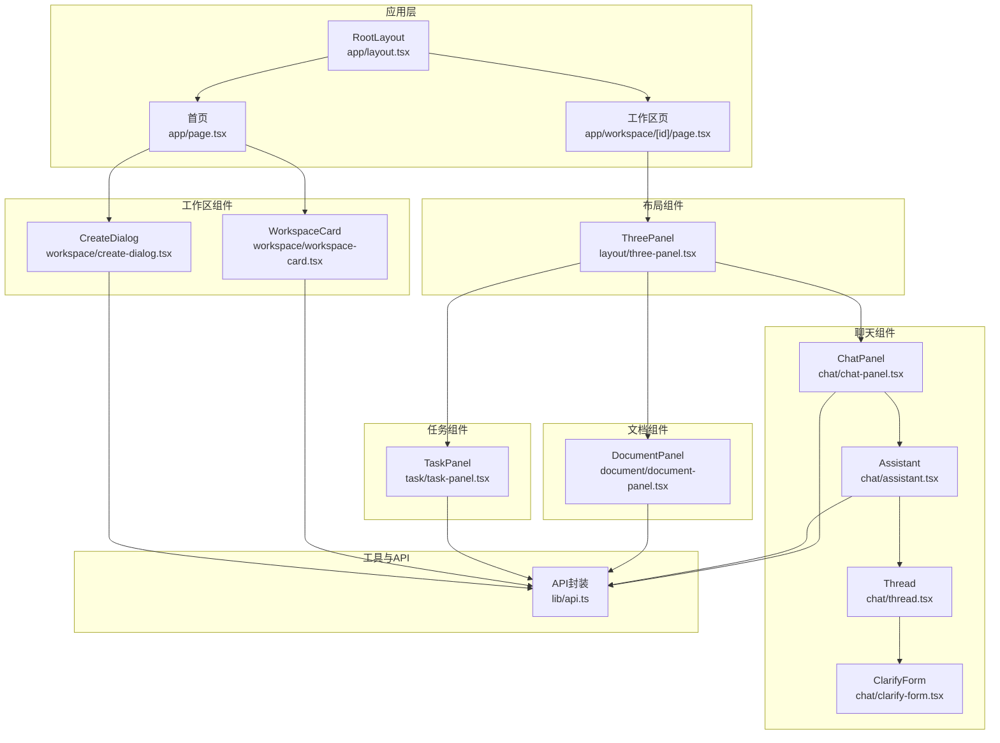
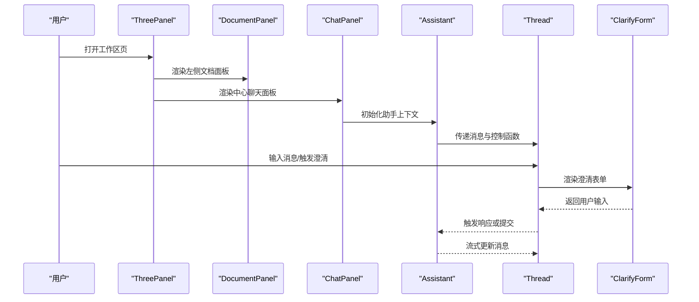
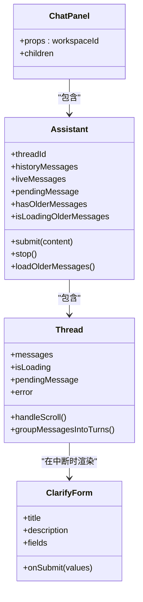
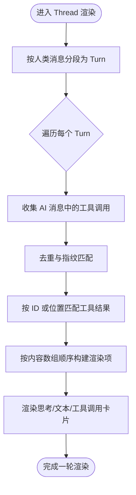
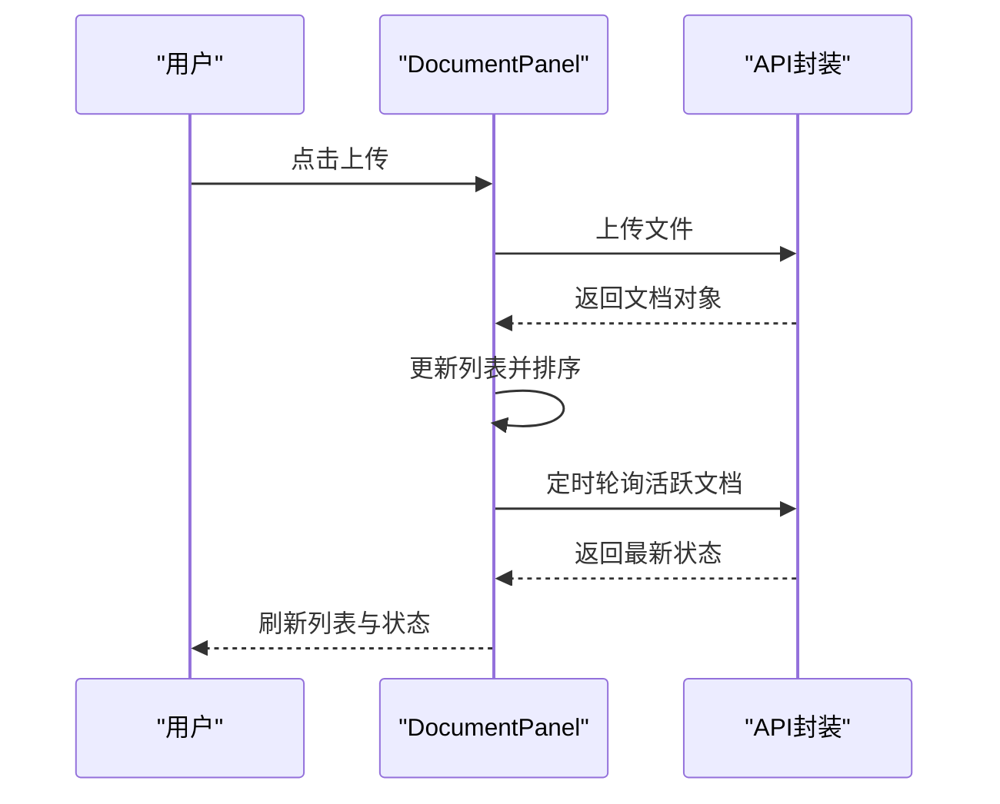
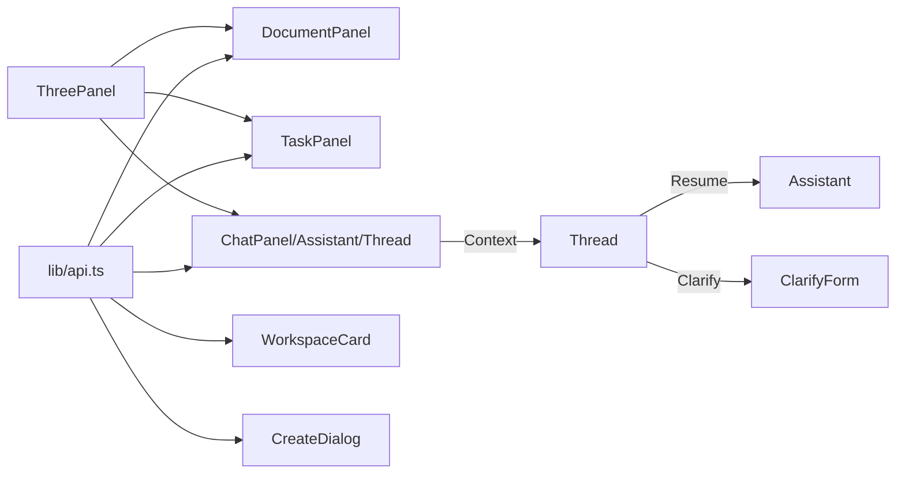

# 组件系统

<cite>
**本文引用的文件**
- [frontend/src/components/chat/chat-panel.tsx](file://frontend/src/components/chat/chat-panel.tsx)
- [frontend/src/components/chat/assistant.tsx](file://frontend/src/components/chat/assistant.tsx)
- [frontend/src/components/chat/thread.tsx](file://frontend/src/components/chat/thread.tsx)
- [frontend/src/components/chat/clarify-form.tsx](file://frontend/src/components/chat/clarify-form.tsx)
- [frontend/src/components/document/document-panel.tsx](file://frontend/src/components/document/document-panel.tsx)
- [frontend/src/components/task/task-panel.tsx](file://frontend/src/components/task/task-panel.tsx)
- [frontend/src/components/layout/three-panel.tsx](file://frontend/src/components/layout/three-panel.tsx)
- [frontend/src/components/workspace/workspace-card.tsx](file://frontend/src/components/workspace/workspace-card.tsx)
- [frontend/src/components/workspace/create-dialog.tsx](file://frontend/src/components/workspace/create-dialog.tsx)
- [frontend/src/lib/api.ts](file://frontend/src/lib/api.ts)
- [frontend/src/app/workspace/[id]/page.tsx](file://frontend/src/app/workspace/[id]/page.tsx)
- [frontend/src/app/page.tsx](file://frontend/src/app/page.tsx)
- [frontend/src/app/layout.tsx](file://frontend/src/app/layout.tsx)
- [frontend/src/app/globals.css](file://frontend/src/app/globals.css)
</cite>

## 目录
1. [简介](#简介)
2. [项目结构](#项目结构)
3. [核心组件](#核心组件)
4. [架构总览](#架构总览)
5. [详细组件分析](#详细组件分析)
6. [依赖关系分析](#依赖关系分析)
7. [性能考量](#性能考量)
8. [故障排查指南](#故障排查指南)
9. [结论](#结论)
10. [附录](#附录)

## 简介
本开发指南面向 Train Agent 的前端组件系统，聚焦聊天组件（chat-panel、assistant、thread、clarify-form）、文档面板组件、任务面板组件、布局组件（三栏式界面）与工作区组件（卡片与对话框）。文档从组件设计、数据流与交互、props 传递与事件处理、组件通信机制、复用最佳实践、样式组织与响应式实现、生命周期管理与性能优化等维度进行系统化说明，并辅以图示与路径引用，帮助开发者快速理解与高效扩展。

## 项目结构
前端采用 Next.js App Router 结构，页面级路由位于 app 目录；业务组件位于 components 目录；通用 API 封装位于 lib 目录；全局样式位于 app/globals.css。工作区页面通过三栏布局组合文档、聊天与任务三大能力域。

图表来源
- [frontend/src/app/layout.tsx:1-34](file://frontend/src/app/layout.tsx#L1-L34)
- [frontend/src/app/page.tsx:1-121](file://frontend/src/app/page.tsx#L1-L121)
- [frontend/src/app/workspace/[id]/page.tsx:1-65](file://frontend/src/app/workspace/[id]/page.tsx#L1-L65)
- [frontend/src/components/layout/three-panel.tsx:1-132](file://frontend/src/components/layout/three-panel.tsx#L1-L132)
- [frontend/src/components/chat/chat-panel.tsx:1-17](file://frontend/src/components/chat/chat-panel.tsx#L1-L17)
- [frontend/src/components/chat/assistant.tsx:1-292](file://frontend/src/components/chat/assistant.tsx#L1-L292)
- [frontend/src/components/chat/thread.tsx:1-1504](file://frontend/src/components/chat/thread.tsx#L1-L1504)
- [frontend/src/components/chat/clarify-form.tsx:1-230](file://frontend/src/components/chat/clarify-form.tsx#L1-L230)
- [frontend/src/components/document/document-panel.tsx:1-214](file://frontend/src/components/document/document-panel.tsx#L1-L214)
- [frontend/src/components/task/task-panel.tsx:1-230](file://frontend/src/components/task/task-panel.tsx#L1-L230)
- [frontend/src/components/workspace/workspace-card.tsx:1-51](file://frontend/src/components/workspace/workspace-card.tsx#L1-L51)
- [frontend/src/components/workspace/create-dialog.tsx:1-90](file://frontend/src/components/workspace/create-dialog.tsx#L1-L90)
- [frontend/src/lib/api.ts:1-196](file://frontend/src/lib/api.ts#L1-L196)

章节来源
- [frontend/src/app/layout.tsx:1-34](file://frontend/src/app/layout.tsx#L1-L34)
- [frontend/src/app/page.tsx:1-121](file://frontend/src/app/page.tsx#L1-L121)
- [frontend/src/app/workspace/[id]/page.tsx:1-65](file://frontend/src/app/workspace/[id]/page.tsx#L1-L65)

## 核心组件
- 聊天组件链路：ChatPanel 作为容器，内部嵌套 Assistant 与 Thread；Assistant 负责消息流与上下文状态，Thread 负责渲染与输入交互；当模型需要用户澄清时，Thread 渲染 ClarifyForm 并通过 ResumeContext 回传值。
- 文档面板：负责文档上传、轮询状态、删除与展示，支持多类型文件与多种处理阶段的状态可视化。
- 任务面板：展示生成任务列表，支持展开/收起右侧产出区域，提供下载与删除操作。
- 布局组件：ThreePanel 实现左右两栏可拖拽调整宽度，支持右侧折叠与展开按钮。
- 工作区组件：WorkspaceCard 展示工作区卡片，CreateDialog 提供新建工作区弹窗。

章节来源
- [frontend/src/components/chat/chat-panel.tsx:1-17](file://frontend/src/components/chat/chat-panel.tsx#L1-L17)
- [frontend/src/components/chat/assistant.tsx:1-292](file://frontend/src/components/chat/assistant.tsx#L1-L292)
- [frontend/src/components/chat/thread.tsx:1-1504](file://frontend/src/components/chat/thread.tsx#L1-L1504)
- [frontend/src/components/chat/clarify-form.tsx:1-230](file://frontend/src/components/chat/clarify-form.tsx#L1-L230)
- [frontend/src/components/document/document-panel.tsx:1-214](file://frontend/src/components/document/document-panel.tsx#L1-L214)
- [frontend/src/components/task/task-panel.tsx:1-230](file://frontend/src/components/task/task-panel.tsx#L1-L230)
- [frontend/src/components/layout/three-panel.tsx:1-132](file://frontend/src/components/layout/three-panel.tsx#L1-L132)
- [frontend/src/components/workspace/workspace-card.tsx:1-51](file://frontend/src/components/workspace/workspace-card.tsx#L1-L51)
- [frontend/src/components/workspace/create-dialog.tsx:1-90](file://frontend/src/components/workspace/create-dialog.tsx#L1-L90)

## 架构总览
组件间通过 props 向下传递与 Context 向上共享实现松耦合通信。聊天链路使用自定义 Context 暴露消息、加载状态、提交与停止等能力；文档与任务面板通过 API 封装统一访问后端；ThreePanel 作为布局容器协调左右两栏。

图表来源
- [frontend/src/components/layout/three-panel.tsx:18-131](file://frontend/src/components/layout/three-panel.tsx#L18-L131)
- [frontend/src/components/document/document-panel.tsx:53-163](file://frontend/src/components/document/document-panel.tsx#L53-L163)
- [frontend/src/components/chat/chat-panel.tsx:10-16](file://frontend/src/components/chat/chat-panel.tsx#L10-L16)
- [frontend/src/components/chat/assistant.tsx:59-254](file://frontend/src/components/chat/assistant.tsx#L59-L254)
- [frontend/src/components/chat/thread.tsx:150-236](file://frontend/src/components/chat/thread.tsx#L150-L236)
- [frontend/src/components/chat/clarify-form.tsx:21-106](file://frontend/src/components/chat/clarify-form.tsx#L21-L106)

## 详细组件分析

### 聊天组件链路（ChatPanel → Assistant → Thread）
- ChatPanel：接收 workspaceId，包裹 Assistant 与 Thread，形成聊天主容器。
- Assistant：
  - 通过 useStream 集成 LangGraph 流式接口，维护 threadId、历史消息与实时消息基线。
  - 通过 Context 暴露 messages、isLoading、interrupt、submit、stop、error、loadOlderMessages、hasOlderMessages、isLoadingOlderMessages 等。
  - 自动恢复：当检测到线程不存在错误时，清空 threadId 以触发重建。
  - 持久化：首次获得有效 threadId 后异步更新至工作区。
  - 合并策略：将历史消息与实时流式消息去重合并，避免重复渲染。
- Thread：
  - 负责滚动行为、历史消息加载、消息分组（Turn）与渲染。
  - 支持“人-智能体-工具”回合式展示，按顺序渲染思考内容、文本与工具调用结果。
  - 当模型请求澄清时，渲染 ClarifyForm 并通过 ResumeContext 回传用户输入。

图表来源
- [frontend/src/components/chat/chat-panel.tsx:6-16](file://frontend/src/components/chat/chat-panel.tsx#L6-L16)
- [frontend/src/components/chat/assistant.tsx:54-254](file://frontend/src/components/chat/assistant.tsx#L54-L254)
- [frontend/src/components/chat/thread.tsx:150-302](file://frontend/src/components/chat/thread.tsx#L150-L302)
- [frontend/src/components/chat/clarify-form.tsx:14-106](file://frontend/src/components/chat/clarify-form.tsx#L14-L106)

章节来源
- [frontend/src/components/chat/chat-panel.tsx:1-17](file://frontend/src/components/chat/chat-panel.tsx#L1-L17)
- [frontend/src/components/chat/assistant.tsx:59-254](file://frontend/src/components/chat/assistant.tsx#L59-L254)
- [frontend/src/components/chat/thread.tsx:150-486](file://frontend/src/components/chat/thread.tsx#L150-L486)
- [frontend/src/components/chat/clarify-form.tsx:21-106](file://frontend/src/components/chat/clarify-form.tsx#L21-L106)

### 消息分组与渲染流程（Turn 与工具调用）
- Turn 分组：将连续的人类消息之间的所有 AI 与工具消息视为一轮，统一渲染，便于展示“思考→行动→结果”的完整过程。
- 工具调用匹配：优先使用带真实 ID 的工具调用进行结果匹配；若缺失 ID，则回退按位置匹配，保证结果正确回填。
- 内容顺序：严格遵循模型输出的内容数组顺序，支持“文本→工具→文本”等交错渲染。
- 澄清表单：当模型发出中断请求时，渲染 ClarifyForm，用户提交后通过 ResumeContext 触发响应。

图表来源
- [frontend/src/components/chat/thread.tsx:252-486](file://frontend/src/components/chat/thread.tsx#L252-L486)

章节来源
- [frontend/src/components/chat/thread.tsx:252-486](file://frontend/src/components/chat/thread.tsx#L252-L486)

### 澄清表单组件（ClarifyForm）
- 表单字段类型：文本、单选、多选；支持必填校验与禁用提交。
- 用户交互：提交后显示“已提交”，取消后显示“已取消”并发送取消标记。
- 与聊天链路集成：通过 ResumeContext 将表单结果回传给 Assistant，继续对话流程。

章节来源
- [frontend/src/components/chat/clarify-form.tsx:14-106](file://frontend/src/components/chat/clarify-form.tsx#L14-L106)
- [frontend/src/components/chat/thread.tsx:22-23](file://frontend/src/components/chat/thread.tsx#L22-L23)
- [frontend/src/components/chat/assistant.tsx:226-228](file://frontend/src/components/chat/assistant.tsx#L226-L228)

### 文档面板组件（DocumentPanel）
- 功能点：上传、轮询状态、删除、展示。
- 状态管理：维护文档列表，对处于活跃状态的文档定时轮询；根据状态映射图标、颜色与标签。
- 文件类型：支持 PDF、DOCX、Markdown、文本等；展示文件类型标签与摘要/错误信息。

图表来源
- [frontend/src/components/document/document-panel.tsx:53-163](file://frontend/src/components/document/document-panel.tsx#L53-L163)
- [frontend/src/lib/api.ts:142-173](file://frontend/src/lib/api.ts#L142-L173)

章节来源
- [frontend/src/components/document/document-panel.tsx:53-163](file://frontend/src/components/document/document-panel.tsx#L53-L163)
- [frontend/src/lib/api.ts:118-173](file://frontend/src/lib/api.ts#L118-L173)

### 任务面板组件（TaskPanel）
- 功能点：展示生成任务、展开/收起右侧产出、下载与删除。
- 状态管理：定时轮询任务列表；根据任务类型与状态映射图标、颜色与标签。
- 下载：拼接后端文件下载地址，触发浏览器下载。

章节来源
- [frontend/src/components/task/task-panel.tsx:53-113](file://frontend/src/components/task/task-panel.tsx#L53-L113)
- [frontend/src/lib/api.ts:175-195](file://frontend/src/lib/api.ts#L175-L195)

### 布局组件（ThreePanel）
- 功能点：左/右两栏宽度可拖拽调整，支持右侧折叠与展开按钮。
- 交互细节：鼠标按下时记录初始宽度，移动过程中限制最小/最大宽度；右侧折叠时在中心区域显示展开按钮。

章节来源
- [frontend/src/components/layout/three-panel.tsx:18-131](file://frontend/src/components/layout/three-panel.tsx#L18-L131)

### 工作区组件（WorkspaceCard 与 CreateDialog）
- WorkspaceCard：展示工作区名称与创建日期，点击打开工作区，悬停显示删除按钮。
- CreateDialog：弹窗输入名称，提交后关闭并回调创建成功；支持错误提示与禁用态。

章节来源
- [frontend/src/components/workspace/workspace-card.tsx:12-51](file://frontend/src/components/workspace/workspace-card.tsx#L12-L51)
- [frontend/src/components/workspace/create-dialog.tsx:12-90](file://frontend/src/components/workspace/create-dialog.tsx#L12-L90)
- [frontend/src/app/page.tsx:17-121](file://frontend/src/app/page.tsx#L17-L121)

## 依赖关系分析
- 组件依赖：
  - ChatPanel 依赖 Assistant 与 Thread。
  - Thread 依赖 Assistant 的 Context 与 ClarifyForm。
  - DocumentPanel、TaskPanel、WorkspaceCard/Dialog 依赖 API 封装。
  - ThreePanel 作为布局容器，向左/中/右注入子组件。
- 外部依赖：
  - useStream 来自 @langchain/react，用于与 LangGraph 服务交互。
  - react-markdown、react-syntax-highlighter 用于消息渲染与代码高亮。
  - lucide-react 图标库。
- 数据契约：
  - API 封装提供统一的 Workspace、Document、Task、ThreadMessage 接口与方法，确保各组件数据一致性。

图表来源
- [frontend/src/lib/api.ts:1-196](file://frontend/src/lib/api.ts#L1-L196)
- [frontend/src/components/chat/chat-panel.tsx:3-4](file://frontend/src/components/chat/chat-panel.tsx#L3-L4)
- [frontend/src/components/chat/assistant.tsx:3-5](file://frontend/src/components/chat/assistant.tsx#L3-L5)
- [frontend/src/components/chat/thread.tsx:3-23](file://frontend/src/components/chat/thread.tsx#L3-L23)
- [frontend/src/components/chat/clarify-form.tsx:1-1](file://frontend/src/components/chat/clarify-form.tsx#L1-L1)
- [frontend/src/components/layout/three-panel.tsx:18-131](file://frontend/src/components/layout/three-panel.tsx#L18-L131)

章节来源
- [frontend/src/lib/api.ts:1-196](file://frontend/src/lib/api.ts#L1-L196)
- [frontend/src/components/chat/assistant.tsx:3-5](file://frontend/src/components/chat/assistant.tsx#L3-L5)
- [frontend/src/components/chat/thread.tsx:3-23](file://frontend/src/components/chat/thread.tsx#L3-L23)

## 性能考量
- 消息合并与去重：Assistant 中通过 messageKey 与 Set 去重，避免重复渲染与闪烁。
- 历史消息懒加载：Thread 在接近顶部时才触发加载旧消息，减少一次性渲染压力。
- 轮询节流：文档与任务面板仅对活跃状态进行定时轮询，降低无效请求。
- 滚动优化：使用 requestAnimationFrame 与快照恢复滚动位置，提升长列表体验。
- 渲染粒度：工具调用卡片按需展开详情，避免大段内容一次性渲染。
- 状态收敛：通过 Context 将高频状态收敛到单一 Provider，减少跨层级 props。

## 故障排查指南
- 聊天线程丢失：
  - 现象：出现“线程不存在”错误。
  - 处理：Assistant 监听错误并自动清空 threadId，触发重建；同时持久化新 threadId。
- 消息重复或闪烁：
  - 现象：实时消息与历史消息重复。
  - 处理：确认 mergeMessages 与 messageKey 去重逻辑生效；检查 hasOlderMessages 与 isLoadingOlderMessages 状态。
- 澄清表单未生效：
  - 现象：模型请求澄清但无表单或提交无效。
  - 处理：确认 Thread 渲染了 ClarifyForm；检查 ResumeContext 是否被正确注入与调用。
- 文档/任务面板不刷新：
  - 现象：上传/生成后状态未更新。
  - 处理：确认 ACTIVE_STATUSES 与轮询间隔设置；检查 API 返回状态是否正确。
- 布局拖拽异常：
  - 现象：拖拽失效或宽度越界。
  - 处理：检查 handleMouseDown 事件绑定与边界值限制；确认鼠标抬起事件移除。

章节来源
- [frontend/src/components/chat/assistant.ts:149-172](file://frontend/src/components/chat/assistant.tsx#L149-L172)
- [frontend/src/components/chat/assistant.tsx:281-291](file://frontend/src/components/chat/assistant.tsx#L281-L291)
- [frontend/src/components/chat/thread.tsx:183-206](file://frontend/src/components/chat/thread.tsx#L183-L206)
- [frontend/src/components/chat/thread.tsx:226-227](file://frontend/src/components/chat/thread.tsx#L226-L227)
- [frontend/src/components/document/document-panel.tsx:71-75](file://frontend/src/components/document/document-panel.tsx#L71-L75)
- [frontend/src/components/task/task-panel.tsx:65-69](file://frontend/src/components/task/task-panel.tsx#L65-L69)
- [frontend/src/components/layout/three-panel.tsx:23-60](file://frontend/src/components/layout/three-panel.tsx#L23-L60)

## 结论
该组件系统以清晰的职责划分与稳定的上下文通信为基础，结合合理的状态管理与渲染优化，在聊天、文档、任务与布局四大领域实现了高可用与可扩展性。建议在后续迭代中持续关注消息去重、轮询策略与渲染性能，同时完善错误兜底与可访问性细节，以进一步提升用户体验。

## 附录
- 样式组织与响应式：
  - 全局变量与主题：通过 :root 与 @theme inline 定义颜色与字体变量，统一暗色主题风格。
  - Markdown 排版：.prose 类提供标题、段落、代码、表格、引用等排版规范，适配聊天消息渲染。
  - 滚动条美化：自定义 ::-webkit-scrollbar 样式，提升暗色界面观感。
- 组件复用与最佳实践：
  - 将通用状态收敛至 Context，避免跨层级 props。
  - 对复杂渲染逻辑拆分为纯函数（如消息去重、工具调用匹配），便于测试与维护。
  - 对轮询与长连接场景，统一在 useEffect 中注册与清理，防止内存泄漏。
- 生命周期管理：
  - 页面级组件负责初始化与导航；布局组件负责尺寸与交互；业务组件负责数据与渲染。
  - 对外部依赖（如 useStream）在卸载时清理，避免悬挂回调。

章节来源
- [frontend/src/app/globals.css:1-201](file://frontend/src/app/globals.css#L1-L201)
- [frontend/src/components/chat/assistant.tsx:131-135](file://frontend/src/components/chat/assistant.tsx#L131-L135)
- [frontend/src/components/chat/thread.tsx:166-181](file://frontend/src/components/chat/thread.tsx#L166-L181)