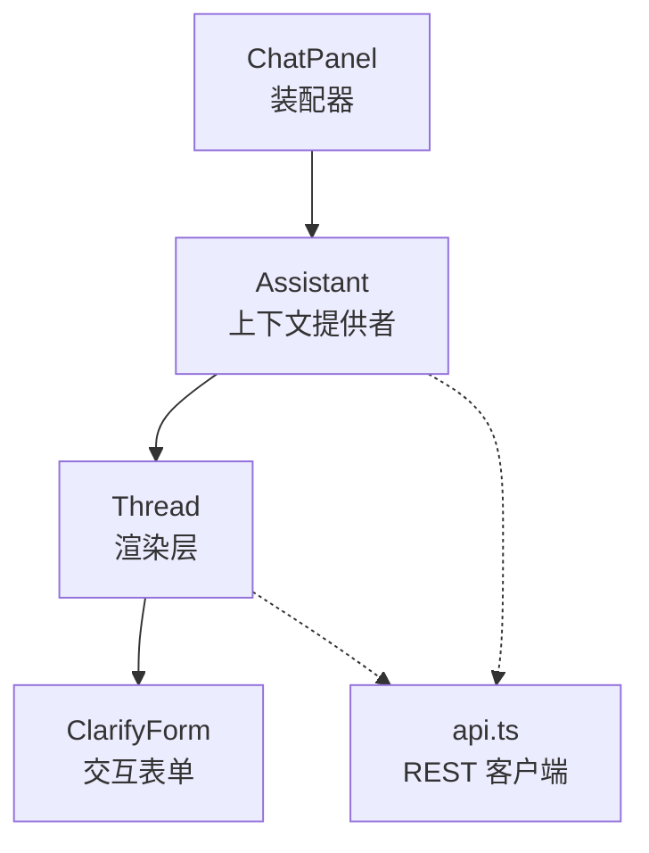
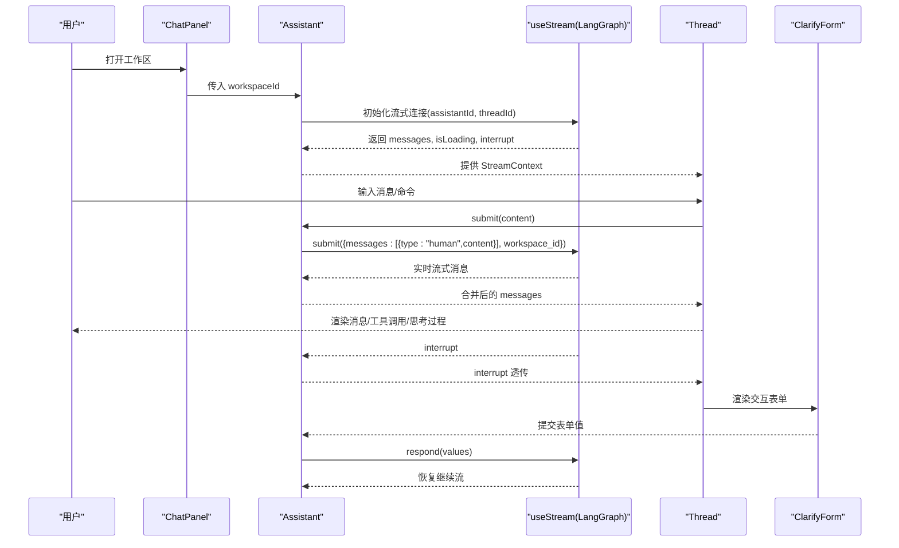
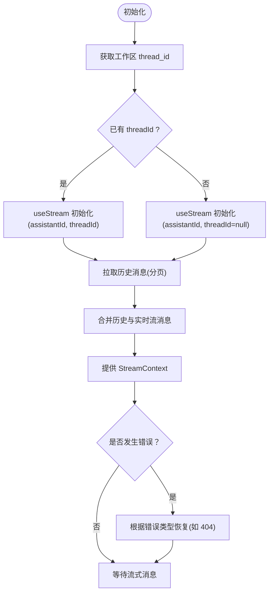
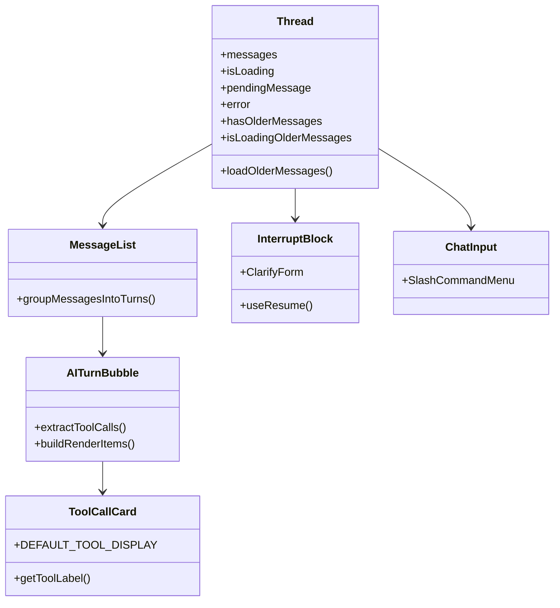
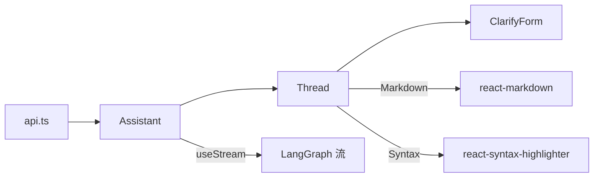

# 聊天组件

<cite>
**本文引用的文件**
- [chat-panel.tsx](file://frontend/src/components/chat/chat-panel.tsx)
- [assistant.tsx](file://frontend/src/components/chat/assistant.tsx)
- [thread.tsx](file://frontend/src/components/chat/thread.tsx)
- [clarify-form.tsx](file://frontend/src/components/chat/clarify-form.tsx)
- [api.ts](file://frontend/src/lib/api.ts)
</cite>

## 目录
1. [简介](#简介)
2. [项目结构](#项目结构)
3. [核心组件](#核心组件)
4. [架构总览](#架构总览)
5. [组件详解](#组件详解)
6. [依赖关系分析](#依赖关系分析)
7. [性能与实时性](#性能与实时性)
8. [故障排查指南](#故障排查指南)
9. [结论](#结论)
10. [附录](#附录)

## 简介
本文件面向 Train Agent 的前端聊天组件模块，系统性梳理“聊天面板（chat-panel）”、“助手（assistant）”、“对话线程（thread）”、“表单（clarify-form）”四个核心组件的架构、数据流、渲染逻辑与交互机制。重点覆盖：
- 消息渲染与“AI Turn”分组策略
- 流式输出与中断恢复（interrupt）机制
- 对话线程状态管理与消息历史维护
- 表单参数收集与意图理解流程
- 组件间通信模式、props 传递策略、事件冒泡与回调处理
- 消息格式规范、错误处理与实时更新实现
- 用户体验优化建议与最佳实践

## 项目结构
聊天组件位于前端目录的 chat 子模块，采用“容器 + 渲染”的分层组织：
- chat-panel.tsx：入口容器，负责装配 Assistant 与 Thread
- assistant.tsx：上下文提供者，封装 LangGraph 流式连接、线程生命周期与消息合并
- thread.tsx：渲染层，负责消息列表、AI Turn 合成、工具调用卡片、中断表单、输入框与滚动加载
- clarify-form.tsx：交互式表单组件，用于收集用户输入以恢复被中断的流程
- api.ts：统一的 REST API 封装，提供工作区与消息列表等接口

图表来源
- [chat-panel.tsx:10-16](file://frontend/src/components/chat/chat-panel.tsx#L10-L16)
- [assistant.tsx:59-254](file://frontend/src/components/chat/assistant.tsx#L59-L254)
- [thread.tsx:150-236](file://frontend/src/components/chat/thread.tsx#L150-L236)
- [clarify-form.tsx:21-106](file://frontend/src/components/chat/clarify-form.tsx#L21-L106)
- [api.ts:15-42](file://frontend/src/lib/api.ts#L15-L42)

章节来源
- [chat-panel.tsx:10-16](file://frontend/src/components/chat/chat-panel.tsx#L10-L16)
- [assistant.tsx:59-254](file://frontend/src/components/chat/assistant.tsx#L59-L254)
- [thread.tsx:150-236](file://frontend/src/components/chat/thread.tsx#L150-L236)
- [clarify-form.tsx:21-106](file://frontend/src/components/chat/clarify-form.tsx#L21-L106)
- [api.ts:15-42](file://frontend/src/lib/api.ts#L15-L42)

## 核心组件
- ChatPanel：接收 workspaceId，将 Assistant 作为父容器，内部嵌套 Thread，形成“上下文提供者 + 渲染容器”的组合。
- Assistant：通过 @langchain/react 的 useStream 建立与 LangGraph 的流式连接，管理 threadId、消息历史与实时流，提供 StreamContext 与 ResumeContext。
- Thread：消费 StreamContext，渲染消息列表、AI Turn 合成、工具调用卡片、中断表单、输入框与滚动加载。
- ClarifyForm：在中断阶段呈现交互式表单，收集用户输入并回传给 Assistant 的 resume 回调。
- api.ts：封装 REST 请求，提供工作区与消息列表接口，统一错误处理。

章节来源
- [chat-panel.tsx:10-16](file://frontend/src/components/chat/chat-panel.tsx#L10-L16)
- [assistant.tsx:59-254](file://frontend/src/components/chat/assistant.tsx#L59-L254)
- [thread.tsx:150-236](file://frontend/src/components/chat/thread.tsx#L150-L236)
- [clarify-form.tsx:21-106](file://frontend/src/components/chat/clarify-form.tsx#L21-L106)
- [api.ts:15-42](file://frontend/src/lib/api.ts#L15-L42)

## 架构总览
整体采用“上下文提供者 + 渲染容器”的模式：
- Assistant 通过 useStream 管理 LangGraph 流式连接，维护 threadId，并将消息、加载状态、中断信息、提交/停止/恢复等能力通过 Context 下发给子组件。
- Thread 仅负责渲染与交互，不直接管理网络或状态，降低复杂度。
- 中断（interrupt）通过 ResumeContext 触发，由 Assistant 的 respond 调用 LangGraph 恢复流程。
- 历史消息通过 listThreadMessages 分页拉取，结合“实时流消息”进行去重合并，保证 UI 一致性。

图表来源
- [assistant.tsx:131-135](file://frontend/src/components/chat/assistant.tsx#L131-L135)
- [assistant.tsx:212-224](file://frontend/src/components/chat/assistant.tsx#L212-L224)
- [assistant.tsx:226-228](file://frontend/src/components/chat/assistant.tsx#L226-L228)
- [thread.tsx:910-958](file://frontend/src/components/chat/thread.tsx#L910-L958)
- [clarify-form.tsx:51-60](file://frontend/src/components/chat/clarify-form.tsx#L51-L60)

## 组件详解

### ChatPanel：装配器
- 责任：接收 workspaceId，将 Assistant 作为父容器，内部嵌套 Thread。
- 设计要点：最小化 props，仅传递 workspaceId，其余状态与行为由 Assistant 内部管理。

章节来源
- [chat-panel.tsx:10-16](file://frontend/src/components/chat/chat-panel.tsx#L10-L16)

### Assistant：上下文提供者与流式连接
- 流式连接：通过 useStream 建立与 LangGraph 的连接，配置 assistantId 与 threadId。
- 线程恢复：当收到 404 或 “Thread not found” 类错误时，自动清空 threadId 并重新建立连接。
- 状态管理：
  - 历史消息：按 MESSAGE_HISTORY_LIMIT 分页拉取，过滤“总结类”消息。
  - 实时流消息：与历史消息去重合并，避免重复渲染。
  - 中断（interrupt）：通过 ResumeContext 传递给子组件，支持用户交互恢复。
  - 提交/停止：封装 submit 与 stop，统一处理 pendingMessage 与 baselineKey。
- 数据转换：toLangGraphMessage 将后端 ThreadMessage 映射为 LangGraph 消息结构，便于统一渲染。
- 线程持久化：首次获得 threadId 后，通过 REST API 更新工作区记录，确保跨会话连续性。

图表来源
- [assistant.tsx:96-129](file://frontend/src/components/chat/assistant.tsx#L96-L129)
- [assistant.tsx:131-135](file://frontend/src/components/chat/assistant.tsx#L131-L135)
- [assistant.tsx:149-164](file://frontend/src/components/chat/assistant.tsx#L149-L164)
- [assistant.tsx:70-93](file://frontend/src/components/chat/assistant.tsx#L70-L93)
- [assistant.tsx:256-267](file://frontend/src/components/chat/assistant.tsx#L256-L267)
- [assistant.tsx:281-291](file://frontend/src/components/chat/assistant.tsx#L281-L291)

章节来源
- [assistant.tsx:59-254](file://frontend/src/components/chat/assistant.tsx#L59-L254)
- [api.ts:68-81](file://frontend/src/lib/api.ts#L68-L81)

### Thread：消息渲染与交互
- 消息分组（AI Turn）：将连续的 AI 与 tool 消息合并为一个“Turn”，提升可读性与一致性。
- 工具调用卡片：解析 tool_calls 与 content 中的 tool_call，匹配 tool 结果，支持展开/折叠与摘要展示。
- 中断表单：当 interrupt 存在时，渲染 ClarifyForm，收集用户输入并通过 ResumeContext 回传给 Assistant。
- 输入框与命令菜单：支持斜杠命令（/ppt 等），自动补全与键盘导航。
- 滚动与历史加载：靠近顶部时自动加载更早的历史消息，保持滚动位置稳定。
- 实时指示器：在流式内容到达前显示打字动画，到达后隐藏。

图表来源
- [thread.tsx:289-302](file://frontend/src/components/chat/thread.tsx#L289-L302)
- [thread.tsx:252-287](file://frontend/src/components/chat/thread.tsx#L252-L287)
- [thread.tsx:314-486](file://frontend/src/components/chat/thread.tsx#L314-L486)
- [thread.tsx:801-870](file://frontend/src/components/chat/thread.tsx#L801-L870)
- [thread.tsx:910-958](file://frontend/src/components/chat/thread.tsx#L910-L958)
- [thread.tsx:1108-1277](file://frontend/src/components/chat/thread.tsx#L1108-L1277)

章节来源
- [thread.tsx:150-236](file://frontend/src/components/chat/thread.tsx#L150-L236)
- [thread.tsx:252-287](file://frontend/src/components/chat/thread.tsx#L252-L287)
- [thread.tsx:314-486](file://frontend/src/components/chat/thread.tsx#L314-L486)
- [thread.tsx:801-870](file://frontend/src/components/chat/thread.tsx#L801-L870)
- [thread.tsx:910-958](file://frontend/src/components/chat/thread.tsx#L910-L958)
- [thread.tsx:1108-1277](file://frontend/src/components/chat/thread.tsx#L1108-L1277)

### ClarifyForm：参数收集与意图理解
- 功能：在中断阶段收集用户输入，支持文本、单选、多选字段，校验必填项。
- 行为：提交后通过 onSubmit 回调返回值；取消时返回取消标记，便于后端识别。
- 与 Thread 的集成：由 Thread 的 InterruptBlock 渲染并注入字段定义，完成后以只读摘要形式展示。

章节来源
- [clarify-form.tsx:21-106](file://frontend/src/components/chat/clarify-form.tsx#L21-L106)
- [thread.tsx:910-958](file://frontend/src/components/chat/thread.tsx#L910-L958)
- [thread.tsx:709-799](file://frontend/src/components/chat/thread.tsx#L709-L799)

## 依赖关系分析
- 组件耦合：
  - ChatPanel 仅依赖 Assistant；Assistant 依赖 useStream 与 api.ts；Thread 依赖 Assistant 的 Context 与 ClarifyForm。
- 外部依赖：
  - @langchain/react 的 useStream：负责与 LangGraph 的流式通信。
  - react-markdown、react-syntax-highlighter：用于 Markdown 渲染与代码高亮。
  - lucide-react：图标库。
- 数据依赖：
  - REST API：工作区与消息列表；LangGraph 流：实时消息与中断。

图表来源
- [assistant.tsx:3-5](file://frontend/src/components/chat/assistant.tsx#L3-L5)
- [thread.tsx:3-23](file://frontend/src/components/chat/thread.tsx#L3-L23)
- [api.ts:15-42](file://frontend/src/lib/api.ts#L15-L42)

章节来源
- [assistant.tsx:3-5](file://frontend/src/components/chat/assistant.tsx#L3-L5)
- [thread.tsx:3-23](file://frontend/src/components/chat/thread.tsx#L3-L23)
- [api.ts:15-42](file://frontend/src/lib/api.ts#L15-L42)

## 性能与实时性
- 分页加载：历史消息按固定数量分页拉取，避免一次性渲染过多节点。
- 去重合并：通过 messageKey 与 baselineKeys 集合，避免重复渲染与闪烁。
- 滚动优化：加载更早消息时保存滚动快照，恢复后保持相对位置稳定。
- 流式渲染：仅在新消息到达时更新，避免不必要的重渲染。
- 中断恢复：本地提交标记避免重复提交导致的协议错误。

章节来源
- [assistant.tsx:70-93](file://frontend/src/components/chat/assistant.tsx#L70-L93)
- [assistant.tsx:182-194](file://frontend/src/components/chat/assistant.tsx#L182-L194)
- [thread.tsx:166-206](file://frontend/src/components/chat/thread.tsx#L166-L206)
- [thread.tsx:910-930](file://frontend/src/components/chat/thread.tsx#L910-L930)

## 故障排查指南
- 流式错误恢复：
  - 当出现 404 或 “Thread not found” 类错误时，自动清空 threadId，重新建立连接。
  - 建议检查 LangGraph 服务连通性与 assistantId 配置。
- 中断恢复失败：
  - 若 resume 失败，控制台会打印错误日志；可尝试重新提交或刷新页面。
- 消息重复或闪烁：
  - 检查 messageKey 与 baselineKeys 是否正确；确认去重逻辑未被外部修改。
- 历史加载异常：
  - 确认 next_cursor 正常；检查分页参数与 API 返回结构。

章节来源
- [assistant.tsx:149-164](file://frontend/src/components/chat/assistant.tsx#L149-L164)
- [thread.tsx:922-930](file://frontend/src/components/chat/thread.tsx#L922-L930)
- [assistant.tsx:269-274](file://frontend/src/components/chat/assistant.tsx#L269-L274)

## 结论
该聊天组件模块通过“上下文提供者 + 渲染容器”的清晰分层，实现了：
- 流式输出与中断恢复的完整闭环
- 消息历史与实时流的去重合并
- 工具调用与思考过程的有序渲染
- 交互式表单与用户意图的无缝衔接
- 良好的性能与用户体验

建议后续可考虑：
- 将 threadId 的持久化从 REST API 迁移到本地存储，进一步提升跨会话连续性
- 增加消息反馈（点赞/点踩）的后端上报与统计
- 优化工具调用卡片的默认展示与细节展开策略

## 附录

### 消息格式规范
- 后端 ThreadMessage 字段映射至 LangGraph 消息结构，包括：
  - id、type、content、tool_calls、tool_call_id、name、additional_kwargs、response_metadata
- additional_kwargs 中的 lc_source 为 "summarization" 的消息会被过滤，避免干扰主对话

章节来源
- [api.ts:85-105](file://frontend/src/lib/api.ts#L85-L105)
- [assistant.tsx:256-267](file://frontend/src/components/chat/assistant.tsx#L256-L267)
- [assistant.tsx:276-279](file://frontend/src/components/chat/assistant.tsx#L276-L279)
- [thread.tsx:83-86](file://frontend/src/components/chat/thread.tsx#L83-L86)

### 组件间通信与事件处理
- Props 传递策略：
  - ChatPanel 仅传递 workspaceId
  - Assistant 通过 Context 提供 messages、isLoading、interrupt、submit、stop、error、loadOlderMessages 等
  - Thread 通过 useStreamContext/useResume 消费上下文
- 事件冒泡与回调：
  - ChatInput 提交消息触发 Assistant.submit
  - ClarifyForm 提交后通过 ResumeContext 回调 Assistant.handleResume
  - Thread 滚动触顶加载触发 Assistant.loadOlderMessages

章节来源
- [chat-panel.tsx:10-16](file://frontend/src/components/chat/chat-panel.tsx#L10-L16)
- [assistant.tsx:234-253](file://frontend/src/components/chat/assistant.tsx#L234-L253)
- [thread.tsx:1108-1277](file://frontend/src/components/chat/thread.tsx#L1108-L1277)
- [thread.tsx:910-958](file://frontend/src/components/chat/thread.tsx#L910-L958)

### 最佳实践与用户体验优化
- 输入体验：斜杠命令自动补全、键盘导航、禁用状态下按钮提示
- 消息展示：AI Turn 合并、工具调用卡片、思考过程折叠/展开
- 滚动体验：加载更多时保持相对位置、底部吸附
- 错误提示：简洁明确的错误文案与日志输出
- 可访问性：键盘可操作、焦点管理、语义化标签

章节来源
- [thread.tsx:1033-1102](file://frontend/src/components/chat/thread.tsx#L1033-L1102)
- [thread.tsx:1108-1277](file://frontend/src/components/chat/thread.tsx#L1108-L1277)
- [thread.tsx:1414-1444](file://frontend/src/components/chat/thread.tsx#L1414-L1444)
- [thread.tsx:166-206](file://frontend/src/components/chat/thread.tsx#L166-L206)