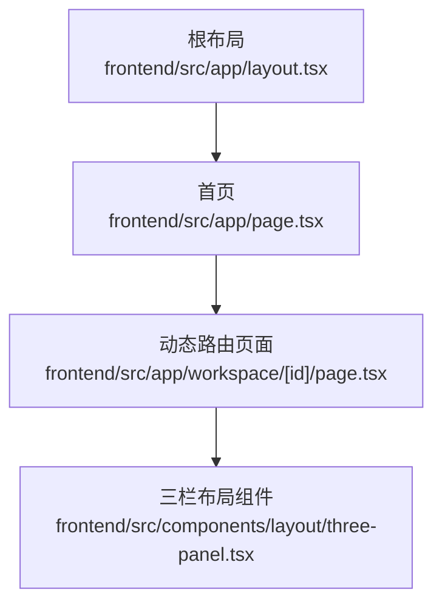
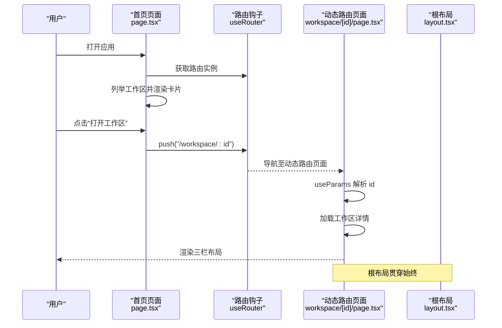
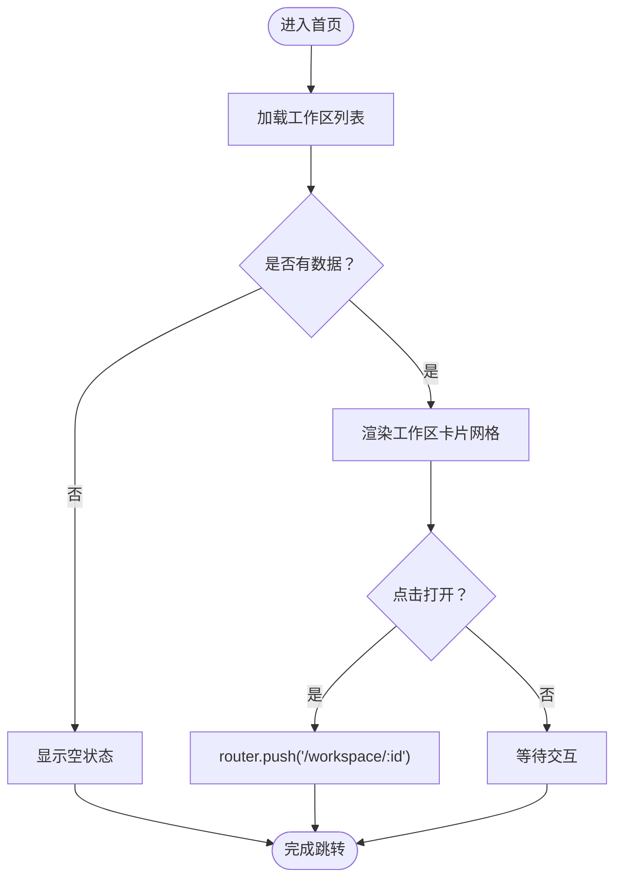
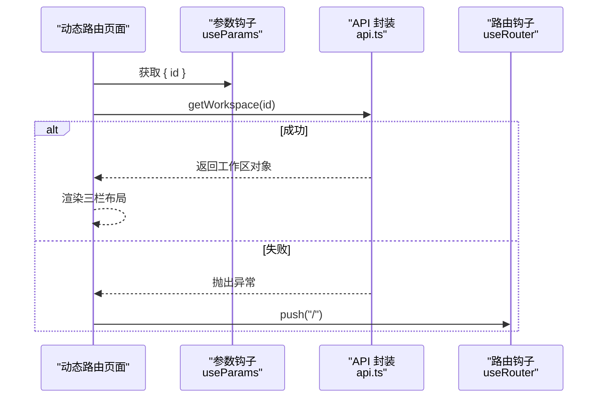
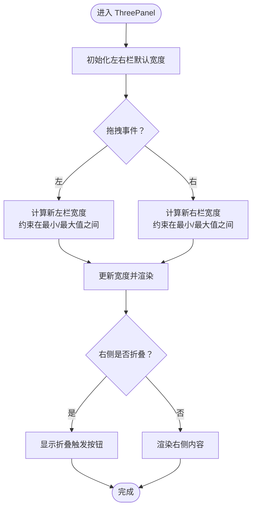
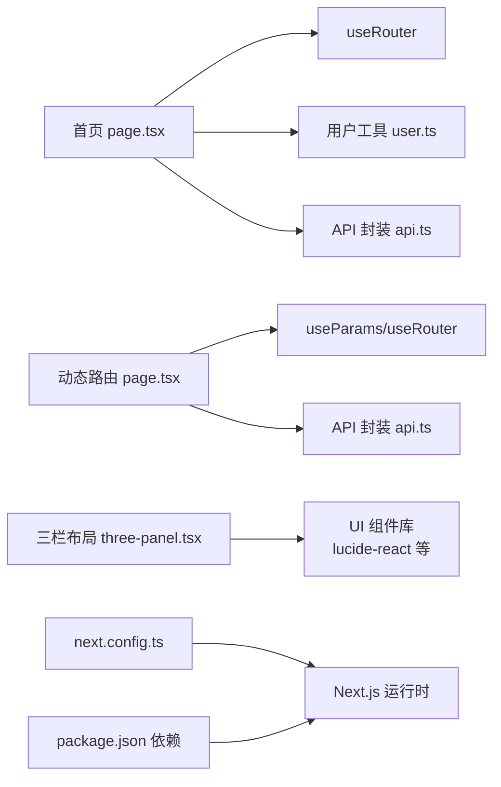

# 路由与导航

<cite>
**本文引用的文件**
- [frontend/src/app/layout.tsx](file://frontend/src/app/layout.tsx)
- [frontend/src/app/page.tsx](file://frontend/src/app/page.tsx)
- [frontend/src/app/workspace/[id]/page.tsx](file://frontend/src/app/workspace/[id]/page.tsx)
- [frontend/src/components/layout/three-panel.tsx](file://frontend/src/components/layout/three-panel.tsx)
- [frontend/src/lib/api.ts](file://frontend/src/lib/api.ts)
- [frontend/src/lib/user.ts](file://frontend/src/lib/user.ts)
- [frontend/next.config.ts](file://frontend/next.config.ts)
- [frontend/package.json](file://frontend/package.json)
</cite>

## 目录
1. [简介](#简介)
2. [项目结构](#项目结构)
3. [核心组件](#核心组件)
4. [架构总览](#架构总览)
5. [详细组件分析](#详细组件分析)
6. [依赖关系分析](#依赖关系分析)
7. [性能考量](#性能考量)
8. [故障排查指南](#故障排查指南)
9. [结论](#结论)
10. [附录](#附录)

## 简介
本文件面向 Train Agent 的前端路由与导航系统，聚焦于 Next.js App Router 的使用、动态路由配置、页面与布局组织、工作区切换与 URL 参数处理、页面状态保持策略、导航组件设计与面包屑思路、路由守卫与权限控制方案、SEO 配置建议，以及用户体验优化实践。内容基于仓库中的实际源码进行梳理与总结。

## 项目结构
前端采用 Next.js App Router 的 App 目录结构，关键入口与页面如下：
- 根布局：定义全局样式与元数据，作为所有页面的根容器
- 首页：展示用户的工作区列表，支持新建、删除与跳转
- 动态路由页面：根据工作区 ID 展示三栏式工作区界面
- 布局组件：三栏面板布局，支持左右侧栏拖拽与折叠

图表来源
- [frontend/src/app/layout.tsx:1-34](file://frontend/src/app/layout.tsx#L1-L34)
- [frontend/src/app/page.tsx:1-121](file://frontend/src/app/page.tsx#L1-L121)
- [frontend/src/app/workspace/[id]/page.tsx:1-65](file://frontend/src/app/workspace/[id]/page.tsx#L1-L65)
- [frontend/src/components/layout/three-panel.tsx:1-132](file://frontend/src/components/layout/three-panel.tsx#L1-L132)

章节来源
- [frontend/src/app/layout.tsx:1-34](file://frontend/src/app/layout.tsx#L1-L34)
- [frontend/src/app/page.tsx:1-121](file://frontend/src/app/page.tsx#L1-L121)
- [frontend/src/app/workspace/[id]/page.tsx:1-65](file://frontend/src/app/workspace/[id]/page.tsx#L1-L65)
- [frontend/src/components/layout/three-panel.tsx:1-132](file://frontend/src/components/layout/three-panel.tsx#L1-L132)

## 核心组件
- 根布局与元数据：统一字体变量注入、全局样式与站点元信息
- 首页与工作区卡片：加载用户工作区列表，支持新建/删除/打开
- 动态路由页面：解析工作区 ID，加载工作区详情，渲染三栏布局
- 三栏布局组件：左侧文档、中央聊天、右侧任务，支持拖拽与折叠
- API 封装与用户标识：统一请求封装、错误类型化、本地用户 ID 管理

章节来源
- [frontend/src/app/layout.tsx:15-33](file://frontend/src/app/layout.tsx#L15-L33)
- [frontend/src/app/page.tsx:17-120](file://frontend/src/app/page.tsx#L17-L120)
- [frontend/src/app/workspace/[id]/page.tsx:12-63](file://frontend/src/app/workspace/[id]/page.tsx#L12-L63)
- [frontend/src/components/layout/three-panel.tsx:18-131](file://frontend/src/components/layout/three-panel.tsx#L18-L131)
- [frontend/src/lib/api.ts:1-42](file://frontend/src/lib/api.ts#L1-L42)
- [frontend/src/lib/user.ts:1-13](file://frontend/src/lib/user.ts#L1-L13)

## 架构总览
Next.js App Router 以“约定式路由 + 动态段”为核心，结合客户端路由钩子与自定义布局，形成从首页到工作区页面的完整导航链路。

图表来源
- [frontend/src/app/page.tsx:17-59](file://frontend/src/app/page.tsx#L17-L59)
- [frontend/src/app/workspace/[id]/page.tsx:12-23](file://frontend/src/app/workspace/[id]/page.tsx#L12-L23)
- [frontend/src/app/layout.tsx:20-33](file://frontend/src/app/layout.tsx#L20-L33)

## 详细组件分析

### 根布局与元数据
- 注入字体变量，设置全局样式类名
- 定义站点标题与描述，便于 SEO
- 作为所有页面的根容器，承载通用结构

章节来源
- [frontend/src/app/layout.tsx:15-33](file://frontend/src/app/layout.tsx#L15-L33)

### 首页与工作区列表
- 使用客户端路由钩子进行页面跳转
- 通过用户标识读取当前用户，拉取其工作区列表
- 支持新建工作区、删除工作区与打开工作区
- 错误处理：捕获并提示特定业务错误（如重名）

图表来源
- [frontend/src/app/page.tsx:23-59](file://frontend/src/app/page.tsx#L23-L59)

章节来源
- [frontend/src/app/page.tsx:17-120](file://frontend/src/app/page.tsx#L17-L120)
- [frontend/src/lib/user.ts:1-13](file://frontend/src/lib/user.ts#L1-L13)

### 动态路由页面（workspace/[id]）
- 使用参数钩子解析动态段 id
- 加载工作区详情；失败时回退到首页
- 渲染工作区头部与三栏布局
- 提供返回首页的导航按钮

图表来源
- [frontend/src/app/workspace/[id]/page.tsx:12-23](file://frontend/src/app/workspace/[id]/page.tsx#L12-L23)
- [frontend/src/lib/api.ts:68-70](file://frontend/src/lib/api.ts#L68-L70)
- [frontend/src/app/workspace/[id]/page.tsx:37-42](file://frontend/src/app/workspace/[id]/page.tsx#L37-L42)

章节来源
- [frontend/src/app/workspace/[id]/page.tsx:12-63](file://frontend/src/app/workspace/[id]/page.tsx#L12-L63)
- [frontend/src/lib/api.ts:64-74](file://frontend/src/lib/api.ts#L64-L74)

### 三栏布局组件（ThreePanel）
- 左/右两侧行为一致：可拖拽调整宽度、支持折叠
- 中央区域自适应剩余空间
- 提供折叠时的触发按钮，便于在窄屏或需要专注场景下释放空间
- 内部通过鼠标事件监听实现拖拽，限制最小/最大宽度

图表来源
- [frontend/src/components/layout/three-panel.tsx:18-131](file://frontend/src/components/layout/three-panel.tsx#L18-L131)

章节来源
- [frontend/src/components/layout/three-panel.tsx:18-131](file://frontend/src/components/layout/three-panel.tsx#L18-L131)

### 导航组件与面包屑思路
- 当前实现：首页到工作区页面的简单两级导航（返回首页按钮 + 页面标题）
- 面包屑建议：可在工作区页面增加面包屑，路径为“首页 > 工作区名称”，点击“首页”回到列表页，点击“工作区名称”回到当前页面（可保留滚动位置与展开状态）

章节来源
- [frontend/src/app/workspace/[id]/page.tsx:36-49](file://frontend/src/app/workspace/[id]/page.tsx#L36-L49)

### 页面状态保持策略
- URL 参数：通过动态路由参数传递工作区 ID，保证刷新后仍能定位到正确工作区
- 组件状态：三栏布局的折叠状态与宽度可通过本地状态维护；若需跨会话持久化，可引入轻量存储（如 localStorage）保存最近一次的布局偏好
- 滚动位置：在路由切换前后记录与恢复滚动位置，提升连续阅读体验

章节来源
- [frontend/src/app/workspace/[id]/page.tsx:12-23](file://frontend/src/app/workspace/[id]/page.tsx#L12-L23)
- [frontend/src/components/layout/three-panel.tsx:18-131](file://frontend/src/components/layout/three-panel.tsx#L18-L131)

### 路由守卫与权限控制
- 当前实现：未见显式的路由守卫或鉴权拦截器
- 建议方案：
  - 在根布局或中间层布局中加入鉴权检查（如校验用户 ID、令牌有效性）
  - 对受保护的动态路由页面进行前置校验，无效则重定向至登录/首页
  - 结合 API 层的权限控制，确保非法访问被拒绝

章节来源
- [frontend/src/lib/user.ts:1-13](file://frontend/src/lib/user.ts#L1-L13)
- [frontend/src/lib/api.ts:15-42](file://frontend/src/lib/api.ts#L15-L42)

### SEO 优化配置
- 元数据：已在根布局中设置标题与描述，建议按页面动态生成更精确的 meta 信息（如工作区页面可将工作区名称作为页面标题的一部分）
- Open Graph/Twitter Cards：可扩展以提升分享效果
- 结构化数据：如需，可在页面中添加结构化数据片段

章节来源
- [frontend/src/app/layout.tsx:15-18](file://frontend/src/app/layout.tsx#L15-L18)

## 依赖关系分析
- 路由与导航：useRouter 用于页面跳转；useParams 用于解析动态段
- 数据访问：统一的 API 封装负责网络请求与错误处理
- 用户标识：本地存储用户 ID，保障匿名用户也能稳定使用
- 构建配置：Next.js 默认配置，无特殊定制项

图表来源
- [frontend/src/app/page.tsx:3-13](file://frontend/src/app/page.tsx#L3-L13)
- [frontend/src/app/workspace/[id]/page.tsx:3-10](file://frontend/src/app/workspace/[id]/page.tsx#L3-L10)
- [frontend/src/lib/user.ts:1-13](file://frontend/src/lib/user.ts#L1-L13)
- [frontend/src/lib/api.ts:1-42](file://frontend/src/lib/api.ts#L1-L42)
- [frontend/src/components/layout/three-panel.tsx:1-132](file://frontend/src/components/layout/three-panel.tsx#L1-L132)
- [frontend/next.config.ts:1-8](file://frontend/next.config.ts#L1-L8)
- [frontend/package.json:11-26](file://frontend/package.json#L11-L26)

章节来源
- [frontend/src/app/page.tsx:3-13](file://frontend/src/app/page.tsx#L3-L13)
- [frontend/src/app/workspace/[id]/page.tsx:3-10](file://frontend/src/app/workspace/[id]/page.tsx#L3-L10)
- [frontend/src/lib/user.ts:1-13](file://frontend/src/lib/user.ts#L1-L13)
- [frontend/src/lib/api.ts:1-42](file://frontend/src/lib/api.ts#L1-L42)
- [frontend/src/components/layout/three-panel.tsx:1-132](file://frontend/src/components/layout/three-panel.tsx#L1-L132)
- [frontend/next.config.ts:1-8](file://frontend/next.config.ts#L1-L8)
- [frontend/package.json:11-26](file://frontend/package.json#L11-L26)

## 性能考量
- 路由切换：使用客户端路由避免整页刷新，提升交互流畅度
- 组件渲染：三栏布局按需渲染，折叠时移除 DOM，减少重绘
- 请求缓存：可在 API 层引入缓存策略（如针对工作区详情的短期缓存）
- 图片与资源：按需加载与懒加载，避免阻塞首屏

## 故障排查指南
- 工作区加载失败：检查 API 基础地址与网络连通性；确认用户 ID 是否正确写入本地存储
- 动态路由 404 或空白：确认 URL 中的 ID 是否有效；检查服务端接口是否返回对应工作区
- 导航异常：确认 useRouter 实例是否在客户端组件中使用；避免在服务端上下文中调用

章节来源
- [frontend/src/lib/api.ts:15-42](file://frontend/src/lib/api.ts#L15-L42)
- [frontend/src/lib/user.ts:1-13](file://frontend/src/lib/user.ts#L1-L13)
- [frontend/src/app/workspace/[id]/page.tsx:19-23](file://frontend/src/app/workspace/[id]/page.tsx#L19-L23)

## 结论
本路由与导航体系以 App Router 为基础，通过动态路由与客户端路由钩子实现了从首页到工作区页面的顺畅流转；配合三栏布局组件提供了良好的多面板协作体验。建议后续补充路由守卫、权限控制与更精细的 SEO 配置，以进一步提升安全性与可发现性。

## 附录
- 路由配置示例（概念说明）
  - 动态路由：在 App 目录下创建 workspace/[id]/page.tsx 即可启用 /workspace/:id
  - 页面跳转：在客户端组件中使用 useRouter().push(...) 进行编程式导航
- 导航状态管理建议
  - 使用本地状态管理布局偏好（折叠/宽度）
  - 可选地引入轻量状态库（如 zustand）集中管理跨页面状态
- 用户体验优化
  - 首屏加载占位与骨架屏
  - 拖拽过程中的视觉反馈与禁用文本选择
  - 错误提示与重试机制