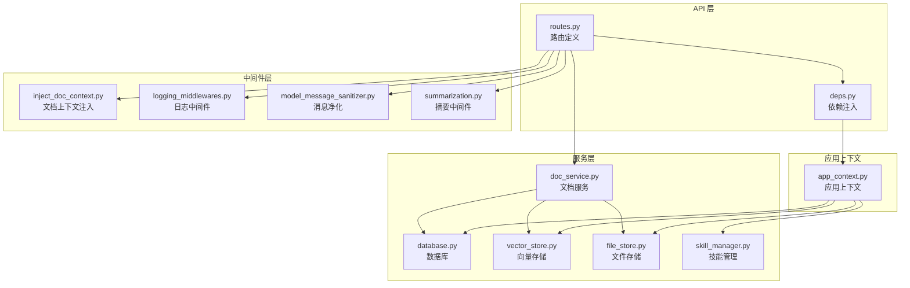
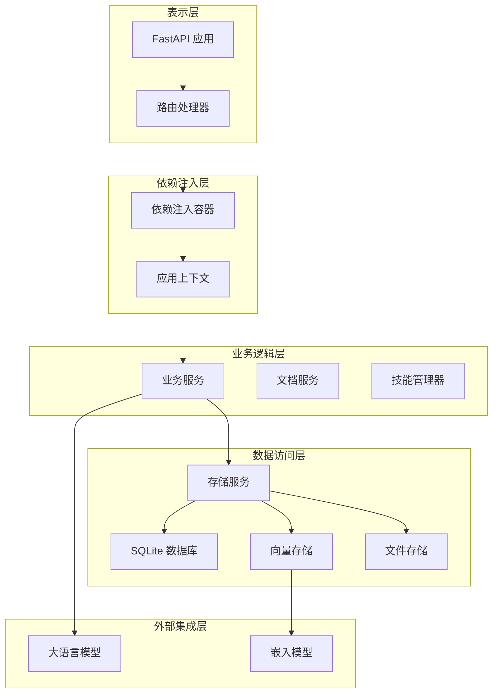
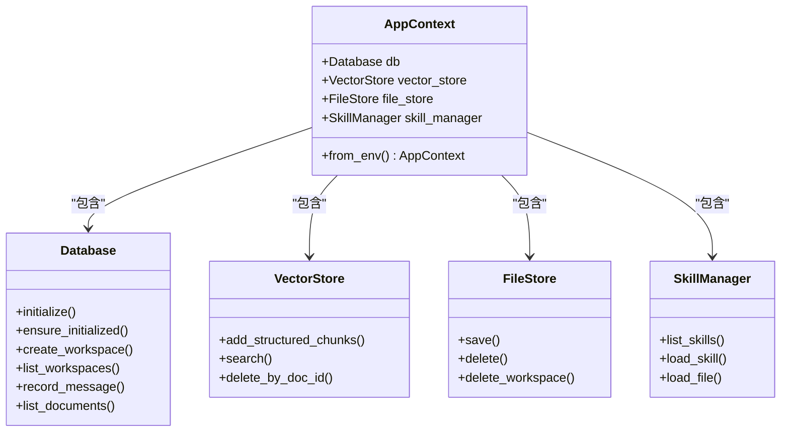
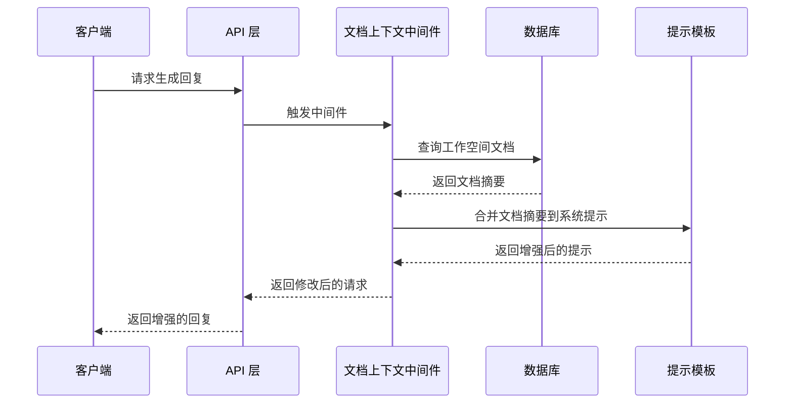
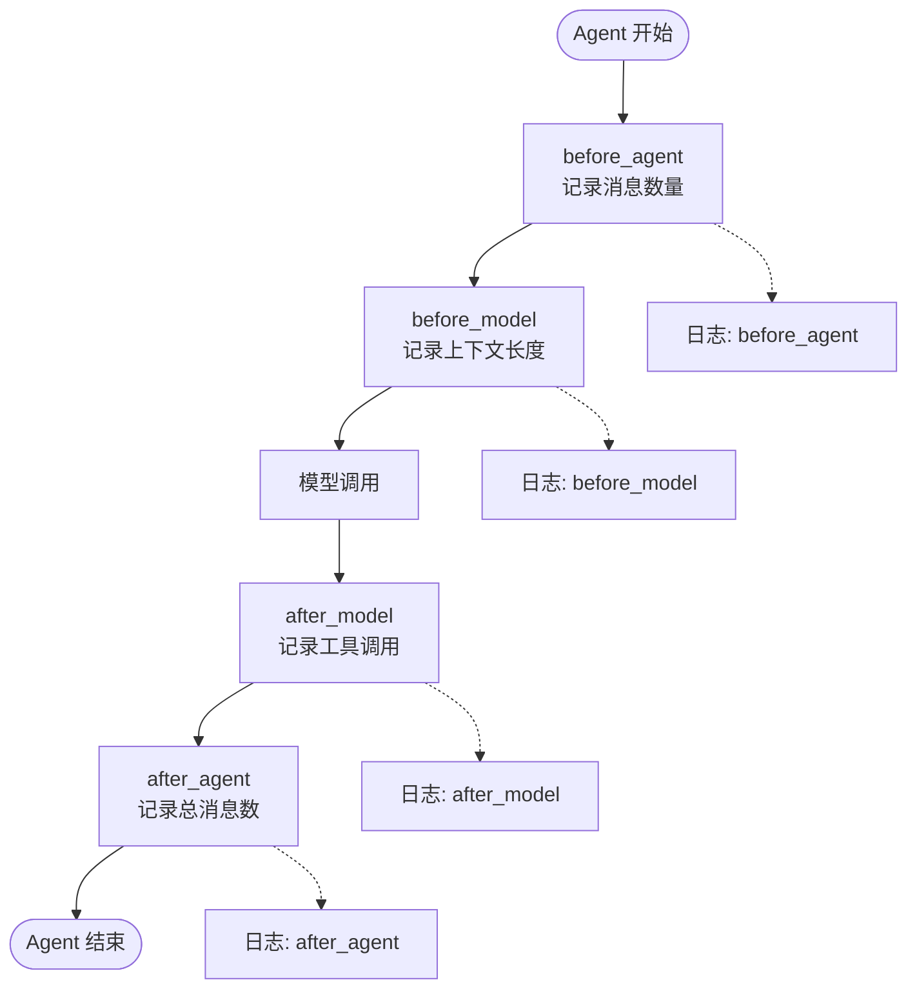
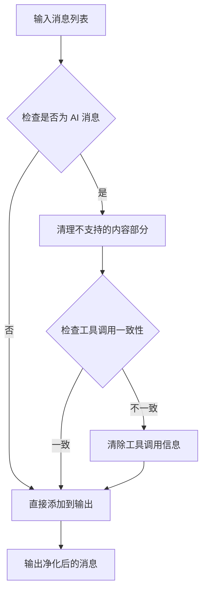
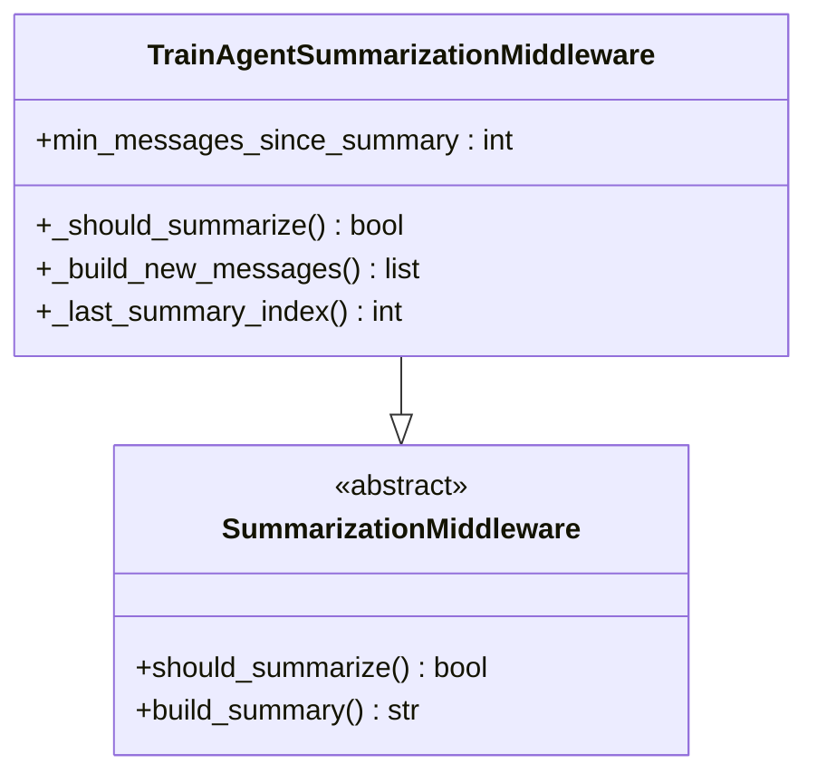
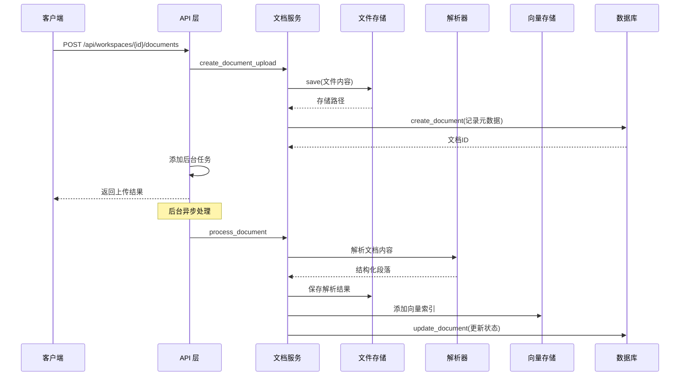
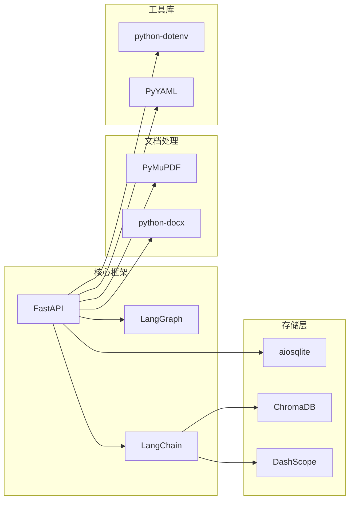
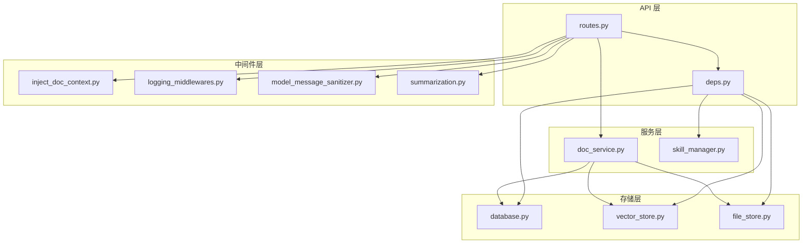

# API 层设计

<cite>
**本文档引用的文件**
- [routes.py](file://backend/src/api/routes.py)
- [deps.py](file://backend/src/api/deps.py)
- [inject_doc_context.py](file://backend/src/middlewares/inject_doc_context.py)
- [logging_middlewares.py](file://backend/src/middlewares/logging_middlewares.py)
- [model_message_sanitizer.py](file://backend/src/middlewares/model_message_sanitizer.py)
- [summarization.py](file://backend/src/middlewares/summarization.py)
- [database.py](file://backend/src/storage/database.py)
- [doc_service.py](file://backend/src/services/doc_service.py)
- [app_context.py](file://backend/src/app_context.py)
- [vector_store.py](file://backend/src/storage/vector_store.py)
- [file_store.py](file://backend/src/storage/file_store.py)
- [skill_manager.py](file://backend/src/agent/skill_manager.py)
- [pyproject.toml](file://backend/pyproject.toml)
</cite>

## 目录
1. [简介](#简介)
2. [项目结构](#项目结构)
3. [核心组件](#核心组件)
4. [架构概览](#架构概览)
5. [详细组件分析](#详细组件分析)
6. [依赖关系分析](#依赖关系分析)
7. [性能考虑](#性能考虑)
8. [故障排除指南](#故障排除指南)
9. [结论](#结论)

## 简介

Train Agent API 层是一个基于 FastAPI 构建的 RESTful Web 服务，为训练领域智能体提供完整的 API 接口。该 API 层采用现代化的依赖注入模式，集成了文档处理、向量检索、文件存储等功能模块，并通过中间件系统实现了强大的功能扩展能力。

本 API 层支持多模态文档处理（PDF、DOCX、Markdown），提供 RAG 检索增强生成，支持技能管理，具备完善的错误处理和日志记录机制。所有接口都遵循 RESTful 设计原则，使用标准的 HTTP 方法和状态码。

## 项目结构

API 层位于 `backend/src/api/` 目录下，主要包含以下关键组件：



**图表来源**
- [routes.py:1-189](file://backend/src/api/routes.py#L1-L189)
- [deps.py:1-30](file://backend/src/api/deps.py#L1-L30)
- [app_context.py:1-31](file://backend/src/app_context.py#L1-L31)

**章节来源**
- [routes.py:1-189](file://backend/src/api/routes.py#L1-L189)
- [deps.py:1-30](file://backend/src/api/deps.py#L1-L30)
- [app_context.py:1-31](file://backend/src/app_context.py#L1-L31)

## 核心组件

### RESTful API 接口设计

API 层严格遵循 RESTful 架构风格，采用资源导向的 URL 设计模式：

#### 工作空间管理接口
- `POST /api/workspaces` - 创建新工作空间
- `GET /api/workspaces` - 列出用户的所有工作空间
- `GET /api/workspaces/{workspace_id}` - 获取特定工作空间详情
- `PATCH /api/workspaces/{workspace_id}/thread` - 更新工作空间关联的线程
- `DELETE /api/workspaces/{workspace_id}` - 删除工作空间及其所有数据

#### 文档管理接口
- `POST /api/workspaces/{workspace_id}/documents` - 上传文档（支持 PDF、DOCX、Markdown）
- `GET /api/workspaces/{workspace_id}/documents` - 列出工作空间内的所有文档
- `DELETE /api/workspaces/{workspace_id}/documents/{doc_id}` - 删除指定文档

#### 任务管理接口
- `GET /api/workspaces/{workspace_id}/tasks` - 列出工作空间内的所有任务
- `DELETE /api/workspaces/{workspace_id}/tasks/{task_id}` - 删除指定任务

#### 文件下载接口
- `GET /api/files/{file_path:path}` - 下载文件（支持输出文件和原始文档）

#### 静态资源接口
- `GET /ppt-assets/*` - PPT 技能静态资源
- `GET /ppt-templates/*` - PPT 模板资源

**章节来源**
- [routes.py:37-189](file://backend/src/api/routes.py#L37-L189)

### HTTP 方法使用规范

API 层严格遵循 HTTP 方法语义：
- **GET** - 获取资源或查询数据
- **POST** - 创建新资源或触发处理流程
- **PATCH** - 部分更新资源属性
- **DELETE** - 删除资源

### 状态码标准

API 层采用标准 HTTP 状态码：
- **200 OK** - 请求成功
- **201 Created** - 资源创建成功
- **204 No Content** - 成功但无返回内容
- **400 Bad Request** - 请求参数无效
- **404 Not Found** - 资源不存在
- **409 Conflict** - 资源冲突（如重复的工作空间名称）
- **500 Internal Server Error** - 服务器内部错误

**章节来源**
- [routes.py:45-106](file://backend/src/api/routes.py#L45-L106)

## 架构概览

API 层采用分层架构设计，各层职责清晰分离：



**图表来源**
- [routes.py:10-27](file://backend/src/api/routes.py#L10-L27)
- [deps.py:13-29](file://backend/src/api/deps.py#L13-L29)
- [app_context.py:12-30](file://backend/src/app_context.py#L12-L30)

## 详细组件分析

### 依赖注入机制

API 层采用集中式依赖注入模式，通过 `AppContext` 统一管理所有服务依赖：

#### AppContext 设计模式



**图表来源**
- [app_context.py:12-30](file://backend/src/app_context.py#L12-L30)
- [database.py:9-379](file://backend/src/storage/database.py#L9-L379)
- [vector_store.py:39-177](file://backend/src/storage/vector_store.py#L39-L177)
- [file_store.py:6-39](file://backend/src/storage/file_store.py#L6-L39)
- [skill_manager.py:14-117](file://backend/src/agent/skill_manager.py#L14-L117)

#### 依赖注入配置

依赖注入通过 `deps.py` 实现，提供以下核心依赖：

- **数据库连接** (`Database`) - 使用 SQLite 异步连接
- **向量存储** (`VectorStore`) - 基于 ChromaDB 的持久化向量存储
- **文件存储** (`FileStore`) - 本地文件系统存储
- **技能管理器** (`SkillManager`) - 动态加载技能定义
- **LLM 客户端** (`ChatOpenAI`) - 可配置的大语言模型客户端

**章节来源**
- [deps.py:1-30](file://backend/src/api/deps.py#L1-L30)
- [app_context.py:19-30](file://backend/src/app_context.py#L19-L30)

### 中间件系统架构

API 层实现了四个关键中间件，每个中间件都有特定的功能职责：

#### 文档上下文注入中间件

该中间件动态为系统提示注入当前工作空间的文档摘要信息：



**图表来源**
- [inject_doc_context.py:11-40](file://backend/src/middlewares/inject_doc_context.py#L11-L40)
- [database.py:313-319](file://backend/src/storage/database.py#L313-L319)

#### 日志记录中间件

提供完整的 Agent 生命周期日志记录：



**图表来源**
- [logging_middlewares.py:15-59](file://backend/src/middlewares/logging_middlewares.py#L15-L59)

#### 模型消息净化中间件

专门处理与兼容性相关的消息净化问题：



**图表来源**
- [model_message_sanitizer.py:62-122](file://backend/src/middlewares/model_message_sanitizer.py#L62-L122)

#### 摘要中间件

实现智能对话摘要功能：



**图表来源**
- [summarization.py:7-58](file://backend/src/middlewares/summarization.py#L7-L58)

**章节来源**
- [inject_doc_context.py:1-41](file://backend/src/middlewares/inject_doc_context.py#L1-L41)
- [logging_middlewares.py:1-59](file://backend/src/middlewares/logging_middlewares.py#L1-L59)
- [model_message_sanitizer.py:1-122](file://backend/src/middlewares/model_message_sanitizer.py#L1-L122)
- [summarization.py:1-58](file://backend/src/middlewares/summarization.py#L1-L58)

### API 接口详细说明

#### 工作空间管理接口

##### 创建工作空间
- **URL**: `POST /api/workspaces`
- **请求体**:
  ```json
  {
    "user_id": "string",
    "name": "string"
  }
  ```
- **响应**:
  ```json
  {
    "id": "string",
    "user_id": "string",
    "name": "string"
  }
  ```
- **错误处理**: 409 冲突（工作空间名称已存在）

##### 列出工作空间
- **URL**: `GET /api/workspaces?user_id={user_id}`
- **响应**: 工作空间数组
- **错误处理**: 无

##### 获取工作空间详情
- **URL**: `GET /api/workspaces/{workspace_id}`
- **响应**: 工作空间对象
- **错误处理**: 404 未找到

##### 更新工作空间线程
- **URL**: `PATCH /api/workspaces/{workspace_id}/thread`
- **请求体**:
  ```json
  {
    "thread_id": "string"
  }
  ```
- **响应**: `{ "ok": true }`

##### 删除工作空间
- **URL**: `DELETE /api/workspaces/{workspace_id}`
- **响应**: `{ "ok": true }`
- **副作用**: 删除关联的所有文档、向量索引和文件

**章节来源**
- [routes.py:45-106](file://backend/src/api/routes.py#L45-L106)

#### 文档管理接口

##### 上传文档
- **URL**: `POST /api/workspaces/{workspace_id}/documents`
- **请求**: multipart/form-data，包含 `file` 字段
- **响应**:
  ```json
  {
    "id": "string",
    "workspace_id": "string",
    "filename": "string",
    "file_type": "string",
    "storage_path": "string",
    "status": "string",
    "error_message": "string"
  }
  ```
- **异步处理**: 文档上传后立即返回，后台异步处理

##### 列出文档
- **URL**: `GET /api/workspaces/{workspace_id}/documents`
- **响应**: 文档数组

##### 删除文档
- **URL**: `DELETE /api/workspaces/{workspace_id}/documents/{doc_id}`
- **响应**: `{ "ok": true }`

**章节来源**
- [routes.py:112-141](file://backend/src/api/routes.py#L112-L141)

#### 任务管理接口

##### 列出任务
- **URL**: `GET /api/workspaces/{workspace_id}/tasks`
- **响应**: 任务数组

##### 删除任务
- **URL**: `DELETE /api/workspaces/{workspace_id}/tasks/{task_id}`
- **响应**: `{ "ok": true }`

**章节来源**
- [routes.py:147-157](file://backend/src/api/routes.py#L147-L157)

#### 文件下载接口

##### 下载文件
- **URL**: `GET /api/files/{file_path:path}`
- **响应**: 文件流
- **错误处理**: 404 未找到

**章节来源**
- [routes.py:163-174](file://backend/src/api/routes.py#L163-L174)

### 数据流处理

文档上传处理流程展示了完整的数据处理管道：



**图表来源**
- [routes.py:112-128](file://backend/src/api/routes.py#L112-L128)
- [doc_service.py:35-130](file://backend/src/services/doc_service.py#L35-L130)

**章节来源**
- [doc_service.py:13-218](file://backend/src/services/doc_service.py#L13-L218)

## 依赖关系分析

### 外部依赖

API 层依赖以下关键外部库：



**图表来源**
- [pyproject.toml:6-26](file://backend/pyproject.toml#L6-L26)

### 内部依赖关系



**图表来源**
- [routes.py:10-29](file://backend/src/api/routes.py#L10-L29)
- [deps.py:13-29](file://backend/src/api/deps.py#L13-L29)

**章节来源**
- [pyproject.toml:1-41](file://backend/pyproject.toml#L1-L41)

## 性能考虑

### 异步处理优化

API 层广泛采用异步编程模式：
- **数据库操作**: 使用 `aiosqlite` 实现异步 SQLite 访问
- **文件操作**: 提供异步版本的文件写入操作
- **后台任务**: 文档处理通过后台任务队列异步执行

### 缓存策略

- **数据库连接池**: 自动管理数据库连接生命周期
- **向量存储缓存**: ChromaDB 提供内存缓存机制
- **文件系统缓存**: 本地文件系统提供基础缓存

### 扩展性设计

- **插件化架构**: 技能管理器支持动态加载新技能
- **可配置性**: 通过环境变量配置各种服务参数
- **水平扩展**: 各服务组件相对独立，便于分布式部署

## 故障排除指南

### 常见错误处理

#### 数据库连接问题
- **症状**: 500 服务器错误，数据库操作失败
- **解决方案**: 检查 `DATA_DIR` 环境变量，确保数据目录可写

#### 向量存储初始化失败
- **症状**: 向量搜索返回空结果
- **解决方案**: 检查 ChromaDB 配置和磁盘空间

#### 文件存储权限问题
- **症状**: 文档上传失败，文件无法保存
- **解决方案**: 检查文件存储目录权限

#### LLM API 集成问题
- **症状**: 摘要生成功能异常
- **解决方案**: 验证 LLM API 密钥和配置

**章节来源**
- [database.py:14-23](file://backend/src/storage/database.py#L14-L23)
- [vector_store.py:40-49](file://backend/src/storage/vector_store.py#L40-L49)
- [file_store.py:11-16](file://backend/src/storage/file_store.py#L11-L16)

### 调试技巧

1. **启用详细日志**: 设置 `LOG_LEVEL=DEBUG` 环境变量
2. **监控数据库**: 使用 SQLite 工具查看数据库状态
3. **验证向量索引**: 检查 ChromaDB 集合是否存在
4. **测试文件权限**: 验证文件存储目录的读写权限

## 结论

Train Agent API 层设计体现了现代 Web 服务的最佳实践，具有以下特点：

1. **清晰的架构分层**: 从 API 层到存储层的职责分离
2. **强大的依赖注入**: 统一的依赖管理机制
3. **灵活的中间件系统**: 可扩展的功能增强机制
4. **完善的错误处理**: 标准化的错误响应和恢复策略
5. **高性能设计**: 异步处理和缓存优化

该 API 层为 Train Agent 提供了稳定可靠的服务基础，支持文档处理、RAG 检索、技能管理等核心功能，为后续的功能扩展奠定了良好的技术基础。