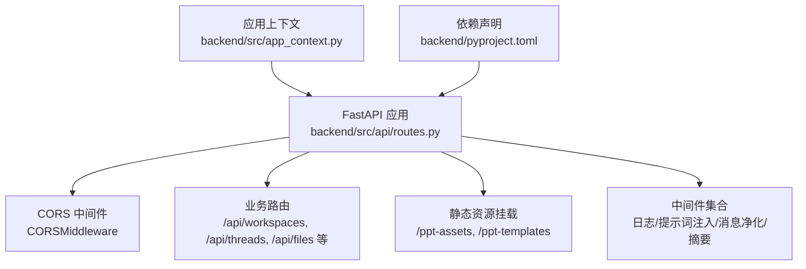
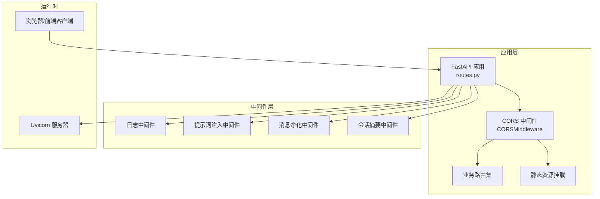
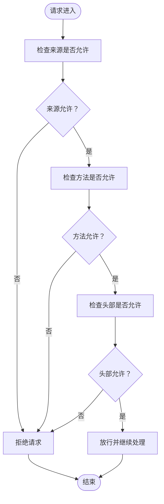
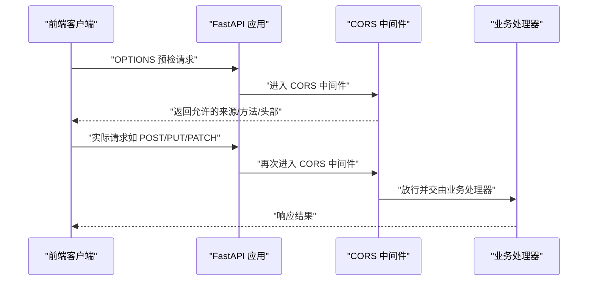
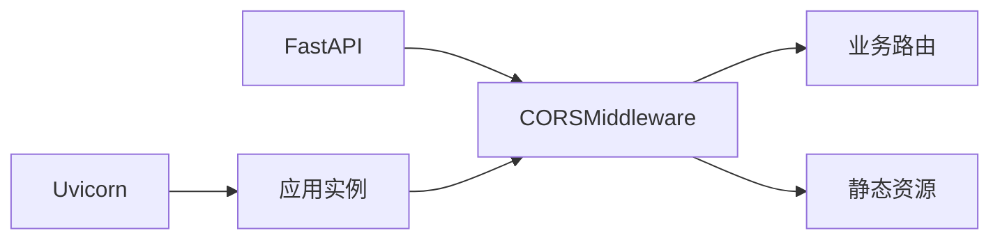

# CORS 配置

<cite>
**本文引用的文件**
- [backend/src/api/routes.py](file://backend/src/api/routes.py)
- [backend/src/middlewares/logging_middlewares.py](file://backend/src/middlewares/logging_middlewares.py)
- [backend/src/middlewares/inject_doc_context.py](file://backend/src/middlewares/inject_doc_context.py)
- [backend/src/middlewares/model_message_sanitizer.py](file://backend/src/middlewares/model_message_sanitizer.py)
- [backend/src/middlewares/summarization.py](file://backend/src/middlewares/summarization.py)
- [backend/src/app_context.py](file://backend/src/app_context.py)
- [backend/pyproject.toml](file://backend/pyproject.toml)
</cite>

## 目录
1. [简介](#简介)
2. [项目结构](#项目结构)
3. [核心组件](#核心组件)
4. [架构总览](#架构总览)
5. [详细组件分析](#详细组件分析)
6. [依赖分析](#依赖分析)
7. [性能考量](#性能考量)
8. [故障排查指南](#故障排查指南)
9. [结论](#结论)
10. [附录](#附录)

## 简介
本文件聚焦 Train Agent 后端的 CORS（跨域资源共享）配置中间件，系统性阐述其在 API 服务中的作用、配置要点与最佳实践。CORS 是浏览器安全策略的一部分，用于控制来自不同源（协议、域名、端口）的资源访问权限。在前端与后端分离部署时，CORS 配置尤为关键：它既要保障前端应用能够顺利调用后端接口，又要避免引入不必要的安全风险。

在当前项目中，CORS 中间件通过 FastAPI 的 CORSMiddleware 实现，并在应用启动时统一注册。该中间件对“允许的来源”“允许的方法”“允许的头部”等进行了集中配置，从而为所有路由提供一致的跨域行为。

## 项目结构
后端采用 FastAPI 应用入口集中注册中间件的模式。CORS 中间件在应用对象创建后立即添加，确保后续所有路由均受其约束。相关文件组织如下：
- 应用入口与中间件注册：backend/src/api/routes.py
- 其他中间件（日志、提示词注入、消息净化、会话摘要）：backend/src/middlewares/*.py
- 应用上下文与依赖装配：backend/src/app_context.py
- 依赖声明与运行时框架：backend/pyproject.toml

图表来源
- [backend/src/api/routes.py:21-27](file://backend/src/api/routes.py#L21-L27)
- [backend/src/api/routes.py:179-189](file://backend/src/api/routes.py#L179-L189)
- [backend/src/middlewares/logging_middlewares.py:1-59](file://backend/src/middlewares/logging_middlewares.py#L1-L59)
- [backend/src/middlewares/inject_doc_context.py:1-41](file://backend/src/middlewares/inject_doc_context.py#L1-L41)
- [backend/src/middlewares/model_message_sanitizer.py:1-122](file://backend/src/middlewares/model_message_sanitizer.py#L1-L122)
- [backend/src/middlewares/summarization.py:1-58](file://backend/src/middlewares/summarization.py#L1-L58)
- [backend/src/app_context.py:12-31](file://backend/src/app_context.py#L12-L31)
- [backend/pyproject.toml:15-16](file://backend/pyproject.toml#L15-L16)

章节来源
- [backend/src/api/routes.py:21-27](file://backend/src/api/routes.py#L21-L27)
- [backend/src/api/routes.py:179-189](file://backend/src/api/routes.py#L179-L189)
- [backend/src/app_context.py:12-31](file://backend/src/app_context.py#L12-L31)
- [backend/pyproject.toml:15-16](file://backend/pyproject.toml#L15-L16)

## 核心组件
- CORS 中间件（CORSMiddleware）
  - 注册位置：应用创建后立即注册
  - 关键配置项：
    - 允许来源：["*"]（通配符）
    - 允许方法：["*"]（通配符）
    - 允许头部：["*"]（通配符）
  - 影响范围：全局生效于所有路由与静态资源挂载点

- 业务路由
  - 工作区管理：POST/GET/DELETE /api/workspaces
  - 会话消息查询：GET /api/threads/{thread_id}/messages
  - 文档上传/列表/删除：POST/GET/DELETE /api/workspaces/{workspace_id}/documents
  - 任务查询/删除：GET/DELETE /api/workspaces/{workspace_id}/tasks
  - 文件下载：GET /api/files/{file_path:path}
  - 静态资源挂载：/ppt-assets、/ppt-templates

- 其他中间件（与 CORS 并行）
  - 日志中间件：记录 Agent/模型调用前后状态
  - 提示词注入中间件：动态注入文档上下文
  - 消息净化中间件：清理不被兼容的工具调用片段
  - 会话摘要中间件：按阈值进行对话摘要，减少上下文长度

章节来源
- [backend/src/api/routes.py:21-27](file://backend/src/api/routes.py#L21-L27)
- [backend/src/api/routes.py:45-157](file://backend/src/api/routes.py#L45-L157)
- [backend/src/api/routes.py:163-174](file://backend/src/api/routes.py#L163-L174)
- [backend/src/api/routes.py:179-189](file://backend/src/api/routes.py#L179-L189)
- [backend/src/middlewares/logging_middlewares.py:15-59](file://backend/src/middlewares/logging_middlewares.py#L15-L59)
- [backend/src/middlewares/inject_doc_context.py:11-41](file://backend/src/middlewares/inject_doc_context.py#L11-L41)
- [backend/src/middlewares/model_message_sanitizer.py:105-122](file://backend/src/middlewares/model_message_sanitizer.py#L105-L122)
- [backend/src/middlewares/summarization.py:7-58](file://backend/src/middlewares/summarization.py#L7-L58)

## 架构总览
下图展示了 CORS 在应用生命周期中的位置与影响范围，以及与其他中间件的关系：

图表来源
- [backend/src/api/routes.py:21-27](file://backend/src/api/routes.py#L21-L27)
- [backend/src/api/routes.py:45-157](file://backend/src/api/routes.py#L45-L157)
- [backend/src/api/routes.py:179-189](file://backend/src/api/routes.py#L179-L189)
- [backend/src/middlewares/logging_middlewares.py:15-59](file://backend/src/middlewares/logging_middlewares.py#L15-L59)
- [backend/src/middlewares/inject_doc_context.py:11-41](file://backend/src/middlewares/inject_doc_context.py#L11-L41)
- [backend/src/middlewares/model_message_sanitizer.py:105-122](file://backend/src/middlewares/model_message_sanitizer.py#L105-L122)
- [backend/src/middlewares/summarization.py:7-58](file://backend/src/middlewares/summarization.py#L7-L58)
- [backend/pyproject.toml:15-16](file://backend/pyproject.toml#L15-L16)

## 详细组件分析

### CORS 中间件配置与行为
- 配置方式
  - 在应用创建后，通过 add_middleware 注册 CORSMiddleware
  - 允许来源、方法、头部均采用通配符配置
- 行为特征
  - 对所有路由与静态资源挂载点生效
  - 自动处理预检请求（OPTIONS），无需额外手工处理
- 安全性评估
  - 通配符配置在开发阶段便于调试，但在生产环境存在潜在风险
  - 建议在生产环境限定具体来源与敏感头部

图表来源
- [backend/src/api/routes.py:21-27](file://backend/src/api/routes.py#L21-L27)

章节来源
- [backend/src/api/routes.py:21-27](file://backend/src/api/routes.py#L21-L27)

### 预检请求（OPTIONS）处理机制
- 触发条件
  - 浏览器在发送复杂请求（如自定义头部、非简单方法）前，会先发送 OPTIONS 预检请求
- 处理流程
  - CORS 中间件自动拦截 OPTIONS 请求
  - 根据已配置的允许来源、方法、头部生成响应头
  - 返回 2xx 状态码，使后续实际请求得以继续
- 注意事项
  - 若前端自定义了 Authorization 或其他敏感头部，需在允许头部中显式声明
  - 若使用自定义方法（如 PATCH/DELETE），需在允许方法中明确列出

图表来源
- [backend/src/api/routes.py:21-27](file://backend/src/api/routes.py#L21-L27)

章节来源
- [backend/src/api/routes.py:21-27](file://backend/src/api/routes.py#L21-L27)

### 与静态资源挂载的协同
- 静态资源挂载点：/ppt-assets、/ppt-templates
- 协同规则
  - CORS 中间件对静态资源挂载路径同样生效
  - 若前端从这些路径加载资源，仍需满足 CORS 来源与头部要求
- 建议
  - 如静态资源与 API 同源，可减少跨域交互
  - 如必须跨域，建议在生产环境限制来源与头部

章节来源
- [backend/src/api/routes.py:179-189](file://backend/src/api/routes.py#L179-L189)

### 与其他中间件的协作关系
- 日志中间件
  - 记录 Agent/模型调用前后状态，便于定位跨域问题引发的异常
- 提示词注入中间件
  - 动态注入文档上下文，不影响 CORS 行为
- 消息净化中间件
  - 清理不被兼容的工具调用片段，不影响 CORS 行为
- 会话摘要中间件
  - 按阈值进行对话摘要，不影响 CORS 行为

章节来源
- [backend/src/middlewares/logging_middlewares.py:15-59](file://backend/src/middlewares/logging_middlewares.py#L15-L59)
- [backend/src/middlewares/inject_doc_context.py:11-41](file://backend/src/middlewares/inject_doc_context.py#L11-L41)
- [backend/src/middlewares/model_message_sanitizer.py:105-122](file://backend/src/middlewares/model_message_sanitizer.py#L105-L122)
- [backend/src/middlewares/summarization.py:7-58](file://backend/src/middlewares/summarization.py#L7-L58)

## 依赖分析
- 运行时框架
  - FastAPI：提供 Web 框架能力与中间件体系
  - Uvicorn：ASGI 服务器，承载应用与中间件执行
- CORS 依赖
  - FastAPI 内置 CORSMiddleware，无需额外安装
- 版本信息
  - FastAPI 版本在依赖声明中明确

图表来源
- [backend/pyproject.toml:15-16](file://backend/pyproject.toml#L15-L16)
- [backend/src/api/routes.py:21-27](file://backend/src/api/routes.py#L21-L27)

章节来源
- [backend/pyproject.toml:15-16](file://backend/pyproject.toml#L15-L16)
- [backend/src/api/routes.py:21-27](file://backend/src/api/routes.py#L21-L27)

## 性能考量
- CORS 开销
  - CORS 中间件对每个请求进行来源、方法、头部校验，开销极低
  - 预检请求会增加一次往返，建议在前端尽量复用连接与头部
- 生产优化建议
  - 缩小允许来源范围，避免使用通配符
  - 明确允许的方法与头部，减少宽泛匹配
  - 将静态资源与 API 同源部署，降低跨域频率

## 故障排查指南
- 症状：浏览器报跨域错误或预检失败
  - 排查步骤
    - 确认前端请求的来源是否在后端允许范围内
    - 确认请求方法与头部是否在允许范围内
    - 确认是否存在自定义头部或认证头部未被允许
- 症状：静态资源无法加载
  - 排查步骤
    - 确认静态资源挂载路径与来源是否满足 CORS
    - 确认生产环境是否正确限制了来源与头部
- 症状：本地开发正常但生产异常
  - 排查步骤
    - 对比开发与生产环境的 CORS 配置差异
    - 确认生产环境是否启用了代理或 CDN 导致来源变化

章节来源
- [backend/src/api/routes.py:21-27](file://backend/src/api/routes.py#L21-L27)
- [backend/src/api/routes.py:179-189](file://backend/src/api/routes.py#L179-L189)

## 结论
本项目通过在应用启动后注册 CORSMiddleware，实现了对所有路由与静态资源的一致跨域控制。当前配置在开发阶段具备良好的可用性，但在生产环境中建议收紧来源、方法与头部范围，以提升安全性与稳定性。结合日志与业务中间件，可更高效地定位与解决跨域相关问题。

## 附录

### CORS 配置最佳实践与安全考虑
- 开发环境
  - 使用通配符允许来源、方法与头部，便于联调
  - 保持默认的预检处理逻辑
- 生产环境
  - 明确允许来源（如前端域名），避免使用通配符
  - 仅允许必要的方法与头部，移除不必要的宽泛匹配
  - 对敏感头部（如 Authorization）进行显式声明
  - 静态资源尽量与 API 同源，减少跨域交互
- 监控与审计
  - 通过日志中间件观察跨域相关异常
  - 定期审查 CORS 配置与访问日志，及时发现异常来源

### 不同环境的配置策略
- 本地开发
  - 允许来源：http://localhost:3000（前端地址）
  - 允许方法：GET/POST/PUT/PATCH/DELETE/OPTIONS
  - 允许头部：Authorization、Content-Type 等必要头部
- 预发布/测试环境
  - 允许来源：测试域名或子域名
  - 允许方法与头部：与生产环境一致
- 生产环境
  - 允许来源：正式域名与必要的子域名
  - 允许方法与头部：最小化集合
  - 禁止通配符，避免安全风险