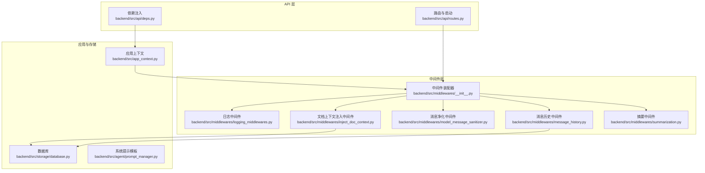
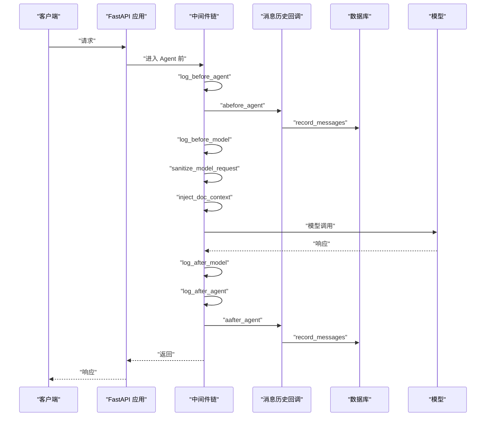
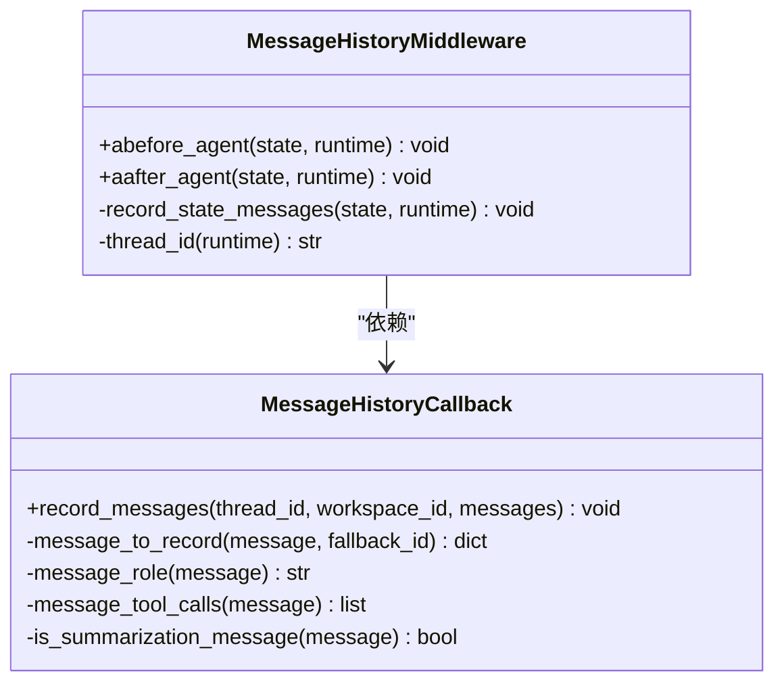
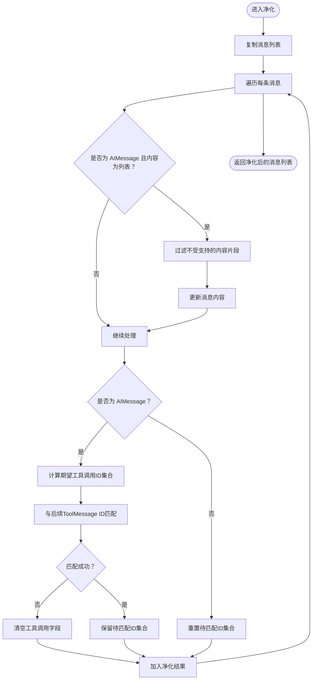
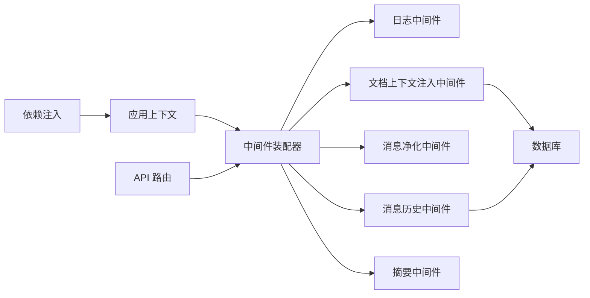

# 中间件系统

<cite>
**本文引用的文件**
- [backend/src/middlewares/__init__.py](file://backend/src/middlewares/__init__.py)
- [backend/src/middlewares/inject_doc_context.py](file://backend/src/middlewares/inject_doc_context.py)
- [backend/src/middlewares/logging_middlewares.py](file://backend/src/middlewares/logging_middlewares.py)
- [backend/src/middlewares/model_message_sanitizer.py](file://backend/src/middlewares/model_message_sanitizer.py)
- [backend/src/middlewares/summarization.py](file://backend/src/middlewares/summarization.py)
- [backend/src/agent/message_history.py](file://backend/src/agent/message_history.py)
- [backend/src/app_context.py](file://backend/src/app_context.py)
- [backend/src/api/routes.py](file://backend/src/api/routes.py)
- [backend/src/api/deps.py](file://backend/src/api/deps.py)
- [backend/src/storage/database.py](file://backend/src/storage/database.py)
- [backend/src/agent/prompt_manager.py](file://backend/src/agent/prompt_manager.py)
- [backend/tests/test_summarization_middleware.py](file://backend/tests/test_summarization_middleware.py)
- [backend/pyproject.toml](file://backend/pyproject.toml)
</cite>

## 目录
1. [简介](#简介)
2. [项目结构](#项目结构)
3. [核心组件](#核心组件)
4. [架构总览](#架构总览)
5. [详细组件分析](#详细组件分析)
6. [依赖分析](#依赖分析)
7. [性能考虑](#性能考虑)
8. [故障排查指南](#故障排查指南)
9. [结论](#结论)
10. [附录](#附录)

## 简介
本文件面向 Train Agent 的中间件系统，系统性阐述中间件的架构设计、执行顺序、功能职责与实现细节，并给出配置方法、自定义开发规范、性能优化与调试技巧。重点覆盖以下中间件：
- 日志记录中间件：在 Agent 循环前后与模型调用前后记录关键指标
- 消息历史持久化中间件：将状态中的消息持久化至数据库
- 模型消息净化中间件：清理与兼容特定模型不支持的内容片段与工具调用
- 文档上下文注入中间件：动态拼接当前工作区文档摘要作为系统提示的一部分
- 摘要中间件：按策略触发对话摘要，插入 UI 友好且隐藏的消息，控制摘要冷却

此外，文档还包含中间件链的执行流程图、类关系图与序列图，帮助开发者快速定位问题与扩展能力。

## 项目结构
中间件相关代码集中于 backend/src/middlewares，配合消息历史回调与应用上下文在 API 初始化阶段装配。CORS 在 FastAPI 层配置，确保跨域访问。

图表来源
- [backend/src/api/routes.py:21-27](file://backend/src/api/routes.py#L21-L27)
- [backend/src/middlewares/__init__.py:18-40](file://backend/src/middlewares/__init__.py#L18-L40)
- [backend/src/middlewares/inject_doc_context.py:11-40](file://backend/src/middlewares/inject_doc_context.py#L11-L40)
- [backend/src/middlewares/logging_middlewares.py:15-59](file://backend/src/middlewares/logging_middlewares.py#L15-L59)
- [backend/src/middlewares/model_message_sanitizer.py:105-122](file://backend/src/middlewares/model_message_sanitizer.py#L105-L122)
- [backend/src/middlewares/summarization.py:7-58](file://backend/src/middlewares/summarization.py#L7-L58)
- [backend/src/agent/message_history.py:109-143](file://backend/src/agent/message_history.py#L109-L143)
- [backend/src/app_context.py:12-31](file://backend/src/app_context.py#L12-L31)
- [backend/src/storage/database.py:9-200](file://backend/src/storage/database.py#L9-L200)
- [backend/src/agent/prompt_manager.py:1-37](file://backend/src/agent/prompt_manager.py#L1-L37)

章节来源
- [backend/src/api/routes.py:21-27](file://backend/src/api/routes.py#L21-L27)
- [backend/src/middlewares/__init__.py:18-40](file://backend/src/middlewares/__init__.py#L18-L40)
- [backend/src/app_context.py:12-31](file://backend/src/app_context.py#L12-L31)

## 核心组件
- 中间件装配器：统一创建并按序排列中间件，保证执行顺序与依赖满足业务需求
- 日志中间件：在 Agent 循环前后与模型调用前后记录消息数量、工具调用等关键信息
- 消息历史中间件：在 Agent 前后将状态中的消息持久化，排除摘要消息
- 模型消息净化中间件：清理 AIMessage 中不受支持的内容片段类型，校验工具调用 ID 匹配，保持与兼容模型的交互稳定
- 文档上下文注入中间件：从数据库读取当前工作区文档摘要，动态拼接到系统提示中
- 摘要中间件：基于消息数/令牌数阈值与最小消息冷却期决定是否摘要，插入 UI 友好且隐藏的摘要消息

章节来源
- [backend/src/middlewares/__init__.py:18-40](file://backend/src/middlewares/__init__.py#L18-L40)
- [backend/src/middlewares/logging_middlewares.py:15-59](file://backend/src/middlewares/logging_middlewares.py#L15-L59)
- [backend/src/agent/message_history.py:109-143](file://backend/src/agent/message_history.py#L109-L143)
- [backend/src/middlewares/model_message_sanitizer.py:105-122](file://backend/src/middlewares/model_message_sanitizer.py#L105-L122)
- [backend/src/middlewares/inject_doc_context.py:11-40](file://backend/src/middlewares/inject_doc_context.py#L11-L40)
- [backend/src/middlewares/summarization.py:7-58](file://backend/src/middlewares/summarization.py#L7-L58)

## 架构总览
中间件链在 API 启动时由装配器创建并注册到运行时。执行顺序如下：
1) 记录 Agent 入口日志
2) 写入消息历史（进入 Agent）
3) 记录模型调用前日志
4) 清理与兼容模型的历史消息
5) 注入文档上下文（动态系统提示）
6) 记录模型调用后日志
7) 记录 Agent 出口日志
8) 触发摘要（按策略）

图表来源
- [backend/src/middlewares/__init__.py:18-40](file://backend/src/middlewares/__init__.py#L18-L40)
- [backend/src/middlewares/logging_middlewares.py:15-59](file://backend/src/middlewares/logging_middlewares.py#L15-L59)
- [backend/src/agent/message_history.py:109-143](file://backend/src/agent/message_history.py#L109-L143)
- [backend/src/middlewares/model_message_sanitizer.py:105-122](file://backend/src/middlewares/model_message_sanitizer.py#L105-L122)
- [backend/src/middlewares/inject_doc_context.py:11-40](file://backend/src/middlewares/inject_doc_context.py#L11-L40)

## 详细组件分析

### 中间件装配器与执行顺序
- 负责创建并返回中间件列表，严格控制执行顺序
- 关键参数：工作区 ID、线程 ID、消息列表、模型调用配置等
- 执行顺序直接影响日志、历史、净化、上下文与摘要的行为

章节来源
- [backend/src/middlewares/__init__.py:18-40](file://backend/src/middlewares/__init__.py#L18-L40)

### 日志中间件
- 功能：在 Agent 循环前后与模型调用前后记录关键指标，便于监控与排障
- 关键点：
  - 记录工作区 ID 与消息数量/上下文长度
  - 提取最后一条消息的工具调用名称列表，辅助追踪工具使用情况
- 影响：为后续中间件与摘要策略提供可观测性基础

章节来源
- [backend/src/middlewares/logging_middlewares.py:15-59](file://backend/src/middlewares/logging_middlewares.py#L15-L59)

### 消息历史中间件与回调
- 功能：将状态中的消息持久化到数据库，过滤掉摘要消息，避免重复记录
- 关键点：
  - 从 runtime.execution_info 或 runtime.context 中提取 thread_id
  - 将消息标准化为统一字段（角色、类型、内容、工具调用、附加信息等）
  - 过滤 lc_source 为 "summarization" 的消息
- 异常处理：捕获持久化过程中的异常并记录日志，不影响主流程

图表来源
- [backend/src/agent/message_history.py:13-143](file://backend/src/agent/message_history.py#L13-L143)

章节来源
- [backend/src/agent/message_history.py:109-143](file://backend/src/agent/message_history.py#L109-L143)

### 模型消息净化中间件
- 功能：清理 AIMessage 中不受支持的内容片段类型；校验工具调用 ID 是否与后续 ToolMessage 对齐；若不一致则清空工具调用字段
- 关键算法：
  - 过滤 content 中的不受支持类型
  - 计算 AIMessage 中期望的工具调用 ID 集合
  - 遍历后续消息，收集实际存在的 ToolMessage 的工具调用 ID
  - 若集合不匹配，清空 AIMessage 的工具调用相关字段
- 性能：线性扫描消息列表，时间复杂度 O(n)，空间开销小

图表来源
- [backend/src/middlewares/model_message_sanitizer.py:62-102](file://backend/src/middlewares/model_message_sanitizer.py#L62-L102)

章节来源
- [backend/src/middlewares/model_message_sanitizer.py:105-122](file://backend/src/middlewares/model_message_sanitizer.py#L105-L122)

### 文档上下文注入中间件
- 功能：根据请求状态中的工作区 ID，从数据库读取该工作区的文档摘要，动态拼接到系统提示中
- 关键点：
  - 通过工厂函数创建，接收数据库实例
  - 若数据库连接为空，先初始化
  - 将摘要以结构化文本拼接到默认系统提示末尾
- 影响：增强模型对当前工作区知识的理解，提升回答质量

章节来源
- [backend/src/middlewares/inject_doc_context.py:11-40](file://backend/src/middlewares/inject_doc_context.py#L11-L40)
- [backend/src/agent/prompt_manager.py:1-37](file://backend/src/agent/prompt_manager.py#L1-L37)
- [backend/src/storage/database.py:9-200](file://backend/src/storage/database.py#L9-L200)

### 摘要中间件
- 功能：基于消息数/令牌数阈值与最小消息冷却期决定是否插入摘要；插入的摘要消息带有 UI 友好标记且对前端隐藏
- 关键点：
  - 继承自框架提供的摘要中间件，扩展冷却逻辑
  - 通过查找最近一次摘要消息的位置，计算距离当前消息的数量
  - 插入的人类消息携带额外元数据，用于前端过滤与展示控制
- 测试验证：单元测试覆盖摘要消息的隐藏标记与冷却跳过行为

章节来源
- [backend/src/middlewares/summarization.py:7-58](file://backend/src/middlewares/summarization.py#L7-L58)
- [backend/tests/test_summarization_middleware.py:21-59](file://backend/tests/test_summarization_middleware.py#L21-L59)

## 依赖分析
- 中间件装配器依赖应用上下文与消息历史回调，以及各中间件模块
- 文档上下文注入依赖数据库模块与系统提示模板
- 消息历史中间件依赖消息历史回调与数据库
- 摘要中间件依赖框架提供的摘要中间件基类
- CORS 在 API 层配置，与中间件系统解耦

图表来源
- [backend/src/middlewares/__init__.py:18-40](file://backend/src/middlewares/__init__.py#L18-L40)
- [backend/src/middlewares/inject_doc_context.py:11-40](file://backend/src/middlewares/inject_doc_context.py#L11-L40)
- [backend/src/agent/message_history.py:109-143](file://backend/src/agent/message_history.py#L109-L143)
- [backend/src/api/deps.py:13-30](file://backend/src/api/deps.py#L13-L30)
- [backend/src/api/routes.py:21-27](file://backend/src/api/routes.py#L21-L27)

章节来源
- [backend/src/middlewares/__init__.py:18-40](file://backend/src/middlewares/__init__.py#L18-L40)
- [backend/src/api/deps.py:13-30](file://backend/src/api/deps.py#L13-L30)
- [backend/src/api/routes.py:21-27](file://backend/src/api/routes.py#L21-L27)

## 性能考虑
- 中间件链顺序优化
  - 将轻量级日志与状态读取前置，尽早暴露问题
  - 将数据库访问（注入上下文）与消息持久化尽量靠近模型调用，减少无关 IO
- 数据库访问
  - 注入上下文与消息历史均可能触发数据库查询/写入，建议在高并发场景下：
    - 复用连接池与事务
    - 控制单次查询的数据量（如限制摘要数量）
- 消息净化
  - 线性扫描，复杂度 O(n)；可通过减少历史长度或提前截断降低 n
- 摘要策略
  - 合理设置触发阈值与最小冷却消息数，避免频繁摘要导致额外 IO
- 日志
  - 在生产环境适当降低日志级别，避免高频 INFO 导致磁盘压力

## 故障排查指南
- 中间件未生效
  - 确认中间件已正确装配并按序注册
  - 检查工作区 ID 与线程 ID 是否在状态或运行时上下文中存在
- 数据库连接失败
  - 确认数据库初始化已在应用启动时完成
  - 检查数据库路径与权限
- 摘要未触发或过早触发
  - 检查摘要触发阈值与最小冷却消息数配置
  - 确认最近一次摘要消息位置计算逻辑
- 工具调用异常
  - 检查 AIMessage 的工具调用 ID 与后续 ToolMessage 是否一一对应
  - 若不对应，净化中间件会清空工具调用字段，需检查上游消息构造
- CORS 问题
  - 确认 CORS 中间件已正确配置，允许来源、方法与头

章节来源
- [backend/src/middlewares/__init__.py:18-40](file://backend/src/middlewares/__init__.py#L18-L40)
- [backend/src/api/routes.py:21-27](file://backend/src/api/routes.py#L21-L27)
- [backend/src/middlewares/summarization.py:19-28](file://backend/src/middlewares/summarization.py#L19-L28)
- [backend/src/middlewares/model_message_sanitizer.py:62-102](file://backend/src/middlewares/model_message_sanitizer.py#L62-L102)

## 结论
中间件系统通过严格的执行顺序与职责划分，实现了可观测、可持久化、可净化、可注入上下文与可摘要的完整链路。遵循本文的配置方法与开发规范，可在保证稳定性的同时灵活扩展新的中间件能力。

## 附录

### 配置方法与环境变量
- 中间件装配器从环境变量读取模型与 API 基础地址，用于摘要中间件
- CORS 在 API 层配置，允许任意来源与方法
- 应用上下文从环境变量加载数据库路径与技能目录

章节来源
- [backend/src/middlewares/__init__.py:32-39](file://backend/src/middlewares/__init__.py#L32-L39)
- [backend/src/api/routes.py:21-27](file://backend/src/api/routes.py#L21-L27)
- [backend/src/app_context.py:19-30](file://backend/src/app_context.py#L19-L30)

### 自定义中间件开发规范
- 继承框架提供的中间件基类，实现必要的生命周期钩子（如 before/after）
- 明确输入输出：读取状态中的必要字段（如 workspace_id、messages），必要时修改状态
- 异常处理：捕获并记录异常，避免影响主流程
- 性能：避免阻塞操作，优先使用异步接口
- 日志：记录关键指标与上下文信息，便于排障

### 依赖版本与构建
- 项目依赖 langchain、langgraph、fastapi 等，测试与开发工具通过 pytest 与 ruff 提供

章节来源
- [backend/pyproject.toml:6-26](file://backend/pyproject.toml#L6-L26)
- [backend/pyproject.toml:28-33](file://backend/pyproject.toml#L28-L33)