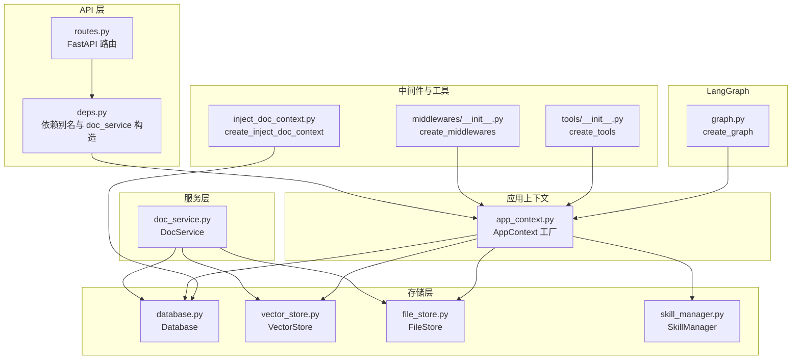
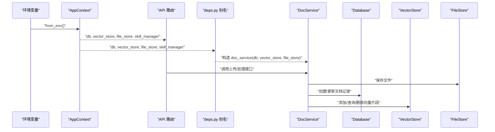
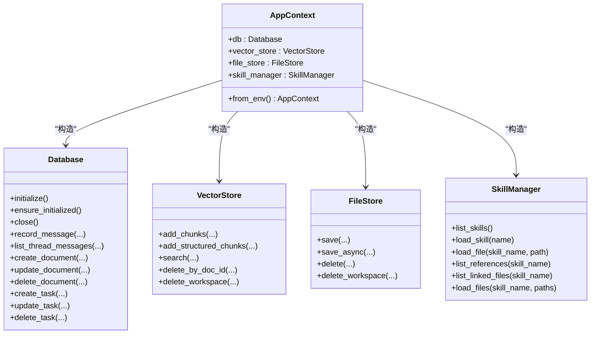
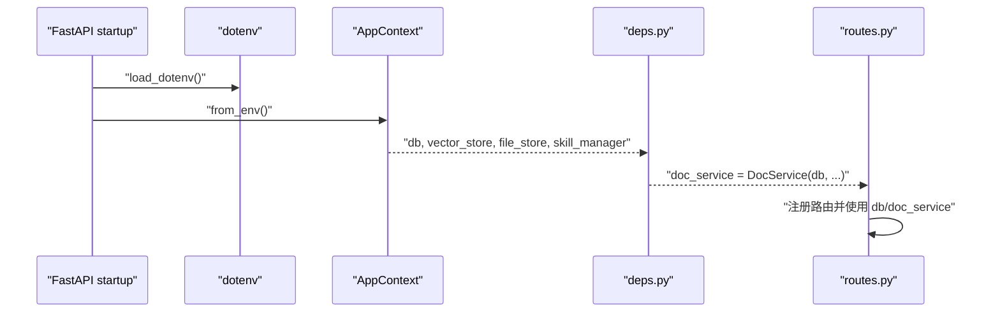
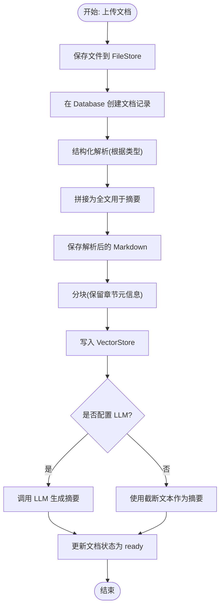
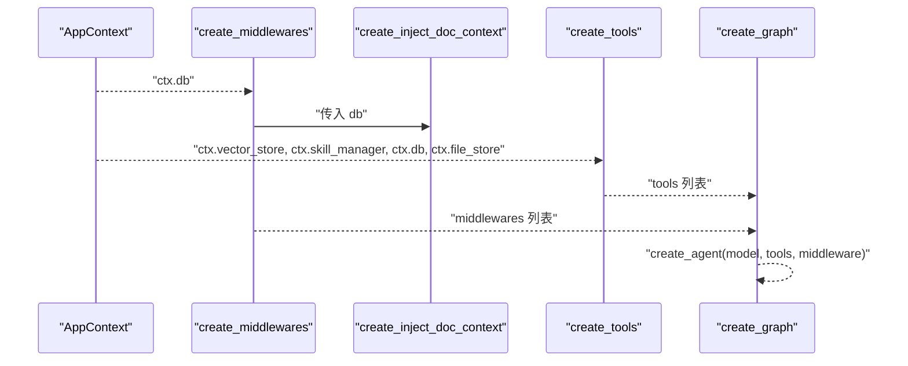
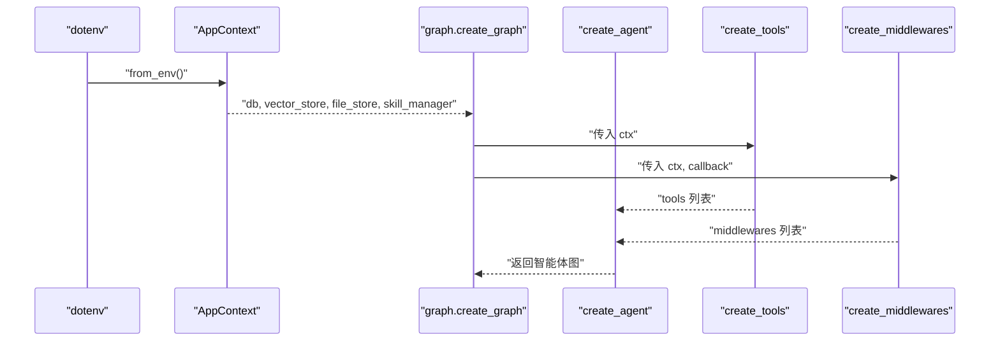
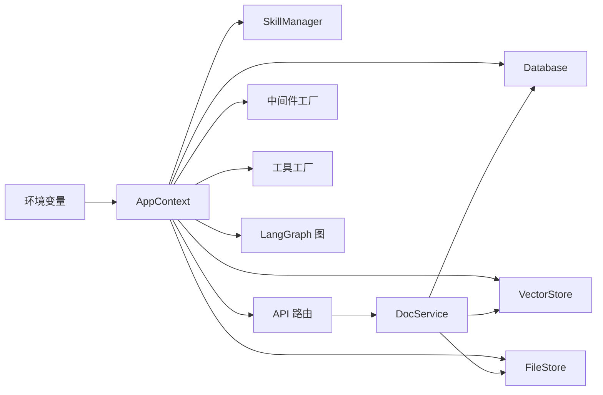

# 依赖注入机制

<cite>
**本文引用的文件**
- [backend/src/api/deps.py](file://backend/src/api/deps.py)
- [backend/src/app_context.py](file://backend/src/app_context.py)
- [backend/src/storage/database.py](file://backend/src/storage/database.py)
- [backend/src/storage/vector_store.py](file://backend/src/storage/vector_store.py)
- [backend/src/storage/file_store.py](file://backend/src/storage/file_store.py)
- [backend/src/services/doc_service.py](file://backend/src/services/doc_service.py)
- [backend/src/middlewares/inject_doc_context.py](file://backend/src/middlewares/inject_doc_context.py)
- [backend/src/middlewares/__init__.py](file://backend/src/middlewares/__init__.py)
- [backend/src/tools/__init__.py](file://backend/src/tools/__init__.py)
- [backend/src/agent/graph.py](file://backend/src/agent/graph.py)
- [backend/src/agent/skill_manager.py](file://backend/src/agent/skill_manager.py)
- [backend/src/api/routes.py](file://backend/src/api/routes.py)
- [backend/pyproject.toml](file://backend/pyproject.toml)
</cite>

## 目录
1. [引言](#引言)
2. [项目结构](#项目结构)
3. [核心组件](#核心组件)
4. [架构总览](#架构总览)
5. [详细组件分析](#详细组件分析)
6. [依赖分析](#依赖分析)
7. [性能考虑](#性能考虑)
8. [故障排查指南](#故障排查指南)
9. [结论](#结论)
10. [附录](#附录)

## 引言
本文件系统性梳理 Train Agent 的依赖注入机制，重点覆盖以下方面：
- 设计原理与实现方式：通过应用上下文 AppContext 统一装配数据库、文档服务、文件存储、向量存储、技能管理等依赖；API 层与中间件/工具层均以 AppContext 为入口进行解耦。
- 依赖工厂函数：AppContext 工厂方法从环境变量构建各子系统实例；注入工厂如 create_inject_doc_context、create_middlewares、create_tools 将 AppContext 拆解为具体组件，供上层调用。
- 生命周期与异步初始化：数据库采用延迟初始化（ensure_initialized/initialize）；文件存储提供同步写入的线程包装；向量存储基于持久化客户端；LLM 客户端在 API 层按需创建。
- 传递方式：FastAPI 路由直接依赖 API 层的依赖别名；LangGraph 图与中间件/工具通过 AppContext 注入；中间件与工具各自持有最小必要依赖，避免全局污染。

## 项目结构
后端采用“按职责分层 + 工厂装配”的组织方式：
- 应用上下文层：AppContext 统一装配数据库、向量存储、文件存储、技能管理。
- 存储层：Database、VectorStore、FileStore 提供数据持久化与检索能力。
- 服务层：DocService 封装文档上传、解析、索引、摘要生成等流程。
- API 层：deps.py 暴露 db、vector_store、file_store、skill_manager、doc_service 等依赖别名；routes.py 使用这些别名处理请求。
- 中间件与工具层：通过工厂函数从 AppContext 获取所需依赖，形成可组合的中间件链与工具集。
- LangGraph 图：通过 AppContext 创建模型、工具与中间件，形成可运行的智能体图。

图表来源
- [backend/src/api/deps.py:1-30](file://backend/src/api/deps.py#L1-L30)
- [backend/src/app_context.py:12-30](file://backend/src/app_context.py#L12-L30)
- [backend/src/storage/database.py:9-24](file://backend/src/storage/database.py#L9-L24)
- [backend/src/storage/vector_store.py:39-49](file://backend/src/storage/vector_store.py#L39-L49)
- [backend/src/storage/file_store.py:6-16](file://backend/src/storage/file_store.py#L6-L16)
- [backend/src/services/doc_service.py:13-28](file://backend/src/services/doc_service.py#L13-L28)
- [backend/src/middlewares/__init__.py:18-40](file://backend/src/middlewares/__init__.py#L18-L40)
- [backend/src/middlewares/inject_doc_context.py:11-40](file://backend/src/middlewares/inject_doc_context.py#L11-L40)
- [backend/src/tools/__init__.py:11-19](file://backend/src/tools/__init__.py#L11-L19)
- [backend/src/agent/graph.py:16-37](file://backend/src/agent/graph.py#L16-L37)

章节来源
- [backend/src/api/deps.py:1-30](file://backend/src/api/deps.py#L1-L30)
- [backend/src/app_context.py:12-30](file://backend/src/app_context.py#L12-L30)
- [backend/src/api/routes.py:1-27](file://backend/src/api/routes.py#L1-L27)

## 核心组件
- AppContext：集中式依赖容器，负责从环境变量构造 Database、VectorStore、FileStore、SkillManager，并提供 from_env 工厂方法。
- Database：基于 aiosqlite 的异步数据库访问器，支持延迟初始化、表迁移、消息与任务记录等。
- VectorStore：基于 ChromaDB 的向量存储，支持集合按工作区隔离、批处理添加、查询与删除。
- FileStore：文件系统存储，提供同步写入的线程包装，确保异步场景下的安全落盘。
- DocService：文档处理服务，串联文件存储、数据库与向量存储，完成解析、切片、索引与摘要生成。
- API 依赖别名：deps.py 将 AppContext 实例中的依赖映射为 db、vector_store、file_store、skill_manager，并构造 doc_service。
- 中间件与工具工厂：middlewares/__init__.py 与 tools/__init__.py 从 AppContext 解构出最小依赖集合，分别用于 LangGraph 中间件链与工具集。
- LangGraph 图：graph.py 基于 AppContext 创建模型、工具与中间件，形成可运行的智能体图。

章节来源
- [backend/src/app_context.py:12-30](file://backend/src/app_context.py#L12-L30)
- [backend/src/storage/database.py:9-24](file://backend/src/storage/database.py#L9-L24)
- [backend/src/storage/vector_store.py:39-49](file://backend/src/storage/vector_store.py#L39-L49)
- [backend/src/storage/file_store.py:6-16](file://backend/src/storage/file_store.py#L6-L16)
- [backend/src/services/doc_service.py:13-28](file://backend/src/services/doc_service.py#L13-L28)
- [backend/src/api/deps.py:13-29](file://backend/src/api/deps.py#L13-L29)
- [backend/src/middlewares/__init__.py:18-40](file://backend/src/middlewares/__init__.py#L18-L40)
- [backend/src/tools/__init__.py:11-19](file://backend/src/tools/__init__.py#L11-L19)
- [backend/src/agent/graph.py:16-37](file://backend/src/agent/graph.py#L16-L37)

## 架构总览
下图展示依赖注入在系统中的流向：AppContext 作为根工厂，API 层、LangGraph、中间件与工具层通过工厂函数或直接别名获取所需依赖，形成清晰的单向依赖链。

图表来源
- [backend/src/app_context.py:19-30](file://backend/src/app_context.py#L19-L30)
- [backend/src/api/deps.py:13-29](file://backend/src/api/deps.py#L13-L29)
- [backend/src/services/doc_service.py:13-28](file://backend/src/services/doc_service.py#L13-L28)
- [backend/src/storage/database.py:10-24](file://backend/src/storage/database.py#L10-L24)
- [backend/src/storage/vector_store.py:39-49](file://backend/src/storage/vector_store.py#L39-L49)
- [backend/src/storage/file_store.py:6-16](file://backend/src/storage/file_store.py#L6-L16)

## 详细组件分析

### AppContext 工厂与依赖装配
- 职责：从环境变量读取 DATA_DIR，构造 Database、VectorStore、FileStore、SkillManager，并以数据类形式对外暴露。
- 关键点：
  - 数据库路径、向量存储路径、文件存储路径均位于统一根目录下，便于部署与清理。
  - 技能管理器指向 skills 目录，扫描 SKILL.md 并提取元信息。
- 适用场景：API 层、LangGraph、中间件与工具层均可通过 AppContext 获取一致的依赖树。

图表来源
- [backend/src/app_context.py:12-30](file://backend/src/app_context.py#L12-L30)
- [backend/src/storage/database.py:9-24](file://backend/src/storage/database.py#L9-L24)
- [backend/src/storage/vector_store.py:39-49](file://backend/src/storage/vector_store.py#L39-L49)
- [backend/src/storage/file_store.py:6-16](file://backend/src/storage/file_store.py#L6-L16)
- [backend/src/agent/skill_manager.py:14-25](file://backend/src/agent/skill_manager.py#L14-L25)

章节来源
- [backend/src/app_context.py:12-30](file://backend/src/app_context.py#L12-L30)

### API 层依赖别名与 DocService 构造
- 职责：在启动时从环境加载 dotenv，构造 AppContext，并将其内部依赖映射为 db、vector_store、file_store、skill_manager；同时基于这些依赖构造 DocService。
- 传递方式：FastAPI 路由直接导入 deps.py 中的 db、doc_service 等别名，从而在请求处理中复用同一套依赖实例。
- 启动初始化：API 在 startup 事件中显式初始化数据库连接，确保后续路由可用。

图表来源
- [backend/src/api/deps.py:11-29](file://backend/src/api/deps.py#L11-L29)
- [backend/src/api/routes.py:30-34](file://backend/src/api/routes.py#L30-L34)

章节来源
- [backend/src/api/deps.py:1-30](file://backend/src/api/deps.py#L1-L30)
- [backend/src/api/routes.py:30-34](file://backend/src/api/routes.py#L30-L34)

### 文档服务（DocService）的依赖注入与处理流程
- 依赖注入：DocService 在构造时接收 db、vector_store、file_store、llm 四个依赖，其中 llm 可选。
- 处理流程：上传 → 保存文件 → 写入数据库 → 结构化解析 → 生成摘要 → 分块索引到向量库 → 更新状态。
- 生命周期：DocService 在需要时触发 db.initialize，确保数据库连接可用。

图表来源
- [backend/src/services/doc_service.py:29-130](file://backend/src/services/doc_service.py#L29-L130)
- [backend/src/storage/file_store.py:11-16](file://backend/src/storage/file_store.py#L11-L16)
- [backend/src/storage/database.py:285-311](file://backend/src/storage/database.py#L285-L311)
- [backend/src/storage/vector_store.py:91-122](file://backend/src/storage/vector_store.py#L91-L122)

章节来源
- [backend/src/services/doc_service.py:13-28](file://backend/src/services/doc_service.py#L13-L28)
- [backend/src/services/doc_service.py:29-130](file://backend/src/services/doc_service.py#L29-L130)

### 中间件与工具的工厂注入
- 中间件工厂：create_middlewares(ctx, callback) 从 AppContext 解构出 db，再通过 create_inject_doc_context(db) 注入动态提示词，形成有序中间件链。
- 工具工厂：create_tools(ctx) 从 AppContext 解构出 vector_store、skill_manager、db、file_store，分别构造 RAG 搜索、加载技能、保存输出、运行脚本等工具。
- 传递方式：LangGraph 的 create_agent 接收 tools 与 middleware，二者均由工厂函数注入，避免在上层直接感知 AppContext。

图表来源
- [backend/src/middlewares/__init__.py:18-40](file://backend/src/middlewares/__init__.py#L18-L40)
- [backend/src/middlewares/inject_doc_context.py:11-40](file://backend/src/middlewares/inject_doc_context.py#L11-L40)
- [backend/src/tools/__init__.py:11-19](file://backend/src/tools/__init__.py#L11-L19)
- [backend/src/agent/graph.py:28-37](file://backend/src/agent/graph.py#L28-L37)

章节来源
- [backend/src/middlewares/__init__.py:18-40](file://backend/src/middlewares/__init__.py#L18-L40)
- [backend/src/middlewares/inject_doc_context.py:11-40](file://backend/src/middlewares/inject_doc_context.py#L11-L40)
- [backend/src/tools/__init__.py:11-19](file://backend/src/tools/__init__.py#L11-L19)
- [backend/src/agent/graph.py:28-37](file://backend/src/agent/graph.py#L28-L37)

### LangGraph 图的依赖注入
- 职责：基于 AppContext 创建 ChatOpenAI、MessageHistoryCallback、tools 与 middlewares，最终生成可运行的智能体图。
- 关键点：回调与中间件链通过 AppContext 注入，确保消息历史、文档上下文注入、日志与摘要等横切关注点被统一管理。

图表来源
- [backend/src/agent/graph.py:16-48](file://backend/src/agent/graph.py#L16-L48)
- [backend/src/tools/__init__.py:11-19](file://backend/src/tools/__init__.py#L11-L19)
- [backend/src/middlewares/__init__.py:18-40](file://backend/src/middlewares/__init__.py#L18-L40)

章节来源
- [backend/src/agent/graph.py:16-48](file://backend/src/agent/graph.py#L16-L48)

## 依赖分析
- 耦合与内聚：
  - AppContext 作为高内聚的工厂，将外部依赖（数据库、向量库、文件系统、技能管理）聚合在一起，降低上层对具体实现的感知。
  - API、中间件、工具、LangGraph 仅依赖 AppContext 或其工厂，避免循环依赖。
- 直接与间接依赖：
  - API 路由直接依赖 deps.py 的别名；DocService 间接依赖 FileStore、Database、VectorStore。
  - 中间件与工具通过工厂函数解耦 AppContext，仅持有最小依赖集合。
- 外部依赖与集成点：
  - OpenAI 兼容模型（ChatOpenAI）、DashScope 文本嵌入、ChromaDB 向量库、aiosqlite、python-docx、PyMuPDF 等。
- 配置与环境：
  - DATA_DIR、MAIN_MODEL、DEEPSEEK_API_KEY、DEEPSEEK_API_BASE、SUMMARIZATION_MODEL、SUMMARIZATION_API_KEY、SUMMARIZATION_API_BASE、EMBEDDING_MODEL、EMBEDDING_API_KEY、EMBEDDING_API_BASE 等环境变量驱动行为。

图表来源
- [backend/src/app_context.py:19-30](file://backend/src/app_context.py#L19-L30)
- [backend/src/api/routes.py:10-11](file://backend/src/api/routes.py#L10-L11)
- [backend/src/services/doc_service.py:13-28](file://backend/src/services/doc_service.py#L13-L28)
- [backend/src/middlewares/__init__.py:18-40](file://backend/src/middlewares/__init__.py#L18-L40)
- [backend/src/tools/__init__.py:11-19](file://backend/src/tools/__init__.py#L11-L19)
- [backend/src/agent/graph.py:16-37](file://backend/src/agent/graph.py#L16-L37)

章节来源
- [backend/pyproject.toml:6-26](file://backend/pyproject.toml#L6-L26)

## 性能考虑
- 异步初始化与连接管理
  - Database：延迟初始化与 ensure_initialized 避免无谓连接；表迁移与索引在首次初始化时完成，减少运行期开销。
  - VectorStore：基于持久化客户端，集合按工作区隔离，查询时按需获取集合，避免跨工作区扫描。
  - FileStore：save_async 通过线程池包装阻塞 I/O，避免阻塞事件循环。
- 批处理与分页
  - 向量存储添加采用批处理（默认 20），减少网络往返与事务提交次数。
  - 消息列表查询限制每页数量并提供游标，避免一次性拉取大量数据。
- 缓存与降级
  - LLM 摘要失败时回退为截断文本，保证服务可用性与稳定性。
- 资源释放
  - Database 提供 close 方法，可在应用关闭时释放连接；API 层在 startup 中初始化，建议在 shutdown 中补充关闭逻辑以释放资源。

## 故障排查指南
- 数据库未初始化
  - 现象：路由调用数据库时报错或空结果。
  - 排查：确认 API startup 是否执行 db.initialize；检查 DATA_DIR 权限与路径是否存在。
  - 参考：[backend/src/api/routes.py:30-34](file://backend/src/api/routes.py#L30-L34)，[backend/src/storage/database.py:14-24](file://backend/src/storage/database.py#L14-L24)
- 向量库查询为空
  - 现象：RAG 检索返回空结果。
  - 排查：确认对应工作区集合已存在；检查文档是否成功索引；核对查询参数与过滤条件。
  - 参考：[backend/src/storage/vector_store.py:138-143](file://backend/src/storage/vector_store.py#L138-L143)
- 文件保存失败
  - 现象：上传后无法下载或找不到文件。
  - 排查：确认 DATA_DIR/files 下对应工作区目录存在；检查权限与磁盘空间；查看 FileStore.save_async 的线程执行情况。
  - 参考：[backend/src/storage/file_store.py:11-28](file://backend/src/storage/file_store.py#L11-L28)
- LLM 摘要异常
  - 现象：摘要生成失败或响应异常。
  - 排查：检查 SUMMARIZATION_MODEL、SUMMARIZATION_API_KEY、SUMMARIZATION_API_BASE；确认网络可达；观察回退逻辑是否生效。
  - 参考：[backend/src/api/deps.py:21-25](file://backend/src/api/deps.py#L21-L25)，[backend/src/services/doc_service.py:202-217](file://backend/src/services/doc_service.py#L202-L217)
- 中间件注入无效
  - 现象：系统提示词未包含文档摘要。
  - 排查：确认 create_inject_doc_context(ctx.db) 已加入中间件链；检查 db 初始化与 list_documents 返回值。
  - 参考：[backend/src/middlewares/inject_doc_context.py:11-40](file://backend/src/middlewares/inject_doc_context.py#L11-L40)，[backend/src/middlewares/__init__.py:27-28](file://backend/src/middlewares/__init__.py#L27-L28)

章节来源
- [backend/src/api/routes.py:30-34](file://backend/src/api/routes.py#L30-L34)
- [backend/src/storage/database.py:14-24](file://backend/src/storage/database.py#L14-L24)
- [backend/src/storage/vector_store.py:138-143](file://backend/src/storage/vector_store.py#L138-L143)
- [backend/src/storage/file_store.py:11-28](file://backend/src/storage/file_store.py#L11-L28)
- [backend/src/api/deps.py:21-25](file://backend/src/api/deps.py#L21-L25)
- [backend/src/services/doc_service.py:202-217](file://backend/src/services/doc_service.py#L202-L217)
- [backend/src/middlewares/inject_doc_context.py:11-40](file://backend/src/middlewares/inject_doc_context.py#L11-L40)
- [backend/src/middlewares/__init__.py:27-28](file://backend/src/middlewares/__init__.py#L27-L28)

## 结论
本项目的依赖注入以 AppContext 为核心，结合工厂函数与 API 层别名，实现了：
- 明确的职责分离：存储、服务、中间件、工具与 LangGraph 各自通过最小依赖集合协作。
- 清晰的生命周期管理：数据库延迟初始化、文件 I/O 线程化、向量库持久化与批处理。
- 可扩展的装配方式：新增依赖只需在 AppContext 工厂与相应工厂函数中注入，不影响现有调用方。
建议在生产环境中补充应用关闭时的资源释放（如数据库连接关闭），并在监控中增加依赖初始化耗时指标，以便持续优化启动性能。

## 附录
- 最佳实践
  - 将所有外部依赖的构造集中在 AppContext 工厂，避免散落在各模块。
  - 对于可能失败的外部调用（LLM、向量库、文件系统），设计明确的降级与重试策略。
  - 使用环境变量集中管理密钥与端点，配合 dotenv 在本地开发时自动加载。
  - 对大体量操作（向量索引、文件写入）采用批处理与后台任务，提升用户体验。
- 性能优化建议
  - 向量库批处理大小可根据硬件与延迟目标调整，默认 20 可按需增大。
  - 数据库事务合并与索引维护在初始化阶段完成，运行期尽量减少 DDL。
  - 文件 I/O 使用 save_async 包装，避免阻塞主事件循环。
  - 对高频查询（如消息列表）增加缓存与游标分页，控制单次返回量。