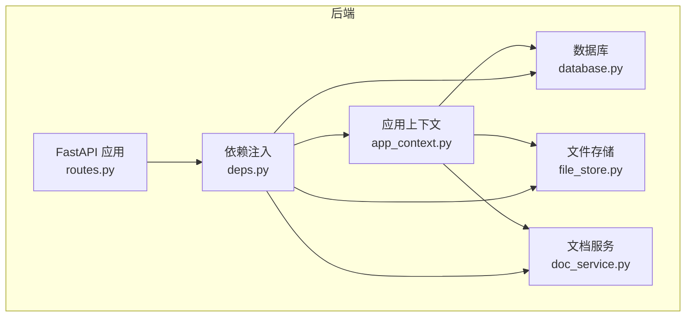
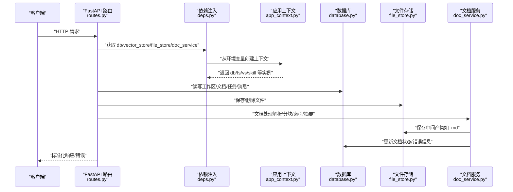
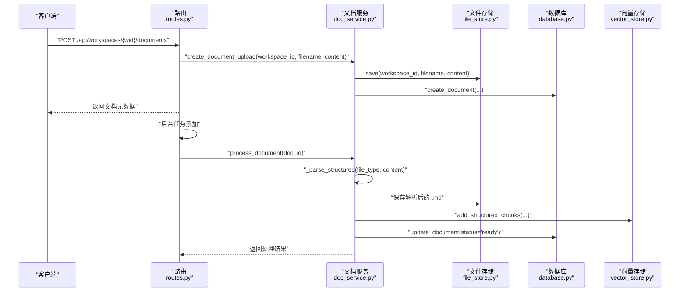
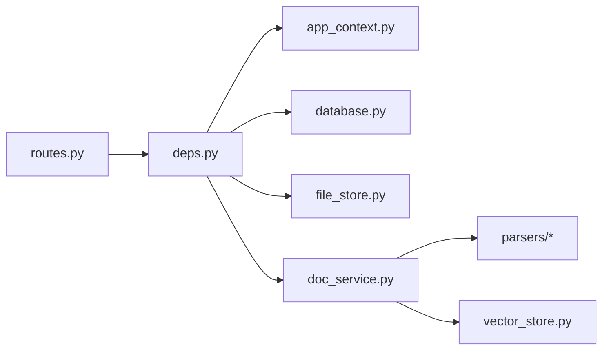

# 路由设计规范

<cite>
**本文引用的文件**
- [backend/src/api/routes.py](file://backend/src/api/routes.py)
- [backend/src/api/deps.py](file://backend/src/api/deps.py)
- [backend/src/storage/database.py](file://backend/src/storage/database.py)
- [backend/src/storage/file_store.py](file://backend/src/storage/file_store.py)
- [backend/src/services/doc_service.py](file://backend/src/services/doc_service.py)
- [backend/src/app_context.py](file://backend/src/app_context.py)
- [backend/pyproject.toml](file://backend/pyproject.toml)
</cite>

## 目录
1. [引言](#引言)
2. [项目结构](#项目结构)
3. [核心组件](#核心组件)
4. [架构总览](#架构总览)
5. [详细组件分析](#详细组件分析)
6. [依赖分析](#依赖分析)
7. [性能考虑](#性能考虑)
8. [故障排查指南](#故障排查指南)
9. [结论](#结论)
10. [附录](#附录)

## 引言
本文件面向 Train Agent 后端 API 的路由设计与实现，系统性梳理 RESTful 路由的组织结构、命名规范、参数校验与响应格式，并结合实际代码路径给出实现示例与最佳实践。重点覆盖工作区管理、文档处理、任务管理、消息检索、文件下载以及 PPT 静态资源挂载等模块。

## 项目结构
后端采用 FastAPI 应用入口集中于路由模块，通过依赖注入模块加载数据库、向量存储、文件存储与文档服务；数据库层提供工作区、文档、任务、消息等表结构与 CRUD；文档服务负责解析、分块、索引与摘要生成；文件存储负责本地文件持久化；应用上下文统一装配各依赖。

图表来源
- [backend/src/api/routes.py:1-189](file://backend/src/api/routes.py#L1-L189)
- [backend/src/api/deps.py:1-30](file://backend/src/api/deps.py#L1-L30)
- [backend/src/app_context.py:1-31](file://backend/src/app_context.py#L1-L31)
- [backend/src/storage/database.py:1-379](file://backend/src/storage/database.py#L1-L379)
- [backend/src/storage/file_store.py:1-39](file://backend/src/storage/file_store.py#L1-L39)
- [backend/src/services/doc_service.py:1-218](file://backend/src/services/doc_service.py#L1-L218)

章节来源
- [backend/src/api/routes.py:1-189](file://backend/src/api/routes.py#L1-L189)
- [backend/src/api/deps.py:1-30](file://backend/src/api/deps.py#L1-L30)
- [backend/src/app_context.py:1-31](file://backend/src/app_context.py#L1-L31)

## 核心组件
- 路由应用与中间件
  - 应用标题与启动事件初始化数据库
  - 允许跨域访问
- 依赖注入
  - 从环境变量构建应用上下文，提供数据库、向量存储、文件存储、技能管理与文档服务实例
- 数据模型与表结构
  - 工作区、文档、任务、消息四类实体，含索引与迁移逻辑
- 文档处理流水线
  - 文件上传、类型检测、结构化解析、分块、向量化索引、摘要生成、错误回退
- 文件存储
  - 基于工作区隔离的目录结构，支持删除工作区与单个文档清理
- 静态资源挂载
  - PPT 资源与模板的静态目录挂载

章节来源
- [backend/src/api/routes.py:1-189](file://backend/src/api/routes.py#L1-L189)
- [backend/src/api/deps.py:1-30](file://backend/src/api/deps.py#L1-L30)
- [backend/src/storage/database.py:1-379](file://backend/src/storage/database.py#L1-L379)
- [backend/src/storage/file_store.py:1-39](file://backend/src/storage/file_store.py#L1-L39)
- [backend/src/services/doc_service.py:1-218](file://backend/src/services/doc_service.py#L1-L218)
- [backend/src/app_context.py:1-31](file://backend/src/app_context.py#L1-L31)

## 架构总览
下图展示 API 路由与内部组件的交互关系，体现“路由 → 依赖注入 → 服务/存储”的调用链路。

图表来源
- [backend/src/api/routes.py:1-189](file://backend/src/api/routes.py#L1-L189)
- [backend/src/api/deps.py:1-30](file://backend/src/api/deps.py#L1-L30)
- [backend/src/app_context.py:1-31](file://backend/src/app_context.py#L1-L31)
- [backend/src/storage/database.py:1-379](file://backend/src/storage/database.py#L1-L379)
- [backend/src/storage/file_store.py:1-39](file://backend/src/storage/file_store.py#L1-L39)
- [backend/src/services/doc_service.py:1-218](file://backend/src/services/doc_service.py#L1-L218)

## 详细组件分析

### 工作区管理路由
- 设计原则
  - 使用复数名词“workspaces”，动词使用 POST/GET/PATCH/DELETE
  - 路径参数用于唯一标识工作区
  - 查询参数用于列表过滤（如 user_id）
- 路由清单
  - POST /api/workspaces：创建新工作区，请求体包含 user_id 与 name
  - GET /api/workspaces：按用户列出工作区，查询参数 user_id
  - GET /api/workspaces/{workspace_id}：按 ID 获取工作区详情
  - PATCH /api/workspaces/{workspace_id}/thread：更新工作区关联的会话 thread_id
  - DELETE /api/workspaces/{workspace_id}：删除工作区及其所有文档、向量与文件
- 参数与校验
  - 用户输入通过 Pydantic 模型进行结构化校验（如创建时的字段必填）
  - 删除工作区时，先清理文档与向量，再删除记录
- 响应与状态码
  - 成功返回 JSON 对象或 {"ok": true}
  - 重复名称返回 409 冲突
  - 未找到工作区返回 404
- 实现示例路径
  - [POST /api/workspaces:45-53](file://backend/src/api/routes.py#L45-L53)
  - [GET /api/workspaces:56-59](file://backend/src/api/routes.py#L56-L59)
  - [GET /api/workspaces/{workspace_id}:62-70](file://backend/src/api/routes.py#L62-L70)
  - [PATCH /api/workspaces/{workspace_id}/thread:77-81](file://backend/src/api/routes.py#L77-L81)
  - [DELETE /api/workspaces/{workspace_id}:99-106](file://backend/src/api/routes.py#L99-L106)

章节来源
- [backend/src/api/routes.py:37-106](file://backend/src/api/routes.py#L37-L106)
- [backend/src/storage/database.py:111-155](file://backend/src/storage/database.py#L111-L155)

### 文档处理路由
- 设计原则
  - 以工作区为上下文，文档集合在工作区内管理
  - 上传采用 multipart/form-data，异步后台处理
  - 列表与删除基于工作区与文档 ID
- 路由清单
  - POST /api/workspaces/{workspace_id}/documents：上传文件，后台触发解析与索引
  - GET /api/workspaces/{workspace_id}/documents：列出工作区内文档
  - DELETE /api/workspaces/{workspace_id}/documents/{doc_id}：删除指定文档（含中间产物）
- 参数与校验
  - 上传文件为 UploadFile，读取二进制内容后交由文档服务处理
  - 文档服务内部根据扩展名识别类型并选择解析器
- 响应与状态码
  - 成功返回文档元数据（含状态、摘要、错误信息等）
  - 删除成功返回 {"ok": true}
- 实现示例路径
  - [POST /api/workspaces/{workspace_id}/documents:112-128](file://backend/src/api/routes.py#L112-L128)
  - [GET /api/workspaces/{workspace_id}/documents:131-134](file://backend/src/api/routes.py#L131-L134)
  - [DELETE /api/workspaces/{workspace_id}/documents/{doc_id}:137-141](file://backend/src/api/routes.py#L137-L141)

章节来源
- [backend/src/api/routes.py:109-141](file://backend/src/api/routes.py#L109-L141)
- [backend/src/services/doc_service.py:29-130](file://backend/src/services/doc_service.py#L29-L130)
- [backend/src/storage/file_store.py:11-28](file://backend/src/storage/file_store.py#L11-L28)

### 任务管理路由
- 设计原则
  - 任务与工作区关联，便于按工作区聚合
  - 列表与删除基于工作区与任务 ID
- 路由清单
  - GET /api/workspaces/{workspace_id}/tasks：列出工作区内任务
  - DELETE /api/workspaces/{workspace_id}/tasks/{task_id}：删除指定任务
- 参数与校验
  - 通过路径参数定位工作区与任务
- 响应与状态码
  - 成功返回任务列表或 {"ok": true}
- 实现示例路径
  - [GET /api/workspaces/{workspace_id}/tasks:147-150](file://backend/src/api/routes.py#L147-L150)
  - [DELETE /api/workspaces/{workspace_id}/tasks/{task_id}:153-157](file://backend/src/api/routes.py#L153-L157)

章节来源
- [backend/src/api/routes.py:144-157](file://backend/src/api/routes.py#L144-L157)
- [backend/src/storage/database.py:342-378](file://backend/src/storage/database.py#L342-L378)

### 消息检索路由
- 设计原则
  - 支持分页与游标翻页，限制每页最大条数
- 路由清单
  - GET /api/threads/{thread_id}/messages：按 thread_id 列出消息
- 参数与校验
  - limit 默认值与边界约束（最小 1，最大 100）
  - before 可选游标，用于获取更早的消息
- 响应与状态码
  - 返回消息数组与 next_cursor（若存在）
- 实现示例路径
  - [GET /api/threads/{thread_id}/messages:84-96](file://backend/src/api/routes.py#L84-L96)

章节来源
- [backend/src/api/routes.py:84-96](file://backend/src/api/routes.py#L84-L96)
- [backend/src/storage/database.py:230-262](file://backend/src/storage/database.py#L230-L262)

### 文件下载路由
- 设计原则
  - 统一文件下载入口，支持输出文件与文档
  - 通过存储路径直接返回文件流
- 路由清单
  - GET /api/files/{file_path:path}：根据存储路径下载文件
- 参数与校验
  - 路径参数 file_path 为完整存储路径
  - 若文件不存在返回 404
- 响应与状态码
  - 返回 FileResponse（octet-stream），设置文件名
- 实现示例路径
  - [GET /api/files/{file_path:path}:163-174](file://backend/src/api/routes.py#L163-L174)

章节来源
- [backend/src/api/routes.py:160-174](file://backend/src/api/routes.py#L160-L174)
- [backend/src/storage/file_store.py:30-38](file://backend/src/storage/file_store.py#L30-L38)

### 静态资源路由（PPT 资源）
- 设计原则
  - 将 PPT 相关资源与模板作为静态文件挂载，便于前端直接访问
  - 动态检查目录是否存在，避免启动失败
- 路由清单
  - /ppt-assets：PPT 资源目录
  - /ppt-templates：PPT 模板目录
- 实现示例路径
  - [静态资源挂载:177-188](file://backend/src/api/routes.py#L177-L188)

章节来源
- [backend/src/api/routes.py:177-188](file://backend/src/api/routes.py#L177-L188)

### 文档处理流程（序列图）
该流程展示上传到索引的完整过程，包括类型检测、解析、分块、向量化与摘要生成。

图表来源
- [backend/src/api/routes.py:112-128](file://backend/src/api/routes.py#L112-L128)
- [backend/src/services/doc_service.py:35-130](file://backend/src/services/doc_service.py#L35-L130)
- [backend/src/storage/file_store.py:11-28](file://backend/src/storage/file_store.py#L11-L28)
- [backend/src/storage/database.py:285-329](file://backend/src/storage/database.py#L285-L329)

## 依赖分析
- 组件耦合
  - 路由仅依赖依赖注入模块提供的服务实例，降低耦合度
  - 文档服务封装了解析、分块、索引与摘要的复杂流程，路由层保持简洁
- 外部依赖
  - FastAPI、aiosqlite、Chroma 向量库、LangChain 等
- 环境变量与配置
  - DATA_DIR 控制数据库、向量库与文件存储根目录
  - SUMMARIZATION_* 控制摘要模型参数

图表来源
- [backend/src/api/routes.py:1-189](file://backend/src/api/routes.py#L1-L189)
- [backend/src/api/deps.py:1-30](file://backend/src/api/deps.py#L1-L30)
- [backend/src/app_context.py:1-31](file://backend/src/app_context.py#L1-L31)
- [backend/src/storage/database.py:1-379](file://backend/src/storage/database.py#L1-L379)
- [backend/src/storage/file_store.py:1-39](file://backend/src/storage/file_store.py#L1-L39)
- [backend/src/services/doc_service.py:1-218](file://backend/src/services/doc_service.py#L1-L218)

章节来源
- [backend/src/api/deps.py:1-30](file://backend/src/api/deps.py#L1-L30)
- [backend/pyproject.toml:1-41](file://backend/pyproject.toml#L1-L41)

## 性能考虑
- 异步与并发
  - 数据库与文件 I/O 使用异步接口，减少阻塞
  - 文档处理放入后台任务，避免上传接口长时间等待
- 分页与游标
  - 消息列表支持 limit 与 before 游标，控制单次返回量，提升稳定性
- 存储与索引
  - 文档解析后生成 .md 中间产物，便于调试与二次处理
  - 向量化索引按文档粒度管理，删除文档时同步清理索引与文件

## 故障排查指南
- 常见错误与状态码
  - 404：工作区不存在、文件不存在
  - 409：工作区重名冲突
  - 5xx：文档处理异常（错误信息写入文档记录）
- 日志与可观测性
  - 路由层记录请求与关键业务事件
  - 文档服务捕获异常并更新错误状态，同时记录日志
- 排查步骤
  - 确认 DATA_DIR 下的数据库、向量库与文件目录存在且可写
  - 检查上传文件类型是否受支持（.pdf/.docx/.md/.txt）
  - 查看文档状态与错误信息字段，定位具体环节问题

章节来源
- [backend/src/api/routes.py:48-51](file://backend/src/api/routes.py#L48-L51)
- [backend/src/api/routes.py:67-69](file://backend/src/api/routes.py#L67-L69)
- [backend/src/api/routes.py:168-169](file://backend/src/api/routes.py#L168-L169)
- [backend/src/services/doc_service.py:121-129](file://backend/src/services/doc_service.py#L121-L129)
- [backend/src/storage/database.py:321-328](file://backend/src/storage/database.py#L321-L328)

## 结论
本路由设计遵循 RESTful 命名与层次化组织，围绕工作区为中心串联文档、任务与消息；通过依赖注入与服务封装实现高内聚低耦合；上传与处理分离、静态资源独立挂载，兼顾易用性与可维护性。建议在后续迭代中补充统一的错误响应体与 OpenAPI 规范导出，进一步增强 API 可测试性与可演进性。

## 附录

### 路由清单与规范速查
- 工作区
  - POST /api/workspaces：请求体包含 user_id、name
  - GET /api/workspaces?user_id=...：按用户列出
  - GET /api/workspaces/{workspace_id}
  - PATCH /api/workspaces/{workspace_id}/thread：请求体包含 thread_id
  - DELETE /api/workspaces/{workspace_id}
- 文档
  - POST /api/workspaces/{workspace_id}/documents：multipart/form-data，file 字段
  - GET /api/workspaces/{workspace_id}/documents
  - DELETE /api/workspaces/{workspace_id}/documents/{doc_id}
- 任务
  - GET /api/workspaces/{workspace_id}/tasks
  - DELETE /api/workspaces/{workspace_id}/tasks/{task_id}
- 消息
  - GET /api/threads/{thread_id}/messages?limit=&before=
- 文件下载
  - GET /api/files/{file_path:path}
- 静态资源
  - /ppt-assets、/ppt-templates

章节来源
- [backend/src/api/routes.py:45-188](file://backend/src/api/routes.py#L45-L188)