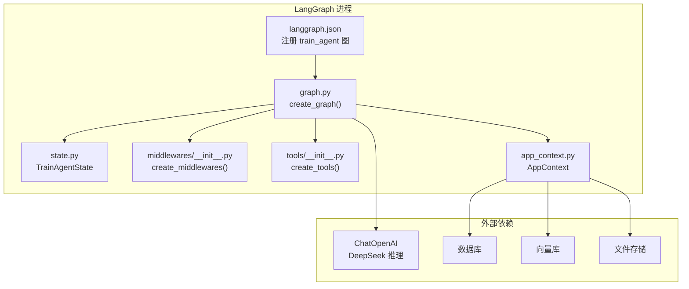
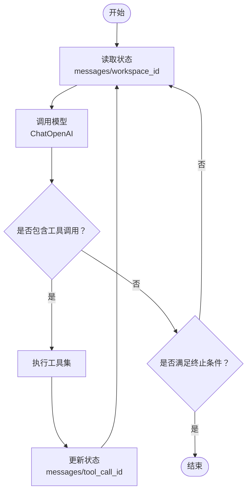
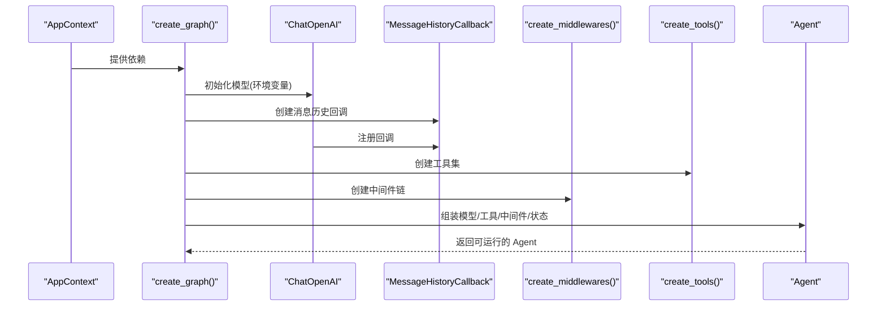
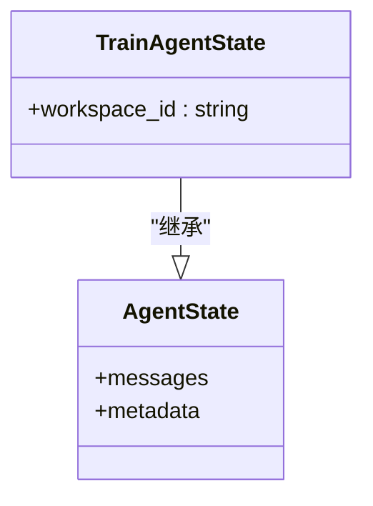
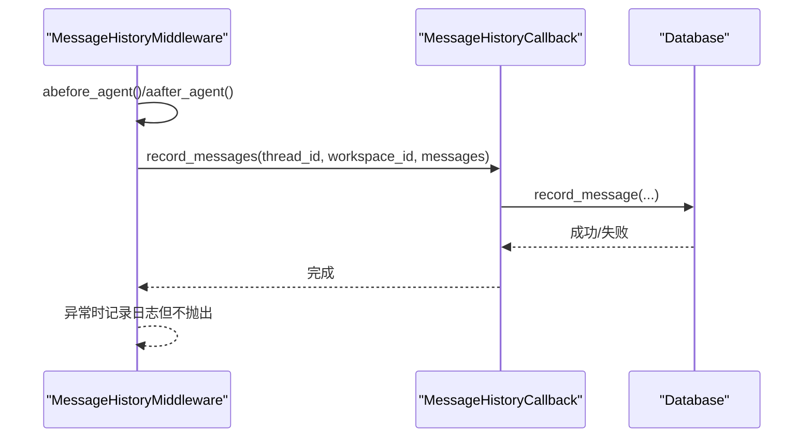
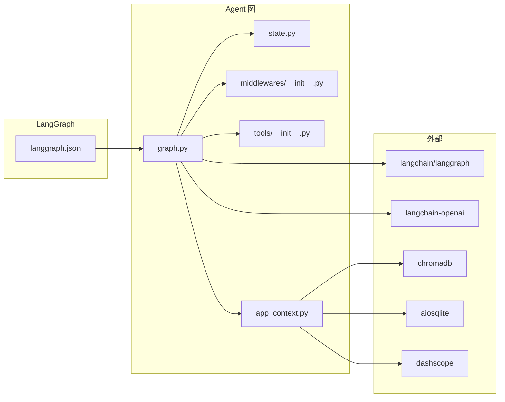

# Agent 图构建

<cite>
**本文引用的文件**
- [backend/src/agent/graph.py](file://backend/src/agent/graph.py)
- [backend/src/agent/state.py](file://backend/src/agent/state.py)
- [backend/src/agent/message_history.py](file://backend/src/agent/message_history.py)
- [backend/src/middlewares/__init__.py](file://backend/src/middlewares/__init__.py)
- [backend/src/tools/__init__.py](file://backend/src/tools/__init__.py)
- [backend/src/app_context.py](file://backend/src/app_context.py)
- [backend/langgraph.json](file://backend/langgraph.json)
- [backend/pyproject.toml](file://backend/pyproject.toml)
- [AGENTS.md](file://AGENTS.md)
</cite>

## 目录
1. [简介](#简介)
2. [项目结构](#项目结构)
3. [核心组件](#核心组件)
4. [架构总览](#架构总览)
5. [详细组件分析](#详细组件分析)
6. [依赖分析](#依赖分析)
7. [性能考虑](#性能考虑)
8. [故障排查指南](#故障排查指南)
9. [结论](#结论)
10. [附录](#附录)

## 简介
本文件围绕 Train Agent 的 Agent 图构建进行系统化技术文档整理，重点解释 LangGraph Agent 的节点定义、边连接与条件逻辑的设计原理；阐述 Agent 工作流的构建过程，覆盖普通节点、条件节点与终止单元的使用场景；说明节点间连接逻辑与数据传递机制；给出复杂工作流的定义思路与实践建议；并总结错误处理与异常恢复在 Agent 图中的实现方式。

## 项目结构
- 后端采用双进程架构：FastAPI 进程负责 REST API，LangGraph 进程负责 Agent 运行时（流式对话 + 工具调用）。两者共享存储（SQLite、ChromaDB、文件存储），但各自独立实例。
- Agent 图位于后端子模块中，通过 langgraph.json 将图暴露给 LangGraph CLI/Server。
- Agent 图的核心由以下部分组成：
  - 图构建器：负责装配模型、工具、中间件与状态模式
  - 状态模型：扩展基础 AgentState，增加 workspace_id 上下文
  - 中间件链：日志、消息历史持久化、请求清洗、文档上下文注入、摘要中间件等
  - 工具集合：问答检索、技能加载与运行、输出保存、澄清表单等

**图表来源**
- [backend/langgraph.json:1-9](file://backend/langgraph.json#L1-L9)
- [backend/src/agent/graph.py:1-49](file://backend/src/agent/graph.py#L1-L49)
- [backend/src/agent/state.py:1-7](file://backend/src/agent/state.py#L1-L7)
- [backend/src/middlewares/__init__.py:1-41](file://backend/src/middlewares/__init__.py#L1-L41)
- [backend/src/tools/__init__.py:1-20](file://backend/src/tools/__init__.py#L1-L20)
- [backend/src/app_context.py:1-31](file://backend/src/app_context.py#L1-L31)

**章节来源**
- [AGENTS.md:31-38](file://AGENTS.md#L31-L38)
- [backend/langgraph.json:1-9](file://backend/langgraph.json#L1-L9)
- [backend/src/agent/graph.py:1-49](file://backend/src/agent/graph.py#L1-L49)

## 核心组件
- 图构建器（create_graph）
  - 负责装配推理模型、消息历史回调、工具集与中间件链，并返回可运行的 Agent 实例
  - 关键点：模型参数来自环境变量；消息历史回调注入到模型回调列表；中间件链按顺序执行
- 状态模型（TrainAgentState）
  - 在基础 AgentState 上扩展 workspace_id 字段，用于多工作区隔离与上下文传递
- 中间件链（create_middlewares）
  - 日志前后置钩子、消息历史持久化、请求清洗、文档上下文注入、摘要中间件等
- 工具集（create_tools）
  - 包含澄清表单、RAG 检索、技能加载/运行、输出保存等工具
- 应用上下文（AppContext）
  - 封装数据库、向量库、文件存储与技能管理器，供工具与中间件使用

**章节来源**
- [backend/src/agent/graph.py:16-37](file://backend/src/agent/graph.py#L16-L37)
- [backend/src/agent/state.py:4-7](file://backend/src/agent/state.py#L4-L7)
- [backend/src/middlewares/__init__.py:18-40](file://backend/src/middlewares/__init__.py#L18-L40)
- [backend/src/tools/__init__.py:11-19](file://backend/src/tools/__init__.py#L11-L19)
- [backend/src/app_context.py:12-30](file://backend/src/app_context.py#L12-L30)

## 架构总览
Agent 图的运行时由 LangGraph 调度，内部以“节点”和“边”的形式组织控制流。根据当前代码实现，Agent 图采用“单节点 + 条件分支 + 终止”的简化结构：
- 单一推理节点：接收输入状态，调用模型与工具，更新状态
- 条件分支：根据状态中的终止条件或工具调用结果决定下一步
- 终止单元：结束会话或进入等待输入

[此图为概念性流程示意，不直接映射具体源码文件，故不附“图表来源”]

## 详细组件分析

### 组件一：图构建器（create_graph）
- 职责
  - 创建推理模型（ChatOpenAI），配置流式响应与思维开关
  - 注入消息历史回调至模型回调链
  - 组装工具集与中间件链
  - 返回可运行的 Agent 实例
- 数据流
  - 输入：AppContext（包含数据库、向量库、文件存储、技能管理器）
  - 输出：Agent 实例（可被 LangGraph CLI/Server 调用）

**图表来源**
- [backend/src/agent/graph.py:16-37](file://backend/src/agent/graph.py#L16-L37)
- [backend/src/agent/message_history.py:13-41](file://backend/src/agent/message_history.py#L13-L41)
- [backend/src/middlewares/__init__.py:18-40](file://backend/src/middlewares/__init__.py#L18-L40)
- [backend/src/tools/__init__.py:11-19](file://backend/src/tools/__init__.py#L11-L19)

**章节来源**
- [backend/src/agent/graph.py:16-37](file://backend/src/agent/graph.py#L16-L37)

### 组件二：状态模型（TrainAgentState）
- 职责
  - 扩展基础 AgentState，新增 workspace_id 字段，用于区分不同工作区的数据与上下文
- 使用场景
  - 在中间件与工具中读取 workspace_id，实现按工作区隔离的数据库/向量库/文件操作
  - 在消息历史中间件中传递 workspace_id，确保消息持久化到正确的上下文中

**图表来源**
- [backend/src/agent/state.py:4-7](file://backend/src/agent/state.py#L4-L7)

**章节来源**
- [backend/src/agent/state.py:4-7](file://backend/src/agent/state.py#L4-L7)

### 组件三：消息历史中间件与回调（MessageHistoryMiddleware/MessageHistoryCallback）
- 职责
  - 在 Agent 前后钩子中记录消息历史，排除摘要类消息
  - 支持从 runtime.execution_info 或 runtime.context 提取 thread_id
  - 将消息持久化到数据库，包含角色、类型、内容、工具调用信息等
- 错误处理
  - 记录异常但不中断 Agent 流程，保证消息历史持久化的容错性

**图表来源**
- [backend/src/agent/message_history.py:109-143](file://backend/src/agent/message_history.py#L109-L143)
- [backend/src/agent/message_history.py:19-41](file://backend/src/agent/message_history.py#L19-L41)

**章节来源**
- [backend/src/agent/message_history.py:13-143](file://backend/src/agent/message_history.py#L13-L143)

### 组件四：中间件链（create_middlewares）
- 职责
  - 按顺序装配多个中间件，形成统一的 Agent 生命周期钩子链
  - 包含日志、消息历史、请求清洗、文档上下文注入、摘要中间件等
- 设计要点
  - 中间件顺序至关重要，应遵循“前置日志 → 消息历史 → 请求清洗 → 文档上下文 → 后置日志 → 摘要”的常见顺序
  - 摘要中间件具备令牌阈值触发与消息窗口裁剪策略，有助于控制上下文长度

**章节来源**
- [backend/src/middlewares/__init__.py:18-40](file://backend/src/middlewares/__init__.py#L18-L40)

### 组件五：工具集（create_tools）
- 职责
  - 组装 Agent 可用工具，包括澄清表单、RAG 检索、技能加载/运行、输出保存等
- 作用
  - 作为 Agent 的动作能力扩展，配合条件逻辑实现“思考-行动-观察-反思”的循环

**章节来源**
- [backend/src/tools/__init__.py:11-19](file://backend/src/tools/__init__.py#L11-L19)

### 组件六：应用上下文（AppContext）
- 职责
  - 将数据库、向量库、文件存储与技能管理器打包为统一上下文，供工具与中间件使用
- 重要性
  - 通过 AppContext 解耦工具与中间件对底层存储的直接依赖，提升可测试性与可维护性

**章节来源**
- [backend/src/app_context.py:12-30](file://backend/src/app_context.py#L12-L30)

## 依赖分析
- 外部依赖
  - LangChain/LangGraph：Agent 核心框架与图调度
  - LangChain-OpenAI：接入 DeepSeek 推理服务
  - ChromaDB：向量检索
  - SQLite：消息与任务等结构化数据
  - DashScope：嵌入服务（在依赖声明中可见）
- 内部模块耦合
  - graph.py 依赖 state.py、middlewares/__init__.py、tools/__init__.py、app_context.py
  - langgraph.json 将图暴露给 LangGraph CLI/Server
  - pyproject.toml 声明了所有运行期依赖

**图表来源**
- [backend/langgraph.json:1-9](file://backend/langgraph.json#L1-L9)
- [backend/src/agent/graph.py:1-49](file://backend/src/agent/graph.py#L1-L49)
- [backend/src/agent/state.py:1-7](file://backend/src/agent/state.py#L1-L7)
- [backend/src/middlewares/__init__.py:1-41](file://backend/src/middlewares/__init__.py#L1-L41)
- [backend/src/tools/__init__.py:1-20](file://backend/src/tools/__init__.py#L1-L20)
- [backend/src/app_context.py:1-31](file://backend/src/app_context.py#L1-L31)
- [backend/pyproject.toml:6-26](file://backend/pyproject.toml#L6-L26)

**章节来源**
- [backend/pyproject.toml:6-26](file://backend/pyproject.toml#L6-L26)
- [backend/langgraph.json:1-9](file://backend/langgraph.json#L1-L9)

## 性能考虑
- 流式响应与思维开关
  - 模型初始化启用流式响应与思维开关，有助于提升交互体验与可观测性
- 上下文控制
  - 摘要中间件通过令牌阈值与消息窗口裁剪，避免上下文过长导致性能下降
- 存储访问
  - 通过 AppContext 统一管理数据库/向量库/文件存储，减少重复初始化成本
- 并发与回调
  - 消息历史回调为异步实现，避免阻塞主推理流程

[本节为通用性能建议，不直接分析具体文件，故不附“章节来源”]

## 故障排查指南
- 消息历史未持久化
  - 检查 thread_id 是否存在；确认中间件链中 MessageHistoryMiddleware 是否正确装配
  - 查看回调异常日志，确认数据库写入是否成功
- 工具调用失败
  - 检查工具注册与权限；确认 AppContext 提供的依赖（数据库/向量库/文件存储/技能管理器）可用
- 摘要中间件触发频繁
  - 调整触发阈值与保留窗口参数，平衡上下文质量与性能
- 环境变量缺失
  - 确认 MAIN_MODEL、DEEPSEEK_API_KEY、DEEPSEEK_API_BASE、DATA_DIR 等环境变量设置正确

**章节来源**
- [backend/src/agent/message_history.py:119-143](file://backend/src/agent/message_history.py#L119-L143)
- [backend/src/middlewares/__init__.py:31-40](file://backend/src/middlewares/__init__.py#L31-L40)
- [backend/src/agent/graph.py:18-26](file://backend/src/agent/graph.py#L18-L26)

## 结论
本项目的 Agent 图构建以简洁、稳定为核心原则：通过单一图入口装配模型、工具与中间件链，结合扩展状态模型实现工作区隔离；借助消息历史中间件与摘要中间件保障可观测性与上下文控制。该设计既满足当前需求，也为后续扩展（如引入条件节点与多节点协作）提供了清晰的边界与接口。

[本节为总结性内容，不直接分析具体文件，故不附“章节来源”]

## 附录

### A. Agent 工作流构建步骤（实践建议）
- 明确节点类型
  - 普通节点：执行推理或工具调用
  - 条件节点：根据状态判断下一步路径
  - 终止单元：结束会话或等待输入
- 设计连接逻辑
  - 从状态读取 messages/workspace_id，驱动条件判断
  - 工具调用后更新状态，形成“思考-行动-观察-反思”的闭环
- 数据传递机制
  - 通过状态对象传递消息与上下文；必要时在中间件中注入动态信息（如文档摘要）
- 错误处理与恢复
  - 在中间件与回调中捕获异常并记录日志；对可恢复错误提供重试或降级策略

[本节为方法论与最佳实践，不直接分析具体文件，故不附“章节来源”]