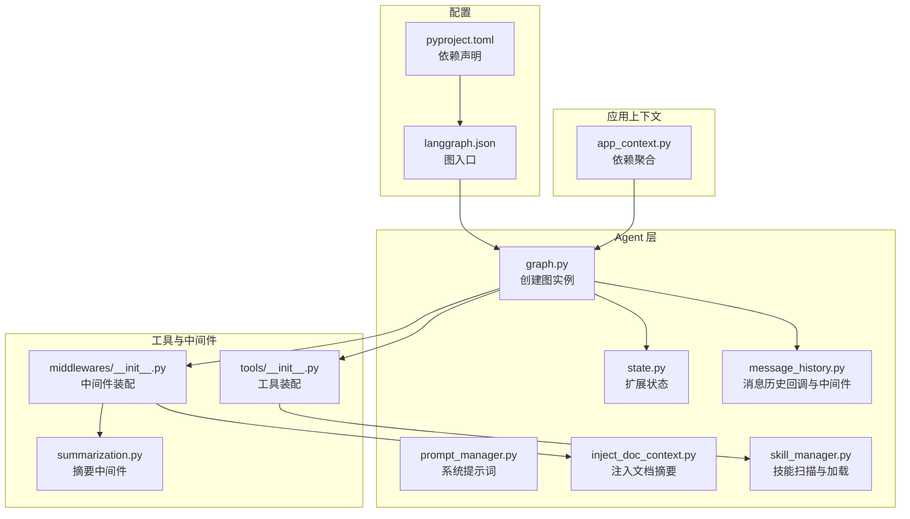
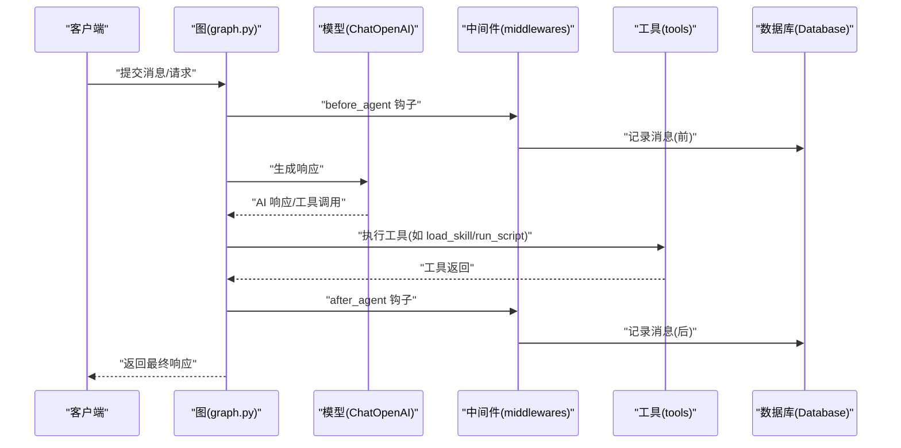
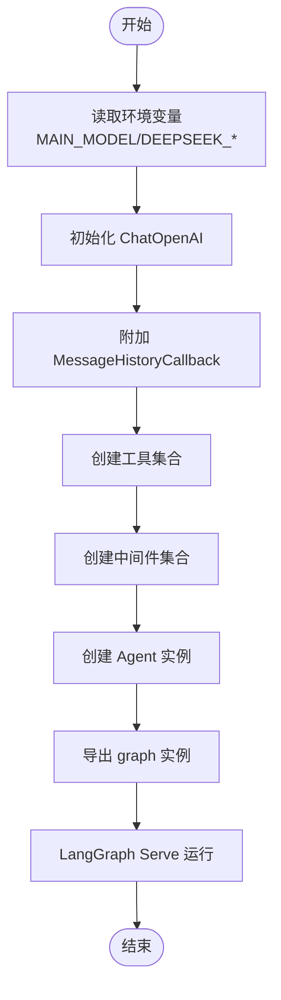
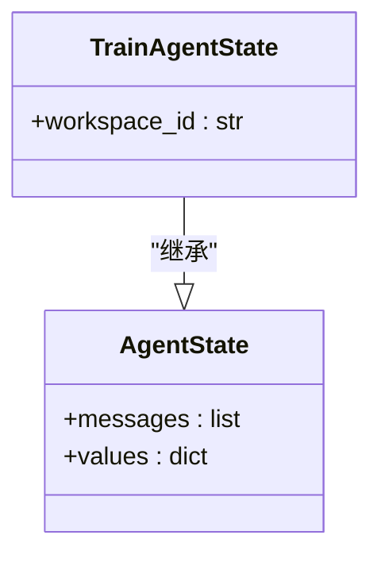
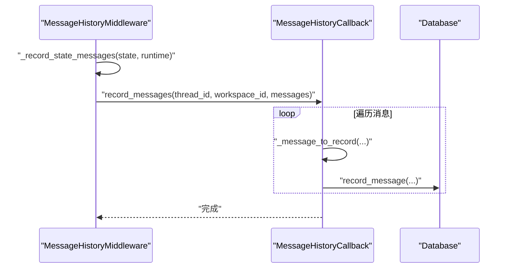
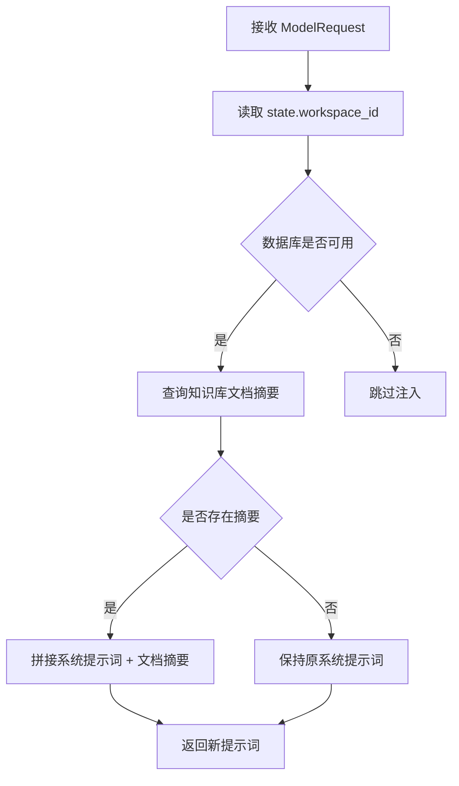
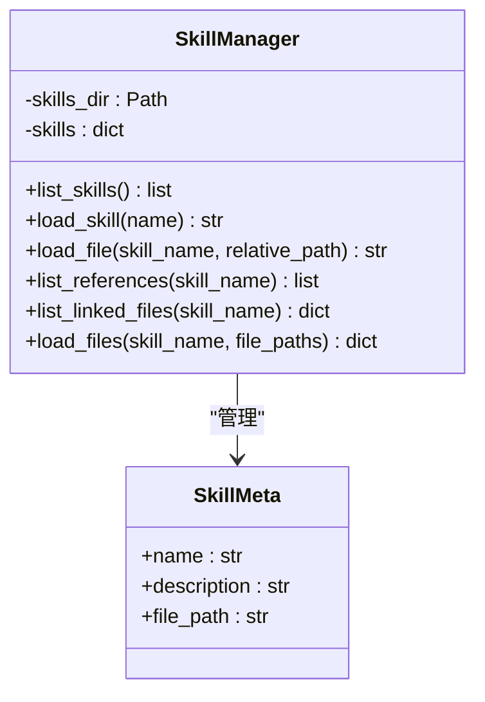
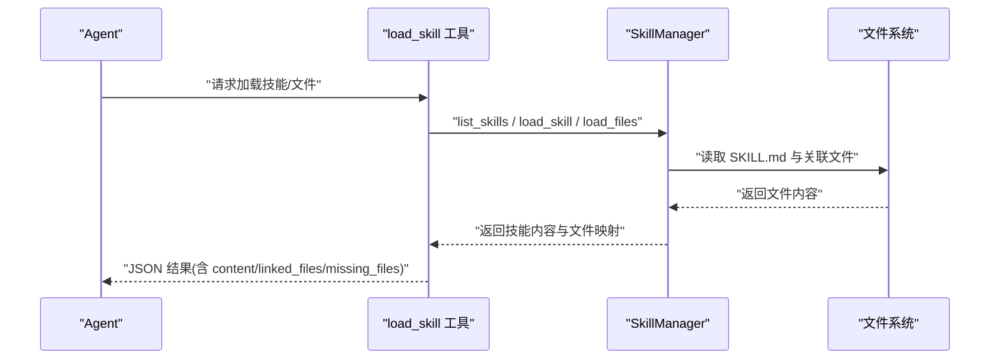
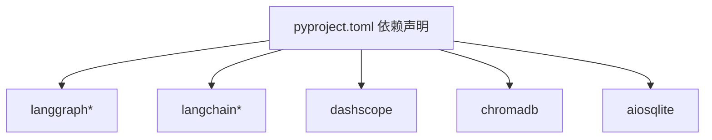

# Agent 层设计

<cite>
**本文档引用的文件**
- [backend/src/agent/graph.py](file://backend/src/agent/graph.py)
- [backend/src/agent/state.py](file://backend/src/agent/state.py)
- [backend/src/agent/message_history.py](file://backend/src/agent/message_history.py)
- [backend/src/agent/prompt_manager.py](file://backend/src/agent/prompt_manager.py)
- [backend/src/agent/skill_manager.py](file://backend/src/agent/skill_manager.py)
- [backend/src/middlewares/inject_doc_context.py](file://backend/src/middlewares/inject_doc_context.py)
- [backend/src/middlewares/summarization.py](file://backend/src/middlewares/summarization.py)
- [backend/src/middlewares/__init__.py](file://backend/src/middlewares/__init__.py)
- [backend/src/tools/__init__.py](file://backend/src/tools/__init__.py)
- [backend/src/tools/load_skill.py](file://backend/src/tools/load_skill.py)
- [backend/src/tools/run_skill_script.py](file://backend/src/tools/run_skill_script.py)
- [backend/src/app_context.py](file://backend/src/app_context.py)
- [backend/langgraph.json](file://backend/langgraph.json)
- [backend/pyproject.toml](file://backend/pyproject.toml)
- [backend/tests/test_message_history.py](file://backend/tests/test_message_history.py)
- [backend/tests/test_message_history_callback.py](file://backend/tests/test_message_history_callback.py)
</cite>

## 目录
1. [引言](#引言)
2. [项目结构](#项目结构)
3. [核心组件](#核心组件)
4. [架构总览](#架构总览)
5. [详细组件分析](#详细组件分析)
6. [依赖分析](#依赖分析)
7. [性能考虑](#性能考虑)
8. [故障排查指南](#故障排查指南)
9. [结论](#结论)
10. [附录](#附录)

## 引言
本文件面向 Train Agent 的 Agent 层设计，系统性阐述基于 LangGraph 的智能体构建方式，覆盖节点与边的组织、状态管理、消息历史持久化、提示词管理、技能体系与工具链集成，并提供工作流示例与调试方法，帮助开发者快速理解与扩展 Agent 能力。

## 项目结构
Agent 层位于后端代码的 src/agent 目录，围绕以下关键模块协同工作：
- 图构建与入口：graph.py 负责创建模型、工具、中间件与状态模式，导出可被 LangGraph CLI/Server 运行的图实例。
- 状态管理：state.py 扩展基础 AgentState，增加 workspace_id 上下文字段。
- 消息历史：message_history.py 提供回调与中间件，负责将消息持久化至数据库，并过滤摘要消息。
- 提示词管理：prompt_manager.py 定义系统提示词模板；inject_doc_context.py 将知识库文档摘要注入系统提示词。
- 技能管理：skill_manager.py 扫描技能目录，解析 SKILL.md 前言元数据，提供技能清单与文件加载能力。
- 工具与中间件：tools/__init__.py 与 middlewares/__init__.py 统一装配工具与中间件顺序，确保日志、净化、上下文注入、摘要等流程有序执行。
- 应用上下文：app_context.py 聚合数据库、向量库、文件存储与技能管理器，供图构建与工具使用。
- 配置与运行：langgraph.json 指定图入口与环境；pyproject.toml 描述依赖。

图表来源
- [backend/src/agent/graph.py:16-49](file://backend/src/agent/graph.py#L16-L49)
- [backend/src/agent/state.py:4-7](file://backend/src/agent/state.py#L4-L7)
- [backend/src/agent/message_history.py:13-143](file://backend/src/agent/message_history.py#L13-L143)
- [backend/src/agent/prompt_manager.py:1-37](file://backend/src/agent/prompt_manager.py#L1-L37)
- [backend/src/agent/skill_manager.py:14-117](file://backend/src/agent/skill_manager.py#L14-L117)
- [backend/src/middlewares/inject_doc_context.py:11-41](file://backend/src/middlewares/inject_doc_context.py#L11-L41)
- [backend/src/middlewares/summarization.py:7-58](file://backend/src/middlewares/summarization.py#L7-L58)
- [backend/src/middlewares/__init__.py:18-41](file://backend/src/middlewares/__init__.py#L18-L41)
- [backend/src/tools/__init__.py:11-20](file://backend/src/tools/__init__.py#L11-L20)
- [backend/src/app_context.py:12-31](file://backend/src/app_context.py#L12-L31)
- [backend/langgraph.json:1-9](file://backend/langgraph.json#L1-L9)
- [backend/pyproject.toml:1-41](file://backend/pyproject.toml#L1-L41)

章节来源
- [backend/src/agent/graph.py:16-49](file://backend/src/agent/graph.py#L16-L49)
- [backend/src/app_context.py:12-31](file://backend/src/app_context.py#L12-L31)
- [backend/langgraph.json:1-9](file://backend/langgraph.json#L1-L9)

## 核心组件
- 图构建器：创建 LLM、消息历史回调、工具与中间件，返回 LangGraph Agent 实例；默认图通过环境变量初始化。
- 状态扩展：在基础 AgentState 上增加 workspace_id，用于跨会话与工作区上下文传递。
- 消息历史：异步回调记录人类、AI、工具消息；中间件在代理前后钩子中触发持久化；过滤掉摘要消息以避免循环与冗余。
- 提示词管理：系统提示词集中维护；动态注入当前工作区文档摘要，增强 RAG 上下文。
- 技能管理：扫描 skills 目录，解析 SKILL.md 前言，提供技能清单、主提示加载、引用文件与脚本安全执行。
- 工具与中间件：统一装配顺序，确保日志、净化、上下文注入、摘要等流程稳定可控。

章节来源
- [backend/src/agent/graph.py:16-49](file://backend/src/agent/graph.py#L16-L49)
- [backend/src/agent/state.py:4-7](file://backend/src/agent/state.py#L4-L7)
- [backend/src/agent/message_history.py:13-143](file://backend/src/agent/message_history.py#L13-L143)
- [backend/src/agent/prompt_manager.py:1-37](file://backend/src/agent/prompt_manager.py#L1-L37)
- [backend/src/agent/skill_manager.py:14-117](file://backend/src/agent/skill_manager.py#L14-L117)
- [backend/src/middlewares/__init__.py:18-41](file://backend/src/middlewares/__init__.py#L18-L41)
- [backend/src/tools/__init__.py:11-20](file://backend/src/tools/__init__.py#L11-L20)

## 架构总览
Agent 层采用“图 + 状态 + 中间件 + 工具”的组合架构。图构建器负责组装模型、工具与中间件；状态承载 workspace_id；消息历史中间件在代理前后持久化消息；提示词中间件注入文档摘要；技能管理器提供技能清单与文件加载；工具链提供澄清表单、RAG 搜索、技能加载、输出保存、脚本执行等能力。

图表来源
- [backend/src/agent/graph.py:16-49](file://backend/src/agent/graph.py#L16-L49)
- [backend/src/middlewares/__init__.py:18-41](file://backend/src/middlewares/__init__.py#L18-L41)
- [backend/src/agent/message_history.py:109-143](file://backend/src/agent/message_history.py#L109-L143)
- [backend/src/tools/__init__.py:11-20](file://backend/src/tools/__init__.py#L11-L20)

## 详细组件分析

### 图构建与运行流
- 模型配置：从环境变量读取主模型、密钥与基地址，启用流式输出与思考开关。
- 消息历史回调：将回调加入模型回调列表，确保每次推理都会触发消息持久化。
- 工具与中间件：通过工厂函数创建工具与中间件，保证依赖注入与顺序可控。
- 默认图：LangGraph Serve 使用 langgraph.json 指定入口，自动加载默认图实例。

图表来源
- [backend/src/agent/graph.py:16-49](file://backend/src/agent/graph.py#L16-L49)
- [backend/langgraph.json:4-6](file://backend/langgraph.json#L4-L6)

章节来源
- [backend/src/agent/graph.py:16-49](file://backend/src/agent/graph.py#L16-L49)
- [backend/langgraph.json:1-9](file://backend/langgraph.json#L1-L9)

### 状态管理
- 状态扩展：继承基础 AgentState，新增 workspace_id 字段，便于跨线程与工作区隔离。
- 状态转换：由中间件与工具在代理生命周期中更新；消息历史中间件在 before/after 钩子中读取 state 并持久化。

图表来源
- [backend/src/agent/state.py:4-7](file://backend/src/agent/state.py#L4-L7)

章节来源
- [backend/src/agent/state.py:4-7](file://backend/src/agent/state.py#L4-L7)

### 消息历史管理
- 回调职责：遍历消息，过滤非人类/AI/工具消息与摘要消息，标准化为持久化记录，写入数据库。
- 中间件职责：在代理前后钩子中读取 thread_id 与 workspace_id，批量记录消息。
- 存储与检索：数据库层提供按 thread_id 分页查询与游标迭代；测试验证了消息去重、工具调用字段序列化与分页游标。
- 清理策略：摘要中间件控制摘要频率与保留窗口，避免上下文膨胀。

图表来源
- [backend/src/agent/message_history.py:19-41](file://backend/src/agent/message_history.py#L19-L41)
- [backend/src/agent/message_history.py:119-125](file://backend/src/agent/message_history.py#L119-L125)

章节来源
- [backend/src/agent/message_history.py:13-143](file://backend/src/agent/message_history.py#L13-L143)
- [backend/tests/test_message_history.py:8-65](file://backend/tests/test_message_history.py#L8-L65)
- [backend/tests/test_message_history_callback.py:8-85](file://backend/tests/test_message_history_callback.py#L8-L85)

### 提示词管理器
- 系统提示词：集中定义角色、规范、引用规则与技能使用指引。
- 动态注入：根据 workspace_id 查询知识库文档摘要，拼接到系统提示词末尾，增强 RAG 上下文。
- 多语言支持：当前系统提示词为中文；若需国际化，可在前端或中间件层扩展为多语言模板映射。

图表来源
- [backend/src/middlewares/inject_doc_context.py:14-40](file://backend/src/middlewares/inject_doc_context.py#L14-L40)
- [backend/src/agent/prompt_manager.py:1-37](file://backend/src/agent/prompt_manager.py#L1-L37)

章节来源
- [backend/src/middlewares/inject_doc_context.py:11-41](file://backend/src/middlewares/inject_doc_context.py#L11-L41)
- [backend/src/agent/prompt_manager.py:1-37](file://backend/src/agent/prompt_manager.py#L1-L37)

### 技能管理系统
- 扫描与注册：遍历 skills 目录，查找每个子目录中的 SKILL.md，解析前言元数据，建立技能字典。
- 发现与加载：提供 list_skills 返回技能清单；load_skill 返回技能主提示；load_file 支持相对路径安全加载。
- 关联文件：列出 references、templates、scripts、assets 等子目录下的文件，便于工具按需加载。
- 批量加载：支持一次性加载多个文件，返回缺失文件列表以便反馈。

图表来源
- [backend/src/agent/skill_manager.py:7-117](file://backend/src/agent/skill_manager.py#L7-L117)

章节来源
- [backend/src/agent/skill_manager.py:14-117](file://backend/src/agent/skill_manager.py#L14-L117)

### 工具链与工作流
- 工具装配：统一在 tools/__init__.py 中创建工具，包括澄清表单、RAG 搜索、技能加载、输出保存、脚本执行。
- 技能加载工具：动态生成工具描述，展示可用技能清单；支持加载技能主提示与关联文件；限制批量文件数量。
- 脚本执行工具：仅允许在技能 scripts/ 目录内执行，支持 bash/python/node/tsx；限制超时与输出长度；返回标准输出/错误信息。

图表来源
- [backend/src/tools/load_skill.py:13-116](file://backend/src/tools/load_skill.py#L13-L116)
- [backend/src/agent/skill_manager.py:51-117](file://backend/src/agent/skill_manager.py#L51-L117)

章节来源
- [backend/src/tools/__init__.py:11-20](file://backend/src/tools/__init__.py#L11-L20)
- [backend/src/tools/load_skill.py:13-116](file://backend/src/tools/load_skill.py#L13-L116)
- [backend/src/tools/run_skill_script.py:31-143](file://backend/src/tools/run_skill_script.py#L31-L143)

## 依赖分析
- LangGraph 生态：langgraph、langgraph-api、langgraph-cli 提供图运行与 CLI 能力。
- LLM 与社区：langchain、langchain-openai、langchain-community、dashscope 等。
- 存储与向量化：chromadb、aiosqlite、python-multipart。
- 其他：httpx、python-dotenv、pyyaml、langchain-deepseek。

图表来源
- [backend/pyproject.toml:6-26](file://backend/pyproject.toml#L6-L26)

章节来源
- [backend/pyproject.toml:1-41](file://backend/pyproject.toml#L1-L41)

## 性能考虑
- 流式输出：模型启用流式输出，提升交互体验。
- 摘要中间件：通过最小消息间隔与令牌阈值控制摘要触发，减少上下文膨胀。
- 输出截断：脚本执行工具对超长输出进行截断，避免撑爆上下文。
- 数据库存取：消息分页与游标迭代，降低查询成本。

## 故障排查指南
- 消息未持久化
  - 检查 MessageHistoryMiddleware 是否正确注入；确认 runtime 中 thread_id 来源。
  - 查看回调日志与异常捕获，定位数据库写入失败原因。
- 摘要消息误记录
  - 确认消息的 additional_kwargs 中 lc_source 标记；回调会过滤该类消息。
- 技能加载失败
  - 检查技能名称是否存在于 list_skills；确认相对路径未越界；查看缺失文件列表。
- 脚本执行超时或失败
  - 调整超时时间；检查脚本类型与解释器映射；关注返回码与标准错误输出。
- 文档摘要未注入
  - 确认 workspace_id 正确；检查数据库连接与初始化；确认存在有效摘要。

章节来源
- [backend/src/agent/message_history.py:109-143](file://backend/src/agent/message_history.py#L109-L143)
- [backend/tests/test_message_history_callback.py:60-85](file://backend/tests/test_message_history_callback.py#L60-L85)
- [backend/src/tools/load_skill.py:49-74](file://backend/src/tools/load_skill.py#L49-L74)
- [backend/src/tools/run_skill_script.py:112-134](file://backend/src/tools/run_skill_script.py#L112-L134)
- [backend/src/middlewares/inject_doc_context.py:18-26](file://backend/src/middlewares/inject_doc_context.py#L18-L26)

## 结论
Agent 层通过清晰的模块划分与严格的依赖注入，实现了可扩展、可观测、可维护的智能体系统。状态、消息历史、提示词与技能体系共同构成 Agent 的认知与行动边界；工具与中间件保障了安全性与稳定性。结合 LangGraph 的运行生态，Agent 能够在复杂工作流中稳健演进。

## 附录
- 实际工作流示例
  - 用户提问 → 代理生成 AI 响应/工具调用 → 工具执行（如加载技能/脚本）→ 消息历史持久化 → 摘要中间件按需压缩 → 返回最终响应。
- 调试方法
  - 启用日志中间件观察 before/after 钩子；使用 LangGraph CLI 观察图状态；在数据库中核对消息分页与字段序列化；针对技能加载与脚本执行打印详细上下文。