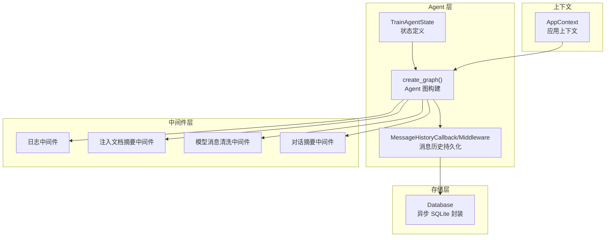
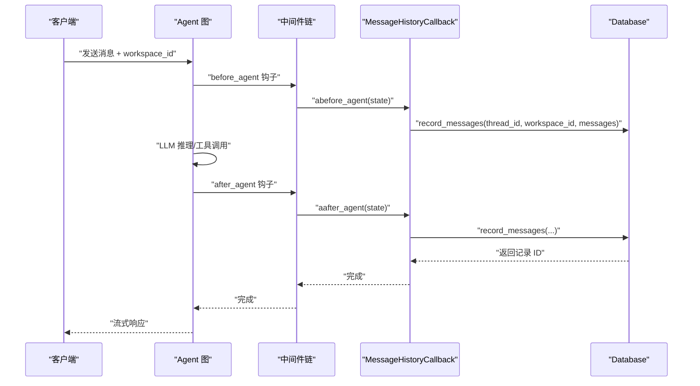
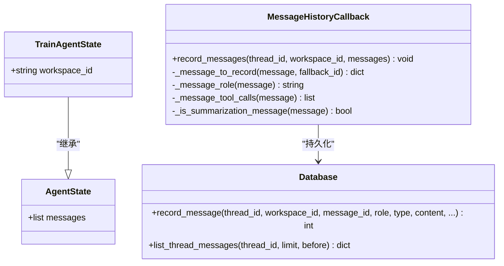
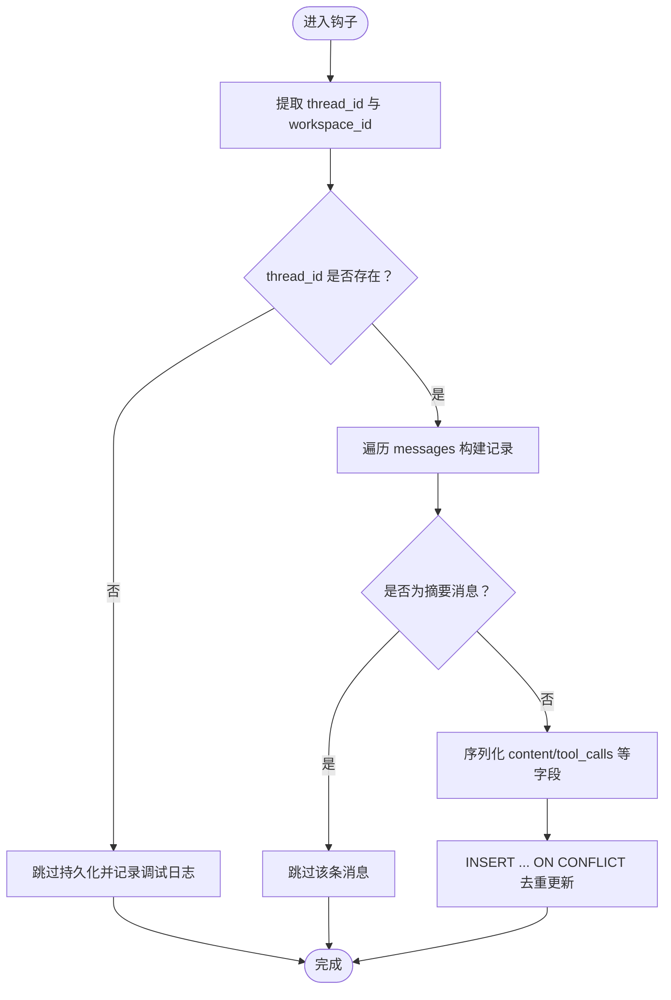
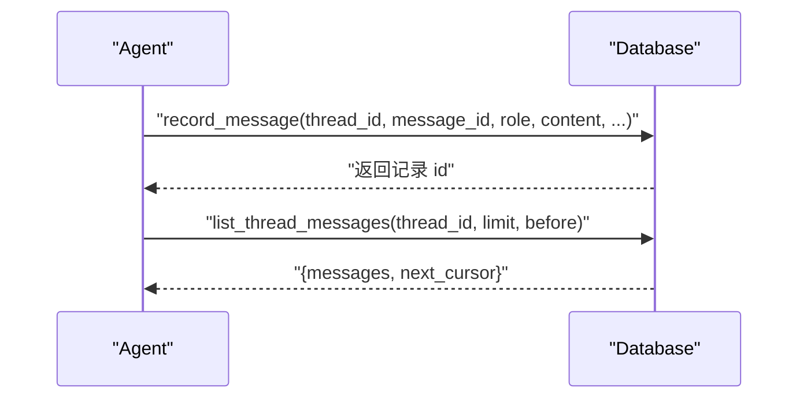
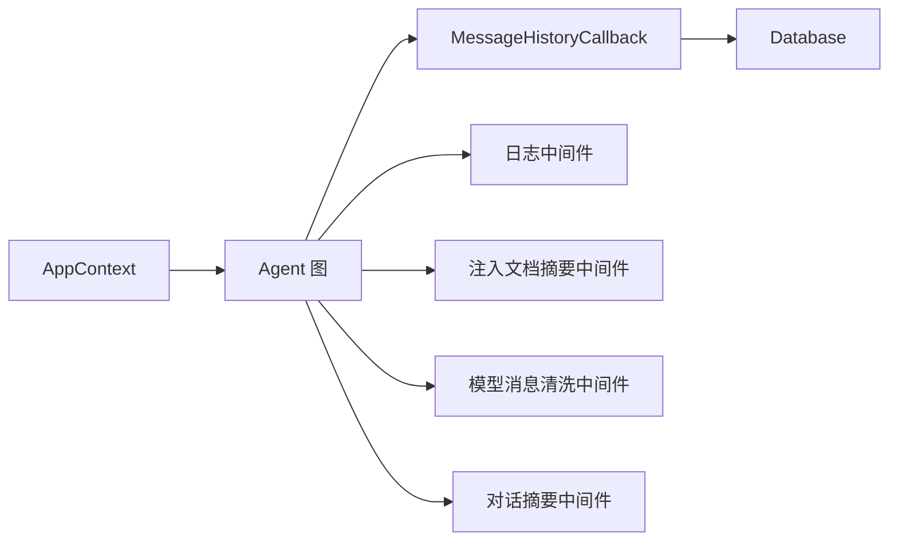

# Agent 状态管理

<cite>
**本文引用的文件**
- [state.py](file://backend/src/agent/state.py)
- [graph.py](file://backend/src/agent/graph.py)
- [message_history.py](file://backend/src/agent/message_history.py)
- [database.py](file://backend/src/storage/database.py)
- [app_context.py](file://backend/src/app_context.py)
- [logging_middlewares.py](file://backend/src/middlewares/logging_middlewares.py)
- [inject_doc_context.py](file://backend/src/middlewares/inject_doc_context.py)
- [model_message_sanitizer.py](file://backend/src/middlewares/model_message_sanitizer.py)
- [summarization.py](file://backend/src/middlewares/summarization.py)
- [backend-architecture.md](file://docs/backend-architecture.md)
</cite>

## 目录
1. [简介](#简介)
2. [项目结构](#项目结构)
3. [核心组件](#核心组件)
4. [架构总览](#架构总览)
5. [详细组件分析](#详细组件分析)
6. [依赖分析](#依赖分析)
7. [性能考虑](#性能考虑)
8. [故障排查指南](#故障排查指南)
9. [结论](#结论)
10. [附录](#附录)

## 简介
本文件围绕 Train Agent 的 Agent 状态管理系统进行系统性技术文档整理，重点覆盖以下方面：
- Agent 状态的数据结构设计：字段定义、数据类型、默认值与约束
- 状态转换逻辑：触发条件、转换规则、验证机制
- 状态持久化与恢复：序列化策略、存储方案、并发安全
- 最佳实践与常见问题解决
- 状态监控与调试方法

该系统采用 LangGraph 作为运行时，结合中间件、回调与存储层，形成“状态驱动 + 持久化 + 监控”的闭环。

## 项目结构
与状态管理直接相关的核心文件分布如下：
- Agent 层：状态定义与图构建
  - backend/src/agent/state.py：Agent 状态扩展
  - backend/src/agent/graph.py：Agent 图创建与中间件装配
  - backend/src/agent/message_history.py：消息历史持久化回调与中间件
- 存储层：异步 SQLite 封装
  - backend/src/storage/database.py：消息记录、查询与迁移
- 上下文与中间件：状态注入、日志、模型消息清洗、摘要
  - backend/src/app_context.py：应用上下文（含数据库实例）
  - backend/src/middlewares/logging_middlewares.py：状态日志中间件
  - backend/src/middlewares/inject_doc_context.py：动态注入文档摘要
  - backend/src/middlewares/model_message_sanitizer.py：模型消息清洗
  - backend/src/middlewares/summarization.py：对话摘要中间件
- 架构文档：整体背景与数据流
  - docs/backend-architecture.md：双进程架构与分层设计

图表来源
- [state.py:1-7](file://backend/src/agent/state.py#L1-L7)
- [graph.py:16-37](file://backend/src/agent/graph.py#L16-L37)
- [message_history.py:13-41](file://backend/src/agent/message_history.py#L13-L41)
- [database.py:9-78](file://backend/src/storage/database.py#L9-L78)
- [app_context.py:12-30](file://backend/src/app_context.py#L12-L30)

章节来源
- [backend-architecture.md:18-46](file://docs/backend-architecture.md#L18-L46)

## 核心组件
- TrainAgentState：在 LangChain AgentState 基础上扩展 workspace_id 字段，用于工作区级上下文隔离与持久化。
- MessageHistoryCallback/Middleware：在 Agent 前后钩子中抽取 state 中 messages，解析为统一记录并持久化至数据库；同时过滤掉摘要类消息。
- Database：提供 record_message/list_thread_messages 等接口，负责消息记录的去重、JSON 序列化/反序列化、索引与查询游标。
- 中间件体系：日志、文档摘要注入、模型消息清洗、对话摘要，共同保障状态一致性与用户体验。
- AppContext：统一注入数据库实例，供 Agent 图与工具链使用。

章节来源
- [state.py:4-7](file://backend/src/agent/state.py#L4-L7)
- [message_history.py:13-143](file://backend/src/agent/message_history.py#L13-L143)
- [database.py:172-280](file://backend/src/storage/database.py#L172-L280)
- [logging_middlewares.py:15-59](file://backend/src/middlewares/logging_middlewares.py#L15-L59)
- [inject_doc_context.py:11-41](file://backend/src/middlewares/inject_doc_context.py#L11-L41)
- [model_message_sanitizer.py:105-122](file://backend/src/middlewares/model_message_sanitizer.py#L105-L122)
- [summarization.py:7-58](file://backend/src/middlewares/summarization.py#L7-L58)
- [app_context.py:12-30](file://backend/src/app_context.py#L12-L30)

## 架构总览
Agent 状态管理贯穿“状态定义—中间件—回调—存储—查询”全流程。Agent 图在创建时指定 state_schema 为 TrainAgentState，并装配多个中间件以增强状态可见性与稳定性。消息历史通过回调与中间件在 Agent 前后钩子中被持久化，避免与 LangGraph 内部状态混杂。

图表来源
- [graph.py:32-37](file://backend/src/agent/graph.py#L32-L37)
- [message_history.py:113-127](file://backend/src/agent/message_history.py#L113-L127)
- [database.py:172-228](file://backend/src/storage/database.py#L172-L228)

## 详细组件分析

### 状态数据结构设计
- 继承关系：TrainAgentState 继承自 LangChain AgentState，复用其内置字段（如 messages）。
- 扩展字段：workspace_id（字符串），用于工作区级上下文隔离与持久化。
- 默认值与约束：
  - workspace_id 由前端在流式请求中传入，若缺失则中间件记录日志但不阻断。
  - messages 字段由 LangGraph 管理，中间件与回调均基于该字段进行序列化与持久化。
- 字段类型与序列化：
  - JSON 序列化：content、tool_calls、additional_kwargs、response_metadata 在写入数据库前统一转为 JSON 字符串。
  - JSON 反序列化：读取时对上述字段进行安全回填，失败时使用默认值兜底。

图表来源
- [state.py:4-7](file://backend/src/agent/state.py#L4-L7)
- [message_history.py:13-107](file://backend/src/agent/message_history.py#L13-L107)
- [database.py:172-280](file://backend/src/storage/database.py#L172-L280)

章节来源
- [state.py:4-7](file://backend/src/agent/state.py#L4-L7)
- [database.py:159-171](file://backend/src/storage/database.py#L159-L171)

### 状态转换逻辑与验证机制
- 触发条件：
  - Agent 前后钩子：before_agent/after_agent 会在每次推理循环前后触发。
  - 模型调用前后：before_model/after_model 用于记录上下文长度与工具调用情况。
  - 摘要中间件：当满足令牌阈值与最小消息间隔时触发摘要注入。
- 转换规则：
  - 消息历史持久化：在钩子中读取 state["messages"]，过滤非人类/AI/工具消息与摘要消息，写入数据库。
  - 文档摘要注入：动态拼接当前 workspace 的文档摘要，注入系统提示词。
  - 模型消息清洗：移除不受支持的内容部件类型，清理不匹配的 tool_calls，确保与模型兼容。
- 验证机制：
  - thread_id 提取：优先从 runtime.execution_info.thread_id，其次从 runtime.context.thread_id，最后从 runtime.config.configurable.thread_id。
  - 去重策略：INSERT ... ON CONFLICT(thread_id, message_id, role) DO UPDATE，保证幂等。
  - 日志记录：异常捕获并记录，不影响主流程。

图表来源
- [message_history.py:19-41](file://backend/src/agent/message_history.py#L19-L41)
- [message_history.py:119-143](file://backend/src/agent/message_history.py#L119-L143)
- [database.py:190-228](file://backend/src/storage/database.py#L190-L228)

章节来源
- [message_history.py:113-143](file://backend/src/agent/message_history.py#L113-L143)
- [logging_middlewares.py:15-59](file://backend/src/middlewares/logging_middlewares.py#L15-L59)
- [summarization.py:19-47](file://backend/src/middlewares/summarization.py#L19-L47)

### 状态持久化与恢复机制
- 序列化策略：
  - JSON 编解码：content、tool_calls、additional_kwargs、response_metadata 统一序列化，失败时回退为空对象或空数组。
  - 时间戳：created_at/updated_at 使用 ISO8601 字符串，便于排序与展示。
- 存储策略：
  - 表结构：message 表包含 thread_id、message_id、role/type、content、工具调用与元数据，以及索引 idx_message_thread_id_id。
  - 去重与更新：基于 (thread_id, message_id, role) 唯一键，冲突时更新其余字段并刷新 updated_at。
- 并发安全：
  - 异步连接：aiosqlite 提供异步连接池与事务语义，避免阻塞。
  - 独立实例：LangGraph 与 FastAPI 进程各自持有 Database 实例，通过文件锁与 SQLite WAL 模式协同。
- 恢复与查询：
  - 列表查询：支持 limit/before 游标分页，返回 next_cursor 以便前端无限滚动。
  - 恢复渲染：读取时对 JSON 字段进行安全回填，保证 UI 层稳定显示。

图表来源
- [database.py:172-228](file://backend/src/storage/database.py#L172-L228)
- [database.py:230-280](file://backend/src/storage/database.py#L230-L280)

章节来源
- [database.py:25-78](file://backend/src/storage/database.py#L25-L78)
- [database.py:159-171](file://backend/src/storage/database.py#L159-L171)

### 中间件与状态注入
- 日志中间件：在 Agent 前后与模型调用前后记录 workspace_id 与消息数量/工具调用，便于观测状态变化。
- 文档摘要注入：动态从数据库读取当前 workspace 的文档摘要，拼接到系统提示词末尾，增强上下文相关性。
- 模型消息清洗：移除不受支持的内容部件类型，清理不匹配的 tool_calls，确保与模型兼容。
- 对话摘要：根据令牌阈值与最小消息间隔决定是否插入摘要消息，避免上下文过长。

章节来源
- [logging_middlewares.py:15-59](file://backend/src/middlewares/logging_middlewares.py#L15-L59)
- [inject_doc_context.py:11-41](file://backend/src/middlewares/inject_doc_context.py#L11-L41)
- [model_message_sanitizer.py:62-103](file://backend/src/middlewares/model_message_sanitizer.py#L62-L103)
- [summarization.py:7-58](file://backend/src/middlewares/summarization.py#L7-L58)

## 依赖分析
- 组件耦合：
  - Agent 图依赖 AppContext 提供的 Database 实例，确保中间件与回调可访问存储。
  - MessageHistoryCallback 与 Database 强耦合，负责消息持久化的具体实现。
  - 多个中间件共享 workspace_id 与 messages 字段，形成状态可见性与一致性保障。
- 外部依赖：
  - LangGraph/LangChain：提供 AgentState、中间件框架与钩子机制。
  - aiosqlite：提供异步 SQLite 访问能力。
- 潜在循环依赖：
  - 文件间为单向依赖（graph -> message_history -> database），无循环。

图表来源
- [app_context.py:12-30](file://backend/src/app_context.py#L12-L30)
- [graph.py:16-37](file://backend/src/agent/graph.py#L16-L37)
- [message_history.py:13-41](file://backend/src/agent/message_history.py#L13-L41)
- [database.py:9-20](file://backend/src/storage/database.py#L9-L20)

章节来源
- [graph.py:16-37](file://backend/src/agent/graph.py#L16-L37)
- [app_context.py:12-30](file://backend/src/app_context.py#L12-L30)

## 性能考虑
- 异步 I/O：Database 使用 aiosqlite，避免阻塞事件循环，适合高并发请求。
- 去重与索引：message 表对 (thread_id, message_id, role) 建唯一索引，ON CONFLICT 语句减少重复写入。
- 分页查询：list_thread_messages 限制每页最大 100 条，配合 next_cursor 实现高效翻页。
- 摘要策略：通过令牌阈值与最小消息间隔控制摘要频率，平衡上下文长度与成本。
- 模型消息清洗：提前清理不兼容内容，减少后续重试与错误开销。

## 故障排查指南
- 现象：消息历史未持久化
  - 检查 thread_id 是否存在：中间件会尝试从 execution_info/context/configurable 提取，若均为空则跳过。
  - 检查消息类型：仅 human/ai/tool 会被记录，摘要消息会被过滤。
  - 查看日志：中间件在异常时会记录失败信息。
- 现象：workspace_id 缺失导致上下文不正确
  - 确认前端在流式请求中传递 workspace_id。
  - 中间件会记录 workspace_id，若缺失则使用默认值。
- 现象：模型调用报错或工具调用不匹配
  - 使用模型消息清洗中间件，确保 content 部件类型与 tool_calls 与后续 ToolMessage 匹配。
- 现象：上下文过长导致成本上升
  - 调整摘要中间件的触发阈值与最小消息间隔，或在前端控制消息密度。

章节来源
- [message_history.py:19-41](file://backend/src/agent/message_history.py#L19-L41)
- [message_history.py:119-143](file://backend/src/agent/message_history.py#L119-L143)
- [logging_middlewares.py:15-59](file://backend/src/middlewares/logging_middlewares.py#L15-L59)
- [model_message_sanitizer.py:105-122](file://backend/src/middlewares/model_message_sanitizer.py#L105-L122)
- [summarization.py:19-47](file://backend/src/middlewares/summarization.py#L19-L47)

## 结论
Train Agent 的状态管理以 TrainAgentState 为核心，结合中间件与回调，在 Agent 生命周期的关键节点对状态进行可观测、可持久化与可恢复。通过异步 SQLite 存储、消息清洗与摘要策略，系统在保证一致性的同时兼顾性能与可维护性。建议在生产环境中持续关注 thread_id 提取、消息类型过滤与摘要触发策略的配置，以获得最佳体验。

## 附录
- 状态字段清单
  - workspace_id：字符串，工作区标识，用于上下文隔离与持久化
  - messages：列表，消息历史，包含 human/ai/tool 等消息对象
- 关键接口路径
  - 状态定义：[TrainAgentState:4-7](file://backend/src/agent/state.py#L4-L7)
  - Agent 图创建：[create_graph:16-37](file://backend/src/agent/graph.py#L16-L37)
  - 消息持久化：[record_message:172-228](file://backend/src/storage/database.py#L172-L228)
  - 消息查询：[list_thread_messages:230-262](file://backend/src/storage/database.py#L230-L262)
  - 消息历史中间件：[MessageHistoryMiddleware:109-143](file://backend/src/agent/message_history.py#L109-L143)
  - 日志中间件：[log_before_agent/log_after_agent:15-34](file://backend/src/middlewares/logging_middlewares.py#L15-L34)
  - 文档摘要注入：[inject_doc_context:11-41](file://backend/src/middlewares/inject_doc_context.py#L11-L41)
  - 模型消息清洗：[sanitize_model_request:105-122](file://backend/src/middlewares/model_message_sanitizer.py#L105-L122)
  - 对话摘要：[TrainAgentSummarizationMiddleware:7-58](file://backend/src/middlewares/summarization.py#L7-L58)