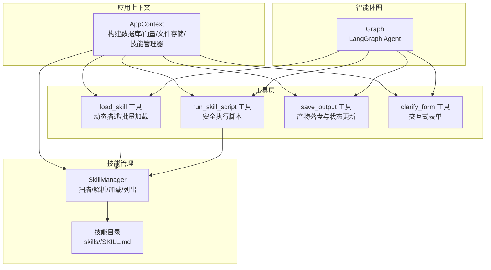
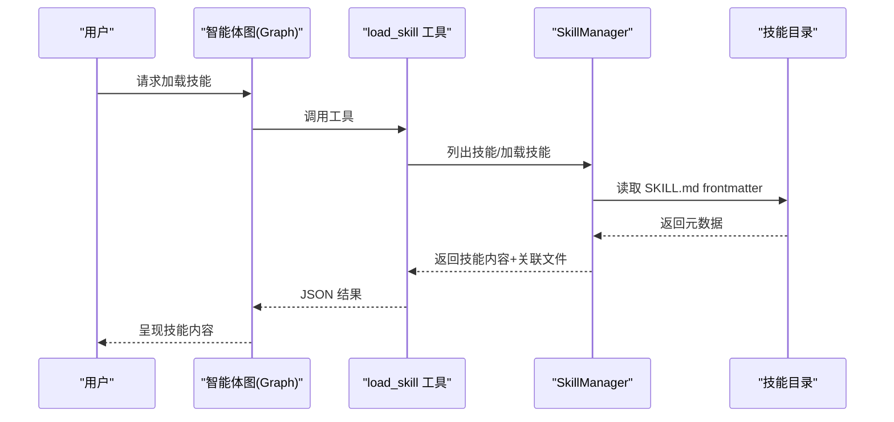
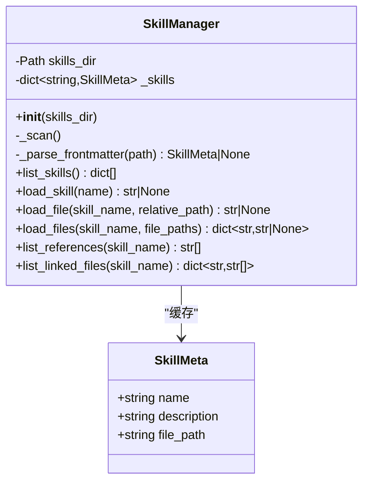
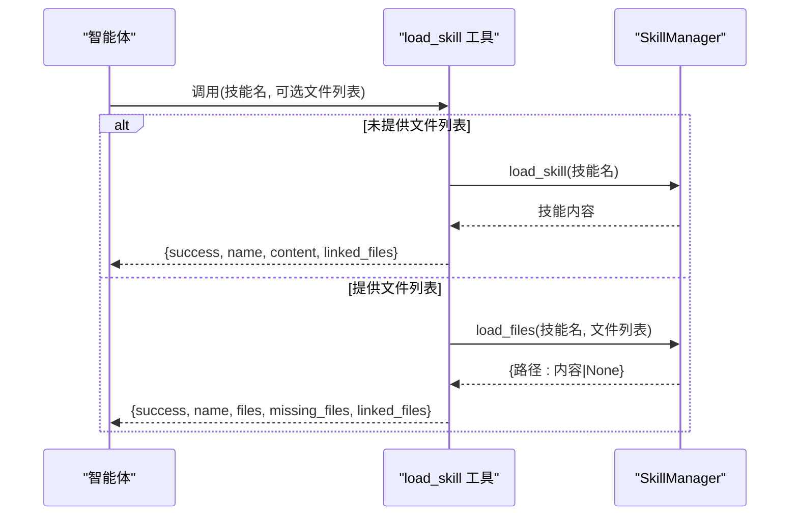
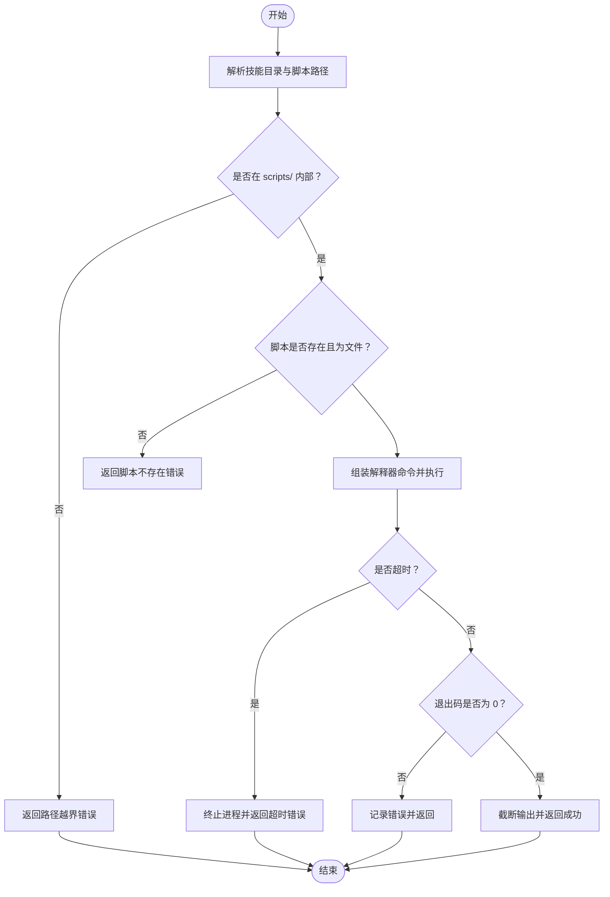
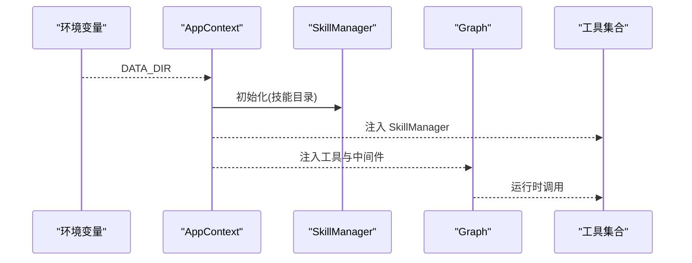
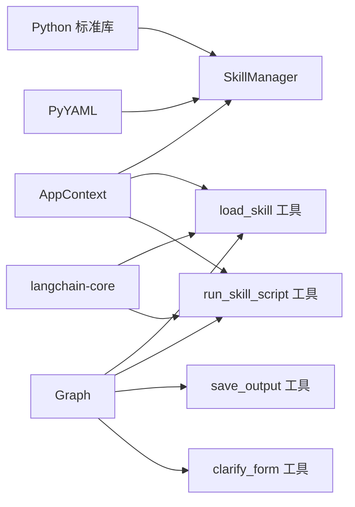

# 技能管理器

<cite>
**本文档引用的文件**
- [skill_manager.py](file://backend/src/agent/skill_manager.py)
- [load_skill.py](file://backend/src/tools/load_skill.py)
- [run_skill_script.py](file://backend/src/tools/run_skill_script.py)
- [SKILL.md](file://backend/skills/ppt/SKILL.md)
- [app_context.py](file://backend/src/app_context.py)
- [graph.py](file://backend/src/agent/graph.py)
- [__init__.py（tools）](file://backend/src/tools/__init__.py)
- [save_output.py](file://backend/src/tools/save_output.py)
- [clarify_form.py](file://backend/src/tools/clarify_form.py)
- [pyproject.toml](file://backend/pyproject.toml)
- [langgraph.json](file://backend/langgraph.json)
</cite>

## 目录
1. [简介](#简介)
2. [项目结构](#项目结构)
3. [核心组件](#核心组件)
4. [架构总览](#架构总览)
5. [详细组件分析](#详细组件分析)
6. [依赖分析](#依赖分析)
7. [性能考虑](#性能考虑)
8. [故障排查指南](#故障排查指南)
9. [结论](#结论)
10. [附录](#附录)

## 简介
本文件面向 Train Agent 技能管理器，提供从底层实现到上层集成的完整技术文档。内容涵盖：
- 技能注册与发现机制：基于目录扫描与 YAML frontmatter 的元数据提取
- 技能加载与初始化流程：动态加载、文件安全边界、批量加载与缓存策略
- 技能执行调度机制：脚本执行工具的安全边界、超时控制与并发模型
- 开发与测试指南：接口规范、最佳实践与调试技巧
- 安全性与权限控制：路径穿越防护、工作目录隔离与输出截断

## 项目结构
技能管理器位于后端 Python 包中，围绕 SkillManager 提供技能清单、元数据与文件读取能力；配套工具通过 LangChain 工具接口暴露给智能体，实现按需加载与脚本执行。

图表来源
- [app_context.py:12-31](file://backend/src/app_context.py#L12-L31)
- [skill_manager.py:14-117](file://backend/src/agent/skill_manager.py#L14-L117)
- [load_skill.py:13-116](file://backend/src/tools/load_skill.py#L13-L116)
- [run_skill_script.py:31-143](file://backend/src/tools/run_skill_script.py#L31-L143)
- [graph.py:16-49](file://backend/src/agent/graph.py#L16-L49)

章节来源
- [pyproject.toml:1-41](file://backend/pyproject.toml#L1-L41)
- [langgraph.json:1-9](file://backend/langgraph.json#L1-L9)

## 核心组件
- SkillManager：负责扫描技能目录、解析 SKILL.md 的 YAML frontmatter、维护技能元数据字典、提供按需加载与文件边界安全读取。
- load_skill 工具：动态生成工具描述，列举可用技能；支持一次性加载技能主提示与关联文件，或批量加载指定文件路径。
- run_skill_script 工具：在受控工作目录内安全执行脚本，支持多语言解释器，具备超时与输出截断保护。
- AppContext：集中注入数据库、向量库、文件存储与技能管理器，贯穿工具与智能体图。
- Graph：组装模型、中间件与工具，形成可运行的智能体图。

章节来源
- [skill_manager.py:7-117](file://backend/src/agent/skill_manager.py#L7-L117)
- [load_skill.py:13-116](file://backend/src/tools/load_skill.py#L13-L116)
- [run_skill_script.py:31-143](file://backend/src/tools/run_skill_script.py#L31-L143)
- [app_context.py:12-31](file://backend/src/app_context.py#L12-L31)
- [graph.py:16-49](file://backend/src/agent/graph.py#L16-L49)

## 架构总览
技能管理器采用“目录扫描 + 工具化接口”的模式，将技能定义与执行解耦：
- 发现阶段：SkillManager 在启动时扫描 skills 目录，解析每个子目录中的 SKILL.md frontmatter，建立内存索引。
- 使用阶段：智能体通过工具按需请求技能内容或脚本执行，工具层进行安全校验与执行。
- 集成阶段：AppContext 将 SkillManager 注入各工具；Graph 统一编排工具与中间件。

图表来源
- [load_skill.py:20-89](file://backend/src/tools/load_skill.py#L20-L89)
- [skill_manager.py:26-59](file://backend/src/agent/skill_manager.py#L26-L59)
- [SKILL.md:1-4](file://backend/skills/ppt/SKILL.md#L1-L4)

## 详细组件分析

### SkillManager：技能注册与发现
- 目录扫描：遍历 skills 目录，定位每个子目录下的 SKILL.md。
- 元数据解析：识别 frontmatter 分隔符，使用 YAML 解析 name/description 等键，构造 SkillMeta。
- 缓存策略：以内存字典缓存技能名称到元数据映射，避免重复 IO。
- 文件加载：提供 load_skill、load_file、load_files、list_references、list_linked_files 等方法，支持相对路径安全读取与批量加载。

图表来源
- [skill_manager.py:7-117](file://backend/src/agent/skill_manager.py#L7-L117)

章节来源
- [skill_manager.py:14-117](file://backend/src/agent/skill_manager.py#L14-L117)

### load_skill 工具：按需加载与批量读取
- 动态描述：根据 SkillManager 列表生成工具描述，包含可用技能与使用说明。
- 单次加载：返回技能主提示内容与该技能的关联文件清单；支持将占位符替换为实际技能目录。
- 批量加载：限制最多 5 个文件，返回每个文件内容与缺失项。
- 错误处理：记录警告日志，返回结构化 JSON，包含错误信息与可用技能列表。

图表来源
- [load_skill.py:20-116](file://backend/src/tools/load_skill.py#L20-L116)
- [skill_manager.py:57-117](file://backend/src/agent/skill_manager.py#L57-L117)

章节来源
- [load_skill.py:13-116](file://backend/src/tools/load_skill.py#L13-L116)

### run_skill_script 工具：脚本执行与安全控制
- 工作目录：以技能根目录为工作目录，确保脚本内相对路径解析正确。
- 路径安全：严格限制脚本路径仅限于 skills/<skill>/scripts/ 下，防止路径穿越。
- 解释器映射：支持 .sh/.py/.js/.ts，自动拼接解释器命令。
- 超时与输出：异步执行，支持超时控制；对过长输出进行截断，避免上下文溢出。
- 错误处理：非零退出码时汇总 stdout/stderr，返回结构化错误信息。

图表来源
- [run_skill_script.py:60-143](file://backend/src/tools/run_skill_script.py#L60-L143)

章节来源
- [run_skill_script.py:31-143](file://backend/src/tools/run_skill_script.py#L31-L143)

### AppContext 与 Graph：依赖注入与智能体编排
- AppContext：从环境变量读取 DATA_DIR，实例化数据库、向量库、文件存储与 SkillManager，并统一注入工具。
- Graph：创建模型、回调、中间件与工具集合，最终生成可运行的智能体图。

图表来源
- [app_context.py:19-31](file://backend/src/app_context.py#L19-L31)
- [graph.py:16-49](file://backend/src/agent/graph.py#L16-L49)
- [__init__.py（tools）:11-20](file://backend/src/tools/__init__.py#L11-L20)

章节来源
- [app_context.py:12-31](file://backend/src/app_context.py#L12-L31)
- [graph.py:16-49](file://backend/src/agent/graph.py#L16-L49)
- [__init__.py（tools）:11-20](file://backend/src/tools/__init__.py#L11-L20)

### 产物保存与交互工具
- save_output：将生成的产物写入文件存储，创建任务记录并在数据库中标记状态，最终返回用户可见的消息。
- clarify_form：触发中断式表单，用于收集用户输入，支持取消语义与结构化返回。

章节来源
- [save_output.py:61-99](file://backend/src/tools/save_output.py#L61-L99)
- [clarify_form.py:24-46](file://backend/src/tools/clarify_form.py#L24-L46)

## 依赖分析
- 技能管理器依赖 Python 标准库（pathlib/yaml/dataclasses）与第三方库（pyyaml、langchain-core 等）。
- 工具层依赖 LangChain 工具装饰器与回调机制。
- AppContext 将 SkillManager 注入工具，Graph 统一编排工具链。

图表来源
- [pyproject.toml:6-26](file://backend/pyproject.toml#L6-L26)
- [load_skill.py:6-8](file://backend/src/tools/load_skill.py#L6-L8)
- [run_skill_script.py:14-16](file://backend/src/tools/run_skill_script.py#L14-L16)
- [app_context.py:6-9](file://backend/src/app_context.py#L6-L9)
- [graph.py:7-11](file://backend/src/agent/graph.py#L7-L11)

章节来源
- [pyproject.toml:1-41](file://backend/pyproject.toml#L1-L41)

## 性能考虑
- 目录扫描与 YAML 解析：首次启动时进行一次性扫描，后续通过内存字典访问，避免重复 IO。
- 批量加载：load_files 采用循环逐个读取，适合小规模文件；若存在大量文件，可考虑并发读取优化。
- 输出截断：run_skill_script 对长输出进行截断，降低上下文占用风险。
- 超时控制：脚本执行设置超时，防止长时间阻塞影响智能体响应。

## 故障排查指南
- 技能未找到：load_skill 工具会记录可用技能列表并返回结构化错误；检查技能名称大小写与目录命名。
- 文件路径越界：load_file 与 run_skill_script 均进行路径安全检查；确认相对路径仅指向允许目录。
- 脚本执行失败：关注返回的退出码与标准错误输出；检查解释器映射与脚本权限。
- 产物保存失败：查看数据库任务状态更新与文件存储异常日志。

章节来源
- [load_skill.py:66-74](file://backend/src/tools/load_skill.py#L66-L74)
- [run_skill_script.py:72-82](file://backend/src/tools/run_skill_script.py#L72-L82)
- [run_skill_script.py:124-134](file://backend/src/tools/run_skill_script.py#L124-L134)
- [save_output.py:51-58](file://backend/src/tools/save_output.py#L51-L58)

## 结论
技能管理器通过“目录扫描 + 工具化接口”的设计，实现了技能的自动化注册、按需加载与安全执行。SkillManager 提供轻量级缓存与边界安全；配套工具在智能体图中承担“发现—加载—执行—交付”的闭环职责。整体架构清晰、扩展性强，便于新增技能与工具。

## 附录

### 技能开发与测试指南
- 接口规范
  - 技能目录结构：skills/<skill>/SKILL.md 必须包含 YAML frontmatter（name/description），可选 references/templates/scripts/assets 子目录。
  - frontmatter 示例参考：[SKILL.md:1-4](file://backend/skills/ppt/SKILL.md#L1-L4)。
- 最佳实践
  - 使用相对路径引用关联文件，避免硬编码绝对路径。
  - 控制单次批量加载数量，遵循工具限制。
  - 脚本执行前明确工作目录，确保相对路径解析一致。
- 调试技巧
  - 启用工具日志，观察技能加载与脚本执行的详细信息。
  - 使用 clarify_form 获取用户输入，验证意图澄清流程。
  - 通过 save_output 验证产物落盘与任务状态更新。

章节来源
- [SKILL.md:1-4](file://backend/skills/ppt/SKILL.md#L1-L4)
- [load_skill.py:20-33](file://backend/src/tools/load_skill.py#L20-L33)
- [run_skill_script.py:37-42](file://backend/src/tools/run_skill_script.py#L37-L42)
- [clarify_form.py:24-34](file://backend/src/tools/clarify_form.py#L24-L34)
- [save_output.py:81-96](file://backend/src/tools/save_output.py#L81-L96)

### 安全性与权限控制
- 路径穿越防护：load_file 与 run_skill_script 对路径进行解析与边界检查，拒绝越界访问。
- 工作目录隔离：脚本执行以技能根目录为工作目录，避免影响其他位置。
- 输出截断：对脚本输出进行长度限制，防止上下文污染。
- 权限最小化：工具仅访问已注册技能范围内的文件与脚本。

章节来源
- [skill_manager.py:72-82](file://backend/src/agent/skill_manager.py#L72-L82)
- [run_skill_script.py:72-82](file://backend/src/tools/run_skill_script.py#L72-L82)
- [run_skill_script.py:120-123](file://backend/src/tools/run_skill_script.py#L120-L123)