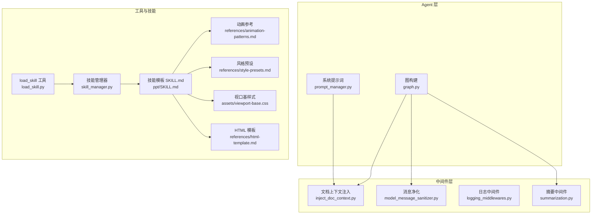
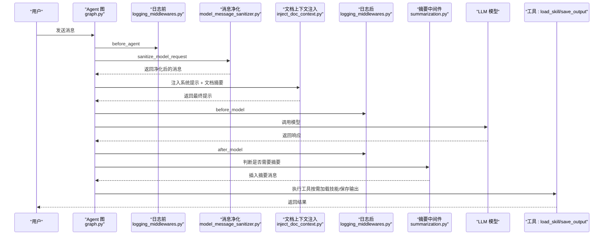
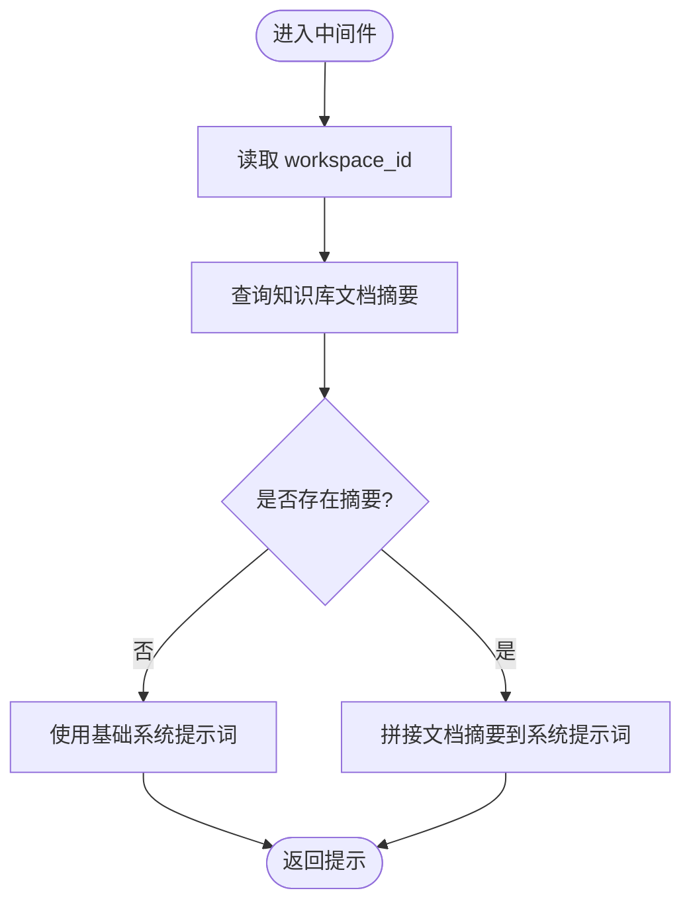
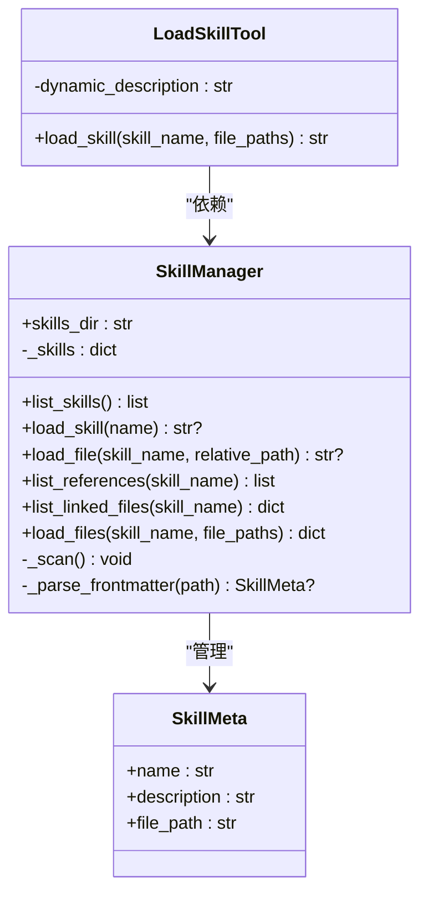
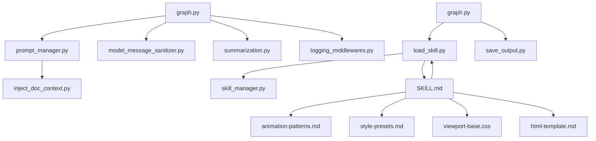

# 提示词管理器

<cite>
**本文档引用的文件**
- [prompt_manager.py](file://backend/src/agent/prompt_manager.py)
- [inject_doc_context.py](file://backend/src/middlewares/inject_doc_context.py)
- [model_message_sanitizer.py](file://backend/src/middlewares/model_message_sanitizer.py)
- [logging_middlewares.py](file://backend/src/middlewares/logging_middlewares.py)
- [summarization.py](file://backend/src/middlewares/summarization.py)
- [graph.py](file://backend/src/agent/graph.py)
- [skill_manager.py](file://backend/src/agent/skill_manager.py)
- [load_skill.py](file://backend/src/tools/load_skill.py)
- [save_output.py](file://backend/src/tools/save_output.py)
- [SKILL.md](file://backend/skills/ppt/SKILL.md)
- [animation-patterns.md](file://backend/skills/ppt/references/animation-patterns.md)
- [style-presets.md](file://backend/skills/ppt/references/style-presets.md)
- [viewport-base.css](file://backend/skills/ppt/assets/viewport-base.css)
- [html-template.md](file://backend/skills/ppt/references/html-template.md)
</cite>

## 目录
1. [简介](#简介)
2. [项目结构](#项目结构)
3. [核心组件](#核心组件)
4. [架构总览](#架构总览)
5. [详细组件分析](#详细组件分析)
6. [依赖分析](#依赖分析)
7. [性能考量](#性能考量)
8. [故障排查指南](#故障排查指南)
9. [结论](#结论)
10. [附录](#附录)

## 简介
本文件面向 Train Agent 的提示词管理器，系统性阐述提示词模板设计与管理、变量替换与动态参数注入、多语言支持策略、版本管理与更新机制、优化与效果评估方法，以及安全性与合规性考虑。文档以实际源码为依据，结合中间件、工具与技能系统，提供从系统架构到实现细节的完整技术说明。

## 项目结构
提示词管理器贯穿后端 Agent 层、中间件层与技能系统，形成“系统提示 + 动态上下文 + 技能模板”的三层提示词体系：
- 系统提示词：集中定义在 Agent 层，作为全局基础指令。
- 动态上下文注入：由中间件在每次模型调用前注入当前工作区的知识库摘要等上下文。
- 技能模板与资源：通过技能管理器扫描技能目录中的 SKILL.md 与配套资源文件，按需注入到提示词中。

图表来源
- [prompt_manager.py:1-37](file://backend/src/agent/prompt_manager.py#L1-L37)
- [inject_doc_context.py:1-41](file://backend/src/middlewares/inject_doc_context.py#L1-L41)
- [model_message_sanitizer.py:1-122](file://backend/src/middlewares/model_message_sanitizer.py#L1-L122)
- [summarization.py:1-58](file://backend/src/middlewares/summarization.py#L1-L58)
- [graph.py:1-49](file://backend/src/agent/graph.py#L1-L49)
- [skill_manager.py:1-117](file://backend/src/agent/skill_manager.py#L1-L117)
- [load_skill.py:1-116](file://backend/src/tools/load_skill.py#L1-L116)
- [SKILL.md:1-269](file://backend/skills/ppt/SKILL.md#L1-L269)

章节来源
- [graph.py:16-49](file://backend/src/agent/graph.py#L16-L49)
- [inject_doc_context.py:11-41](file://backend/src/middlewares/inject_doc_context.py#L11-L41)
- [skill_manager.py:14-117](file://backend/src/agent/skill_manager.py#L14-L117)

## 核心组件
- 系统提示词（SYSTEM_PROMPT）：定义角色职责、回答规范、场景限定、引用规范与技能使用方式，作为所有对话的基础指令。
- 文档上下文注入中间件：在运行时读取数据库中当前工作区的文档摘要，拼接到系统提示词末尾，形成“系统提示 + 知识库上下文”的动态提示。
- 消息净化中间件：清理历史消息中不被兼容模型支持的内容部分，确保模型调用稳定。
- 摘要中间件：在消息长度达到阈值时插入摘要消息，减少上下文开销并保持 UI 友好标记。
- 日志中间件：记录 Agent 与模型调用前后关键状态，便于追踪与审计。
- 技能管理器与 load_skill 工具：扫描技能目录，解析 SKILL.md 前言元数据，提供技能清单与文件批量加载能力，并支持变量替换（如 ${SKILL_DIR}）。
- 输出保存工具：统一产出物保存流程，写入文件存储并更新任务状态，作为交付结果的唯一入口。

章节来源
- [prompt_manager.py:1-37](file://backend/src/agent/prompt_manager.py#L1-L37)
- [inject_doc_context.py:11-41](file://backend/src/middlewares/inject_doc_context.py#L11-L41)
- [model_message_sanitizer.py:105-122](file://backend/src/middlewares/model_message_sanitizer.py#L105-L122)
- [summarization.py:7-58](file://backend/src/middlewares/summarization.py#L7-L58)
- [logging_middlewares.py:15-59](file://backend/src/middlewares/logging_middlewares.py#L15-L59)
- [skill_manager.py:14-117](file://backend/src/agent/skill_manager.py#L14-L117)
- [load_skill.py:13-116](file://backend/src/tools/load_skill.py#L13-L116)
- [save_output.py:61-99](file://backend/src/tools/save_output.py#L61-L99)

## 架构总览
提示词管理器的运行时序列如下：Agent 初始化模型与中间件；每次模型调用前，中间件链依次执行，最终将“系统提示 + 文档上下文”送入模型；模型响应后，中间件负责消息净化与摘要；技能工具按需加载模板与资源；最终通过输出工具保存产物。

图表来源
- [graph.py:16-49](file://backend/src/agent/graph.py#L16-L49)
- [logging_middlewares.py:15-59](file://backend/src/middlewares/logging_middlewares.py#L15-L59)
- [model_message_sanitizer.py:105-122](file://backend/src/middlewares/model_message_sanitizer.py#L105-L122)
- [inject_doc_context.py:11-41](file://backend/src/middlewares/inject_doc_context.py#L11-L41)
- [summarization.py:7-58](file://backend/src/middlewares/summarization.py#L7-L58)

## 详细组件分析

### 系统提示词与动态上下文注入
- 系统提示词集中定义了角色职责、回答规范、场景限定、引用规范与技能使用方式，确保模型输出符合培训咨询的专业要求与格式约束。
- 文档上下文注入中间件在运行时读取数据库中当前工作区的文档摘要，将其拼接至系统提示词末尾，形成“系统提示 + 知识库上下文”的动态提示，提升检索增强质量。

图表来源
- [inject_doc_context.py:14-41](file://backend/src/middlewares/inject_doc_context.py#L14-L41)
- [prompt_manager.py:1-37](file://backend/src/agent/prompt_manager.py#L1-L37)

章节来源
- [prompt_manager.py:1-37](file://backend/src/agent/prompt_manager.py#L1-L37)
- [inject_doc_context.py:11-41](file://backend/src/middlewares/inject_doc_context.py#L11-L41)

### 技能模板与变量替换
- 技能管理器扫描技能目录下的 SKILL.md，解析前言元数据（name/description），并提供技能清单与文件批量加载能力。
- load_skill 工具支持两种模式：
  - 不带 file_paths：返回技能主提示与“已链接文件”清单。
  - 带 file_paths：最多一次性批量加载 5 个文件，返回文件内容字典与缺失文件列表。
- 变量替换：若技能内容包含占位符（如 ${SKILL_DIR}），将在返回前替换为实际技能目录绝对路径，便于模板内引用资源文件。

图表来源
- [skill_manager.py:7-117](file://backend/src/agent/skill_manager.py#L7-L117)
- [load_skill.py:13-116](file://backend/src/tools/load_skill.py#L13-L116)

章节来源
- [skill_manager.py:14-117](file://backend/src/agent/skill_manager.py#L14-L117)
- [load_skill.py:13-116](file://backend/src/tools/load_skill.py#L13-L116)

### 多语言支持与本地化策略
- 系统提示词与技能模板当前以中文为主，但具备良好的可扩展性：
  - 中间件与工具层未强制绑定语言，可通过环境变量或配置切换语言。
  - 技能模板可按语言拆分目录或文件命名，配合技能管理器的文件扫描逻辑实现多语言技能集。
  - 建议在技能目录下按语言维护 SKILL.md 与资源文件，或通过前端工作区语言设置驱动后端选择对应语言的模板与资源。
- 语言切换与文化适配：
  - 在注入文档上下文时，可结合工作区语言偏好，筛选相应语言的文档摘要。
  - 技能模板中的示例与风格参考（如动画风格、排版美学）可映射到不同文化的表达习惯，通过资源文件（如风格预设、动画参考）实现文化适配。

章节来源
- [inject_doc_context.py:16-31](file://backend/src/middlewares/inject_doc_context.py#L16-L31)
- [SKILL.md:66-269](file://backend/skills/ppt/SKILL.md#L66-L269)
- [style-presets.md:1-348](file://backend/skills/ppt/references/style-presets.md#L1-L348)
- [animation-patterns.md:1-111](file://backend/skills/ppt/references/animation-patterns.md#L1-L111)

### 版本管理与更新机制
- 技能模板版本控制：
  - 建议在技能目录中引入版本号前缀或分支策略，如 “v1.0_ppt”、“v2.1_ppt”，通过技能管理器的扫描逻辑自动识别最新版本。
  - 对于 SKILL.md 的重大变更，建议保留历史版本并在工具层提供“回滚到上一版本”的能力（通过文件路径或元数据标识）。
- 回滚策略：
  - 若某次更新导致输出质量下降，可通过工具层选择旧版本模板或禁用新模板，同时记录变更日志与影响范围。
- 兼容性检查：
  - 在注入提示词前，对模板中的变量（如 ${SKILL_DIR}）进行存在性校验，缺失时返回错误信息并提示修复。
  - 对工具调用数量（如批量加载文件最多 5 个）进行限制，避免资源滥用。

章节来源
- [load_skill.py:49-53](file://backend/src/tools/load_skill.py#L49-L53)
- [load_skill.py:76-78](file://backend/src/tools/load_skill.py#L76-L78)

### 提示词优化与效果评估
- 优化方法：
  - 引用规范与场景限定：确保引用标记紧随观点文本、禁止段落引用，有助于提升溯源准确性与可读性。
  - 结构化输出：强制使用 Markdown 格式，减少歧义与格式漂移。
  - 上下文注入：根据工作区文档摘要动态拼接，提升检索增强效果。
- 效果评估：
  - 通过日志中间件观察工具调用次数与类型，评估技能使用频率与命中率。
  - 通过摘要中间件控制上下文长度，避免长对话导致的性能退化。
  - 通过输出保存工具统计产出物数量与成功率，辅助评估整体效果。

章节来源
- [prompt_manager.py:20-35](file://backend/src/agent/prompt_manager.py#L20-L35)
- [logging_middlewares.py:15-59](file://backend/src/middlewares/logging_middlewares.py#L15-L59)
- [summarization.py:19-28](file://backend/src/middlewares/summarization.py#L19-L28)
- [save_output.py:61-99](file://backend/src/tools/save_output.py#L61-L99)

### 安全性与合规性
- 输入净化与模型兼容：
  - 消息净化中间件过滤不被兼容模型支持的内容部分，避免因历史消息格式不兼容导致的调用失败。
- 访问控制与路径安全：
  - 技能文件加载时进行路径合法性校验，防止越界访问技能目录外的文件。
- 输出安全：
  - 输出保存工具统一通过 save_output 工具交付结果，避免直接命令执行或外部脚本调用，降低安全风险。
- 合规性：
  - 引用规范要求明确标注来源，避免误引与捏造信息，符合培训咨询的合规要求。

章节来源
- [model_message_sanitizer.py:62-102](file://backend/src/middlewares/model_message_sanitizer.py#L62-L102)
- [skill_manager.py:72-82](file://backend/src/agent/skill_manager.py#L72-L82)
- [save_output.py:61-99](file://backend/src/tools/save_output.py#L61-L99)

## 依赖分析
提示词管理器各组件之间的依赖关系如下：

图表来源
- [graph.py:16-49](file://backend/src/agent/graph.py#L16-L49)
- [inject_doc_context.py:5-6](file://backend/src/middlewares/inject_doc_context.py#L5-L6)
- [model_message_sanitizer.py:4-5](file://backend/src/middlewares/model_message_sanitizer.py#L4-L5)
- [summarization.py:3-4](file://backend/src/middlewares/summarization.py#L3-L4)
- [logging_middlewares.py:3-9](file://backend/src/middlewares/logging_middlewares.py#L3-L9)
- [load_skill.py:8](file://backend/src/tools/load_skill.py#L8)
- [skill_manager.py:4](file://backend/src/agent/skill_manager.py#L4)
- [SKILL.md:1-4](file://backend/skills/ppt/SKILL.md#L1-L4)

章节来源
- [graph.py:16-49](file://backend/src/agent/graph.py#L16-L49)
- [load_skill.py:13-116](file://backend/src/tools/load_skill.py#L13-L116)
- [skill_manager.py:14-117](file://backend/src/agent/skill_manager.py#L14-L117)

## 性能考量
- 上下文长度控制：通过摘要中间件在消息达到一定阈值时插入摘要，减少后续模型调用的上下文开销。
- 消息净化：在模型调用前清理不兼容内容，避免重试与失败带来的额外延迟。
- 工具调用限制：批量加载文件限制为最多 5 个，防止一次性加载过多资源导致内存与 I/O 压力。
- 资源复用：技能模板与资源文件按需加载，避免重复读取与缓存污染。

章节来源
- [summarization.py:19-28](file://backend/src/middlewares/summarization.py#L19-L28)
- [model_message_sanitizer.py:62-102](file://backend/src/middlewares/model_message_sanitizer.py#L62-L102)
- [load_skill.py:49-53](file://backend/src/tools/load_skill.py#L49-L53)

## 故障排查指南
- 系统提示词未生效：
  - 检查中间件注入逻辑是否正确拼接系统提示词与文档摘要。
  - 确认数据库连接初始化与文档列表查询成功。
- 技能模板加载失败：
  - 检查技能目录是否存在 SKILL.md 且前言元数据格式正确。
  - 确认文件路径合法，未越界访问技能目录外文件。
- 工具调用异常：
  - 查看日志中间件输出，定位 before_model/after_model 阶段的工具调用情况。
  - 对于批量加载，确认 file_paths 数量不超过限制。
- 输出保存失败：
  - 检查文件存储权限与任务状态更新逻辑，关注异常日志并重试。

章节来源
- [inject_doc_context.py:18-26](file://backend/src/middlewares/inject_doc_context.py#L18-L26)
- [skill_manager.py:35-49](file://backend/src/agent/skill_manager.py#L35-L49)
- [logging_middlewares.py:15-59](file://backend/src/middlewares/logging_middlewares.py#L15-L59)
- [load_skill.py:49-53](file://backend/src/tools/load_skill.py#L49-L53)
- [save_output.py:51-58](file://backend/src/tools/save_output.py#L51-L58)

## 结论
提示词管理器通过“系统提示 + 动态上下文 + 技能模板”的组合，实现了可扩展、可维护、可审计的提示词体系。借助中间件链路保障稳定性与性能，结合技能管理器与工具层实现模板与资源的灵活注入与版本控制。未来可在多语言支持、版本回滚与合规审计方面进一步完善，以满足更复杂的业务场景。

## 附录
- 技能模板与资源清单（节选）：
  - 动画模式参考：用于匹配不同风格的动效体验。
  - 风格预设：提供 12 种视觉风格的配色、字体与布局建议。
  - 视口基样式：强制每页精确适配视口高度，确保无滚动。
  - HTML 模板：生成单文件自包含 HTML 演示文稿的结构与交互实现。

章节来源
- [SKILL.md:261-269](file://backend/skills/ppt/SKILL.md#L261-L269)
- [animation-patterns.md:1-111](file://backend/skills/ppt/references/animation-patterns.md#L1-L111)
- [style-presets.md:1-348](file://backend/skills/ppt/references/style-presets.md#L1-L348)
- [viewport-base.css:1-154](file://backend/skills/ppt/assets/viewport-base.css#L1-L154)
- [html-template.md:1-420](file://backend/skills/ppt/references/html-template.md#L1-L420)