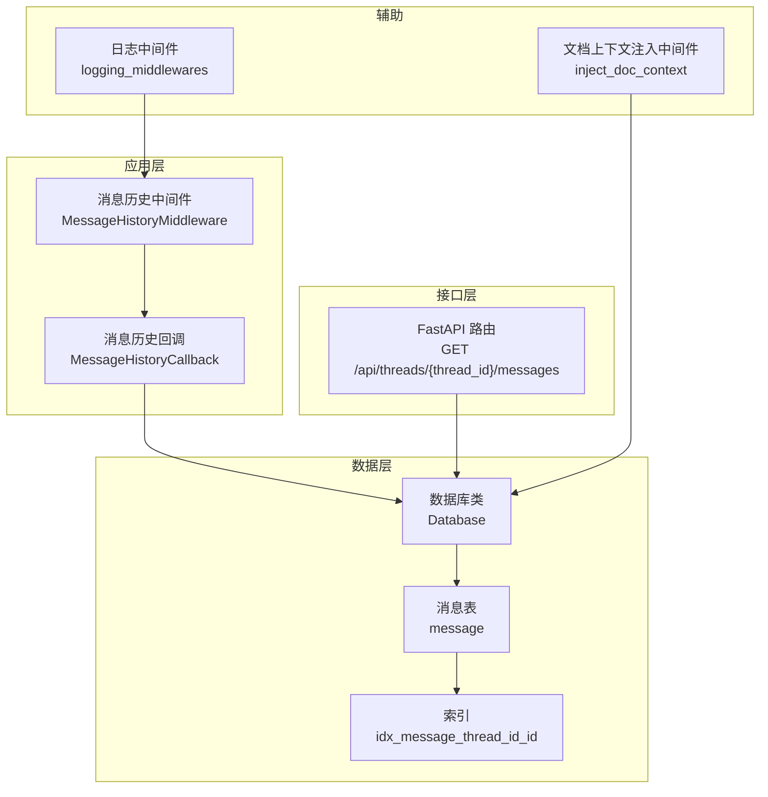
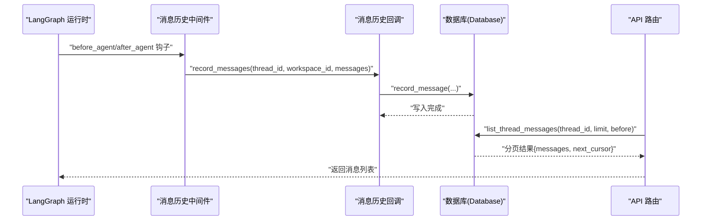
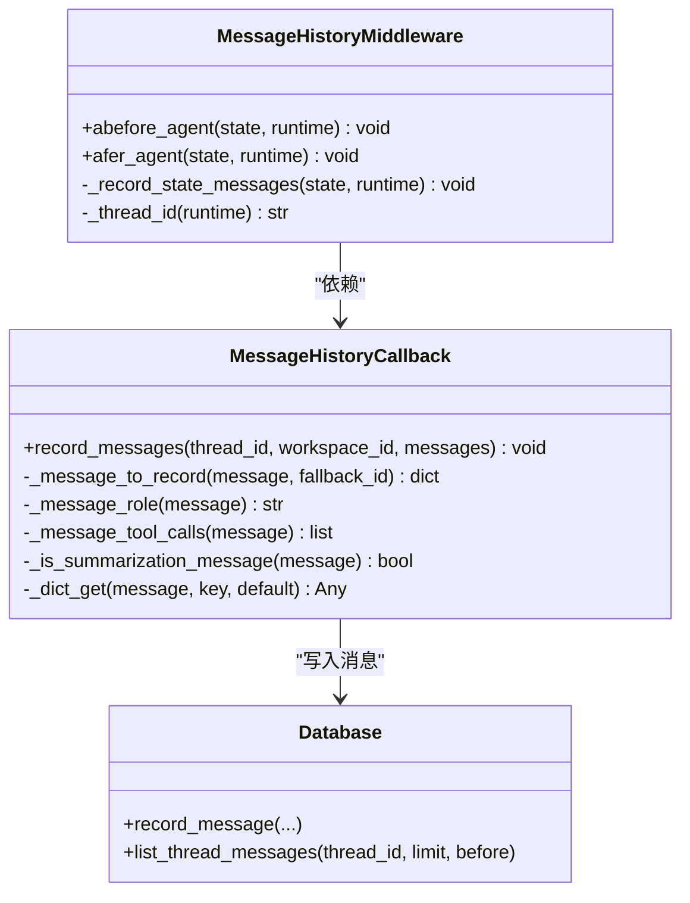
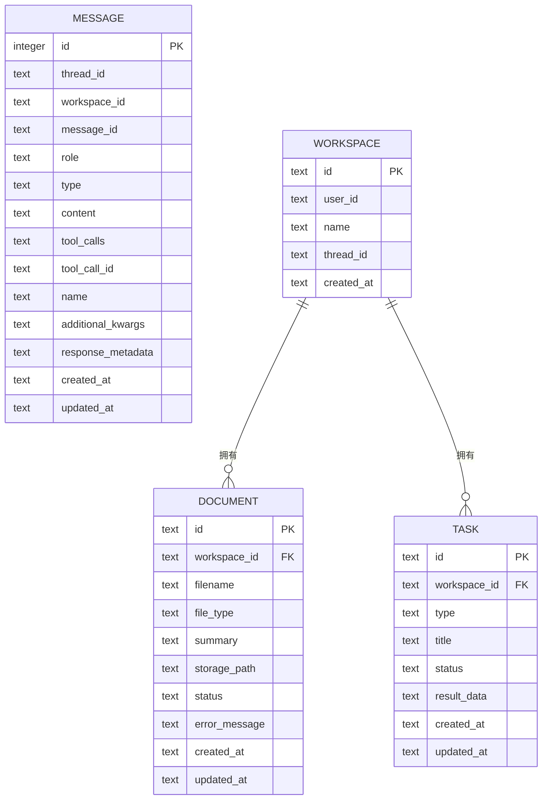
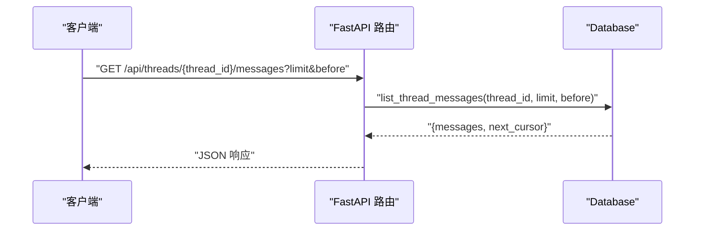
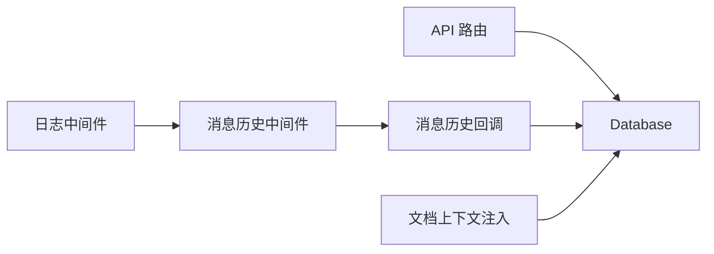

# 消息历史管理

<cite>
**本文引用的文件**   
- [backend/src/agent/message_history.py](file://backend/src/agent/message_history.py)
- [backend/src/storage/database.py](file://backend/src/storage/database.py)
- [backend/src/api/routes.py](file://backend/src/api/routes.py)
- [backend/src/api/deps.py](file://backend/src/api/deps.py)
- [backend/src/middlewares/inject_doc_context.py](file://backend/src/middlewares/inject_doc_context.py)
- [backend/src/middlewares/logging_middlewares.py](file://backend/src/middlewares/logging_middlewares.py)
- [backend/tests/test_message_history.py](file://backend/tests/test_message_history.py)
- [backend/tests/test_message_history_callback.py](file://backend/tests/test_message_history_callback.py)
</cite>

## 目录
1. [简介](#简介)
2. [项目结构](#项目结构)
3. [核心组件](#核心组件)
4. [架构总览](#架构总览)
5. [详细组件分析](#详细组件分析)
6. [依赖分析](#依赖分析)
7. [性能考虑](#性能考虑)
8. [故障排查指南](#故障排查指南)
9. [结论](#结论)
10. [附录](#附录)

## 简介
本技术文档围绕 Train Agent 的消息历史管理系统展开，系统通过回调与中间件在 LangGraph 执行过程中自动捕获并持久化对话消息，采用 SQLite 异步连接进行消息存储，并提供基于线程（thread）的消息分页查询接口。文档重点覆盖以下方面：
- 消息存储机制：消息格式、存储结构、索引策略
- 消息检索与查询：按线程分页、游标翻页、时间戳字段
- 清理与归档策略：冲突更新、去重约束、可扩展的迁移机制
- 访问控制与隐私保护：工作区隔离、线程标识、敏感字段序列化
- 备份与恢复：数据库文件级备份、初始化与迁移流程

## 项目结构
消息历史管理涉及的核心模块与文件如下：
- 回调与中间件：负责从运行时状态中提取消息并写入数据库
- 数据层：封装 SQLite 连接、表结构定义、消息写入与查询
- API 层：对外提供消息列表查询接口
- 中间件：注入文档上下文与日志记录，间接影响消息上下文
- 测试：验证消息持久化、分页、去重与摘要消息过滤

图表来源
- [backend/src/agent/message_history.py:13-143](file://backend/src/agent/message_history.py#L13-L143)
- [backend/src/storage/database.py:25-78](file://backend/src/storage/database.py#L25-L78)
- [backend/src/api/routes.py:84-97](file://backend/src/api/routes.py#L84-L97)
- [backend/src/middlewares/inject_doc_context.py:11-41](file://backend/src/middlewares/inject_doc_context.py#L11-L41)
- [backend/src/middlewares/logging_middlewares.py:15-59](file://backend/src/middlewares/logging_middlewares.py#L15-L59)

章节来源
- [backend/src/agent/message_history.py:1-143](file://backend/src/agent/message_history.py#L1-L143)
- [backend/src/storage/database.py:1-379](file://backend/src/storage/database.py#L1-L379)
- [backend/src/api/routes.py:1-189](file://backend/src/api/routes.py#L1-L189)
- [backend/src/middlewares/inject_doc_context.py:1-41](file://backend/src/middlewares/inject_doc_context.py#L1-L41)
- [backend/src/middlewares/logging_middlewares.py:1-59](file://backend/src/middlewares/logging_middlewares.py#L1-L59)

## 核心组件
- 消息历史回调（MessageHistoryCallback）
  - 将 LangGraph 运行时中的消息转换为统一记录，过滤掉摘要消息，写入数据库
  - 支持从消息对象或字典中解析角色、内容、工具调用等字段
- 消息历史中间件（MessageHistoryMiddleware）
  - 在 Agent 执行前后触发回调，从运行时提取 thread_id 并传递给回调
- 数据库（Database）
  - 定义消息表结构与索引，提供消息写入、查询与迁移能力
  - 写入采用冲突更新策略，确保幂等性；查询支持游标翻页
- API 路由
  - 对外暴露按线程分页查询消息的接口，限制每页数量并支持 before 游标

章节来源
- [backend/src/agent/message_history.py:13-143](file://backend/src/agent/message_history.py#L13-L143)
- [backend/src/storage/database.py:25-281](file://backend/src/storage/database.py#L25-L281)
- [backend/src/api/routes.py:84-97](file://backend/src/api/routes.py#L84-L97)

## 架构总览
消息从 LangGraph 运行时进入，经由中间件与回调捕获，最终持久化到 SQLite 表中。查询接口通过线程 ID 与游标实现分页。

图表来源
- [backend/src/agent/message_history.py:113-143](file://backend/src/agent/message_history.py#L113-L143)
- [backend/src/storage/database.py:172-228](file://backend/src/storage/database.py#L172-L228)
- [backend/src/api/routes.py:84-97](file://backend/src/api/routes.py#L84-L97)

## 详细组件分析

### 组件一：消息历史回调与中间件
- 功能职责
  - 从运行时状态中提取 messages 列表，过滤非人类/AI/工具消息与摘要消息
  - 将消息标准化为统一记录，包含 message_id、role/type、content、工具调用、附加参数、响应元数据等
  - 通过数据库类写入消息，避免重复插入
- 关键点
  - 角色映射：user 映射为 human，assistant 映射为 ai
  - 工具调用规范化：仅保留 id/name/args 字段
  - 摘要消息过滤：根据额外参数标记 lc_source 为 summarization 的消息不入库
  - 线程 ID 提取：优先从 execution_info.thread_id 获取，其次从 context 或 runtime.configurable

图表来源
- [backend/src/agent/message_history.py:13-143](file://backend/src/agent/message_history.py#L13-L143)
- [backend/src/storage/database.py:172-281](file://backend/src/storage/database.py#L172-L281)

章节来源
- [backend/src/agent/message_history.py:13-143](file://backend/src/agent/message_history.py#L13-L143)
- [backend/tests/test_message_history_callback.py:8-85](file://backend/tests/test_message_history_callback.py#L8-L85)

### 组件二：数据库与消息表
- 表结构与字段
  - 主键自增 id，联合唯一约束 (thread_id, message_id, role)，确保同线程内相同 message_id 的幂等更新
  - 字段涵盖 thread_id、workspace_id、message_id、role、type、content、工具调用、工具调用 ID、名称、附加参数、响应元数据、创建与更新时间
- 存储与序列化
  - JSON 字段统一以字符串形式存储，提供加载/转储方法，保证兼容性与回退
- 索引策略
  - 为 (thread_id, id DESC) 建立复合索引，支持按线程降序分页查询
- 查询与分页
  - 支持 limit 上限与 before 游标，返回 next_cursor 用于下一页
  - 服务端限制每页最大 100 条，防止过大负载
- 迁移与兼容
  - 通过迁移逻辑动态添加缺失列，保障版本演进

图表来源
- [backend/src/storage/database.py:25-78](file://backend/src/storage/database.py#L25-L78)
- [backend/src/storage/database.py:80-104](file://backend/src/storage/database.py#L80-L104)

章节来源
- [backend/src/storage/database.py:25-281](file://backend/src/storage/database.py#L25-L281)

### 组件三：API 路由与查询
- 接口定义
  - GET /api/threads/{thread_id}/messages
  - 参数：limit（默认 10，最小 1，最大 100）、before（游标）
- 返回结构
  - messages：消息数组
  - next_cursor：下一页游标，若无更多则为空
- 控制流
  - 路由层接收请求，调用数据库层分页查询，返回结果

图表来源
- [backend/src/api/routes.py:84-97](file://backend/src/api/routes.py#L84-L97)
- [backend/src/storage/database.py:230-262](file://backend/src/storage/database.py#L230-L262)

章节来源
- [backend/src/api/routes.py:84-97](file://backend/src/api/routes.py#L84-L97)
- [backend/src/storage/database.py:230-262](file://backend/src/storage/database.py#L230-L262)

### 组件四：文档上下文注入与日志中间件
- 文档上下文注入中间件
  - 从数据库读取当前工作区的文档摘要，拼接到系统提示词中，增强模型上下文
- 日志中间件
  - 记录 Agent 与模型调用前后的关键信息，便于调试与审计

章节来源
- [backend/src/middlewares/inject_doc_context.py:11-41](file://backend/src/middlewares/inject_doc_context.py#L11-L41)
- [backend/src/middlewares/logging_middlewares.py:15-59](file://backend/src/middlewares/logging_middlewares.py#L15-L59)

## 依赖分析
- 组件耦合
  - 消息历史中间件依赖回调；回调依赖数据库类
  - API 路由直接依赖数据库类进行查询
  - 文档上下文注入中间件与日志中间件分别依赖数据库与运行时状态
- 外部依赖
  - aiosqlite：异步 SQLite 访问
  - FastAPI：HTTP 接口框架
  - LangChain/LangGraph：回调与中间件生态

图表来源
- [backend/src/api/routes.py:84-97](file://backend/src/api/routes.py#L84-L97)
- [backend/src/agent/message_history.py:113-143](file://backend/src/agent/message_history.py#L113-L143)
- [backend/src/middlewares/inject_doc_context.py:11-41](file://backend/src/middlewares/inject_doc_context.py#L11-L41)
- [backend/src/middlewares/logging_middlewares.py:15-59](file://backend/src/middlewares/logging_middlewares.py#L15-L59)

章节来源
- [backend/src/api/routes.py:1-189](file://backend/src/api/routes.py#L1-L189)
- [backend/src/agent/message_history.py:1-143](file://backend/src/agent/message_history.py#L1-L143)
- [backend/src/middlewares/inject_doc_context.py:1-41](file://backend/src/middlewares/inject_doc_context.py#L1-L41)
- [backend/src/middlewares/logging_middlewares.py:1-59](file://backend/src/middlewares/logging_middlewares.py#L1-L59)

## 性能考虑
- 分页与游标
  - 使用 id DESC 降序与 before 游标，避免 OFFSET，降低大偏移场景的扫描成本
  - 限制每页最大条数，防止一次性返回过多数据
- 索引
  - (thread_id, id DESC) 复合索引提升按线程分页查询效率
- 序列化
  - JSON 字段统一序列化存储，减少解析开销；提供回退机制避免解析失败
- 幂等写入
  - 联合唯一约束 + ON CONFLICT 更新，避免重复写入带来的索引膨胀
- 异步 I/O
  - aiosqlite 异步连接，适合高并发下的数据库操作

章节来源
- [backend/src/storage/database.py:73-76](file://backend/src/storage/database.py#L73-L76)
- [backend/src/storage/database.py:230-262](file://backend/src/storage/database.py#L230-L262)
- [backend/src/storage/database.py:190-228](file://backend/src/storage/database.py#L190-L228)

## 故障排查指南
- 消息未入库
  - 检查是否传入 thread_id；若为空则跳过记录
  - 确认消息类型是否为 human/ai/tool；其他类型会被忽略
  - 摘要消息（lc_source 为 summarization）会被过滤
- 重复消息
  - 同一 (thread_id, message_id, role) 的消息会触发冲突更新，不会产生重复行
- 分页异常
  - before 游标需为上一页最后一项的 id；确保传入数值型游标
  - limit 必须在 1~100 区间内
- 数据库初始化
  - 首次启动时 API 会初始化数据库；如出现表缺失，检查迁移逻辑是否执行
- 单元测试参考
  - 测试覆盖了消息持久化、分页、去重与摘要消息过滤，可对照定位问题

章节来源
- [backend/src/agent/message_history.py:26-40](file://backend/src/agent/message_history.py#L26-L40)
- [backend/src/agent/message_history.py:99-106](file://backend/src/agent/message_history.py#L99-L106)
- [backend/src/storage/database.py:190-228](file://backend/src/storage/database.py#L190-L228)
- [backend/src/storage/database.py:230-262](file://backend/src/storage/database.py#L230-L262)
- [backend/tests/test_message_history.py:8-65](file://backend/tests/test_message_history.py#L8-L65)
- [backend/tests/test_message_history_callback.py:8-85](file://backend/tests/test_message_history_callback.py#L8-L85)

## 结论
消息历史管理通过回调与中间件在运行时自动捕获消息，结合 SQLite 的异步访问与合理的索引设计，实现了高效、可扩展的消息存储与查询。系统具备幂等写入、游标分页、JSON 字段序列化与迁移兼容等特性，满足训练 Agent 场景下的消息持久化需求。后续可在消息清理、归档与访问控制方面进一步扩展。

## 附录

### 消息格式与存储结构
- 字段说明
  - thread_id：线程标识，用于区分不同对话
  - message_id：消息唯一标识，配合 role 实现去重
  - role/type：消息角色（human/ai/tool），类型与角色一致
  - content：消息内容，JSON 字符串存储
  - tool_calls/tool_call_id/name：工具调用相关信息
  - additional_kwargs/response_metadata：附加参数与响应元数据
  - created_at/updated_at：创建与更新时间
- 索引
  - idx_message_thread_id_id(thread_id, id DESC)：加速按线程分页查询

章节来源
- [backend/src/storage/database.py:56-76](file://backend/src/storage/database.py#L56-L76)
- [backend/src/storage/database.py:264-281](file://backend/src/storage/database.py#L264-L281)

### 检索与查询功能
- 时间范围查询
  - 当前实现未提供显式时间范围过滤；可通过在 content 或附加字段中携带时间戳自行筛选
- 关键词搜索
  - 当前未提供全文检索；建议在 content 字段增加向量化后接入向量检索
- 上下文关联
  - 可通过 workspace_id 与 thread_id 进行工作区与线程维度的上下文关联

章节来源
- [backend/src/storage/database.py:230-262](file://backend/src/storage/database.py#L230-L262)

### 清理与归档策略
- 过期处理
  - 未内置过期删除逻辑；建议基于 created_at 设置定时任务清理历史消息
- 存储限制
  - 通过 limit 与 before 控制单次查询规模；可结合游标实现批量清理
- 性能优化
  - 使用游标分页避免 OFFSET；定期重建索引（如需要）；对大字段进行压缩或外部化存储

章节来源
- [backend/src/storage/database.py:230-262](file://backend/src/storage/database.py#L230-L262)

### 访问控制与隐私保护
- 工作区隔离
  - 通过 workspace_id 与 thread_id 实现基本隔离；建议在 API 层增加鉴权与授权校验
- 敏感字段
  - JSON 字段统一序列化存储，便于后续脱敏处理
- 审计日志
  - 日志中间件记录关键事件，便于审计与追踪

章节来源
- [backend/src/middlewares/logging_middlewares.py:15-59](file://backend/src/middlewares/logging_middlewares.py#L15-L59)
- [backend/src/storage/database.py:160-171](file://backend/src/storage/database.py#L160-L171)

### 备份与恢复机制
- 备份
  - 数据库存储于本地文件，可直接复制数据库文件进行备份
- 恢复
  - 停止服务后替换数据库文件，启动后自动初始化并执行迁移
- 初始化与迁移
  - 首次启动自动建表与迁移；迁移逻辑会补齐缺失列

章节来源
- [backend/src/api/routes.py:30-35](file://backend/src/api/routes.py#L30-L35)
- [backend/src/storage/database.py:14-24](file://backend/src/storage/database.py#L14-L24)
- [backend/src/storage/database.py:80-104](file://backend/src/storage/database.py#L80-L104)