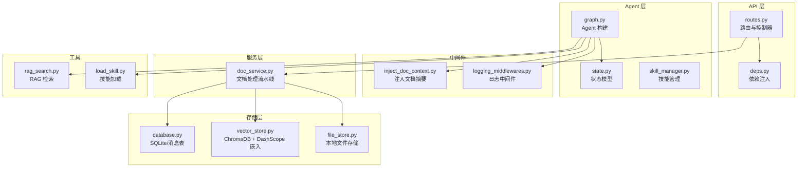
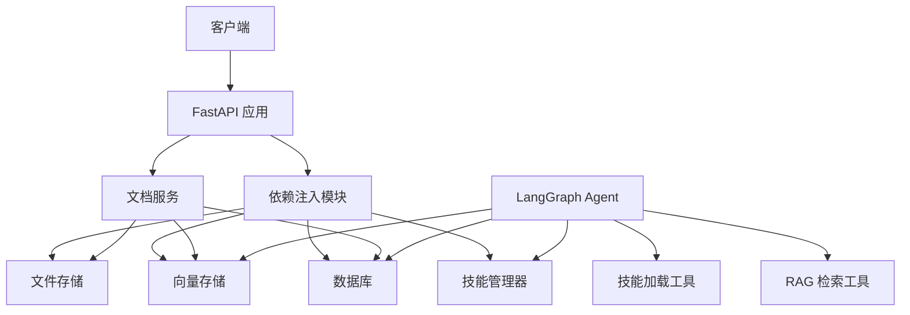
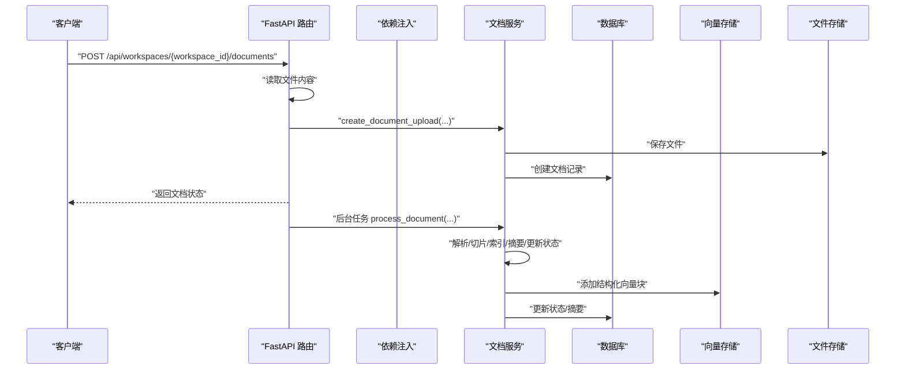
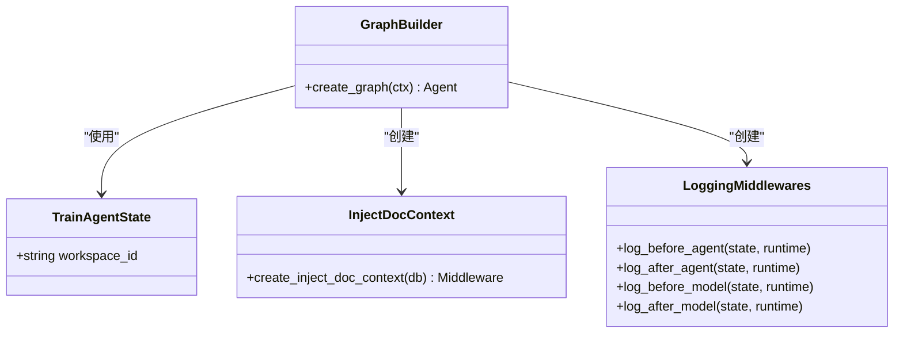
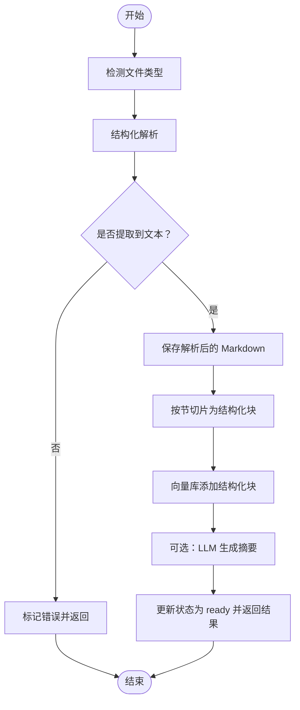
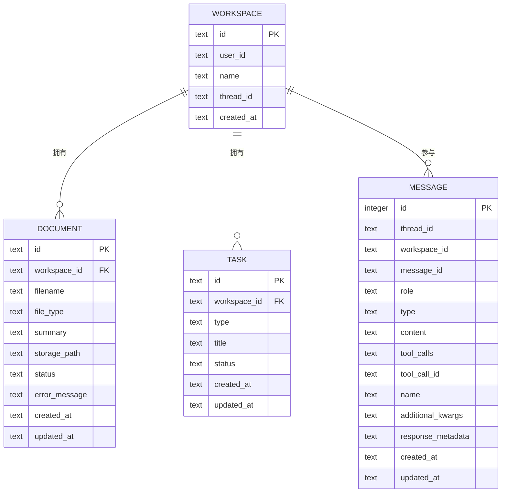
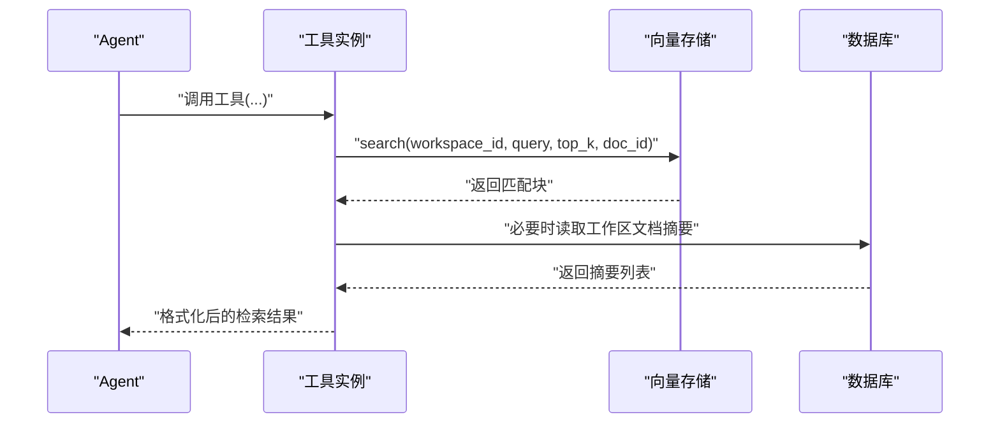
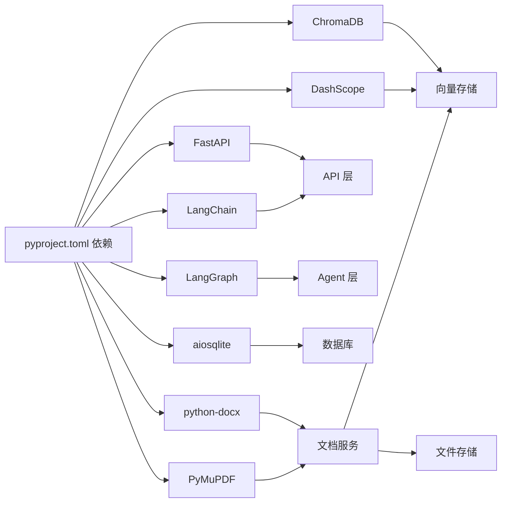

# 后端开发指南

<cite>
**本文引用的文件**
- [backend/pyproject.toml](file://backend/pyproject.toml)
- [backend/langgraph.json](file://backend/langgraph.json)
- [backend/src/api/routes.py](file://backend/src/api/routes.py)
- [backend/src/api/deps.py](file://backend/src/api/deps.py)
- [backend/src/agent/graph.py](file://backend/src/agent/graph.py)
- [backend/src/agent/state.py](file://backend/src/agent/state.py)
- [backend/src/agent/skill_manager.py](file://backend/src/agent/skill_manager.py)
- [backend/src/middlewares/inject_doc_context.py](file://backend/src/middlewares/inject_doc_context.py)
- [backend/src/middlewares/logging_middlewares.py](file://backend/src/middlewares/logging_middlewares.py)
- [backend/src/services/doc_service.py](file://backend/src/services/doc_service.py)
- [backend/src/storage/database.py](file://backend/src/storage/database.py)
- [backend/src/storage/vector_store.py](file://backend/src/storage/vector_store.py)
- [backend/src/storage/file_store.py](file://backend/src/storage/file_store.py)
- [backend/src/tools/rag_search.py](file://backend/src/tools/rag_search.py)
- [backend/src/tools/load_skill.py](file://backend/src/tools/load_skill.py)
</cite>

## 目录
1. [简介](#简介)
2. [项目结构](#项目结构)
3. [核心组件](#核心组件)
4. [架构总览](#架构总览)
5. [详细组件分析](#详细组件分析)
6. [依赖关系分析](#依赖关系分析)
7. [性能考虑](#性能考虑)
8. [故障排查指南](#故障排查指南)
9. [结论](#结论)
10. [附录](#附录)

## 简介
本指南面向 Train Agent 后端开发，目标是帮助开发者快速理解并高效扩展后端架构。后端采用分层架构：API 层负责对外接口与依赖注入；Agent 层基于 LangGraph 构建智能体，结合工具与中间件完成推理与执行；服务层编排业务流程（如文档处理流水线）；存储层提供数据库、向量存储与文件存储。文档同时覆盖工具系统开发规范、中间件工作机制、状态管理与技能管理，并给出最佳实践与排障建议。

## 项目结构
后端代码位于 backend 目录，采用“按职责分层”的组织方式：
- api：FastAPI 路由与依赖注入入口
- agent：LangGraph Agent 构建、状态与技能管理
- middlewares：Agent 中间件（日志、动态提示注入、摘要）
- services：业务编排（文档处理流水线）
- storage：数据库、向量存储、文件存储
- tools：工具工厂与具体工具（RAG 检索、技能加载等）

图表来源
- [backend/src/api/routes.py:1-189](file://backend/src/api/routes.py#L1-L189)
- [backend/src/api/deps.py:1-30](file://backend/src/api/deps.py#L1-L30)
- [backend/src/agent/graph.py:1-49](file://backend/src/agent/graph.py#L1-L49)
- [backend/src/agent/state.py:1-7](file://backend/src/agent/state.py#L1-L7)
- [backend/src/agent/skill_manager.py:1-117](file://backend/src/agent/skill_manager.py#L1-L117)
- [backend/src/middlewares/inject_doc_context.py:1-41](file://backend/src/middlewares/inject_doc_context.py#L1-L41)
- [backend/src/middlewares/logging_middlewares.py:1-59](file://backend/src/middlewares/logging_middlewares.py#L1-L59)
- [backend/src/services/doc_service.py:1-218](file://backend/src/services/doc_service.py#L1-L218)
- [backend/src/storage/database.py:1-379](file://backend/src/storage/database.py#L1-L379)
- [backend/src/storage/vector_store.py:1-177](file://backend/src/storage/vector_store.py#L1-L177)
- [backend/src/storage/file_store.py:1-39](file://backend/src/storage/file_store.py#L1-L39)
- [backend/src/tools/rag_search.py:1-76](file://backend/src/tools/rag_search.py#L1-L76)
- [backend/src/tools/load_skill.py:1-116](file://backend/src/tools/load_skill.py#L1-L116)

章节来源
- [backend/src/api/routes.py:1-189](file://backend/src/api/routes.py#L1-L189)
- [backend/src/api/deps.py:1-30](file://backend/src/api/deps.py#L1-L30)
- [backend/src/agent/graph.py:1-49](file://backend/src/agent/graph.py#L1-L49)
- [backend/src/services/doc_service.py:1-218](file://backend/src/services/doc_service.py#L1-L218)
- [backend/src/storage/database.py:1-379](file://backend/src/storage/database.py#L1-L379)
- [backend/src/storage/vector_store.py:1-177](file://backend/src/storage/vector_store.py#L1-L177)
- [backend/src/storage/file_store.py:1-39](file://backend/src/storage/file_store.py#L1-L39)
- [backend/src/tools/rag_search.py:1-76](file://backend/src/tools/rag_search.py#L1-L76)
- [backend/src/tools/load_skill.py:1-116](file://backend/src/tools/load_skill.py#L1-L116)

## 核心组件
- API 层：基于 FastAPI 提供 REST 接口，集中初始化数据库并在启动事件中完成数据库连接；通过依赖注入模块提供数据库、向量存储、文件存储与技能管理器实例；提供工作区、文档、任务、消息与静态资源下载等接口。
- Agent 层：以 LangGraph Agent 为核心，配置模型（支持流式输出与思考开关）、回调（消息历史持久化）、工具与中间件；状态模型扩展了工作区上下文字段。
- 服务层：文档处理流水线串联解析、切片、向量化、摘要生成与状态更新；支持工作区级删除与文档级删除。
- 存储层：数据库采用 aiosqlite，提供工作区、文档、任务、消息表及索引；向量存储基于 ChromaDB，嵌入函数对接 DashScope；文件存储提供本地持久化与异步写入能力。
- 工具系统：RAG 检索工具根据查询在指定工作区/文档范围内检索并格式化返回；技能加载工具按 LangChain Skills 模式动态列举可用技能并按需加载文件。

章节来源
- [backend/src/api/routes.py:1-189](file://backend/src/api/routes.py#L1-L189)
- [backend/src/api/deps.py:1-30](file://backend/src/api/deps.py#L1-L30)
- [backend/src/agent/graph.py:1-49](file://backend/src/agent/graph.py#L1-L49)
- [backend/src/agent/state.py:1-7](file://backend/src/agent/state.py#L1-L7)
- [backend/src/services/doc_service.py:1-218](file://backend/src/services/doc_service.py#L1-L218)
- [backend/src/storage/database.py:1-379](file://backend/src/storage/database.py#L1-L379)
- [backend/src/storage/vector_store.py:1-177](file://backend/src/storage/vector_store.py#L1-L177)
- [backend/src/storage/file_store.py:1-39](file://backend/src/storage/file_store.py#L1-L39)
- [backend/src/tools/rag_search.py:1-76](file://backend/src/tools/rag_search.py#L1-L76)
- [backend/src/tools/load_skill.py:1-116](file://backend/src/tools/load_skill.py#L1-L116)

## 架构总览
后端采用“API → Agent → 服务 → 存储”的分层架构，数据流清晰、职责边界明确。API 层负责请求接入与依赖注入；Agent 层负责决策与工具调用；服务层编排复杂业务流程；存储层提供可靠的数据持久化与检索能力。

图表来源
- [backend/src/api/routes.py:1-189](file://backend/src/api/routes.py#L1-L189)
- [backend/src/api/deps.py:1-30](file://backend/src/api/deps.py#L1-L30)
- [backend/src/services/doc_service.py:1-218](file://backend/src/services/doc_service.py#L1-L218)
- [backend/src/storage/database.py:1-379](file://backend/src/storage/database.py#L1-L379)
- [backend/src/storage/vector_store.py:1-177](file://backend/src/storage/vector_store.py#L1-L177)
- [backend/src/storage/file_store.py:1-39](file://backend/src/storage/file_store.py#L1-L39)
- [backend/src/agent/graph.py:1-49](file://backend/src/agent/graph.py#L1-L49)
- [backend/src/tools/rag_search.py:1-76](file://backend/src/tools/rag_search.py#L1-L76)
- [backend/src/tools/load_skill.py:1-116](file://backend/src/tools/load_skill.py#L1-L116)

## 详细组件分析

### API 层设计与依赖注入
- RESTful 接口规范
  - 工作区：创建、列出、获取、更新当前线程、删除（级联清理文档、向量与文件）
  - 文档：上传（异步后台任务触发处理）、列出、删除
  - 任务：列出、删除
  - 消息：按线程分页拉取
  - 文件：按存储路径下载
  - 静态资源：挂载 PPT 技能资产与模板目录
- 依赖注入机制
  - 通过环境变量加载 AppContext，统一提供数据库、向量存储、文件存储与技能管理器实例
  - 文档服务通过依赖注入组合数据库、向量存储与文件存储，并可选注入摘要模型
- 中间件系统
  - CORS 全允许（开发用途）
  - 启动事件中初始化数据库

图表来源
- [backend/src/api/routes.py:112-128](file://backend/src/api/routes.py#L112-L128)
- [backend/src/api/deps.py:1-30](file://backend/src/api/deps.py#L1-L30)
- [backend/src/services/doc_service.py:35-130](file://backend/src/services/doc_service.py#L35-L130)
- [backend/src/storage/database.py:285-338](file://backend/src/storage/database.py#L285-L338)
- [backend/src/storage/vector_store.py:91-122](file://backend/src/storage/vector_store.py#L91-L122)
- [backend/src/storage/file_store.py:11-16](file://backend/src/storage/file_store.py#L11-L16)

章节来源
- [backend/src/api/routes.py:1-189](file://backend/src/api/routes.py#L1-L189)
- [backend/src/api/deps.py:1-30](file://backend/src/api/deps.py#L1-L30)

### Agent 层：LangGraph Agent 构建与中间件
- Agent 构建
  - 使用 ChatOpenAI（DeepSeek API）配置模型参数，启用流式输出与思考开关
  - 注册消息历史回调，将消息持久化到数据库
  - 创建工具与中间件并交由 Agent 使用
- 中间件系统
  - 动态提示注入：在系统提示中注入当前工作区的文档摘要
  - 日志中间件：在 Agent 前后、模型前后打印关键信息（消息数、工具调用）
- 状态管理
  - 扩展 AgentState，增加 workspace_id 字段，贯穿多轮对话与工具调用

图表来源
- [backend/src/agent/state.py:1-7](file://backend/src/agent/state.py#L1-L7)
- [backend/src/agent/graph.py:1-49](file://backend/src/agent/graph.py#L1-L49)
- [backend/src/middlewares/inject_doc_context.py:1-41](file://backend/src/middlewares/inject_doc_context.py#L1-L41)
- [backend/src/middlewares/logging_middlewares.py:1-59](file://backend/src/middlewares/logging_middlewares.py#L1-L59)

章节来源
- [backend/src/agent/graph.py:1-49](file://backend/src/agent/graph.py#L1-L49)
- [backend/src/middlewares/inject_doc_context.py:1-41](file://backend/src/middlewares/inject_doc_context.py#L1-L41)
- [backend/src/middlewares/logging_middlewares.py:1-59](file://backend/src/middlewares/logging_middlewares.py#L1-L59)
- [backend/src/agent/state.py:1-7](file://backend/src/agent/state.py#L1-L7)

### 服务层：文档处理流水线
- 流水线步骤
  - 解析：根据文件类型选择解析器（PDF、DOCX、Markdown/Text）
  - 结构化切片：按节/段落切分为 ChunkWithMetadata
  - 向量化：批量写入向量库，携带元数据（doc_id、文件名、章节/页码等）
  - 摘要：可选 LLM 生成摘要，失败回退
  - 状态更新：按阶段更新数据库记录
- 删除策略
  - 工作区删除：清理文件、向量集合与数据库记录
  - 文档删除：清理原始文件与解析导出的 Markdown，并删除对应向量与记录

图表来源
- [backend/src/services/doc_service.py:57-130](file://backend/src/services/doc_service.py#L57-L130)

章节来源
- [backend/src/services/doc_service.py:1-218](file://backend/src/services/doc_service.py#L1-L218)

### 存储层设计
- 数据库 Schema（aiosqlite）
  - workspace：用户标识、名称、当前线程
  - document：文档元数据、状态、摘要、存储路径
  - task：任务类型、标题、状态
  - message：消息体、工具调用、响应元数据、时间戳，含唯一约束与索引
- 向量存储架构（ChromaDB + DashScope 嵌入）
  - 每个工作区一个集合（ws_workspace_id）
  - 支持按 doc_id 过滤检索
  - 提供批量添加与查询接口
- 文件存储策略
  - 以工作区为目录隔离
  - 提供同步与异步写入方法
  - 支持工作区级删除

图表来源
- [backend/src/storage/database.py:25-76](file://backend/src/storage/database.py#L25-L76)

章节来源
- [backend/src/storage/database.py:1-379](file://backend/src/storage/database.py#L1-L379)
- [backend/src/storage/vector_store.py:1-177](file://backend/src/storage/vector_store.py#L1-L177)
- [backend/src/storage/file_store.py:1-39](file://backend/src/storage/file_store.py#L1-L39)

### 工具系统开发规范
- 自定义工具开发流程
  - 定义工具函数，使用 @tool 装饰器声明
  - 在工具工厂中创建并返回工具实例
  - 将工具注册到 Agent 的工具列表中
- 注册机制
  - Agent 构建时通过 create_tools(ctx) 获取工具集合
  - 工具可访问 Agent 状态（如 workspace_id）与存储实例
- 示例工具
  - RAG 检索：按查询在工作区或指定文档内检索，格式化位置信息与文本
  - 技能加载：动态列举可用技能，按需加载技能主提示与关联文件

图表来源
- [backend/src/tools/rag_search.py:40-75](file://backend/src/tools/rag_search.py#L40-L75)
- [backend/src/storage/vector_store.py:124-163](file://backend/src/storage/vector_store.py#L124-L163)
- [backend/src/middlewares/inject_doc_context.py:11-40](file://backend/src/middlewares/inject_doc_context.py#L11-L40)

章节来源
- [backend/src/tools/rag_search.py:1-76](file://backend/src/tools/rag_search.py#L1-L76)
- [backend/src/tools/load_skill.py:1-116](file://backend/src/tools/load_skill.py#L1-L116)
- [backend/src/agent/graph.py:28-37](file://backend/src/agent/graph.py#L28-L37)

## 依赖关系分析
- 外部依赖
  - FastAPI、Uvicorn：Web 框架与 ASGI 服务器
  - LangChain/LangGraph：智能体与工具生态
  - ChromaDB：向量存储
  - DashScope：文本嵌入
  - aiosqlite：异步 SQLite
  - python-docx、PyMuPDF：文档解析
- 内部耦合
  - API 层通过 deps.py 统一注入存储与服务实例
  - Agent 层依赖工具与中间件工厂，工具依赖存储实例
  - 服务层横跨数据库、向量存储与文件存储

图表来源
- [backend/pyproject.toml:6-26](file://backend/pyproject.toml#L6-L26)
- [backend/src/api/routes.py:1-189](file://backend/src/api/routes.py#L1-L189)
- [backend/src/agent/graph.py:1-49](file://backend/src/agent/graph.py#L1-L49)
- [backend/src/services/doc_service.py:1-218](file://backend/src/services/doc_service.py#L1-L218)
- [backend/src/storage/vector_store.py:1-177](file://backend/src/storage/vector_store.py#L1-L177)
- [backend/src/storage/database.py:1-379](file://backend/src/storage/database.py#L1-L379)
- [backend/src/storage/file_store.py:1-39](file://backend/src/storage/file_store.py#L1-L39)

章节来源
- [backend/pyproject.toml:1-41](file://backend/pyproject.toml#L1-L41)

## 性能考虑
- 异步与并发
  - 数据库与文件 I/O 使用异步接口，避免阻塞
  - 向量存储批量写入，控制批次大小
- 缓存与索引
  - 消息表建立复合索引，优化分页查询
  - 向量库按工作区隔离集合，减少无关扫描
- 资源限制
  - 文档分页查询限制最大条数
  - 工具批量加载文件数量上限
- 摘要与降噪
  - LLM 摘要失败回退为截断文本，降低异常传播风险

## 故障排查指南
- 文档处理失败
  - 症状：状态停留在解析/切片/索引阶段
  - 排查：检查解析器对文件类型的适配、向量库连接、磁盘空间
  - 参考：文档服务异常分支与状态更新逻辑
- 向量检索无结果
  - 症状：RAG 检索返回空
  - 排查：确认工作区集合是否存在、查询是否为空、过滤条件是否正确
- 消息持久化异常
  - 症状：消息缺失或重复
  - 排查：检查唯一约束与冲突更新逻辑、时区与时钟
- 工具调用异常
  - 症状：工具报错或返回错误信息
  - 排查：查看工具日志、参数校验与工作区上下文

章节来源
- [backend/src/services/doc_service.py:121-130](file://backend/src/services/doc_service.py#L121-L130)
- [backend/src/storage/vector_store.py:138-142](file://backend/src/storage/vector_store.py#L138-L142)
- [backend/src/storage/database.py:190-228](file://backend/src/storage/database.py#L190-L228)
- [backend/src/tools/rag_search.py:55-64](file://backend/src/tools/rag_search.py#L55-L64)

## 结论
本指南梳理了 Train Agent 后端的分层架构与关键组件，明确了 API 层的 REST 设计与依赖注入、Agent 层的 LangGraph 构建与中间件体系、服务层的文档处理流水线、存储层的数据库/向量/文件三类存储以及工具系统的开发规范。遵循本文的最佳实践与排障建议，可有效提升开发效率与系统稳定性。

## 附录
- 环境与部署
  - 通过 langgraph.json 指定图入口与环境文件
  - 通过 pyproject.toml 管理依赖与测试配置
- 开发建议
  - 新增工具时保持单一职责，严格参数校验
  - 对外部服务调用进行超时与重试控制
  - 对大文件处理采用后台任务与进度状态反馈

章节来源
- [backend/langgraph.json:1-9](file://backend/langgraph.json#L1-L9)
- [backend/pyproject.toml:1-41](file://backend/pyproject.toml#L1-L41)