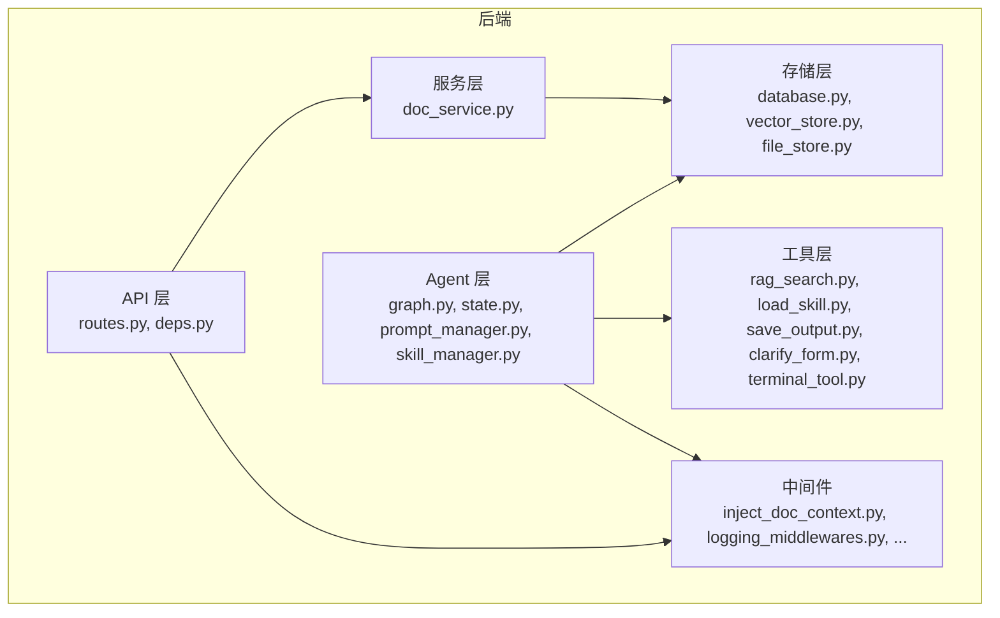
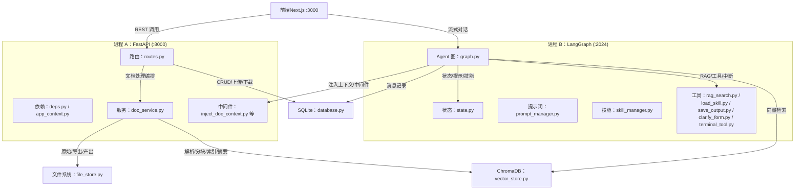
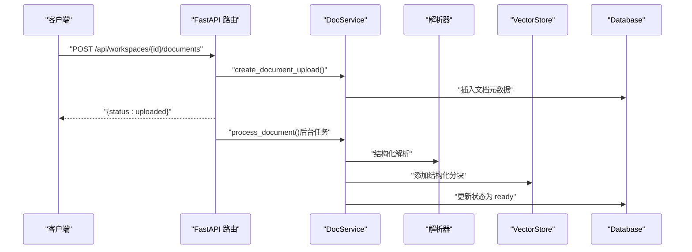
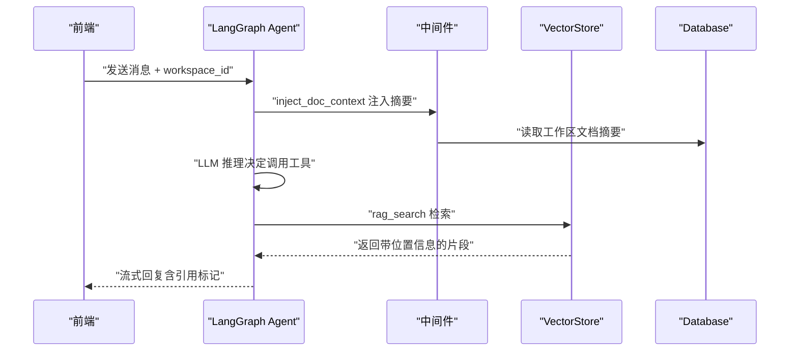
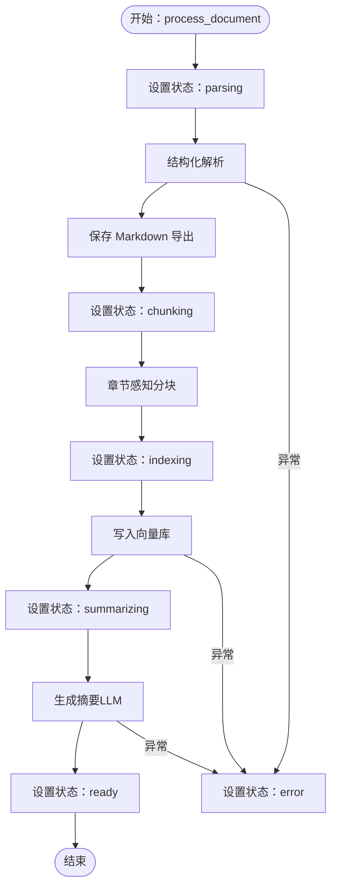
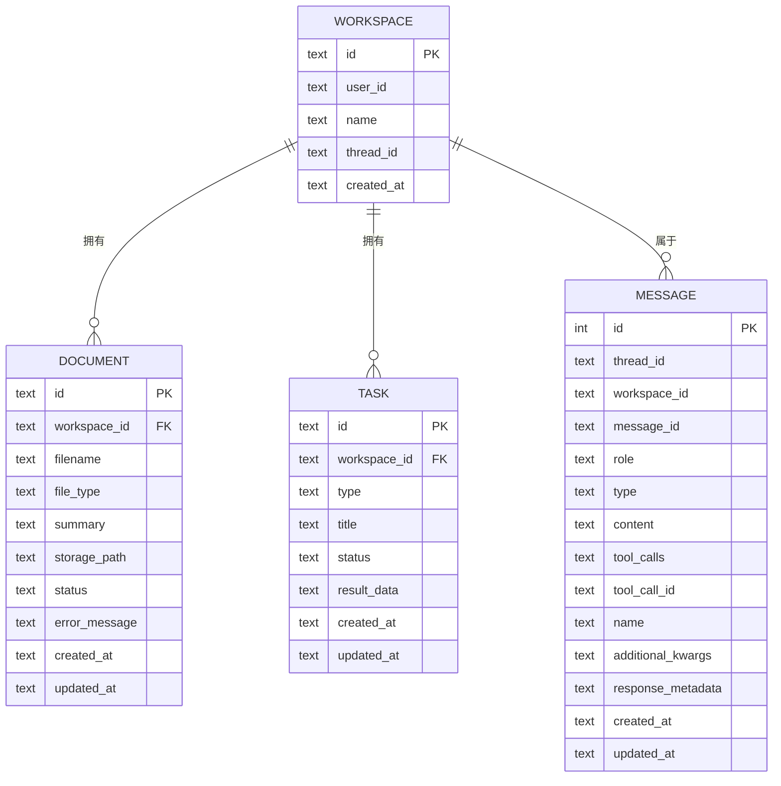
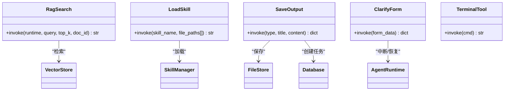
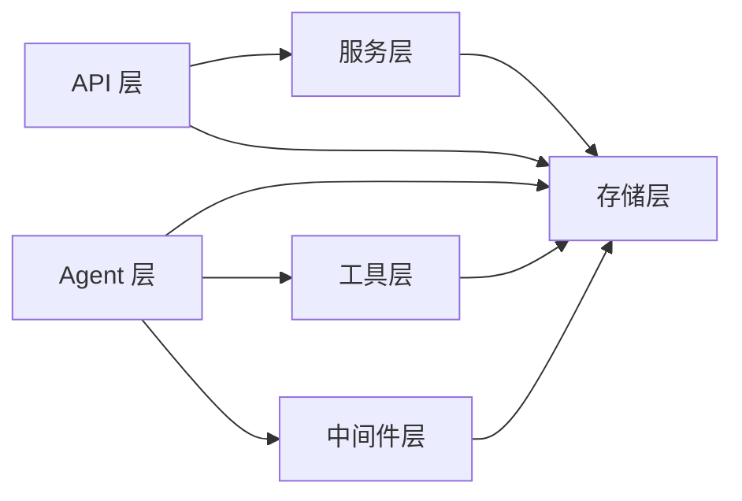

# 后端架构总览

<cite>
**本文引用的文件**
- [backend/src/agent/graph.py](file://backend/src/agent/graph.py)
- [backend/src/agent/state.py](file://backend/src/agent/state.py)
- [backend/src/agent/prompt_manager.py](file://backend/src/agent/prompt_manager.py)
- [backend/src/agent/skill_manager.py](file://backend/src/agent/skill_manager.py)
- [backend/src/api/routes.py](file://backend/src/api/routes.py)
- [backend/src/api/deps.py](file://backend/src/api/deps.py)
- [backend/src/middlewares/inject_doc_context.py](file://backend/src/middlewares/inject_doc_context.py)
- [backend/src/middlewares/logging_middlewares.py](file://backend/src/middlewares/logging_middlewares.py)
- [backend/src/middlewares/model_message_sanitizer.py](file://backend/src/middlewares/model_message_sanitizer.py)
- [backend/src/middlewares/summarization.py](file://backend/src/middlewares/summarization.py)
- [backend/src/services/doc_service.py](file://backend/src/services/doc_service.py)
- [backend/src/storage/database.py](file://backend/src/storage/database.py)
- [backend/src/storage/vector_store.py](file://backend/src/storage/vector_store.py)
- [backend/src/storage/file_store.py](file://backend/src/storage/file_store.py)
- [backend/src/tools/rag_search.py](file://backend/src/tools/rag_search.py)
- [backend/src/tools/load_skill.py](file://backend/src/tools/load_skill.py)
- [backend/src/tools/save_output.py](file://backend/src/tools/save_output.py)
- [backend/src/tools/clarify_form.py](file://backend/src/tools/clarify_form.py)
- [backend/src/tools/terminal_tool.py](file://backend/src/tools/terminal_tool.py)
- [backend/src/app_context.py](file://backend/src/app_context.py)
- [backend/langgraph.json](file://backend/langgraph.json)
- [backend/pyproject.toml](file://backend/pyproject.toml)
- [docs/backend-architecture.md](file://docs/backend-architecture.md)
</cite>

## 目录
1. [简介](#简介)
2. [项目结构](#项目结构)
3. [核心组件](#核心组件)
4. [架构总览](#架构总览)
5. [详细组件分析](#详细组件分析)
6. [依赖分析](#依赖分析)
7. [性能考虑](#性能考虑)
8. [故障排查指南](#故障排查指南)
9. [结论](#结论)
10. [附录](#附录)

## 简介
本文件为 Train Agent 后端架构的全面概述文档，聚焦于分层架构与双进程协作模式。系统采用四层架构：API 层、Agent 层、服务层、存储层；同时通过 FastAPI 与 LangGraph 两个独立进程协同工作，共享底层存储（SQLite、ChromaDB、文件系统）。本文将详细说明各层职责、数据与控制流、中间件与工具的作用机制，并提供架构图与组件关系图，帮助开发者快速理解整体设计。

## 项目结构
后端位于 backend 目录，采用按层与按功能混合的组织方式：
- api：REST API 路由与依赖注入
- agent：LangGraph Agent 图、状态、提示词与技能管理
- services：业务编排（文档处理流水线）
- storage：数据库、向量库、文件系统封装
- tools：Agent 工具集合
- middlewares：模型请求中间件（日志、提示词注入、摘要、消息净化）
- scripts：辅助脚本
- 配置：langgraph.json、pyproject.toml、.env

**图表来源**
- [backend/src/api/routes.py:1-189](file://backend/src/api/routes.py#L1-L189)
- [backend/src/api/deps.py:1-30](file://backend/src/api/deps.py#L1-L30)
- [backend/src/agent/graph.py:1-49](file://backend/src/agent/graph.py#L1-L49)
- [backend/src/agent/state.py:1-7](file://backend/src/agent/state.py#L1-L7)
- [backend/src/services/doc_service.py:1-218](file://backend/src/services/doc_service.py#L1-L218)
- [backend/src/storage/database.py:1-379](file://backend/src/storage/database.py#L1-L379)
- [backend/src/storage/vector_store.py:1-177](file://backend/src/storage/vector_store.py#L1-L177)
- [backend/src/storage/file_store.py:1-39](file://backend/src/storage/file_store.py#L1-L39)
- [backend/src/middlewares/inject_doc_context.py:1-41](file://backend/src/middlewares/inject_doc_context.py#L1-L41)
- [backend/src/tools/rag_search.py:1-76](file://backend/src/tools/rag_search.py#L1-L76)
- [backend/src/tools/load_skill.py:1-116](file://backend/src/tools/load_skill.py#L1-L116)

**章节来源**
- [docs/backend-architecture.md:65-117](file://docs/backend-architecture.md#L65-L117)

## 核心组件
- 双进程架构
  - FastAPI 服务（端口 8000）：负责 REST API、文件上传下载、工作区/文档/任务 CRUD、消息查询与静态资源挂载。
  - LangGraph 服务（端口 2024）：负责 Agent 流式对话、工具调用、中断恢复与消息历史记录。
- 四层架构
  - API 层：FastAPI 路由与依赖注入，统一对外接口。
  - Agent 层：LangGraph Agent 图、状态、中间件与工具。
  - 服务层：文档处理流水线（解析、分块、索引、摘要）。
  - 存储层：SQLite、ChromaDB、文件系统。
- 关键技术栈
  - Web：FastAPI + Uvicorn
  - Agent：LangChain + LangGraph
  - LLM：langchain-openai + Dashscope
  - 向量库：ChromaDB
  - 关系库：aiosqlite
  - 文档解析：PyMuPDF、python-docx、内置解析器
  - 文本分块：langchain-text-splitters

**章节来源**
- [docs/backend-architecture.md:7-62](file://docs/backend-architecture.md#L7-L62)
- [backend/pyproject.toml:1-41](file://backend/pyproject.toml#L1-L41)

## 架构总览
双进程协作与分层职责如下：

**图表来源**
- [docs/backend-architecture.md:18-44](file://docs/backend-architecture.md#L18-L44)
- [backend/src/api/routes.py:1-189](file://backend/src/api/routes.py#L1-L189)
- [backend/src/api/deps.py:1-30](file://backend/src/api/deps.py#L1-L30)
- [backend/src/agent/graph.py:1-49](file://backend/src/agent/graph.py#L1-L49)
- [backend/src/agent/state.py:1-7](file://backend/src/agent/state.py#L1-L7)
- [backend/src/services/doc_service.py:1-218](file://backend/src/services/doc_service.py#L1-L218)
- [backend/src/storage/database.py:1-379](file://backend/src/storage/database.py#L1-L379)
- [backend/src/storage/vector_store.py:1-177](file://backend/src/storage/vector_store.py#L1-L177)
- [backend/src/storage/file_store.py:1-39](file://backend/src/storage/file_store.py#L1-L39)

## 详细组件分析

### API 层（FastAPI）
- 路由职责
  - 工作区：创建、查询、绑定 LangGraph thread_id、删除（级联清理）
  - 文档：上传（异步后台处理）、查询、删除
  - 任务：查询、删除
  - 文件：通用下载
  - 静态资源：PPT 资产与模板挂载
- 关键设计
  - 文档上传立即返回“uploaded”，后台通过 BackgroundTasks 执行解析/分块/索引/摘要，前端轮询状态
  - CORS 开放便于开发
- 依赖注入
  - 通过 app_context 与 deps 提供 db、vector_store、file_store、skill_manager、llm、doc_service 单例

**图表来源**
- [backend/src/api/routes.py:112-128](file://backend/src/api/routes.py#L112-L128)
- [backend/src/services/doc_service.py:35-130](file://backend/src/services/doc_service.py#L35-L130)
- [backend/src/storage/database.py:285-311](file://backend/src/storage/database.py#L285-L311)
- [backend/src/storage/vector_store.py:91-122](file://backend/src/storage/vector_store.py#L91-L122)

**章节来源**
- [backend/src/api/routes.py:1-189](file://backend/src/api/routes.py#L1-L189)
- [backend/src/api/deps.py:1-30](file://backend/src/api/deps.py#L1-L30)
- [backend/src/app_context.py:1-31](file://backend/src/app_context.py#L1-L31)

### Agent 层（LangGraph）
- Agent 图构建
  - 使用 ChatOpenAI（通过 Dashscope 兼容接口）作为模型，启用流式与思考开关
  - 注入 MessageHistoryCallback，记录消息到数据库
  - 注册工具与中间件（动态注入文档摘要、修复 tool_call id）
- Agent 状态
  - 扩展 AgentState，增加 workspace_id，贯穿工具调用与中间件
- 中间件
  - inject_doc_context：在推理前从数据库读取当前工作区文档摘要并注入系统提示词
  - 其他中间件：日志、消息净化、摘要等
- 技能管理
  - 启动时仅列出技能名称与描述，按需加载完整技能内容，支持批量加载技能文件

**图表来源**
- [backend/src/agent/graph.py:16-37](file://backend/src/agent/graph.py#L16-L37)
- [backend/src/middlewares/inject_doc_context.py:11-40](file://backend/src/middlewares/inject_doc_context.py#L11-L40)
- [backend/src/tools/rag_search.py:40-75](file://backend/src/tools/rag_search.py#L40-L75)
- [backend/src/storage/vector_store.py:124-163](file://backend/src/storage/vector_store.py#L124-L163)

**章节来源**
- [backend/src/agent/graph.py:1-49](file://backend/src/agent/graph.py#L1-L49)
- [backend/src/agent/state.py:1-7](file://backend/src/agent/state.py#L1-L7)
- [backend/src/middlewares/inject_doc_context.py:1-41](file://backend/src/middlewares/inject_doc_context.py#L1-L41)
- [docs/backend-architecture.md:181-246](file://docs/backend-architecture.md#L181-L246)

### 服务层（DocService）
- 文档处理流水线
  - 上传：保存原始文件 + 创建元数据
  - 解析：结构化解析为 DocumentSection 列表
  - 导出：生成 Markdown 并保存
  - 分块：按章节与页码切分为 ChunkWithMetadata
  - 索引：写入 ChromaDB（按 workspace 隔离 collection）
  - 摘要：调用 LLM 生成 200 字摘要（失败回退）
  - 状态机：uploaded → parsing → parsed → chunking → indexing → summarizing → ready（任一阶段失败进入 error）
- 删除操作
  - 删除文档：清理文件、向量、DB 记录
  - 删除工作区：遍历清理并删除 collection 与文件目录

**图表来源**
- [backend/src/services/doc_service.py:57-130](file://backend/src/services/doc_service.py#L57-L130)

**章节来源**
- [backend/src/services/doc_service.py:1-218](file://backend/src/services/doc_service.py#L1-L218)

### 存储层
- Database（SQLite，异步）
  - 表：workspace、document、task、message
  - 外键：document/task → workspace（CASCADE）
  - 自动迁移：新增列兼容
  - 消息记录：支持 tool_calls、响应元数据等字段
- VectorStore（ChromaDB）
  - Embedding：Dashscope text-embedding-v2
  - Collection：按 workspace_id 隔离（ws_{workspace_id}）
  - 元数据：doc_id、filename、chunk_index、章节/页码、section_level
  - 检索：余弦相似度，支持按 doc_id 过滤
- FileStore（文件系统）
  - 存储结构：{base_dir}/{workspace_id}/{filename}
  - 支持同步/异步写入、单文件删除、工作区目录删除

**图表来源**
- [backend/src/storage/database.py:25-76](file://backend/src/storage/database.py#L25-L76)

**章节来源**
- [backend/src/storage/database.py:1-379](file://backend/src/storage/database.py#L1-L379)
- [backend/src/storage/vector_store.py:1-177](file://backend/src/storage/vector_store.py#L1-L177)
- [backend/src/storage/file_store.py:1-39](file://backend/src/storage/file_store.py#L1-L39)

### 工具层
- rag_search：在当前工作区（或指定文档）进行向量检索，返回带位置信息的片段
- load_skill：渐进式技能披露，Agent 仅看到名称与描述，按需加载完整技能与文件
- save_output：创建任务、保存文件到 outputs 目录、更新任务状态
- clarify_form：利用 LangGraph interrupt 暂停执行，等待前端表单输入后 resume
- terminal_tool：Shell 命令执行（当前未注册）

**图表来源**
- [backend/src/tools/rag_search.py:40-75](file://backend/src/tools/rag_search.py#L40-L75)
- [backend/src/tools/load_skill.py:13-115](file://backend/src/tools/load_skill.py#L13-L115)
- [backend/src/tools/save_output.py](file://backend/src/tools/save_output.py)
- [backend/src/tools/clarify_form.py](file://backend/src/tools/clarify_form.py)
- [backend/src/tools/terminal_tool.py](file://backend/src/tools/terminal_tool.py)

**章节来源**
- [backend/src/tools/rag_search.py:1-76](file://backend/src/tools/rag_search.py#L1-L76)
- [backend/src/tools/load_skill.py:1-116](file://backend/src/tools/load_skill.py#L1-L116)
- [backend/src/tools/save_output.py](file://backend/src/tools/save_output.py)
- [backend/src/tools/clarify_form.py](file://backend/src/tools/clarify_form.py)
- [backend/src/tools/terminal_tool.py](file://backend/src/tools/terminal_tool.py)

## 依赖分析
- 进程间耦合
  - FastAPI 与 LangGraph 共享存储（SQLite、ChromaDB、文件系统），但各自独立初始化依赖实例
  - LangGraph 通过 langgraph.json 指定入口 graph:graph
- 组件内聚与耦合
  - API 层依赖服务层与存储层；服务层依赖解析器与存储层；Agent 层依赖工具层、中间件与存储层
  - 工具与中间件通过 AppContext 注入的共享实例访问存储
- 外部依赖
  - LLM：langchain-openai + Dashscope
  - 向量库：ChromaDB
  - 文档解析：PyMuPDF、python-docx、langchain-text-splitters
  - 关系库：aiosqlite
  - Web：FastAPI + Uvicorn

**图表来源**
- [backend/langgraph.json:1-9](file://backend/langgraph.json#L1-L9)
- [backend/pyproject.toml:1-41](file://backend/pyproject.toml#L1-L41)

**章节来源**
- [backend/langgraph.json:1-9](file://backend/langgraph.json#L1-L9)
- [backend/pyproject.toml:1-41](file://backend/pyproject.toml#L1-L41)

## 性能考虑
- 异步与并发
  - 存储层使用异步 SQLite（aiosqlite）与异步文件写入，降低 I/O 阻塞
  - 文档处理在后台任务中执行，避免阻塞 API 响应
- 向量检索优化
  - ChromaDB 使用余弦相似度，collection 按 workspace 隔离，减少无关扫描
  - 批量写入，默认 batch_size=20
- LLM 调用
  - 摘要生成失败回退为截断文本，避免 LLM 错误影响整体性能
- 中间件与工具
  - 中间件在推理前注入文档摘要，减少重复上下文传输
  - 工具调用最小化，按需加载技能与文件

## 故障排查指南
- 文档处理失败
  - 检查 process_document 状态机，定位失败阶段（解析/索引/摘要）
  - 查看数据库错误字段与日志
- 向量检索为空
  - 确认 workspace_id 正确且 collection 已创建
  - 检查分块是否成功写入
- Agent 中断与恢复
  - 确认 clarify_form 触发与前端 resume 调用
  - 检查 LangGraph thread_id 是否正确绑定
- CORS 与静态资源
  - 确认 CORS 配置与静态挂载路径存在

**章节来源**
- [backend/src/services/doc_service.py:121-130](file://backend/src/services/doc_service.py#L121-L130)
- [backend/src/storage/vector_store.py:124-163](file://backend/src/storage/vector_store.py#L124-L163)
- [backend/src/api/routes.py:177-189](file://backend/src/api/routes.py#L177-L189)

## 结论
Train Agent 后端通过双进程架构实现了清晰的职责分离：FastAPI 负责 REST API 与文件处理，LangGraph 专注智能推理与工具调用。四层架构确保了高内聚低耦合，共享存储层提供了统一的数据基础。渐进式技能披露、结构化解析与向量化检索提升了 RAG 的准确性与效率。整体设计兼顾易用性与可扩展性，适合持续迭代与功能拓展。

## 附录
- 环境变量与配置
  - LLM 与 Embedding：通过 Dashscope 兼容接口调用
  - 数据目录：DATA_DIR 控制 SQLite、ChromaDB、文件系统根目录
- 启动与部署
  - FastAPI：uvicorn 启动
  - LangGraph：langgraph serve 指向 langgraph.json 中的 graph 入口

**章节来源**
- [docs/backend-architecture.md:431-465](file://docs/backend-architecture.md#L431-L465)
- [backend/langgraph.json:1-9](file://backend/langgraph.json#L1-L9)