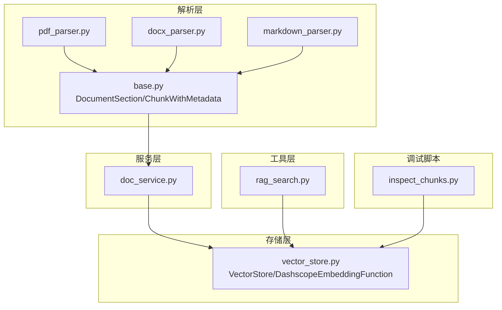
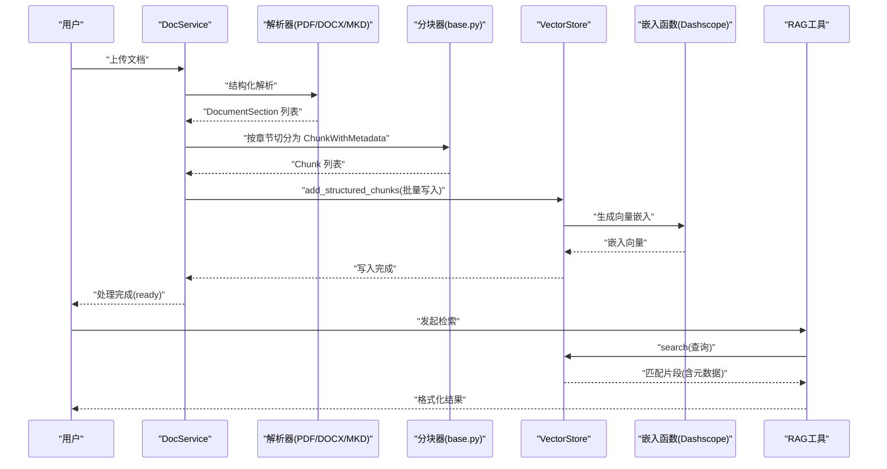
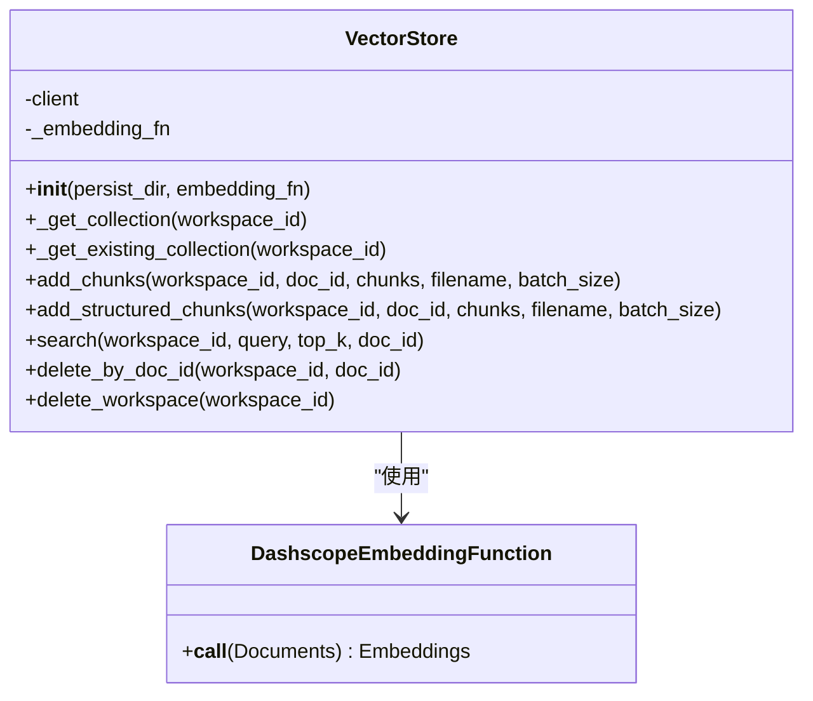
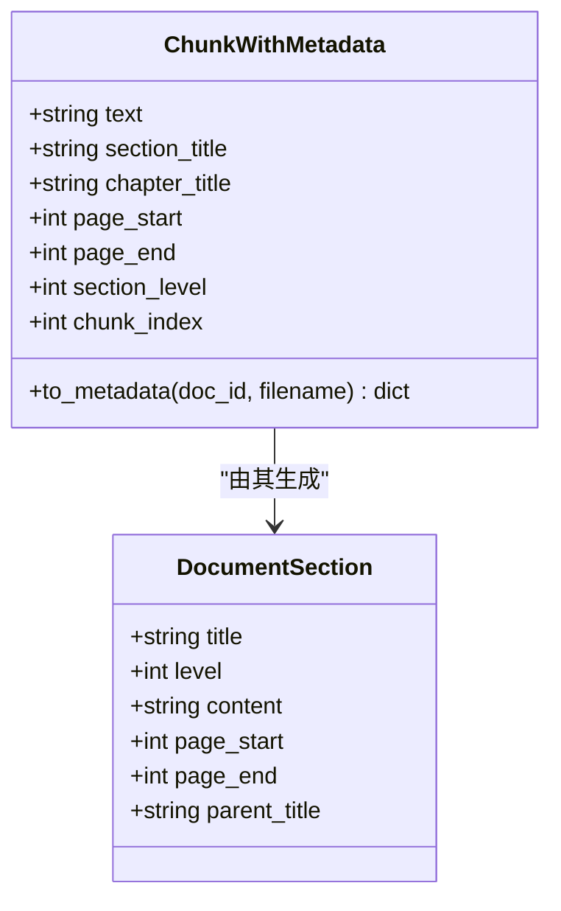
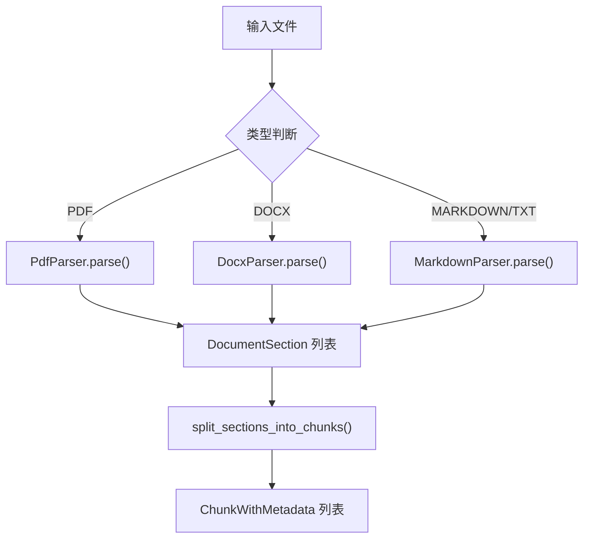
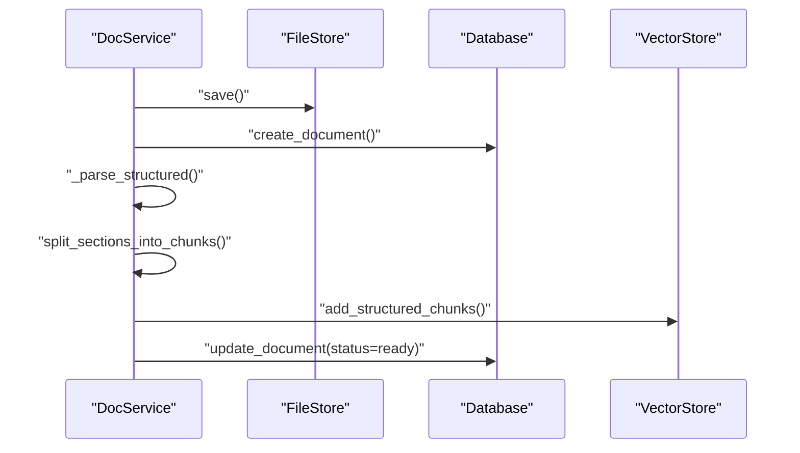
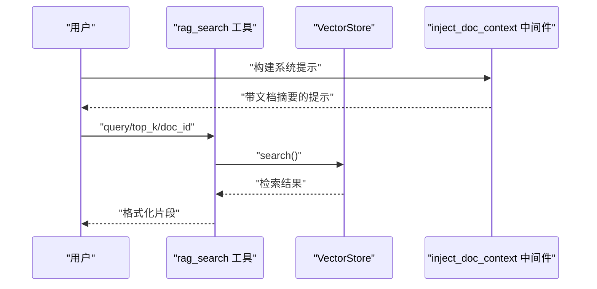
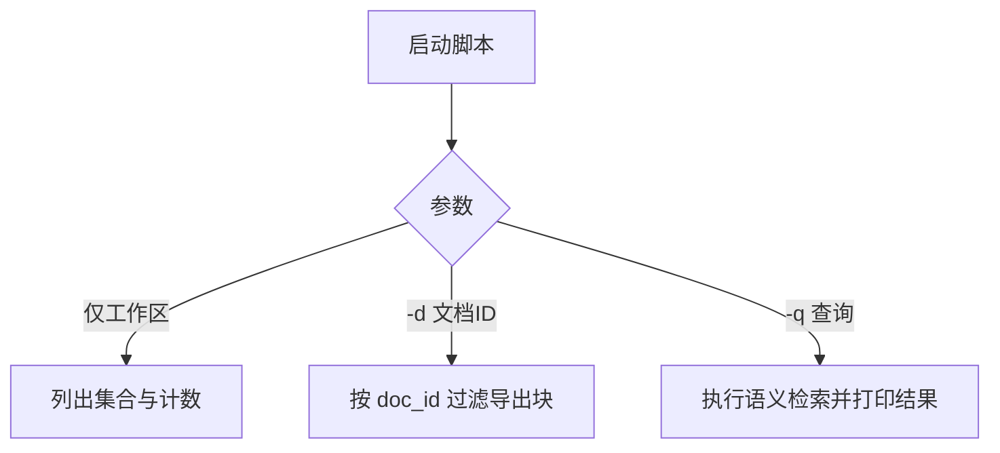
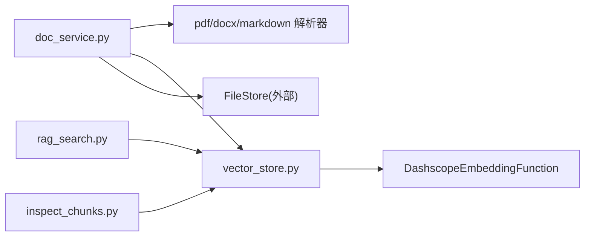

# 向量存储架构

<cite>
**本文引用的文件**
- [vector_store.py](file://backend/src/storage/vector_store.py)
- [rag_search.py](file://backend/src/tools/rag_search.py)
- [inject_doc_context.py](file://backend/src/middlewares/inject_doc_context.py)
- [base.py](file://backend/src/parsers/base.py)
- [docx_parser.py](file://backend/src/parsers/docx_parser.py)
- [pdf_parser.py](file://backend/src/parsers/pdf_parser.py)
- [markdown_parser.py](file://backend/src/parsers/markdown_parser.py)
- [doc_service.py](file://backend/src/services/doc_service.py)
- [inspect_chunks.py](file://backend/scripts/inspect_chunks.py)
- [pyproject.toml](file://backend/pyproject.toml)
</cite>

## 目录
1. [简介](#简介)
2. [项目结构](#项目结构)
3. [核心组件](#核心组件)
4. [架构总览](#架构总览)
5. [详细组件分析](#详细组件分析)
6. [依赖分析](#依赖分析)
7. [性能考虑](#性能考虑)
8. [故障排查指南](#故障排查指南)
9. [结论](#结论)
10. [附录](#附录)

## 简介
本文件面向 Train Agent 的向量存储架构，系统性阐述基于 ChromaDB 的向量数据库集成方案，涵盖客户端初始化、集合管理、向量嵌入处理、批量写入与查询、元数据过滤、索引策略与性能调优，并结合文档解析流程（文本分块、嵌入生成、向量入库）给出完整工作流。同时提供向量查询示例与性能基准建议，帮助开发者快速理解与优化向量检索能力。

## 项目结构
向量存储相关代码主要分布在后端模块的 storage、parsers、services、tools 与 scripts 中，形成“解析 → 分块 → 嵌入 → 写入向量库 → 查询工具”的闭环。关键路径如下：
- 存储层：向量存储封装与嵌入函数
- 解析层：PDF、DOCX、Markdown 结构化解析
- 服务层：文档上传与处理流水线
- 工具层：RAG 检索工具
- 调试脚本：ChromaDB 集合与查询检查

图表来源
- [pdf_parser.py:1-192](file://backend/src/parsers/pdf_parser.py#L1-L192)
- [docx_parser.py:1-84](file://backend/src/parsers/docx_parser.py#L1-L84)
- [markdown_parser.py:1-62](file://backend/src/parsers/markdown_parser.py#L1-L62)
- [base.py:1-97](file://backend/src/parsers/base.py#L1-L97)
- [doc_service.py:1-218](file://backend/src/services/doc_service.py#L1-L218)
- [vector_store.py:1-177](file://backend/src/storage/vector_store.py#L1-L177)
- [rag_search.py:1-76](file://backend/src/tools/rag_search.py#L1-L76)
- [inspect_chunks.py:1-140](file://backend/scripts/inspect_chunks.py#L1-L140)

章节来源
- [pyproject.toml:1-41](file://backend/pyproject.toml#L1-L41)
- [doc_service.py:1-218](file://backend/src/services/doc_service.py#L1-L218)
- [vector_store.py:1-177](file://backend/src/storage/vector_store.py#L1-L177)

## 核心组件
- 向量存储封装：负责集合创建/获取、批量写入、查询、删除等操作，并内置嵌入函数以对接 DashScope 文本嵌入服务。
- 结构化分块模型：定义文档结构单元与带元数据的文本块，支持按章节层级与页码进行语义分块。
- 文档服务：统一编排解析、分块、嵌入、入库、摘要生成与状态管理。
- RAG 检索工具：将用户查询转换为检索请求，格式化返回结果。
- 调试脚本：列出集合、查看文档块、执行语义检索，辅助定位问题。

章节来源
- [vector_store.py:13-177](file://backend/src/storage/vector_store.py#L13-L177)
- [base.py:6-97](file://backend/src/parsers/base.py#L6-L97)
- [doc_service.py:13-218](file://backend/src/services/doc_service.py#L13-L218)
- [rag_search.py:40-76](file://backend/src/tools/rag_search.py#L40-L76)
- [inspect_chunks.py:25-140](file://backend/scripts/inspect_chunks.py#L25-L140)

## 架构总览
下图展示从文档上传到向量检索的关键交互：

图表来源
- [doc_service.py:57-130](file://backend/src/services/doc_service.py#L57-L130)
- [pdf_parser.py:20-36](file://backend/src/parsers/pdf_parser.py#L20-L36)
- [docx_parser.py:23-84](file://backend/src/parsers/docx_parser.py#L23-L84)
- [markdown_parser.py:16-62](file://backend/src/parsers/markdown_parser.py#L16-L62)
- [base.py:47-97](file://backend/src/parsers/base.py#L47-L97)
- [vector_store.py:91-122](file://backend/src/storage/vector_store.py#L91-L122)
- [rag_search.py:40-76](file://backend/src/tools/rag_search.py#L40-L76)

## 详细组件分析

### 向量存储与嵌入函数
- 客户端初始化：使用持久化客户端连接本地 ChromaDB 目录，集合命名采用“ws_{workspace_id}”规范。
- 集合管理：首次访问自动创建集合，设置余弦空间；支持按工作区删除集合或按文档 ID 删除条目。
- 批量写入：
  - add_chunks：兼容旧版纯文本分块写入。
  - add_structured_chunks：推荐用法，写入结构化 ChunkWithMetadata，包含章节标题、页码、层级等元数据。
- 查询与过滤：支持按 doc_id 过滤，返回文档文本、元数据及可选距离值。
- 嵌入函数：DashscopeEmbeddingFunction 通过环境变量读取模型名、API Key 与可选 Base URL，统一输出向量数组。

图表来源
- [vector_store.py:13-177](file://backend/src/storage/vector_store.py#L13-L177)

章节来源
- [vector_store.py:39-177](file://backend/src/storage/vector_store.py#L39-L177)

### 结构化分块与元数据
- DocumentSection：表示文档结构单元（章节/小节），包含标题、层级、页码范围与父标题。
- ChunkWithMetadata：在文本基础上附加结构化元数据，便于检索后还原位置信息。
- split_sections_into_chunks：基于 LangChain 的递归字符分割器，按最大长度与重叠切分，确保语义完整性。

图表来源
- [base.py:6-97](file://backend/src/parsers/base.py#L6-L97)

章节来源
- [base.py:18-97](file://backend/src/parsers/base.py#L18-L97)

### 文档解析器
- PDF 解析：基于 PyMuPDF 提取文本块，启发式识别标题、估算字号比确定层级，回退到按页切分。
- DOCX 解析：依据样式名称映射到标题层级，聚合段落内容。
- Markdown 解析：基于 # 标记提取标题与内容，无标题时整段作为一级章节。

图表来源
- [pdf_parser.py:20-192](file://backend/src/parsers/pdf_parser.py#L20-L192)
- [docx_parser.py:23-84](file://backend/src/parsers/docx_parser.py#L23-L84)
- [markdown_parser.py:16-62](file://backend/src/parsers/markdown_parser.py#L16-L62)
- [base.py:47-97](file://backend/src/parsers/base.py#L47-L97)

章节来源
- [pdf_parser.py:17-192](file://backend/src/parsers/pdf_parser.py#L17-L192)
- [docx_parser.py:20-84](file://backend/src/parsers/docx_parser.py#L20-L84)
- [markdown_parser.py:13-62](file://backend/src/parsers/markdown_parser.py#L13-L62)
- [base.py:47-97](file://backend/src/parsers/base.py#L47-L97)

### 文档服务：解析-分块-嵌入-入库流水线
- 上传入口：创建文档记录、保存文件、解析结构、生成摘要、分块、写入向量库。
- 状态管理：解析、分块、索引、摘要、就绪等阶段状态更新。
- 删除策略：支持按工作区或单文档删除，清理向量集合与文件存储。

图表来源
- [doc_service.py:29-130](file://backend/src/services/doc_service.py#L29-L130)
- [base.py:47-97](file://backend/src/parsers/base.py#L47-L97)
- [vector_store.py:91-122](file://backend/src/storage/vector_store.py#L91-L122)

章节来源
- [doc_service.py:13-218](file://backend/src/services/doc_service.py#L13-L218)

### RAG 检索工具与上下文注入
- RAG 检索工具：根据当前工作区与可选 doc_id 调用 VectorStore.search，格式化返回片段与位置信息。
- 上下文注入中间件：动态拼接系统提示中的“当前知识库文档摘要”，提升检索意图一致性。

图表来源
- [rag_search.py:40-76](file://backend/src/tools/rag_search.py#L40-L76)
- [vector_store.py:124-163](file://backend/src/storage/vector_store.py#L124-L163)
- [inject_doc_context.py:11-41](file://backend/src/middlewares/inject_doc_context.py#L11-L41)

章节来源
- [rag_search.py:40-76](file://backend/src/tools/rag_search.py#L40-L76)
- [inject_doc_context.py:11-41](file://backend/src/middlewares/inject_doc_context.py#L11-L41)

### 调试与可观测性
- inspect_chunks.py：列出集合、查看指定工作区/文档的块、执行语义检索并打印距离与元数据，便于定位嵌入质量与检索效果。

图表来源
- [inspect_chunks.py:120-140](file://backend/scripts/inspect_chunks.py#L120-L140)

章节来源
- [inspect_chunks.py:1-140](file://backend/scripts/inspect_chunks.py#L1-L140)

## 依赖分析
- 外部依赖：ChromaDB、DashScope、LangChain Text Splitters、PyMuPDF、python-docx 等。
- 组件耦合：DocService 依赖解析器、分块器、VectorStore 与 FileStore；VectorStore 依赖 DashScope 嵌入函数；RAG 工具依赖 VectorStore；调试脚本直接操作 ChromaDB 客户端。

图表来源
- [doc_service.py:1-218](file://backend/src/services/doc_service.py#L1-L218)
- [vector_store.py:1-177](file://backend/src/storage/vector_store.py#L1-L177)
- [rag_search.py:1-76](file://backend/src/tools/rag_search.py#L1-L76)
- [inspect_chunks.py:1-140](file://backend/scripts/inspect_chunks.py#L1-L140)

章节来源
- [pyproject.toml:6-26](file://backend/pyproject.toml#L6-L26)

## 性能考虑
- 向量维度与距离度量
  - 维度：由 DashScope 文本嵌入模型决定，通常为固定维度（例如 1024 或更高）。具体维度请参考模型规格。
  - 距离度量：集合创建时指定余弦空间，适合高维稀疏向量的相似度比较。
- 批量写入与吞吐
  - 批大小：默认 20，可根据内存与网络状况调整；过大可能导致单批超时或内存压力。
  - 并发：当前实现逐批顺序写入；若需更高吞吐，可在上层引入并发写入与重试策略。
- 查询优化
  - top_k：控制召回数量，平衡检索速度与覆盖度。
  - 元数据过滤：优先使用 doc_id 过滤缩小搜索空间，减少向量扫描。
  - 索引策略：ChromaDB 默认使用 HNSW，已按余弦空间优化；可结合业务特征评估是否需要自定义索引参数。
- 嵌入成本
  - 嵌入调用次数与输入文本总量成正比；建议在入库前合并长段落，避免过多小块导致调用次数上升。
- 稳定性与错误处理
  - 嵌入接口异常会抛出运行时错误；建议在上游增加重试与降级策略。
  - 查询不存在集合时返回空结果，避免异常传播。

章节来源
- [vector_store.py:44-49](file://backend/src/storage/vector_store.py#L44-L49)
- [vector_store.py:124-163](file://backend/src/storage/vector_store.py#L124-L163)
- [vector_store.py:19-36](file://backend/src/storage/vector_store.py#L19-L36)

## 故障排查指南
- 常见问题
  - 集合不存在：查询时如未找到集合则返回空列表；确认工作区 ID 是否正确或是否已完成入库。
  - 嵌入失败：检查 EMBEDDING_API_KEY、EMBEDDING_MODEL、EMBEDDING_API_BASE 环境变量；查看日志中的状态码与消息。
  - 查询无结果：确认是否设置了 doc_id 过滤；适当增大 top_k；检查分块是否过小或内容为空。
- 排查步骤
  - 使用调试脚本列出集合与计数，确认向量库是否正常。
  - 导出特定工作区或文档的块，核对元数据与分块边界。
  - 执行语义检索，观察返回距离与片段，判断嵌入质量与检索效果。
- 相关实现参考
  - 集合存在性与错误处理逻辑、查询返回结构与日志记录。

章节来源
- [vector_store.py:138-143](file://backend/src/storage/vector_store.py#L138-L143)
- [vector_store.py:144-163](file://backend/src/storage/vector_store.py#L144-L163)
- [inspect_chunks.py:32-118](file://backend/scripts/inspect_chunks.py#L32-L118)

## 结论
本架构以 ChromaDB 为核心，结合结构化解析与分块、DashScope 嵌入函数，实现了从文档到向量的完整链路。通过工作区隔离的集合命名、按文档 ID 的元数据过滤与查询，以及可扩展的批量写入与调试工具，满足多文档、多工作区场景下的 RAG 需求。建议在生产环境中关注嵌入成本、批大小与索引参数调优，并配合日志与调试脚本持续监控检索质量。

## 附录

### 向量查询示例（步骤说明）
- 步骤 1：准备查询语句与工作区 ID
- 步骤 2：（可选）限定 doc_id 以缩小检索范围
- 步骤 3：调用检索工具或直接调用 VectorStore.search 获取 top_k 结果
- 步骤 4：解析返回的文本、元数据与距离，进行格式化输出

章节来源
- [rag_search.py:40-76](file://backend/src/tools/rag_search.py#L40-L76)
- [vector_store.py:124-163](file://backend/src/storage/vector_store.py#L124-L163)

### 性能基准建议（通用指导）
- 基准指标：单次嵌入耗时、批量写入吞吐（条/秒）、查询延迟（P50/P95）、召回率（按主题覆盖）。
- 影响因素：批大小、网络往返、嵌入模型维度、集合规模、过滤条件选择性。
- 优化方向：合理设置批大小、启用网络与模型侧重试、在入库前合并冗余小块、使用 doc_id 过滤、定期重建索引（如数据分布变化大）。

章节来源
- [vector_store.py:63-89](file://backend/src/storage/vector_store.py#L63-L89)
- [vector_store.py:98-105](file://backend/src/storage/vector_store.py#L98-L105)