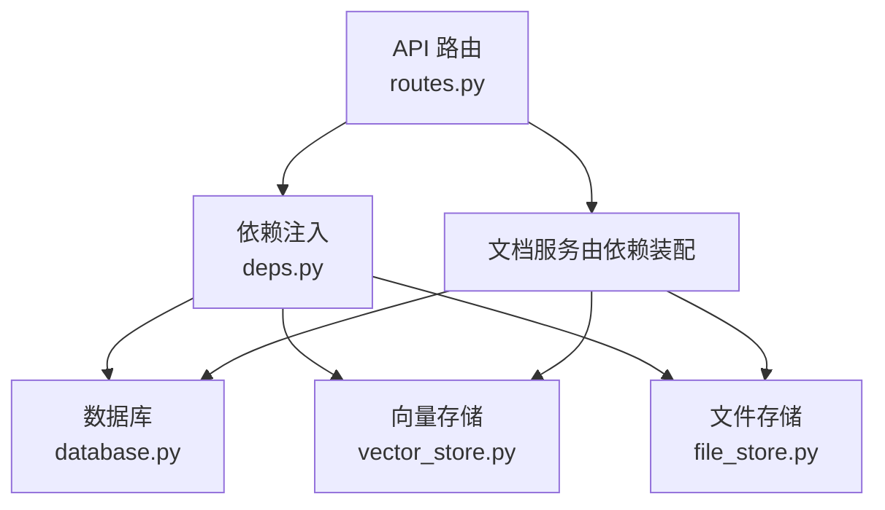
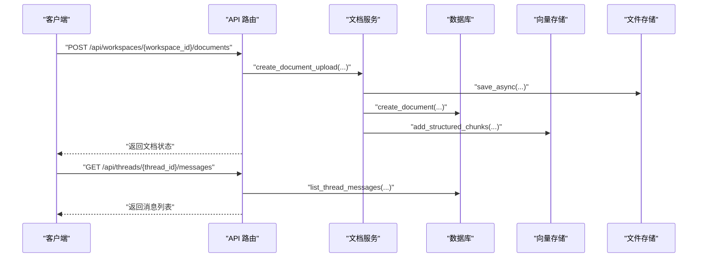
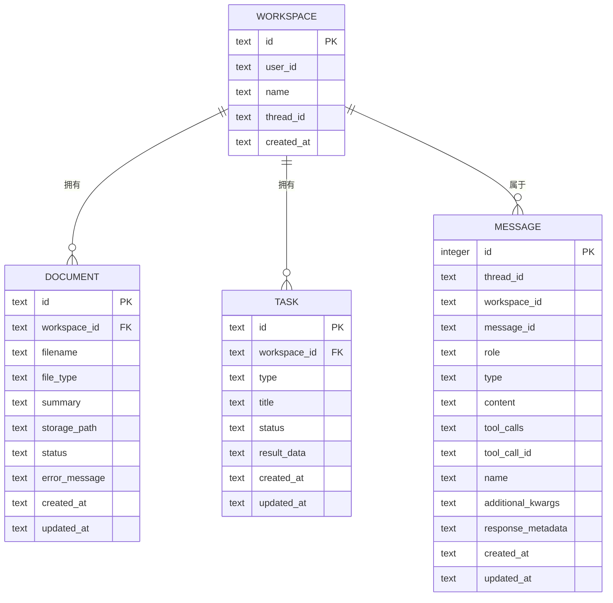
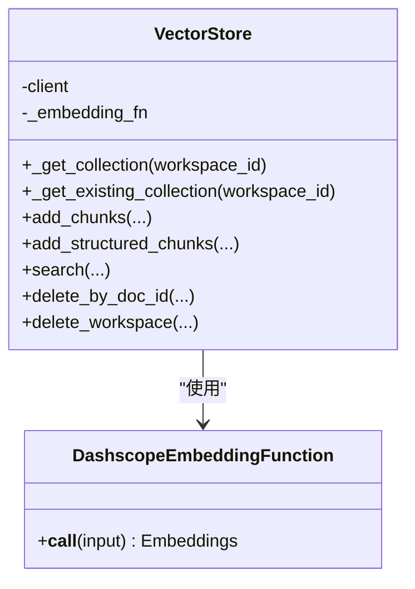
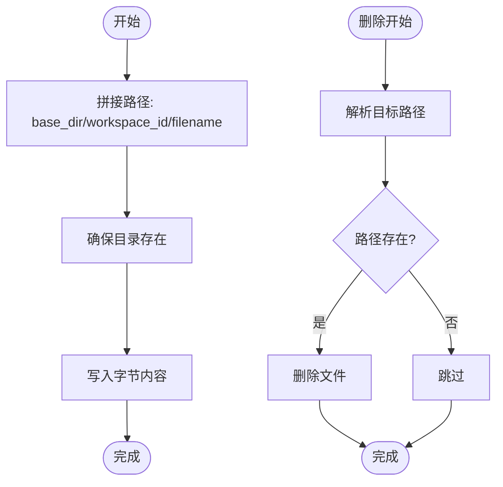
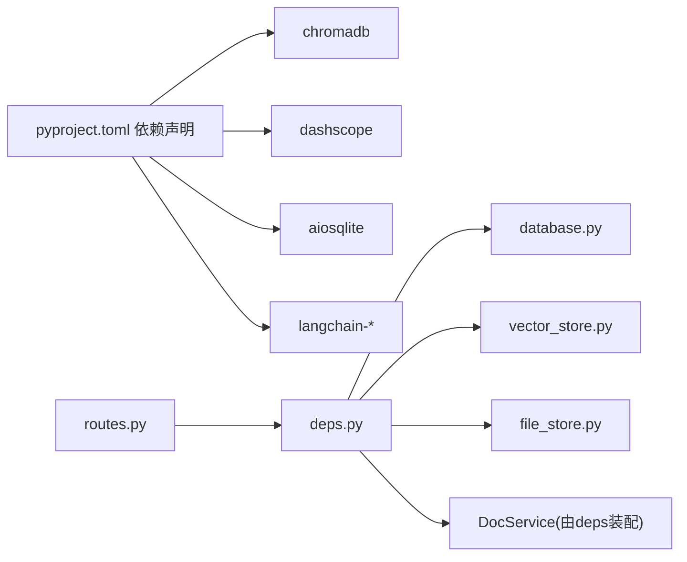

# 存储层设计

<cite>
**本文引用的文件**
- [backend/src/storage/database.py](file://backend/src/storage/database.py)
- [backend/src/storage/vector_store.py](file://backend/src/storage/vector_store.py)
- [backend/src/storage/file_store.py](file://backend/src/storage/file_store.py)
- [backend/src/parsers/base.py](file://backend/src/parsers/base.py)
- [backend/src/tools/rag_search.py](file://backend/src/tools/rag_search.py)
- [backend/src/api/routes.py](file://backend/src/api/routes.py)
- [backend/src/api/deps.py](file://backend/src/api/deps.py)
- [backend/pyproject.toml](file://backend/pyproject.toml)
</cite>

## 目录
1. [简介](#简介)
2. [项目结构](#项目结构)
3. [核心组件](#核心组件)
4. [架构总览](#架构总览)
5. [详细组件分析](#详细组件分析)
6. [依赖分析](#依赖分析)
7. [性能考虑](#性能考虑)
8. [故障排查指南](#故障排查指南)
9. [结论](#结论)
10. [附录](#附录)

## 简介
本文件面向 Train Agent 的存储层设计，聚焦数据库 Schema、向量存储（ChromaDB）、文件存储策略、数据一致性保障、Workspace 隔离机制以及性能优化与监控建议。文档以代码为依据，结合 API 路由与依赖注入，给出可操作的设计说明与最佳实践。

## 项目结构
后端采用分层组织：API 层负责请求接入与路由编排，服务层封装业务流程（如文档处理），存储层包含数据库、向量存储与文件存储三部分。依赖通过应用上下文集中注入，确保模块解耦与可测试性。

图表来源
- [backend/src/api/routes.py:30-35](file://backend/src/api/routes.py#L30-L35)
- [backend/src/api/deps.py:13-29](file://backend/src/api/deps.py#L13-L29)
- [backend/src/storage/database.py:14-19](file://backend/src/storage/database.py#L14-L19)
- [backend/src/storage/vector_store.py:40-49](file://backend/src/storage/vector_store.py#L40-L49)
- [backend/src/storage/file_store.py:6-9](file://backend/src/storage/file_store.py#L6-L9)

章节来源
- [backend/src/api/routes.py:30-35](file://backend/src/api/routes.py#L30-L35)
- [backend/src/api/deps.py:13-29](file://backend/src/api/deps.py#L13-L29)

## 核心组件
- 数据库（SQLite，异步）：提供 Workspace、Document、Task、Message 四张核心表，支持消息去重写入、时间戳更新、外键级联删除。
- 向量存储（ChromaDB）：按 Workspace 维度隔离集合，使用 DashScope 文本嵌入模型生成向量，支持结构化元数据检索与批量写入。
- 文件存储（本地）：基于路径分层的本地文件系统，按 Workspace 分目录存放，提供同步与异步写入、删除与清理能力。
- 文档解析与切分：提供结构化文档单元与文本切块的数据类与切分策略，便于向量化与检索。

章节来源
- [backend/src/storage/database.py:25-78](file://backend/src/storage/database.py#L25-L78)
- [backend/src/storage/vector_store.py:39-177](file://backend/src/storage/vector_store.py#L39-L177)
- [backend/src/storage/file_store.py:6-39](file://backend/src/storage/file_store.py#L6-L39)
- [backend/src/parsers/base.py:6-97](file://backend/src/parsers/base.py#L6-L97)

## 架构总览
存储层围绕“Workspace 隔离 + 结构化元数据 + 异步持久化”的思路构建。API 层触发文档上传与处理，服务层协调数据库、向量与文件存储，完成入库、向量化与落盘；RAG 检索工具通过向量存储查询相关片段并格式化输出。

图表来源
- [backend/src/api/routes.py:112-128](file://backend/src/api/routes.py#L112-L128)
- [backend/src/api/routes.py:84-96](file://backend/src/api/routes.py#L84-L96)
- [backend/src/storage/database.py:285-311](file://backend/src/storage/database.py#L285-L311)
- [backend/src/storage/vector_store.py:91-122](file://backend/src/storage/vector_store.py#L91-L122)
- [backend/src/storage/file_store.py:18-28](file://backend/src/storage/file_store.py#L18-L28)

## 详细组件分析

### 数据库 Schema 设计
- 表与字段
  - workspace：主键 id，用户标识 user_id，名称 name，关联线程 thread_id，时间 created_at。
  - document：主键 id，外键 workspace_id 引用 workspace(id)，文件名 filename、类型 file_type、摘要 summary、存储路径 storage_path、状态 status、错误信息 error_message、时间 created_at/updated_at。
  - task：主键 id，外键 workspace_id 引用 workspace(id)，任务类型 type、标题 title、状态 status、结果数据 result_data、时间 created_at/updated_at。
  - message：自增 id，线程 thread_id，可选 workspace_id，消息唯一标识 message_id，角色 role，类型 type，内容 content，工具调用相关字段 tool_calls/tool_call_id/name，附加参数 additional_kwargs、响应元数据 response_metadata，时间 created_at/updated_at；复合唯一索引 (thread_id, message_id, role)。
- 索引与约束
  - 复合唯一索引：message(thread_id, message_id, role)，用于幂等写入与去重。
  - 外键约束：document.task 的 workspace_id 引用 workspace(id)，并启用级联删除。
  - 兼容性迁移：动态检测列缺失并增量添加，确保演进式升级。
- 时间与 JSON 字段
  - JSON 内容通过序列化/反序列化处理，兼容不同结构；统一使用 UTC ISO 时间字符串。
- 事务与并发
  - 使用异步连接执行单条或少量原子操作；关键写入后显式提交；消息写入采用 ON CONFLICT 更新策略，避免重复插入。

图表来源
- [backend/src/storage/database.py:27-72](file://backend/src/storage/database.py#L27-L72)

章节来源
- [backend/src/storage/database.py:25-78](file://backend/src/storage/database.py#L25-L78)
- [backend/src/storage/database.py:159-228](file://backend/src/storage/database.py#L159-L228)
- [backend/src/storage/database.py:313-379](file://backend/src/storage/database.py#L313-L379)

### 向量存储架构（ChromaDB）
- 集合命名与隔离
  - 按 workspace_id 命名集合 ws_{workspace_id}，实现天然的 Workspace 隔离。
- 嵌入函数
  - 默认使用 Dashscope TextEmbedding，支持通过环境变量配置模型、密钥与网关地址。
- 相似度与检索
  - 集合元数据指定余弦空间；检索支持按 doc_id 过滤，返回文本、元数据与距离。
- 批量写入与结构化元数据
  - 支持纯文本与结构化 ChunkWithMetadata 两类写入；批量大小默认 20，减少网络往返。
- 删除策略
  - 支持按 doc_id 删除与按 Workspace 清理集合。

图表来源
- [backend/src/storage/vector_store.py:13-37](file://backend/src/storage/vector_store.py#L13-L37)
- [backend/src/storage/vector_store.py:39-177](file://backend/src/storage/vector_store.py#L39-L177)

章节来源
- [backend/src/storage/vector_store.py:39-177](file://backend/src/storage/vector_store.py#L39-L177)
- [backend/src/parsers/base.py:18-42](file://backend/src/parsers/base.py#L18-L42)

### 文件存储策略（本地）
- 目录结构
  - 以 workspace_id 为子目录，避免跨工作区冲突；自动创建父目录。
- 写入方式
  - 提供同步与异步两种写入接口，异步版本通过线程池包装阻塞 I/O，避免阻塞事件循环。
- 删除与清理
  - 支持按路径删除文件与按 Workspace 彻底清空目录。

图表来源
- [backend/src/storage/file_store.py:11-28](file://backend/src/storage/file_store.py#L11-L28)
- [backend/src/storage/file_store.py:30-39](file://backend/src/storage/file_store.py#L30-L39)

章节来源
- [backend/src/storage/file_store.py:6-39](file://backend/src/storage/file_store.py#L6-L39)

### 数据一致性与并发控制
- 幂等写入
  - 消息表通过复合唯一索引实现 ON CONFLICT 更新，避免重复记录与数据漂移。
- 时间戳更新
  - 文档与任务更新均追加 updated_at 字段，便于审计与排序。
- 外键级联
  - 删除 Workspace 时，相关 Document/Task 自动级联删除，保证引用完整性。
- 异步事务
  - 使用异步连接逐条提交，关键写入后立即 commit，降低锁持有时间。

章节来源
- [backend/src/storage/database.py:70-72](file://backend/src/storage/database.py#L70-L72)
- [backend/src/storage/database.py:321-328](file://backend/src/storage/database.py#L321-L328)
- [backend/src/storage/database.py:367-374](file://backend/src/storage/database.py#L367-L374)

### Workspace 隔离机制
- 数据分区
  - 数据库：通过 workspace_id 外键区分归属；消息表同时以 thread_id+message_id 去重。
  - 向量存储：集合名 ws_{workspace_id} 实现逻辑隔离；删除 Workspace 时清理对应集合。
  - 文件存储：按 workspace_id 分目录，删除 Workspace 时整目录删除。
- 权限控制
  - API 层在路由中读取 workspace_id，配合服务层进行资源校验与清理。
- 资源配额
  - 代码未直接体现配额限制；可在服务层增加配额检查与阈值告警，防止无限增长。

章节来源
- [backend/src/storage/vector_store.py:44-55](file://backend/src/storage/vector_store.py#L44-L55)
- [backend/src/storage/vector_store.py:172-177](file://backend/src/storage/vector_store.py#L172-L177)
- [backend/src/storage/file_store.py:35-39](file://backend/src/storage/file_store.py#L35-L39)
- [backend/src/api/routes.py:99-106](file://backend/src/api/routes.py#L99-L106)

### RAG 检索与工具集成
- 工具职责
  - 将用户查询交给向量存储检索，格式化位置信息（章节、页码、段落序号）与片段文本。
- Workspace 作用域
  - 从运行态提取 workspace_id，限定检索范围；可选 doc_id 进一步缩小到特定文档。
- 错误处理
  - 捕获异常并返回友好提示，避免中断对话流程。

章节来源
- [backend/src/tools/rag_search.py:40-76](file://backend/src/tools/rag_search.py#L40-L76)
- [backend/src/storage/vector_store.py:124-163](file://backend/src/storage/vector_store.py#L124-L163)

## 依赖分析
- 外部依赖
  - ChromaDB：向量数据库客户端，支持持久化与集合管理。
  - DashScope：文本嵌入服务，通过环境变量配置。
  - aiosqlite：异步 SQLite 访问。
  - langchain-*：文本切分与工具生态。
- 内部依赖
  - API 通过依赖注入获取数据库、向量存储、文件存储与文档服务实例。
  - 文档服务组合数据库、向量存储与文件存储，形成完整的入库链路。

图表来源
- [backend/pyproject.toml:6-26](file://backend/pyproject.toml#L6-L26)
- [backend/src/api/routes.py:10](file://backend/src/api/routes.py#L10)
- [backend/src/api/deps.py:27-29](file://backend/src/api/deps.py#L27-L29)

章节来源
- [backend/pyproject.toml:6-26](file://backend/pyproject.toml#L6-L26)
- [backend/src/api/deps.py:27-29](file://backend/src/api/deps.py#L27-L29)

## 性能考虑
- 向量存储
  - 批量写入：默认批大小 20，减少网络往返；可根据嵌入延迟与内存压力调整。
  - 集合命名：按 Workspace 隔离，避免跨工作区扫描；查询时按 doc_id 过滤可显著降低候选集。
  - 空间设置：集合元数据指定余弦空间，适合语义检索场景。
- 数据库
  - 索引：message 上的复合索引支持高效分页与去重；建议在高频查询列上评估新增索引。
  - 事务：短事务与及时提交，避免长事务锁竞争。
- 文件存储
  - 异步写入：避免阻塞事件循环；大文件建议分块上传与断点续传（可在服务层扩展）。
- 解析与切分
  - 文本切分器支持多种分隔符与重叠，平衡召回与上下文连贯性；可根据文档类型微调切分参数。

[本节为通用性能建议，不直接分析具体文件]

## 故障排查指南
- 向量存储
  - 嵌入失败：检查 EMBEDDING_API_KEY、EMBEDDING_MODEL、EMBEDDING_API_BASE 是否正确；关注日志中的状态码与错误信息。
  - 集合不存在：首次检索可能因集合尚未创建而返回空结果，后续入库会自动创建集合。
- 数据库
  - 复合唯一冲突：消息写入时若重复，ON CONFLICT 会更新字段；确认 thread_id/message_id/role 组合是否正确。
  - 外键删除：删除 Workspace 时需确保相关记录已清理，否则可能受级联影响。
- 文件存储
  - 路径不存在：下载接口对文件路径进行存在性检查；确认存储路径与权限。
- API
  - 路由启动：startup 中初始化数据库；若启动失败，检查数据库文件路径与权限。

章节来源
- [backend/src/storage/vector_store.py:19-36](file://backend/src/storage/vector_store.py#L19-L36)
- [backend/src/storage/vector_store.py:138-142](file://backend/src/storage/vector_store.py#L138-L142)
- [backend/src/storage/database.py:190-225](file://backend/src/storage/database.py#L190-L225)
- [backend/src/api/routes.py:30-35](file://backend/src/api/routes.py#L30-L35)
- [backend/src/api/routes.py:163-174](file://backend/src/api/routes.py#L163-L174)

## 结论
存储层以 Workspace 为中心实现数据分区与隔离，结合结构化元数据与异步持久化，满足 RAG 场景下的检索与回溯需求。数据库提供强一致的事务与去重能力，向量存储通过集合隔离与批量写入提升吞吐，文件存储以简单可靠的方式支撑多类型文档落地。建议在生产环境中补充资源配额、监控与备份策略，并持续评估索引与批大小参数以获得更优性能。

## 附录
- 环境变量
  - EMBEDDING_MODEL、EMBEDDING_API_KEY、EMBEDDING_API_BASE：用于配置嵌入服务。
  - SUMMARIZATION_MODEL、SUMMARIZATION_API_KEY、SUMMARIZATION_API_BASE：用于摘要/总结模型。
- API 路由要点
  - 上传文档后异步处理，后台任务触发向量化与入库。
  - 删除 Workspace 时联动清理向量集合与文件目录。

章节来源
- [backend/src/storage/vector_store.py:20-25](file://backend/src/storage/vector_store.py#L20-L25)
- [backend/src/api/deps.py:21-25](file://backend/src/api/deps.py#L21-L25)
- [backend/src/api/routes.py:112-128](file://backend/src/api/routes.py#L112-L128)
- [backend/src/api/routes.py:99-106](file://backend/src/api/routes.py#L99-L106)