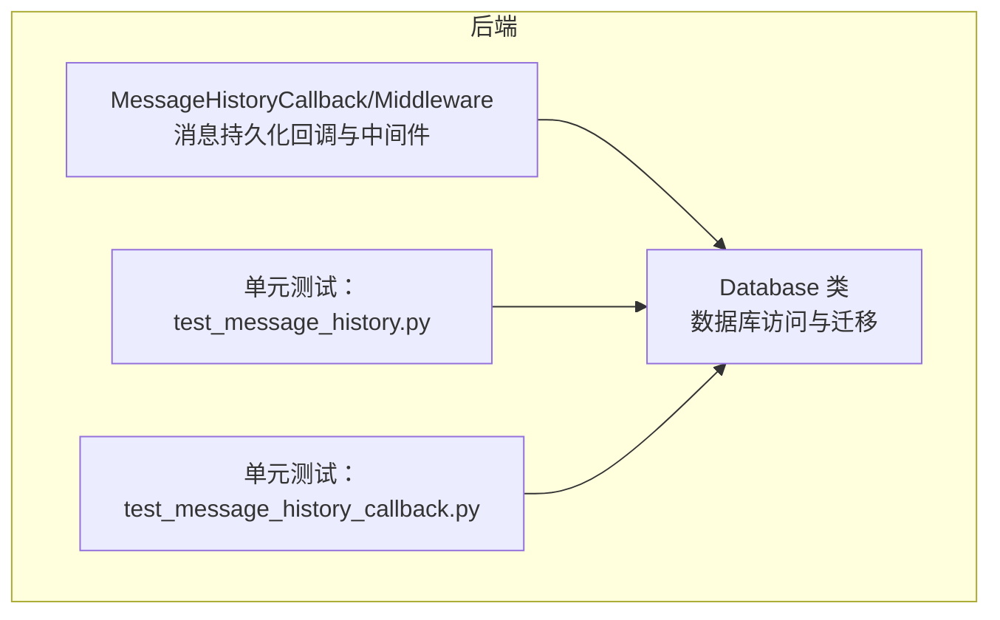
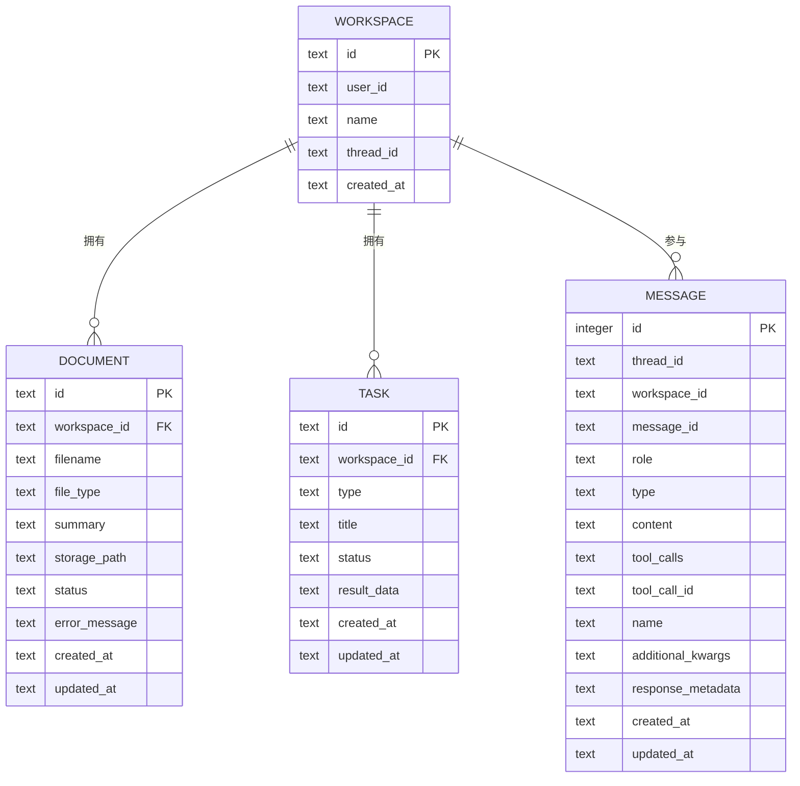
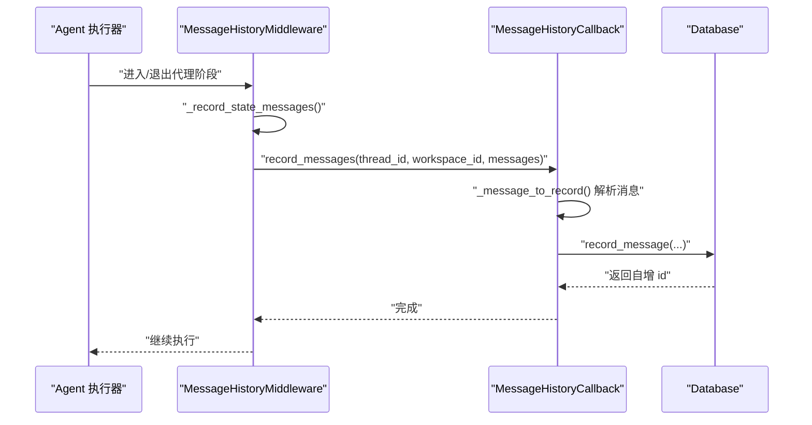
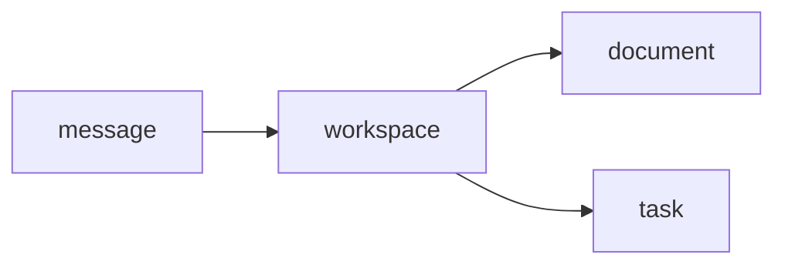

# 数据库 Schema 设计

<cite>
**本文引用的文件**
- [backend/src/storage/database.py](file://backend/src/storage/database.py)
- [backend/src/agent/message_history.py](file://backend/src/agent/message_history.py)
- [backend/tests/test_message_history.py](file://backend/tests/test_message_history.py)
- [backend/tests/test_message_history_callback.py](file://backend/tests/test_message_history_callback.py)
</cite>

## 目录
1. [简介](#简介)
2. [项目结构](#项目结构)
3. [核心组件](#核心组件)
4. [架构总览](#架构总览)
5. [详细组件分析](#详细组件分析)
6. [依赖关系分析](#依赖关系分析)
7. [性能考量](#性能考量)
8. [故障排查指南](#故障排查指南)
9. [结论](#结论)
10. [附录](#附录)

## 简介
本文件系统化梳理 Train Agent 的 SQLite 数据库 Schema 设计与实现要点，围绕工作区、文档、任务、消息四张核心表，解释表结构、字段类型、主外键约束与索引策略；阐述数据迁移与版本兼容处理；并给出查询与使用建议及最佳实践。

## 项目结构
数据库相关代码集中在后端模块中，核心类为异步封装的数据库访问层，负责建表、迁移、增删改查与分页查询。

图表来源
- [backend/src/storage/database.py:9-379](file://backend/src/storage/database.py#L9-L379)
- [backend/src/agent/message_history.py:13-143](file://backend/src/agent/message_history.py#L13-L143)
- [backend/tests/test_message_history.py:8-37](file://backend/tests/test_message_history.py#L8-L37)
- [backend/tests/test_message_history_callback.py:8-36](file://backend/tests/test_message_history_callback.py#L8-L36)

章节来源
- [backend/src/storage/database.py:9-379](file://backend/src/storage/database.py#L9-L379)
- [backend/src/agent/message_history.py:13-143](file://backend/src/agent/message_history.py#L13-L143)
- [backend/tests/test_message_history.py:8-37](file://backend/tests/test_message_history.py#L8-L37)
- [backend/tests/test_message_history_callback.py:8-36](file://backend/tests/test_message_history_callback.py#L8-L36)

## 核心组件
- 数据库访问与迁移：负责初始化连接、创建表、执行迁移脚本、提交事务。
- 消息持久化：将 LangGraph 生成的消息序列写入数据库，并支持按线程分页读取。
- 工作区、文档、任务：提供 CRUD 能力，配合外键约束保证数据一致性。

章节来源
- [backend/src/storage/database.py:14-78](file://backend/src/storage/database.py#L14-L78)
- [backend/src/storage/database.py:109-379](file://backend/src/storage/database.py#L109-L379)

## 架构总览
下图展示数据库 Schema 与关键交互流程：

图表来源
- [backend/src/storage/database.py:26-76](file://backend/src/storage/database.py#L26-L76)

## 详细组件分析

### 工作区表（workspace）
- 字段与类型
  - id：主键，文本型，全局唯一标识
  - user_id：非空，标识所属用户
  - name：非空，工作区名称（大小写不敏感比较）
  - thread_id：可空，关联会话线程
  - created_at：默认当前本地时间
- 约束与设计原则
  - 主键约束确保 id 唯一
  - 名称在用户维度唯一（通过查询校验避免重复）
  - 外键约束用于文档与任务表指向工作区
- 典型操作
  - 创建：生成新 id，校验同用户下名称唯一
  - 列表：按用户过滤并按创建时间倒序
  - 更新：设置线程 ID
  - 删除：级联删除其下的文档与任务（由外键约束触发）

章节来源
- [backend/src/storage/database.py:26-33](file://backend/src/storage/database.py#L26-L33)
- [backend/src/storage/database.py:111-155](file://backend/src/storage/database.py#L111-L155)

### 文档表（document）
- 字段与类型
  - id：主键
  - workspace_id：外键引用 workspace.id，删除时级联
  - filename：文件名
  - file_type：文件类型
  - summary：摘要
  - storage_path：存储路径
  - status：状态，默认“uploaded”
  - error_message：错误信息（迁移新增）
  - created_at/updated_at：默认当前本地时间（迁移新增）
- 约束与设计原则
  - 外键约束保证文档归属有效工作区
  - 级联删除确保工作区删除时清理文档
  - 新增列通过迁移脚本补齐，保障版本演进
- 典型操作
  - 创建：插入记录并返回标准字段集合
  - 列表：按工作区过滤并按创建时间倒序
  - 更新：动态拼接 SET 子句更新任意列
  - 删除：支持按工作区过滤或无条件删除

章节来源
- [backend/src/storage/database.py:34-45](file://backend/src/storage/database.py#L34-L45)
- [backend/src/storage/database.py:80-88](file://backend/src/storage/database.py#L80-L88)
- [backend/src/storage/database.py:284-339](file://backend/src/storage/database.py#L284-L339)

### 任务表（task）
- 字段与类型
  - id：主键
  - workspace_id：外键引用 workspace.id，删除时级联
  - type：任务类型（非空）
  - title：任务标题
  - status：状态，默认“generating”
  - result_data：结果数据
  - created_at/updated_at：默认当前本地时间
- 约束与设计原则
  - 外键约束保证任务归属有效工作区
  - 级联删除确保工作区删除时清理任务
- 典型操作
  - 创建：插入记录并返回标准字段集合
  - 列表：按工作区过滤并按创建时间倒序
  - 更新：动态拼接 SET 子句更新任意列
  - 删除：删除指定任务

章节来源
- [backend/src/storage/database.py:46-55](file://backend/src/storage/database.py#L46-L55)
- [backend/src/storage/database.py:340-379](file://backend/src/storage/database.py#L340-L379)

### 消息表（message）
- 字段与类型
  - id：自增主键
  - thread_id：非空，线程标识
  - workspace_id：可空，工作区标识
  - message_id：非空，消息唯一标识
  - role：非空，角色（human/ai/tool）
  - type：非空，消息类型
  - content：非空，消息内容（JSON 文本）
  - tool_calls：可空，工具调用列表（JSON 文本）
  - tool_call_id/name/additional_kwargs/response_metadata：可空，扩展字段（JSON 文本）
  - created_at/updated_at：非空
- 约束与设计原则
  - 唯一性约束：(thread_id, message_id, role) 防止同一角色在同一消息中的重复写入
  - JSON 序列化：content、tool_calls、additional_kwargs、response_metadata 统一以 JSON 文本存储，便于扩展
  - 迁移兼容：通过运行时探测列是否存在，按需添加缺失列
- 索引策略
  - 复合索引：(thread_id, id DESC)，用于按线程高效分页查询
- 典型操作
  - 写入：ON CONFLICT 更新策略，覆盖相同键的记录
  - 分页读取：支持 limit 与 before 游标，返回 next_cursor 以便继续翻页

章节来源
- [backend/src/storage/database.py:56-76](file://backend/src/storage/database.py#L56-L76)
- [backend/src/storage/database.py:80-103](file://backend/src/storage/database.py#L80-L103)
- [backend/src/storage/database.py:172-280](file://backend/src/storage/database.py#L172-L280)

### 消息持久化流程（回调与中间件）
消息写入由回调与中间件驱动，从 LangGraph 的状态中提取消息序列，转换为数据库记录并写入。

图表来源
- [backend/src/agent/message_history.py:109-143](file://backend/src/agent/message_history.py#L109-L143)
- [backend/src/agent/message_history.py:13-107](file://backend/src/agent/message_history.py#L13-L107)
- [backend/src/storage/database.py:172-228](file://backend/src/storage/database.py#L172-L228)

章节来源
- [backend/src/agent/message_history.py:13-143](file://backend/src/agent/message_history.py#L13-L143)
- [backend/src/storage/database.py:172-228](file://backend/src/storage/database.py#L172-L228)

## 依赖关系分析
- 外键关系
  - document.workspace_id → workspace.id（删除级联）
  - task.workspace_id → workspace.id（删除级联）
- 约束与一致性
  - workspace.name 在 user_id 维度唯一（应用层校验）
  - message.(thread_id, message_id, role) 唯一（数据库层约束）
- 索引
  - message.idx_message_thread_id_id(thread_id, id DESC) 支持线程分页查询

图表来源
- [backend/src/storage/database.py:26-76](file://backend/src/storage/database.py#L26-L76)

章节来源
- [backend/src/storage/database.py:26-76](file://backend/src/storage/database.py#L26-L76)

## 性能考量
- 索引设计
  - message 表的复合索引 (thread_id, id DESC) 可显著提升按线程分页查询的性能，避免全表扫描
- 写入策略
  - 使用 ON CONFLICT 更新策略减少重复写入成本
  - JSON 文本存储简化结构扩展，但查询时需注意反序列化开销
- 分页参数
  - 服务端限制最大 limit，避免过大数据量传输
- 迁移与兼容
  - 通过 PRAGMA table_info 动态检测列存在性，按需增量添加，降低升级风险

章节来源
- [backend/src/storage/database.py:73-74](file://backend/src/storage/database.py#L73-L74)
- [backend/src/storage/database.py:80-103](file://backend/src/storage/database.py#L80-L103)
- [backend/src/storage/database.py:230-262](file://backend/src/storage/database.py#L230-L262)

## 故障排查指南
- 常见问题
  - 重复消息写入：确认是否命中唯一约束；若命中应走 ON CONFLICT 更新路径
  - 线程分页异常：检查游标参数 before 是否正确传递 next_cursor
  - JSON 解析失败：content 或扩展字段可能为非法 JSON，回退到默认值
  - 列缺失导致迁移失败：确认迁移逻辑已执行，或手动补列
- 定位方法
  - 单元测试覆盖了消息写入、分页与去重场景，可参考测试用例定位问题
  - 关注回调与中间件对 thread_id 的解析与传递

章节来源
- [backend/tests/test_message_history.py:8-37](file://backend/tests/test_message_history.py#L8-L37)
- [backend/tests/test_message_history_callback.py:8-36](file://backend/tests/test_message_history_callback.py#L8-L36)
- [backend/src/storage/database.py:163-171](file://backend/src/storage/database.py#L163-L171)

## 结论
该 Schema 以 SQLite 为基础，采用外键与唯一约束保障数据一致性，通过复合索引优化线程分页查询，借助迁移脚本实现平滑演进。消息表采用 JSON 文本存储扩展字段，兼顾灵活性与可维护性。整体设计满足训练 Agent 的工作区、文档、任务与消息管理需求。

## 附录

### SQL 查询示例与最佳实践
- 查询某工作区下的所有文档（按创建时间倒序）
  - 示例路径：[backend/src/storage/database.py:313-319](file://backend/src/storage/database.py#L313-L319)
- 更新文档状态与附加信息
  - 示例路径：[backend/src/storage/database.py:321-328](file://backend/src/storage/database.py#L321-L328)
- 查询某工作区下的所有任务（按创建时间倒序）
  - 示例路径：[backend/src/storage/database.py:359-365](file://backend/src/storage/database.py#L359-L365)
- 写入一条消息并按唯一键更新
  - 示例路径：[backend/src/storage/database.py:172-228](file://backend/src/storage/database.py#L172-L228)
- 按线程分页读取消息（支持 before 游标与 next_cursor）
  - 示例路径：[backend/src/storage/database.py:230-262](file://backend/src/storage/database.py#L230-L262)
- 测试用例参考
  - 单元测试：消息写入与分页
    - [backend/tests/test_message_history.py:8-37](file://backend/tests/test_message_history.py#L8-L37)
  - 回调集成测试：消息持久化与去重
    - [backend/tests/test_message_history_callback.py:8-36](file://backend/tests/test_message_history_callback.py#L8-L36)