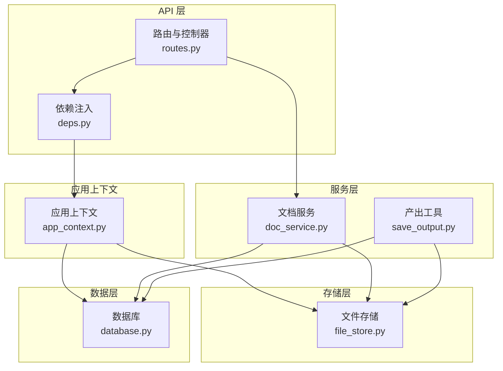
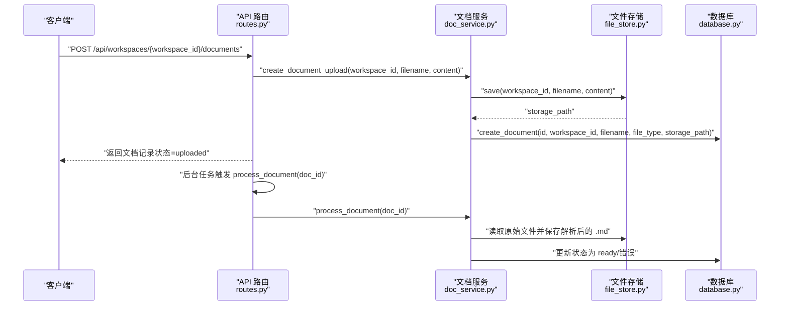
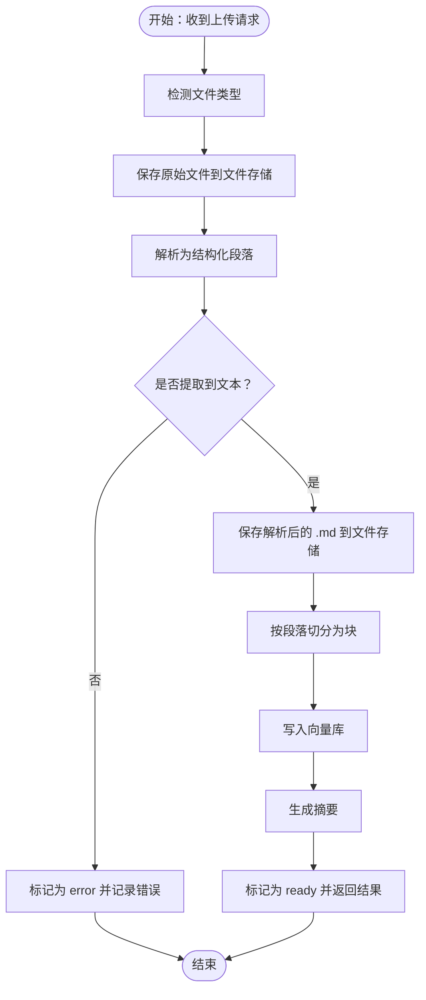
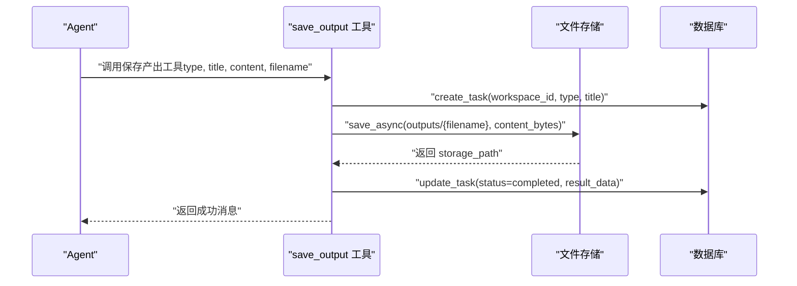
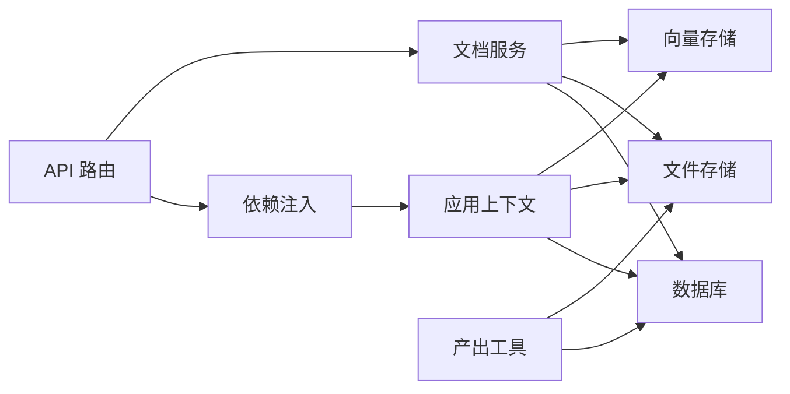

# 文件存储策略

<cite>
**本文引用的文件**
- [backend/src/storage/file_store.py](file://backend/src/storage/file_store.py)
- [backend/src/storage/database.py](file://backend/src/storage/database.py)
- [backend/src/services/doc_service.py](file://backend/src/services/doc_service.py)
- [backend/src/tools/save_output.py](file://backend/src/tools/save_output.py)
- [backend/src/api/routes.py](file://backend/src/api/routes.py)
- [backend/src/api/deps.py](file://backend/src/api/deps.py)
- [backend/src/app_context.py](file://backend/src/app_context.py)
</cite>

## 目录
1. [引言](#引言)
2. [项目结构](#项目结构)
3. [核心组件](#核心组件)
4. [架构总览](#架构总览)
5. [详细组件分析](#详细组件分析)
6. [依赖分析](#依赖分析)
7. [性能考虑](#性能考虑)
8. [故障排查指南](#故障排查指南)
9. [结论](#结论)
10. [附录](#附录)

## 引言
本文件存储策略文档聚焦于 Train Agent 的本地文件存储实现与相关流程，涵盖文件命名规则、目录结构组织、文件权限管理现状、上传与下载流程、访问控制与隔离机制、生命周期管理以及未来扩展到云存储的接口建议。文档以代码为依据，通过图示与分层讲解帮助读者快速理解系统如何在本地持久化用户产出与文档，并保证数据一致性与可恢复性。

## 项目结构
围绕文件存储的关键模块分布如下：
- 存储层：文件存储类负责本地文件写入、删除与工作区级清理
- 数据层：数据库记录工作区、文档、任务等元信息，含状态字段与时间戳
- 服务层：文档服务封装上传、解析、向量化、摘要与清理逻辑
- 工具层：产出物保存工具将内容写入文件存储并更新任务状态
- API 层：提供上传、列表、删除、下载等接口；依赖注入统一提供存储与服务实例
- 应用上下文：从环境变量读取基础目录，组装数据库、向量库与文件存储实例

图表来源
- [backend/src/api/routes.py:1-189](file://backend/src/api/routes.py#L1-L189)
- [backend/src/api/deps.py:1-30](file://backend/src/api/deps.py#L1-L30)
- [backend/src/app_context.py:1-31](file://backend/src/app_context.py#L1-L31)
- [backend/src/services/doc_service.py:1-218](file://backend/src/services/doc_service.py#L1-L218)
- [backend/src/tools/save_output.py:1-99](file://backend/src/tools/save_output.py#L1-L99)
- [backend/src/storage/file_store.py:1-39](file://backend/src/storage/file_store.py#L1-L39)
- [backend/src/storage/database.py:1-379](file://backend/src/storage/database.py#L1-L379)

章节来源
- [backend/src/api/routes.py:1-189](file://backend/src/api/routes.py#L1-L189)
- [backend/src/api/deps.py:1-30](file://backend/src/api/deps.py#L1-L30)
- [backend/src/app_context.py:1-31](file://backend/src/app_context.py#L1-L31)

## 核心组件
- 文件存储 FileStore：提供同步与异步写入、删除单文件、按工作区删除目录的能力
- 文档服务 DocService：封装上传、解析、分块、向量化、摘要与清理流程
- 产出工具 save_output：将产出物写入文件存储并更新任务状态
- 数据库 Database：维护工作区、文档、任务表，记录文件存储路径与状态
- API 路由：提供上传、列表、删除、下载接口；下载接口直接返回文件内容
- 应用上下文：从环境变量 DATA_DIR 组装文件存储根目录

章节来源
- [backend/src/storage/file_store.py:1-39](file://backend/src/storage/file_store.py#L1-L39)
- [backend/src/services/doc_service.py:1-218](file://backend/src/services/doc_service.py#L1-L218)
- [backend/src/tools/save_output.py:1-99](file://backend/src/tools/save_output.py#L1-L99)
- [backend/src/storage/database.py:1-379](file://backend/src/storage/database.py#L1-L379)
- [backend/src/api/routes.py:1-189](file://backend/src/api/routes.py#L1-L189)
- [backend/src/app_context.py:1-31](file://backend/src/app_context.py#L1-L31)

## 架构总览
文件存储策略采用“本地文件系统 + 关系型数据库”的组合方案：
- 文件系统：以工作区 ID 为一级目录，文档与产出分别落盘，便于隔离与清理
- 数据库：记录文档元信息（文件名、类型、存储路径、状态、摘要）、任务执行状态
- 服务编排：文档服务在上传后进行解析、分块、索引与摘要，产出工具用于保存最终产物
- 访问控制：API 层通过工作区维度进行隔离；下载接口基于存储路径直接返回文件

图表来源
- [backend/src/api/routes.py:112-128](file://backend/src/api/routes.py#L112-L128)
- [backend/src/services/doc_service.py:35-55](file://backend/src/services/doc_service.py#L35-L55)
- [backend/src/storage/file_store.py:11-16](file://backend/src/storage/file_store.py#L11-L16)
- [backend/src/storage/database.py:285-311](file://backend/src/storage/database.py#L285-L311)

## 详细组件分析

### 文件存储 FileStore
- 目录结构
  - 基础目录由应用上下文从环境变量 DATA_DIR 组装，默认为 ./data
  - 文件存储根目录为 DATA_DIR/files
  - 每个工作区对应一个子目录：DATA_DIR/files/{workspace_id}
  - 文档与产出分别存放于工作区目录下，文档使用原始文件名，产出统一放入 outputs/ 子目录
- 文件命名规则
  - 文档：使用原始文件名
  - 产出：若未指定文件名，按标题与类型映射生成默认文件名（例如 PPT 类型映射为 .html，报告为 .md）
- 权限与安全性
  - 当前实现未显式设置文件权限或访问控制位；文件写入使用标准文件系统权限
  - 下载接口直接返回文件内容，未做额外鉴权校验
- 写入与删除
  - 同步写入：确保父目录存在后写入字节内容
  - 异步写入：通过线程池包装阻塞 I/O，避免事件循环阻塞
  - 删除：支持单文件删除与按工作区整体删除
- 并发与线程安全
  - 异步写入通过线程池执行，避免阻塞事件循环
  - 多个并发写入可能产生竞态，建议上层协调或引入锁（当前未实现）

章节来源
- [backend/src/storage/file_store.py:1-39](file://backend/src/storage/file_store.py#L1-L39)
- [backend/src/app_context.py:22-26](file://backend/src/app_context.py#L22-L26)
- [backend/src/tools/save_output.py:23-26](file://backend/src/tools/save_output.py#L23-L26)
- [backend/src/tools/save_output.py:35-39](file://backend/src/tools/save_output.py#L35-L39)

### 文档服务 DocService
- 上传与解析
  - 接收文件名与二进制内容，检测类型并保存至文件存储
  - 解析为结构化段落，生成纯文本摘要并保存为 .md 文件
  - 分块后写入向量库，生成摘要，最终将文档状态置为 ready 或 error
- 清理策略
  - 支持按工作区删除：删除所有文档记录、向量库条目、解析出的 .md 与原始文件
  - 支持按文档删除：删除记录、向量库条目、原始文件与解析 .md
- 状态管理
  - 上传、解析、分块、索引、摘要、就绪/错误等状态贯穿整个流程
  - 数据库存储状态与错误信息，便于前端展示与重试

图表来源
- [backend/src/services/doc_service.py:57-130](file://backend/src/services/doc_service.py#L57-L130)

章节来源
- [backend/src/services/doc_service.py:1-218](file://backend/src/services/doc_service.py#L1-L218)

### 产出工具 save_output
- 功能职责
  - 将最终产出（如 PPT、报告）写入文件存储
  - 创建任务记录并更新状态为 completed 或 failed
  - 默认产出文件名根据类型映射生成，支持自定义文件名
- 执行流程
  - 生成任务记录
  - 将字符串内容编码为字节后写入文件存储（outputs/ 目录）
  - 更新任务 result_data 与状态

图表来源
- [backend/src/tools/save_output.py:13-58](file://backend/src/tools/save_output.py#L13-L58)

章节来源
- [backend/src/tools/save_output.py:1-99](file://backend/src/tools/save_output.py#L1-L99)

### API 路由与下载
- 上传文档
  - 接收文件并读取为字节，调用文档服务创建上传记录并触发后台处理
- 列表与删除
  - 提供文档与任务的列表与删除接口
- 下载文件
  - 直接根据存储路径返回文件内容，媒体类型为二进制流
  - 未做用户鉴权与工作区隔离校验，存在安全风险

章节来源
- [backend/src/api/routes.py:112-174](file://backend/src/api/routes.py#L112-L174)

### 应用上下文与依赖注入
- 从环境变量 DATA_DIR 组装数据库、向量库与文件存储的根路径
- 通过依赖注入在 API 层统一获取数据库、文件存储与文档服务实例

章节来源
- [backend/src/app_context.py:1-31](file://backend/src/app_context.py#L1-L31)
- [backend/src/api/deps.py:1-30](file://backend/src/api/deps.py#L1-L30)

## 依赖分析
- 组件耦合
  - DocService 依赖 Database、FileStore、VectorStore
  - API 路由依赖 DocService、FileStore、Database
  - 产出工具依赖 Database、FileStore
  - 应用上下文统一装配各依赖
- 外部依赖
  - 文件系统：本地文件写入/删除
  - 数据库：aiosqlite，维护结构化元数据
  - 向量库：Chroma（由向量存储模块管理），用于文档检索增强
- 潜在环路
  - 当前模块间为单向依赖，未发现循环导入

图表来源
- [backend/src/api/routes.py:1-189](file://backend/src/api/routes.py#L1-L189)
- [backend/src/api/deps.py:1-30](file://backend/src/api/deps.py#L1-L30)
- [backend/src/app_context.py:1-31](file://backend/src/app_context.py#L1-L31)
- [backend/src/services/doc_service.py:1-218](file://backend/src/services/doc_service.py#L1-L218)
- [backend/src/tools/save_output.py:1-99](file://backend/src/tools/save_output.py#L1-L99)

章节来源
- [backend/src/api/routes.py:1-189](file://backend/src/api/routes.py#L1-L189)
- [backend/src/api/deps.py:1-30](file://backend/src/api/deps.py#L1-L30)
- [backend/src/app_context.py:1-31](file://backend/src/app_context.py#L1-L31)
- [backend/src/services/doc_service.py:1-218](file://backend/src/services/doc_service.py#L1-L218)
- [backend/src/tools/save_output.py:1-99](file://backend/src/tools/save_output.py#L1-L99)

## 性能考虑
- I/O 模式
  - 文档解析与向量化为 CPU/IO 密集操作，建议在后台任务中异步执行
  - 文件写入采用线程池包装阻塞 I/O，避免主线程阻塞
- 存储布局
  - 按工作区隔离可减少跨工作区扫描开销，但需注意目录层级深度与文件系统限制
- 磁盘空间
  - 当前未实现自动清理与配额限制；建议增加清理策略（如按时间或大小阈值）
- 流式传输
  - 下载接口直接返回文件内容，未实现分块流式传输；大文件下载可考虑 Range 请求与分块响应

## 故障排查指南
- 上传后状态停留在 uploaded
  - 检查后台任务是否被触发；确认文档服务的 process_document 是否执行
  - 查看数据库中文档状态与错误信息字段
- 解析失败或状态为 error
  - 检查文件类型检测与解析器是否支持该格式
  - 确认文件是否为空或仅含图片/扫描件（需要 OCR）
- 下载 404
  - 确认存储路径是否存在；下载接口未做路径校验，需确保传入的是有效绝对路径
- 权限问题
  - 当前未设置文件权限；检查运行用户对 DATA_DIR/files 的读写权限
- 清理无效文件
  - 使用工作区级删除接口清理所有相关文件与记录

章节来源
- [backend/src/services/doc_service.py:141-166](file://backend/src/services/doc_service.py#L141-L166)
- [backend/src/api/routes.py:163-174](file://backend/src/api/routes.py#L163-L174)
- [backend/src/storage/database.py:285-311](file://backend/src/storage/database.py#L285-L311)

## 结论
当前文件存储策略以本地文件系统为核心，结合数据库记录元信息与状态，实现了文档上传、解析、索引与产出保存的完整链路。工作区隔离提供了基本的访问边界，但下载接口缺乏鉴权与路径校验，存在安全风险。建议后续补充：
- 访问控制：在下载与删除接口增加用户与工作区鉴权
- 生命周期管理：实现定期清理、配额限制与磁盘监控
- 安全加固：明确文件权限与最小权限原则
- 可扩展性：抽象存储接口，支持云存储后端

## 附录

### 文件命名与目录规范
- 工作区目录：DATA_DIR/files/{workspace_id}
- 文档：直接使用原始文件名
- 产出：统一存放在 outputs/ 子目录，文件名根据类型映射生成
- 解析中间产物：解析后的 .md 文件与原始文件同目录

章节来源
- [backend/src/app_context.py:22-26](file://backend/src/app_context.py#L22-L26)
- [backend/src/tools/save_output.py:23-26](file://backend/src/tools/save_output.py#L23-L26)
- [backend/src/services/doc_service.py:86-88](file://backend/src/services/doc_service.py#L86-L88)

### 访问控制与安全策略建议
- 下载接口鉴权：校验当前用户是否属于目标工作区
- 路径白名单：仅允许访问工作区内文件，禁止 ../ 路径穿越
- 最小权限：运行用户仅授予 DATA_DIR/files 的必要权限
- 审计日志：记录文件访问与修改操作

章节来源
- [backend/src/api/routes.py:163-174](file://backend/src/api/routes.py#L163-L174)

### 生命周期管理与清理策略建议
- 自动清理：按天/周/月清理 N 天未访问的文件
- 配额限制：为每个工作区设置最大存储配额
- 监控告警：磁盘使用率超过阈值时告警
- 归档策略：对历史文档进行归档或压缩

章节来源
- [backend/src/services/doc_service.py:141-166](file://backend/src/services/doc_service.py#L141-L166)

### 云存储扩展接口建议
- 抽象存储接口：定义统一的 save/delete/list 等方法
- 适配器模式：为本地与云存储分别实现适配器
- 元数据同步：保持与数据库一致的状态与路径映射
- 迁移工具：提供从本地到云存储的数据迁移脚本

章节来源
- [backend/src/storage/file_store.py:11-38](file://backend/src/storage/file_store.py#L11-L38)
- [backend/src/services/doc_service.py:141-166](file://backend/src/services/doc_service.py#L141-L166)