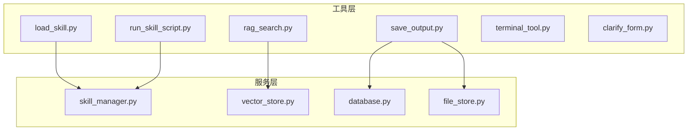
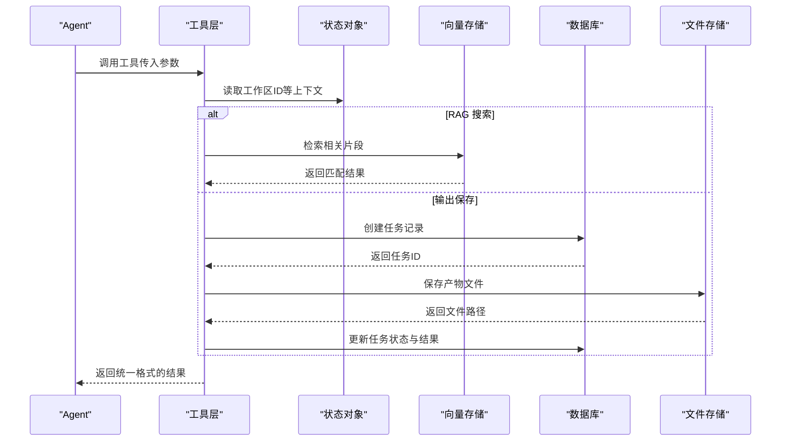
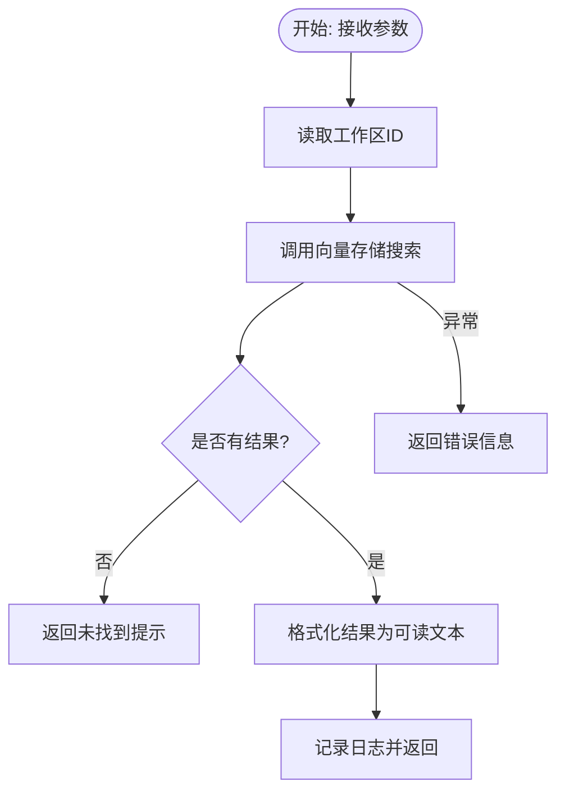
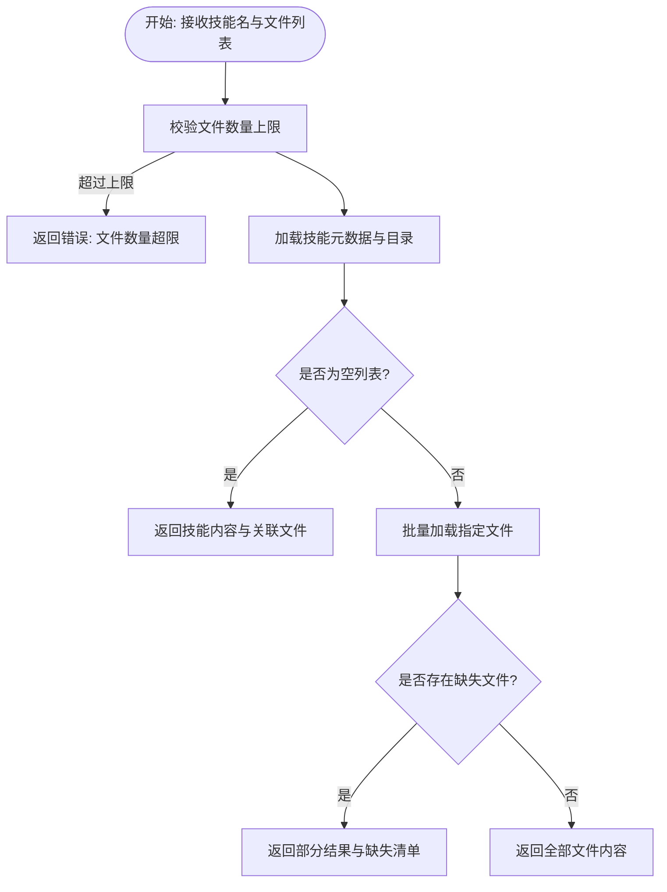
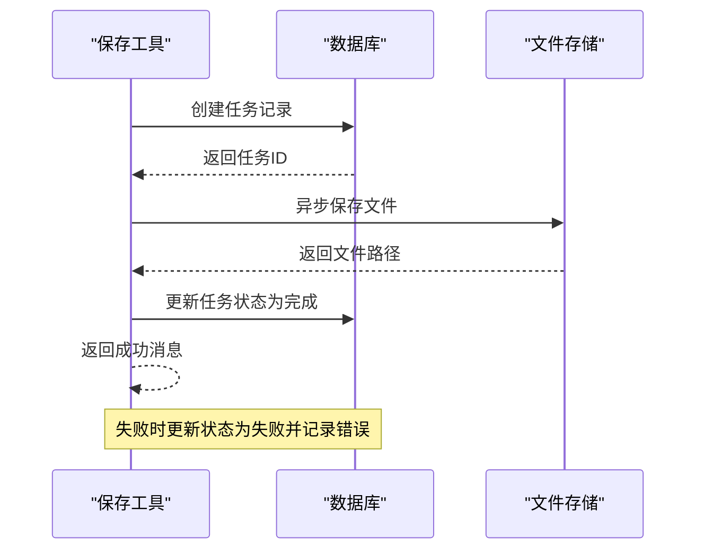
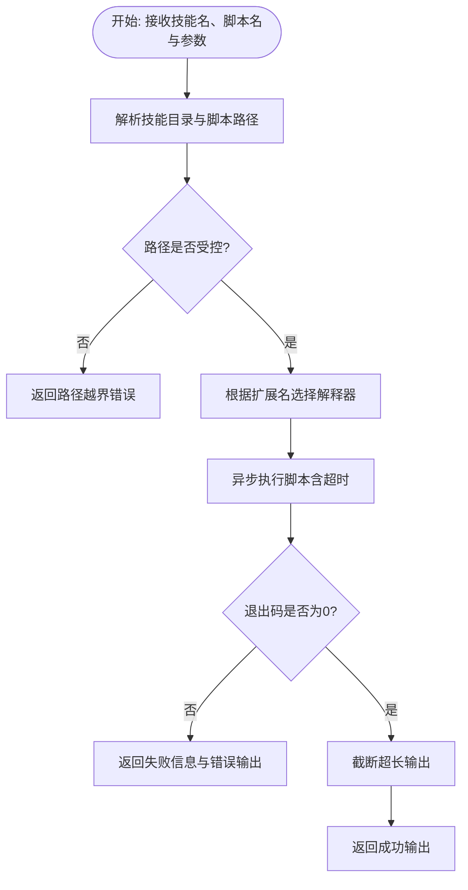
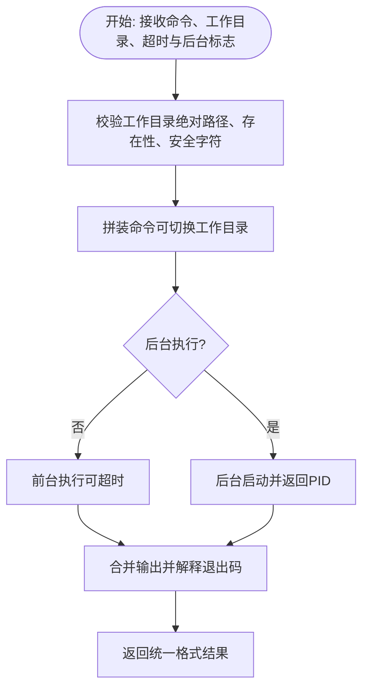
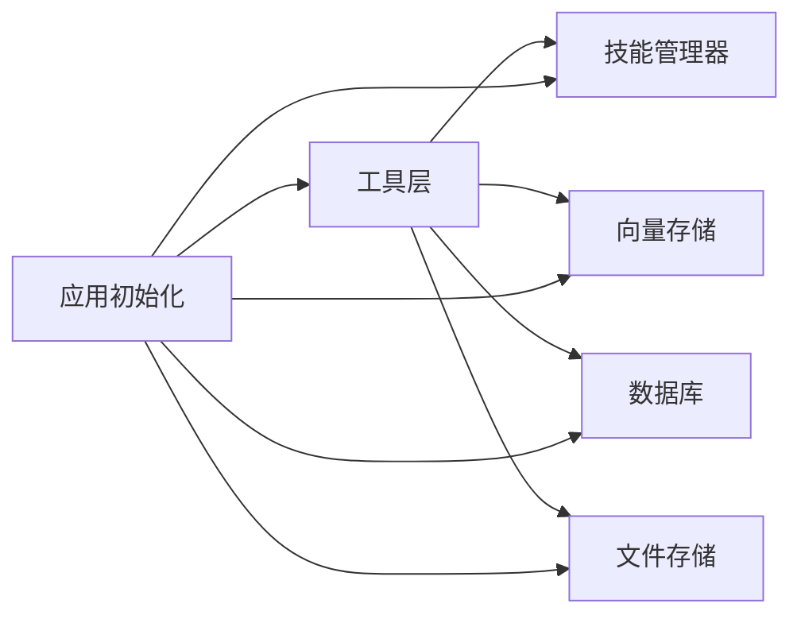

# 工具系统

<cite>
**本文引用的文件**
- [backend/src/tools/rag_search.py](file://backend/src/tools/rag_search.py)
- [backend/src/tools/load_skill.py](file://backend/src/tools/load_skill.py)
- [backend/src/tools/save_output.py](file://backend/src/tools/save_output.py)
- [backend/src/tools/run_skill_script.py](file://backend/src/tools/run_skill_script.py)
- [backend/src/tools/terminal_tool.py](file://backend/src/tools/terminal_tool.py)
- [backend/src/tools/clarify_form.py](file://backend/src/tools/clarify_form.py)
- [backend/src/agent/skill_manager.py](file://backend/src/agent/skill_manager.py)
- [backend/src/storage/vector_store.py](file://backend/src/storage/vector_store.py)
- [backend/src/storage/database.py](file://backend/src/storage/database.py)
- [backend/src/storage/file_store.py](file://backend/src/storage/file_store.py)
- [backend/src/tools/__init__.py](file://backend/src/tools/__init__.py)
</cite>

## 目录
1. [简介](#简介)
2. [项目结构](#项目结构)
3. [核心组件](#核心组件)
4. [架构总览](#架构总览)
5. [详细组件分析](#详细组件分析)
6. [依赖分析](#依赖分析)
7. [性能考量](#性能考量)
8. [故障排查指南](#故障排查指南)
9. [结论](#结论)
10. [附录](#附录)

## 简介
本文件面向 Train Agent 工具系统的扩展开发者，系统性阐述工具接口设计规范、内置工具实现原理、自定义工具开发流程、工具注册与发现机制、最佳实践与调试技巧。读者将掌握如何基于现有工具框架扩展新的工具，确保参数校验、返回值标准化、异常处理与日志记录的一致性；同时理解 RAG 搜索、技能加载、输出保存、脚本执行、终端工具等内置工具的工作方式与使用方法。

## 项目结构
工具系统位于后端子模块 backend/src/tools 下，围绕 LangChain 工具模式组织，结合技能管理器、向量存储、数据库与文件存储，形成“工具层-服务层-数据层”的清晰分层。工具通过工厂函数创建，注入外部依赖（如向量存储、数据库、文件存储、技能管理器），并在运行时通过状态对象访问上下文信息（如工作区 ID）。

图表来源
- [backend/src/tools/rag_search.py:1-76](file://backend/src/tools/rag_search.py#L1-L76)
- [backend/src/tools/load_skill.py:1-116](file://backend/src/tools/load_skill.py#L1-L116)
- [backend/src/tools/save_output.py:1-99](file://backend/src/tools/save_output.py#L1-L99)
- [backend/src/tools/run_skill_script.py:1-143](file://backend/src/tools/run_skill_script.py#L1-L143)
- [backend/src/tools/terminal_tool.py:1-160](file://backend/src/tools/terminal_tool.py#L1-L160)
- [backend/src/tools/clarify_form.py:1-46](file://backend/src/tools/clarify_form.py#L1-L46)
- [backend/src/agent/skill_manager.py:1-117](file://backend/src/agent/skill_manager.py#L1-L117)
- [backend/src/storage/vector_store.py:1-177](file://backend/src/storage/vector_store.py#L1-L177)
- [backend/src/storage/database.py:1-379](file://backend/src/storage/database.py#L1-L379)
- [backend/src/storage/file_store.py:1-39](file://backend/src/storage/file_store.py#L1-L39)

章节来源
- [backend/src/tools/__init__.py:1-20](file://backend/src/tools/__init__.py#L1-L20)

## 核心组件
- 工具接口设计规范
  - 工具基类与装饰器：统一使用 LangChain 工具装饰器，保证工具具备标准元数据与参数校验能力。
  - 参数验证：对输入参数进行边界检查、类型约束与业务规则校验；必要时返回结构化 JSON 错误信息。
  - 返回值标准化：成功返回人类可读文本或结构化 JSON；失败返回统一格式的错误字符串或 JSON。
  - 日志记录：使用 Python logging 模块记录关键事件、参数与异常，便于审计与排障。
  - 异常处理：捕获底层异常并转换为用户友好的错误信息，避免泄露内部细节。
- 内置工具
  - RAG 搜索工具：基于向量存储检索相关文档片段，支持按工作区与可选文档 ID 过滤。
  - 技能加载工具：动态生成可用技能列表，支持加载技能主提示与关联文件。
  - 输出保存工具：异步保存产物到文件存储并登记任务记录，供前端展示与下载。
  - 脚本执行工具：在受控目录内执行脚本，支持多语言解释器与超时控制。
  - 终端工具：安全执行 shell 命令，支持工作目录、超时与后台执行。
  - 澄清表单工具：触发前端交互式表单，收集用户输入并返回结构化结果。
- 注册与发现机制
  - 工具清单：集中导出各工具工厂函数，统一暴露给应用初始化流程。
  - 动态加载：技能管理器扫描技能目录，解析技能元数据并提供动态列表。
  - 版本兼容：通过数据库迁移与文件存储目录结构保持兼容性。

章节来源
- [backend/src/tools/rag_search.py:1-76](file://backend/src/tools/rag_search.py#L1-L76)
- [backend/src/tools/load_skill.py:1-116](file://backend/src/tools/load_skill.py#L1-L116)
- [backend/src/tools/save_output.py:1-99](file://backend/src/tools/save_output.py#L1-L99)
- [backend/src/tools/run_skill_script.py:1-143](file://backend/src/tools/run_skill_script.py#L1-L143)
- [backend/src/tools/terminal_tool.py:1-160](file://backend/src/tools/terminal_tool.py#L1-L160)
- [backend/src/tools/clarify_form.py:1-46](file://backend/src/tools/clarify_form.py#L1-L46)
- [backend/src/agent/skill_manager.py:1-117](file://backend/src/agent/skill_manager.py#L1-L117)
- [backend/src/storage/vector_store.py:1-177](file://backend/src/storage/vector_store.py#L1-L177)
- [backend/src/storage/database.py:1-379](file://backend/src/storage/database.py#L1-L379)
- [backend/src/storage/file_store.py:1-39](file://backend/src/storage/file_store.py#L1-L39)
- [backend/src/tools/__init__.py:1-20](file://backend/src/tools/__init__.py#L1-L20)

## 架构总览
工具系统以“工厂函数 + 外部依赖注入”为核心，工具在运行时通过状态对象获取上下文（如工作区 ID），并通过服务层完成持久化与计算。RAG 搜索依赖向量存储，输出保存依赖数据库与文件存储，脚本执行依赖技能管理器与操作系统进程。

图表来源
- [backend/src/tools/rag_search.py:40-76](file://backend/src/tools/rag_search.py#L40-L76)
- [backend/src/tools/save_output.py:61-99](file://backend/src/tools/save_output.py#L61-L99)
- [backend/src/storage/vector_store.py:124-163](file://backend/src/storage/vector_store.py#L124-L163)
- [backend/src/storage/database.py:342-375](file://backend/src/storage/database.py#L342-L375)
- [backend/src/storage/file_store.py:18-28](file://backend/src/storage/file_store.py#L18-L28)

## 详细组件分析

### RAG 搜索工具
- 设计要点
  - 使用工厂函数创建工具实例，注入向量存储依赖。
  - 通过状态对象读取工作区 ID，支持按文档 ID 限定检索范围。
  - 结果格式化：将章节、页码、文件名与片段文本组合为可读输出。
- 关键流程
  - 参数校验：top_k 默认值与 doc_id 空值处理。
  - 检索执行：调用向量存储查询，捕获异常并返回用户友好错误。
  - 结果聚合：遍历结果构建多片段输出，记录日志统计条数。
- 性能与安全
  - 向量检索默认 top_k 控制返回数量，避免上下文溢出。
  - 未命中时返回空结果提示，降低无效输出。

图表来源
- [backend/src/tools/rag_search.py:40-76](file://backend/src/tools/rag_search.py#L40-L76)
- [backend/src/storage/vector_store.py:124-163](file://backend/src/storage/vector_store.py#L124-L163)

章节来源
- [backend/src/tools/rag_search.py:1-76](file://backend/src/tools/rag_search.py#L1-L76)
- [backend/src/storage/vector_store.py:1-177](file://backend/src/storage/vector_store.py#L1-L177)

### 技能加载工具
- 设计要点
  - 动态生成工具描述：列出可用技能名称与描述，遵循 LangChain Skills 模式。
  - 单工具多用途：不带文件路径时返回技能内容与关联文件清单；带文件路径时批量加载指定文件。
  - 安全限制：对文件路径进行解析与校验，防止越权访问。
- 关键流程
  - 参数校验：限制批量加载文件数量上限。
  - 加载策略：未提供文件路径时返回技能内容与链接文件；提供文件路径时返回对应内容字典。
  - 错误处理：技能不存在或部分文件缺失时返回结构化错误信息。
- 性能与安全
  - 使用内存缓存技能元数据，减少重复扫描。
  - 路径解析严格限定在技能目录内，避免路径穿越。

图表来源
- [backend/src/tools/load_skill.py:13-116](file://backend/src/tools/load_skill.py#L13-L116)
- [backend/src/agent/skill_manager.py:57-116](file://backend/src/agent/skill_manager.py#L57-L116)

章节来源
- [backend/src/tools/load_skill.py:1-116](file://backend/src/tools/load_skill.py#L1-L116)
- [backend/src/agent/skill_manager.py:1-117](file://backend/src/agent/skill_manager.py#L1-L117)

### 输出保存工具
- 设计要点
  - 异步写入：封装异步文件写入，避免阻塞主线程。
  - 统一产物命名：根据类型映射默认扩展名，避免非法字符。
  - 任务生命周期：先创建任务记录，再保存文件，最后更新任务状态与结果。
- 关键流程
  - 参数校验：类型、标题、内容必填；文件名可选。
  - 数据持久化：数据库创建任务，文件存储保存内容，最终更新任务状态为完成或失败。
  - 错误回滚：失败时记录错误详情并返回用户可读提示。
- 性能与安全
  - 异步 I/O 避免阻塞；UTF-8 编码确保跨平台一致性。
  - 文件路径在工作区隔离目录下生成，避免越权写入。

图表来源
- [backend/src/tools/save_output.py:61-99](file://backend/src/tools/save_output.py#L61-L99)
- [backend/src/storage/database.py:342-375](file://backend/src/storage/database.py#L342-L375)
- [backend/src/storage/file_store.py:18-28](file://backend/src/storage/file_store.py#L18-L28)

章节来源
- [backend/src/tools/save_output.py:1-99](file://backend/src/tools/save_output.py#L1-L99)
- [backend/src/storage/database.py:1-379](file://backend/src/storage/database.py#L1-L379)
- [backend/src/storage/file_store.py:1-39](file://backend/src/storage/file_store.py#L1-L39)

### 脚本执行工具
- 设计要点
  - 受控执行：仅允许在技能 scripts/ 目录内执行脚本，防止越权访问。
  - 多语言支持：映射 .sh/.py/.js/.ts 到相应解释器，自动组装命令。
  - 超时控制：统一超时参数，超时则终止进程并返回错误信息。
  - 输出截断：限制最大输出长度，防止上下文溢出。
- 关键流程
  - 路径安全：解析技能目录与脚本路径，校验是否位于受控目录内。
  - 解释器选择：根据扩展名选择解释器，组装命令行参数。
  - 进程执行：异步创建子进程，等待完成或超时。
  - 结果处理：合并 stdout/stderr，按退出码判断成功或失败。
- 性能与安全
  - 路径穿越防护与目录白名单双重保障。
  - 超时与输出长度限制，避免资源耗尽。

图表来源
- [backend/src/tools/run_skill_script.py:31-143](file://backend/src/tools/run_skill_script.py#L31-L143)
- [backend/src/agent/skill_manager.py:57-116](file://backend/src/agent/skill_manager.py#L57-L116)

章节来源
- [backend/src/tools/run_skill_script.py:1-143](file://backend/src/tools/run_skill_script.py#L1-L143)
- [backend/src/agent/skill_manager.py:1-117](file://backend/src/agent/skill_manager.py#L1-L117)

### 终端工具
- 设计要点
  - 安全执行：支持工作目录（必须为绝对路径且存在），防止路径注入。
  - 语义成功：对特定命令的非零退出码进行语义解读（如 grep/find 的“未匹配”视为成功）。
  - 超时与后台：支持前台阻塞执行与后台启动两种模式。
- 关键流程
  - 参数校验：工作目录合法性检查，超时与后台标志处理。
  - 命令拼装：在指定工作目录下执行命令，或直接执行。
  - 进程管理：前台执行带超时，后台立即返回 PID。
  - 结果汇总：统一输出格式，包含 stdout/stderr/exit_code/error 解释。
- 性能与安全
  - 绝对路径与安全字符过滤，避免命令注入。
  - 超时保护与进程回收，防止僵尸进程。

图表来源
- [backend/src/tools/terminal_tool.py:20-160](file://backend/src/tools/terminal_tool.py#L20-L160)

章节来源
- [backend/src/tools/terminal_tool.py:1-160](file://backend/src/tools/terminal_tool.py#L1-L160)

### 澄清表单工具
- 设计要点
  - 交互式表单：通过中断机制触发前端 UI，收集用户输入。
  - 参数模型：使用 Pydantic 定义表单字段与校验规则。
  - 用户取消：识别取消信号并返回结构化取消信息。
- 关键流程
  - 参数校验：标题、描述、字段定义必填，字段类型与选项约束。
  - 中断交互：发送中断请求，等待用户响应。
  - 结果返回：用户取消返回取消标记，否则返回表单结果。
- 性能与安全
  - 前端渲染与后端校验分离，避免复杂逻辑在后端阻塞。
  - 取消语义明确，便于上层决策。

章节来源
- [backend/src/tools/clarify_form.py:1-46](file://backend/src/tools/clarify_form.py#L1-L46)

## 依赖分析
- 工具与服务层耦合
  - RAG 搜索依赖向量存储，查询结果用于增强上下文。
  - 输出保存依赖数据库与文件存储，贯穿任务生命周期。
  - 脚本执行依赖技能管理器与操作系统进程，受路径与权限约束。
  - 终端工具直接依赖操作系统，强调安全与超时控制。
- 工具注册与发现
  - 工具清单集中导出，便于应用初始化时统一注册。
  - 技能管理器扫描技能目录，动态维护技能清单与元数据。

图表来源
- [backend/src/tools/__init__.py:1-20](file://backend/src/tools/__init__.py#L1-L20)
- [backend/src/agent/skill_manager.py:21-55](file://backend/src/agent/skill_manager.py#L21-L55)
- [backend/src/storage/vector_store.py:39-49](file://backend/src/storage/vector_store.py#L39-L49)
- [backend/src/storage/database.py:9-24](file://backend/src/storage/database.py#L9-L24)
- [backend/src/storage/file_store.py:6-16](file://backend/src/storage/file_store.py#L6-L16)

章节来源
- [backend/src/tools/__init__.py:1-20](file://backend/src/tools/__init__.py#L1-L20)
- [backend/src/agent/skill_manager.py:1-117](file://backend/src/agent/skill_manager.py#L1-L117)
- [backend/src/storage/vector_store.py:1-177](file://backend/src/storage/vector_store.py#L1-L177)
- [backend/src/storage/database.py:1-379](file://backend/src/storage/database.py#L1-L379)
- [backend/src/storage/file_store.py:1-39](file://backend/src/storage/file_store.py#L1-L39)

## 性能考量
- I/O 与并发
  - 输出保存采用异步文件写入，避免阻塞工具链路。
  - 脚本执行与终端命令均支持超时，防止长时间阻塞。
- 上下文控制
  - RAG 搜索默认 top_k 控制返回数量，避免上下文过长。
  - 脚本输出截断，防止大输出撑爆上下文窗口。
- 存储与索引
  - 向量存储按工作区隔离集合，减少无关检索。
  - 数据库迁移与索引维护，保证历史数据兼容与查询效率。

## 故障排查指南
- 日志定位
  - 工具层：使用 info/warning/error 记录关键事件与异常，便于快速定位问题。
  - 存储层：向量存储与数据库操作均有详细日志，包含工作区 ID、查询条件与返回结果数量。
- 常见问题
  - RAG 搜索无结果：确认工作区集合是否存在、查询关键词是否合理、是否设置了错误的文档 ID。
  - 技能加载失败：检查技能名称是否正确、文件路径是否在技能目录内、文件是否存在。
  - 输出保存失败：检查数据库连接、文件存储权限、工作区隔离目录是否可写。
  - 脚本执行超时：调整超时参数、检查脚本逻辑、确认解释器环境是否就绪。
  - 终端命令失败：核对工作目录是否为绝对路径、命令是否包含危险字符、退出码语义解读是否符合预期。
- 调试建议
  - 在本地启用更详细的日志级别，逐步缩小问题范围。
  - 对关键工具增加单元测试，覆盖正常与异常分支。
  - 使用最小化输入复现问题，逐步排除环境因素。

章节来源
- [backend/src/tools/rag_search.py:55-64](file://backend/src/tools/rag_search.py#L55-L64)
- [backend/src/tools/load_skill.py:66-74](file://backend/src/tools/load_skill.py#L66-L74)
- [backend/src/tools/save_output.py:51-58](file://backend/src/tools/save_output.py#L51-L58)
- [backend/src/tools/run_skill_script.py:112-115](file://backend/src/tools/run_skill_script.py#L112-L115)
- [backend/src/tools/terminal_tool.py:116-120](file://backend/src/tools/terminal_tool.py#L116-L120)

## 结论
工具系统通过标准化的接口设计、严格的参数与安全校验、统一的返回值与日志规范，以及清晰的分层架构，为 Train Agent 提供了可扩展、可维护、可审计的工具生态。内置工具覆盖知识检索、技能编排、产物交付、脚本执行与终端交互等关键场景。遵循本文档的开发规范与最佳实践，开发者可以高效地扩展新的工具，确保与现有系统的一致性与稳定性。

## 附录
- 自定义工具开发流程
  - 继承与封装：参考现有工具的工厂函数模式，注入所需依赖（如向量存储、数据库、文件存储、技能管理器）。
  - 参数校验：对输入参数进行边界检查与业务规则校验，必要时返回结构化错误信息。
  - 返回值标准化：成功返回人类可读文本或结构化 JSON；失败返回统一格式的错误字符串。
  - 日志记录：在关键节点记录 info/warning/error，包含必要的上下文信息。
  - 异常处理：捕获底层异常并转换为用户友好的错误信息，避免泄露内部细节。
  - 注册与发现：在工具清单中导出工厂函数，确保应用初始化时能够统一注册。
- 最佳实践
  - 性能优化：优先使用异步 I/O、限制输出长度、控制检索 top_k、设置合理的超时。
  - 安全考虑：严格路径校验、工作目录限制、解释器选择与命令拼装的安全性。
  - 错误处理策略：区分语义成功与实际失败、提供可读的错误信息、记录完整上下文。
- 调试技巧
  - 使用最小化输入复现问题，逐步排除环境因素。
  - 在关键路径增加日志，关注工作区 ID、参数与返回结果。
  - 对异常路径进行单元测试，覆盖边界条件与错误场景。