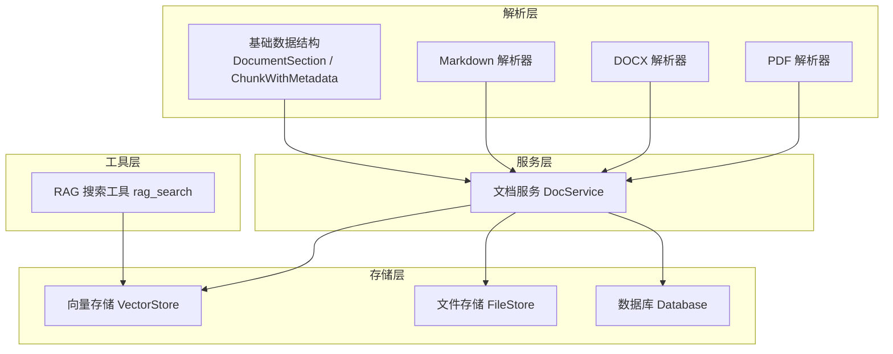
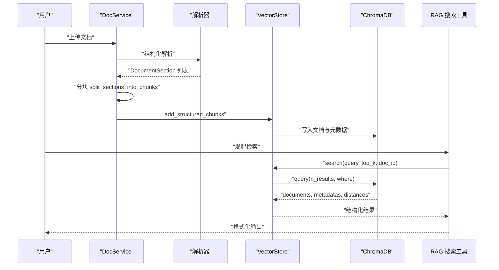
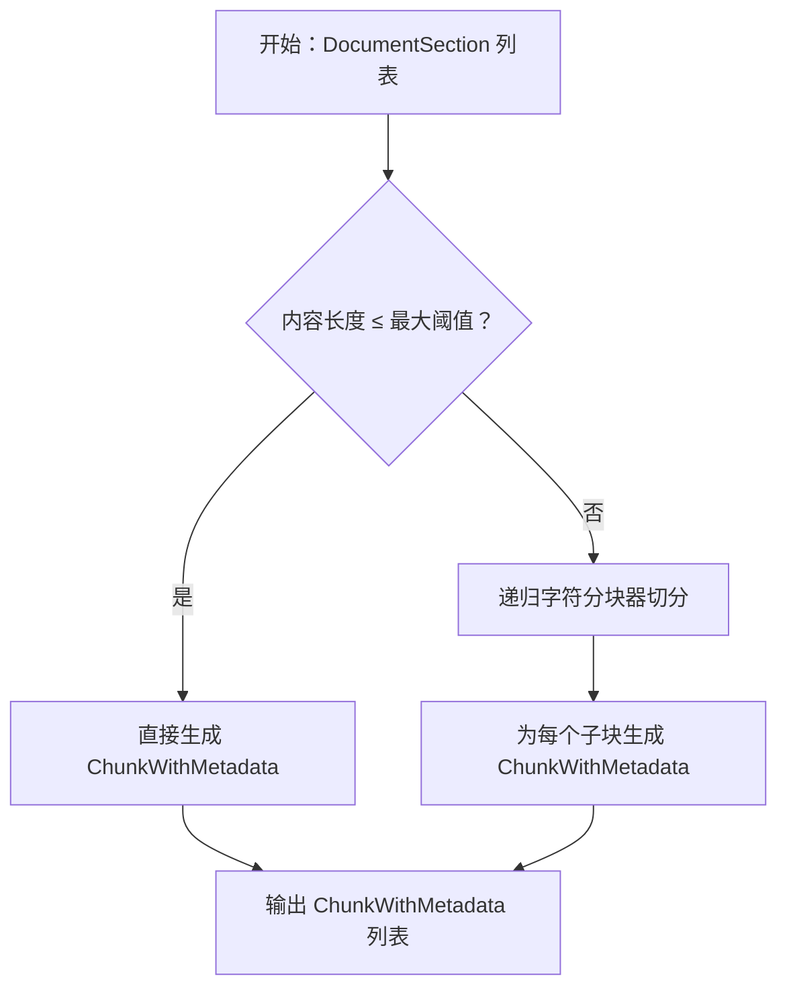
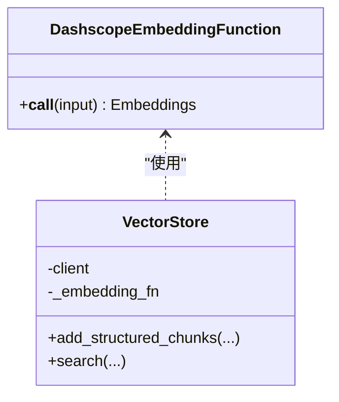
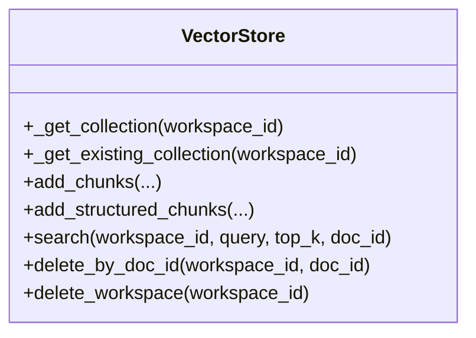
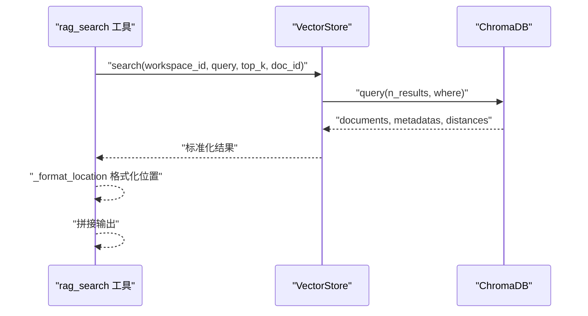
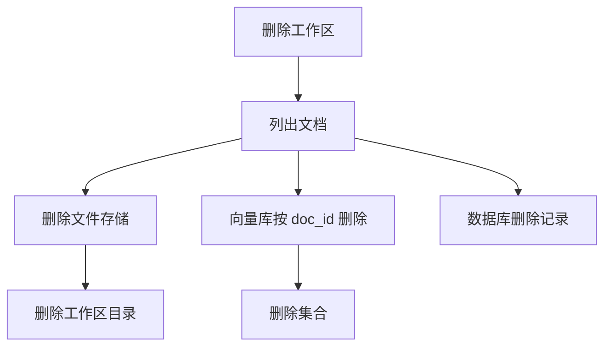
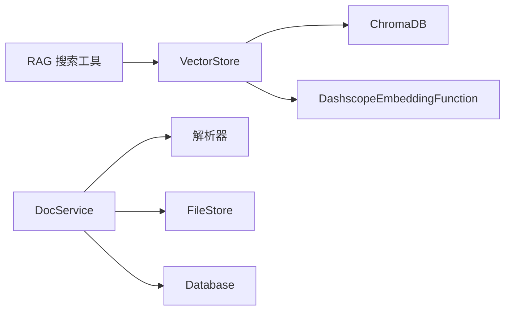

# 向量化索引系统

<cite>
**本文引用的文件**
- [vector_store.py](file://backend/src/storage/vector_store.py)
- [rag_search.py](file://backend/src/tools/rag_search.py)
- [doc_service.py](file://backend/src/services/doc_service.py)
- [base.py](file://backend/src/parsers/base.py)
- [pdf_parser.py](file://backend/src/parsers/pdf_parser.py)
- [markdown_parser.py](file://backend/src/parsers/markdown_parser.py)
- [docx_parser.py](file://backend/src/parsers/docx_parser.py)
- [database.py](file://backend/src/storage/database.py)
- [file_store.py](file://backend/src/storage/file_store.py)
- [inspect_chunks.py](file://backend/scripts/inspect_chunks.py)
- [pyproject.toml](file://backend/pyproject.toml)
</cite>

## 目录
1. [简介](#简介)
2. [项目结构](#项目结构)
3. [核心组件](#核心组件)
4. [架构总览](#架构总览)
5. [详细组件分析](#详细组件分析)
6. [依赖分析](#依赖分析)
7. [性能考虑](#性能考虑)
8. [故障排除指南](#故障排除指南)
9. [结论](#结论)
10. [附录](#附录)

## 简介
本文件面向 Train Agent 的向量化索引系统，围绕文档分块策略、向量嵌入生成、向量存储与检索、查询优化、维护与清理以及性能监控与故障排除进行系统化技术说明。系统采用结构化解析与分块策略，结合 DashScope 文本嵌入服务与 ChromaDB 向量数据库，实现按工作区隔离的 RAG 能力。

## 项目结构
后端采用分层与功能模块化组织：
- 存储层：向量存储、文件存储、数据库
- 解析层：PDF、Word、Markdown 结构化解析
- 服务层：文档处理流水线（上传→解析→分块→索引→摘要）
- 工具层：RAG 搜索工具
- 调试脚本：ChromaDB 集合与分块检查

图表来源
- [doc_service.py:13-27](file://backend/src/services/doc_service.py#L13-L27)
- [pdf_parser.py:20-35](file://backend/src/parsers/pdf_parser.py#L20-L35)
- [docx_parser.py:23-26](file://backend/src/parsers/docx_parser.py#L23-L26)
- [markdown_parser.py:16-21](file://backend/src/parsers/markdown_parser.py#L16-L21)
- [base.py:6-41](file://backend/src/parsers/base.py#L6-L41)
- [vector_store.py:39-49](file://backend/src/storage/vector_store.py#L39-L49)
- [file_store.py:6-16](file://backend/src/storage/file_store.py#L6-L16)
- [database.py:9-24](file://backend/src/storage/database.py#L9-L24)
- [rag_search.py:40-75](file://backend/src/tools/rag_search.py#L40-L75)

章节来源
- [doc_service.py:13-27](file://backend/src/services/doc_service.py#L13-L27)
- [vector_store.py:39-49](file://backend/src/storage/vector_store.py#L39-L49)
- [base.py:6-41](file://backend/src/parsers/base.py#L6-L41)

## 核心组件
- 向量存储 VectorStore：封装 ChromaDB 客户端、集合管理、嵌入函数、添加分块、结构化检索、删除与清理
- 文档服务 DocService：统一编排解析、分块、索引、摘要与状态管理
- 结构化解析器：PDF、DOCX、Markdown → DocumentSection；再由分块器生成 ChunkWithMetadata
- 嵌入函数 DashscopeEmbeddingFunction：基于 DashScope 文本嵌入 API
- 文件存储 FileStore：按工作区隔离的文件持久化
- 数据库 Database：文档元数据与消息记录
- RAG 搜索工具：将检索结果格式化为可读位置信息与文本片段

章节来源
- [vector_store.py:13-36](file://backend/src/storage/vector_store.py#L13-L36)
- [vector_store.py:39-177](file://backend/src/storage/vector_store.py#L39-L177)
- [doc_service.py:13-27](file://backend/src/services/doc_service.py#L13-L27)
- [base.py:47-97](file://backend/src/parsers/base.py#L47-L97)
- [file_store.py:6-39](file://backend/src/storage/file_store.py#L6-L39)
- [database.py:9-78](file://backend/src/storage/database.py#L9-L78)
- [rag_search.py:40-75](file://backend/src/tools/rag_search.py#L40-L75)

## 架构总览
系统通过 DocService 将解析后的结构化章节转换为带元数据的文本块，写入 ChromaDB 向量集合；RAG 搜索工具调用 VectorStore 执行语义检索，返回包含来源定位信息的结果。

图表来源
- [doc_service.py:57-130](file://backend/src/services/doc_service.py#L57-L130)
- [base.py:47-97](file://backend/src/parsers/base.py#L47-L97)
- [vector_store.py:91-122](file://backend/src/storage/vector_store.py#L91-L122)
- [vector_store.py:124-163](file://backend/src/storage/vector_store.py#L124-L163)
- [rag_search.py:40-75](file://backend/src/tools/rag_search.py#L40-L75)

## 详细组件分析

### 文档分块策略
- 结构化解析：PDF 使用字体大小与加粗启发式识别标题层级并提取页码；DOCX 基于样式映射；Markdown 基于标题标记
- 分块算法：基于最大长度与重叠的递归字符分块器，优先按段落与中文标点切分，避免破坏语义单元
- 元数据增强：每个块携带章节标题、章标题、页码范围、层级与块索引，便于检索后定位

图表来源
- [pdf_parser.py:17-35](file://backend/src/parsers/pdf_parser.py#L17-L35)
- [docx_parser.py:20-83](file://backend/src/parsers/docx_parser.py#L20-L83)
- [markdown_parser.py:13-61](file://backend/src/parsers/markdown_parser.py#L13-L61)
- [base.py:47-97](file://backend/src/parsers/base.py#L47-L97)

章节来源
- [pdf_parser.py:17-35](file://backend/src/parsers/pdf_parser.py#L17-L35)
- [docx_parser.py:20-83](file://backend/src/parsers/docx_parser.py#L20-L83)
- [markdown_parser.py:13-61](file://backend/src/parsers/markdown_parser.py#L13-L61)
- [base.py:47-97](file://backend/src/parsers/base.py#L47-L97)

### 向量嵌入生成
- 嵌入模型：DashScope 文本嵌入模型，支持通过环境变量配置模型名、API Key 与 Base URL
- 批量处理：向量存储默认批大小为 20，逐批调用嵌入接口，减少单次请求负载
- 内存管理：嵌入结果即时消费并写入向量库，未缓存中间向量数组

图表来源
- [vector_store.py:13-36](file://backend/src/storage/vector_store.py#L13-L36)
- [vector_store.py:39-49](file://backend/src/storage/vector_store.py#L39-L49)

章节来源
- [vector_store.py:13-36](file://backend/src/storage/vector_store.py#L13-L36)
- [vector_store.py:57-122](file://backend/src/storage/vector_store.py#L57-L122)

### 向量存储实现
- 集合管理：按工作区创建独立集合，命名规则 ws_{workspace_id}，启用余弦相似度空间
- 元数据索引：写入 doc_id、文件名、块索引、章节/章标题、页码范围、层级等字段
- 相似度计算：ChromaDB 在余弦空间上执行向量检索，返回距离

图表来源
- [vector_store.py:44-55](file://backend/src/storage/vector_store.py#L44-L55)
- [vector_store.py:124-177](file://backend/src/storage/vector_store.py#L124-L177)

章节来源
- [vector_store.py:44-55](file://backend/src/storage/vector_store.py#L44-L55)
- [vector_store.py:124-177](file://backend/src/storage/vector_store.py#L124-L177)

### 向量检索与查询优化
- 过滤条件：支持按 doc_id 过滤，仅在指定文档内检索
- 评分与排序：ChromaDB 返回距离，数值越小越相似，系统原样透出
- 结果格式化：工具层将检索结果转为“文件名 + 章节路径 + 页码 + 片段”的可读形式

图表来源
- [vector_store.py:124-163](file://backend/src/storage/vector_store.py#L124-L163)
- [rag_search.py:40-75](file://backend/src/tools/rag_search.py#L40-L75)

章节来源
- [vector_store.py:124-163](file://backend/src/storage/vector_store.py#L124-L163)
- [rag_search.py:11-37](file://backend/src/tools/rag_search.py#L11-L37)
- [rag_search.py:40-75](file://backend/src/tools/rag_search.py#L40-L75)

### 维护与清理机制
- 增量更新：新增文档时仅写入对应工作区集合，不影响其他工作区
- 过期与删除：支持按文档 ID 删除，或删除整个工作区集合与文件目录
- 清理流程：删除工作区时依次清理文件、向量与数据库记录

图表来源
- [doc_service.py:141-152](file://backend/src/services/doc_service.py#L141-L152)
- [vector_store.py:165-177](file://backend/src/storage/vector_store.py#L165-L177)
- [file_store.py:30-39](file://backend/src/storage/file_store.py#L30-L39)

章节来源
- [doc_service.py:141-152](file://backend/src/services/doc_service.py#L141-L152)
- [vector_store.py:165-177](file://backend/src/storage/vector_store.py#L165-L177)
- [file_store.py:30-39](file://backend/src/storage/file_store.py#L30-L39)

## 依赖分析
- 向量存储依赖 ChromaDB 与 DashScope 嵌入服务
- 文档服务依赖解析器、文件存储与数据库
- RAG 工具依赖向量存储与状态对象

图表来源
- [pyproject.toml:6-26](file://backend/pyproject.toml#L6-L26)
- [vector_store.py:5-8](file://backend/src/storage/vector_store.py#L5-L8)
- [doc_service.py:4-8](file://backend/src/services/doc_service.py#L4-L8)
- [rag_search.py:3](file://backend/src/tools/rag_search.py#L3)

章节来源
- [pyproject.toml:6-26](file://backend/pyproject.toml#L6-L26)
- [vector_store.py:5-8](file://backend/src/storage/vector_store.py#L5-L8)
- [doc_service.py:4-8](file://backend/src/services/doc_service.py#L4-L8)
- [rag_search.py:3](file://backend/src/tools/rag_search.py#L3)

## 性能考虑
- 分块参数：最大长度与重叠比例影响检索精度与召回，建议根据文档类型调整
- 批处理大小：向量写入默认批大小为 20，可根据嵌入服务速率与内存占用调优
- 集合隔离：按工作区划分集合，避免跨工作区扫描，提升检索效率
- 距离与排序：余弦距离越小越相似，top_k 控制候选规模，平衡质量与延迟
- 异步处理：文档处理流水线异步执行，上传快速返回，后台完成解析与索引

## 故障排除指南
- 嵌入服务错误：检查 API Key、Base URL 与模型名是否正确，关注日志中的状态码与消息
- 集合不存在：首次检索可能因集合尚未创建而返回空结果，后续索引建立后即可正常
- 检索为空：确认文档已成功索引、工作区与文档 ID 正确，必要时使用调试脚本检查集合内容
- 调试脚本：inspect_chunks 支持列出集合、按文档过滤查看分块、执行语义搜索测试

章节来源
- [vector_store.py:26-36](file://backend/src/storage/vector_store.py#L26-L36)
- [vector_store.py:138-142](file://backend/src/storage/vector_store.py#L138-L142)
- [inspect_chunks.py:120-140](file://backend/scripts/inspect_chunks.py#L120-L140)

## 结论
本系统通过结构化解析与可控分块策略，结合 DashScope 嵌入与 ChromaDB 向量库，实现了按工作区隔离的高效 RAG 能力。工具层提供可读性强的检索结果展示，服务层保障异步处理与状态一致性，调试脚本辅助问题定位与验证。建议在生产环境中结合业务场景进一步调优分块参数与批处理大小，并完善监控与告警体系。

## 附录
- 环境变量与配置要点
  - EMBEDDING_MODEL：嵌入模型名，默认 text-embedding-v2
  - EMBEDDING_API_KEY：DashScope API Key
  - EMBEDDING_API_BASE：DashScope Base URL
  - DATA_DIR：ChromaDB 持久化目录根路径
- 命令示例
  - 查看集合：uv run python scripts/inspect_chunks.py
  - 按工作区查看分块：uv run python scripts/inspect_chunks.py <workspace_id>
  - 按文档过滤：uv run python scripts/inspect_chunks.py <workspace_id> -d <doc_id>
  - 语义搜索测试：uv run python scripts/inspect_chunks.py <workspace_id> -q "查询语句"

章节来源
- [vector_store.py:20-24](file://backend/src/storage/vector_store.py#L20-L24)
- [inspect_chunks.py:21-22](file://backend/scripts/inspect_chunks.py#L21-L22)
- [inspect_chunks.py:120-140](file://backend/scripts/inspect_chunks.py#L120-L140)