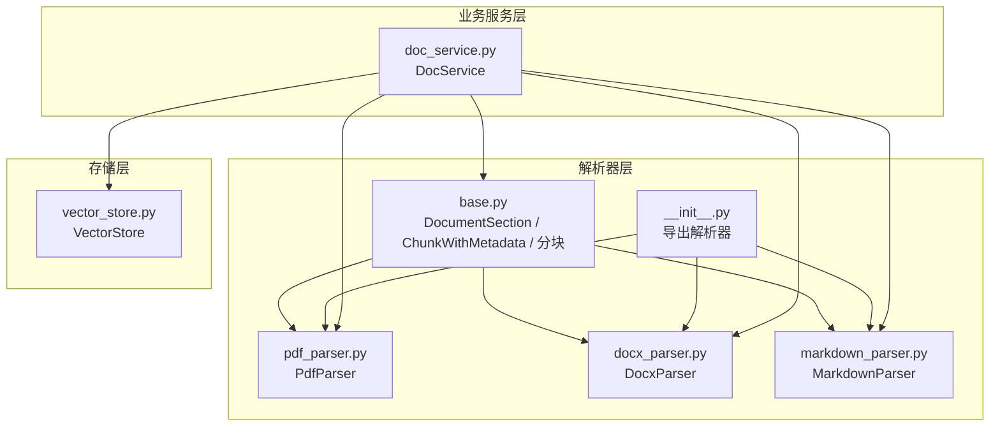
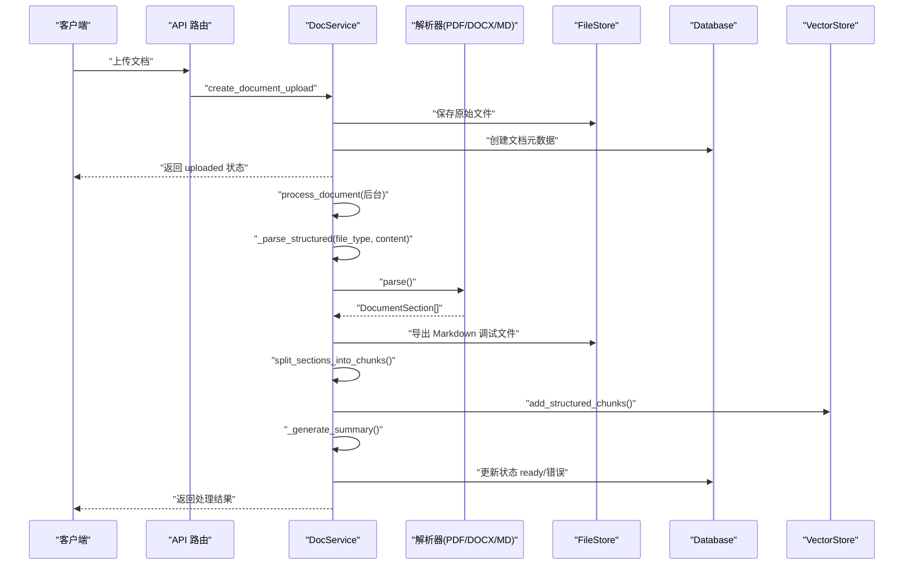
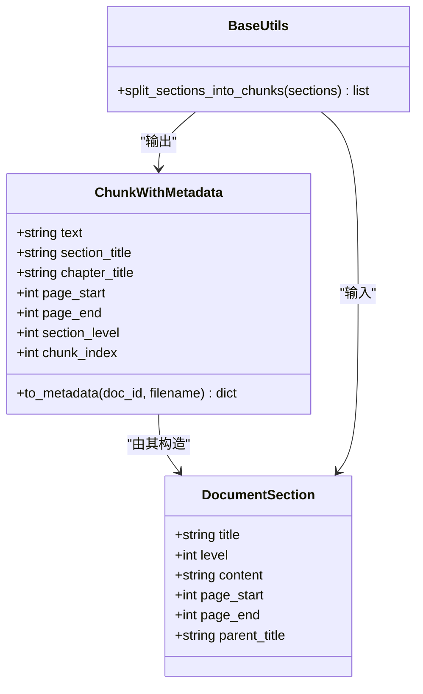
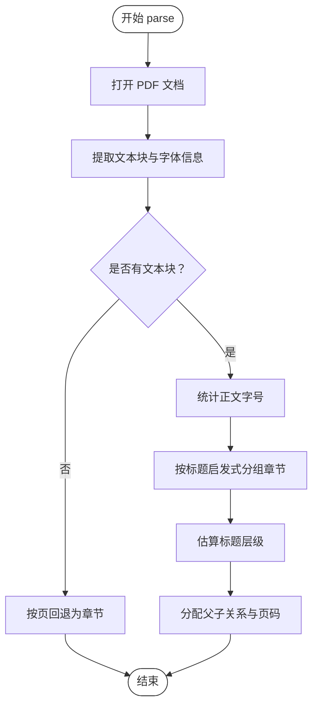
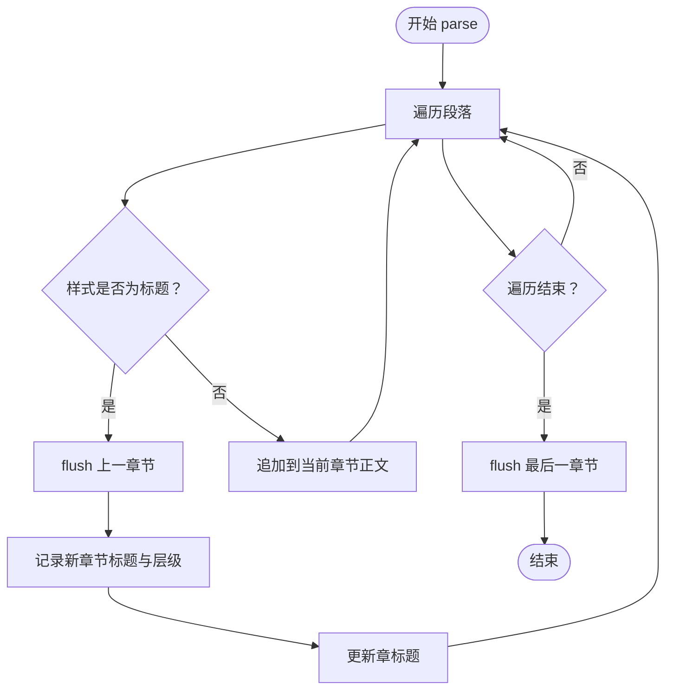
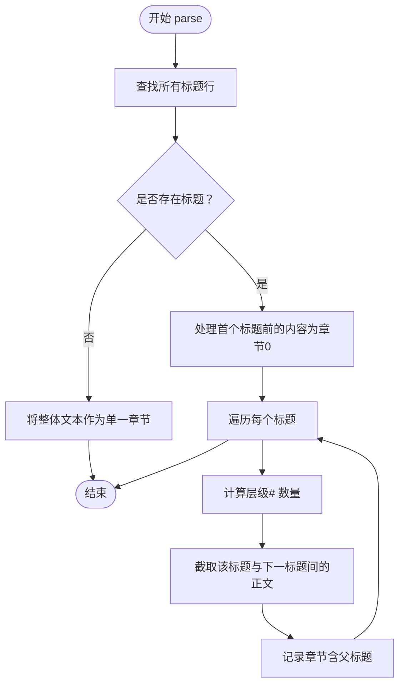
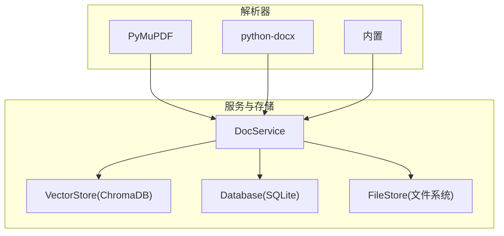

# 多格式解析器

<cite>
**本文引用的文件**
- [backend/src/parsers/base.py](file://backend/src/parsers/base.py)
- [backend/src/parsers/pdf_parser.py](file://backend/src/parsers/pdf_parser.py)
- [backend/src/parsers/docx_parser.py](file://backend/src/parsers/docx_parser.py)
- [backend/src/parsers/markdown_parser.py](file://backend/src/parsers/markdown_parser.py)
- [backend/src/parsers/__init__.py](file://backend/src/parsers/__init__.py)
- [backend/src/services/doc_service.py](file://backend/src/services/doc_service.py)
- [backend/src/storage/vector_store.py](file://backend/src/storage/vector_store.py)
- [backend/pyproject.toml](file://backend/pyproject.toml)
- [docs/backend-architecture.md](file://docs/backend-architecture.md)
</cite>

## 目录
1. [简介](#简介)
2. [项目结构](#项目结构)
3. [核心组件](#核心组件)
4. [架构总览](#架构总览)
5. [详细组件分析](#详细组件分析)
6. [依赖分析](#依赖分析)
7. [性能考虑](#性能考虑)
8. [故障排查指南](#故障排查指南)
9. [结论](#结论)
10. [附录](#附录)

## 简介
本文件为 Train Agent 多格式解析器系统的技术文档，聚焦于解析器基类与三大解析器（PDF、DOCX、Markdown）的设计与实现，涵盖标题提取、内容处理、元数据管理、分块策略、以及扩展指南。解析器产物统一为结构化章节单元，随后进入分块、向量化与检索的完整流水线。

## 项目结构
解析器位于 backend/src/parsers 目录，配合 DocService 进行业务编排，最终将结构化分块写入向量库并生成摘要。

**图表来源**
- [backend/src/parsers/base.py:1-97](file://backend/src/parsers/base.py#L1-L97)
- [backend/src/parsers/pdf_parser.py:1-192](file://backend/src/parsers/pdf_parser.py#L1-L192)
- [backend/src/parsers/docx_parser.py:1-84](file://backend/src/parsers/docx_parser.py#L1-L84)
- [backend/src/parsers/markdown_parser.py:1-62](file://backend/src/parsers/markdown_parser.py#L1-L62)
- [backend/src/parsers/__init__.py:1-13](file://backend/src/parsers/__init__.py#L1-L13)
- [backend/src/services/doc_service.py:1-218](file://backend/src/services/doc_service.py#L1-L218)
- [backend/src/storage/vector_store.py:1-177](file://backend/src/storage/vector_store.py#L1-L177)

**章节来源**
- [docs/backend-architecture.md:368-385](file://docs/backend-architecture.md#L368-L385)
- [backend/src/parsers/__init__.py:1-13](file://backend/src/parsers/__init__.py#L1-L13)

## 核心组件
- DocumentSection：结构化章节单元，包含标题、层级、正文、起止页码、父标题等字段，用于承载解析结果。
- ChunkWithMetadata：向量化前的文本块，携带章节/页码/层级等元数据，并可转换为向量库所需的元数据字典。
- split_sections_into_chunks：将结构化解析结果按段落与标点进行递归分块，控制块大小与重叠，确保检索精度与上下文连贯。

上述组件共同构成“结构化解析 → 分块 → 向量化”的核心数据通道。

**章节来源**
- [backend/src/parsers/base.py:6-97](file://backend/src/parsers/base.py#L6-L97)

## 架构总览
解析器在 DocService 的统一调度下工作：根据文件类型选择对应解析器，得到 DocumentSection 列表后导出 Markdown 便于调试与摘要，再进行分块并写入向量库，最后生成摘要并更新文档状态。

**图表来源**
- [backend/src/services/doc_service.py:29-130](file://backend/src/services/doc_service.py#L29-L130)
- [backend/src/parsers/base.py:47-97](file://backend/src/parsers/base.py#L47-L97)
- [backend/src/storage/vector_store.py:91-122](file://backend/src/storage/vector_store.py#L91-L122)

**章节来源**
- [docs/backend-architecture.md:295-331](file://docs/backend-architecture.md#L295-L331)
- [backend/src/services/doc_service.py:172-196](file://backend/src/services/doc_service.py#L172-L196)

## 详细组件分析

### 解析器基类与通用接口
- DocumentSection：承载章节标题、层级、正文、页码范围、父标题等，作为跨格式统一的数据载体。
- ChunkWithMetadata：在 DocumentSection 基础上为向量化准备，提供 to_metadata 将关键元数据映射为向量库所需字典。
- 分块策略：使用 RecursiveCharacterTextSplitter，按换行、段落、中文句号/分号、空格等分隔符进行递归切分，块大小上限与重叠可配置，保证语义完整性与检索召回。

**图表来源**
- [backend/src/parsers/base.py:6-97](file://backend/src/parsers/base.py#L6-L97)

**章节来源**
- [backend/src/parsers/base.py:6-97](file://backend/src/parsers/base.py#L6-L97)

### PDF 解析器（PdfParser）
- 页面与文本块提取：使用 PyMuPDF 读取文档，逐页提取文本块及其字体信息（字号、是否粗体），保留每行文本与所在页码。
- 正文字号检测：统计各字号出现的文本长度，选取主流字号作为“正文”基准。
- 标题识别启发式规则：
  - 字号显著大于正文且达到最小阈值；
  - 或者为粗体并匹配常见中文章节编号模式（如数字加点、汉字序数词加点、章节/附录等）。
- 标题层级估计：依据字号与正文比值估算层级（1=章，2=节，3=小节）。
- 内容分组：连续正文按段落累积至下一个标题，形成章节；若无法检测结构，则回退为按页分段。
- 章节层次：维护当前“章”标题，用于为子级标题设置父标题，保持层级关系。

**图表来源**
- [backend/src/parsers/pdf_parser.py:20-36](file://backend/src/parsers/pdf_parser.py#L20-L36)
- [backend/src/parsers/pdf_parser.py:41-70](file://backend/src/parsers/pdf_parser.py#L41-L70)
- [backend/src/parsers/pdf_parser.py:72-80](file://backend/src/parsers/pdf_parser.py#L72-L80)
- [backend/src/parsers/pdf_parser.py:82-102](file://backend/src/parsers/pdf_parser.py#L82-L102)
- [backend/src/parsers/pdf_parser.py:104-111](file://backend/src/parsers/pdf_parser.py#L104-L111)
- [backend/src/parsers/pdf_parser.py:113-146](file://backend/src/parsers/pdf_parser.py#L113-L146)
- [backend/src/parsers/pdf_parser.py:148-174](file://backend/src/parsers/pdf_parser.py#L148-L174)
- [backend/src/parsers/pdf_parser.py:176-191](file://backend/src/parsers/pdf_parser.py#L176-L191)

**章节来源**
- [backend/src/parsers/pdf_parser.py:17-192](file://backend/src/parsers/pdf_parser.py#L17-L192)

### DOCX 解析器（DocxParser）
- 样式驱动：基于 python-docx 的段落样式名称映射到标题层级（如“Heading 1/2/3/4”、“Title”等）。
- 章节划分：遇到标题样式即视为新章节起点，先 flush 上一章节内容，再开始新的章节；一级标题作为“章”标题，用于后续子级标题的父标题。
- 回退策略：若文档无任何标题样式，将所有非空段落合并为单一章节，避免解析失败。

**图表来源**
- [backend/src/parsers/docx_parser.py:23-83](file://backend/src/parsers/docx_parser.py#L23-L83)

**章节来源**
- [backend/src/parsers/docx_parser.py:20-84](file://backend/src/parsers/docx_parser.py#L20-L84)

### Markdown 解析器（MarkdownParser）
- 标题识别：使用正则匹配以 1-4 个“#”开头的行作为标题，计算层级。
- 章节切分：首个标题之前的正文作为前置内容；相邻标题之间的正文作为对应章节内容；无标题时整段作为单一章节。
- 层级限制：标题层级超过 3 的统一降为 3，保证与 DocumentSection 的层级约定一致。

**图表来源**
- [backend/src/parsers/markdown_parser.py:16-61](file://backend/src/parsers/markdown_parser.py#L16-L61)

**章节来源**
- [backend/src/parsers/markdown_parser.py:13-62](file://backend/src/parsers/markdown_parser.py#L13-L62)

### 解析器扩展指南
- 自定义解析器开发步骤
  - 定义解析器类并实现 parse 方法，输入为具体格式的原始数据（如 PDF 路径、DOCX 字节、Markdown 文本），输出为 DocumentSection 列表。
  - 在 parsers/__init__.py 中导出自定义解析器，确保 DocService 能发现并使用。
  - 在 DocService._parse_structured 中增加类型分支，将文件类型映射到新解析器。
  - 若需要保留页码或章节层级，请遵循 DocumentSection 的字段约定。
- 格式兼容性处理
  - 对于无结构标题的格式（如扫描版 PDF），可参考 PdfParser 的回退策略，按页或段落切分为章节。
  - 对于样式不规范的 DOCX，建议在解析前对样式进行标准化或提供更宽泛的样式映射。
  - 对于纯文本，可参考 MarkdownParser 的无标题回退逻辑。
- 性能优化策略
  - 控制分块大小与重叠，避免过小导致语义碎片化，过大影响检索精度。
  - 对大文档优先进行结构化解析，再分块，有助于提升检索定位能力。
  - 在向量化阶段使用批处理与合适的嵌入模型，平衡吞吐与质量。

**章节来源**
- [backend/src/parsers/__init__.py:1-13](file://backend/src/parsers/__init__.py#L1-L13)
- [backend/src/services/doc_service.py:183-196](file://backend/src/services/doc_service.py#L183-L196)
- [backend/src/parsers/base.py:47-97](file://backend/src/parsers/base.py#L47-L97)

## 依赖分析
- 解析器依赖
  - PDF：PyMuPDF（页面与文本块提取、字体信息）
  - DOCX：python-docx（段落与样式）
  - Markdown：内置正则与字符串处理
- 服务与存储依赖
  - DocService 依赖解析器、FileStore、Database、VectorStore
  - VectorStore 使用 ChromaDB 与 DashScope 嵌入函数
- 项目依赖声明
  - langchain-text-splitters、pymupdf、python-docx 等

**图表来源**
- [backend/pyproject.toml:6-26](file://backend/pyproject.toml#L6-L26)
- [backend/src/services/doc_service.py:4-8](file://backend/src/services/doc_service.py#L4-L8)
- [backend/src/storage/vector_store.py:1-177](file://backend/src/storage/vector_store.py#L1-L177)

**章节来源**
- [backend/pyproject.toml:6-26](file://backend/pyproject.toml#L6-L26)
- [docs/backend-architecture.md:48-62](file://docs/backend-architecture.md#L48-L62)

## 性能考虑
- 分块策略
  - 块大小与重叠：适中的重叠有助于跨块语义连贯，但会增加向量数量；应结合检索延迟与召回需求权衡。
  - 分隔符：针对中文文档，优先使用段落与中文标点分隔，提升中文语义完整性。
- 向量化与检索
  - 批量写入：VectorStore 支持批量写入，合理设置 batch_size 可提升吞吐。
  - 距离度量：Cosine 距离适合嵌入检索，注意集合命名与过滤条件。
- 解析器启发式
  - PDF 标题识别依赖字体信息，对于字体缺失或异常的文档，建议启用回退策略或 OCR 预处理。

[本节为通用指导，不直接分析具体文件]

## 故障排查指南
- 无文本可提取
  - 现象：解析后全为空或仅回退为一页章节。
  - 排查：确认 PDF 是否为扫描版（需 OCR）；检查 PyMuPDF 提取标志与页面内容。
- 标题层级异常
  - 现象：层级过深或缺失父标题。
  - 排查：核对 Docx 样式映射与 Markdown 正则层级；确保 PdfParser 的正文字号统计有效。
- 分块过多或过少
  - 现象：检索召回不佳或响应过慢。
  - 排查：调整分块大小与重叠；检查分隔符策略与中文标点支持。
- 向量写入失败
  - 现象：嵌入调用失败或集合不存在。
  - 排查：检查 DashScope API Key 与网络；确认集合命名与存在性；查看批处理日志。

**章节来源**
- [backend/src/services/doc_service.py:80-84](file://backend/src/services/doc_service.py#L80-L84)
- [backend/src/storage/vector_store.py:13-37](file://backend/src/storage/vector_store.py#L13-L37)
- [backend/src/storage/vector_store.py:124-163](file://backend/src/storage/vector_store.py#L124-L163)

## 结论
多格式解析器通过统一的结构化输出与稳健的分块策略，为 RAG 索引与检索提供了高质量的基础。PDF、DOCX、Markdown 解析器分别针对不同来源的结构特征实现了高保真解析；结合 DocService 的流水线与 VectorStore 的向量化能力，形成了从“上传 → 解析 → 分块 → 索引 → 摘要 → 检索”的闭环。扩展新格式时，遵循统一的数据结构与分块策略，即可快速集成并获得一致的检索体验。

[本节为总结性内容，不直接分析具体文件]

## 附录
- 术语
  - 结构化解析：将文档按章节/标题组织为结构化单元。
  - 分块：将长文本切分为适合向量化的固定大小片段。
  - 元数据：与文本块绑定的来源信息（如文档 ID、章节标题、页码、层级等）。
- 相关实现参考
  - 解析器导出与类型映射：[backend/src/parsers/__init__.py:1-13](file://backend/src/parsers/__init__.py#L1-L13)，[backend/src/services/doc_service.py:183-196](file://backend/src/services/doc_service.py#L183-L196)
  - 分块与元数据：[backend/src/parsers/base.py:47-97](file://backend/src/parsers/base.py#L47-L97)，[backend/src/storage/vector_store.py:91-122](file://backend/src/storage/vector_store.py#L91-L122)