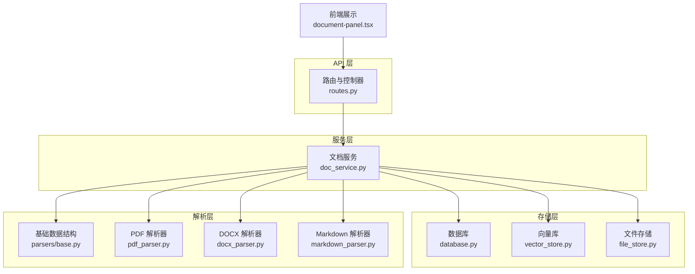
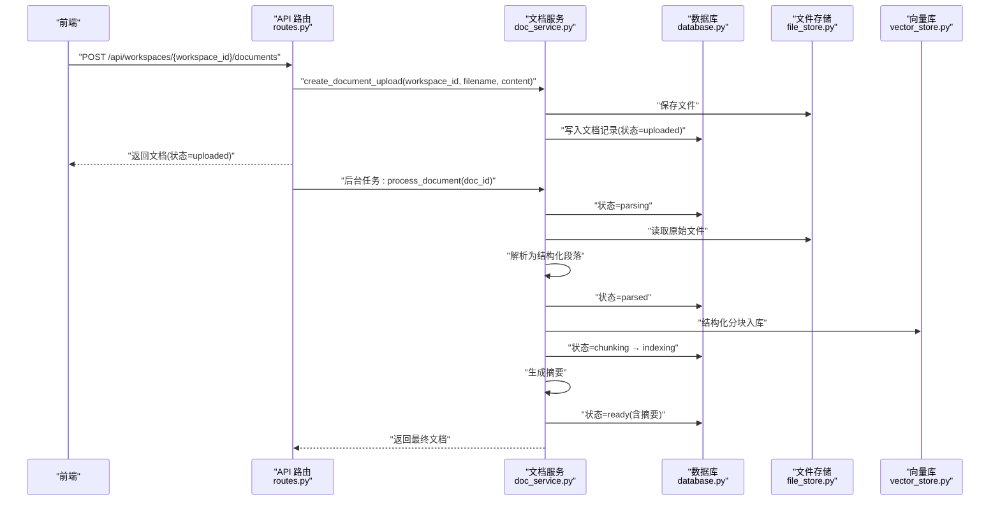
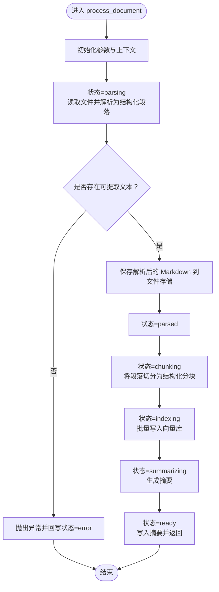
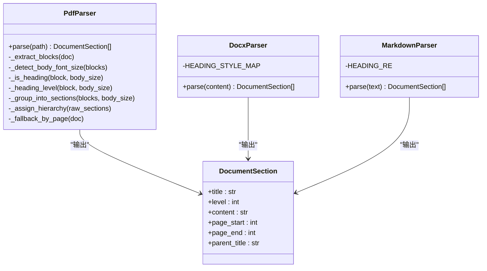
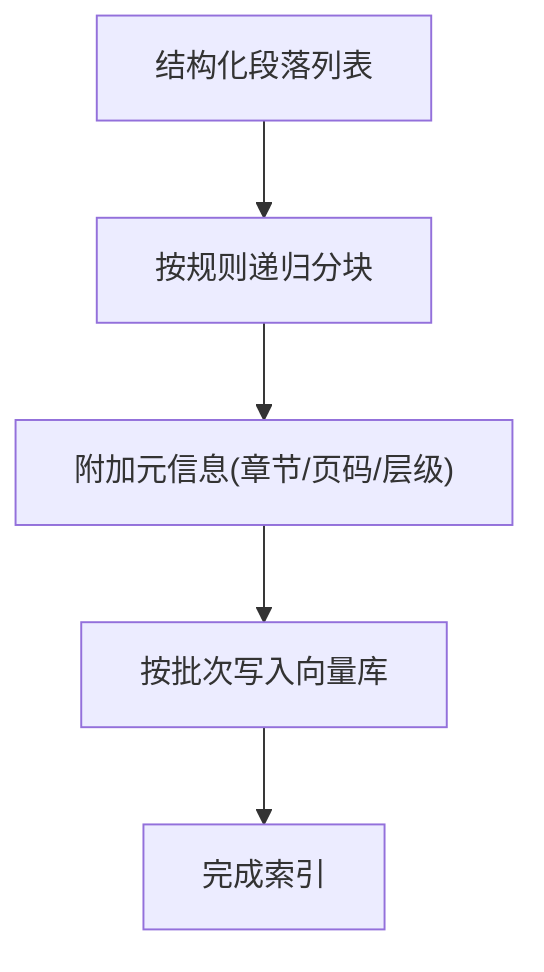
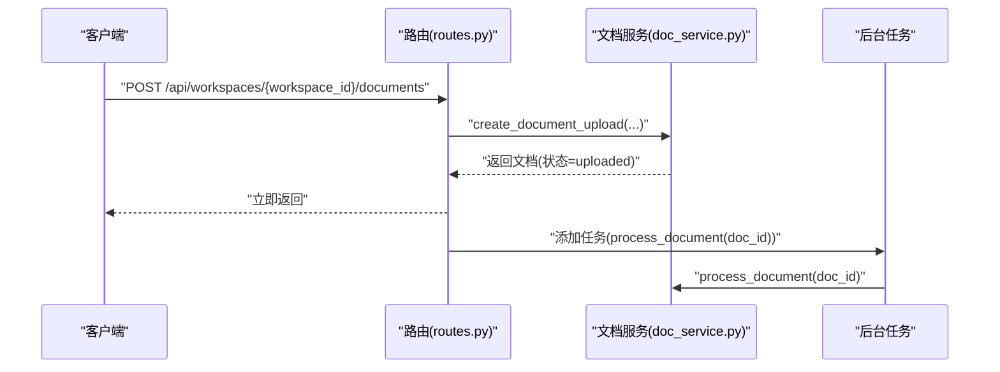
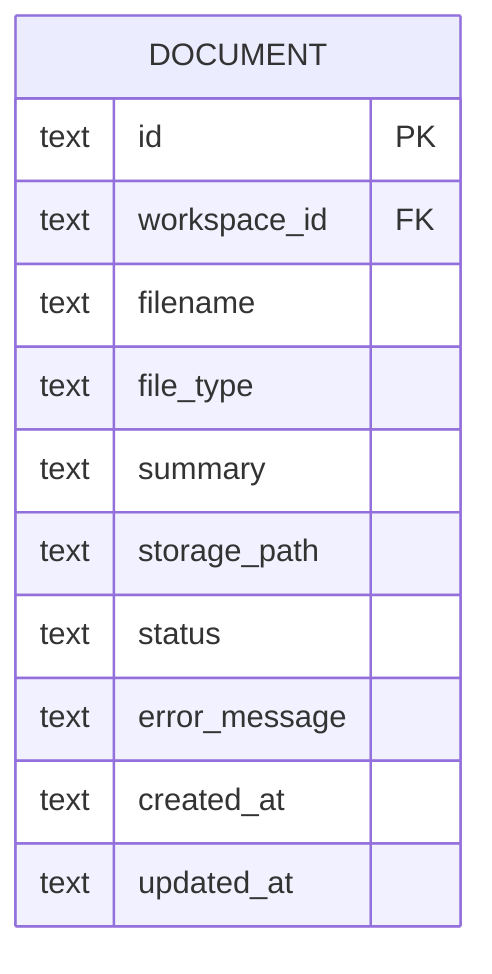
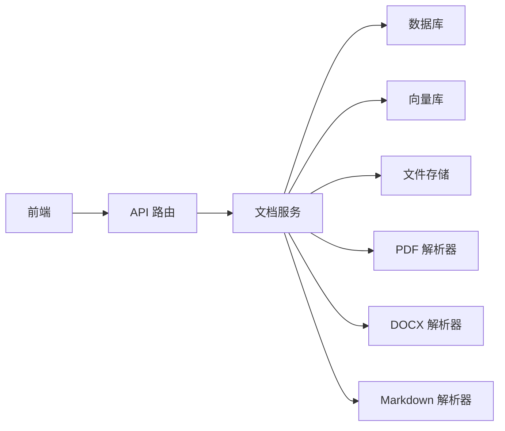

# 文档处理流水线

<cite>
**本文引用的文件**
- [backend/src/services/doc_service.py](file://backend/src/services/doc_service.py)
- [backend/src/storage/database.py](file://backend/src/storage/database.py)
- [backend/src/storage/vector_store.py](file://backend/src/storage/vector_store.py)
- [backend/src/storage/file_store.py](file://backend/src/storage/file_store.py)
- [backend/src/parsers/base.py](file://backend/src/parsers/base.py)
- [backend/src/parsers/pdf_parser.py](file://backend/src/parsers/pdf_parser.py)
- [backend/src/parsers/docx_parser.py](file://backend/src/parsers/docx_parser.py)
- [backend/src/parsers/markdown_parser.py](file://backend/src/parsers/markdown_parser.py)
- [backend/src/api/routes.py](file://backend/src/api/routes.py)
- [backend/src/middlewares/logging_middlewares.py](file://backend/src/middlewares/logging_middlewares.py)
- [backend/pyproject.toml](file://backend/pyproject.toml)
- [frontend/src/components/document/document-panel.tsx](file://frontend/src/components/document/document-panel.tsx)
</cite>

## 目录
1. [简介](#简介)
2. [项目结构](#项目结构)
3. [核心组件](#核心组件)
4. [架构总览](#架构总览)
5. [详细组件分析](#详细组件分析)
6. [依赖分析](#依赖分析)
7. [性能考虑](#性能考虑)
8. [故障排查指南](#故障排查指南)
9. [结论](#结论)
10. [附录](#附录)

## 简介
本文件面向 Train Agent 的“文档处理流水线”，围绕文档从上传到进入“就绪”状态的完整链路进行技术说明。重点覆盖以下方面：
- create_document_upload 与 process_document 的实现细节与协作关系
- 异步处理机制（FastAPI 后台任务）与状态管理策略
- 处理阶段划分：解析(parsing)、结构化(chunking)、索引(indexing)、摘要生成(summarizing)、就绪状态设置
- 每个阶段的状态更新逻辑、日志记录策略、异常恢复机制
- 实际调用接口的最佳实践与常见问题排查

## 项目结构
后端采用分层设计：
- API 层：接收上传请求，触发后台处理
- 服务层：封装业务流程（文档上传、处理、删除）
- 存储层：数据库、向量库、文件存储
- 解析层：PDF、DOCX、Markdown 三种解析器，统一输出结构化段落
- 前端：展示文档状态与摘要/错误信息

图表来源
- [backend/src/api/routes.py:112-128](file://backend/src/api/routes.py#L112-L128)
- [backend/src/services/doc_service.py:29-130](file://backend/src/services/doc_service.py#L29-L130)
- [backend/src/storage/database.py:285-329](file://backend/src/storage/database.py#L285-L329)
- [backend/src/storage/vector_store.py:39-122](file://backend/src/storage/vector_store.py#L39-L122)
- [backend/src/storage/file_store.py:6-28](file://backend/src/storage/file_store.py#L6-L28)
- [backend/src/parsers/base.py:6-97](file://backend/src/parsers/base.py#L6-L97)
- [backend/src/parsers/pdf_parser.py:17-192](file://backend/src/parsers/pdf_parser.py#L17-L192)
- [backend/src/parsers/docx_parser.py:20-84](file://backend/src/parsers/docx_parser.py#L20-L84)
- [backend/src/parsers/markdown_parser.py:13-62](file://backend/src/parsers/markdown_parser.py#L13-L62)
- [frontend/src/components/document/document-panel.tsx:24-51](file://frontend/src/components/document/document-panel.tsx#L24-L51)

章节来源
- [backend/src/api/routes.py:112-128](file://backend/src/api/routes.py#L112-L128)
- [backend/src/services/doc_service.py:29-130](file://backend/src/services/doc_service.py#L29-L130)
- [backend/src/storage/database.py:285-329](file://backend/src/storage/database.py#L285-L329)
- [backend/src/storage/vector_store.py:39-122](file://backend/src/storage/vector_store.py#L39-L122)
- [backend/src/storage/file_store.py:6-28](file://backend/src/storage/file_store.py#L6-L28)
- [backend/src/parsers/base.py:6-97](file://backend/src/parsers/base.py#L6-L97)
- [backend/src/parsers/pdf_parser.py:17-192](file://backend/src/parsers/pdf_parser.py#L17-L192)
- [backend/src/parsers/docx_parser.py:20-84](file://backend/src/parsers/docx_parser.py#L20-L84)
- [backend/src/parsers/markdown_parser.py:13-62](file://backend/src/parsers/markdown_parser.py#L13-L62)
- [frontend/src/components/document/document-panel.tsx:24-51](file://frontend/src/components/document/document-panel.tsx#L24-L51)

## 核心组件
- 文档服务 DocService：负责文档上传、处理全流程编排，包含状态推进、异常捕获与回滚式更新
- 数据库 Database：维护工作区、文档、任务、消息等表，提供 CRUD 与迁移能力
- 向量库 VectorStore：基于 ChromaDB + DashScope 嵌入模型，支持结构化分块入库与检索
- 文件存储 FileStore：持久化原始文件与解析导出的 Markdown
- 解析器族：PDF、DOCX、Markdown 三类解析器，统一输出 DocumentSection 列表
- 基础数据结构：DocumentSection、ChunkWithMetadata 及分块策略
- API 路由：提供上传接口，使用后台任务触发处理
- 日志中间件：记录 Agent 与模型调用前后状态，便于追踪

章节来源
- [backend/src/services/doc_service.py:13-28](file://backend/src/services/doc_service.py#L13-L28)
- [backend/src/storage/database.py:9-79](file://backend/src/storage/database.py#L9-L79)
- [backend/src/storage/vector_store.py:39-49](file://backend/src/storage/vector_store.py#L39-L49)
- [backend/src/storage/file_store.py:6-16](file://backend/src/storage/file_store.py#L6-L16)
- [backend/src/parsers/base.py:6-97](file://backend/src/parsers/base.py#L6-L97)
- [backend/src/api/routes.py:112-128](file://backend/src/api/routes.py#L112-L128)
- [backend/src/middlewares/logging_middlewares.py:15-59](file://backend/src/middlewares/logging_middlewares.py#L15-L59)

## 架构总览
文档处理流水线以“上传即触发后台处理”的模式运行。API 接收文件后立即返回“已上传”状态，随后通过后台任务执行解析、分块、索引、摘要生成，并在成功时置为“就绪”。

图表来源
- [backend/src/api/routes.py:112-128](file://backend/src/api/routes.py#L112-L128)
- [backend/src/services/doc_service.py:29-130](file://backend/src/services/doc_service.py#L29-L130)
- [backend/src/storage/database.py:285-329](file://backend/src/storage/database.py#L285-L329)
- [backend/src/storage/vector_store.py:91-122](file://backend/src/storage/vector_store.py#L91-L122)
- [backend/src/storage/file_store.py:11-16](file://backend/src/storage/file_store.py#L11-L16)

## 详细组件分析

### 组件一：文档服务 DocService
职责与流程
- create_document_upload：检测文件类型、保存文件、写入数据库记录，返回文档对象
- process_document：按阶段推进状态，执行解析、分块、索引、摘要生成，最终置为“就绪”
- 异常处理：捕获所有阶段异常，回写“error”状态与错误信息

关键实现要点
- 阶段状态推进：parsing → parsed → chunking → indexing → summarizing → ready
- 结构化解析：根据文件类型选择对应解析器，统一输出 DocumentSection 列表
- 分块策略：基于递归字符分割器，结合章节元信息生成 ChunkWithMetadata
- 向量入库：add_structured_chunks 将带元信息的分块批量写入向量库
- 摘要生成：优先使用 LLM，失败时回退为截断文本

图表来源
- [backend/src/services/doc_service.py:57-130](file://backend/src/services/doc_service.py#L57-L130)
- [backend/src/parsers/base.py:47-97](file://backend/src/parsers/base.py#L47-L97)
- [backend/src/storage/vector_store.py:91-122](file://backend/src/storage/vector_store.py#L91-L122)

章节来源
- [backend/src/services/doc_service.py:29-130](file://backend/src/services/doc_service.py#L29-L130)
- [backend/src/parsers/base.py:47-97](file://backend/src/parsers/base.py#L47-L97)
- [backend/src/storage/vector_store.py:91-122](file://backend/src/storage/vector_store.py#L91-L122)

### 组件二：解析器族
- PDF 解析器：基于 PyMuPDF 提取文本块，启发式识别标题层级与页面范围，失败时按页回退
- DOCX 解析器：基于 python-docx 标题样式映射，逐段聚合并生成结构化段落
- Markdown 解析器：基于正则匹配标题行，切分段落并标注章节层级
- 共同产物：DocumentSection 列表，供后续分块与索引使用

图表来源
- [backend/src/parsers/pdf_parser.py:17-192](file://backend/src/parsers/pdf_parser.py#L17-L192)
- [backend/src/parsers/docx_parser.py:20-84](file://backend/src/parsers/docx_parser.py#L20-L84)
- [backend/src/parsers/markdown_parser.py:13-62](file://backend/src/parsers/markdown_parser.py#L13-L62)
- [backend/src/parsers/base.py:6-16](file://backend/src/parsers/base.py#L6-L16)

章节来源
- [backend/src/parsers/pdf_parser.py:17-192](file://backend/src/parsers/pdf_parser.py#L17-L192)
- [backend/src/parsers/docx_parser.py:20-84](file://backend/src/parsers/docx_parser.py#L20-L84)
- [backend/src/parsers/markdown_parser.py:13-62](file://backend/src/parsers/markdown_parser.py#L13-L62)
- [backend/src/parsers/base.py:6-16](file://backend/src/parsers/base.py#L6-L16)

### 组件三：向量库与分块策略
- 分块策略：基于 RecursiveCharacterTextSplitter，按换行、段落、中文标点与空格分隔，控制最大长度与重叠
- 元信息保留：ChunkWithMetadata 包含章节标题、页码范围、层级等，便于检索增强
- 批量入库：add_structured_chunks 支持批量写入，提升索引效率

图表来源
- [backend/src/parsers/base.py:47-97](file://backend/src/parsers/base.py#L47-L97)
- [backend/src/storage/vector_store.py:91-122](file://backend/src/storage/vector_store.py#L91-L122)

章节来源
- [backend/src/parsers/base.py:47-97](file://backend/src/parsers/base.py#L47-L97)
- [backend/src/storage/vector_store.py:91-122](file://backend/src/storage/vector_store.py#L91-L122)

### 组件四：API 路由与异步处理
- 上传接口：POST /api/workspaces/{workspace_id}/documents
- 行为：读取文件内容，调用 create_document_upload 写入数据库并返回“uploaded”状态
- 触发：通过 BackgroundTasks 添加后台任务，调用 process_document(doc_id)，不阻塞请求响应

图表来源
- [backend/src/api/routes.py:112-128](file://backend/src/api/routes.py#L112-L128)
- [backend/src/services/doc_service.py:29-34](file://backend/src/services/doc_service.py#L29-L34)

章节来源
- [backend/src/api/routes.py:112-128](file://backend/src/api/routes.py#L112-L128)
- [backend/src/services/doc_service.py:29-34](file://backend/src/services/doc_service.py#L29-L34)

### 组件五：数据库与状态管理
- 文档表字段：id、workspace_id、filename、file_type、summary、storage_path、status、error_message、created_at、updated_at
- 初始化与迁移：自动建表与列补丁（如 error_message、updated_at）
- 更新策略：每次状态推进均更新 updated_at，确保前端轮询能感知最新进度

图表来源
- [backend/src/storage/database.py:285-329](file://backend/src/storage/database.py#L285-L329)

章节来源
- [backend/src/storage/database.py:285-329](file://backend/src/storage/database.py#L285-L329)

### 组件六：文件存储与导出
- 保存：FileStore.save/save_async 将文件写入 {base_dir}/{workspace_id}/{filename}
- 导出：解析完成后生成 Markdown 并保存，便于调试与摘要导出
- 删除：支持按文档或工作区清理

章节来源
- [backend/src/storage/file_store.py:11-28](file://backend/src/storage/file_store.py#L11-L28)
- [backend/src/services/doc_service.py:86-89](file://backend/src/services/doc_service.py#L86-L89)

### 组件七：前端状态展示
- 状态映射：uploaded/processing/parsing/parsed/chunking/indexing/summarizing/ready/error
- 活跃状态：除 error 外均显示旋转动画，表示处理中
- 详情展示：error 显示错误信息，ready 显示摘要片段

章节来源
- [frontend/src/components/document/document-panel.tsx:24-51](file://frontend/src/components/document/document-panel.tsx#L24-L51)
- [frontend/src/components/document/document-panel.tsx:170-213](file://frontend/src/components/document/document-panel.tsx#L170-L213)

## 依赖分析
- 运行时依赖：FastAPI、Uvicorn、LangChain、LangGraph、ChromaDB、DashScope、PyMuPDF、python-docx、aiosqlite 等
- 关键耦合点：
  - API 路由依赖文档服务与存储组件
  - 文档服务依赖解析器、向量库、文件存储与数据库
  - 前端依赖 API 返回的文档状态与摘要

图表来源
- [backend/src/api/routes.py:112-128](file://backend/src/api/routes.py#L112-L128)
- [backend/src/services/doc_service.py:13-28](file://backend/src/services/doc_service.py#L13-L28)
- [backend/pyproject.toml:6-26](file://backend/pyproject.toml#L6-L26)

章节来源
- [backend/src/api/routes.py:112-128](file://backend/src/api/routes.py#L112-L128)
- [backend/src/services/doc_service.py:13-28](file://backend/src/services/doc_service.py#L13-L28)
- [backend/pyproject.toml:6-26](file://backend/pyproject.toml#L6-L26)

## 性能考虑
- I/O 与 CPU 分离：文件写入与解析在主线程外执行，避免阻塞 API 响应
- 批量入库：向量库分批写入，减少单次调用开销
- 分块策略：合理设置最大长度与重叠，平衡检索精度与向量维度
- 嵌入模型：DashScope 文本嵌入需关注并发与配额限制，必要时引入限流与重试
- 前端轮询：建议按状态变化推送或长轮询，降低无效请求

## 故障排查指南
常见问题与定位方法
- 上传后状态长时间停留在“已上传”
  - 检查后台任务是否被调度（API 层已添加任务）
  - 查看文档服务日志，确认是否进入 parsing 阶段
- “解析失败”或“无可提取文本”
  - 确认文件格式与内容（扫描版 PDF 需 OCR）
  - 检查解析器输出是否为空
- “索引失败”
  - 检查向量库连接与集合创建
  - 确认嵌入模型 API Key/Endpoint 正确
- “摘要生成失败”
  - LLM 不可用时会回退为截断文本，检查日志 warning
- 前端未显示“就绪”
  - 确认数据库状态字段已更新，且前端轮询正常

章节来源
- [backend/src/services/doc_service.py:121-130](file://backend/src/services/doc_service.py#L121-L130)
- [backend/src/storage/vector_store.py:13-37](file://backend/src/storage/vector_store.py#L13-L37)
- [backend/src/middlewares/logging_middlewares.py:15-59](file://backend/src/middlewares/logging_middlewares.py#L15-L59)

## 结论
该文档处理流水线以“上传即触发、后台异步处理”为核心设计，通过明确的状态推进与完善的日志记录，实现了从解析、分块、索引到摘要生成的全链路自动化。前端状态映射直观展示了处理进度，配合数据库的增量更新，保证了可观测性与可恢复性。

## 附录

### 最佳实践建议
- 文件类型支持：优先使用可提取文本的 PDF/DOCX/Markdown；扫描版 PDF 建议先 OCR 再上传
- 大文件处理：合理设置分块大小与重叠，避免单条向量过长导致检索/嵌入异常
- 嵌入模型：配置稳定的 DashScope 凭据，必要时增加重试与降级策略
- 错误处理：保持异常捕获与状态回写一致，前端统一展示错误信息
- 前端轮询：建议按状态变化推送或长轮询，减少无效请求

### 接口调用示例（路径指引）
- 上传文档（触发后台处理）
  - 请求：POST /api/workspaces/{workspace_id}/documents
  - 参数：multipart/form-data，file 字段为文件
  - 返回：文档对象（初始状态为 uploaded）
  - 参考路径：[backend/src/api/routes.py:112-128](file://backend/src/api/routes.py#L112-L128)
- 获取文档列表
  - 请求：GET /api/workspaces/{workspace_id}/documents
  - 返回：文档数组
  - 参考路径：[backend/src/api/routes.py:131-135](file://backend/src/api/routes.py#L131-L135)
- 删除文档
  - 请求：DELETE /api/workspaces/{workspace_id}/documents/{doc_id}
  - 返回：{"ok": true}
  - 参考路径：[backend/src/api/routes.py:137-142](file://backend/src/api/routes.py#L137-L142)