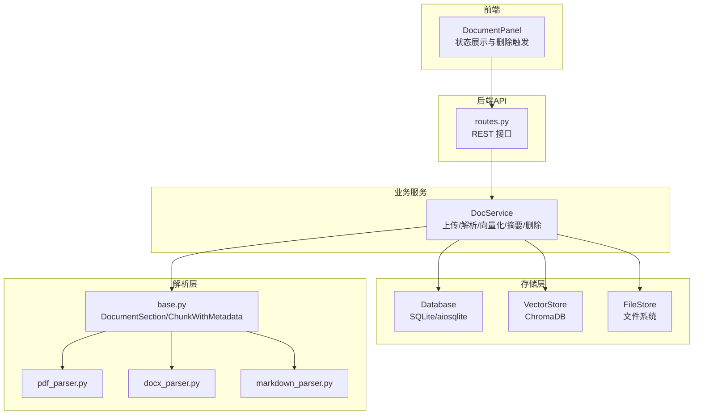
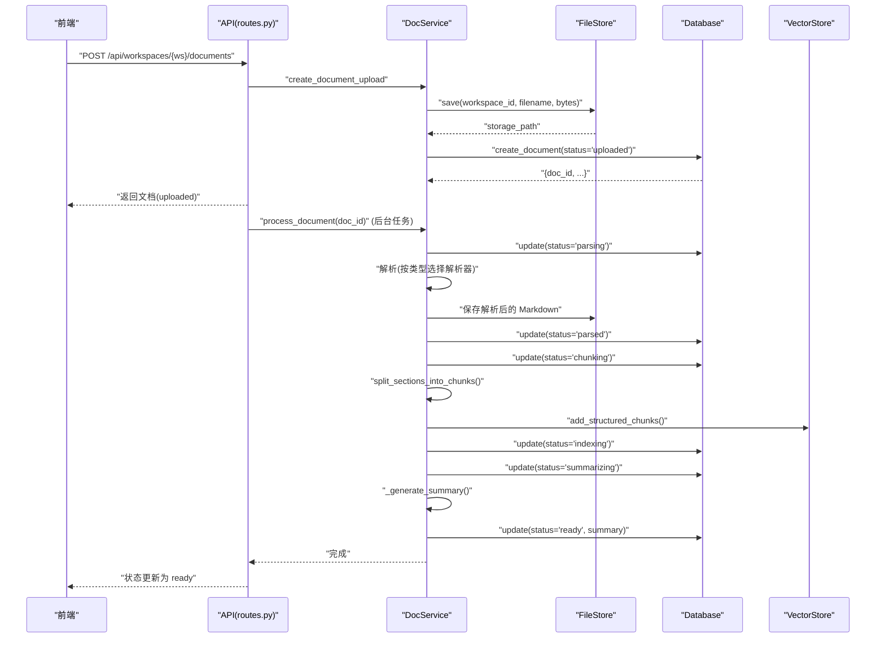
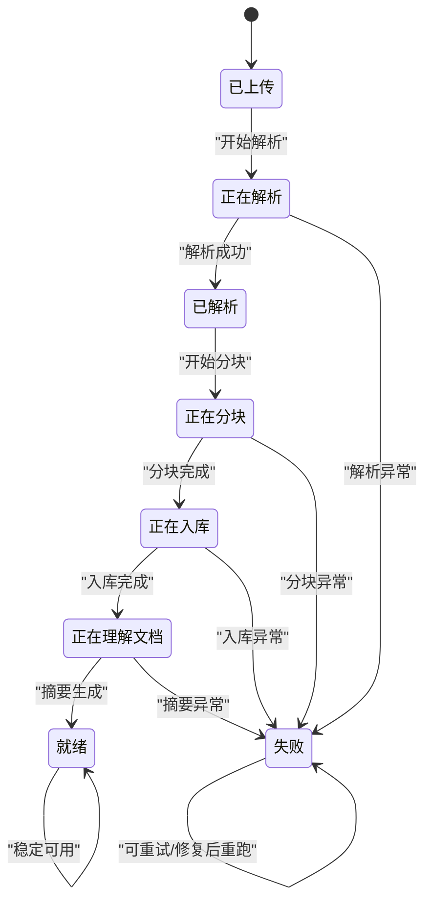
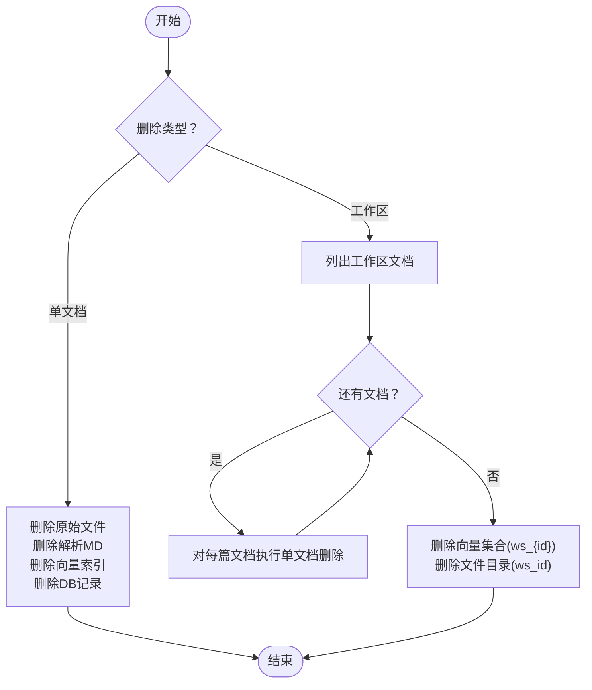
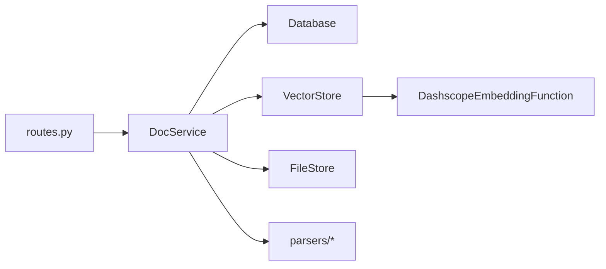

# 文档生命周期管理

<cite>
**本文引用的文件**
- [backend/src/services/doc_service.py](file://backend/src/services/doc_service.py)
- [backend/src/storage/database.py](file://backend/src/storage/database.py)
- [backend/src/storage/vector_store.py](file://backend/src/storage/vector_store.py)
- [backend/src/storage/file_store.py](file://backend/src/storage/file_store.py)
- [backend/src/parsers/base.py](file://backend/src/parsers/base.py)
- [backend/src/parsers/pdf_parser.py](file://backend/src/parsers/pdf_parser.py)
- [backend/src/parsers/docx_parser.py](file://backend/src/parsers/docx_parser.py)
- [backend/src/parsers/markdown_parser.py](file://backend/src/parsers/markdown_parser.py)
- [backend/src/api/routes.py](file://backend/src/api/routes.py)
- [frontend/src/components/document/document-panel.tsx](file://frontend/src/components/document/document-panel.tsx)
- [docs/backend-architecture.md](file://docs/backend-architecture.md)
- [plans/2026-05-27-train-agent-implementation.md](file://plans/2026-05-27-train-agent-implementation.md)
</cite>

## 目录
1. [简介](#简介)
2. [项目结构](#项目结构)
3. [核心组件](#核心组件)
4. [架构总览](#架构总览)
5. [详细组件分析](#详细组件分析)
6. [依赖分析](#依赖分析)
7. [性能考虑](#性能考虑)
8. [故障排查指南](#故障排查指南)
9. [结论](#结论)
10. [附录](#附录)

## 简介
本文件聚焦 Train Agent 的“文档生命周期管理”，系统性阐述文档从上传到就绪的完整流程、状态转换逻辑、删除与清理策略、垃圾回收机制、迁移与备份建议，以及状态监控与审计思路。目标是帮助开发者与运维人员准确把握各模块职责与交互，保障文档处理链路的稳定性与可观测性。

## 项目结构
围绕文档生命周期的关键代码分布在后端服务层、存储层与解析层，并由 API 层统一编排；前端负责状态展示与触发删除操作。

图示来源
- [backend/src/api/routes.py:112-141](file://backend/src/api/routes.py#L112-L141)
- [backend/src/services/doc_service.py:29-130](file://backend/src/services/doc_service.py#L29-L130)
- [backend/src/storage/database.py:285-311](file://backend/src/storage/database.py#L285-L311)
- [backend/src/storage/vector_store.py:39-122](file://backend/src/storage/vector_store.py#L39-L122)
- [backend/src/storage/file_store.py:6-38](file://backend/src/storage/file_store.py#L6-L38)
- [backend/src/parsers/base.py:6-96](file://backend/src/parsers/base.py#L6-L96)
- [backend/src/parsers/pdf_parser.py:17-35](file://backend/src/parsers/pdf_parser.py#L17-L35)
- [backend/src/parsers/docx_parser.py:20-83](file://backend/src/parsers/docx_parser.py#L20-L83)
- [backend/src/parsers/markdown_parser.py:13-61](file://backend/src/parsers/markdown_parser.py#L13-L61)

章节来源
- [backend/src/api/routes.py:112-141](file://backend/src/api/routes.py#L112-L141)
- [backend/src/services/doc_service.py:29-130](file://backend/src/services/doc_service.py#L29-L130)
- [backend/src/storage/database.py:285-311](file://backend/src/storage/database.py#L285-L311)
- [backend/src/storage/vector_store.py:39-122](file://backend/src/storage/vector_store.py#L39-L122)
- [backend/src/storage/file_store.py:6-38](file://backend/src/storage/file_store.py#L6-L38)
- [backend/src/parsers/base.py:6-96](file://backend/src/parsers/base.py#L6-L96)

## 核心组件
- 文档服务（DocService）：负责上传、解析、分块、向量化、摘要生成、状态更新与删除清理。
- 数据库（Database）：维护工作区、文档、任务等实体，提供 CRUD 与迁移能力。
- 向量存储（VectorStore）：基于 ChromaDB 的持久化集合，按工作区隔离，支持按文档 ID 删除。
- 文件存储（FileStore）：按工作区目录保存原始文件与解析产物（如 Markdown），支持单文件与工作区级删除。
- 解析器（Parsers）：PDF、Word、Markdown 分别解析为结构化段落，再拆分为带元数据的块。

章节来源
- [backend/src/services/doc_service.py:13-28](file://backend/src/services/doc_service.py#L13-L28)
- [backend/src/storage/database.py:9-78](file://backend/src/storage/database.py#L9-L78)
- [backend/src/storage/vector_store.py:39-49](file://backend/src/storage/vector_store.py#L39-L49)
- [backend/src/storage/file_store.py:6-9](file://backend/src/storage/file_store.py#L6-L9)
- [backend/src/parsers/base.py:6-41](file://backend/src/parsers/base.py#L6-L41)

## 架构总览
文档生命周期由 API 触发，DocService 协调存储与解析，最终在数据库中标注状态并返回给前端展示。

图示来源
- [backend/src/api/routes.py:112-128](file://backend/src/api/routes.py#L112-L128)
- [backend/src/services/doc_service.py:29-130](file://backend/src/services/doc_service.py#L29-L130)
- [backend/src/storage/database.py:285-311](file://backend/src/storage/database.py#L285-L311)
- [backend/src/storage/vector_store.py:91-122](file://backend/src/storage/vector_store.py#L91-L122)
- [backend/src/storage/file_store.py:11-16](file://backend/src/storage/file_store.py#L11-L16)
- [backend/src/parsers/base.py:47-96](file://backend/src/parsers/base.py#L47-L96)

## 详细组件分析

### 状态机与状态转换
- 初始状态：上传完成后写入数据库，状态为“已上传”。
- 解析阶段：根据文件类型选择解析器，提取结构化段落，生成 Markdown 并更新为“已解析”。
- 分块阶段：将段落拆分为固定大小的块，携带章节/页码等元数据。
- 向量化阶段：将块写入对应工作区的向量集合。
- 摘要阶段：调用 LLM 生成摘要，更新为“就绪”。
- 错误阶段：任一环节异常，更新为“失败”，保留错误信息。

图示来源
- [docs/backend-architecture.md:331-335](file://docs/backend-architecture.md#L331-L335)
- [backend/src/services/doc_service.py:57-130](file://backend/src/services/doc_service.py#L57-L130)
- [backend/src/storage/database.py:285-311](file://backend/src/storage/database.py#L285-L311)

章节来源
- [docs/backend-architecture.md:331-335](file://docs/backend-architecture.md#L331-L335)
- [backend/src/services/doc_service.py:57-130](file://backend/src/services/doc_service.py#L57-L130)
- [backend/src/storage/database.py:285-311](file://backend/src/storage/database.py#L285-L311)

### 文档删除操作
- 单文档删除：删除原始文件、解析生成的 Markdown、对应向量索引、数据库记录。
- 工作区批量删除：遍历工作区内所有文档，逐个执行上述清理，随后删除工作区对应的向量集合与文件目录。

图示来源
- [backend/src/services/doc_service.py:141-166](file://backend/src/services/doc_service.py#L141-L166)
- [backend/src/storage/vector_store.py:165-176](file://backend/src/storage/vector_store.py#L165-L176)
- [backend/src/storage/file_store.py:30-38](file://backend/src/storage/file_store.py#L30-L38)
- [backend/src/storage/database.py:330-338](file://backend/src/storage/database.py#L330-L338)

章节来源
- [backend/src/services/doc_service.py:141-166](file://backend/src/services/doc_service.py#L141-L166)
- [backend/src/storage/vector_store.py:165-176](file://backend/src/storage/vector_store.py#L165-L176)
- [backend/src/storage/file_store.py:30-38](file://backend/src/storage/file_store.py#L30-L38)
- [backend/src/storage/database.py:330-338](file://backend/src/storage/database.py#L330-L338)

### 垃圾回收机制
- 临时文件清理：解析生成的中间产物（如 Markdown）随文档删除一并清理。
- 向量索引清理：按文档 ID 删除集合中的对应条目；工作区删除时整体清空集合。
- 数据库记录清理：删除文档记录，利用外键级联删除任务记录。
- 文件系统清理：工作区级删除直接移除整个工作区目录。

章节来源
- [backend/src/services/doc_service.py:141-166](file://backend/src/services/doc_service.py#L141-L166)
- [backend/src/storage/vector_store.py:165-176](file://backend/src/storage/vector_store.py#L165-L176)
- [backend/src/storage/file_store.py:30-38](file://backend/src/storage/file_store.py#L30-L38)
- [backend/src/storage/database.py:144-148](file://backend/src/storage/database.py#L144-L148)

### 文档迁移与备份策略
- 跨工作区移动：当前实现未提供直接的“移动”接口。建议采用“复制+校验+删除”的流程：先在目标工作区执行上传，确认就绪后再删除源工作区文档。此流程需确保向量索引与文件路径一致。
- 版本管理：建议在文件名中引入版本号或时间戳，避免覆盖；或在业务层维护版本映射表。
- 数据导出：可通过下载接口获取原始文件与解析产物；向量数据需另行导出（例如通过查询导出元数据与嵌入）。

章节来源
- [backend/src/api/routes.py:163-174](file://backend/src/api/routes.py#L163-L174)
- [backend/src/services/doc_service.py:141-166](file://backend/src/services/doc_service.py#L141-L166)

### 状态监控与审计日志
- 前端状态展示：依据文档状态渲染图标与文案，活跃状态显示加载动画。
- 后端日志：各阶段均输出 INFO/ERROR 日志，便于定位问题。
- 审计建议：可在数据库中增加“事件日志”表，记录状态变更、错误详情、耗时等，结合前端轮询或 WebSocket 实时推送。

章节来源
- [frontend/src/components/document/document-panel.tsx:24-44](file://frontend/src/components/document/document-panel.tsx#L24-L44)
- [backend/src/services/doc_service.py:39-54](file://backend/src/services/doc_service.py#L39-L54)
- [backend/src/storage/database.py:285-311](file://backend/src/storage/database.py#L285-L311)

## 依赖分析
- DocService 依赖 Database、VectorStore、FileStore 与解析器集合。
- VectorStore 依赖 ChromaDB 客户端与嵌入函数。
- 解析器依赖第三方库（如 PyMuPDF、python-docx、langchain_text_splitters）。
- API 层依赖 DocService、Database、VectorStore、FileStore。

图示来源
- [backend/src/api/routes.py:10-11](file://backend/src/api/routes.py#L10-L11)
- [backend/src/services/doc_service.py:14-27](file://backend/src/services/doc_service.py#L14-L27)
- [backend/src/storage/vector_store.py:13-36](file://backend/src/storage/vector_store.py#L13-L36)
- [backend/src/parsers/base.py:6-41](file://backend/src/parsers/base.py#L6-L41)

章节来源
- [backend/src/api/routes.py:10-11](file://backend/src/api/routes.py#L10-L11)
- [backend/src/services/doc_service.py:14-27](file://backend/src/services/doc_service.py#L14-L27)
- [backend/src/storage/vector_store.py:13-36](file://backend/src/storage/vector_store.py#L13-L36)
- [backend/src/parsers/base.py:6-41](file://backend/src/parsers/base.py#L6-L41)

## 性能考虑
- 批量写入：向量存储默认批大小为 20，可根据硬件与延迟需求调整。
- 文本拆分：递归字符拆分器按多种分隔符切分，避免跨段落截断带来的语义割裂。
- I/O 隔离：文件写入通过异步线程包装，避免阻塞事件循环。
- 存储隔离：按工作区划分集合与目录，降低跨域扫描成本。

章节来源
- [backend/src/storage/vector_store.py:57-89](file://backend/src/storage/vector_store.py#L57-L89)
- [backend/src/parsers/base.py:47-56](file://backend/src/parsers/base.py#L47-L56)
- [backend/src/storage/file_store.py:18-28](file://backend/src/storage/file_store.py#L18-L28)

## 故障排查指南
- 常见错误与定位
  - 解析失败：检查解析器是否正确识别文件类型，查看日志中解析阶段的错误信息。
  - 向量化失败：确认嵌入模型与密钥配置，查看嵌入函数返回状态。
  - 摘要失败：若 LLM 不可用，系统会回退为截断文本，不影响流程。
  - 删除不彻底：确认是否同时清理了向量索引与文件目录。
- 建议操作
  - 查看后端日志，定位具体阶段。
  - 使用数据库查询验证状态字段与错误信息。
  - 对异常文档执行“单文档删除”后重试。

章节来源
- [backend/src/services/doc_service.py:121-130](file://backend/src/services/doc_service.py#L121-L130)
- [backend/src/storage/vector_store.py:20-36](file://backend/src/storage/vector_store.py#L20-L36)
- [backend/src/storage/database.py:321-328](file://backend/src/storage/database.py#L321-L328)

## 结论
文档生命周期管理以 DocService 为核心，串联文件、数据库与向量存储，形成“上传—解析—分块—入库—摘要—就绪”的闭环。删除与清理策略覆盖文件、索引与记录，确保资源不泄露。通过状态机与日志体系，系统具备良好的可观测性。建议在生产环境中补充审计日志与版本控制策略，进一步提升可追溯性与可维护性。

## 附录
- 状态定义与前端映射参考：[frontend/src/components/document/document-panel.tsx:24-44](file://frontend/src/components/document/document-panel.tsx#L24-L44)
- 架构与状态机说明：[docs/backend-architecture.md:331-335](file://docs/backend-architecture.md#L331-L335)
- 初始实现计划（含 FileStore 设计）：[plans/2026-05-27-train-agent-implementation.md:458-487](file://plans/2026-05-27-train-agent-implementation.md#L458-L487)