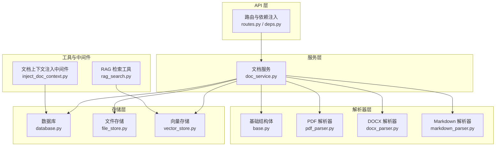
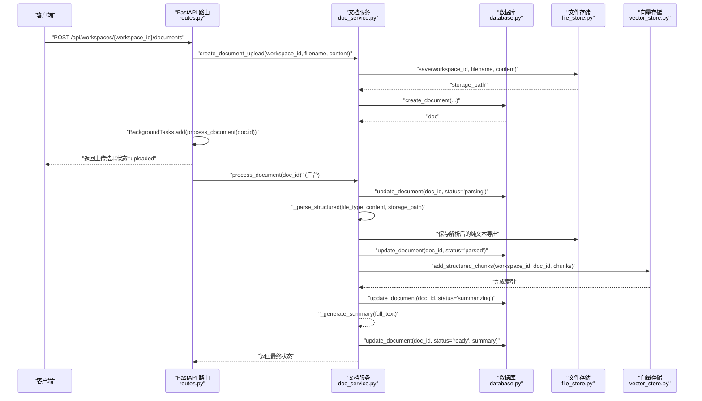
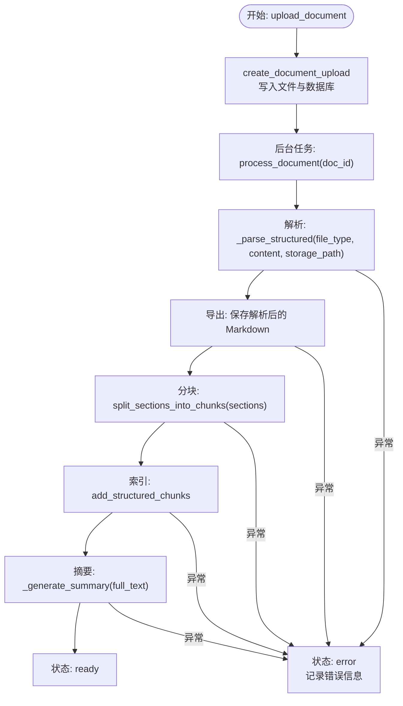
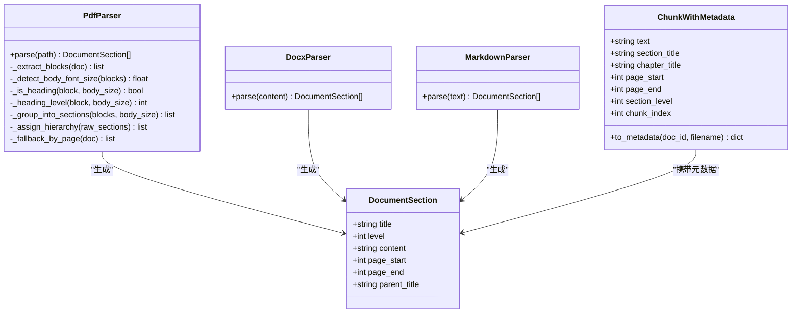
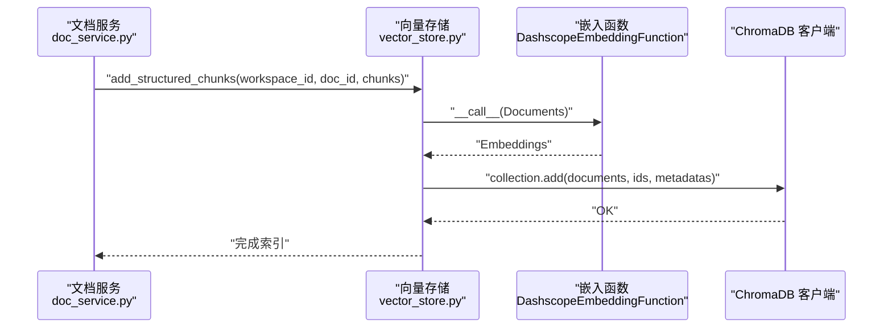
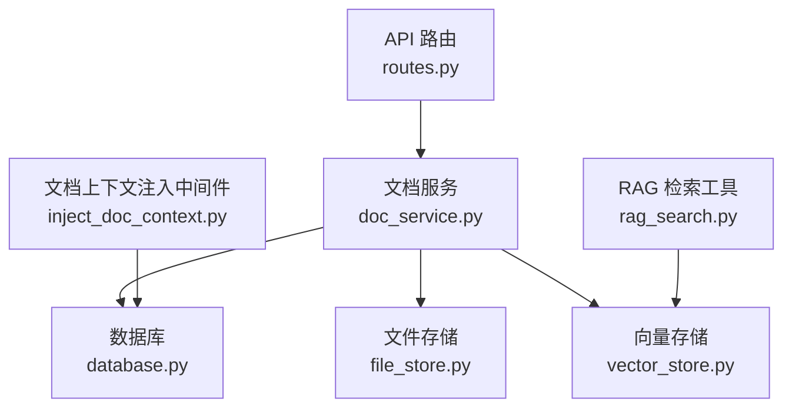
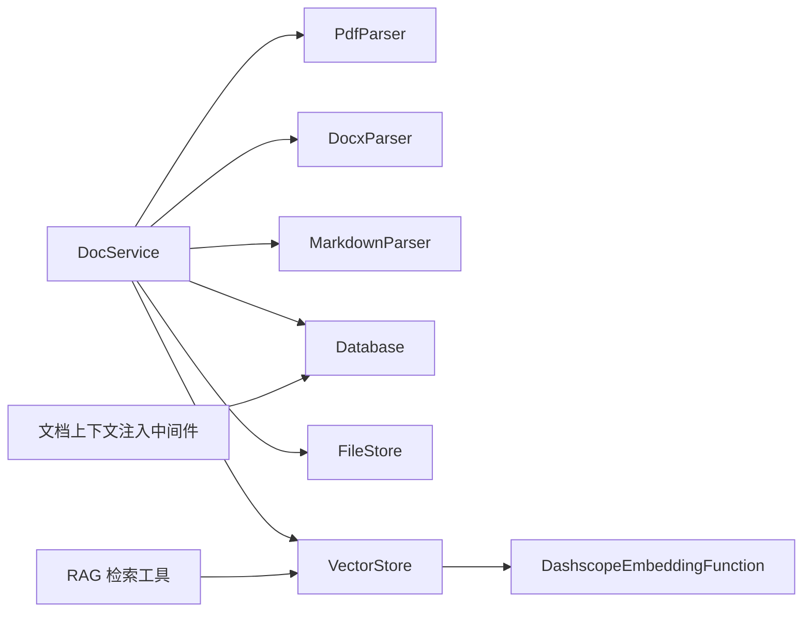

# 服务层设计

<cite>
**本文引用的文件**
- [doc_service.py](file://backend/src/services/doc_service.py)
- [base.py](file://backend/src/parsers/base.py)
- [pdf_parser.py](file://backend/src/parsers/pdf_parser.py)
- [docx_parser.py](file://backend/src/parsers/docx_parser.py)
- [markdown_parser.py](file://backend/src/parsers/markdown_parser.py)
- [vector_store.py](file://backend/src/storage/vector_store.py)
- [file_store.py](file://backend/src/storage/file_store.py)
- [database.py](file://backend/src/storage/database.py)
- [routes.py](file://backend/src/api/routes.py)
- [deps.py](file://backend/src/api/deps.py)
- [app_context.py](file://backend/src/app_context.py)
- [rag_search.py](file://backend/src/tools/rag_search.py)
- [inject_doc_context.py](file://backend/src/middlewares/inject_doc_context.py)
- [pyproject.toml](file://backend/pyproject.toml)
</cite>

## 目录
1. [简介](#简介)
2. [项目结构](#项目结构)
3. [核心组件](#核心组件)
4. [架构总览](#架构总览)
5. [详细组件分析](#详细组件分析)
6. [依赖关系分析](#依赖关系分析)
7. [性能考量](#性能考量)
8. [故障排查指南](#故障排查指南)
9. [结论](#结论)
10. [附录](#附录)

## 简介
本文件面向 Train Agent 的服务层设计，聚焦“文档服务”的完整实现，涵盖：
- 文档上传处理与异步处理流程
- 状态管理机制
- 多格式文档解析器（PDF、DOCX、Markdown）的设计差异与共同接口
- 结构化数据提取与处理流程（文本清洗、元数据提取、内容分块策略）
- 向量化索引生成（嵌入模型选择、向量存储、相似度检索）
- 服务层与各层交互接口（错误处理、性能优化、并发控制）

## 项目结构
后端采用分层架构：API 层负责请求入口与后台任务调度；服务层封装业务流程；存储层负责持久化与向量检索；解析器层负责多格式文档结构化解析；工具与中间件层提供检索与上下文注入能力。

图表来源
- [routes.py:1-189](file://backend/src/api/routes.py#L1-L189)
- [deps.py:1-30](file://backend/src/api/deps.py#L1-L30)
- [doc_service.py:1-218](file://backend/src/services/doc_service.py#L1-L218)
- [base.py:1-97](file://backend/src/parsers/base.py#L1-L97)
- [pdf_parser.py:1-192](file://backend/src/parsers/pdf_parser.py#L1-L192)
- [docx_parser.py:1-84](file://backend/src/parsers/docx_parser.py#L1-L84)
- [markdown_parser.py:1-62](file://backend/src/parsers/markdown_parser.py#L1-L62)
- [database.py:1-379](file://backend/src/storage/database.py#L1-L379)
- [file_store.py:1-39](file://backend/src/storage/file_store.py#L1-L39)
- [vector_store.py:1-177](file://backend/src/storage/vector_store.py#L1-L177)
- [rag_search.py:1-76](file://backend/src/tools/rag_search.py#L1-L76)
- [inject_doc_context.py:1-41](file://backend/src/middlewares/inject_doc_context.py#L1-L41)

章节来源
- [routes.py:1-189](file://backend/src/api/routes.py#L1-L189)
- [deps.py:1-30](file://backend/src/api/deps.py#L1-L30)
- [app_context.py:1-31](file://backend/src/app_context.py#L1-L31)

## 核心组件
- 文档服务（DocService）：统一编排上传、解析、分块、索引、摘要生成与状态更新，支持异步后台处理与错误回滚。
- 多格式解析器：PDF（基于 PyMuPDF 的标题检测与页面追踪）、DOCX（基于样式名映射）、Markdown（基于标题标记）。
- 存储层：数据库（aiosqlite）、文件存储（本地目录）、向量存储（ChromaDB + DashScope 嵌入）。
- 工具与中间件：RAG 检索工具、系统提示注入中间件。

章节来源
- [doc_service.py:13-218](file://backend/src/services/doc_service.py#L13-L218)
- [pdf_parser.py:17-192](file://backend/src/parsers/pdf_parser.py#L17-L192)
- [docx_parser.py:20-84](file://backend/src/parsers/docx_parser.py#L20-L84)
- [markdown_parser.py:13-62](file://backend/src/parsers/markdown_parser.py#L13-L62)
- [database.py:9-379](file://backend/src/storage/database.py#L9-L379)
- [file_store.py:6-39](file://backend/src/storage/file_store.py#L6-L39)
- [vector_store.py:39-177](file://backend/src/storage/vector_store.py#L39-L177)
- [rag_search.py:40-76](file://backend/src/tools/rag_search.py#L40-L76)
- [inject_doc_context.py:11-41](file://backend/src/middlewares/inject_doc_context.py#L11-L41)

## 架构总览
服务层通过 API 路由触发上传，先写入数据库与文件存储，再将文档 ID 放入后台任务队列进行异步处理。处理流程包含结构化解析、文本导出、分块与向量索引构建，并在完成后生成摘要与更新状态。

图表来源
- [routes.py:112-128](file://backend/src/api/routes.py#L112-L128)
- [doc_service.py:29-130](file://backend/src/services/doc_service.py#L29-L130)
- [database.py:285-311](file://backend/src/storage/database.py#L285-L311)
- [file_store.py:11-16](file://backend/src/storage/file_store.py#L11-L16)
- [vector_store.py:91-122](file://backend/src/storage/vector_store.py#L91-L122)

## 详细组件分析

### 文档服务（DocService）
- 职责边界
  - 接收上传请求，写入数据库与文件存储，返回上传记录。
  - 异步执行解析、分块、索引、摘要生成与状态更新。
  - 提供工作区与文档删除能力，清理文件、向量与数据库记录。
- 关键流程
  - 上传阶段：类型检测、文件落盘、数据库记录、状态置为 uploaded。
  - 解析阶段：根据类型调用对应解析器，输出结构化章节列表。
  - 导出阶段：将解析后的纯文本导出为 Markdown 文件，便于调试与摘要。
  - 分块阶段：按最大长度与分隔符进行递归分块，保留章节与页码元数据。
  - 索引阶段：将结构化分块写入向量库，建立工作区集合。
  - 摘要阶段：可选 LLM 生成摘要，失败时回退到截断文本。
  - 错误阶段：捕获异常，更新状态为 error 并记录错误信息。
- 并发与异步
  - API 使用后台任务触发处理，避免阻塞请求响应。
  - 文件存储提供异步写入包装，确保非阻塞 I/O。
- 状态管理
  - 数据库表 document 中维护状态字段与错误信息，便于前端轮询与展示。
- 依赖注入
  - 通过 AppContext 从环境变量加载路径，构造数据库、向量存储、文件存储与技能管理器实例。

图表来源
- [doc_service.py:29-130](file://backend/src/services/doc_service.py#L29-L130)
- [base.py:47-97](file://backend/src/parsers/base.py#L47-L97)
- [vector_store.py:91-122](file://backend/src/storage/vector_store.py#L91-L122)

章节来源
- [doc_service.py:13-218](file://backend/src/services/doc_service.py#L13-L218)
- [file_store.py:18-28](file://backend/src/storage/file_store.py#L18-L28)
- [database.py:321-328](file://backend/src/storage/database.py#L321-L328)

### 多格式文档解析器
- 共同接口
  - 所有解析器均返回结构化章节列表，每个章节包含标题、层级、内容、页码范围与父级标题等元数据。
  - 基础结构体定义于 base.py，分块器将章节转换为带元数据的文本块。
- PDF 解析器（pdf_parser.py）
  - 使用 PyMuPDF 提取文本块及其字体大小与粗细信息，计算正文基准字号，通过字号倍数与常见标题模式识别标题。
  - 将连续文本按标题分组，形成章节，同时记录起止页码。
  - 若无法检测结构，则回退为逐页切分为章节。
- DOCX 解析器（docx_parser.py）
  - 基于 python-docx 的段落样式名称映射到标题层级，遍历段落构建章节。
  - 若无标题则将全文合并为单节。
- Markdown 解析器（markdown_parser.py）
  - 使用正则匹配标题标记（#、## 等），按标题位置切分内容，支持无标题场景。
- 设计差异
  - PDF 需要复杂的字体与布局分析，具备更强的健壮性与回退策略。
  - DOCX 依赖样式规范，适合 Office 文档的结构化提取。
  - Markdown 以标记驱动，简洁直观，适合轻量文档。

图表来源
- [base.py:6-42](file://backend/src/parsers/base.py#L6-L42)
- [pdf_parser.py:17-192](file://backend/src/parsers/pdf_parser.py#L17-L192)
- [docx_parser.py:20-84](file://backend/src/parsers/docx_parser.py#L20-L84)
- [markdown_parser.py:13-62](file://backend/src/parsers/markdown_parser.py#L13-L62)

章节来源
- [pdf_parser.py:17-192](file://backend/src/parsers/pdf_parser.py#L17-L192)
- [docx_parser.py:20-84](file://backend/src/parsers/docx_parser.py#L20-L84)
- [markdown_parser.py:13-62](file://backend/src/parsers/markdown_parser.py#L13-L62)
- [base.py:47-97](file://backend/src/parsers/base.py#L47-L97)

### 结构化数据提取与处理流程
- 文本清洗
  - 解析器对原始文本进行去噪与规范化，PDF 与 DOCX 会过滤空行与空白段落。
- 元数据提取
  - PDF：从字体与布局推断标题层级与页码范围；DOCX：从样式映射；Markdown：从标题标记。
  - 分块器将章节元数据（章节名、父章节、层级、页码）附加到每个文本块。
- 内容分块策略
  - 采用递归字符分割器，优先按段落、换行、中文标点与空格切分，控制最大长度并设置重叠，保证语义完整性。
- 导出与调试
  - 将解析后的纯文本导出为 Markdown，便于人工核验与摘要生成。

章节来源
- [pdf_parser.py:41-174](file://backend/src/parsers/pdf_parser.py#L41-L174)
- [docx_parser.py:23-82](file://backend/src/parsers/docx_parser.py#L23-L82)
- [markdown_parser.py:16-61](file://backend/src/parsers/markdown_parser.py#L16-L61)
- [base.py:47-97](file://backend/src/parsers/base.py#L47-L97)
- [doc_service.py:74-89](file://backend/src/services/doc_service.py#L74-L89)

### 向量化索引生成
- 嵌入模型选择
  - 默认使用 DashScope 文本嵌入模型，可通过环境变量配置模型、API Key 与 Base URL。
- 向量存储
  - 使用 ChromaDB 持久化，按工作区创建独立集合，Cosine 距离空间，支持元数据查询。
- 相似度检索
  - 支持按文档 ID 过滤与全局检索，返回文本、元数据与距离，便于前端展示定位信息。
- 批量写入
  - 分批写入，减少内存压力与网络往返开销。

图表来源
- [vector_store.py:91-122](file://backend/src/storage/vector_store.py#L91-L122)
- [vector_store.py:13-37](file://backend/src/storage/vector_store.py#L13-L37)

章节来源
- [vector_store.py:39-177](file://backend/src/storage/vector_store.py#L39-L177)
- [doc_service.py:99-106](file://backend/src/services/doc_service.py#L99-L106)

### 服务层与其他层的交互接口
- API 层
  - 上传接口触发后台任务，避免阻塞；下载接口支持直接读取已落盘文件。
- 依赖注入
  - 通过 AppContext 统一加载数据库、向量存储、文件存储与技能管理器，便于测试与部署。
- 工具与中间件
  - RAG 检索工具基于向量存储进行检索，支持按文档 ID 过滤；文档上下文注入中间件在系统提示中拼接当前工作区的文档摘要，增强模型对知识库的感知。

图表来源
- [routes.py:112-128](file://backend/src/api/routes.py#L112-L128)
- [deps.py:27-29](file://backend/src/api/deps.py#L27-L29)
- [app_context.py:19-30](file://backend/src/app_context.py#L19-L30)
- [rag_search.py:40-76](file://backend/src/tools/rag_search.py#L40-L76)
- [inject_doc_context.py:11-41](file://backend/src/middlewares/inject_doc_context.py#L11-L41)

章节来源
- [routes.py:112-128](file://backend/src/api/routes.py#L112-L128)
- [deps.py:13-29](file://backend/src/api/deps.py#L13-L29)
- [app_context.py:12-30](file://backend/src/app_context.py#L12-L30)
- [rag_search.py:40-76](file://backend/src/tools/rag_search.py#L40-L76)
- [inject_doc_context.py:11-41](file://backend/src/middlewares/inject_doc_context.py#L11-L41)

## 依赖关系分析
- 组件耦合
  - DocService 依赖解析器、存储层与可选 LLM；解析器仅依赖基础结构体；存储层彼此独立。
- 外部依赖
  - PyMuPDF（PDF）、python-docx（DOCX）、DashScope（嵌入）、ChromaDB（向量）、aiosqlite（数据库）。
- 环境变量
  - DATA_DIR、EMBEDDING_*、SUMMARIZATION_* 控制数据路径与外部服务配置。

图表来源
- [doc_service.py:25-27](file://backend/src/services/doc_service.py#L25-L27)
- [vector_store.py:13-37](file://backend/src/storage/vector_store.py#L13-L37)
- [rag_search.py:40-76](file://backend/src/tools/rag_search.py#L40-L76)
- [inject_doc_context.py:11-41](file://backend/src/middlewares/inject_doc_context.py#L11-L41)

章节来源
- [pyproject.toml:6-26](file://backend/pyproject.toml#L6-L26)
- [doc_service.py:4-8](file://backend/src/services/doc_service.py#L4-L8)
- [vector_store.py:5-8](file://backend/src/storage/vector_store.py#L5-L8)

## 性能考量
- I/O 与并发
  - 文件写入采用线程池包装，避免阻塞事件循环；向量批量写入分批提交，降低内存峰值。
- 解析健壮性
  - PDF 回退策略确保在无结构时仍可按页切分；DOCX/Markdown 在无标题时自动兜底为单节。
- 检索效率
  - ChromaDB 使用 Cosine 距离，结合元数据过滤，提升检索精度与速度。
- 摘要生成
  - LLM 生成摘要时限制输入长度并提供回退方案，避免大模型异常影响整体可用性。

## 故障排查指南
- 常见问题
  - 无文本可提取：检查文件是否为扫描版或图像型 PDF，需 OCR 流程补充。
  - 嵌入失败：确认 EMBEDDING_API_KEY 与 EMBEDDING_API_BASE 设置正确。
  - 检索为空：确认工作区集合存在且已成功索引；必要时重建索引。
- 日志与状态
  - 服务层在关键节点记录日志，数据库记录状态与错误信息，便于定位问题。
- 清理与恢复
  - 删除工作区或文档会同步清理文件、向量与数据库记录，避免残留。

章节来源
- [doc_service.py:80-84](file://backend/src/services/doc_service.py#L80-L84)
- [vector_store.py:26-36](file://backend/src/storage/vector_store.py#L26-L36)
- [database.py:321-328](file://backend/src/storage/database.py#L321-L328)

## 结论
文档服务通过清晰的职责划分与稳健的解析策略，实现了从多格式文档到结构化索引的全链路自动化。其异步处理与状态管理保障了用户体验，而向量检索与上下文注入进一步提升了问答质量。建议在生产环境中完善 OCR 流程、监控嵌入服务可用性，并持续优化分块策略与检索参数。

## 附录
- 环境变量参考
  - DATA_DIR：数据根目录（数据库、向量、文件存储路径前缀）
  - EMBEDDING_MODEL / EMBEDDING_API_KEY / EMBEDDING_API_BASE：嵌入模型与服务配置
  - SUMMARIZATION_MODEL / SUMMARIZATION_API_KEY / SUMMARIZATION_API_BASE：摘要模型与服务配置
- API 端点概览
  - 上传文档：POST /api/workspaces/{workspace_id}/documents（后台异步处理）
  - 列举文档：GET /api/workspaces/{workspace_id}/documents
  - 删除文档：DELETE /api/workspaces/{workspace_id}/documents/{doc_id}
  - 下载文件：GET /api/files/{file_path}

章节来源
- [app_context.py:20-30](file://backend/src/app_context.py#L20-L30)
- [vector_store.py:20-25](file://backend/src/storage/vector_store.py#L20-L25)
- [deps.py:21-25](file://backend/src/api/deps.py#L21-L25)
- [routes.py:112-141](file://backend/src/api/routes.py#L112-L141)