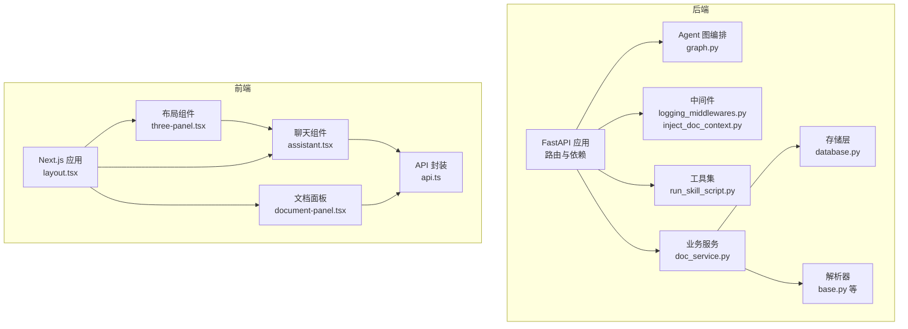
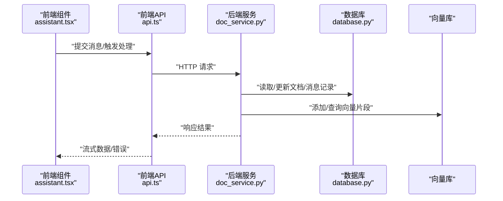
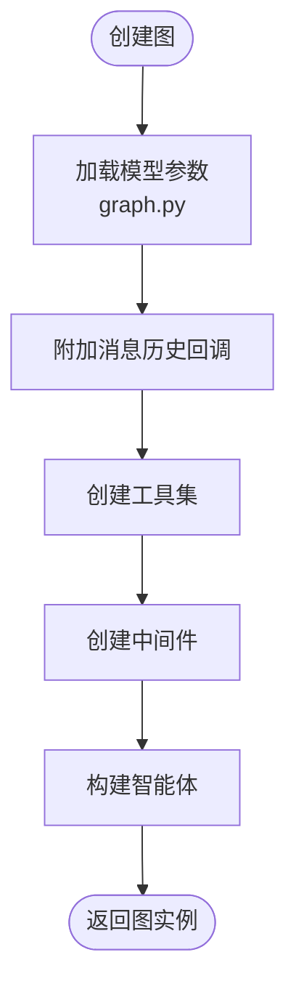
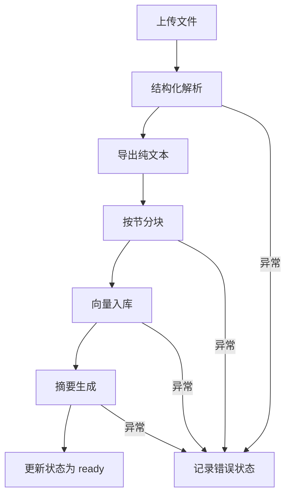
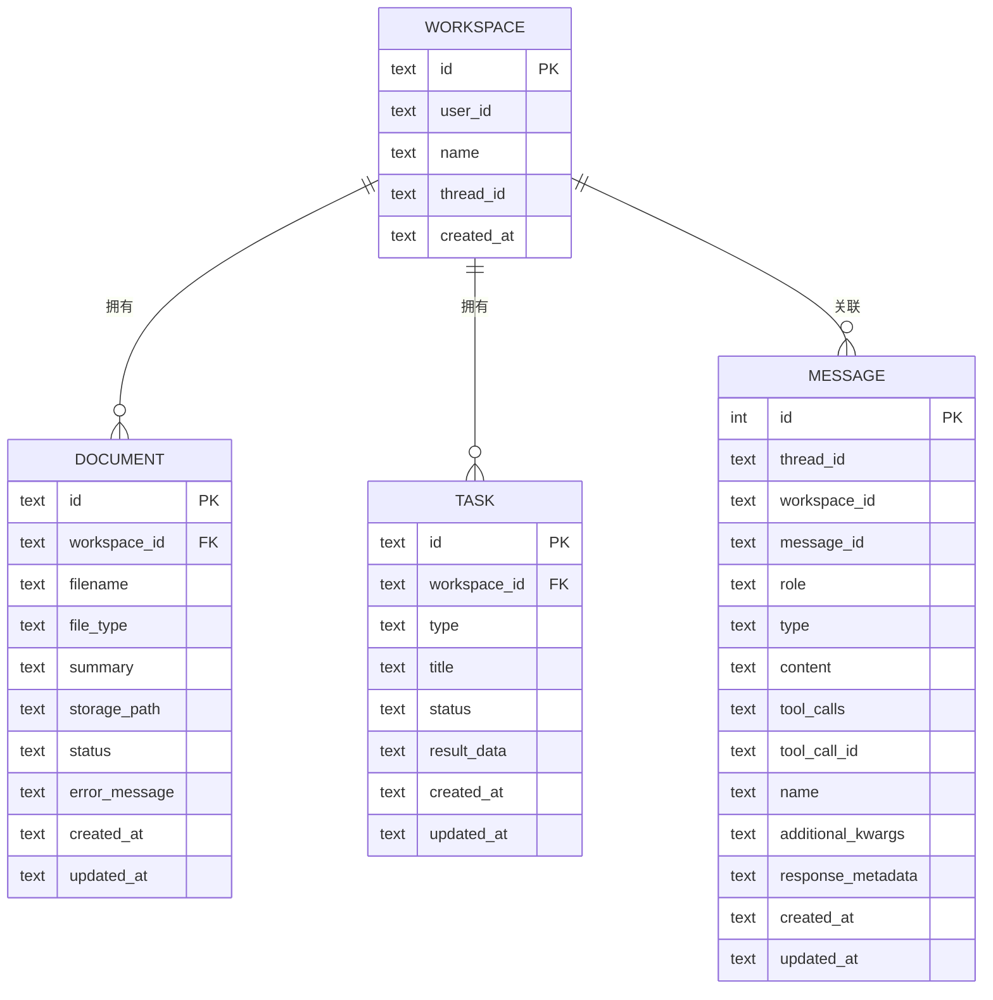
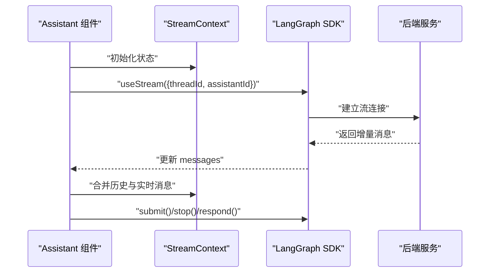
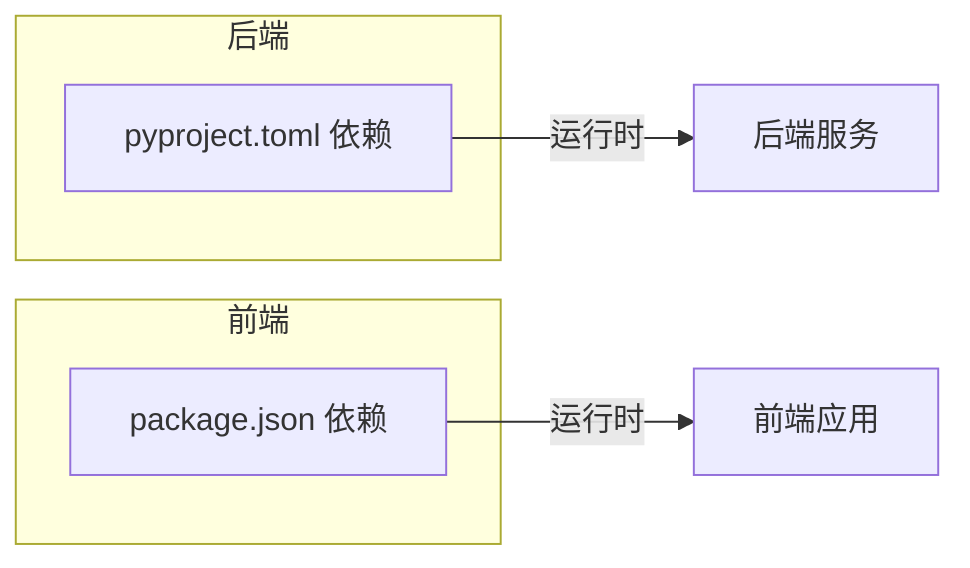

# 代码规范

<cite>
**本文引用的文件**
- [backend/pyproject.toml](file://backend/pyproject.toml)
- [frontend/package.json](file://frontend/package.json)
- [frontend/eslint.config.mjs](file://frontend/eslint.config.mjs)
- [frontend/tsconfig.json](file://frontend/tsconfig.json)
- [backend/src/agent/graph.py](file://backend/src/agent/graph.py)
- [backend/src/middlewares/logging_middlewares.py](file://backend/src/middlewares/logging_middlewares.py)
- [backend/src/middlewares/inject_doc_context.py](file://backend/src/middlewares/inject_doc_context.py)
- [backend/src/tools/run_skill_script.py](file://backend/src/tools/run_skill_script.py)
- [backend/src/storage/database.py](file://backend/src/storage/database.py)
- [backend/src/parsers/base.py](file://backend/src/parsers/base.py)
- [backend/src/services/doc_service.py](file://backend/src/services/doc_service.py)
- [frontend/src/lib/api.ts](file://frontend/src/lib/api.ts)
- [frontend/src/components/chat/assistant.tsx](file://frontend/src/components/chat/assistant.tsx)
- [frontend/src/components/document/document-panel.tsx](file://frontend/src/components/document/document-panel.tsx)
- [frontend/src/components/layout/three-panel.tsx](file://frontend/src/components/layout/three-panel.tsx)
- [frontend/src/app/layout.tsx](file://frontend/src/app/layout.tsx)
</cite>

## 目录
1. [引言](#引言)
2. [项目结构](#项目结构)
3. [核心组件](#核心组件)
4. [架构总览](#架构总览)
5. [详细组件分析](#详细组件分析)
6. [依赖关系分析](#依赖关系分析)
7. [性能考量](#性能考量)
8. [故障排查指南](#故障排查指南)
9. [结论](#结论)
10. [附录](#附录)

## 引言
本文件为 Train Agent 项目的代码规范文档，覆盖后端 Python 与前端 TypeScript/JavaScript 的编码风格、类型安全、异常处理与日志记录标准，并给出命名约定、缩进与格式化规则、注释与文档字符串规范、IDE 配置建议、自动格式化与代码质量检查工具集成方式，以及第三方库使用最佳实践与安全注意事项。文档中的具体示例均以“代码片段路径”形式标注，避免直接粘贴源码。

## 项目结构
项目采用前后端分离架构：
- 后端基于 FastAPI + LangGraph，模块按职责划分：agent（图编排与状态）、middlewares（中间件）、parsers（文档解析）、services（业务服务）、storage（数据库/向量存储/文件存储）、tools（工具集）。
- 前端基于 Next.js 16 + React 19，采用客户端组件与上下文管理消息流，组件按功能域组织（chat/document/layout/workspace 等）。

图表来源
- [backend/src/agent/graph.py:1-49](file://backend/src/agent/graph.py#L1-L49)
- [backend/src/middlewares/logging_middlewares.py:1-59](file://backend/src/middlewares/logging_middlewares.py#L1-L59)
- [backend/src/middlewares/inject_doc_context.py:1-41](file://backend/src/middlewares/inject_doc_context.py#L1-L41)
- [backend/src/tools/run_skill_script.py:1-143](file://backend/src/tools/run_skill_script.py#L1-L143)
- [backend/src/services/doc_service.py:1-218](file://backend/src/services/doc_service.py#L1-L218)
- [backend/src/storage/database.py:1-379](file://backend/src/storage/database.py#L1-L379)
- [backend/src/parsers/base.py:1-97](file://backend/src/parsers/base.py#L1-L97)
- [frontend/src/app/layout.tsx:1-34](file://frontend/src/app/layout.tsx#L1-L34)
- [frontend/src/components/chat/assistant.tsx:1-292](file://frontend/src/components/chat/assistant.tsx#L1-L292)
- [frontend/src/components/document/document-panel.tsx:1-214](file://frontend/src/components/document/document-panel.tsx#L1-L214)
- [frontend/src/components/layout/three-panel.tsx:1-132](file://frontend/src/components/layout/three-panel.tsx#L1-L132)
- [frontend/src/lib/api.ts:1-196](file://frontend/src/lib/api.ts#L1-L196)

章节来源
- [backend/src/agent/graph.py:1-49](file://backend/src/agent/graph.py#L1-L49)
- [frontend/src/app/layout.tsx:1-34](file://frontend/src/app/layout.tsx#L1-L34)

## 核心组件
- 后端核心组件包括：Agent 图构建、日志中间件、文档上下文注入中间件、技能脚本执行工具、文档处理服务、数据库模型与操作、解析器基类与分块策略。
- 前端核心组件包括：应用根布局、聊天助手与消息流上下文、文档面板、三栏布局组件、API 请求封装与错误类型。

章节来源
- [backend/src/middlewares/logging_middlewares.py:1-59](file://backend/src/middlewares/logging_middlewares.py#L1-L59)
- [backend/src/middlewares/inject_doc_context.py:1-41](file://backend/src/middlewares/inject_doc_context.py#L1-L41)
- [backend/src/tools/run_skill_script.py:1-143](file://backend/src/tools/run_skill_script.py#L1-L143)
- [backend/src/services/doc_service.py:1-218](file://backend/src/services/doc_service.py#L1-L218)
- [backend/src/storage/database.py:1-379](file://backend/src/storage/database.py#L1-L379)
- [backend/src/parsers/base.py:1-97](file://backend/src/parsers/base.py#L1-L97)
- [frontend/src/components/chat/assistant.tsx:1-292](file://frontend/src/components/chat/assistant.tsx#L1-L292)
- [frontend/src/components/document/document-panel.tsx:1-214](file://frontend/src/components/document/document-panel.tsx#L1-L214)
- [frontend/src/components/layout/three-panel.tsx:1-132](file://frontend/src/components/layout/three-panel.tsx#L1-L132)
- [frontend/src/lib/api.ts:1-196](file://frontend/src/lib/api.ts#L1-L196)

## 架构总览
后端通过 FastAPI 提供 REST 接口，LangGraph 负责智能体流程编排，中间件负责日志与动态系统提示注入，工具集实现外部脚本执行，服务层协调存储与向量检索，解析器负责结构化解析与分块。前端通过 Next.js 渲染，使用 @langchain/react 进行流式交互，组件间通过上下文共享状态，API 层统一错误处理。

图表来源
- [frontend/src/components/chat/assistant.tsx:131-135](file://frontend/src/components/chat/assistant.tsx#L131-L135)
- [frontend/src/lib/api.ts:15-42](file://frontend/src/lib/api.ts#L15-L42)
- [backend/src/services/doc_service.py:57-130](file://backend/src/services/doc_service.py#L57-L130)
- [backend/src/storage/database.py:172-228](file://backend/src/storage/database.py#L172-L228)
- [backend/src/storage/vector_store.py:1-200](file://backend/src/storage/vector_store.py#L1-L200)

## 详细组件分析

### 后端：Agent 图与中间件
- 图构建：从环境变量加载模型参数，注入回调与中间件，创建智能体实例。
- 日志中间件：在 Agent 前后、模型调用前后记录关键信息，便于可观测性。
- 文档上下文注入：根据工作区拉取文档摘要拼接到系统提示，动态增强上下文。

图表来源
- [backend/src/agent/graph.py:16-37](file://backend/src/agent/graph.py#L16-L37)

章节来源
- [backend/src/agent/graph.py:1-49](file://backend/src/agent/graph.py#L1-L49)
- [backend/src/middlewares/logging_middlewares.py:1-59](file://backend/src/middlewares/logging_middlewares.py#L1-L59)
- [backend/src/middlewares/inject_doc_context.py:11-40](file://backend/src/middlewares/inject_doc_context.py#L11-L40)

### 后端：文档处理服务
- 流程：上传 → 结构化解析 → 文本导出 → 分块 → 向量索引 → 摘要生成 → 状态更新。
- 错误处理：捕获异常并回写错误状态，保证幂等与一致性。
- 性能：分块大小与重叠控制、限制最大输出长度、异步 I/O。

图表来源
- [backend/src/services/doc_service.py:57-130](file://backend/src/services/doc_service.py#L57-L130)
- [backend/src/parsers/base.py:47-97](file://backend/src/parsers/base.py#L47-L97)

章节来源
- [backend/src/services/doc_service.py:1-218](file://backend/src/services/doc_service.py#L1-L218)
- [backend/src/parsers/base.py:1-97](file://backend/src/parsers/base.py#L1-L97)

### 后端：数据库与存储
- 数据模型：工作区、文档、任务、消息表，含外键约束与索引。
- JSON 元数据：统一序列化/反序列化，兼容迁移字段。
- 消息记录：去重插入与更新，保持一致性。

图表来源
- [backend/src/storage/database.py:25-78](file://backend/src/storage/database.py#L25-L78)

章节来源
- [backend/src/storage/database.py:1-379](file://backend/src/storage/database.py#L1-L379)

### 后端：工具与安全
- 脚本执行工具：限定仅在指定目录执行，路径穿越检测，解释器映射，超时与输出截断，错误聚合返回。
- 建议：对用户输入进行白名单校验，避免危险参数；对输出进行敏感信息过滤。

章节来源
- [backend/src/tools/run_skill_script.py:1-143](file://backend/src/tools/run_skill_script.py#L1-L143)

### 前端：聊天与消息流
- 上下文：StreamContext/ResumeContext 管理消息、加载状态、中断与恢复。
- 生命周期：首次加载、历史合并、实时流合并、错误恢复与线程重建。
- 交互：提交消息、停止流、持久化线程 ID。

图表来源
- [frontend/src/components/chat/assistant.tsx:131-135](file://frontend/src/components/chat/assistant.tsx#L131-L135)
- [frontend/src/components/chat/assistant.tsx:234-254](file://frontend/src/components/chat/assistant.tsx#L234-L254)

章节来源
- [frontend/src/components/chat/assistant.tsx:1-292](file://frontend/src/components/chat/assistant.tsx#L1-L292)

### 前端：文档面板与状态管理
- 列表轮询：活跃状态定时刷新，非活跃状态停止轮询。
- 上传与删除：统一 API 调用，错误日志记录。
- 状态可视化：图标与颜色区分不同阶段。

章节来源
- [frontend/src/components/document/document-panel.tsx:53-214](file://frontend/src/components/document/document-panel.tsx#L53-L214)
- [frontend/src/lib/api.ts:146-173](file://frontend/src/lib/api.ts#L146-L173)

### 前端：布局组件
- 三栏布局：左右侧栏可拖拽调整宽度，右侧折叠时显示展开按钮。
- 类型与行为：鼠标事件处理、最小/最大宽度约束、可选回调注入。

章节来源
- [frontend/src/components/layout/three-panel.tsx:18-132](file://frontend/src/components/layout/three-panel.tsx#L18-L132)

### 前端：API 封装与错误处理
- 统一请求：封装 fetch，自动记录日志，解析错误详情并抛出自定义错误类型。
- 错误类型：ApiError 包含状态码与详情，便于 UI 展示与降级处理。

章节来源
- [frontend/src/lib/api.ts:1-196](file://frontend/src/lib/api.ts#L1-L196)

## 依赖关系分析
- 后端依赖：FastAPI、LangChain/LangGraph、OpenAI/DeepSeek、ChromaDB、aiosqlite、PyMuPDF、python-docx、httpx、pytest/ruff（开发）。
- 前端依赖：Next.js、React、@langchain/react、@assistant-ui、TailwindCSS、TypeScript、ESLint。

图表来源
- [backend/pyproject.toml:6-26](file://backend/pyproject.toml#L6-L26)
- [frontend/package.json:11-26](file://frontend/package.json#L11-L26)

章节来源
- [backend/pyproject.toml:1-41](file://backend/pyproject.toml#L1-L41)
- [frontend/package.json:1-39](file://frontend/package.json#L1-L39)

## 性能考量
- 后端
  - 数据库：合理索引（如消息表复合索引）、事务批量提交、连接复用。
  - 向量检索：分块大小与重叠折中吞吐与召回；限制最大输出字符，避免上下文过载。
  - I/O：异步读写、超时控制、子进程隔离。
- 前端
  - 列表轮询：活跃状态才轮询，降低网络压力。
  - 渲染：消息合并与去重，避免重复渲染。
  - 样式：Tailwind 原子类减少打包体积，字体按需加载。

## 故障排查指南
- 后端
  - 日志中间件：确认日志级别与上下文字段是否完整，定位 Agent 循环与模型调用问题。
  - 文档处理：关注状态机流转，异常分支会写入 error_message；检查解析器与向量库连通性。
  - 工具执行：严格路径检查与超时设置，避免越权与资源泄漏。
- 前端
  - 流式错误：监听 stream.error 并根据错误信息尝试重建线程或提示用户。
  - API 错误：捕获 ApiError，提取状态码与详情，进行 UI 友好提示。

章节来源
- [backend/src/middlewares/logging_middlewares.py:15-59](file://backend/src/middlewares/logging_middlewares.py#L15-L59)
- [backend/src/services/doc_service.py:121-130](file://backend/src/services/doc_service.py#L121-L130)
- [backend/src/tools/run_skill_script.py:112-134](file://backend/src/tools/run_skill_script.py#L112-L134)
- [frontend/src/components/chat/assistant.tsx:149-164](file://frontend/src/components/chat/assistant.tsx#L149-L164)
- [frontend/src/lib/api.ts:3-13](file://frontend/src/lib/api.ts#L3-L13)

## 结论
本规范以现有代码为依据，形成统一的风格与流程约束，确保跨语言协作的一致性与可维护性。建议在团队内推广并持续演进，结合自动化工具保障落地效果。

## 附录

### 命名约定
- Python
  - 模块与包：小写下划线（如 agent/graph.py）。
  - 类：PascalCase（如 Database、DocService）。
  - 函数与方法：snake_case（如 record_message、list_thread_messages）。
  - 常量：大写下划线（如 MAX_CHUNK_SIZE）。
  - 私有成员：单下划线前缀（如 _make_default_graph、_INTERPRETER_MAP）。
- TypeScript/JavaScript
  - 文件：小写加中划线（如 three-panel.tsx），组件首字母大写（如 ThreePanel）。
  - 接口与类型：PascalCase（如 ThreadMessage、DocumentStatus）。
  - 变量与函数：camelCase（如 listDocuments、uploadDocument）。
  - 常量：大写下划号（如 STATUS_CONFIG、ACTIVE_STATUSES）。

章节来源
- [backend/src/storage/database.py:9-379](file://backend/src/storage/database.py#L9-L379)
- [backend/src/parsers/base.py:6-44](file://backend/src/parsers/base.py#L6-L44)
- [frontend/src/components/layout/three-panel.tsx:5-11](file://frontend/src/components/layout/three-panel.tsx#L5-L11)
- [frontend/src/lib/api.ts:46-100](file://frontend/src/lib/api.ts#L46-L100)

### 缩进与格式化规则
- Python：统一使用 4 空格缩进，遵循 PEP8；函数/类之间空两行，方法之间空一行；行宽不超过 100。
- TypeScript/JavaScript：TSX/TS 使用 2 空格缩进，遵循 ESLint 规则；语句末尾分号可省略但需一致；对象/数组元素换行时尾随逗号。

章节来源
- [frontend/eslint.config.mjs:1-19](file://frontend/eslint.config.mjs#L1-L19)
- [frontend/tsconfig.json:1-35](file://frontend/tsconfig.json#L1-L35)

### 注释与文档字符串
- Python：模块顶部文档字符串描述用途；复杂函数/类提供 docstring，参数与返回值清晰；必要处短注释说明边界条件。
- TypeScript/JavaScript：接口与公共函数提供 JSDoc 注释，说明参数、返回值与异常场景；组件导出函数补充用途说明。

章节来源
- [backend/src/tools/run_skill_script.py:1-7](file://backend/src/tools/run_skill_script.py#L1-L7)
- [backend/src/parsers/base.py:1-2](file://backend/src/parsers/base.py#L1-L2)
- [frontend/src/lib/api.ts:15-42](file://frontend/src/lib/api.ts#L15-L42)

### 异常处理与日志记录
- Python：明确捕获与转换异常，记录关键上下文（如 workspace_id、doc_id、脚本名）；错误状态回写数据库；避免泄露敏感信息。
- TypeScript/JavaScript：自定义错误类型（如 ApiError），统一在 UI 层消费；控制台日志用于调试，生产环境以错误边界与 Toast 展示为主。

章节来源
- [backend/src/tools/run_skill_script.py:121-134](file://backend/src/tools/run_skill_script.py#L121-L134)
- [backend/src/services/doc_service.py:121-130](file://backend/src/services/doc_service.py#L121-L130)
- [frontend/src/lib/api.ts:3-13](file://frontend/src/lib/api.ts#L3-L13)

### IDE 配置与工具集成
- Python
  - 推荐编辑器：VS Code（启用 Python 扩展、Pylance、flake8/ruff 插件）。
  - 自动格式化：使用 ruff（lint+fix）或 black（如需），配合 pre-commit。
  - 代码质量：pytest（单元测试）、ruff（静态检查）。
- TypeScript/JavaScript
  - 推荐编辑器：VS Code（启用 ESLint、TypeScript、Tailwind IntelliSense）。
  - 自动格式化：prettier + eslint --fix；保存时自动格式化。
  - 代码质量：ESLint（基于 eslint-config-next）、TypeScript 编译检查、Tailwind CSS 检查。

章节来源
- [backend/pyproject.toml:28-33](file://backend/pyproject.toml#L28-L33)
- [frontend/package.json:5-10](file://frontend/package.json#L5-L10)
- [frontend/eslint.config.mjs:1-19](file://frontend/eslint.config.mjs#L1-L19)
- [frontend/tsconfig.json:1-35](file://frontend/tsconfig.json#L1-L35)

### 第三方库使用最佳实践与安全
- 后端
  - LangChain/LangGraph：明确版本范围，避免破坏性变更；对 LLM 调用增加超时与重试策略。
  - 数据库：开启外键约束，谨慎迁移；对 JSON 字段做序列化/反序列化容错。
  - 文件与脚本：严格路径白名单、解释器映射、超时与输出截断、错误聚合。
- 前端
  - @langchain/react：正确处理流式数据与中断；在 UI 层做好错误降级。
  - TailwindCSS：按需引入，避免未使用类导致体积膨胀；使用官方 PostCSS 插件。

章节来源
- [backend/src/tools/run_skill_script.py:72-82](file://backend/src/tools/run_skill_script.py#L72-L82)
- [backend/src/storage/database.py:80-104](file://backend/src/storage/database.py#L80-L104)
- [frontend/src/components/chat/assistant.tsx:149-164](file://frontend/src/components/chat/assistant.tsx#L149-L164)